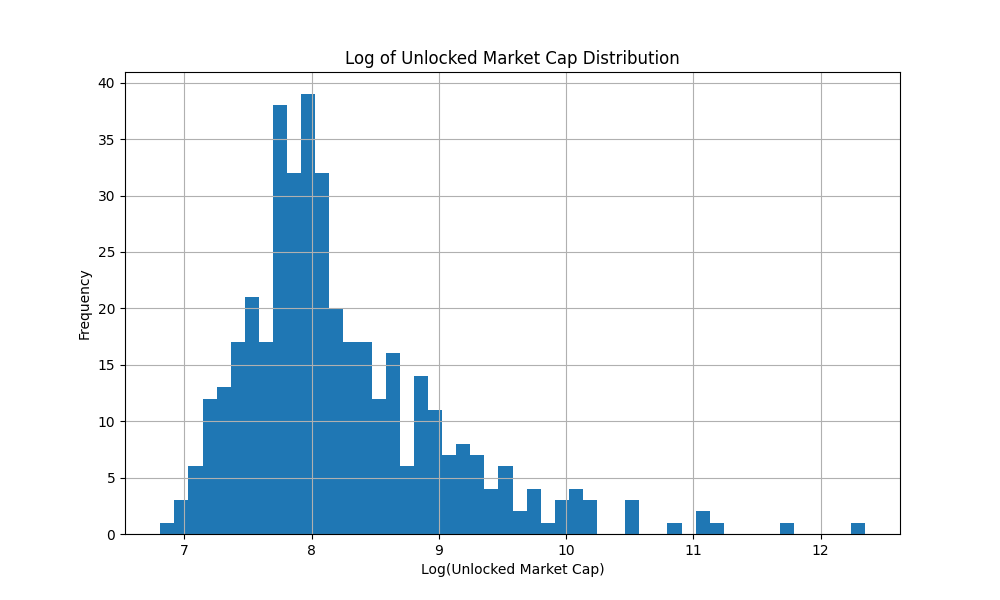
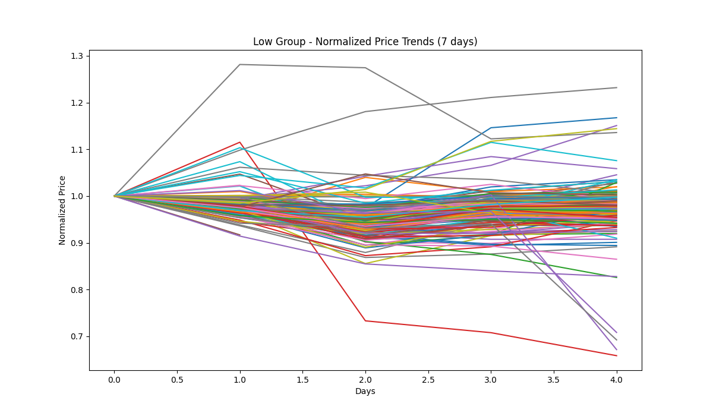
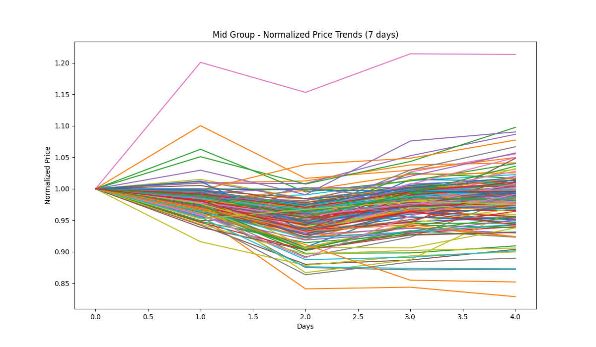
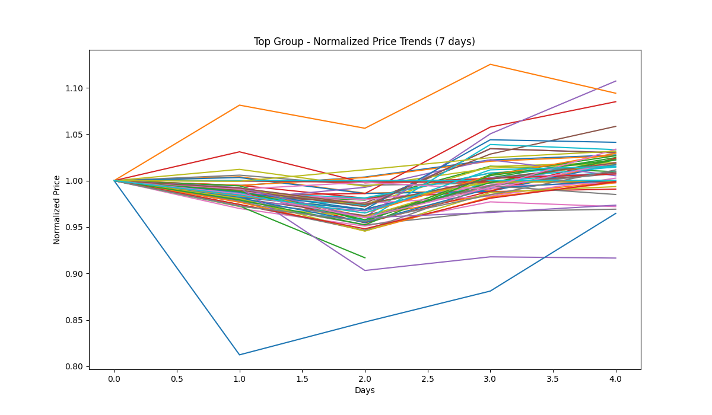

# Cryptocurrency Analysis Report

## Market Cap Distribution

## Low Group Analysis

### Price Trend Consistency

#### Daily Returns Correlation Matrix

|               |    HIVEUSDT |    SIGNUSDT |      SPKUSDT |   PEOPLEUSDT |     BICOUSDT |     TRBUSDT |     XVGUSDT |   CYBERUSDT |    IOSTUSDT |      POWRUSDT |     YGGUSDT |       CVCUSDT |     API3USDT |   MANTAUSDT |     WAXPUSDT |     ACXUSDT |   PIXELUSDT |     ILVUSDT |    STRAXUSDT |   FIDAUSDT |      BNTUSDT |   ANIMEUSDT |     DIAUSDT |     DOLOUSDT |    ARDRUSDT |   AUDIOUSDT |     PHAUSDT |      ARKUSDT |      ACTUSDT |     CHRUSDT |     XAIUSDT |    AEVOUSDT |   SPELLUSDT |    FLUXUSDT |    LQTYUSDT |   PUNDIXUSDT |      IQUSDT |     EDUUSDT |   CETUSUSDT |   BANANAUSDT |     DYMUSDT |    DENTUSDT |      LSKUSDT |    USTCUSDT |   USUALUSDT |   SOMIUSDT |   COOKIEUSDT |      SAGAUSDT |     KNCUSDT |     ONGUSDT |    GLMRUSDT |    CGPTUSDT |   STEEMUSDT |    DOGSUSDT |    PONDUSDT |      USDPUSDT |     JOEUSDT |    CTSIUSDT |     XUSDUSDT |   BANANAS31USDT |     EPICUSDT |     SOLVUSDT |      GNSUSDT |   MAGICUSDT |     SCRUSDT |     SLPUSDT |      MTLUSDT |    NTRNUSDT |    SOPHUSDT |     CELRUSDT |    MOVRUSDT |       OGUSDT |   AUCTIONUSDT |      LAUSDT |     TUTUSDT |     AGLDUSDT |      RIFUSDT |      MAVUSDT |    LISTAUSDT |   NEWTUSDT |    HFTUSDT |    EURIUSDT |     TREEUSDT |    SCRTUSDT |    WCTUSDT |    HUMAUSDT |      OXTUSDT |     AEURUSDT |    VANRYUSDT |      INITUSDT |       QIUSDT |     WINUSDT |    HYPERUSDT |   TOWNSUSDT |     NILUSDT |     CTKUSDT |     C98USDT |       AIUSDT |     QKCUSDT |    TNSRUSDT |     REZUSDT |     PYRUSDT |      RAREUSDT |   HMSTRUSDT |       A2ZUSDT |   KERNELUSDT |   PARTIUSDT |   RESOLVUSDT |      OGNUSDT |     MBLUSDT |      ATAUSDT |   LUMIAUSDT |   FORTHUSDT |     TRUUSDT |    HIGHUSDT |    THEUSDT |      AVAUSDT |      ACEUSDT |   ALICEUSDT |        CUSDT |   SHELLUSDT |     RADUSDT |     MITOUSDT |      ACAUSDT |     ARPAUSDT |     SYSUSDT |    DODOUSDT |   ALPINEUSDT |     GTCUSDT |      TKOUSDT |     HEIUSDT |     PHBUSDT |    DUSKUSDT |      NFPUSDT |    CATIUSDT |   HAEDALUSDT |     HOOKUSDT |    IDEXUSDT |   MUBARAKUSDT |     MBOXUSDT |    VICUSDT |      DFUSDT |    RDNTUSDT |      BMTUSDT |      TLMUSDT |    DEGOUSDT |     GPSUSDT |     GUNUSDT |   PORTALUSDT |   SANTOSUSDT |     MLNUSDT |    ALCXUSDT |    GHSTUSDT |     TSTUSDT |     SYNUSDT |     UTKUSDT |     WANUSDT |      NKNUSDT |        DUSDT |    QUICKUSDT |     ADXUSDT |     BELUSDT |    FARMUSDT |    DATAUSDT |     ASRUSDT |     STOUSDT |      PSGUSDT |     PERPUSDT |     COSUSDT |      MDTUSDT |      FIOUSDT |     FLMUSDT |      BARUSDT |     REIUSDT |      BAKEUSDT |     BIFIUSDT |   CHESSUSDT |     VOXELUSDT |     FISUSDT |    PIVXUSDT |     JUVUSDT |    LAZIOUSDT |     CITYUSDT |   PORTOUSDT |      HIFIUSDT |      ATMUSDT |      ACMUSDT |      SLFUSDT |      MKRUSDT |
|:--------------|------------:|------------:|-------------:|-------------:|-------------:|------------:|------------:|------------:|------------:|--------------:|------------:|--------------:|-------------:|------------:|-------------:|------------:|------------:|------------:|-------------:|-----------:|-------------:|------------:|------------:|-------------:|------------:|------------:|------------:|-------------:|-------------:|------------:|------------:|------------:|------------:|------------:|------------:|-------------:|------------:|------------:|------------:|-------------:|------------:|------------:|-------------:|------------:|------------:|-----------:|-------------:|--------------:|------------:|------------:|------------:|------------:|------------:|------------:|------------:|--------------:|------------:|------------:|-------------:|----------------:|-------------:|-------------:|-------------:|------------:|------------:|------------:|-------------:|------------:|------------:|-------------:|------------:|-------------:|--------------:|------------:|------------:|-------------:|-------------:|-------------:|-------------:|-----------:|-----------:|------------:|-------------:|------------:|-----------:|------------:|-------------:|-------------:|-------------:|--------------:|-------------:|------------:|-------------:|------------:|------------:|------------:|------------:|-------------:|------------:|------------:|------------:|------------:|--------------:|------------:|--------------:|-------------:|------------:|-------------:|-------------:|------------:|-------------:|------------:|------------:|------------:|------------:|-----------:|-------------:|-------------:|------------:|-------------:|------------:|------------:|-------------:|-------------:|-------------:|------------:|------------:|-------------:|------------:|-------------:|------------:|------------:|------------:|-------------:|------------:|-------------:|-------------:|------------:|--------------:|-------------:|-----------:|------------:|------------:|-------------:|-------------:|------------:|------------:|------------:|-------------:|-------------:|------------:|------------:|------------:|------------:|------------:|------------:|------------:|-------------:|-------------:|-------------:|------------:|------------:|------------:|------------:|------------:|------------:|-------------:|-------------:|------------:|-------------:|-------------:|------------:|-------------:|------------:|--------------:|-------------:|------------:|--------------:|------------:|------------:|------------:|-------------:|-------------:|------------:|--------------:|-------------:|-------------:|-------------:|-------------:|
| HIVEUSDT      |   1         |   0.625685  |   0.0632466  |     0.945488 |   0.475787   |   0.965535  |   0.80017   |   0.907506  |   0.933254  |   0.905677    |   0.766448  |   0.98988     |   0.724349   |   0.917645  |   0.96042    |   0.767105  |   0.952947  |   0.924164  |   0.872741   |   0.883761 |   0.867294   |   0.979987  |   0.885158  |   0.0707297  |   0.845525  |    0.859617 |   0.734875  |   0.953228   |   0.834295   |   0.765063  |   0.872137  |   0.951775  |   0.988742  |   0.825904  |   0.800379  |   0.995968   |   0.975185  |   0.88141   |   0.962106  |    0.613399  |   0.775104  |   0.906667  |   0.972805   |   0.97539   |   0.876763  |        nan |   0.901546   |   0.919923    |   0.704068  |   0.874067  |   0.878175  |   0.884994  |   0.815354  |   0.971732  |   0.766897  |  -0.455107    |   0.310471  |   0.769854  |  -0.105737   |      0.451578   |   0.693066   |   0.862667   |   0.881286   |   0.987406  |   0.889079  |   0.903528  |   0.997561   |   0.963026  |   0.973578  |   0.967842   |   0.76676   |  -0.278668   |     0.941061  |   0.985959  |   0.704428  |   0.95868    |   0.92226    |  -0.920539   |   0.663602   |   0.876524 |   0.852989 |  -0.791685  |   0.6344     |   0.974529  |   0.869676 |   0.885477  |   0.972204   |   0.705033   |   0.916939   |   0.979143    |   0.984773   |   0.945615  |   0.869322   |   0.800297  |   0.56733   |   0.968427  |   0.968991  |   0.250748   |   0.947115  |   0.875887  |   0.929996  |   0.935164  |   0.965969    |    0.941115 |   0.100182    |   0.415433   |   0.181782  |    0.75218   |   0.930487   |   0.969319  |   0.962938   |   0.662044  |    0.916062 |   0.983189  |   0.953813  |   0.853456 |   0.954945   |   0.955685   |   0.863551  |   0.276167   |   0.832303  |   0.855289  |   0.12553    |   0.882082   |   0.985933   |   0.997364  |   0.981179  |  -0.600813   |   0.76749   |   0.215871   |   0.68124   |   0.97439   |   0.980396  |   0.891162   |   0.93915   |    0.967584  |   0.931542   |  -0.800368  |     0.876376  |   0.890772   |   0.869865 |   0.985645  |   0.96306   |   0.79807    |   0.891456   |   0.60357   |   0.876988  |   0.995475  |    0.928512  |   0.288224   |   0.97459   |   0.847364  |   0.997602  |   0.763845  |   0.856545  |   0.765424  |   0.997547  |   0.888022   |   0.989195   |   0.383931   |   0.980265  |   0.985048  |   0.931538  |   0.792793  |   0.774637  |   0.801739  |   0.973061   |   0.727216   |   0.884648  |  -0.129633   |   0.754775   |   0.983068  |   0.924455   |   0.983094  |  -0.135854    |   0.710428   |   0.96258   |   0.881376    |  -0.964106  |   0.990221  |   0.872734  |   0.890828   |   0.898011   |   0.828186  |  -0.250346    |  -0.487379   |   0.923494   |  -0.166227   |   0.866733   |
| SIGNUSDT      |   0.625685  |   1         |   0.166376   |     0.785465 |   0.9501     |   0.80666   |   0.345473  |   0.879699  |   0.86413   |   0.668046    |   0.658425  |   0.56336     |   0.90941    |   0.791514  |   0.694264   |   0.971084  |   0.760181  |   0.873069  |   0.920067   |   0.574184 |   0.85267    |   0.735143  |   0.740265  |   0.590555   |   0.385156  |    0.852679 |   0.839057  |   0.544697   |   0.805531   |   0.710248  |   0.899736  |   0.749667  |   0.734369  |   0.447776  |   0.681285  |   0.604041   |   0.44272   |   0.767827  |   0.524106  |    0.845068  |   0.700124  |   0.623946  |   0.430231   |   0.652026  |   0.878992  |        nan |   0.888917   |   0.675835    |   0.811051  |   0.924202  |   0.789299  |   0.245592  |   0.942602  |   0.790801  |   0.900803  |  -0.97536     |   0.855748  |   0.171121  |  -0.513412   |      0.798462   |   0.837327   |   0.682697   |   0.583196   |   0.565557  |   0.686639  |   0.899258  |   0.63276    |   0.549234  |   0.776986  |   0.689649   |   0.83359   |  -0.600191   |     0.77477   |   0.507661  |   0.666553  |   0.385872   |   0.276162   |  -0.710187   |   0.900063   |   0.856887 |   0.412109 |  -0.319472  |   0.95944    |   0.750659  |   0.84962  |   0.800297  |   0.771855   |   0.86191    |   0.668416   |   0.701962    |   0.531554   |   0.823832  |   0.922568   |   0.94827   |   0.988368  |   0.628375  |   0.761979  |   0.0391414  |   0.706329  |   0.749597  |   0.783978  |   0.829061  |   0.449231    |    0.79205  |  -0.709835    |   0.684315   |   0.0714436 |    0.965547  |   0.631125   |   0.414773  |   0.427222   |   0.770856  |    0.83146  |   0.569391  |   0.794267  |   0.870572 |   0.435202   |   0.664825   |   0.690032  |   0.836831   |   0.947687  |   0.933998  |   0.408623   |   0.470658   |   0.494921   |   0.677799  |   0.755455  |  -0.177813   |   0.622315  |   0.690875   |  -0.0934496 |   0.760112  |   0.763928  |   0.764873   |   0.700955  |    0.785267  |   0.864412   |  -0.114329  |     0.82538   |   0.72431    |   0.835111 |   0.612553  |   0.715666  |   0.762848   |   0.774752   |   0.942785  |   0.690142  |   0.576518  |    0.665289  |  -0.339548   |   0.739621  |   0.939763  |   0.656483  |   0.981057  |   0.690993  |   0.896029  |   0.580101  |   0.288574   |   0.587206   |   0.107598   |   0.593844  |   0.592134  |   0.552145  |   0.919222  |   0.966106  |   0.680046  |   0.698927   |   0.76378    |   0.817224  |   0.520062   |  -0.0384365  |   0.543474  |   0.313901   |   0.616073  |  -0.649485    |  -0.0994646  |   0.71593   |   0.190185    |  -0.680342  |   0.613184  |   0.671438  |   0.664642   |   0.282238   |   0.497846  |  -0.595029    |  -0.730044   |   0.703296   |  -0.528154   |   0.163276   |
| SPKUSDT       |   0.0632466 |   0.166376  |   1          |    -0.106994 |  -0.102115   |   0.0854261 |   0.575419  |   0.249183  |   0.120256  |  -0.318966    |  -0.505038  |  -0.0696005   |  -0.218653   |  -0.175681  |  -0.167493   |   0.0295249 |  -0.120685  |   0.174455  |   0.0426069  |  -0.399667 |   0.414625   |  -0.0338932 |   0.487932  |  -0.581118   |  -0.469893  |   -0.188553 |  -0.340095  |  -0.240859   |  -0.296346   |  -0.466057  |  -0.0509622 |  -0.138758  |   0.105841  |   0.58616   |   0.632796  |   0.143975   |   0.0801997 |  -0.275675  |   0.294479  |    0.65042   |  -0.465886  |  -0.340027  |   0.0602036  |  -0.140228  |  -0.0999711 |        nan |   0.00897022 |  -0.285688    |  -0.398065  |   0.17855   |  -0.255306  |  -0.250942  |  -0.022722  |   0.0713277 |  -0.205794  |  -0.266672    |  -0.26551   |  -0.507201  |   0.700119   |     -0.453643   |   0.622116   |   0.548533   |   0.525969   |  -0.0895726 |  -0.336234  |   0.10738   |  -0.00298192 |  -0.206803  |   0.0211914 |   0.302546   |   0.5695    |   0.671687   |    -0.137998  |  -0.0499707 |   0.72974   |   0.0904113  |  -0.029752   |  -0.431532   |  -0.266915   |  -0.150573 |  -0.461862 |   0.545679  |   0.431575   |   0.221867  |  -0.177257 |  -0.228431  |  -0.00702656 |   0.585612   |  -0.296558   |  -0.0847148   |  -0.0891294  |   0.237433  |   0.0421976  |   0.315513  |   0.303029  |  -0.17791   |  -0.0497078 |  -0.950231   |   0.36508   |  -0.303851  |  -0.155823  |  -0.0538328 |  -0.134052    |   -0.110337 |  -0.249334    |  -0.603121   |  -0.964108  |    0.326014  |   0.424428   |   0.0168665 |   0.171307   |  -0.468593  |   -0.111032 |  -0.117609  |  -0.0577631 |  -0.16372  |   0.234984   |  -0.20294    |  -0.373343  |  -0.283537   |   0.228261  |   0.0545393 |  -0.80685    |   0.491253   |  -0.0212459  |   0.0966214 |   0.156597  |  -0.743075   |   0.683364  |  -0.527928   |  -0.364002  |  -0.0208637 |   0.0540054 |  -0.262528   |   0.389509  |    0.200141  |   0.161105   |  -0.302539  |    -0.207175  |  -0.303613   |  -0.202412 |  -0.104687  |  -0.138974  |  -0.385943   |  -0.250603   |   0.483775  |  -0.353241  |  -0.0197343 |   -0.273471  |  -0.767143   |  -0.0589153 |   0.0608192 |   0.0152155 |   0.130147  |  -0.382465  |  -0.217247  |   0.0131722 |   0.302768   |  -0.082742   |  -0.897017   |  -0.135162  |   0.224125  |  -0.303446  |   0.411887  |   0.0133779 |   0.631604  |  -0.116156   |  -0.441853   |  -0.205286  |  -0.497286   |  -0.0996088  |  -0.1089    |   0.175034   |  -0.11791   |  -0.792536    |   0.0251277  |  -0.140431  |   0.0722242   |   0.165607  |   0.198429  |  -0.372588  |  -0.347702   |   0.249715   |  -0.503123  |  -0.883453    |   0.552408   |  -0.258365   |  -0.908923   |  -0.135091   |
| PEOPLEUSDT    |   0.945488  |   0.785465  |  -0.106994   |     1        |   0.715025   |   0.981249  |   0.588046  |   0.930313  |   0.971053  |   0.973525    |   0.907908  |   0.943837    |   0.907046   |   0.9965    |   0.990737   |   0.907697  |   0.999203  |   0.956065  |   0.963678   |   0.940646 |   0.855717   |   0.991351  |   0.812304  |   0.390403   |   0.859026  |    0.979    |   0.915152  |   0.946836   |   0.966382   |   0.917383  |   0.975847  |   0.998389  |   0.967616  |   0.641734  |   0.697889  |   0.917426   |   0.857261  |   0.98275   |   0.831455  |    0.616771  |   0.921018  |   0.962735  |   0.855257   |   0.980526  |   0.982173  |        nan |   0.980632   |   0.979666    |   0.894825  |   0.937099  |   0.983828  |   0.790438  |   0.943827  |   0.983037  |   0.932309  |  -0.630257    |   0.594703  |   0.733897  |  -0.413436   |      0.717363   |   0.678308   |   0.761989   |   0.744302   |   0.947093  |   0.97182   |   0.964808  |   0.960425   |   0.948376  |   0.990084  |   0.894046   |   0.742123  |  -0.565422   |     0.999503  |   0.916546  |   0.601607  |   0.822357   |   0.781542   |  -0.839325   |   0.869512   |   0.984783 |   0.87256  |  -0.811969  |   0.72044    |   0.938336  |   0.982835 |   0.987422  |   0.993246   |   0.703793   |   0.977111   |   0.989543    |   0.932723   |   0.940424  |   0.962171   |   0.862587  |   0.709335  |   0.974894  |   0.996429  |   0.400769   |   0.871572  |   0.97811   |   0.998558  |   0.996917  |   0.898667    |    0.999906 |  -0.131185    |   0.681402   |   0.364996  |    0.831406  |   0.819412   |   0.856354  |   0.823202   |   0.864548  |    0.996033 |   0.95139   |   0.998769  |   0.975682 |   0.806643   |   0.984155   |   0.962302  |   0.566582   |   0.904442  |   0.953415  |   0.412674   |   0.711435   |   0.905762   |   0.955352  |   0.958892  |  -0.345446   |   0.641599  |   0.521679   |   0.542371  |   0.993538  |   0.983319  |   0.986005   |   0.858572  |    0.950464  |   0.961173   |  -0.562564  |     0.985329  |   0.979769   |   0.98308  |   0.9661    |   0.994346  |   0.943519   |   0.987259   |   0.680676  |   0.967879  |   0.942053  |    0.979512  |   0.251546   |   0.994375  |   0.948368  |   0.965181  |   0.88743   |   0.959473  |   0.931945  |   0.937839  |   0.689937   |   0.954804   |   0.511718   |   0.961881  |   0.887982  |   0.947043  |   0.825952  |   0.914852  |   0.698689  |   0.990709   |   0.903956   |   0.988017  |   0.200266   |   0.559661   |   0.940029  |   0.753091   |   0.968338  |  -0.165916    |   0.478389   |   0.994402  |   0.698609    |  -0.987974  |   0.904904  |   0.962108  |   0.967563   |   0.706283   |   0.894363  |  -0.210494    |  -0.73982    |   0.986413   |  -0.119209   |   0.722424   |
| BICOUSDT      |   0.475787  |   0.9501    |  -0.102115   |     0.715025 |   1          |   0.681472  |   0.0602454 |   0.731092  |   0.743661  |   0.6495      |   0.71983   |   0.444278    |   0.933169   |   0.746803  |   0.625534   |   0.925075  |   0.688654  |   0.740711  |   0.841257   |   0.570458 |   0.663389   |   0.630588  |   0.512308  |   0.812797   |   0.384492  |    0.83186  |   0.885026  |   0.478386   |   0.813814   |   0.767893  |   0.844295  |   0.682025  |   0.589197  |   0.167357  |   0.423718  |   0.429868   |   0.269692  |   0.755438  |   0.305168  |    0.643817  |   0.754263  |   0.605291  |   0.26162    |   0.567076  |   0.833425  |        nan |   0.809215   |   0.646052    |   0.875999  |   0.808047  |   0.774753  |   0.157833  |   0.897041  |   0.66613   |   0.910801  |  -0.930959    |   0.973905  |   0.169165  |  -0.751079   |      0.931078   |   0.625883   |   0.435315   |   0.325166   |   0.452812  |   0.678825  |   0.793257  |   0.502618   |   0.472001  |   0.663995  |   0.488736   |   0.620472  |  -0.804317   |     0.712463  |   0.376759  |   0.400757  |   0.206169   |   0.123235   |  -0.486369   |   0.948932   |   0.822498 |   0.411127 |  -0.342745  |   0.829069   |   0.578548  |   0.823131 |   0.778186  |   0.666295   |   0.661196   |   0.641314   |   0.607337    |   0.414836   |   0.663086  |   0.844925   |   0.813115  |   0.911629  |   0.552265  |   0.667628  |   0.253467   |   0.494712  |   0.743815  |   0.730159  |   0.751781  |   0.338272    |    0.724324 |  -0.754382    |   0.851181   |   0.30853   |    0.840007  |   0.396888   |   0.256888  |   0.229601   |   0.859071  |    0.774391 |   0.465797  |   0.709576  |   0.846522 |   0.222713   |   0.603089   |   0.698375  |   0.964847   |   0.829752  |   0.857422  |   0.657983   |   0.207456   |   0.354427   |   0.525995  |   0.600597  |   0.132957   |   0.350136  |   0.880421   |  -0.150412  |   0.656389  |   0.63871   |   0.746382   |   0.483585  |    0.625138  |   0.733047   |   0.125463  |     0.802589  |   0.712002   |   0.813656 |   0.510462  |   0.641261  |   0.798111   |   0.754181   |   0.802402  |   0.69007   |   0.444156  |    0.628925  |  -0.233002   |   0.64372   |   0.863892  |   0.524377  |   0.909209  |   0.70348   |   0.90889   |   0.43866   |   0.0526063  |   0.474999   |   0.287643   |   0.498902  |   0.396581  |   0.508742  |   0.755246  |   0.922308  |   0.422358  |   0.613903   |   0.829761   |   0.791086  |   0.752767   |  -0.177091   |   0.434135  |   0.108765   |   0.51864   |  -0.485552    |  -0.271064   |   0.642065  |   0.00663143  |  -0.608496  |   0.426364  |   0.675198  |   0.656773   |   0.0579875  |   0.524698  |  -0.374429    |  -0.87345    |   0.668757   |  -0.3098     |   0.0366958  |
| TRBUSDT       |   0.965535  |   0.80666   |   0.0854261  |     0.981249 |   0.681472   |   1         |   0.710687  |   0.977703  |   0.994302  |   0.91552     |   0.810442  |   0.939346    |   0.857842   |   0.963499  |   0.962947   |   0.906364  |   0.978628  |   0.989441  |   0.968813   |   0.868834 |   0.935156   |   0.989045  |   0.909469  |   0.262997   |   0.777577  |    0.940457 |   0.844349  |   0.908504   |   0.907423   |   0.826124  |   0.963233  |   0.974535  |   0.992831  |   0.764388  |   0.822849  |   0.953714   |   0.884862  |   0.929969  |   0.89843   |    0.7363    |   0.830304  |   0.901808  |   0.879226   |   0.959542  |   0.960649  |        nan |   0.980722   |   0.9283      |   0.812696  |   0.968705  |   0.934378  |   0.756401  |   0.934215  |   0.999605  |   0.886876  |  -0.667553    |   0.527727  |   0.648993  |  -0.265682   |      0.618587   |   0.794447   |   0.871967   |   0.85296    |   0.938583  |   0.909548  |   0.983891  |   0.967292   |   0.916812  |   0.997272  |   0.958353   |   0.849873  |  -0.425118   |     0.974872  |   0.917268  |   0.743561  |   0.853056   |   0.790796   |  -0.92713    |   0.809656   |   0.953957 |   0.792147 |  -0.716153  |   0.794712   |   0.985434  |   0.946824 |   0.943106  |   0.995025   |   0.812443   |   0.923746   |   0.97817     |   0.925136   |   0.987923  |   0.967077   |   0.918513  |   0.75611   |   0.947008  |   0.990057  |   0.220245   |   0.947147  |   0.920175  |   0.969934  |   0.987143  |   0.88403     |    0.980221 |  -0.158653    |   0.55558    |   0.179234  |    0.887759  |   0.908164   |   0.872184  |   0.868708   |   0.768689  |    0.974561 |   0.937201  |   0.989601  |   0.941366 |   0.86418    |   0.950108   |   0.892073  |   0.495754   |   0.944122  |   0.960089  |   0.247331   |   0.816312   |   0.91243    |   0.980474  |   0.993278  |  -0.500431   |   0.777198  |   0.405526   |   0.490287  |   0.992979  |   0.997426  |   0.936106   |   0.938866  |    0.992235  |   0.99235    |  -0.638039  |     0.944279  |   0.922911   |   0.942545 |   0.953352  |   0.971623  |   0.867314   |   0.939435   |   0.764835  |   0.901899  |   0.947088  |    0.931019  |   0.117713   |   0.986932  |   0.955923  |   0.974975  |   0.905404  |   0.887268  |   0.884366  |   0.949255  |   0.762969   |   0.947098   |   0.343006   |   0.943546  |   0.939974  |   0.895765  |   0.901287  |   0.91068   |   0.823482  |   0.973129   |   0.815088   |   0.947753  |   0.0862364  |   0.559538   |   0.928224  |   0.801392   |   0.952852  |  -0.306791    |   0.503166   |   0.971376  |   0.729062    |  -0.961011  |   0.951445  |   0.892742  |   0.903676   |   0.769364   |   0.80302   |  -0.373344    |  -0.624437   |   0.939743   |  -0.286762   |   0.712748   |
| XVGUSDT       |   0.80017   |   0.345473  |   0.575419   |     0.588046 |   0.0602454  |   0.710687  |   1         |   0.719484  |   0.676938  |   0.470501    |   0.228191  |   0.737086    |   0.256669   |   0.518514  |   0.602367   |   0.418851  |   0.597101  |   0.695657  |   0.550945   |   0.437424 |   0.784537   |   0.683352  |   0.88662   |  -0.484633   |   0.429738  |    0.430266 |   0.223759  |   0.609079   |   0.360715   |   0.229786  |   0.504193  |   0.589485  |   0.772677  |   0.993523  |   0.907331  |   0.850646   |   0.853706  |   0.433757  |   0.933281  |    0.669416  |   0.243702  |   0.475913  |   0.84452    |   0.648808  |   0.488424  |        nan |   0.572046   |   0.500926    |   0.170188  |   0.628836  |   0.434186  |   0.64726   |   0.44767   |   0.714715  |   0.30976   |  -0.24205     |  -0.163323  |   0.412969  |   0.489158   |     -0.109093   |   0.735585   |   0.920564   |   0.963474   |   0.722316  |   0.43704   |   0.626698  |   0.757027   |   0.63673   |   0.692925  |   0.881604   |   0.78032   |   0.332702   |     0.569819  |   0.765326  |   0.87277   |   0.864401   |   0.800108   |  -0.900804   |   0.171796   |   0.467391 |   0.431704 |  -0.357057  |   0.521765   |   0.819055  |   0.447944 |   0.452797  |   0.677262   |   0.717343   |   0.494481   |   0.66574     |   0.732685   |   0.771712  |   0.546359   |   0.624873  |   0.370101  |   0.629066  |   0.65323   |  -0.310377   |   0.890596  |   0.418885  |   0.545079  |   0.59195   |   0.718951    |    0.579292 |   0.222753    |  -0.188294   |  -0.399306  |    0.576398  |   0.936282   |   0.82193   |   0.899641   |   0.102771  |    0.539113 |   0.700559  |   0.621348  |   0.431679 |   0.925262   |   0.588304   |   0.38896   |  -0.200839   |   0.606907  |   0.535159  |  -0.491457   |   0.986495   |   0.78658    |   0.797187  |   0.78639   |  -0.960153   |   0.925655  |  -0.346769   |   0.505941  |   0.675894  |   0.723481  |   0.452155   |   0.898696  |    0.786668  |   0.698595   |  -0.930016  |     0.446526  |   0.443358   |   0.439116 |   0.694261  |   0.613369  |   0.289061   |   0.455599   |   0.527224  |   0.413884  |   0.766395  |    0.520473  |  -0.0258392  |   0.661907  |   0.528695  |   0.758634  |   0.469679  |   0.376364  |   0.303498  |   0.78603   |   0.952353   |   0.719914   |  -0.172496   |   0.678389  |   0.890263  |   0.548671  |   0.683648  |   0.418958  |   0.908468  |   0.642739   |   0.18585    |   0.458925  |  -0.610067   |   0.710664   |   0.715155  |   0.905833   |   0.682797  |  -0.34764     |   0.760939   |   0.611954  |   0.850112    |  -0.612347  |   0.872773  |   0.40553   |   0.44044    |   0.934213   |   0.351102  |  -0.53459     |   0.104466   |   0.509901   |  -0.49031    |   0.726449   |
| CYBERUSDT     |   0.907506  |   0.879699  |   0.249183   |     0.930313 |   0.731092   |   0.977703  |   0.719484  |   1         |   0.990921  |   0.821901    |   0.709973  |   0.85386     |   0.844149   |   0.907683  |   0.887038   |   0.931999  |   0.920696  |   0.996932  |   0.97187    |   0.752744 |   0.984569   |   0.936001  |   0.950247  |   0.252718   |   0.629055  |    0.901121 |   0.800396  |   0.800577   |   0.849063   |   0.739395  |   0.949407  |   0.912532  |   0.959113  |   0.785861  |   0.890075  |   0.905158   |   0.806153  |   0.86153   |   0.865881  |    0.860495  |   0.740484  |   0.798335  |   0.79606    |   0.879022  |   0.935686  |        nan |   0.96951    |   0.838517    |   0.760876  |   0.992443  |   0.872687  |   0.613468  |   0.940082  |   0.971854  |   0.866996  |  -0.779261    |   0.565475  |   0.475239  |  -0.22057    |      0.597116   |   0.900487   |   0.91684    |   0.876692   |   0.850841  |   0.818779  |   0.988578  |   0.900826   |   0.813068  |   0.959693  |   0.950687   |   0.935685  |  -0.369398   |     0.918433  |   0.827062  |   0.838455  |   0.770071   |   0.679424   |  -0.949348   |   0.797121   |   0.918199 |   0.647631 |  -0.555202  |   0.899887   |   0.973726  |   0.907105 |   0.885888  |   0.952694   |   0.914771   |   0.831718   |   0.912749    |   0.832829   |   0.99405   |   0.970993   |   0.978097  |   0.857168  |   0.858469  |   0.940406  |   0.044075   |   0.954614  |   0.84571   |   0.913979  |   0.952273  |   0.775806    |    0.930467 |  -0.317409    |   0.500646   |   0.0168596 |    0.959196  |   0.915977   |   0.780815  |   0.803252   |   0.707117  |    0.93458  |   0.846523  |   0.945982  |   0.909382 |   0.810692   |   0.865295   |   0.800369  |   0.533505   |   0.985467  |   0.969796  |   0.167549   |   0.818014   |   0.82462    |   0.93559   |   0.971479  |  -0.541309   |   0.848482  |   0.394803   |   0.312796  |   0.946488  |   0.961708  |   0.867625   |   0.950457  |    0.983543  |   0.995379   |  -0.571746  |     0.895419  |   0.842335   |   0.896887 |   0.870622  |   0.902725  |   0.795056   |   0.874153   |   0.880269  |   0.811054  |   0.870099  |    0.840113  |  -0.0934326  |   0.931687  |   0.968695  |   0.914742  |   0.948056  |   0.795469  |   0.862304  |   0.877375  |   0.708541   |   0.863306   |   0.163579   |   0.854353  |   0.903357  |   0.783088  |   0.972134  |   0.931958  |   0.890128  |   0.903543   |   0.745997   |   0.896635  |   0.110135   |   0.417866   |   0.835013  |   0.725827   |   0.869081  |  -0.499742    |   0.378149   |   0.902377  |   0.626687    |  -0.882723  |   0.913293  |   0.796913  |   0.807647   |   0.704477   |   0.669069  |  -0.553396    |  -0.57232    |   0.857544   |  -0.474172   |   0.577796   |
| IOSTUSDT      |   0.933254  |   0.86413   |   0.120256   |     0.971053 |   0.743661   |   0.994302  |   0.676938  |   0.990921  |   1         |   0.890745    |   0.795925  |   0.897673    |   0.885014   |   0.955666  |   0.938573   |   0.941695  |   0.9642    |   0.998403  |   0.986444   |   0.833201 |   0.953026   |   0.970391  |   0.913078  |   0.315517   |   0.721393  |    0.946308 |   0.859099  |   0.864936   |   0.907969   |   0.818977  |   0.976431  |   0.958556  |   0.976094  |   0.740622  |   0.831668  |   0.920936   |   0.833151  |   0.921096  |   0.862765  |    0.786372  |   0.820801  |   0.871042  |   0.825813   |   0.92889   |   0.969733  |        nan |   0.99061    |   0.903617    |   0.826169  |   0.9896    |   0.928943  |   0.683325  |   0.959582  |   0.990966  |   0.908552  |  -0.743012    |   0.593108  |   0.574023  |  -0.302284   |      0.657276   |   0.834142   |   0.872268   |   0.83846    |   0.897028  |   0.888533  |   0.996932  |   0.93474    |   0.873445  |   0.985658  |   0.942617   |   0.879826  |  -0.453873   |     0.963188  |   0.869587  |   0.763257  |   0.796387   |   0.72208    |  -0.921913   |   0.841372   |   0.959265 |   0.738628 |  -0.65622   |   0.851879   |   0.974753  |   0.951426 |   0.938791  |   0.982329   |   0.853062   |   0.898248   |   0.954438    |   0.879694   |   0.989788  |   0.985386   |   0.953462  |   0.821523  |   0.913409  |   0.975589  |   0.177033   |   0.937095  |   0.909066  |   0.960229  |   0.984595  |   0.82957     |    0.97125  |  -0.262507    |   0.581019   |   0.14734   |    0.930386  |   0.891955   |   0.816328  |   0.818387   |   0.780358  |    0.973203 |   0.895988  |   0.980618  |   0.950633 |   0.817086   |   0.921875   |   0.87351   |   0.562219   |   0.973594  |   0.981623  |   0.266556   |   0.78712    |   0.863795   |   0.955616  |   0.981058  |  -0.471675   |   0.783473  |   0.455471   |   0.395591  |   0.978299  |   0.984148  |   0.92607    |   0.929555  |    0.986122  |   0.999144   |  -0.569971  |     0.944515  |   0.907044   |   0.944802 |   0.917459  |   0.950202  |   0.864701   |   0.930837   |   0.824477  |   0.882291  |   0.907481  |    0.904346  |   0.0276087  |   0.968893  |   0.979178  |   0.945729  |   0.944473  |   0.869404  |   0.905373  |   0.910562  |   0.706668   |   0.908159   |   0.294618   |   0.905294  |   0.908648  |   0.85418   |   0.935544  |   0.94422   |   0.831973  |   0.949025   |   0.819241   |   0.946108  |   0.154043   |   0.469119   |   0.884017  |   0.741452   |   0.917393  |  -0.388669    |   0.4128     |   0.950009  |   0.656457    |  -0.934554  |   0.921591  |   0.870888  |   0.879512   |   0.710045   |   0.761928  |  -0.437779    |  -0.648626   |   0.91863    |  -0.352814   |   0.634026   |
| POWRUSDT      |   0.905677  |   0.668046  |  -0.318966   |     0.973525 |   0.6495     |   0.91552   |   0.470501  |   0.821901  |   0.890745  |   1           |   0.966082  |   0.936586    |   0.879377   |   0.981652  |   0.986894   |   0.826295  |   0.978537  |   0.863749  |   0.889832   |   0.99246  |   0.716164   |   0.957584  |   0.671619  |   0.441725   |   0.944014  |    0.957432 |   0.919566  |   0.973705   |   0.970131   |   0.962094  |   0.922589  |   0.982388  |   0.906896  |   0.511795  |   0.531772  |   0.864017   |   0.833417  |   0.988621  |   0.755984  |    0.421113  |   0.967243  |   0.998284  |   0.836623   |   0.976661  |   0.941028  |        nan |   0.91806    |   0.999349    |   0.912424  |   0.836185  |   0.983181  |   0.849655  |   0.877872  |   0.922097  |   0.904867  |  -0.488717    |   0.564747  |   0.846804  |  -0.49815    |      0.736622   |   0.49242    |   0.614869   |   0.613452   |   0.94341   |   0.998917  |   0.881868  |   0.932716   |   0.968474  |   0.940592  |   0.798834   |   0.570075  |  -0.642201   |     0.980111  |   0.91147   |   0.414069  |   0.802133   |   0.795547   |  -0.714536   |   0.849787   |   0.956011 |   0.953292 |  -0.916854  |   0.55588    |   0.852449  |   0.959816 |   0.980589  |   0.949801   |   0.522837   |   0.999625   |   0.969398    |   0.932622   |   0.842132  |   0.887983   |   0.729024  |   0.563947  |   0.980756  |   0.962318  |   0.593368   |   0.761367  |   0.991301  |   0.981173  |   0.954734  |   0.915735    |    0.97317  |   0.000842001 |   0.741145   |   0.55382   |    0.691835  |   0.705224   |   0.847791  |   0.782694   |   0.898677  |    0.963997 |   0.952603  |   0.96201   |   0.946995 |   0.752421   |   0.990338   |   0.995224  |   0.540819   |   0.789408  |   0.874945  |   0.530804   |   0.599936   |   0.896466   |   0.903092  |   0.885554  |  -0.205251   |   0.470733  |   0.557535   |   0.652863  |   0.954205  |   0.92913   |   0.990036   |   0.743837  |    0.864699  |   0.872749   |  -0.524244  |     0.971154  |   0.996351   |   0.966615 |   0.960084  |   0.982642  |   0.968059   |   0.987866   |   0.50643   |   0.997412  |   0.923794  |    0.998332  |   0.451904   |   0.964791  |   0.867691  |   0.931268  |   0.785046  |   0.993782  |   0.907218  |   0.912814  |   0.635897   |   0.947451   |   0.691883   |   0.963695  |   0.819716  |   0.984447  |   0.676399  |   0.837488  |   0.533001  |   0.976812   |   0.936374   |   0.974727  |   0.234537   |   0.615278   |   0.942409  |   0.722826   |   0.964417  |   0.0560021   |   0.514455   |   0.982934  |   0.700446    |  -0.985465  |   0.839556  |   0.997335  |   0.999427   |   0.663775   |   0.972612  |   0.0183789   |  -0.787565   |   0.997835   |   0.110772   |   0.767299   |
| YGGUSDT       |   0.766448  |   0.658425  |  -0.505038   |     0.907908 |   0.71983    |   0.810442  |   0.228191  |   0.709973  |   0.795925  |   0.966082    |   1         |   0.81568     |   0.90834    |   0.937226  |   0.914472   |   0.806236  |   0.909648  |   0.761739  |   0.834007   |   0.963877 |   0.576009   |   0.860871  |   0.493704  |   0.640971   |   0.906393  |    0.939386 |   0.958426  |   0.892325   |   0.971506   |   0.997311  |   0.882136  |   0.9156    |   0.780143  |   0.278645  |   0.334691  |   0.705964   |   0.665665  |   0.968559  |   0.562272  |    0.291617  |   0.998384  |   0.960889  |   0.671303   |   0.888188  |   0.905773  |        nan |   0.856993   |   0.956799    |   0.965274  |   0.753632  |   0.963434  |   0.735614  |   0.852216  |   0.815713  |   0.919927  |  -0.494551    |   0.690137  |   0.79805   |  -0.699972   |      0.857086   |   0.348755   |   0.420366   |   0.402317   |   0.827434  |   0.97544   |   0.802455  |   0.80846    |   0.87879   |   0.841447  |   0.630143   |   0.419157  |  -0.812837   |     0.9199    |   0.778151  |   0.21745   |   0.626575   |   0.633889   |  -0.534572   |   0.90091    |   0.927172 |   0.916887 |  -0.895763  |   0.48448    |   0.708604  |   0.936663 |   0.955642  |   0.855737   |   0.387827   |   0.958684   |   0.877414    |   0.811426   |   0.714259  |   0.833457   |   0.640352  |   0.538656  |   0.897422  |   0.875847  |   0.731285   |   0.587834  |   0.975063  |   0.928644  |   0.888274  |   0.793963    |    0.910348 |  -0.0925933   |   0.880543   |   0.715984  |    0.615164  |   0.511011   |   0.689315  |   0.596994   |   0.968569  |    0.913791 |   0.843848  |   0.886125  |   0.928449 |   0.557224   |   0.921114   |   0.985653  |   0.674579   |   0.710607  |   0.823148  |   0.731618   |   0.376533   |   0.755272   |   0.76662   |   0.753995  |   0.0525137  |   0.261243  |   0.729399   |   0.551439  |   0.86041   |   0.819649  |   0.964587   |   0.566373  |    0.732648  |   0.770225   |  -0.297279  |     0.948319  |   0.972336   |   0.945985 |   0.855471  |   0.907533  |   0.988513   |   0.961638   |   0.428965  |   0.980728  |   0.793864  |    0.949568  |   0.480627   |   0.875079  |   0.817456  |   0.807379  |   0.747357  |   0.987821  |   0.924099  |   0.776444  |   0.417957   |   0.833354   |   0.79981    |   0.863251  |   0.6462    |   0.921848  |   0.565338  |   0.81806   |   0.335633  |   0.892      |   0.984597   |   0.948215  |   0.451697   |   0.453322   |   0.827567  |   0.526182   |   0.863629  |   0.135951    |   0.327609   |   0.908271  |   0.51342     |  -0.909458  |   0.673519  |   0.98234   |   0.974116   |   0.453027   |   0.964682  |   0.152259    |  -0.907858   |   0.953643   |   0.241488   |   0.620485   |
| CVCUSDT       |   0.98988   |   0.56336   |  -0.0696005  |     0.943837 |   0.444278   |   0.939346  |   0.737086  |   0.85386   |   0.897673  |   0.936586    |   0.81568   |   1           |   0.719739   |   0.923045  |   0.972905   |   0.729236  |   0.954962  |   0.880899  |   0.840749   |   0.93005  |   0.793294   |   0.973925  |   0.810175  |   0.1067     |   0.911545  |    0.860305 |   0.750425  |   0.98444    |   0.850511   |   0.805969  |   0.853098  |   0.956686  |   0.965701  |   0.755727  |   0.70797   |   0.977085   |   0.974082  |   0.89939   |   0.928473  |    0.500658  |   0.81705   |   0.943148  |   0.974921   |   0.987863  |   0.86537   |        nan |   0.876922   |   0.946736    |   0.727472  |   0.824953  |   0.892078  |   0.934565  |   0.78775   |   0.948586  |   0.762921  |  -0.375271    |   0.299049  |   0.851704  |  -0.16297    |      0.47285    |   0.587472   |   0.783076   |   0.811806   |   0.999767  |   0.920256  |   0.866063  |   0.995111   |   0.990087  |   0.95765   |   0.922485   |   0.670836  |  -0.333392   |     0.9438    |   0.997168  |   0.597188  |   0.95942    |   0.943768   |  -0.855939   |   0.663234   |   0.872873 |   0.916522 |  -0.869365  |   0.542128   |   0.935431  |   0.869555 |   0.895597  |   0.96007    |   0.60282    |   0.945477   |   0.981559    |   0.999224   |   0.898613  |   0.837082   |   0.729679  |   0.486503  |   0.986875  |   0.962691  |   0.376101   |   0.892071  |   0.89836   |   0.933909  |   0.923619  |   0.990712    |    0.939274 |   0.182023    |   0.461421   |   0.304027  |    0.677233  |   0.872387   |   0.977708  |   0.951054   |   0.69523   |    0.910722 |   0.998617  |   0.945786  |   0.849633 |   0.934305   |   0.974338   |   0.898119  |   0.266895   |   0.773823  |   0.820211  |   0.203734   |   0.824389   |   0.994411   |   0.979547  |   0.950138  |  -0.520173   |   0.671406  |   0.244272   |   0.759312  |   0.964838  |   0.961519  |   0.908085   |   0.881113  |    0.928627  |   0.890797   |  -0.786497  |     0.881839  |   0.915469   |   0.873838 |   0.996709  |   0.970687  |   0.826829   |   0.906255   |   0.504704  |   0.909575  |   0.998744  |    0.95484   |   0.417315   |   0.971131  |   0.810814  |   0.991323  |   0.712679  |   0.891909  |   0.76313   |   0.99657   |   0.866031   |   0.999346   |   0.50335    |   0.996144  |   0.956561  |   0.969191  |   0.711821  |   0.739399  |   0.709613  |   0.979349   |   0.760094   |   0.890739  |  -0.10726    |   0.799216   |   0.999122  |   0.918094   |   0.99547   |   0.000298908 |   0.741661   |   0.970352  |   0.894291    |  -0.97742   |   0.963739  |   0.908796  |   0.924953   |   0.883425   |   0.89021   |  -0.110967    |  -0.526852   |   0.945235   |  -0.0248129  |   0.906628   |
| API3USDT      |   0.724349  |   0.90941   |  -0.218653   |     0.907046 |   0.933169   |   0.857842  |   0.256669  |   0.844149  |   0.885014  |   0.879377    |   0.90834   |   0.719739    |   1          |   0.931104  |   0.857502   |   0.968825  |   0.892934  |   0.870215  |   0.946123   |   0.826632 |   0.751186   |   0.846275  |   0.635165  |   0.720141   |   0.687546  |    0.973089 |   0.989278  |   0.759365   |   0.968236   |   0.936422  |   0.963867  |   0.890671  |   0.795837  |   0.343215  |   0.513142  |   0.675586   |   0.561042  |   0.940247  |   0.545874  |    0.59897   |   0.9303    |   0.850946  |   0.55758    |   0.815912  |   0.965951  |        nan |   0.939472   |   0.876759    |   0.980517  |   0.899439  |   0.949705  |   0.500038  |   0.975761  |   0.851382  |   0.997917  |  -0.812544    |   0.877646  |   0.50695   |  -0.708539   |      0.932544   |   0.621418   |   0.559906   |   0.49028    |   0.728391  |   0.897331  |   0.911989  |   0.754196   |   0.752746  |   0.858975  |   0.681101   |   0.654816  |  -0.809599   |     0.908679  |   0.665495  |   0.442906  |   0.506442   |   0.451884   |  -0.639357   |   0.99617    |   0.966381 |   0.708577 |  -0.648927  |   0.779538   |   0.76301   |   0.968688 |   0.950516  |   0.864878   |   0.65804    |   0.873968   |   0.837486    |   0.699501   |   0.811087  |   0.947555   |   0.851559  |   0.835674  |   0.808722  |   0.871798  |   0.442493   |   0.66693   |   0.934347  |   0.920354  |   0.921008  |   0.64375     |    0.912725 |  -0.471464    |   0.88525    |   0.458462  |    0.850867  |   0.578903   |   0.560064  |   0.51162    |   0.963748  |    0.939801 |   0.740986  |   0.897989  |   0.977258 |   0.492766   |   0.84521    |   0.908016  |   0.860784   |   0.890805  |   0.949197  |   0.66602    |   0.410272   |   0.644303   |   0.754461  |   0.792711  |  -0.00992397 |   0.438048  |   0.816816   |   0.214648  |   0.860802  |   0.837579  |   0.935176   |   0.651593  |    0.798085  |   0.869705   |  -0.166756  |     0.96128   |   0.916777   |   0.966061 |   0.772453  |   0.865234  |   0.957817   |   0.938991   |   0.739306  |   0.903749  |   0.713417  |    0.865488  |   0.0700773  |   0.858013  |   0.949811  |   0.767075  |   0.939009  |   0.910579  |   0.997877  |   0.704656  |   0.330959   |   0.744173   |   0.510055   |   0.767042  |   0.633503  |   0.783735  |   0.790072  |   0.972431  |   0.512873  |   0.845234   |   0.962996   |   0.955741  |   0.584599   |   0.179043   |   0.716297  |   0.407661   |   0.77968   |  -0.274513    |   0.0721048  |   0.865882  |   0.333552    |  -0.846139  |   0.661631  |   0.894475  |   0.883796   |   0.347693   |   0.789063  |  -0.222144    |  -0.920836   |   0.89016    |  -0.138018   |   0.384801   |
| MANTAUSDT     |   0.917645  |   0.791514  |  -0.175681   |     0.9965   |   0.746803   |   0.963499  |   0.518514  |   0.907683  |   0.955666  |   0.981652    |   0.937226  |   0.923045    |   0.931104   |   1         |   0.985942   |   0.914267  |   0.994927  |   0.937664  |   0.960508   |   0.950929 |   0.821663   |   0.977754  |   0.765733  |   0.461311   |   0.866481  |    0.990061 |   0.943806  |   0.939808   |   0.984323   |   0.946692  |   0.978545  |   0.994951  |   0.943128  |   0.575465  |   0.64223   |   0.882664   |   0.819695  |   0.994441  |   0.783157  |    0.5793    |   0.949196  |   0.969984  |   0.818633   |   0.970578  |   0.987117  |        nan |   0.976632   |   0.984938    |   0.928015  |   0.924008  |   0.995354  |   0.77189   |   0.949981  |   0.965122  |   0.952526  |  -0.637261    |   0.642903  |   0.736865  |  -0.486999   |      0.768368   |   0.637978   |   0.709101   |   0.686651   |   0.928039  |   0.983176  |   0.953964  |   0.938009   |   0.938512  |   0.975032  |   0.853764   |   0.701291  |  -0.631717   |     0.997974  |   0.891515  |   0.543436  |   0.781904   |   0.746139   |  -0.793291   |   0.900098   |   0.992296 |   0.88045  |  -0.824556  |   0.704159   |   0.906944  |   0.992322 |   0.997136  |   0.980085   |   0.666813   |   0.982957   |   0.977967    |   0.91195    |   0.913477  |   0.959362   |   0.844852  |   0.707957  |   0.966857  |   0.986079  |   0.458987   |   0.828739  |   0.991218  |   0.999477  |   0.992422  |   0.877847    |    0.997258 |  -0.156756    |   0.739373   |   0.429914  |    0.816566  |   0.769068   |   0.822304  |   0.778747   |   0.903184  |    0.996992 |   0.934861  |   0.991624  |   0.986221 |   0.758358   |   0.980666   |   0.978043  |   0.617049   |   0.891316  |   0.951109  |   0.487356   |   0.650233   |   0.877917   |   0.928001  |   0.932214  |  -0.265794   |   0.580883  |   0.5858     |   0.525491  |   0.980643  |   0.964743  |   0.996007   |   0.814093  |    0.922946  |   0.942872   |  -0.50075   |     0.995341  |   0.990646   |   0.993635 |   0.950805  |   0.988445  |   0.967855   |   0.996895   |   0.661385  |   0.981371  |   0.917959  |    0.982819  |   0.273618   |   0.98318   |   0.946359  |   0.942696  |   0.887272  |   0.976341  |   0.952837  |   0.911383  |   0.632524   |   0.936312   |   0.562107   |   0.948139  |   0.847263  |   0.946288  |   0.799937  |   0.921921  |   0.642974  |   0.981644   |   0.936518   |   0.996977  |   0.272568   |   0.52198    |   0.921462  |   0.704433   |   0.954357  |  -0.134551    |   0.4307     |   0.98865   |   0.653338    |  -0.982079  |   0.866929  |   0.976265  |   0.97848    |   0.651889   |   0.911351  |  -0.162934    |  -0.792408   |   0.990941   |  -0.0709407  |   0.69189    |
| WAXPUSDT      |   0.96042   |   0.694264  |  -0.167493   |     0.990737 |   0.625534   |   0.962947  |   0.602367  |   0.887038  |   0.938573  |   0.986894    |   0.914472  |   0.972905    |   0.857502   |   0.985942  |   1          |   0.843073  |   0.99533   |   0.918873  |   0.918695   |   0.969546 |   0.805118   |   0.990896  |   0.778301  |   0.330406   |   0.91603   |    0.952703 |   0.882908  |   0.981743   |   0.949042   |   0.914048  |   0.937885  |   0.996782  |   0.962458  |   0.642566  |   0.657275  |   0.931909   |   0.897258  |   0.975891  |   0.848254  |    0.528187  |   0.92042   |   0.984001  |   0.897769   |   0.996991  |   0.950038  |        nan |   0.945258   |   0.992073    |   0.865827  |   0.885945  |   0.972384  |   0.864702  |   0.891416  |   0.968522  |   0.88849   |  -0.519022    |   0.507709  |   0.81722   |  -0.374527   |      0.663491   |   0.60132    |   0.731868   |   0.732848   |   0.976364  |   0.981084  |   0.923934  |   0.976735   |   0.982282  |   0.98004   |   0.885259   |   0.676429  |  -0.531718   |     0.992697  |   0.953059  |   0.548167  |   0.868919   |   0.846088   |  -0.816472   |   0.816429   |   0.958195 |   0.925872 |  -0.876201  |   0.62552    |   0.924141  |   0.957708 |   0.973977  |   0.985024   |   0.625864   |   0.990788   |   0.996307    |   0.966994   |   0.910785  |   0.916419   |   0.793424  |   0.607508  |   0.99583   |   0.991164  |   0.46329    |   0.855168  |   0.974643  |   0.989777  |   0.977418  |   0.945528    |    0.989247 |   0.00190645  |   0.647465   |   0.415075  |    0.753543  |   0.81038    |   0.902693  |   0.860405   |   0.839932  |    0.97634  |   0.980746  |   0.987033  |   0.944836 |   0.839015   |   0.99896    |   0.969635  |   0.479339   |   0.842712  |   0.903738  |   0.396911   |   0.719138   |   0.943066   |   0.960429  |   0.94744   |  -0.35598    |   0.604305  |   0.460524   |   0.650889  |   0.987984  |   0.974735  |   0.980185   |   0.841069  |    0.930957  |   0.926745   |  -0.624484  |     0.966019  |   0.981969   |   0.961296 |   0.988444  |   0.999373  |   0.932417   |   0.979429   |   0.582622  |   0.975908  |   0.967625  |    0.99405   |   0.370024   |   0.993641  |   0.896611  |   0.977022  |   0.816667  |   0.966228  |   0.889181  |   0.961715  |   0.734698   |   0.980609   |   0.576686   |   0.987805  |   0.899721  |   0.980893  |   0.756445  |   0.852552  |   0.658476  |   0.998559   |   0.886859   |   0.97086   |   0.124658   |   0.65702    |   0.973063  |   0.803431   |   0.990388  |  -0.0468494   |   0.57497    |   0.999393  |   0.767631    |  -0.999764  |   0.915018  |   0.973381  |   0.98095    |   0.755405   |   0.933113  |  -0.109379    |  -0.704918   |   0.993793   |  -0.0177811  |   0.802625   |
| ACXUSDT       |   0.767105  |   0.971084  |   0.0295249  |     0.907697 |   0.925075   |   0.906364  |   0.418851  |   0.931999  |   0.941695  |   0.826295    |   0.806236  |   0.729236    |   0.968825   |   0.914267  |   0.843073   |   1         |   0.890238  |   0.940054  |   0.982662   |   0.752631 |   0.878574   |   0.865378  |   0.780283  |   0.582686   |   0.594229  |    0.952115 |   0.928078  |   0.725818   |   0.919897   |   0.844183  |   0.977279  |   0.883442  |   0.849468  |   0.50927   |   0.691505  |   0.737947   |   0.60625   |   0.897852  |   0.643923  |    0.778313  |   0.838275  |   0.79244   |   0.597743   |   0.808268  |   0.967302  |        nan |   0.968227   |   0.832234    |   0.904182  |   0.969431  |   0.912372  |   0.460568  |   0.995051  |   0.896487  |   0.970841  |  -0.894723    |   0.824966  |   0.401375  |  -0.542189   |      0.836585   |   0.795619   |   0.719031   |   0.643679   |   0.732937  |   0.839734  |   0.96503   |   0.780668   |   0.727822  |   0.891719  |   0.782291   |   0.817788  |  -0.654808   |     0.901543  |   0.679378  |   0.642754  |   0.553422   |   0.467813   |  -0.771259   |   0.951663   |   0.955157 |   0.617574 |  -0.535328  |   0.906315   |   0.844914  |   0.950705 |   0.920024  |   0.890627   |   0.823704   |   0.826656   |   0.843878    |   0.703884   |   0.896594  |   0.983929   |   0.953626  |   0.929486  |   0.791512  |   0.886924  |   0.215144   |   0.783103  |   0.884788  |   0.908638  |   0.934747  |   0.636147    |    0.912492 |  -0.534777    |   0.751017   |   0.226294  |    0.954498  |   0.708802   |   0.589403  |   0.578829   |   0.868857  |    0.939057 |   0.73857   |   0.910982  |   0.962351 |   0.575481   |   0.82178    |   0.840728  |   0.802758   |   0.972181  |   0.988347  |   0.473262   |   0.554464   |   0.665163   |   0.805678  |   0.858765  |  -0.207602   |   0.627701  |   0.696438   |   0.140545  |   0.88313   |   0.878463  |   0.89622    |   0.773548  |    0.874704  |   0.936383   |  -0.260472  |     0.935953  |   0.867468   |   0.941812 |   0.773536  |   0.858005  |   0.886357   |   0.903033   |   0.878085  |   0.841713  |   0.735377  |    0.824099  |  -0.113764   |   0.87087   |   0.990354  |   0.798166  |   0.99489   |   0.840893  |   0.967923  |   0.73477   |   0.427856   |   0.750573   |   0.299312   |   0.760397  |   0.715226  |   0.734351  |   0.915461  |   0.999784  |   0.690967  |   0.843741   |   0.876152   |   0.93102   |   0.462626   |   0.171952   |   0.715857  |   0.474185   |   0.777476  |  -0.476411    |   0.0942444  |   0.858285  |   0.373047    |  -0.832173  |   0.737291  |   0.827472  |   0.823287   |   0.431751   |   0.687876  |  -0.448713    |  -0.801025   |   0.8526     |  -0.368466   |   0.372856   |
| PIXELUSDT     |   0.952947  |   0.760181  |  -0.120685   |     0.999203 |   0.688654   |   0.978628  |   0.597101  |   0.920696  |   0.9642    |   0.978537    |   0.909648  |   0.954962    |   0.892934   |   0.994927  |   0.99533    |   0.890238  |   1         |   0.948002  |   0.952519   |   0.949952 |   0.844516   |   0.993648  |   0.806519  |   0.369756   |   0.876446  |    0.972437 |   0.905771  |   0.958865   |   0.961986   |   0.916291  |   0.966397  |   0.999789  |   0.969138  |   0.64681   |   0.690526  |   0.925102   |   0.872341  |   0.981753  |   0.840423  |    0.594431  |   0.920784  |   0.970052  |   0.871003   |   0.987468  |   0.974282  |        nan |   0.972315   |   0.984574    |   0.886087  |   0.924683  |   0.981522  |   0.814188  |   0.929967  |   0.981519  |   0.920104  |  -0.598893    |   0.567917  |   0.758939  |  -0.398747   |      0.700156   |   0.659571   |   0.757597   |   0.745524   |   0.958183  |   0.975465  |   0.95527   |   0.967997   |   0.96028   |   0.989702  |   0.895298   |   0.726772  |  -0.552898   |     0.9993    |   0.930009  |   0.590534  |   0.839431   |   0.803438   |  -0.836764   |   0.853947   |   0.978348 |   0.888915 |  -0.831099  |   0.695246   |   0.937601  |   0.976705 |   0.98465   |   0.993286   |   0.684638   |   0.982348   |   0.993801    |   0.945326   |   0.934994  |   0.950768   |   0.845127  |   0.681287  |   0.983005  |   0.997166  |   0.416127   |   0.87074   |   0.978001  |   0.997646  |   0.993225  |   0.91484     |    0.998658 |  -0.091641    |   0.669478   |   0.376333  |    0.811225  |   0.821041   |   0.873057  |   0.837811   |   0.856711  |    0.991974 |   0.962369  |   0.997465  |   0.967834 |   0.820052   |   0.990259   |   0.965126  |   0.539549   |   0.88893   |   0.94084   |   0.404583   |   0.718318   |   0.919595   |   0.959963  |   0.958713  |  -0.353581   |   0.635385  |   0.501304   |   0.575473  |   0.994331  |   0.983546  |   0.985408   |   0.857495  |    0.948     |   0.953908   |  -0.584839  |     0.980848  |   0.98142    |   0.977852 |   0.975015  |   0.997789  |   0.940517   |   0.986107   |   0.654684  |   0.97104   |   0.952356  |    0.985145  |   0.284816   |   0.99646   |   0.935168  |   0.971479  |   0.868552  |   0.962062  |   0.920005  |   0.947781  |   0.707235   |   0.964877   |   0.528411   |   0.971731  |   0.895158  |   0.958411  |   0.808802  |   0.898045  |   0.691446  |   0.995139   |   0.898695   |   0.984219  |   0.174729   |   0.590761   |   0.952163  |   0.771604   |   0.977097  |  -0.133702    |   0.509698   |   0.997826  |   0.722216    |  -0.993353  |   0.911484  |   0.966155  |   0.972412   |   0.724693   |   0.906045  |  -0.184442    |  -0.728022   |   0.989928   |  -0.0929543  |   0.748452   |
| ILVUSDT       |   0.924164  |   0.873069  |   0.174455   |     0.956065 |   0.740711   |   0.989441  |   0.695657  |   0.996932  |   0.998403  |   0.863749    |   0.761739  |   0.880899    |   0.870215   |   0.937664  |   0.918873   |   0.940054  |   0.948002  |   1         |   0.982671   |   0.801138 |   0.96834    |   0.957943  |   0.930484  |   0.29069    |   0.683927  |    0.929602 |   0.836695  |   0.839537   |   0.885424   |   0.787568  |   0.967415  |   0.941281  |   0.970911  |   0.760707  |   0.857783  |   0.915956   |   0.823112  |   0.898198  |   0.865477  |    0.819385  |   0.789065  |   0.842333  |   0.814594   |   0.90979   |   0.95774   |        nan |   0.984048   |   0.878205    |   0.800944  |   0.993105  |   0.907475  |   0.654926  |   0.953793  |   0.985021  |   0.893453  |  -0.760488    |   0.58362   |   0.533357  |  -0.269393   |      0.634111   |   0.863907   |   0.892626   |   0.855946   |   0.879268  |   0.861197  |   0.995713  |   0.922258   |   0.84972   |   0.976821  |   0.947781   |   0.905223  |  -0.420067   |     0.946499  |   0.85322   |   0.796325  |   0.786497   |   0.705111   |  -0.935195   |   0.825125   |   0.944292 |   0.701785 |  -0.614969  |   0.874263   |   0.976263  |   0.935076 |   0.918749  |   0.971949   |   0.880952   |   0.872221   |   0.938868    |   0.861571   |   0.993668  |   0.981694   |   0.966101  |   0.8388    |   0.892137  |   0.96287   |   0.121692   |   0.946236  |   0.884543  |   0.942935  |   0.973219  |   0.808374    |    0.956258 |  -0.287037    |   0.549148   |   0.0930937 |    0.944797  |   0.903632   |   0.802669  |   0.81326    |   0.751715  |    0.959199 |   0.876868  |   0.968199  |   0.93561  |   0.815623   |   0.900001   |   0.844763  |   0.552228   |   0.980912  |   0.979025  |   0.226211   |   0.801284   |   0.848797   |   0.949034  |   0.979011  |  -0.50127    |   0.8122    |   0.431796   |   0.360967  |   0.966984  |   0.976754  |   0.903634   |   0.940094  |    0.987063  |   0.999765   |  -0.571143  |     0.926118  |   0.881901   |   0.926918 |   0.899535  |   0.932245  |   0.837568   |   0.90916    |   0.850064  |   0.854342  |   0.893421  |    0.879273  |  -0.0236265  |   0.95528   |   0.977153  |   0.934524  |   0.948395  |   0.840327  |   0.889631  |   0.898262  |   0.708302   |   0.891005   |   0.240264   |   0.885613  |   0.908014  |   0.825984  |   0.953103  |   0.941498  |   0.85798   |   0.931864   |   0.790593   |   0.927537  |   0.136895   |   0.4478     |   0.865029  |   0.73585    |   0.898862  |  -0.436549    |   0.398259   |   0.931988  |   0.644657    |  -0.914699  |   0.919752  |   0.841752  |   0.851245   |   0.708561   |   0.724501  |  -0.487453    |  -0.618573   |   0.894957   |  -0.404712   |   0.611119   |
| STRAXUSDT     |   0.872741  |   0.920067  |   0.0426069  |     0.963678 |   0.841257   |   0.968813  |   0.550945  |   0.97187   |   0.986444  |   0.889832    |   0.834007  |   0.840749    |   0.946123   |   0.960508  |   0.918695   |   0.982662  |   0.952519  |   0.982671  |   1          |   0.827289 |   0.919906   |   0.941571  |   0.850398  |   0.462798   |   0.695562  |    0.972529 |   0.917925  |   0.827242   |   0.940495   |   0.86256   |   0.995554  |   0.946975  |   0.932253  |   0.627211  |   0.758618  |   0.849537   |   0.743187  |   0.937363  |   0.768481  |    0.770714  |   0.860963  |   0.864313  |   0.735987   |   0.896581  |   0.989206  |        nan |   0.997271   |   0.898528    |   0.890733  |   0.990568  |   0.947517  |   0.605646  |   0.992732  |   0.96306   |   0.95997   |  -0.812875    |   0.717018  |   0.526865  |  -0.441865   |      0.766262   |   0.806841   |   0.797398   |   0.745387   |   0.842815  |   0.895234  |   0.995594  |   0.882236   |   0.831661  |   0.959871  |   0.875459   |   0.844898  |  -0.577573   |     0.957658  |   0.80171   |   0.693985  |   0.698233   |   0.622337   |  -0.853642   |   0.915427   |   0.979799 |   0.715499 |  -0.635043  |   0.873788   |   0.924899  |   0.974382 |   0.9555    |   0.958589   |   0.831604   |   0.893401   |   0.92487     |   0.819944   |   0.955909  |   0.999976   |   0.95749   |   0.87181   |   0.881747  |   0.954764  |   0.234378   |   0.870208  |   0.925773  |   0.959828  |   0.981382  |   0.762878    |    0.966058 |  -0.378528    |   0.690421   |   0.22292   |    0.944276  |   0.808969   |   0.728553  |   0.718951   |   0.85158   |    0.979038 |   0.845831  |   0.968675  |   0.978587 |   0.714214   |   0.901056   |   0.888548  |   0.690174   |   0.980692  |   0.999308  |   0.394925   |   0.677654   |   0.790937   |   0.901399  |   0.937239  |  -0.332909   |   0.700655  |   0.591388   |   0.303033  |   0.953489  |   0.951812  |   0.938963   |   0.860681  |    0.945525  |   0.981983   |  -0.429956  |     0.965034  |   0.916891   |   0.967622 |   0.873176  |   0.930875  |   0.904339   |   0.944255   |   0.843496  |   0.893216  |   0.847132  |    0.894841  |  -0.00477267 |   0.944146  |   0.998559  |   0.895599  |   0.97802   |   0.886633  |   0.957302  |   0.847331  |   0.582661   |   0.856766   |   0.337      |   0.861566  |   0.829241  |   0.827356  |   0.926457  |   0.984643  |   0.758599  |   0.92295    |   0.876005   |   0.963673  |   0.313715   |   0.348667   |   0.828526  |   0.628204   |   0.875413  |  -0.403295    |   0.276953   |   0.930947  |   0.538597    |  -0.911467  |   0.84748   |   0.881113  |   0.8832     |   0.588411   |   0.761762  |  -0.415452    |  -0.749354   |   0.915111   |  -0.330132   |   0.533835   |
| FIDAUSDT      |   0.883761  |   0.574184  |  -0.399667   |     0.940646 |   0.570458   |   0.868834  |   0.437424  |   0.752744  |   0.833201  |   0.99246     |   0.963877  |   0.93005     |   0.826632   |   0.950929  |   0.969546   |   0.752631  |   0.949952  |   0.801138  |   0.827289   |   1        |   0.637261   |   0.927873  |   0.602278  |   0.413388   |   0.976296  |    0.917049 |   0.883575  |   0.978378   |   0.940863   |   0.951165  |   0.868459  |   0.956147  |   0.868744  |   0.467372  |   0.45529   |   0.83922    |   0.830649  |   0.965123  |   0.729019  |    0.313623  |   0.958065  |   0.997375  |   0.836489   |   0.963388  |   0.892776  |        nan |   0.862991   |   0.989539    |   0.881759  |   0.764449  |   0.955646  |   0.886518  |   0.81366   |   0.878546  |   0.854699  |  -0.381711    |   0.498132  |   0.902556  |  -0.488586   |      0.696855   |   0.392147   |   0.547159   |   0.560011   |   0.937765  |   0.989361  |   0.819332  |   0.914103   |   0.970961  |   0.902016  |   0.752094   |   0.477781  |  -0.630251   |     0.95025   |   0.910033  |   0.32768   |   0.804501   |   0.816604   |  -0.654381   |   0.797853   |   0.913627 |   0.982287 |  -0.958774  |   0.450177   |   0.804079  |   0.91963  |   0.950428  |   0.913576   |   0.422687   |   0.991226   |   0.946845    |   0.930822   |   0.78248   |   0.824979   |   0.641454  |   0.459357  |   0.972321  |   0.929837  |   0.664185   |   0.707452  |   0.971467  |   0.950753  |   0.912687  |   0.925515    |    0.939483 |   0.106512    |   0.7225     |   0.617841  |    0.598842  |   0.655436   |   0.852088  |   0.775187   |   0.874959  |    0.924288 |   0.948079  |   0.925378  |   0.902547 |   0.73941    |   0.978495   |   0.986229  |   0.475678   |   0.709338  |   0.809005  |   0.541636   |   0.562091   |   0.89468    |   0.872709  |   0.841206  |  -0.169978   |   0.396111  |   0.52205    |   0.725679  |   0.920385  |   0.890361  |   0.966586   |   0.688532  |    0.81325   |   0.812437   |  -0.536134  |     0.936144  |   0.980328   |   0.92978  |   0.94976   |   0.961069  |   0.94759    |   0.962493   |   0.397594  |   0.987861  |   0.912796  |    0.989462  |   0.557785   |   0.935863  |   0.800218  |   0.908676  |   0.703522  |   0.98487   |   0.858272  |   0.899384  |   0.63209    |   0.938905   |   0.758647   |   0.957249  |   0.790538  |   0.991063  |   0.585618  |   0.765879  |   0.456818  |   0.956307   |   0.915426   |   0.941023  |   0.19787    |   0.668643   |   0.94038   |   0.726319   |   0.954387  |   0.176359    |   0.564491   |   0.961397  |   0.722788    |  -0.969848  |   0.809838  |   0.991007  |   0.993311   |   0.664703   |   0.992739  |   0.131738    |  -0.764278   |   0.983213   |   0.222591   |   0.805389   |
| BNTUSDT       |   0.867294  |   0.85267   |   0.414625   |     0.855717 |   0.663389   |   0.935156  |   0.784537  |   0.984569  |   0.953026  |   0.716164    |   0.576009  |   0.793294    |   0.751186   |   0.821663  |   0.805118   |   0.878574  |   0.844516  |   0.96834   |   0.919906   |   0.637261 |   1          |   0.875156  |   0.982346  |   0.126735   |   0.509815  |    0.81201  |   0.688825  |   0.71198    |   0.743757   |   0.610202  |   0.882009  |   0.833657  |   0.922331  |   0.848078  |   0.951904  |   0.879922   |   0.776729  |   0.76004   |   0.870821  |    0.923935  |   0.611451  |   0.690645  |   0.763716   |   0.803096  |   0.860468  |        nan |   0.912161   |   0.737873    |   0.641158  |   0.96389   |   0.773978  |   0.536679  |   0.877417  |   0.927316  |   0.775471  |  -0.77516     |   0.477504  |   0.359939  |  -0.0760171  |      0.474965   |   0.957193   |   0.962321   |   0.921665   |   0.786786  |   0.709755  |   0.94786   |   0.8489     |   0.729946  |   0.906941  |   0.950377   |   0.981438  |  -0.22177    |     0.83899   |   0.772196  |   0.920252  |   0.745091   |   0.638854   |  -0.971891   |   0.697762   |   0.835068 |   0.528529 |  -0.426814  |   0.920273   |   0.956832  |   0.819807 |   0.791219  |   0.895281   |   0.963854   |   0.729558   |   0.844404    |   0.770257   |   0.977757  |   0.918951   |   0.974348  |   0.855882  |   0.777113  |   0.876054  |  -0.129155   |   0.965061  |   0.740189  |   0.831375  |   0.885472  |   0.709164    |    0.855148 |  -0.33551     |   0.357981   |  -0.158212  |    0.957874  |   0.940125   |   0.741645  |   0.790584   |   0.577849  |    0.85826  |   0.777562  |   0.879367  |   0.824045 |   0.808981   |   0.778502   |   0.685447  |   0.44406    |   0.965736  |   0.919822  |   0.00804823 |   0.861355   |   0.775244   |   0.899198  |   0.942884  |  -0.647368   |   0.922283  |   0.270253   |   0.235109  |   0.887074  |   0.914986  |   0.768274   |   0.965569  |    0.961702  |   0.964612   |  -0.59848   |     0.803699  |   0.737452   |   0.805785 |   0.802144  |   0.824847  |   0.676832   |   0.776477   |   0.911194  |   0.699261  |   0.817527  |    0.741776  |  -0.221      |   0.866465  |   0.919797  |   0.865044  |   0.911801  |   0.679113  |   0.769016  |   0.830322  |   0.72614    |   0.79954    |  -0.00664471 |   0.781461  |   0.892798  |   0.683907  |   0.986461  |   0.875724  |   0.951762  |   0.830018   |   0.619914   |   0.805343  |   0.00681383 |   0.381975   |   0.768585  |   0.719279   |   0.798238  |  -0.608257    |   0.367496   |   0.824248  |   0.608289    |  -0.801579  |   0.897308  |   0.682608  |   0.697448   |   0.712846   |   0.540096  |  -0.676788    |  -0.43475    |   0.760472   |  -0.606853   |   0.524843   |
| ANIMEUSDT     |   0.979987  |   0.735143  |  -0.0338932  |     0.991351 |   0.630588   |   0.989045  |   0.683352  |   0.936001  |   0.970391  |   0.957584    |   0.860871  |   0.973925    |   0.846275   |   0.977754  |   0.990896   |   0.865378  |   0.993648  |   0.957943  |   0.941571   |   0.927873 |   0.875156   |   1         |   0.855639  |   0.26632    |   0.861485  |    0.944119 |   0.854438  |   0.960108   |   0.925497   |   0.866561  |   0.94816   |   0.992536  |   0.989752  |   0.726957  |   0.752419  |   0.961574   |   0.915423  |   0.954237  |   0.895986  |    0.629098  |   0.872743  |   0.951067  |   0.913082   |   0.990584  |   0.953506  |        nan |   0.963096   |   0.96724     |   0.829278  |   0.926623  |   0.953816  |   0.835878  |   0.906289  |   0.992459  |   0.87872   |  -0.572677    |   0.489771  |   0.753639  |  -0.293354   |      0.61973    |   0.698298   |   0.815986   |   0.812025   |   0.974828  |   0.949911  |   0.954805  |   0.987811   |   0.965166  |   0.997164  |   0.937329   |   0.766391  |  -0.455783   |     0.989062  |   0.955535  |   0.655764  |   0.887302   |   0.846665   |  -0.885819   |   0.798793   |   0.954626 |   0.872902 |  -0.81053   |   0.700154   |   0.966901  |   0.950524 |   0.959123  |   0.998369   |   0.718559   |   0.964394   |   0.998127    |   0.964842   |   0.957062  |   0.939295   |   0.852519  |   0.666035  |   0.984048  |   0.998753  |   0.339914   |   0.915747  |   0.948959  |   0.984014  |   0.985841  |   0.935903    |    0.989561 |  -0.0448313   |   0.581988   |   0.29061   |    0.814404  |   0.877217   |   0.912052  |   0.890152   |   0.793436  |    0.977376 |   0.975635  |   0.994231  |   0.939852 |   0.877231   |   0.984655   |   0.933721  |   0.458714   |   0.890385  |   0.928467  |   0.299717   |   0.791549   |   0.949033   |   0.985387  |   0.981779  |  -0.45571    |   0.704906  |   0.405204   |   0.600812  |   0.99929   |   0.99587   |   0.960175   |   0.904734  |    0.971581  |   0.963895   |  -0.665297  |     0.954445  |   0.955796   |   0.950544 |   0.985874  |   0.99441   |   0.896383   |   0.96117    |   0.663764  |   0.942601  |   0.975401  |    0.970591  |   0.262939   |   0.999578  |   0.922281  |   0.990943  |   0.85229   |   0.929152  |   0.877825  |   0.97385   |   0.778909   |   0.980391   |   0.461458   |   0.980896  |   0.93961   |   0.951271  |   0.827533  |   0.872644  |   0.753439  |   0.996226   |   0.843635   |   0.959361  |   0.0703233  |   0.642421   |   0.968573  |   0.831453   |   0.986167  |  -0.162933    |   0.575467   |   0.994246  |   0.779838    |  -0.990625  |   0.95197   |   0.937185  |   0.947843   |   0.792562   |   0.876497  |  -0.236103    |  -0.646881   |   0.973064   |  -0.146589   |   0.787287   |
| DIAUSDT       |   0.885158  |   0.740265  |   0.487932   |     0.812304 |   0.512308   |   0.909469  |   0.88662   |   0.950247  |   0.913078  |   0.671619    |   0.493704  |   0.810175    |   0.635165   |   0.765733  |   0.778301   |   0.780283  |   0.806519  |   0.930484  |   0.850398   |   0.602278 |   0.982346   |   0.855639  |   1         |  -0.0535931  |   0.504307  |    0.732267 |   0.577904  |   0.710185   |   0.659853   |   0.520009  |   0.807515  |   0.796014  |   0.91843   |   0.932221  |   0.984547  |   0.91018    |   0.83355   |   0.693822  |   0.929059  |    0.893281  |   0.525068  |   0.654008  |   0.820956   |   0.790772  |   0.786376  |        nan |   0.850607   |   0.697106    |   0.525985  |   0.907386  |   0.704513  |   0.590554  |   0.787553  |   0.9047    |   0.669133  |  -0.652528    |   0.305986  |   0.387154  |   0.0937288  |      0.318693   |   0.937502   |   0.995587   |   0.977779   |   0.800782  |   0.656781  |   0.894229  |   0.858119   |   0.732061  |   0.882638  |   0.973196   |   0.968451  |  -0.0616822  |     0.794171  |   0.802949  |   0.951432  |   0.813181   |   0.713872   |  -0.995958   |   0.569745   |   0.760783 |   0.518923 |  -0.420205  |   0.845067   |   0.958842  |   0.743416 |   0.723112  |   0.869069   |   0.936781   |   0.688902   |   0.827063    |   0.791519   |   0.960552  |   0.848322   |   0.915091  |   0.751032  |   0.765227  |   0.847258  |  -0.195861   |   0.987313  |   0.674373  |   0.781013  |   0.836091  |   0.741488    |    0.809259 |  -0.186395    |   0.206712   |  -0.244023  |    0.888506  |   0.982704   |   0.797444  |   0.858223   |   0.458185  |    0.799666 |   0.787227  |   0.840217  |   0.741865 |   0.88005    |   0.753985   |   0.624092  |   0.269757   |   0.902654  |   0.845749  |  -0.145988   |   0.939306   |   0.811749   |   0.908354  |   0.938236  |  -0.773718   |   0.968261  |   0.094832   |   0.322644  |   0.862428  |   0.897958  |   0.705525   |   0.990285  |    0.952708  |   0.928468   |  -0.72484   |     0.730737  |   0.679586   |   0.730135 |   0.803813  |   0.796515  |   0.587949   |   0.712764   |   0.840316  |   0.64195   |   0.837344  |    0.705909  |  -0.17865    |   0.842599  |   0.843863  |   0.870791  |   0.820943  |   0.615557  |   0.662368  |   0.852974  |   0.826767   |   0.809645   |  -0.0631141  |   0.783428  |   0.932164  |   0.670832  |   0.942311  |   0.778061  |   0.984769  |   0.80926    |   0.514425   |   0.735654  |  -0.179645   |   0.49504    |   0.78492   |   0.806855   |   0.797395  |  -0.563343    |   0.50011    |   0.795637  |   0.706675    |  -0.778633  |   0.930145  |   0.62689   |   0.648512   |   0.81105    |   0.503343  |  -0.670633    |  -0.28927    |   0.716851   |  -0.605497   |   0.606098   |
| DOLOUSDT      |   0.0707297 |   0.590555  |  -0.581118   |     0.390403 |   0.812797   |   0.262997  |  -0.484633  |   0.252718  |   0.315517  |   0.441725    |   0.640971  |   0.1067      |   0.720141   |   0.461311  |   0.330406   |   0.582686  |   0.369756  |   0.29069   |   0.462798   |   0.413388 |   0.126735   |   0.26632   |  -0.0535931 |   1          |   0.286557  |    0.566003 |   0.728332  |   0.230452   |   0.608006   |   0.667913  |   0.509314  |   0.372407  |   0.159984  |  -0.39904   |  -0.174179  |  -0.00801611 |  -0.119876  |   0.528165  |  -0.182099  |    0.0856242 |   0.651763  |   0.410164  |  -0.117257   |   0.258393  |   0.520431  |        nan |   0.438878   |   0.418198    |   0.757416  |   0.368351  |   0.537719  |  -0.0389537 |   0.564499  |   0.253202  |   0.678893  |  -0.584392    |   0.920951  |   0.129962  |  -0.98611    |      0.920511   |   0.0549551  |  -0.145512   |  -0.243563   |   0.124745  |   0.482622  |   0.377656  |   0.127236   |   0.205355  |   0.273895  |  -0.0175094  |   0.0492422 |  -0.963269   |     0.403947  |   0.0362767 |  -0.207795  |  -0.17792    |  -0.186577   |   0.0635164  |   0.777926   |   0.533896 |   0.304985 |  -0.301427  |   0.352035   |   0.101027  |   0.549223 |   0.525921  |   0.289614   |   0.100598   |   0.419873   |   0.26866     |   0.0902066  |   0.182086  |   0.467559   |   0.334567  |   0.511263  |   0.264544  |   0.311785  |   0.591241   |  -0.0339586 |   0.532362  |   0.432425  |   0.403314  |   0.0464751   |    0.402075 |  -0.618138    |   0.928202   |   0.672308  |    0.371054  |  -0.146621   |  -0.100315  |  -0.195236   |   0.788834  |    0.457395 |   0.151262  |   0.359624  |   0.570166 |  -0.228496   |   0.327675   |   0.526717  |   0.932633   |   0.379633  |   0.478205  |   0.942598   |  -0.336899   |   0.00221759 |   0.102695  |   0.14955   |   0.673761   |  -0.254722  |   0.988482   |  -0.202829  |   0.286109  |   0.23286   |   0.510324   |  -0.0529174 |    0.156717  |   0.287268   |   0.530148  |     0.541785  |   0.497659   |   0.55206  |   0.185853  |   0.33084   |   0.647445   |   0.511916   |   0.313554  |   0.505084  |   0.0814998 |    0.393699  |   0.0420542  |   0.291975  |   0.483992  |   0.138951  |   0.522311  |   0.538085  |   0.682946  |   0.0603995 |  -0.394972   |   0.141542   |   0.552761   |   0.19113   |  -0.0724239 |   0.295106  |   0.238648  |   0.585054  |  -0.175351  |   0.29144    |   0.726974   |   0.527413  |   0.973721   |  -0.375564   |   0.117882  |  -0.295935   |   0.200457  |  -0.0357125   |  -0.505587   |   0.332427  |  -0.328197    |  -0.312465  |  -0.0346159 |   0.501731  |   0.466897   |  -0.368729   |   0.437988  |   0.148706    |  -0.900738   |   0.425343   |   0.191794   |  -0.198948   |
| ARDRUSDT      |   0.845525  |   0.385156  |  -0.469893   |     0.859026 |   0.384492   |   0.777577  |   0.429738  |   0.629055  |   0.721393  |   0.944014    |   0.906393  |   0.911545    |   0.687546   |   0.866481  |   0.91603    |   0.594229  |   0.876446  |   0.683927  |   0.695562   |   0.976296 |   0.509815   |   0.861485  |   0.504307  |   0.286557   |   1         |    0.80939  |   0.768616  |   0.965967   |   0.846099   |   0.87847   |   0.745248  |   0.88589   |   0.798878  |   0.435618  |   0.356952  |   0.803399   |   0.836951  |   0.885693  |   0.704752  |    0.147256  |   0.889336  |   0.961431  |   0.846472   |   0.922024  |   0.77733   |        nan |   0.744373   |   0.93973     |   0.772214  |   0.627117  |   0.869425  |   0.944644  |   0.670816  |   0.792764  |   0.722941  |  -0.173696    |   0.321357  |   0.974304  |  -0.390755   |      0.559925   |   0.239094   |   0.459399   |   0.501717   |   0.919048  |   0.934454  |   0.694848  |   0.875964   |   0.957444  |   0.821849  |   0.684562   |   0.33705   |  -0.530863   |     0.871952  |   0.905058  |   0.217496  |   0.823334   |   0.86385    |  -0.570869   |   0.65505    |   0.805732 |   0.99956  |  -0.995483  |   0.263853   |   0.724076  |   0.813689 |   0.86132   |   0.835559   |   0.265944   |   0.943366   |   0.890863    |   0.920731   |   0.678877  |   0.692163   |   0.483515  |   0.261154  |   0.937603  |   0.855485  |   0.718982   |   0.630682  |   0.89711   |   0.869206  |   0.816386  |   0.936287    |    0.855674 |   0.315544    |   0.616201   |   0.655673  |    0.429759  |   0.594337   |   0.867196  |   0.780861   |   0.773031  |    0.826856 |   0.928771  |   0.840813  |   0.788509 |   0.73975    |   0.933364   |   0.928406  |   0.300088   |   0.558694  |   0.670932  |   0.477719   |   0.534822   |   0.892077   |   0.819217  |   0.763044  |  -0.175043   |   0.307358  |   0.385642   |   0.850928  |   0.846229  |   0.813394  |   0.888744   |   0.611311  |    0.723957  |   0.698926   |  -0.598929  |     0.838502  |   0.914566   |   0.828563 |   0.918923  |   0.901259  |   0.862506   |   0.881669   |   0.209887  |   0.931053  |   0.889821  |    0.943128  |   0.711145   |   0.868456  |   0.659382  |   0.86365   |   0.538597  |   0.926202  |   0.727979  |   0.874597  |   0.660178   |   0.914466   |   0.810738   |   0.931709  |   0.75369   |   0.976038  |   0.431062  |   0.610321  |   0.359025  |   0.901424   |   0.822867   |   0.846539  |   0.0608821  |   0.779754   |   0.927602  |   0.756825   |   0.922746  |   0.357665    |   0.681694   |   0.901505  |   0.783949    |  -0.920421  |   0.768983  |   0.939256  |   0.944835   |   0.697584   |   0.985582  |   0.286998    |  -0.653449   |   0.925671   |   0.371933   |   0.878908   |
| AUDIOUSDT     |   0.859617  |   0.852679  |  -0.188553   |     0.979    |   0.83186    |   0.940457  |   0.430266  |   0.901121  |   0.946308  |   0.957432    |   0.939386  |   0.860305    |   0.973089   |   0.990061  |   0.952703   |   0.952115  |   0.972437  |   0.929602  |   0.972529   |   0.917049 |   0.81201    |   0.944119  |   0.732267  |   0.566003   |   0.80939   |    1        |   0.976085  |   0.885048   |   0.993751   |   0.956517  |   0.990126  |   0.971448  |   0.903707  |   0.499801  |   0.608122  |   0.819221   |   0.734662  |   0.98941   |   0.70725   |    0.601901  |   0.95572   |   0.938903  |   0.73251    |   0.927076  |   0.995993  |        nan |   0.979872   |   0.958718    |   0.962333  |   0.932367  |   0.993796  |   0.678566  |   0.976942  |   0.938875  |   0.985867  |  -0.718613    |   0.74372   |   0.657398  |  -0.576856   |      0.842754   |   0.647381   |   0.667809   |   0.626493   |   0.86667   |   0.965238  |   0.955613  |   0.883566   |   0.881901  |   0.947715  |   0.804259   |   0.699861  |  -0.70744    |     0.980346  |   0.819531  |   0.519304  |   0.689739   |   0.6452     |  -0.750862   |   0.951733   |   0.99907  |   0.826407 |  -0.767464  |   0.749101   |   0.868982  |   0.999796 |   0.995421  |   0.952992   |   0.679503   |   0.956312   |   0.940489    |   0.845327   |   0.891861  |   0.972359   |   0.864874  |   0.77238   |   0.921679  |   0.959156  |   0.454236   |   0.78343   |   0.984893  |   0.985698  |   0.982218  |   0.801896    |    0.981657 |  -0.283428    |   0.805095   |   0.44202   |    0.846859  |   0.712095   |   0.735484  |   0.690323   |   0.939692  |    0.99199  |   0.875659  |   0.972756  |   0.999372 |   0.670606   |   0.944362   |   0.965892  |   0.720764   |   0.908767  |   0.967883  |   0.55984    |   0.572263   |   0.802941   |   0.878059  |   0.895972  |  -0.176479   |   0.540688  |   0.682314   |   0.411811  |   0.951666  |   0.93316   |   0.98852    |   0.768422  |    0.892522  |   0.932593   |  -0.382286  |     0.998615  |   0.977717   |   0.999428 |   0.898003  |   0.957478  |   0.978709   |   0.990643   |   0.706906  |   0.966473  |   0.854996  |    0.953095  |   0.194226   |   0.951918  |   0.965173  |   0.891644  |   0.92424   |   0.965751  |   0.985967  |   0.847682  |   0.529018   |   0.878053   |   0.545788   |   0.894012  |   0.781148  |   0.898151  |   0.813392  |   0.958223  |   0.608478  |   0.945592   |   0.960587   |   0.99751   |   0.395086   |   0.397627   |   0.857698  |   0.603193   |   0.902953  |  -0.196804    |   0.299495   |   0.957849  |   0.541531    |  -0.945873  |   0.804273  |   0.959523  |   0.956948   |   0.547342   |   0.876817  |  -0.194999    |  -0.852668   |   0.96789    |  -0.104578   |   0.58426    |
| PHAUSDT       |   0.734875  |   0.839057  |  -0.340095   |     0.915152 |   0.885026   |   0.844349  |   0.223759  |   0.800396  |   0.859099  |   0.919566    |   0.958426  |   0.750425    |   0.989278   |   0.943806  |   0.882908   |   0.928078  |   0.905771  |   0.836695  |   0.917925   |   0.883575 |   0.688825   |   0.854438  |   0.577904  |   0.728332   |   0.768616  |    0.976085 |   1         |   0.807706   |   0.985828   |   0.976759  |   0.947964  |   0.906479  |   0.789513  |   0.300645  |   0.439168  |   0.679192   |   0.586634  |   0.963362  |   0.538512  |    0.490706  |   0.972493  |   0.898091  |   0.586458   |   0.843944  |   0.95794   |        nan |   0.920554   |   0.913673    |   0.997948  |   0.856049  |   0.9681    |   0.574866  |   0.947653  |   0.841586  |   0.990182  |  -0.719734    |   0.843553  |   0.608057  |  -0.740626   |      0.936583   |   0.523609   |   0.500131   |   0.444817   |   0.760832  |   0.936117  |   0.881395  |   0.771034   |   0.797697  |   0.856247  |   0.656171   |   0.569216  |  -0.843813   |     0.920921  |   0.699485  |   0.351957  |   0.535451   |   0.502412   |  -0.594295   |   0.986698   |   0.966177 |   0.786589 |  -0.740665  |   0.685091   |   0.741135  |   0.971593 |   0.965432  |   0.865656   |   0.562662   |   0.912594   |   0.854578    |   0.7352     |   0.777546  |   0.918861   |   0.78462   |   0.746774  |   0.842755  |   0.878004  |   0.563029   |   0.631725  |   0.961979  |   0.932681  |   0.917929  |   0.691348    |    0.920154 |  -0.362374    |   0.914498   |   0.571493  |    0.777028  |   0.543631   |   0.594999  |   0.527843   |   0.989603  |    0.94116  |   0.77575   |   0.900481  |   0.975176 |   0.500538   |   0.877155   |   0.948409  |   0.827801   |   0.836106  |   0.916814  |   0.722273   |   0.380337   |   0.676468   |   0.755718  |   0.778026  |   0.0403575  |   0.361947  |   0.820735   |   0.320216  |   0.864491  |   0.833175  |   0.957961   |   0.613616  |    0.774428  |   0.839151   |  -0.187672  |     0.970522  |   0.948229   |   0.973237 |   0.801532  |   0.885518  |   0.986654   |   0.959472   |   0.638338  |   0.943037  |   0.737745  |    0.902865  |   0.212915   |   0.868005  |   0.915491  |   0.779467  |   0.885952  |   0.951294  |   0.991768  |   0.725183  |   0.341004   |   0.77377    |   0.628634   |   0.800951  |   0.628676  |   0.836366  |   0.714982  |   0.934587  |   0.43927   |   0.86558    |   0.992022   |   0.966302  |   0.574437   |   0.256036   |   0.752784  |   0.432054   |   0.80963   |  -0.131674    |   0.138127   |   0.886259  |   0.37847     |  -0.873084  |   0.657858  |   0.937468  |   0.92626    |   0.365021   |   0.860662  |  -0.0844243   |  -0.945717   |   0.921532   |   0.0024805  |   0.453984   |
| ARKUSDT       |   0.953228  |   0.544697  |  -0.240859   |     0.946836 |   0.478386   |   0.908504  |   0.609079  |   0.800577  |   0.864936  |   0.973705    |   0.892325  |   0.98444     |   0.759365   |   0.939808  |   0.981743   |   0.725818  |   0.958865  |   0.839537  |   0.827242   |   0.978378 |   0.71198    |   0.960108  |   0.710185  |   0.230452   |   0.965967  |    0.885048 |   0.807706  |   1          |   0.89342    |   0.878114  |   0.855128  |   0.963359  |   0.926912  |   0.628933  |   0.584515  |   0.925564   |   0.927809  |   0.934551  |   0.848899  |    0.391117  |   0.888195  |   0.981985  |   0.931732   |   0.989297  |   0.874837  |        nan |   0.86643    |   0.977614    |   0.795315  |   0.787744  |   0.924775  |   0.942478  |   0.789696  |   0.919197  |   0.797674  |  -0.346975    |   0.366401  |   0.907342  |  -0.302361   |      0.563212   |   0.478345   |   0.671153   |   0.698523   |   0.987931  |   0.962086  |   0.838679  |   0.970497   |   0.999362  |   0.936344  |   0.848399   |   0.566872  |  -0.462449   |     0.951997  |   0.975952  |   0.461179  |   0.909756   |   0.912301   |  -0.762651   |   0.714115   |   0.890254 |   0.970316 |  -0.937046  |   0.474787   |   0.877778  |   0.891655 |   0.92368   |   0.943555   |   0.500525   |   0.978094   |   0.975245    |   0.98597    |   0.842945  |   0.823935   |   0.673422  |   0.446479  |   0.994248  |   0.953392  |   0.531006   |   0.808852  |   0.937954  |   0.946213  |   0.919748  |   0.982737    |    0.943375 |   0.189518    |   0.574906   |   0.46641   |    0.622429  |   0.776377   |   0.941622  |   0.888795   |   0.775896  |    0.917983 |   0.992082  |   0.940105  |   0.871131 |   0.861661   |   0.988354   |   0.947944  |   0.338392   |   0.731134  |   0.806141  |   0.356215   |   0.712248   |   0.967612   |   0.939456  |   0.903776  |  -0.36603    |   0.538265  |   0.35541    |   0.783034  |   0.950121  |   0.933536  |   0.940299   |   0.793802  |    0.876653  |   0.851007   |  -0.69622   |     0.907771  |   0.953135   |   0.899703 |   0.989659  |   0.975322  |   0.885487   |   0.936795   |   0.429123  |   0.955174  |   0.974726  |    0.982665  |   0.521693   |   0.962177  |   0.796314  |   0.964551  |   0.692242  |   0.943744  |   0.799759  |   0.966834  |   0.778668   |   0.987161   |   0.644881   |   0.993902  |   0.891059  |   0.997183  |   0.637815  |   0.738195  |   0.586242  |   0.97873    |   0.832328   |   0.915548  |   0.00931993 |   0.775138   |   0.98994   |   0.852283   |   0.991024  |   0.118029    |   0.69542    |   0.975279  |   0.843379    |  -0.985127  |   0.903381  |   0.957195  |   0.967742   |   0.804551   |   0.956272  |   0.0311035   |  -0.629646   |   0.972333   |   0.120187   |   0.891632   |
| ACTUSDT       |   0.834295  |   0.805531  |  -0.296346   |     0.966382 |   0.813814   |   0.907423  |   0.360715  |   0.849063  |   0.907969  |   0.970131    |   0.971506  |   0.850511    |   0.968236   |   0.984323  |   0.949042   |   0.919897  |   0.961986  |   0.885424  |   0.940495   |   0.940863 |   0.743757   |   0.925497  |   0.659853  |   0.608006   |   0.846099  |    0.993751 |   0.985828  |   0.89342    |   1          |   0.983074  |   0.96832   |   0.96317   |   0.870744  |   0.426074  |   0.522591  |   0.786251   |   0.713091  |   0.994664  |   0.66121   |    0.509647  |   0.982563  |   0.955091  |   0.71337    |   0.92188   |   0.979848  |        nan |   0.95223    |   0.967762    |   0.978877  |   0.886234  |   0.996312  |   0.696957  |   0.950949  |   0.907766  |   0.979949  |  -0.6619      |   0.745309  |   0.704371  |  -0.633407   |      0.865398   |   0.558267   |   0.590895   |   0.554885   |   0.858863  |   0.979155  |   0.917544  |   0.86484    |   0.886636  |   0.922175  |   0.752418   |   0.616265  |  -0.758457   |     0.971237  |   0.809391  |   0.424253  |   0.668826   |   0.639935   |  -0.685148   |   0.952124   |   0.98879  |   0.861481 |  -0.813938  |   0.675909   |   0.823603  |   0.992477 |   0.994843  |   0.930507   |   0.593402   |   0.966696   |   0.928087    |   0.838495   |   0.842686  |   0.940292   |   0.803942  |   0.711535  |   0.921067  |   0.941355  |   0.550732   |   0.724662  |   0.993591  |   0.978146  |   0.962827  |   0.802155    |    0.969186 |  -0.236489    |   0.846533   |   0.538974  |    0.78433   |   0.649484   |   0.721263  |   0.659853   |   0.964694  |    0.978408 |   0.870619  |   0.954813  |   0.990033 |   0.63335    |   0.94523    |   0.983522  |   0.724775   |   0.856821  |   0.934205  |   0.630507   |   0.507603   |   0.790231   |   0.847741  |   0.857159  |  -0.0947346  |   0.45173   |   0.715832   |   0.452011  |   0.930955  |   0.904638  |   0.992511   |   0.707304  |    0.848337  |   0.890047   |  -0.347726  |     0.995099  |   0.987149   |   0.995132 |   0.890339  |   0.950243  |   0.995451   |   0.993111   |   0.628849  |   0.982033  |   0.83968   |    0.9612    |   0.283269   |   0.935733  |   0.930676  |   0.870334  |   0.881379  |   0.98429   |   0.981369  |   0.828877  |   0.4892     |   0.868894   |   0.634753   |   0.890042  |   0.740296  |   0.912733  |   0.743425  |   0.927815  |   0.523106  |   0.936514   |   0.98305    |   0.994045  |   0.430595   |   0.408993   |   0.852541  |   0.575743   |   0.896543  |  -0.0958301   |   0.299873   |   0.950755  |   0.528366    |  -0.942436  |   0.76543   |   0.977634  |   0.972704   |   0.513167   |   0.913559  |  -0.0863105   |  -0.887517   |   0.973301   |   0.00471789 |   0.593214   |
| CHRUSDT       |   0.765063  |   0.710248  |  -0.466057   |     0.917383 |   0.767893   |   0.826124  |   0.229786  |   0.739395  |   0.818977  |   0.962094    |   0.997311  |   0.805969    |   0.936422   |   0.946692  |   0.914048   |   0.844183  |   0.916291  |   0.787568  |   0.86256    |   0.951165 |   0.610202   |   0.866561  |   0.520009  |   0.667913   |   0.87847   |    0.956517 |   0.976759  |   0.878114   |   0.983074   |   1         |   0.906373  |   0.920935  |   0.78935   |   0.287413  |   0.364987  |   0.70539    |   0.651364  |   0.975163  |   0.561435  |    0.345642  |   0.999724  |   0.952685  |   0.655544   |   0.884349  |   0.92667   |        nan |   0.880517   |   0.953638    |   0.981323  |   0.786385  |   0.972531  |   0.700676  |   0.883769  |   0.829378  |   0.945407  |  -0.556441    |   0.73473   |   0.755863  |  -0.715376   |      0.884048   |   0.397065   |   0.444995   |   0.41728    |   0.817454  |   0.973339  |   0.829558  |   0.805857   |   0.865406  |   0.852448  |   0.642567   |   0.46169   |  -0.826783   |     0.927854  |   0.764732  |   0.254513  |   0.608875   |   0.605823   |  -0.554924   |   0.930098   |   0.944836 |   0.890968 |  -0.863241  |   0.540252   |   0.723247  |   0.953336 |   0.966012  |   0.86558    |   0.436418   |   0.95477    |   0.879004    |   0.79886    |   0.736796  |   0.862382   |   0.682967  |   0.59663   |   0.89096   |   0.88383   |   0.693466   |   0.604524  |   0.979678  |   0.937416  |   0.903356  |   0.774473    |    0.920492 |  -0.162366    |   0.895918   |   0.684062  |    0.662055  |   0.524255   |   0.671242  |   0.58474    |   0.98159   |    0.928432 |   0.83359   |   0.897289  |   0.948071 |   0.547886   |   0.917546   |   0.984118  |   0.718965   |   0.748931  |   0.854104  |   0.734428   |   0.381382   |   0.74166    |   0.77054   |   0.766776  |   0.0488776  |   0.290018  |   0.758181   |   0.49684   |   0.868789  |   0.830183  |   0.970811   |   0.583765  |    0.749821  |   0.794575   |  -0.272339  |     0.961813  |   0.974124   |   0.960751 |   0.848933  |   0.909518  |   0.99599    |   0.968988   |   0.48656   |   0.979065  |   0.786357  |    0.945452  |   0.415599   |   0.880695  |   0.849483  |   0.807212  |   0.789197  |   0.986476  |   0.948941  |   0.770068  |   0.40236    |   0.825219   |   0.761905   |   0.854611  |   0.647575  |   0.907587  |   0.608807  |   0.854734  |   0.365721  |   0.892761   |   0.994328   |   0.960664  |   0.486132   |   0.406871   |   0.81548   |   0.506971   |   0.857128  |   0.0679591   |   0.282234   |   0.910261  |   0.483575    |  -0.90777   |   0.675568  |   0.978837  |   0.969817   |   0.434847   |   0.945804  |   0.0921586   |  -0.924528   |   0.953295   |   0.181526   |   0.583252   |
| XAIUSDT       |   0.872137  |   0.899736  |  -0.0509622  |     0.975847 |   0.844295   |   0.963233  |   0.504193  |   0.949407  |   0.976431  |   0.922589    |   0.882136  |   0.853098    |   0.963867   |   0.978545  |   0.937885   |   0.977279  |   0.966397  |   0.967415  |   0.995554   |   0.868459 |   0.882009   |   0.94816   |   0.807515  |   0.509314   |   0.745248  |    0.990126 |   0.947964  |   0.855128   |   0.96832    |   0.906373  |   1         |   0.962645  |   0.926091  |   0.578434  |   0.702019  |   0.84173    |   0.743164  |   0.964442  |   0.747423  |    0.7077    |   0.905036  |   0.899624  |   0.737945   |   0.914037  |   0.998515  |        nan |   0.996743   |   0.928308    |   0.926073  |   0.973553  |   0.972382  |   0.637587  |   0.993214  |   0.95908   |   0.977229  |  -0.781292    |   0.73413   |   0.581858  |  -0.500878   |      0.80343    |   0.747635   |   0.749403   |   0.701078   |   0.856941  |   0.929103  |   0.985882  |   0.887607   |   0.85648   |   0.960725  |   0.851487   |   0.791604  |  -0.63516    |     0.97277   |   0.812952  |   0.627334  |   0.697815   |   0.633985   |  -0.816852   |   0.936913   |   0.994069 |   0.764181 |  -0.691868  |   0.829681   |   0.907627  |   0.991117 |   0.977839  |   0.962096   |   0.775593   |   0.924243   |   0.936582    |   0.834455   |   0.935811  |   0.995486   |   0.92651   |   0.83824   |   0.902902  |   0.962295  |   0.324878   |   0.83996   |   0.955621  |   0.976307  |   0.987918  |   0.78239     |    0.978387 |  -0.34453     |   0.742422   |   0.313313  |    0.911434  |   0.774044   |   0.734667  |   0.710573   |   0.89339   |    0.990552 |   0.862432  |   0.976301  |   0.993567 |   0.699748   |   0.923848   |   0.925441  |   0.708734   |   0.958202  |   0.993333  |   0.465471   |   0.638085   |   0.799704   |   0.896974  |   0.926009  |  -0.270245   |   0.639745  |   0.63363    |   0.347204  |   0.958461  |   0.949913  |   0.965003   |   0.828146  |    0.929689  |   0.968177   |  -0.4115    |     0.984948  |   0.947264   |   0.986875 |   0.888033  |   0.947182  |   0.940505   |   0.969066   |   0.794381  |   0.928439  |   0.854783  |    0.923755  |   0.0745078  |   0.952906  |   0.991818  |   0.898971  |   0.963181  |   0.924258  |   0.975662  |   0.851928  |   0.56302    |   0.869993   |   0.423492   |   0.879412  |   0.814058  |   0.860611  |   0.886886  |   0.980919  |   0.702146  |   0.937518   |   0.91634    |   0.983637  |   0.350711   |   0.368729   |   0.844675  |   0.620493   |   0.891406  |  -0.323284    |   0.285737   |   0.947378  |   0.541453    |  -0.930723  |   0.834451  |   0.918315  |   0.918449   |   0.573884   |   0.812743  |  -0.329372    |  -0.797046   |   0.942048   |  -0.241458   |   0.555965   |
| AEVOUSDT      |   0.951775  |   0.749667  |  -0.138758   |     0.998389 |   0.682025   |   0.974535  |   0.589485  |   0.912532  |   0.958556  |   0.982388    |   0.9156    |   0.956686    |   0.890671   |   0.994951  |   0.996782   |   0.883442  |   0.999789  |   0.941281  |   0.946975   |   0.956147 |   0.833657   |   0.992536  |   0.796014  |   0.372407   |   0.88589   |    0.971448 |   0.906479  |   0.963359   |   0.96317    |   0.920935  |   0.962645  |   1         |   0.965803  |   0.637925  |   0.677722  |   0.922843   |   0.873009  |   0.983441  |   0.836434  |    0.577812  |   0.925631  |   0.974815  |   0.872141   |   0.989121  |   0.971636  |        nan |   0.967942   |   0.987889    |   0.887864  |   0.916859  |   0.982578  |   0.822099  |   0.924767  |   0.977906  |   0.91807   |  -0.585712    |   0.563884  |   0.771114  |  -0.404604   |      0.701043   |   0.644135   |   0.746646   |   0.736348   |   0.960189  |   0.979236  |   0.949162  |   0.967807   |   0.964232  |   0.987104  |   0.889128   |   0.712823  |  -0.558536   |     0.999097  |   0.932084  |   0.575574  |   0.840522   |   0.807611   |  -0.827842   |   0.852124   |   0.976812 |   0.897944 |  -0.842202  |   0.680946   |   0.932039  |   0.975647 |   0.985181  |   0.991206   |   0.669585   |   0.985913   |   0.993938    |   0.947734   |   0.928026  |   0.945172   |   0.83417   |   0.668216  |   0.985523  |   0.995889  |   0.433226   |   0.863168  |   0.98034   |   0.997535  |   0.990905  |   0.918881    |    0.997782 |  -0.0777827   |   0.673987   |   0.392715  |    0.799502  |   0.813313   |   0.875076  |   0.837081   |   0.85983   |    0.990416 |   0.964755  |   0.995794  |   0.966162 |   0.81811    |   0.992629   |   0.969266  |   0.535785   |   0.879666  |   0.934787  |   0.413676   |   0.711142   |   0.921357   |   0.957562  |   0.954217  |  -0.343774   |   0.622238  |   0.50294    |   0.587946  |   0.992645  |   0.980626  |   0.986993   |   0.849527  |    0.942305  |   0.947574   |  -0.58464   |     0.980641  |   0.984191   |   0.977393 |   0.976662  |   0.998521  |   0.943434   |   0.987372   |   0.639496  |   0.974952  |   0.953137  |    0.988459  |   0.30398    |   0.995661  |   0.928877  |   0.97069   |   0.859949  |   0.966285  |   0.918208  |   0.947991  |   0.705511   |   0.966511   |   0.544804   |   0.974074  |   0.891645  |   0.963673  |   0.796567  |   0.891637  |   0.678688  |   0.995784   |   0.90197    |   0.984149  |   0.175332   |   0.598758   |   0.954732  |   0.771945   |   0.978897  |  -0.1135      |   0.516069   |   0.998575  |   0.725479    |  -0.994978  |   0.908168  |   0.970589  |   0.976663   |   0.723999   |   0.914477  |  -0.164323    |  -0.731677   |   0.992474   |  -0.0726071  |   0.755354   |
| SPELLUSDT     |   0.988742  |   0.734369  |   0.105841   |     0.967616 |   0.589197   |   0.992831  |   0.772677  |   0.959113  |   0.976094  |   0.906896    |   0.780143  |   0.965701    |   0.795837   |   0.943128  |   0.962458   |   0.849468  |   0.969138  |   0.970911  |   0.932253   |   0.868744 |   0.922331   |   0.989752  |   0.91843   |   0.159984   |   0.798878  |    0.903707 |   0.789513  |   0.926912   |   0.870744   |   0.78935   |   0.926091  |   0.965803  |   1         |   0.81434   |   0.836475  |   0.982801   |   0.93342   |   0.905178  |   0.941411  |    0.704421  |   0.796216  |   0.899136  |   0.928628   |   0.968178  |   0.925292  |        nan |   0.950882   |   0.921413    |   0.756319  |   0.936867  |   0.906759  |   0.811626  |   0.885163  |   0.994999  |   0.831553  |  -0.583182    |   0.424405  |   0.692402  |  -0.17377    |      0.532939   |   0.771818   |   0.889327   |   0.886586   |   0.96356   |   0.895555  |   0.95648   |   0.986623   |   0.936965  |   0.993044  |   0.977367   |   0.834274  |  -0.341115   |     0.961157  |   0.952312  |   0.752072  |   0.908668   |   0.854153   |  -0.942537   |   0.740227   |   0.919969 |   0.810554 |  -0.738259  |   0.739663   |   0.992946  |   0.912123 |   0.915697  |   0.990334   |   0.786093   |   0.917218   |   0.981837    |   0.954948   |   0.981682  |   0.929731   |   0.879796  |   0.684078  |   0.956966  |   0.984853  |   0.206895   |   0.963654  |   0.896418  |   0.952878  |   0.967787  |   0.922363    |    0.964966 |  -0.0497373   |   0.477257   |   0.152555  |    0.841306  |   0.936352   |   0.921857  |   0.921672   |   0.710839  |    0.950461 |   0.960045  |   0.97748   |   0.902161 |   0.917455   |   0.952154   |   0.873215  |   0.390647   |   0.905841  |   0.919879  |   0.169402   |   0.865655   |   0.950487   |   0.996803  |   0.998339  |  -0.571146   |   0.797855  |   0.306131   |   0.568822  |   0.98978   |   0.997203  |   0.913384   |   0.9562    |    0.992906  |   0.975463   |  -0.724444  |     0.912857  |   0.904684   |   0.909091 |   0.97047   |   0.969303  |   0.829474   |   0.915714   |   0.710742  |   0.885338  |   0.97401   |    0.927174  |   0.172707   |   0.985388  |   0.914172  |   0.991433  |   0.850475  |   0.86711   |   0.829155  |   0.977133  |   0.833221   |   0.969281   |   0.336698   |   0.9617    |   0.97266   |   0.908166  |   0.869763  |   0.854783  |   0.837405  |   0.975352   |   0.766822   |   0.918583  |  -0.026004   |   0.648346   |   0.95529   |   0.86714    |   0.968642  |  -0.254867    |   0.60083    |   0.968905  |   0.804562    |  -0.963115  |   0.980574  |   0.877769  |   0.892759   |   0.839693   |   0.804083  |  -0.346266    |  -0.549439   |   0.930174   |  -0.261053   |   0.782697   |
| FLUXUSDT      |   0.825904  |   0.447776  |   0.58616    |     0.641734 |   0.167357   |   0.764388  |   0.993523  |   0.785861  |   0.740622  |   0.511795    |   0.278645  |   0.755727    |   0.343215   |   0.575465  |   0.642566   |   0.50927   |   0.64681   |   0.760707  |   0.627211   |   0.467372 |   0.848078   |   0.726957  |   0.932221  |  -0.39904    |   0.435618  |    0.499801 |   0.300645  |   0.628933   |   0.426074   |   0.287413  |   0.578434  |   0.637925  |   0.81434   |   1         |   0.948527  |   0.872791   |   0.854594  |   0.490522  |   0.944728  |    0.745839  |   0.299236  |   0.511006  |   0.843949   |   0.681743  |   0.559839  |        nan |   0.642318   |   0.54213     |   0.24554   |   0.704371  |   0.494053  |   0.628599  |   0.531412  |   0.765875  |   0.392251  |  -0.350735    |  -0.0577657 |   0.393269  |   0.415776   |     -0.0190051  |   0.806095   |   0.958775   |   0.986424   |   0.741612  |   0.482216  |   0.697431  |   0.784535   |   0.656302  |   0.742442  |   0.916378   |   0.846094  |   0.258106   |     0.622536  |   0.776041  |   0.91706   |   0.858083   |   0.78145    |  -0.940354   |   0.261299   |   0.53611  |   0.440906 |  -0.357619  |   0.615271   |   0.8629    |   0.516299 |   0.513534  |   0.726386   |   0.790955   |   0.534909   |   0.705099    |   0.747263   |   0.827756  |   0.623205   |   0.707299  |   0.473194  |   0.659392  |   0.70153   |  -0.31201    |   0.92851   |   0.473641  |   0.599983  |   0.652067  |   0.723315    |    0.634233 |   0.116761    |  -0.110933   |  -0.391795  |    0.664264  |   0.963915   |   0.819757  |   0.898251   |   0.175665  |    0.601309 |   0.720929  |   0.675322  |   0.503948 |   0.924944   |   0.624901   |   0.436583  |  -0.0956541  |   0.688012  |   0.614425  |  -0.433403   |   0.993555   |   0.795205   |   0.830265  |   0.831097  |  -0.940737   |   0.960012  |  -0.256478   |   0.45258   |   0.72332   |   0.770391  |   0.507757   |   0.936122  |    0.836121  |   0.762056   |  -0.892833  |     0.511248  |   0.493537   |   0.505605 |   0.720554  |   0.656213  |   0.351411   |   0.512491   |   0.619821  |   0.460486  |   0.786115  |    0.559506  |  -0.0858892  |   0.706726  |   0.609235  |   0.78938   |   0.560819  |   0.424653  |   0.385501  |   0.805832  |   0.934616   |   0.742142   |  -0.173246   |   0.702616  |   0.910661  |   0.571543  |   0.7615    |   0.508331  |   0.94941   |   0.682336   |   0.253345   |   0.521934  |  -0.522633   |   0.658116   |   0.731733  |   0.890584   |   0.709878  |  -0.425019    |   0.701309   |   0.654879  |   0.820777    |  -0.650296  |   0.896099  |   0.449893  |   0.482451   |   0.915417   |   0.374565  |  -0.596049    |   0.0255726  |   0.554571   |  -0.547279   |   0.696073   |
| LQTYUSDT      |   0.800379  |   0.681285  |   0.632796   |     0.697889 |   0.423718   |   0.822849  |   0.907331  |   0.890075  |   0.831668  |   0.531772    |   0.334691  |   0.70797     |   0.513142   |   0.64223   |   0.657275   |   0.691505  |   0.690526  |   0.857783  |   0.758618   |   0.45529  |   0.951904   |   0.752419  |   0.984547  |  -0.174179   |   0.356952  |    0.608122 |   0.439168  |   0.584515   |   0.522591   |   0.364987  |   0.702019  |   0.677722  |   0.836475  |   0.948527  |   1         |   0.839203   |   0.760851  |   0.558171  |   0.887283  |    0.917308  |   0.369816  |   0.512669  |   0.745825   |   0.67477   |   0.673787  |        nan |   0.752927   |   0.561156    |   0.381479  |   0.836578  |   0.571357  |   0.480616  |   0.688528  |   0.816126  |   0.546581  |  -0.62189     |   0.207136  |   0.248186  |   0.232029   |      0.183255   |   0.952003   |   0.993569   |   0.975176   |   0.695533  |   0.514582  |   0.811348  |   0.762861   |   0.610851  |   0.78669   |   0.925285   |   0.969865  |   0.0876393  |     0.675667  |   0.706434  |   0.989195  |   0.745608   |   0.634653   |  -0.970554   |   0.444721   |   0.64124  |   0.371173 |  -0.267461  |   0.828636   |   0.895292  |   0.62048  |   0.59319   |   0.769023   |   0.943724   |   0.551772   |   0.717366    |   0.687957   |   0.898309  |   0.756606   |   0.86969   |   0.717871  |   0.644815  |   0.741182  |  -0.363056   |   0.949879  |   0.535469  |   0.660089  |   0.72884   |   0.635673    |    0.69434  |  -0.202146    |   0.055217   |  -0.41005   |    0.847296  |   0.958857   |   0.716434  |   0.801248   |   0.307228  |    0.68468  |   0.677723  |   0.732552  |   0.621263 |   0.83323    |   0.62899    |   0.477693  |   0.17123    |   0.841465  |   0.756434  |  -0.297877   |   0.935988   |   0.720262   |   0.826763  |   0.863833  |  -0.841307   |   0.996351  |  -0.0315864  |   0.223281  |   0.760569  |   0.807223  |   0.571388   |   0.957438  |    0.884773  |   0.853544   |  -0.712688  |     0.603695  |   0.540774   |   0.60387  |   0.694334  |   0.678858  |   0.440966   |   0.580052   |   0.834847  |   0.49777   |   0.74199   |    0.571729  |  -0.303779   |   0.735648  |   0.755826  |   0.777369  |   0.747683  |   0.46817   |   0.53833   |   0.762468  |   0.801302   |   0.704424   |  -0.233974   |   0.670348  |   0.874955  |   0.536549  |   0.913706  |   0.686457  |   0.999995  |   0.695193   |   0.3635     |   0.608689  |  -0.270491   |   0.429638   |   0.677881  |   0.75788    |   0.685875  |  -0.650409    |   0.4598     |   0.677774  |   0.649811    |  -0.658238  |   0.867679  |   0.480769  |   0.505332   |   0.776884   |   0.347212  |  -0.766398    |  -0.138856   |   0.583765   |  -0.713806   |   0.518986   |
| PUNDIXUSDT    |   0.995968  |   0.604041  |   0.143975   |     0.917426 |   0.429868   |   0.953714  |   0.850646  |   0.905158  |   0.920936  |   0.864017    |   0.705964  |   0.977085    |   0.675586   |   0.882664  |   0.931909   |   0.737947  |   0.925102  |   0.915956  |   0.849537   |   0.83922  |   0.879922   |   0.961574  |   0.91018   |  -0.00801611 |   0.803399  |    0.819221 |   0.679192  |   0.925564   |   0.786251   |   0.70539   |   0.84173   |   0.922843  |   0.982801  |   0.872791  |   0.839203  |   1          |   0.981196  |   0.838063  |   0.98257   |    0.641607  |   0.716165  |   0.865373  |   0.977632   |   0.951689  |   0.843192  |        nan |   0.877562   |   0.881098    |   0.644033  |   0.862599  |   0.835478  |   0.86984   |   0.784071  |   0.959597  |   0.720605  |  -0.439807    |   0.251365  |   0.733465  |  -0.021148   |      0.381867   |   0.720892   |   0.895376   |   0.917362   |   0.972698  |   0.844625  |   0.887696  |   0.987322   |   0.938331  |   0.957775  |   0.980911   |   0.791747  |  -0.195979   |     0.910719  |   0.977568  |   0.750415  |   0.968055   |   0.925772   |  -0.942874   |   0.609768   |   0.839611 |   0.810389 |  -0.745023  |   0.638199   |   0.97764   |   0.830638 |   0.844745  |   0.954154   |   0.728696   |   0.877466   |   0.957906    |   0.971737   |   0.945833  |   0.845884   |   0.798049  |   0.556984  |   0.942448  |   0.947622  |   0.170925   |   0.96439   |   0.830859  |   0.897396  |   0.909373  |   0.952682    |    0.912339 |   0.115754    |   0.337516   |   0.0976535 |    0.748959  |   0.956342   |   0.971042  |   0.977439   |   0.596922  |    0.884728 |   0.965743  |   0.929807  |   0.814215 |   0.974458   |   0.925429   |   0.815127  |   0.215683   |   0.823126  |   0.832063  |   0.0372207  |   0.920724   |   0.980691   |   0.993611  |   0.978475  |  -0.670022   |   0.812967  |   0.139924   |   0.668639  |   0.955758  |   0.968264  |   0.849325   |   0.958662  |    0.966923  |   0.922752   |  -0.838419  |     0.836065  |   0.847341   |   0.829348 |   0.96724   |   0.936041  |   0.743515   |   0.850179   |   0.612108  |   0.830609  |   0.986516  |    0.891467  |   0.244067   |   0.953645  |   0.824232  |   0.987779  |   0.742939  |   0.807123  |   0.718333  |   0.991339  |   0.919321   |   0.974049   |   0.308234   |   0.960003  |   0.99646   |   0.897553  |   0.800272  |   0.744474  |   0.840549  |   0.949089   |   0.666191   |   0.845085  |  -0.20184    |   0.764193   |   0.967671  |   0.944085   |   0.963301  |  -0.175961    |   0.732855   |   0.93541   |   0.897216    |  -0.936531  |   0.998447  |   0.825497  |   0.846499   |   0.92519    |   0.777176  |  -0.303589    |  -0.413182   |   0.885776   |  -0.223215   |   0.865428   |
| IQUSDT        |   0.975185  |   0.44272   |   0.0801997  |     0.857261 |   0.269692   |   0.884862  |   0.853706  |   0.806153  |   0.833151  |   0.833417    |   0.665665  |   0.974082    |   0.561042   |   0.819695  |   0.897258   |   0.60625   |   0.872341  |   0.823112  |   0.743187   |   0.830649 |   0.776729   |   0.915423  |   0.83355   |  -0.119876   |   0.836951  |    0.734662 |   0.586634  |   0.927809   |   0.713091   |   0.651364  |   0.743164  |   0.873009  |   0.93342   |   0.854594  |   0.760851  |   0.981196   |   1         |   0.779268  |   0.973423  |    0.499653  |   0.665833  |   0.846037  |   0.999739   |   0.928098  |   0.751735  |        nan |   0.783418   |   0.849415    |   0.556007  |   0.751016  |   0.770512  |   0.934448  |   0.667073  |   0.895764  |   0.613192  |  -0.258965    |   0.0974504 |   0.809146  |   0.0640249  |      0.265927   |   0.592013   |   0.8275     |   0.876209   |   0.969504  |   0.808031  |   0.788156  |   0.966701   |   0.939663  |   0.899086  |   0.933018   |   0.675011  |  -0.111719   |     0.853524  |   0.986617  |   0.659971  |   0.997859   |   0.980766   |  -0.879789   |   0.49114    |   0.755008 |   0.83826  |  -0.789632  |   0.478987   |   0.918782  |   0.747738 |   0.777245  |   0.897421   |   0.596731   |   0.847508   |   0.921163    |   0.976245   |   0.865384  |   0.738511   |   0.66675   |   0.386413  |   0.924786  |   0.894203  |   0.225055   |   0.907824  |   0.776584  |   0.837166  |   0.835811  |   0.975723    |    0.850156 |   0.305043    |   0.248807   |   0.135648  |    0.606991  |   0.913511   |   0.99777   |   0.995365   |   0.515272  |    0.809985 |   0.962007  |   0.867033  |   0.723809 |   0.987385   |   0.898294   |   0.77563   |   0.0623936  |   0.698951  |   0.719763  |  -0.0170846  |   0.907471   |   0.99182    |   0.959052  |   0.921466  |  -0.681531   |   0.742683  |   0.0213629  |   0.790872  |   0.902541  |   0.912485  |   0.792064   |   0.901543  |    0.899671  |   0.833349   |  -0.905156  |     0.760751  |   0.800979   |   0.750729 |   0.953174  |   0.895733  |   0.678692   |   0.790228   |   0.45115   |   0.792173  |   0.979498  |    0.862998  |   0.386825   |   0.906549  |   0.709334  |   0.960951  |   0.605182  |   0.766788  |   0.612234  |   0.982669  |   0.956117   |   0.965735   |   0.361664   |   0.950665  |   0.976454  |   0.897261  |   0.671748  |   0.615458  |   0.762706  |   0.9133     |   0.593789   |   0.772714  |  -0.325678   |   0.874311   |   0.969777  |   0.983756   |   0.948501  |  -0.0138681   |   0.847629   |   0.895024  |   0.963968    |  -0.905595  |   0.97496   |   0.791572  |   0.815717   |   0.966508   |   0.782862  |  -0.166271    |  -0.321306   |   0.847159   |  -0.090018   |   0.943406   |
| EDUUSDT       |   0.88141   |   0.767827  |  -0.275675   |     0.98275  |   0.755438   |   0.929969  |   0.433757  |   0.86153   |   0.921096  |   0.988621    |   0.968559  |   0.89939     |   0.940247   |   0.994441  |   0.975891   |   0.897852  |   0.981753  |   0.898198  |   0.937363   |   0.965123 |   0.76004    |   0.954237  |   0.693822  |   0.528165   |   0.885693  |    0.98941  |   0.963362  |   0.934551   |   0.994664   |   0.975163  |   0.964442  |   0.983441  |   0.905178  |   0.490522  |   0.558171  |   0.838063   |   0.779268  |   1         |   0.723302  |    0.50447   |   0.977033  |   0.978179  |   0.780075   |   0.956343  |   0.977347  |        nan |   0.95506    |   0.988114    |   0.954152  |   0.887218  |   0.999414  |   0.76474   |   0.936247  |   0.932444  |   0.958426  |  -0.610168    |   0.673081  |   0.758876  |  -0.562862   |      0.81044    |   0.562503   |   0.63093    |   0.608049   |   0.906539  |   0.992936  |   0.922613  |   0.908672   |   0.929507  |   0.947052  |   0.796049   |   0.627944  |  -0.699142   |     0.987321  |   0.864977  |   0.453369  |   0.740046   |   0.715775   |  -0.724987   |   0.916462   |   0.987198 |   0.899062 |  -0.852381  |   0.652659   |   0.858238  |   0.990054 |   0.9984    |   0.9549     |   0.594981   |   0.987208   |   0.958955    |   0.88986    |   0.865829  |   0.936449   |   0.797848  |   0.672753  |   0.956246  |   0.96513   |   0.544771   |   0.765928  |   0.99949   |   0.991258  |   0.974601  |   0.859474    |    0.984155 |  -0.149576    |   0.79579    |   0.520609  |    0.770858  |   0.699537   |   0.787951  |   0.729374   |   0.9374    |    0.98577  |   0.91643   |   0.972744  |   0.983676 |   0.703071   |   0.97381    |   0.992671  |   0.650114   |   0.851732  |   0.927764  |   0.571101   |   0.572917   |   0.848246   |   0.889526  |   0.889885  |  -0.169307   |   0.491982  |   0.643153   |   0.531717  |   0.956532  |   0.932925  |   0.999778   |   0.749056  |    0.877383  |   0.904273   |  -0.438966  |     0.995333  |   0.997781   |   0.993609 |   0.931804  |   0.975827  |   0.9879     |   0.999645   |   0.605608  |   0.993417  |   0.88931   |    0.984203  |   0.332117   |   0.962492  |   0.922826  |   0.911985  |   0.861068  |   0.992198  |   0.959857  |   0.879407  |   0.5704     |   0.914467   |   0.638275   |   0.932068  |   0.794831  |   0.948378  |   0.742998  |   0.906717  |   0.558954  |   0.96599    |   0.965175   |   0.996275  |   0.338037   |   0.499598   |   0.901661  |   0.654113   |   0.936861  |  -0.0616882   |   0.396458   |   0.976205  |   0.612777    |  -0.971414  |   0.817271  |   0.990074  |   0.988896   |   0.594558   |   0.936806  |  -0.0750774   |  -0.84159    |   0.991749   |   0.0172384  |   0.67227    |
| CETUSUSDT     |   0.962106  |   0.524106  |   0.294479   |     0.831455 |   0.305168   |   0.89843   |   0.933281  |   0.865881  |   0.862765  |   0.755984    |   0.562272  |   0.928473    |   0.545874   |   0.783157  |   0.848254   |   0.643923  |   0.840423  |   0.865477  |   0.768481   |   0.729019 |   0.870821   |   0.895986  |   0.929059  |  -0.182099   |   0.704752  |    0.70725  |   0.538512  |   0.848899   |   0.66121    |   0.561435  |   0.747423  |   0.836434  |   0.941411  |   0.944728  |   0.887283  |   0.98257    |   0.973423  |   0.723302  |   1         |    0.66397   |   0.573957  |   0.759617  |   0.968017   |   0.878813  |   0.743463  |        nan |   0.79599    |   0.778238    |   0.496022  |   0.804167  |   0.721224  |   0.828346  |   0.686752  |   0.904244  |   0.59583   |  -0.373704    |   0.105055  |   0.65385   |   0.161662   |      0.21648    |   0.742488   |   0.931304   |   0.963292   |   0.920305  |   0.730571  |   0.821571  |   0.94117    |   0.867231  |   0.895789  |   0.978082   |   0.807685  |  -0.0131162  |     0.820719  |   0.939496  |   0.813284  |   0.968895   |   0.919274   |  -0.957474   |   0.470776   |   0.734185 |   0.709834 |  -0.640114  |   0.609048   |   0.953292  |   0.721373 |   0.733887  |   0.887994   |   0.741294   |   0.773623   |   0.888023    |   0.923808   |   0.913377  |   0.764299   |   0.756931  |   0.499608  |   0.866022  |   0.875386  |   0.0136801  |   0.969207  |   0.713502  |   0.802729  |   0.826297  |   0.907264    |    0.824765 |   0.17084     |   0.160402   |  -0.0688321 |    0.705521  |   0.980546   |   0.955964  |   0.986741   |   0.440626  |    0.790883 |   0.907917  |   0.851363  |   0.703871 |   0.993232   |   0.839451   |   0.693346  |   0.0675017  |   0.768463  |   0.750536  |  -0.149158   |   0.975634   |   0.949185   |   0.958447  |   0.942647  |  -0.79573    |   0.876182  |  -0.0328439  |   0.644931  |   0.888878  |   0.913841  |   0.737559   |   0.96804   |    0.934049  |   0.871426   |  -0.905162  |     0.725166  |   0.733928   |   0.717727 |   0.906007  |   0.854511  |   0.607495   |   0.739149   |   0.592862  |   0.712742  |   0.94486   |    0.792402  |   0.169361   |   0.883006  |   0.74271   |   0.941593  |   0.664587  |   0.683398  |   0.592185  |   0.954884  |   0.966434   |   0.920028   |   0.15606    |   0.895853  |   0.993818  |   0.808438  |   0.779093  |   0.648647  |   0.888642  |   0.874028   |   0.51785    |   0.735898  |  -0.359969   |   0.780978   |   0.914741  |   0.967516   |   0.899258  |  -0.230178    |   0.777224   |   0.853579  |   0.917856    |  -0.855173  |   0.988853  |   0.706647  |   0.733465   |   0.964496   |   0.657347  |  -0.3848      |  -0.241388   |   0.784073   |  -0.314391   |   0.853807   |
| BANANAUSDT    |   0.613399  |   0.845068  |   0.65042    |     0.616771 |   0.643817   |   0.7363    |   0.669416  |   0.860495  |   0.786372  |   0.421113    |   0.291617  |   0.500658    |   0.59897    |   0.5793    |   0.528187   |   0.778313  |   0.594431  |   0.819385  |   0.770714   |   0.313623 |   0.923935   |   0.629098  |   0.893281  |   0.0856242  |   0.147256  |    0.601901 |   0.490706  |   0.391117   |   0.509647   |   0.345642  |   0.7077    |   0.577812  |   0.704421  |   0.745839  |   0.917308  |   0.641607   |   0.499653  |   0.50447   |   0.66397   |    1         |   0.340935  |   0.381545  |   0.480521   |   0.517961  |   0.669026  |        nan |   0.737704   |   0.446338    |   0.436373  |   0.8459    |   0.528631  |   0.180237  |   0.740534  |   0.719623  |   0.607674  |  -0.852628    |   0.466977  |  -0.0243381 |   0.0214569  |      0.354539   |   0.993867   |   0.884309   |   0.811167   |   0.491029  |   0.421064  |   0.797065  |   0.582339   |   0.413874  |   0.684347  |   0.776408   |   0.976355  |  -0.0800552  |     0.592591  |   0.474359  |   0.942543  |   0.465403   |   0.324139   |  -0.850011   |   0.556641   |   0.627773 |   0.170276 |  -0.0550382 |   0.961341   |   0.774169  |   0.607685 |   0.551315  |   0.665783   |   0.992461   |   0.435235   |   0.580453    |   0.468796   |   0.824751  |   0.771517   |   0.921403  |   0.899995  |   0.481402  |   0.636137  |  -0.436053   |   0.816828  |   0.476725  |   0.58714   |   0.671448  |   0.388343    |    0.618491 |  -0.574485    |   0.194866   |  -0.43458   |    0.929758  |   0.796801   |   0.446866  |   0.535921   |   0.365514  |    0.63925  |   0.477867  |   0.650099  |   0.625608 |   0.573544   |   0.489459   |   0.399068  |   0.439152   |   0.880231  |   0.783024  |  -0.142567   |   0.720009   |   0.481381   |   0.664412  |   0.743733  |  -0.615191   |   0.900277  |   0.204206   |  -0.134933  |   0.651208  |   0.694534  |   0.511253   |   0.824946  |    0.783803  |   0.807973   |  -0.374761  |     0.57726   |   0.463087   |   0.584953 |   0.513102  |   0.557663  |   0.428052   |   0.524038   |   0.972925  |   0.412176  |   0.536665  |    0.447509  |  -0.57726    |   0.617749  |   0.788709  |   0.607376  |   0.837697  |   0.393616  |   0.598237  |   0.556842  |   0.502983   |   0.508986   |  -0.340171   |   0.48385   |   0.674605  |   0.35887   |   0.95253   |   0.767822  |   0.91611   |   0.560709   |   0.386543   |   0.574432  |   0.0495453  |   0.0541011  |   0.465701  |   0.45783    |   0.507904  |  -0.865494    |   0.0731692  |   0.556976  |   0.315564    |  -0.520823  |   0.675472  |   0.38904   |   0.401036   |   0.47242    |   0.199495  |  -0.898601    |  -0.264003   |   0.479263   |  -0.854154   |   0.185362   |
| DYMUSDT       |   0.775104  |   0.700124  |  -0.465886   |     0.921018 |   0.754263   |   0.830304  |   0.243702  |   0.740484  |   0.820801  |   0.967243    |   0.998384  |   0.81705     |   0.9303     |   0.949196  |   0.92042    |   0.838275  |   0.920784  |   0.789065  |   0.860963   |   0.958065 |   0.611451   |   0.872743  |   0.525068  |   0.651763   |   0.889336  |    0.95572  |   0.972493  |   0.888195   |   0.982563   |   0.999724  |   0.905036  |   0.925631  |   0.796216  |   0.299236  |   0.369816  |   0.716165   |   0.665833  |   0.977033  |   0.573957  |    0.340935  |   1         |   0.959014  |   0.670232   |   0.892376  |   0.925882  |        nan |   0.880459   |   0.959061    |   0.976819  |   0.785125  |   0.973783  |   0.717131  |   0.879795  |   0.83412   |   0.940715  |  -0.542677    |   0.718723  |   0.77047   |  -0.70194    |      0.872875   |   0.394646   |   0.451217   |   0.426684   |   0.828347  |   0.977473  |   0.829567  |   0.815434   |   0.875731  |   0.857468  |   0.6507     |   0.461212  |  -0.815729   |     0.931569  |   0.777304  |   0.257443  |   0.624497   |   0.623119   |  -0.5616     |   0.92244    |   0.944497 |   0.901317 |  -0.874228  |   0.532291   |   0.729631  |   0.95293  |   0.96724   |   0.870619   |   0.433533   |   0.960283   |   0.885924    |   0.810622   |   0.740425  |   0.860623   |   0.679459  |   0.585661  |   0.899335  |   0.888925  |   0.696289   |   0.611825  |   0.981816  |   0.940523  |   0.905669  |   0.787859    |    0.923816 |  -0.14082     |   0.88646    |   0.684081  |    0.656798  |   0.533361   |   0.68613   |   0.599583   |   0.97684   |    0.929987 |   0.844177  |   0.901057  |   0.946689 |   0.562486   |   0.924494   |   0.987353  |   0.702495   |   0.746042  |   0.851686  |   0.724096   |   0.393808   |   0.754671   |   0.779173  |   0.77301   |   0.0352292  |   0.295737  |   0.74336    |   0.516782  |   0.874169  |   0.835849  |   0.973067   |   0.591073  |    0.754996  |   0.79647    |  -0.291808  |     0.962167  |   0.977363   |   0.960674 |   0.858435  |   0.915457  |   0.995401   |   0.971015   |   0.478383  |   0.982722  |   0.797379  |    0.951435  |   0.430447   |   0.88653   |   0.84671   |   0.816191  |   0.783231  |   0.989466  |   0.944306  |   0.781147  |   0.419398   |   0.835584   |   0.766613   |   0.864391  |   0.658626  |   0.916683  |   0.606191  |   0.849118  |   0.370618  |   0.899504   |   0.991622   |   0.961473  |   0.46675    |   0.428094   |   0.826806  |   0.523908   |   0.866423  |   0.0797842   |   0.304319   |   0.916176  |   0.502445    |  -0.914632  |   0.6861    |   0.982837  |   0.97457    |   0.452169   |   0.952988  |   0.0990992   |  -0.915913   |   0.958139   |   0.188825   |   0.601836   |
| DENTUSDT      |   0.906667  |   0.623946  |  -0.340027   |     0.962735 |   0.605291   |   0.901808  |   0.475913  |   0.798335  |   0.871042  |   0.998284    |   0.960889  |   0.943148    |   0.850946   |   0.969984  |   0.984001   |   0.79244   |   0.970052  |   0.842333  |   0.864313   |   0.997375 |   0.690645   |   0.951067  |   0.654008  |   0.410164   |   0.961431  |    0.938903 |   0.898091  |   0.981985   |   0.955091   |   0.952685  |   0.899624  |   0.974815  |   0.899136  |   0.511006  |   0.512669  |   0.865373   |   0.846037  |   0.978179  |   0.759617  |    0.381545  |   0.959014  |   1         |   0.850262   |   0.977124  |   0.920345  |        nan |   0.89649    |   0.997333    |   0.892221  |   0.808778  |   0.970818  |   0.876131  |   0.8489    |   0.909969  |   0.878854  |  -0.437271    |   0.521593  |   0.876369  |  -0.475127   |      0.706335   |   0.457422   |   0.599566   |   0.606343   |   0.949945  |   0.995326  |   0.858457  |   0.933897   |   0.976469  |   0.93014   |   0.790887   |   0.539385  |  -0.620656   |     0.970253  |   0.921564  |   0.390403  |   0.817899   |   0.81888    |  -0.701379   |   0.819803   |   0.937501 |   0.969044 |  -0.93737   |   0.511831   |   0.841464  |   0.94183  |   0.967455  |   0.939992   |   0.487092   |   0.99813    |   0.965814    |   0.941442   |   0.824432  |   0.862134   |   0.694838  |   0.516315  |   0.983033  |   0.953582  |   0.613733   |   0.750519  |   0.98224   |   0.970368  |   0.939727  |   0.930076    |    0.961752 |   0.0588654   |   0.719109   |   0.56888   |    0.654074  |   0.698221   |   0.862894  |   0.794738   |   0.880244  |    0.948635 |   0.959013  |   0.95038   |   0.92661  |   0.762756   |   0.989747   |   0.990666  |   0.497643   |   0.757802  |   0.847487  |   0.517429   |   0.601272   |   0.907113   |   0.899856  |   0.875331  |  -0.211316   |   0.45368   |   0.524907   |   0.695367  |   0.945499  |   0.919518  |   0.980094   |   0.732705  |    0.851203  |   0.852449   |  -0.549388  |     0.955562  |   0.989768   |   0.949974 |   0.963388  |   0.978005  |   0.955467   |   0.977091   |   0.461504  |   0.993222  |   0.929073  |    0.997312  |   0.498639   |   0.958011  |   0.839382  |   0.930546  |   0.749107  |   0.988944  |   0.881615  |   0.917534  |   0.652721   |   0.952449   |   0.71289    |   0.968449  |   0.820437  |   0.991959  |   0.642753  |   0.80453   |   0.514063  |   0.973546   |   0.921125   |   0.960072  |   0.19771    |   0.654053   |   0.950546  |   0.74109    |   0.967514  |   0.105464    |   0.553994   |   0.978274  |   0.72675     |  -0.983706  |   0.839335  |   0.994512  |   0.997617   |   0.682155   |   0.981638  |   0.0597995   |  -0.764988   |   0.993703   |   0.15164    |   0.797361   |
| LSKUSDT       |   0.972805  |   0.430231  |   0.0602036  |     0.855257 |   0.26162    |   0.879226  |   0.84452   |   0.79606   |   0.825813  |   0.836623    |   0.671303  |   0.974921    |   0.55758    |   0.818633  |   0.897769   |   0.597743  |   0.871003  |   0.814594  |   0.735987   |   0.836489 |   0.763716   |   0.913082  |   0.820956  |  -0.117257   |   0.846472  |    0.73251  |   0.586458  |   0.931732   |   0.71337    |   0.655544  |   0.737945  |   0.872141  |   0.928628  |   0.843949  |   0.745825  |   0.977632   |   0.999739  |   0.780075  |   0.968017  |    0.480521  |   0.670232  |   0.850262  |   1          |   0.928835  |   0.747736  |        nan |   0.777495   |   0.852017    |   0.557044  |   0.741307  |   0.770619  |   0.942306  |   0.660291  |   0.890658  |   0.609949  |  -0.243696    |   0.0924112 |   0.82182   |   0.0578784  |      0.266202   |   0.57412    |   0.81446    |   0.865144   |   0.970654  |   0.811156  |   0.780319  |   0.9654     |   0.94298   |   0.895099  |   0.925142   |   0.658692  |  -0.117444   |     0.8522    |   0.987866  |   0.64266   |   0.998099   |   0.984469   |  -0.868919   |   0.488217   |   0.752239 |   0.847307 |  -0.801049  |   0.462344   |   0.911546  |   0.745503 |   0.776764  |   0.894008   |   0.579239   |   0.85039    |   0.920209    |   0.977853   |   0.856597  |   0.731257   |   0.653647  |   0.371166  |   0.92649   |   0.891679  |   0.243633   |   0.898418  |   0.77812   |   0.835947  |   0.832141  |   0.979177    |    0.848085 |   0.320484    |   0.253142   |   0.153483  |    0.593081  |   0.903977   |   0.999009  |   0.993581   |   0.517836  |    0.807169 |   0.963577  |   0.864076  |   0.720904 |   0.984273   |   0.899831   |   0.779181  |   0.0576867  |   0.687683  |   0.712014  |  -0.00735415 |   0.89865    |   0.992732   |   0.955302  |   0.915395  |  -0.67017    |   0.727331  |   0.0227031  |   0.804055  |   0.899563  |   0.908143  |   0.792751   |   0.89171   |    0.89228   |   0.825254   |  -0.904218  |     0.759456  |   0.802987   |   0.749159 |   0.953912  |   0.895442  |   0.680924   |   0.79056    |   0.433562  |   0.795462  |   0.979288  |    0.865595  |   0.407794   |   0.904554  |   0.701327  |   0.958981  |   0.594685  |   0.770436  |   0.609255  |   0.981828  |   0.953359   |   0.966465   |   0.379326   |   0.95218   |   0.971526  |   0.902043  |   0.657258  |   0.607372  |   0.747729  |   0.912912   |   0.596474   |   0.771565  |  -0.325115   |   0.882487   |   0.971559  |   0.983229   |   0.949408  |   0.00872268  |   0.854078   |   0.894752  |   0.96674     |  -0.906299  |   0.970235  |   0.795446  |   0.819377   |   0.964878   |   0.791238  |  -0.143697    |  -0.324624   |   0.848901   |  -0.0672901  |   0.950203   |
| USTCUSDT      |   0.97539   |   0.652026  |  -0.140228   |     0.980526 |   0.567076   |   0.959542  |   0.648808  |   0.879022  |   0.92889   |   0.976661    |   0.888188  |   0.987863    |   0.815912   |   0.970578  |   0.996991   |   0.808268  |   0.987468  |   0.90979   |   0.896581   |   0.963388 |   0.803096   |   0.990584  |   0.790772  |   0.258393   |   0.922024  |    0.927076 |   0.843944  |   0.989297   |   0.92188    |   0.884349  |   0.914037  |   0.989121  |   0.968178  |   0.681743  |   0.67477   |   0.951689   |   0.928098  |   0.956343  |   0.878813  |    0.517961  |   0.892376  |   0.977124  |   0.928835   |   1         |   0.926568  |        nan |   0.926781   |   0.983395    |   0.82507   |   0.868739  |   0.951394  |   0.894801  |   0.860663  |   0.966487  |   0.851193  |  -0.470861    |   0.440086  |   0.836302  |  -0.307593   |      0.603952   |   0.596355   |   0.750408   |   0.761071   |   0.99018   |   0.967294  |   0.9084    |   0.988344   |   0.991409  |   0.977499  |   0.901174   |   0.675002  |  -0.470029   |     0.98198   |   0.973658  |   0.563962  |   0.904258   |   0.88444    |  -0.832074   |   0.769572   |   0.934823 |   0.9302   |  -0.88159   |   0.597799   |   0.931783  |   0.933506 |   0.953511  |   0.981784   |   0.618067   |   0.982173   |   0.997071    |   0.983796   |   0.910193  |   0.893816   |   0.774014  |   0.567453  |   0.999101  |   0.986982  |   0.44103    |   0.870464  |   0.955319  |   0.976744  |   0.964466  |   0.966922    |    0.977988 |   0.0652989   |   0.590248   |   0.384418  |    0.729534  |   0.833747   |   0.93329   |   0.895302   |   0.79724   |    0.95963  |   0.992837  |   0.978476  |   0.918064 |   0.875042   |   0.996993   |   0.952309  |   0.41036    |   0.822279  |   0.879556  |   0.337015   |   0.75653    |   0.965944   |   0.971655  |   0.952611  |  -0.410312   |   0.626883  |   0.391484   |   0.693735  |   0.985459  |   0.975143  |   0.962103   |   0.857235  |    0.934068  |   0.918476   |  -0.681949  |     0.943395  |   0.966051   |   0.937492 |   0.997198  |   0.995655  |   0.903232   |   0.960907   |   0.556265  |   0.960289  |   0.983664  |    0.987425  |   0.392541   |   0.991576  |   0.871574  |   0.987129  |   0.784554  |   0.947969  |   0.851785  |   0.978826  |   0.782195   |   0.992804   |   0.559511   |   0.996749  |   0.922899  |   0.983832  |   0.742884  |   0.818123  |   0.676136  |   0.997973   |   0.850447   |   0.949649  |   0.0482453  |   0.710063   |   0.987883  |   0.846267   |   0.99813   |  -0.0264886   |   0.635313   |   0.995561  |   0.814972    |  -0.998379  |   0.935626  |   0.958457  |   0.968886   |   0.802167   |   0.926158  |  -0.10563     |  -0.650477   |   0.983865   |  -0.0152708  |   0.843502   |
| USUALUSDT     |   0.876763  |   0.878992  |  -0.0999711  |     0.982173 |   0.833425   |   0.960649  |   0.488424  |   0.935686  |   0.969733  |   0.941028    |   0.905773  |   0.86537     |   0.965951   |   0.987117  |   0.950038   |   0.967302  |   0.974282  |   0.95774   |   0.989206   |   0.892776 |   0.860468   |   0.953506  |   0.786376  |   0.520431   |   0.77733   |    0.995993 |   0.95794   |   0.874837   |   0.979848   |   0.92667   |   0.998515  |   0.971636  |   0.925292  |   0.559839  |   0.673787  |   0.843192   |   0.751735  |   0.977347  |   0.743463  |    0.669026  |   0.925882  |   0.920345  |   0.747736   |   0.926568  |   1         |        nan |   0.993592   |   0.945364    |   0.938727  |   0.960896  |   0.983643  |   0.66476   |   0.987712  |   0.957766  |   0.980078  |  -0.752269    |   0.729229  |   0.619964  |  -0.520608   |      0.812468   |   0.712543   |   0.726596   |   0.682702   |   0.869998  |   0.947358  |   0.977976  |   0.894994   |   0.874751  |   0.962159  |   0.842454   |   0.760935  |  -0.655517   |     0.980714  |   0.825856  |   0.592615  |   0.707158   |   0.651102   |  -0.800091   |   0.939909   |   0.998512 |   0.795299 |  -0.727952  |   0.798214   |   0.900672  |   0.996817 |   0.987736  |   0.964936   |   0.74176    |   0.941936   |   0.945205    |   0.84842    |   0.925251  |   0.988995   |   0.904972  |   0.810073  |   0.91767   |   0.967294  |   0.373705   |   0.827041  |   0.970207  |   0.984509  |   0.990266  |   0.800338    |    0.984559 |  -0.309723    |   0.760712   |   0.360046  |    0.887664  |   0.760183   |   0.746804  |   0.715112   |   0.909363  |    0.994953 |   0.87655   |   0.980331  |   0.997614 |   0.700932   |   0.938364   |   0.944635  |   0.704326   |   0.941502  |   0.98558   |   0.493669   |   0.624617   |   0.811666   |   0.898477  |   0.922072  |  -0.246561   |   0.610076  |   0.643125   |   0.384219  |   0.962334  |   0.950404  |   0.977646   |   0.81406   |    0.922535  |   0.959557   |  -0.415     |     0.992901  |   0.962966   |   0.994157 |   0.900359  |   0.95747   |   0.956448   |   0.980881   |   0.760216  |   0.947057  |   0.864531  |    0.940783  |   0.127023   |   0.959127  |   0.983403  |   0.90483   |   0.948223  |   0.943659  |   0.979136  |   0.860118  |   0.563669   |   0.88215    |   0.471321   |   0.893542  |   0.811918  |   0.882405  |   0.861594  |   0.972023  |   0.674039  |   0.947512   |   0.932982   |   0.991957  |   0.354876   |   0.393933   |   0.859151  |   0.627188   |   0.904168  |  -0.271489    |   0.305873   |   0.957713  |   0.555364    |  -0.943293  |   0.833004  |   0.938256  |   0.937918   |   0.577404   |   0.842594  |  -0.277972    |  -0.813535   |   0.957141   |  -0.188677   |   0.579775   |
| SOMIUSDT      | nan         | nan         | nan          |   nan        | nan          | nan         | nan         | nan         | nan         | nan           | nan         | nan           | nan          | nan         | nan          | nan         | nan         | nan         | nan          | nan        | nan          | nan         | nan         | nan          | nan         |  nan        | nan         | nan          | nan          | nan         | nan         | nan         | nan         | nan         | nan         | nan          | nan         | nan         | nan         |  nan         | nan         | nan         | nan          | nan         | nan         |        nan | nan          | nan           | nan         | nan         | nan         | nan         | nan         | nan         | nan         | nan           | nan         | nan         | nan          |    nan          | nan          | nan          | nan          | nan         | nan         | nan         | nan          | nan         | nan         | nan          | nan         | nan          |   nan         | nan         | nan         | nan          | nan          | nan          | nan          | nan        | nan        | nan         | nan          | nan         | nan        | nan         | nan          | nan          | nan          | nan           | nan          | nan         | nan          | nan         | nan         | nan         | nan         | nan          | nan         | nan         | nan         | nan         | nan           |  nan        | nan           | nan          | nan         |  nan         | nan          | nan         | nan          | nan         |  nan        | nan         | nan         | nan        | nan          | nan          | nan         | nan          | nan         | nan         | nan          | nan          | nan          | nan         | nan         | nan          | nan         | nan          | nan         | nan         | nan         | nan          | nan         |  nan         | nan          | nan         |   nan         | nan          | nan        | nan         | nan         | nan          | nan          | nan         | nan         | nan         |  nan         | nan          | nan         | nan         | nan         | nan         | nan         | nan         | nan         | nan          | nan          | nan          | nan         | nan         | nan         | nan         | nan         | nan         | nan          | nan          | nan         | nan          | nan          | nan         | nan          | nan         | nan           | nan          | nan         | nan           | nan         | nan         | nan         | nan          | nan          | nan         | nan           | nan          | nan          | nan          | nan          |
| COOKIEUSDT    |   0.901546  |   0.888917  |   0.00897022 |     0.980632 |   0.809215   |   0.980722  |   0.572046  |   0.96951   |   0.99061   |   0.91806     |   0.856993  |   0.876922    |   0.939472   |   0.976632  |   0.945258   |   0.968227  |   0.972315  |   0.984048  |   0.997271   |   0.862991 |   0.912161   |   0.963096  |   0.850607  |   0.438878   |   0.744373  |    0.979872 |   0.920554  |   0.86643    |   0.95223    |   0.880517  |   0.996743  |   0.967942  |   0.950882  |   0.642318  |   0.752927  |   0.877562   |   0.783418  |   0.95506   |   0.79599   |    0.737704  |   0.880459  |   0.89649   |   0.777495   |   0.926781  |   0.993592  |        nan |   1          |   0.92641     |   0.894589  |   0.984095  |   0.962815  |   0.662349  |   0.985549  |   0.977012  |   0.956936  |  -0.767734    |   0.683506  |   0.586908  |  -0.429572   |      0.752914   |   0.781334   |   0.798627   |   0.756148   |   0.879149  |   0.921222  |   0.995139  |   0.91204    |   0.870382  |   0.976312  |   0.890723   |   0.826761  |  -0.571421   |     0.975882  |   0.841266  |   0.679436  |   0.741204   |   0.673876   |  -0.860332   |   0.906021   |   0.987149 |   0.762649 |  -0.686598  |   0.839476   |   0.938181  |   0.982443 |   0.969837  |   0.976044   |   0.806122   |   0.921893   |   0.950152    |   0.858625   |   0.961025  |   0.996803   |   0.939915  |   0.833454  |   0.914169  |   0.973824  |   0.275599   |   0.880979  |   0.945149  |   0.976962  |   0.992867  |   0.807474    |    0.982264 |  -0.310755    |   0.68676    |   0.256713  |    0.921391  |   0.822576   |   0.772082  |   0.757031   |   0.857038  |    0.990347 |   0.882278  |   0.984332  |   0.983457 |   0.749416   |   0.930392   |   0.913263  |   0.655895   |   0.967914  |   0.993864  |   0.394843   |   0.697864   |   0.830705   |   0.925202  |   0.952372  |  -0.346816   |   0.695542  |   0.569787   |   0.37242   |   0.972359  |   0.968914  |   0.957297   |   0.870605  |    0.956223  |   0.984933   |  -0.475594  |     0.97622   |   0.939321   |   0.977445 |   0.906223  |   0.955287  |   0.918809   |   0.961557   |   0.80669   |   0.918444  |   0.88145   |    0.923866  |   0.0631452  |   0.965565  |   0.991901  |   0.923144  |   0.959963  |   0.910969  |   0.954812  |   0.880684  |   0.62196    |   0.89143    |   0.382013   |   0.896398  |   0.855231  |   0.865926  |   0.907983  |   0.971588  |   0.753138  |   0.948807   |   0.886359   |   0.976067  |   0.277377   |   0.41274    |   0.866691  |   0.671743   |   0.908341  |  -0.344267    |   0.338941   |   0.95534   |   0.590793    |  -0.939316  |   0.872953  |   0.907923  |   0.91128    |   0.630343   |   0.801596  |  -0.367053    |  -0.74651    |   0.940489   |  -0.279583   |   0.592314   |
| SAGAUSDT      |   0.919923  |   0.675835  |  -0.285688   |     0.979666 |   0.646052   |   0.9283    |   0.500926  |   0.838517  |   0.903617  |   0.999349    |   0.956799  |   0.946736    |   0.876759   |   0.984938  |   0.992073   |   0.832234  |   0.984574  |   0.878205  |   0.898528   |   0.989539 |   0.737873   |   0.96724   |   0.697106  |   0.418198   |   0.93973   |    0.958718 |   0.913673  |   0.977614   |   0.967762   |   0.953638  |   0.928308  |   0.987889  |   0.921413  |   0.54213   |   0.561156  |   0.881098   |   0.849415  |   0.988114  |   0.778238  |    0.446338  |   0.959061  |   0.997333  |   0.852017   |   0.983395  |   0.945364  |        nan |   0.92641    |   1           |   0.904286  |   0.84944   |   0.983111  |   0.854669  |   0.883158  |   0.934653  |   0.90351   |  -0.497084    |   0.55372   |   0.841825  |  -0.471921   |      0.722267   |   0.518167   |   0.642506   |   0.64154    |   0.952825  |   0.997227  |   0.893471  |   0.944628   |   0.97366   |   0.951617  |   0.819994   |   0.595388  |  -0.619214   |     0.985226  |   0.922705  |   0.44515   |   0.818686   |   0.808388   |  -0.739017   |   0.844556   |   0.958836 |   0.949171 |  -0.909652  |   0.573101   |   0.870473  |   0.961687 |   0.981455  |   0.959897   |   0.54735    |   0.999923   |   0.977623    |   0.942307   |   0.85952   |   0.896583   |   0.74537   |   0.575404  |   0.986309  |   0.97101   |   0.565489   |   0.784116  |   0.98991   |   0.985412  |   0.962095  |   0.924306    |    0.979064 |   0.000512448 |   0.722135   |   0.52397   |    0.707532  |   0.730342   |   0.861803  |   0.801677   |   0.88778   |    0.969076 |   0.960967  |   0.969876  |   0.94885  |   0.773335   |   0.994502   |   0.991805  |   0.528748   |   0.80339   |   0.883612  |   0.502263   |   0.627868   |   0.90878    |   0.917952  |   0.901458  |  -0.239279   |   0.501759  |   0.537471   |   0.653479  |   0.963978  |   0.941494  |   0.99017    |   0.767315  |    0.881563  |   0.886962   |  -0.547542  |     0.972352  |   0.995454   |   0.967772 |   0.968544  |   0.988637  |   0.962416   |   0.988318   |   0.52501   |   0.994906  |   0.935604  |    0.999639  |   0.434199   |   0.97347   |   0.876378  |   0.943583  |   0.794223  |   0.989925  |   0.905492  |   0.925736  |   0.659207   |   0.956936   |   0.667539   |   0.971201  |   0.839406  |   0.985801  |   0.696111  |   0.843061  |   0.56238   |   0.983899   |   0.92759    |   0.976207  |   0.210915   |   0.625598   |   0.951293  |   0.742259   |   0.972356  |   0.0326991   |   0.528727   |   0.988869  |   0.716756    |  -0.990895  |   0.858286  |   0.994269  |   0.997577   |   0.685533   |   0.965906  |  -0.0104864   |  -0.771126   |   0.999225   |   0.0819431  |   0.776616   |
| KNCUSDT       |   0.704068  |   0.811051  |  -0.398065   |     0.894825 |   0.875999   |   0.812696  |   0.170188  |   0.760876  |   0.826169  |   0.912424    |   0.965274  |   0.727472    |   0.980517   |   0.928015  |   0.865827   |   0.904182  |   0.886087  |   0.800944  |   0.890733   |   0.881759 |   0.641158   |   0.829278  |   0.525985  |   0.757416   |   0.772214  |    0.962333 |   0.997948  |   0.795315   |   0.978877   |   0.981323  |   0.926073  |   0.887864  |   0.756319  |   0.24554   |   0.381479  |   0.644033   |   0.556007  |   0.954152  |   0.496022  |    0.436373  |   0.976819  |   0.892221  |   0.557044   |   0.82507   |   0.938727  |        nan |   0.894589   |   0.904286    |   1         |   0.821213  |   0.957776  |   0.565591  |   0.925521  |   0.810605  |   0.979636  |  -0.690552    |   0.848144  |   0.616254  |  -0.775674   |      0.948236   |   0.468842   |   0.445554   |   0.391295   |   0.739052  |   0.930315  |   0.849851  |   0.743972   |   0.783139  |   0.828058  |   0.612637   |   0.515514  |  -0.872613   |     0.90247   |   0.675684  |   0.291342  |   0.504829   |   0.479735   |  -0.544704   |   0.982214   |   0.949858 |   0.789474 |  -0.750054  |   0.642147   |   0.701774  |   0.956961 |   0.953389  |   0.839094   |   0.509562   |   0.903911   |   0.83237     |   0.713555   |   0.737858  |   0.891773   |   0.743949  |   0.712653  |   0.826229  |   0.853937  |   0.609629   |   0.58518   |   0.954535  |   0.915484  |   0.894777  |   0.672917    |    0.900108 |  -0.349084    |   0.93574    |   0.620546  |    0.736955  |   0.494396   |   0.568138  |   0.492479   |   0.996781  |    0.921687 |   0.755635  |   0.877166  |   0.960145 |   0.461796   |   0.862256   |   0.945325  |   0.834328   |   0.799495  |   0.889364  |   0.763064   |   0.329038   |   0.651096   |   0.722972  |   0.742132  |   0.0977481  |   0.302431  |   0.842861   |   0.323389  |   0.838678  |   0.803013  |   0.947775   |   0.565924  |    0.736367  |   0.80398    |  -0.149975  |     0.957456  |   0.940458   |   0.960045 |   0.780515  |   0.866718  |   0.985753   |   0.948584   |   0.593309  |   0.938486  |   0.711825  |    0.892603  |   0.249342   |   0.84437   |   0.887877  |   0.751323  |   0.856488  |   0.948897  |   0.981913  |   0.697361  |   0.300581   |   0.751504   |   0.668667   |   0.781826  |   0.589348  |   0.828008  |   0.669195  |   0.911414  |   0.381616  |   0.845293   |   0.996058   |   0.952941  |   0.60415    |   0.242398   |   0.732255  |   0.397772   |   0.789409  |  -0.0821413   |   0.118815   |   0.867551  |   0.35137     |  -0.855841  |   0.619778  |   0.934158  |   0.921114   |   0.327326   |   0.866257  |  -0.027027    |  -0.96216    |   0.910452   |   0.0589691  |   0.438921   |
| ONGUSDT       |   0.874067  |   0.924202  |   0.17855    |     0.937099 |   0.808047   |   0.968705  |   0.628836  |   0.992443  |   0.9896    |   0.836185    |   0.753632  |   0.824953    |   0.899439   |   0.924008  |   0.885945   |   0.969431  |   0.924683  |   0.993105  |   0.990568   |   0.764449 |   0.96389    |   0.926623  |   0.907386  |   0.368351   |   0.627117  |    0.932367 |   0.856049  |   0.787744   |   0.886234   |   0.786385  |   0.973553  |   0.916859  |   0.936867  |   0.704371  |   0.836578  |   0.862599   |   0.751016  |   0.887218  |   0.804167  |    0.8459    |   0.785125  |   0.808778  |   0.741307   |   0.868739  |   0.960896  |        nan |   0.984095   |   0.84944     |   0.821213  |   1         |   0.899681  |   0.57131   |   0.973242  |   0.961406  |   0.915592  |  -0.830331    |   0.662053  |   0.457723  |  -0.332905   |      0.68745    |   0.878844   |   0.864031   |   0.81136    |   0.824164  |   0.83862   |   0.995908  |   0.874144   |   0.796875  |   0.951567  |   0.908401   |   0.910192  |  -0.471786   |     0.926977  |   0.789937  |   0.785109  |   0.708709   |   0.618386   |  -0.903736   |   0.861793   |   0.944955 |   0.647592 |  -0.557192  |   0.915916   |   0.945201  |   0.93594  |   0.911204  |   0.946463   |   0.898025   |   0.842951   |   0.903614    |   0.802139   |   0.976442  |   0.990403   |   0.98491   |   0.894846  |   0.849159  |   0.936897  |   0.102808   |   0.911322  |   0.87209   |   0.926364  |   0.96111   |   0.740618    |    0.938826 |  -0.395793    |   0.593203   |   0.0881493 |    0.972402  |   0.860012   |   0.72817   |   0.739759   |   0.77287   |    0.950596 |   0.82315   |   0.948812  |   0.941419 |   0.743652   |   0.864025   |   0.826494  |   0.632893   |   0.996195  |   0.991084  |   0.273704   |   0.741451   |   0.783469   |   0.906127  |   0.948376  |  -0.43668    |   0.786818  |   0.503043   |   0.259458  |   0.939727  |   0.948442  |   0.890791   |   0.90527   |    0.961929  |   0.990814   |  -0.475265  |     0.923043  |   0.863947   |   0.926017 |   0.851295  |   0.901614  |   0.838331   |   0.897514   |   0.89307   |   0.83406   |   0.838018  |    0.847768  |  -0.101602   |   0.925564  |   0.991016  |   0.889483  |   0.978558  |   0.823234  |   0.911429  |   0.842734  |   0.624525   |   0.83857    |   0.212201   |   0.835839  |   0.853678  |   0.778798  |   0.967944  |   0.969334  |   0.836432  |   0.897338   |   0.801664   |   0.922198  |   0.23116    |   0.341188   |   0.807671  |   0.651927   |   0.851587  |  -0.499433    |   0.287982   |   0.901473  |   0.550596    |  -0.879335  |   0.867876  |   0.81967   |   0.825519   |   0.623101   |   0.685897  |  -0.526386    |  -0.65865    |   0.86921    |  -0.445583   |   0.517461   |
| GLMRUSDT      |   0.878175  |   0.789299  |  -0.255306   |     0.983828 |   0.774753   |   0.934378  |   0.434186  |   0.872687  |   0.928943  |   0.983181    |   0.963434  |   0.892078    |   0.949705   |   0.995354  |   0.972384   |   0.912372  |   0.981522  |   0.907475  |   0.947517   |   0.955646 |   0.773978   |   0.953816  |   0.704513  |   0.537719   |   0.869425  |    0.993796 |   0.9681    |   0.924775   |   0.996312   |   0.972531  |   0.972382  |   0.982578  |   0.906759  |   0.494053  |   0.571357  |   0.835478   |   0.770512  |   0.999414  |   0.721224  |    0.528631  |   0.973783  |   0.970818  |   0.770619   |   0.951394  |   0.983643  |        nan |   0.962815   |   0.983111    |   0.957776  |   0.899681  |   1         |   0.746056  |   0.947648  |   0.935903  |   0.966669  |  -0.636881    |   0.690778  |   0.736452  |  -0.566853   |      0.819364   |   0.583839   |   0.641164   |   0.613922   |   0.899046  |   0.988308  |   0.932272  |   0.90468    |   0.920185  |   0.949165  |   0.799785   |   0.646359  |  -0.702102   |     0.987637  |   0.856122  |   0.470128  |   0.729886   |   0.700764   |  -0.732776   |   0.926408   |   0.991902 |   0.883678 |  -0.833989  |   0.67676    |   0.862643  |   0.994251 |   0.999615  |   0.956412   |   0.616278   |   0.981847   |   0.956565    |   0.881245   |   0.873825  |   0.946775   |   0.815315  |   0.69756   |   0.950038  |   0.965689  |   0.524189   |   0.771808  |   0.997951  |   0.991901  |   0.978346  |   0.847726    |    0.985526 |  -0.181258    |   0.799225   |   0.502756  |    0.790369  |   0.704163   |   0.777341  |   0.721868   |   0.939572  |    0.989177 |   0.90873   |   0.974709  |   0.989257 |   0.697086   |   0.968816   |   0.988234  |   0.667755   |   0.866926  |   0.939061  |   0.569152   |   0.574243   |   0.839407   |   0.888737  |   0.893228  |  -0.171783   |   0.504773  |   0.653285   |   0.504616  |   0.957349  |   0.934929  |   0.999044   |   0.75535   |    0.882839  |   0.912835   |  -0.426831  |     0.998015  |   0.994964   |   0.996883 |   0.925769  |   0.973466  |   0.987549   |   0.999444   |   0.630778  |   0.988956  |   0.88312   |    0.978801  |   0.300164   |   0.961966  |   0.934637  |   0.909122  |   0.877652  |   0.987832  |   0.967786  |   0.873821  |   0.562104   |   0.907801   |   0.617462   |   0.925022  |   0.793409  |   0.938423  |   0.761196  |   0.920602  |   0.572041  |   0.963145   |   0.965817   |   0.998483  |   0.351734   |   0.476777   |   0.893191  |   0.643686   |   0.930804  |  -0.0938181   |   0.37467    |   0.973842  |   0.597461    |  -0.96735   |   0.816039  |   0.984753  |   0.983261   |   0.584919   |   0.924428  |  -0.103746    |  -0.845564   |   0.988062   |  -0.0116986  |   0.653038   |
| CGPTUSDT      |   0.884994  |   0.245592  |  -0.250942   |     0.790438 |   0.157833   |   0.756401  |   0.64726   |   0.613468  |   0.683325  |   0.849655    |   0.735614  |   0.934565    |   0.500038   |   0.77189   |   0.864702   |   0.460568  |   0.814188  |   0.654926  |   0.605646   |   0.886518 |   0.536679   |   0.835878  |   0.590554  |  -0.0389537  |   0.944644  |    0.678566 |   0.574866  |   0.942478   |   0.696957   |   0.700676  |   0.637587  |   0.822099  |   0.811626  |   0.628599  |   0.480616  |   0.86984    |   0.934448  |   0.76474   |   0.828346  |    0.180237  |   0.717131  |   0.876131  |   0.942306   |   0.894801  |   0.66476   |        nan |   0.662349   |   0.854669    |   0.565591  |   0.57131   |   0.746056  |   1         |   0.543759  |   0.774477  |   0.551149  |  -0.0295391   |   0.0456888 |   0.961529  |  -0.0673577  |      0.286016   |   0.285246   |   0.574879   |   0.647785   |   0.935634  |   0.825864  |   0.635367  |   0.895469   |   0.943503  |   0.795489  |   0.757932   |   0.387443  |  -0.225752   |     0.797811  |   0.950304  |   0.349337  |   0.938154   |   0.974907   |  -0.66026    |   0.444378   |   0.687183 |   0.939238 |  -0.929649  |   0.207957   |   0.75834   |   0.689047 |   0.742985  |   0.803255   |   0.297399   |   0.857223   |   0.862671    |   0.947848   |   0.686944  |   0.600561   |   0.438674  |   0.147517  |   0.906724  |   0.814618  |   0.517225   |   0.710141  |   0.773529  |   0.784978  |   0.745095  |   0.974202    |    0.783102 |   0.503544    |   0.332448   |   0.424301  |    0.371179  |   0.709738   |   0.956044  |   0.904169   |   0.551703  |    0.735687 |   0.935914  |   0.783982  |   0.656922 |   0.875133   |   0.881335   |   0.803361  |   0.018142   |   0.498708  |   0.575651  |   0.165127   |   0.708535   |   0.948869   |   0.849846  |   0.780381  |  -0.445203   |   0.455768  |   0.0741605  |   0.940845  |   0.814643  |   0.801285  |   0.774347   |   0.697028  |    0.739829  |   0.670943   |  -0.82079   |     0.715487  |   0.802593   |   0.702159 |   0.915986  |   0.85097   |   0.695844   |   0.767224   |   0.165922  |   0.814202  |   0.922736  |    0.866579  |   0.687808   |   0.833712  |   0.562069  |   0.880187  |   0.426986  |   0.796905  |   0.554439  |   0.915327  |   0.84546    |   0.926212   |   0.630634   |   0.925736  |   0.842244  |   0.92906   |   0.418851  |   0.475797  |   0.483089  |   0.864712   |   0.625454   |   0.72852   |  -0.265353   |   0.936815   |   0.945363  |   0.909104   |   0.914674  |   0.3324      |   0.880757   |   0.850645  |   0.939983    |  -0.87492   |   0.845246  |   0.822499  |   0.840798   |   0.873455   |   0.881231  |   0.19475     |  -0.38424    |   0.839588   |   0.270433   |   0.986749   |
| STEEMUSDT     |   0.815354  |   0.942602  |  -0.022722   |     0.943827 |   0.897041   |   0.934215  |   0.44767   |   0.940082  |   0.959582  |   0.877872    |   0.852216  |   0.78775     |   0.975761   |   0.949981  |   0.891416   |   0.995051  |   0.929967  |   0.953793  |   0.992732   |   0.81366  |   0.877417   |   0.906289  |   0.787553  |   0.564499   |   0.670816  |    0.976942 |   0.947653  |   0.789696   |   0.950949   |   0.883769  |   0.993214  |   0.924767  |   0.885163  |   0.531412  |   0.688528  |   0.784071   |   0.667073  |   0.936247  |   0.686752  |    0.740534  |   0.879795  |   0.8489    |   0.660291   |   0.860663  |   0.987712  |        nan |   0.985549   |   0.883158    |   0.925521  |   0.973242  |   0.947648  |   0.543759  |   1         |   0.927001  |   0.982449  |  -0.845922    |   0.794959  |   0.490284  |  -0.539708   |      0.834828   |   0.768184   |   0.726251   |   0.66254    |   0.791886  |   0.888705  |   0.977288  |   0.830986   |   0.790827  |   0.92586   |   0.810939   |   0.800798  |  -0.661761   |     0.939515  |   0.741461  |   0.626622  |   0.617003   |   0.542448   |  -0.787392   |   0.955144   |   0.979716 |   0.692242 |  -0.615321  |   0.870508   |   0.872535  |   0.976359 |   0.953919  |   0.926323   |   0.797013   |   0.878394   |   0.88985     |   0.765499   |   0.914092  |   0.993438   |   0.941466  |   0.889785  |   0.846906  |   0.925038  |   0.280422   |   0.805331  |   0.92544   |   0.945431  |   0.963625  |   0.704948    |    0.947735 |  -0.451254    |   0.762033   |   0.282091  |    0.935284  |   0.733192   |   0.654856  |   0.635662   |   0.892394  |    0.96825  |   0.797985  |   0.945037  |   0.983866 |   0.627946   |   0.873763   |   0.888356  |   0.771578   |   0.967327  |   0.99483   |   0.486746   |   0.584761   |   0.727077   |   0.847624  |   0.889569  |  -0.222535   |   0.624144  |   0.68247    |   0.236795  |   0.920695  |   0.913004  |   0.935318   |   0.794318  |    0.89954   |   0.95225    |  -0.32158   |     0.965756  |   0.911885   |   0.969868 |   0.828875  |   0.903494  |   0.921283   |   0.940771   |   0.838154  |   0.889858  |   0.79112   |    0.876306  |  -0.0196551  |   0.911933  |   0.995219  |   0.845612  |   0.984258  |   0.888103  |   0.9803    |   0.788958  |   0.483023   |   0.807521   |   0.370323   |   0.818152  |   0.757673  |   0.798071  |   0.900758  |   0.996782  |   0.688295  |   0.890731   |   0.906      |   0.962324  |   0.425702   |   0.259425   |   0.777131  |   0.536666   |   0.832826  |  -0.39894     |   0.176813   |   0.903766  |   0.446329    |  -0.882035  |   0.779592  |   0.877656  |   0.874869   |   0.490881   |   0.754285  |  -0.38404     |  -0.813399   |   0.900294   |  -0.299607   |   0.456147   |
| DOGSUSDT      |   0.971732  |   0.790801  |   0.0713277  |     0.983037 |   0.66613    |   0.999605  |   0.714715  |   0.971854  |   0.990966  |   0.922097    |   0.815713  |   0.948586    |   0.851382   |   0.965122  |   0.968522   |   0.896487  |   0.981519  |   0.985021  |   0.96306    |   0.878546 |   0.927316   |   0.992459  |   0.9047    |   0.253202   |   0.792764  |    0.938875 |   0.841586  |   0.919197   |   0.907766   |   0.829378  |   0.95908   |   0.977906  |   0.994999  |   0.765875  |   0.816126  |   0.959597   |   0.895764  |   0.932444  |   0.904244  |    0.719623  |   0.83412   |   0.909969  |   0.890658   |   0.966487  |   0.957766  |        nan |   0.977012   |   0.934653    |   0.810605  |   0.961406  |   0.935903  |   0.774477  |   0.927001  |   1         |   0.881636  |  -0.646968    |   0.512723  |   0.669094  |  -0.260393   |      0.610963   |   0.780359   |   0.867709   |   0.852428   |   0.947907  |   0.915321  |   0.978866  |   0.973922   |   0.927256  |   0.998669  |   0.959228   |   0.838361  |  -0.421361   |     0.977201  |   0.92788   |   0.733772  |   0.865141   |   0.806542   |  -0.924785   |   0.80243    |   0.952277 |   0.806627 |  -0.732748  |   0.777464   |   0.985502  |   0.945473 |   0.9442    |   0.996843   |   0.798312   |   0.930363   |   0.983109    |   0.935414   |   0.984869  |   0.961164   |   0.90712   |   0.737635  |   0.954892  |   0.992547  |   0.235696   |   0.946315  |   0.92336   |   0.971891  |   0.986779  |   0.896791    |    0.981734 |  -0.131962    |   0.552073   |   0.19208   |    0.874491  |   0.908539   |   0.884457  |   0.878788   |   0.767484  |    0.974245 |   0.946601  |   0.990811  |   0.938819 |   0.873131   |   0.95683    |   0.897483  |   0.480631   |   0.934505  |   0.953337  |   0.24686    |   0.819571   |   0.923118   |   0.984671  |   0.994071  |  -0.502591   |   0.770867  |   0.395872   |   0.514563  |   0.995356  |   0.999042  |   0.938781   |   0.93773   |    0.991311  |   0.988525   |  -0.651975  |     0.944153  |   0.927241   |   0.941906 |   0.961373  |   0.976315  |   0.868971   |   0.941691   |   0.746737  |   0.907437  |   0.955541  |    0.937781  |   0.143608   |   0.990341  |   0.948726  |   0.980694  |   0.894065  |   0.892566  |   0.879354  |   0.957302  |   0.773899   |   0.955742   |   0.359251   |   0.95232   |   0.945077  |   0.906344  |   0.889546  |   0.90132   |   0.816844  |   0.978339   |   0.81549    |   0.948066  |   0.0725099  |   0.581217   |   0.93831   |   0.813863   |   0.960842  |  -0.282192    |   0.524211   |   0.976063  |   0.74526     |  -0.967082  |   0.956321  |   0.898942  |   0.910281   |   0.781311   |   0.814712  |  -0.352368    |  -0.62086    |   0.945066   |  -0.265365   |   0.7316     |
| PONDUSDT      |   0.766897  |   0.900803  |  -0.205794   |     0.932309 |   0.910801   |   0.886876  |   0.30976   |   0.866996  |   0.908552  |   0.904867    |   0.919927  |   0.762921    |   0.997917   |   0.952526  |   0.88849    |   0.970841  |   0.920104  |   0.893453  |   0.95997    |   0.854699 |   0.775471   |   0.87872   |   0.669133  |   0.678893   |   0.722941  |    0.985867 |   0.990182  |   0.797674   |   0.979949   |   0.945407  |   0.977229  |   0.91807   |   0.831553  |   0.392251  |   0.546581  |   0.720605   |   0.613192  |   0.958426  |   0.59583   |    0.607674  |   0.940715  |   0.878854  |   0.609949   |   0.851193  |   0.980078  |        nan |   0.956936   |   0.90351     |   0.979636  |   0.915592  |   0.966669  |   0.551149  |   0.982449  |   0.881636  |   1         |  -0.793624    |   0.844922  |   0.548815  |  -0.672699   |      0.911241   |   0.63646    |   0.596719   |   0.534309   |   0.77088   |   0.920035  |   0.930751  |   0.794917   |   0.792174  |   0.889322  |   0.721455   |   0.675033  |  -0.782753   |     0.933688  |   0.712153  |   0.47133   |   0.560962   |   0.508085   |  -0.67699    |   0.988934   |   0.980937 |   0.743052 |  -0.682697  |   0.778918   |   0.79868   |   0.982663 |   0.967872  |   0.894922   |   0.671864   |   0.90074    |   0.870991    |   0.743883   |   0.840215  |   0.960967   |   0.862801  |   0.825585  |   0.844224  |   0.901423  |   0.442975   |   0.705727  |   0.952699  |   0.943588  |   0.943717  |   0.690892    |    0.937171 |  -0.424188    |   0.865395   |   0.451186  |    0.857384  |   0.622078   |   0.612325  |   0.565392   |   0.960711  |    0.959801 |   0.782395  |   0.924264  |   0.988888 |   0.546556   |   0.876994   |   0.927799  |   0.826157   |   0.903067  |   0.961005  |   0.636296   |   0.460677   |   0.692262   |   0.794188  |   0.827438  |  -0.0604347  |   0.473406  |   0.781952   |   0.268324  |   0.891495  |   0.869869  |   0.954554   |   0.690525  |    0.830674  |   0.893827   |  -0.229187  |     0.976745  |   0.937883   |   0.980491 |   0.81163   |   0.895628  |   0.967646   |   0.957999   |   0.73819   |   0.924963  |   0.757136  |    0.893796  |   0.100212   |   0.889298  |   0.960743  |   0.806666  |   0.941967  |   0.929578  |   0.999929  |   0.748914  |   0.389661   |   0.785593   |   0.51793    |   0.806392  |   0.679829  |   0.818719  |   0.804245  |   0.975065  |   0.546476  |   0.877872   |   0.966091   |   0.972404  |   0.533186   |   0.239983   |   0.759451  |   0.465409   |   0.818197  |  -0.259647    |   0.135513   |   0.896195  |   0.393626    |  -0.878313  |   0.706609  |   0.916153  |   0.907789   |   0.406627   |   0.815523  |  -0.221435    |  -0.904832   |   0.915996   |  -0.135163   |   0.441619   |
| USDPUSDT      |  -0.455107  |  -0.97536   |  -0.266672   |    -0.630257 |  -0.930959   |  -0.667553  |  -0.24205   |  -0.779261  |  -0.743012  |  -0.488717    |  -0.494551  |  -0.375271    |  -0.812544   |  -0.637261  |  -0.519022   |  -0.894723  |  -0.598893  |  -0.760488  |  -0.812875   |  -0.381711 |  -0.77516    |  -0.572677  |  -0.652528  |  -0.584392   |  -0.173696  |   -0.718613 |  -0.719734  |  -0.346975   |  -0.6619     |  -0.556441  |  -0.781292  |  -0.585712  |  -0.583182  |  -0.350735  |  -0.62189   |  -0.439807   |  -0.258965  |  -0.610168  |  -0.373704  |   -0.852628  |  -0.542677  |  -0.437271  |  -0.243696   |  -0.470861  |  -0.752269  |        nan |  -0.767734   |  -0.497084    |  -0.690552  |  -0.830331  |  -0.636881  |  -0.0295391 |  -0.845922  |  -0.646968  |  -0.793624  |   1           |  -0.851023  |   0.0497029 |   0.478168   |     -0.73387    |  -0.821459   |  -0.59982    |  -0.482093   |  -0.376399  |  -0.511892  |  -0.788307  |  -0.45718    |  -0.352899  |  -0.626251  |  -0.557593   |  -0.793882  |   0.534686   |    -0.616431  |  -0.316059  |  -0.638706  |  -0.200687   |  -0.0757946  |   0.604742   |  -0.812541   |  -0.722783 |  -0.202664 |   0.10651   |  -0.953687   |  -0.616119  |  -0.713798 |  -0.649931  |  -0.618137   |  -0.84235    |  -0.488502   |  -0.530973    |  -0.339192   |  -0.706378  |  -0.816472   |  -0.888765  |  -0.990139  |  -0.442575  |  -0.60379   |   0.110777   |  -0.587397  |  -0.588489  |  -0.627716  |  -0.686572  |  -0.247745    |   -0.63836  |   0.840314    |  -0.601122   |   0.0589786 |   -0.920998  |  -0.513451   |  -0.223131  |  -0.253562   |  -0.649353  |   -0.688448 |  -0.379002  |  -0.642772  |  -0.742496 |  -0.270616   |  -0.483946   |  -0.518421  |  -0.836713   |  -0.871706  |  -0.833896  |  -0.346096   |  -0.353083   |  -0.304649   |  -0.517088  |  -0.613486  |   0.120945   |  -0.569229  |  -0.66531    |   0.308722  |  -0.603163  |  -0.613181  |  -0.605727   |  -0.585753  |   -0.654316  |  -0.747711   |  -0.042105  |    -0.682212  |  -0.556626   |  -0.695139 |  -0.427757  |  -0.544987  |  -0.614639   |  -0.617821   |  -0.947842  |  -0.517153  |  -0.393381  |   -0.484379  |   0.524469   |  -0.576584  |  -0.842901  |  -0.485378  |  -0.916404  |  -0.520349  |  -0.787558  |  -0.40005   |  -0.130369   |  -0.400749   |   0.0624029  |  -0.405285  |  -0.437016  |  -0.354599  |  -0.867591  |  -0.885737  |  -0.620055  |  -0.526054   |  -0.627864   |  -0.67125   |  -0.563724   |   0.240043   |  -0.350987  |  -0.137167   |  -0.431033  |   0.767044    |   0.284962   |  -0.545259  |   3.78621e-07 |   0.502769  |  -0.456704  |  -0.495485  |  -0.485827   |  -0.115682   |  -0.300399  |   0.686705    |   0.639135   |  -0.529457   |   0.63553    |   0.0464519  |
| JOEUSDT       |   0.310471  |   0.855748  |  -0.26551    |     0.594703 |   0.973905   |   0.527727  |  -0.163323  |   0.565475  |   0.593108  |   0.564747    |   0.690137  |   0.299049    |   0.877646   |   0.642903  |   0.507709   |   0.824966  |   0.567917  |   0.58362   |   0.717018   |   0.498132 |   0.477504   |   0.489771  |   0.305986  |   0.920951   |   0.321357  |    0.74372  |   0.843553  |   0.366401   |   0.745309   |   0.73473   |   0.73413   |   0.563884  |   0.424405  |  -0.0577657 |   0.207136  |   0.251365   |   0.0974504 |   0.673081  |   0.105055  |    0.466977  |   0.718723  |   0.521593  |   0.0924112  |   0.440086  |   0.729229  |        nan |   0.683506   |   0.55372     |   0.848144  |   0.662053  |   0.690778  |   0.0456888 |   0.794959  |   0.512723  |   0.844922  |  -0.851023    |   1         |   0.115698  |  -0.868028   |      0.958297   |   0.438421   |   0.22071    |   0.105917   |   0.311337  |   0.600804  |   0.651964  |   0.348672   |   0.352979  |   0.517586  |   0.294252   |   0.427571  |  -0.888852   |     0.597397  |   0.226437  |   0.185771  |   0.0326159  |  -0.029666   |  -0.281045   |   0.911926   |   0.725362 |   0.346624 |  -0.298526  |   0.688796   |   0.398648  |   0.731176 |   0.689096  |   0.5244     |   0.478529   |   0.550914   |   0.473193    |   0.272139   |   0.489588  |   0.721506   |   0.660084  |   0.805711  |   0.431443  |   0.532669  |   0.360615   |   0.294887  |   0.666102  |   0.620435  |   0.626984  |   0.202266    |    0.605663 |  -0.767352    |   0.903469   |   0.432235  |    0.695052  |   0.187043   |   0.0945004 |   0.0443332  |   0.848331  |    0.662385 |   0.329766  |   0.580273  |   0.756421 |   0.0291427  |   0.490383   |   0.631175  |   0.999268   |   0.684694  |   0.735184  |   0.783256   |  -0.0118219  |   0.19891    |   0.358351  |   0.430119  |   0.354424   |   0.128732  |   0.958012   |  -0.223073  |   0.515732  |   0.485168  |   0.659975   |   0.281077  |    0.451664  |   0.576302   |   0.316633  |     0.713     |   0.630273   |   0.724982 |   0.373992  |   0.519424  |   0.748571   |   0.666291   |   0.658705  |   0.617174  |   0.290561  |    0.532542  |  -0.180292   |   0.508116  |   0.742398  |   0.368661  |   0.794118  |   0.639082  |   0.844883  |   0.279599  |  -0.14645    |   0.333145   |   0.364904   |   0.367395  |   0.206729  |   0.411131  |   0.586816  |   0.823141  |   0.205654  |   0.485761   |   0.802329   |   0.699269  |   0.881278   |  -0.302953   |   0.295486  |  -0.0754262  |   0.384925  |  -0.365114    |  -0.411566   |   0.520562  |  -0.159119    |  -0.489015  |   0.240671  |   0.605278  |   0.579198   |  -0.134754   |   0.475515  |  -0.215623    |  -0.906507   |   0.572724   |  -0.159297   |  -0.0945313  |
| CTSIUSDT      |   0.769854  |   0.171121  |  -0.507201   |     0.733897 |   0.169165   |   0.648993  |   0.412969  |   0.475239  |   0.574023  |   0.846804    |   0.79805   |   0.851704    |   0.50695    |   0.736865  |   0.81722    |   0.401375  |   0.758939  |   0.533357  |   0.526865   |   0.902556 |   0.359939   |   0.753639  |   0.387154  |   0.129962   |   0.974304  |    0.657398 |   0.608057  |   0.907342   |   0.704371   |   0.755863  |   0.581858  |   0.771114  |   0.692402  |   0.393269  |   0.248186  |   0.733465   |   0.809146  |   0.758876  |   0.65385   |   -0.0243381 |   0.77047   |   0.876369  |   0.82182    |   0.836302  |   0.619964  |        nan |   0.586908   |   0.841825    |   0.616254  |   0.457723  |   0.736452  |   0.961529  |   0.490284  |   0.669094  |   0.548815  |   0.0497029   |   0.115698  |   1         |  -0.258413   |      0.383085   |   0.0771974  |   0.356025   |   0.42738    |   0.858321  |   0.830512  |   0.53496   |   0.797967   |   0.898591  |   0.702032  |   0.588803   |   0.183124  |  -0.391353   |     0.749262  |   0.86017   |   0.103795  |   0.809569   |   0.876424   |  -0.465234   |   0.471084   |   0.654294 |   0.967202 |  -0.982476  |   0.0623888  |   0.612033  |   0.663527 |   0.72609   |   0.716955   |   0.0983656  |   0.847186   |   0.791925    |   0.869083   |   0.544018  |   0.522451   |   0.300756  |   0.0450283 |   0.857617  |   0.739184  |   0.730113   |   0.528502  |   0.774701  |   0.742888  |   0.678426  |   0.905323    |    0.728311 |   0.51936     |   0.466876   |   0.651296  |    0.23767   |   0.511334   |   0.846353  |   0.756343   |   0.62391   |    0.686275 |   0.866523  |   0.714179  |   0.631074 |   0.712421   |   0.842098   |   0.821     |   0.0962905  |   0.378965  |   0.496766  |   0.375785   |   0.491363   |   0.850747   |   0.72907   |   0.650173  |  -0.185549   |   0.211736  |   0.215556   |   0.941053  |   0.731025  |   0.697889  |   0.763702   |   0.509898  |    0.601702  |   0.551409   |  -0.644983  |     0.695566  |   0.800523   |   0.682343 |   0.845096  |   0.796894  |   0.728813   |   0.753972   |   0.0101564 |   0.824951  |   0.827019  |    0.848967  |   0.8302     |   0.758807  |   0.482888  |   0.779189  |   0.342924  |   0.81784   |   0.554996  |   0.811085  |   0.666822   |   0.847985   |   0.815974   |   0.862431  |   0.68616   |   0.913147  |   0.255775  |   0.419518  |   0.250727  |   0.802663   |   0.681997   |   0.706638  |  -0.0953876  |   0.862437   |   0.872475  |   0.759721   |   0.847679  |   0.521051    |   0.777157   |   0.797019  |   0.816428    |  -0.825789  |   0.696115  |   0.837835  |   0.84707    |   0.706803   |   0.927226  |   0.424256    |  -0.49859    |   0.820635   |   0.498848   |   0.916894   |
| XUSDUSDT      |  -0.105737  |  -0.513412  |   0.700119   |    -0.413436 |  -0.751079   |  -0.265682  |   0.489158  |  -0.22057   |  -0.302284  |  -0.49815     |  -0.699972  |  -0.16297     |  -0.708539   |  -0.486999  |  -0.374527   |  -0.542189  |  -0.398747  |  -0.269393  |  -0.441865   |  -0.488586 |  -0.0760171  |  -0.293354  |   0.0937288 |  -0.98611    |  -0.390755  |   -0.576856 |  -0.740626  |  -0.302361   |  -0.633407   |  -0.715376  |  -0.500878  |  -0.404604  |  -0.17377   |   0.415776  |   0.232029  |  -0.021148   |   0.0640249 |  -0.562862  |   0.161662  |    0.0214569 |  -0.70194   |  -0.475127  |   0.0578784  |  -0.307593  |  -0.520608  |        nan |  -0.429572   |  -0.471921    |  -0.775674  |  -0.332905  |  -0.566853  |  -0.0673577 |  -0.539708  |  -0.260393  |  -0.672699  |   0.478168    |  -0.868028  |  -0.258413  |   1          |     -0.913517   |   0.0377497  |   0.18673    |   0.265977   |  -0.182455  |  -0.536057  |  -0.35694   |  -0.167798   |  -0.274363  |  -0.288476  |   0.020531   |   0.0279056 |   0.984422   |    -0.431131  |  -0.0978635 |   0.286084  |   0.117248   |   0.102685   |  -0.0889608  |  -0.76476    |  -0.542411 |  -0.405515 |   0.415764  |  -0.25424    |  -0.0986311 |  -0.560642 |  -0.551663  |  -0.307668   |  -0.00976377 |  -0.475384   |  -0.305539    |  -0.152329   |  -0.163991  |  -0.445871   |  -0.271934  |  -0.414007  |  -0.320086  |  -0.335243  |  -0.716854   |   0.0485133 |  -0.571839  |  -0.458721  |  -0.413339  |  -0.122435    |   -0.423958 |   0.479068    |  -0.948132   |  -0.785844  |   -0.298644  |   0.158876   |   0.0347115 |   0.148239   |  -0.814624  |   -0.470533 |  -0.210792  |  -0.377389  |  -0.575117 |   0.190269   |  -0.379014   |  -0.580208  |  -0.879795   |  -0.330291  |  -0.451801  |  -0.984922   |   0.339723   |  -0.0626195  |  -0.126541  |  -0.154112  |  -0.697905   |   0.313765  |  -0.973766   |   0.0633979 |  -0.30754   |  -0.246766  |  -0.545342   |   0.0702821 |   -0.150788  |  -0.269536   |  -0.473714  |    -0.5606    |  -0.542613   |  -0.568161 |  -0.238269  |  -0.369325  |  -0.68346    |  -0.544341   |  -0.20869   |  -0.558219  |  -0.131467  |   -0.448759  |  -0.206995   |  -0.320271  |  -0.455094  |  -0.174281  |  -0.469545  |  -0.591476  |  -0.678422  |  -0.106716  |   0.351772   |  -0.195721   |  -0.68049    |  -0.248649  |   0.0513115 |  -0.369639  |  -0.169144  |  -0.547913  |   0.232725  |  -0.33122    |  -0.759454   |  -0.548257  |  -0.935062   |   0.261773   |  -0.180151  |   0.238328   |  -0.253416  |  -0.120529    |   0.401881   |  -0.370963  |   0.248058    |   0.358835  |   0.0131372 |  -0.55896   |  -0.524854   |   0.317834   |  -0.527475  |  -0.291822    |   0.918297   |  -0.47282    |  -0.339038   |   0.0954074  |
| BANANAS31USDT |   0.451578  |   0.798462  |  -0.453643   |     0.717363 |   0.931078   |   0.618587  |  -0.109093  |   0.597116  |   0.657276  |   0.736622    |   0.857086  |   0.47285     |   0.932544   |   0.768368  |   0.663491   |   0.836585  |   0.700156  |   0.634111  |   0.766262   |   0.696855 |   0.474965   |   0.61973   |   0.318693  |   0.920511   |   0.559925  |    0.842754 |   0.936583  |   0.563212   |   0.865398   |   0.884048  |   0.80343   |   0.701043  |   0.532939  |  -0.0190051 |   0.183255  |   0.381867   |   0.265927  |   0.81044   |   0.21648   |    0.354539  |   0.872875  |   0.706335  |   0.266202   |   0.603952  |   0.812468  |        nan |   0.752914   |   0.722267    |   0.948236  |   0.68745   |   0.819364  |   0.286016  |   0.834828  |   0.610963  |   0.911241  |  -0.73387     |   0.958297  |   0.383085  |  -0.913517   |      1          |   0.354672   |   0.228424   |   0.142949   |   0.487435  |   0.767232  |   0.7029    |   0.499047   |   0.545747  |   0.627773  |   0.37222    |   0.374208  |  -0.960091   |     0.726327  |   0.407097  |   0.121423  |   0.20629    |   0.176816   |  -0.319447   |   0.960061   |   0.821731 |   0.580414 |  -0.548452  |   0.596592   |   0.479948  |   0.831698 |   0.812863  |   0.640099   |   0.399399   |   0.722005   |   0.618404    |   0.454341   |   0.545254  |   0.769357   |   0.636435  |   0.710998  |   0.604655  |   0.656818  |   0.58607    |   0.352923  |   0.810472  |   0.747467  |   0.728753  |   0.403687    |    0.726338 |  -0.552126    |   0.983998   |   0.634248  |    0.652647  |   0.245526   |   0.277914  |   0.196876   |   0.956991  |    0.768167 |   0.508728  |   0.695002  |   0.845826 |   0.166881   |   0.656926   |   0.796165  |   0.954933   |   0.685104  |   0.77467   |   0.873938   |   0.0542919  |   0.377214   |   0.482383  |   0.523524  |   0.350591   |   0.0989662 |   0.96855    |   0.0487577 |   0.636809  |   0.594272  |   0.798397   |   0.333781  |    0.527721  |   0.63291    |   0.168412  |     0.825469  |   0.783901   |   0.832835 |   0.542638  |   0.666687  |   0.882632   |   0.800736   |   0.552303  |   0.782437  |   0.454673  |    0.703531  |   0.101168   |   0.639959  |   0.777418  |   0.511094  |   0.785495  |   0.803489  |   0.913731  |   0.437903  |  -0.00923197 |   0.504164   |   0.604474   |   0.543585  |   0.322822  |   0.611133  |   0.550408  |   0.840652  |   0.18261   |   0.635297   |   0.926029   |   0.815381  |   0.824811   |  -0.0672405  |   0.478188  |   0.0887785  |   0.554417  |  -0.134668    |  -0.197273   |   0.667888  |   0.0358975   |  -0.648334  |   0.358345  |   0.776485  |   0.75256    |   0.0156653  |   0.692035  |  -0.0125919   |  -0.989106   |   0.731984   |   0.0580019  |   0.137519   |
| EPICUSDT      |   0.693066  |   0.837327  |   0.622116   |     0.678308 |   0.625883   |   0.794447  |   0.735585  |   0.900487  |   0.834142  |   0.49242     |   0.348755  |   0.587472    |   0.621418   |   0.637978  |   0.60132    |   0.795619  |   0.659571  |   0.863907  |   0.806841   |   0.392147 |   0.957193   |   0.698298  |   0.937502  |   0.0549551  |   0.239094  |    0.647381 |   0.523609  |   0.478345   |   0.558267   |   0.397065  |   0.747635  |   0.644135  |   0.771818  |   0.806095  |   0.952003  |   0.720892   |   0.592013  |   0.562503  |   0.742488  |    0.993867  |   0.394646  |   0.457422  |   0.57412    |   0.596355  |   0.712543  |        nan |   0.781334   |   0.518167    |   0.468842  |   0.878844  |   0.583839  |   0.285246  |   0.768184  |   0.780359  |   0.63646   |  -0.821459    |   0.438421  |   0.0771974 |   0.0377497  |      0.354672   |   1          |   0.92929    |   0.868163   |   0.577745  |   0.488796  |   0.837871  |   0.662492   |   0.50129   |   0.747685  |   0.840629   |   0.994109  |  -0.0790833  |     0.655165  |   0.565218  |   0.963247  |   0.56039    |   0.426647   |  -0.903044   |   0.572647   |   0.674361 |   0.260535 |  -0.147061  |   0.952611   |   0.835591  |   0.654574 |   0.605943  |   0.730016   |   0.998829   |   0.507562   |   0.653643    |   0.558202   |   0.875268  |   0.806958   |   0.939028  |   0.882274  |   0.561797  |   0.701757  |  -0.384207   |   0.875323  |   0.536261  |   0.647756  |   0.72647   |   0.483567    |    0.678908 |  -0.491311    |   0.203601   |  -0.394813  |    0.938985  |   0.858477   |   0.542331  |   0.625989   |   0.39738   |    0.692691 |   0.564275  |   0.710903  |   0.668084 |   0.660394   |   0.565372   |   0.463803  |   0.407983   |   0.904227  |   0.815236  |  -0.144354   |   0.788013   |   0.572751   |   0.73829   |   0.807074  |  -0.665375   |   0.93465   |   0.183275   |  -0.0249004 |   0.717103  |   0.759262  |   0.570603   |   0.882293  |    0.841633  |   0.854583   |  -0.467778  |     0.627912  |   0.526941   |   0.633729 |   0.595677  |   0.628604  |   0.47751    |   0.582277   |   0.960311  |   0.478305  |   0.621965  |    0.5212    |  -0.490194   |   0.686355  |   0.819175  |   0.684998  |   0.851442  |   0.457502  |   0.627503  |   0.64138   |   0.592349   |   0.593847   |  -0.277362   |   0.56804   |   0.751698  |   0.443824  |   0.969619  |   0.786967  |   0.951129  |   0.634029   |   0.427413   |   0.626913  |  -0.00415165 |   0.163463   |   0.554235  |   0.552733   |   0.590102  |  -0.808229    |   0.179188   |   0.627858  |   0.417951    |  -0.595674  |   0.751945  |   0.456695  |   0.471241   |   0.564897   |   0.279534  |  -0.859969    |  -0.27739    |   0.548509   |  -0.809426   |   0.292725   |
| SOLVUSDT      |   0.862667  |   0.682697  |   0.548533   |     0.761989 |   0.435315   |   0.871967  |   0.920564  |   0.91684   |   0.872268  |   0.614869    |   0.420366  |   0.783076    |   0.559906   |   0.709101  |   0.731868   |   0.719031  |   0.757597  |   0.892626  |   0.797398   |   0.547159 |   0.962321   |   0.815986  |   0.995587  |  -0.145512   |   0.459399  |    0.667809 |   0.500131  |   0.671153   |   0.590895   |   0.444995  |   0.749403  |   0.746646  |   0.889327  |   0.958775  |   0.993569  |   0.895376   |   0.8275    |   0.63093   |   0.931304  |    0.884309  |   0.451217  |   0.599566  |   0.81446    |   0.750408  |   0.726596  |        nan |   0.798627   |   0.642506    |   0.445554  |   0.864031  |   0.641164  |   0.574879  |   0.726251  |   0.867709  |   0.596719  |  -0.59982     |   0.22071   |   0.356025  |   0.18673    |      0.228424   |   0.92929    |   1          |   0.989675   |   0.77196   |   0.596701  |   0.84862   |   0.830092   |   0.695398  |   0.843219  |   0.961826   |   0.958707  |   0.0320669  |     0.742391  |   0.782014  |   0.966235  |   0.812364   |   0.712774   |  -0.990979   |   0.490109   |   0.699204 |   0.472468 |  -0.373978  |   0.810698   |   0.936447  |   0.680326 |   0.660977  |   0.827989   |   0.924086   |   0.634068   |   0.78654     |   0.765609   |   0.932164  |   0.794983   |   0.877687  |   0.702909  |   0.723964  |   0.803818  |  -0.262117   |   0.978519  |   0.610847  |   0.726826  |   0.785612  |   0.718915    |    0.758009 |  -0.140374    |   0.114406   |  -0.315971  |    0.849066  |   0.984334   |   0.789016  |   0.859865   |   0.37493   |    0.744266 |   0.755902  |   0.792974  |   0.677509 |   0.885452   |   0.707379   |   0.560303  |   0.183869   |   0.859772  |   0.791942  |  -0.237185   |   0.958443   |   0.794025   |   0.883716  |   0.91082   |  -0.829086   |   0.985214  |   0.00205064 |   0.322561  |   0.821413  |   0.862263  |   0.644118   |   0.983532  |    0.925528  |   0.890581   |  -0.758835  |     0.667737  |   0.618676   |   0.666464 |   0.769758  |   0.750388  |   0.515142   |   0.651382   |   0.810382  |   0.57999   |   0.812911  |    0.653354  |  -0.197612   |   0.800576  |   0.789801  |   0.84204   |   0.766114  |   0.550826  |   0.589489  |   0.830699  |   0.848042   |   0.779494   |  -0.127791   |   0.748617  |   0.923972  |   0.625976  |   0.914289  |   0.716261  |   0.993848  |   0.766529   |   0.435514   |   0.673726  |  -0.264742   |   0.511566   |   0.756479  |   0.817557   |   0.761996  |  -0.568793    |   0.529872   |   0.749367  |   0.719402    |  -0.733646  |   0.918383  |   0.565019  |   0.589546   |   0.829256   |   0.445752  |  -0.690581    |  -0.198668   |   0.661969   |  -0.630831   |   0.605563   |
| GNSUSDT       |   0.881286  |   0.583196  |   0.525969   |     0.744302 |   0.325166   |   0.85296   |   0.963474  |   0.876692  |   0.83846   |   0.613452    |   0.402317  |   0.811806    |   0.49028    |   0.686651  |   0.732848   |   0.643679  |   0.745524  |   0.855946  |   0.745387   |   0.560011 |   0.921665   |   0.812025  |   0.977779  |  -0.243563   |   0.501717  |    0.626493 |   0.444817  |   0.698523   |   0.554885   |   0.41728   |   0.701078  |   0.736348  |   0.886586  |   0.986424  |   0.975176  |   0.917362   |   0.876209  |   0.608049  |   0.963292  |    0.811167  |   0.426684  |   0.606343  |   0.865144   |   0.761071  |   0.682702  |        nan |   0.756148   |   0.64154     |   0.391295  |   0.81136   |   0.613922  |   0.647785  |   0.66254   |   0.852428  |   0.534309  |  -0.482093    |   0.105917  |   0.42738   |   0.265977   |      0.142949   |   0.868163   |   0.989675   |   1          |   0.799973  |   0.589695  |   0.804458  |   0.847135   |   0.723221  |   0.830735  |   0.964354   |   0.908084  |   0.104195   |     0.726086  |   0.820379  |   0.937724  |   0.86925    |   0.784919   |  -0.983396   |   0.414147   |   0.659343 |   0.510854 |  -0.421177  |   0.7196     |   0.928774  |   0.640897 |   0.632682  |   0.816276   |   0.860083   |   0.634067   |   0.788553    |   0.799478   |   0.907284  |   0.742061   |   0.810739  |   0.597696  |   0.738041  |   0.793507  |  -0.235378   |   0.97521   |   0.590577  |   0.707381  |   0.758563  |   0.765339    |    0.73854  |   0.00265471  |   0.0450526  |  -0.304283  |    0.772565  |   0.992508   |   0.842085  |   0.909721   |   0.322466  |    0.714276 |   0.782671  |   0.774757  |   0.632093 |   0.932751   |   0.713125   |   0.549308  |   0.0679818  |   0.797235  |   0.735062  |  -0.294611   |   0.989436   |   0.834694   |   0.892452  |   0.903195  |  -0.876012   |   0.973185  |  -0.0950596  |   0.430349  |   0.812142  |   0.853049  |   0.623065   |   0.980131  |    0.910629  |   0.85647    |  -0.844126  |     0.633642  |   0.604999   |   0.629724 |   0.788967  |   0.747795  |   0.482163   |   0.628557   |   0.718197  |   0.570749  |   0.839953  |    0.655447  |  -0.0968792  |   0.795095  |   0.730812  |   0.854748  |   0.688448  |   0.538731  |   0.527762  |   0.857342  |   0.913173   |   0.803788   |  -0.095884   |   0.770544  |   0.946632  |   0.649142  |   0.851589  |   0.642829  |   0.975863  |   0.768307   |   0.392984   |   0.642216  |  -0.376597   |   0.618924   |   0.787958  |   0.882982   |   0.780232  |  -0.467817    |   0.642403   |   0.746663  |   0.801748    |  -0.737656  |   0.937904  |   0.558638  |   0.586795   |   0.896903   |   0.465217  |  -0.614703    |  -0.130496   |   0.656449   |  -0.555967   |   0.690999   |
| MAGICUSDT     |   0.987406  |   0.565557  |  -0.0895726  |     0.947093 |   0.452812   |   0.938583  |   0.722316  |   0.850841  |   0.897028  |   0.94341     |   0.827434  |   0.999767    |   0.728391   |   0.928039  |   0.976364   |   0.732937  |   0.958183  |   0.879268  |   0.842815   |   0.937765 |   0.786786   |   0.974828  |   0.800782  |   0.124745   |   0.919048  |    0.86667  |   0.760832  |   0.987931   |   0.858863   |   0.817454  |   0.856941  |   0.960189  |   0.96356   |   0.741612  |   0.695533  |   0.972698   |   0.969504  |   0.906539  |   0.920305  |    0.491029  |   0.828347  |   0.949945  |   0.970654   |   0.99018   |   0.869998  |        nan |   0.879149   |   0.952825    |   0.739052  |   0.824164  |   0.899046  |   0.935634  |   0.791886  |   0.947907  |   0.77088   |  -0.376399    |   0.311337  |   0.858321  |  -0.182455   |      0.487435   |   0.577745   |   0.77196    |   0.799973   |   1         |   0.927772  |   0.866294  |   0.994138   |   0.992827  |   0.957875  |   0.915854   |   0.661616  |  -0.351851   |     0.947634  |   0.995959  |   0.58328   |   0.954152   |   0.940174   |  -0.847152   |   0.673284   |   0.878344 |   0.924082 |  -0.8782    |   0.538194   |   0.931107  |   0.875569 |   0.902053  |   0.960851   |   0.594035   |   0.951742   |   0.983197    |   0.999108   |   0.894957  |   0.839209   |   0.726807  |   0.486127  |   0.989797  |   0.964299  |   0.394756   |   0.884448  |   0.905957  |   0.938305  |   0.926287  |   0.990825    |    0.942704 |   0.179033    |   0.478253   |   0.323854  |    0.674694  |   0.862836   |   0.974225  |   0.944472   |   0.708208  |    0.914778 |   0.999519  |   0.948024  |   0.855707 |   0.926516   |   0.978275   |   0.906657  |   0.279631   |   0.77255   |   0.822305  |   0.224224   |   0.812096   |   0.992457   |   0.976935  |   0.9472    |  -0.501613   |   0.657525  |   0.261124   |   0.760775  |   0.965772  |   0.960855  |   0.914847   |   0.872977  |    0.925185  |   0.8893     |  -0.775077  |     0.88818   |   0.922678   |   0.880231 |   0.997775  |   0.973747  |   0.836913   |   0.912866   |   0.499724  |   0.917583  |   0.997547  |    0.960491  |   0.427784   |   0.972655  |   0.812897  |   0.990214  |   0.714374  |   0.900706  |   0.771293  |   0.994696  |   0.85577    |   0.999649   |   0.520567   |   0.997701  |   0.95043   |   0.974258  |   0.706653  |   0.743333  |   0.697177  |   0.981669   |   0.771925   |   0.896889  |  -0.090189   |   0.795075   |   0.999566  |   0.910532   |   0.996874  |   0.011315    |   0.734568   |   0.973449  |   0.887937    |  -0.980664  |   0.958337  |   0.917051  |   0.932466   |   0.874146   |   0.899746  |  -0.096556    |  -0.542534   |   0.951006   |  -0.0098052  |   0.904508   |
| SCRUSDT       |   0.889079  |   0.686639  |  -0.336234   |     0.97182  |   0.678825   |   0.909548  |   0.43704   |   0.818779  |   0.888533  |   0.998917    |   0.97544   |   0.920256    |   0.897331   |   0.983176  |   0.981084   |   0.839734  |   0.975465  |   0.861197  |   0.895234   |   0.989361 |   0.709755   |   0.949911  |   0.656781  |   0.482622   |   0.934454  |    0.965238 |   0.936117  |   0.962086   |   0.979155   |   0.973339  |   0.929103  |   0.979236  |   0.895555  |   0.482216  |   0.514582  |   0.844625   |   0.808031  |   0.992936  |   0.730571  |    0.421064  |   0.977473  |   0.995326  |   0.811156   |   0.967294  |   0.947358  |        nan |   0.921222   |   0.997227    |   0.930315  |   0.83862   |   0.988308  |   0.825864  |   0.888705  |   0.915321  |   0.920035  |  -0.511892    |   0.600804  |   0.830512  |  -0.536057   |      0.767232   |   0.488796   |   0.596701   |   0.589695   |   0.927772  |   1         |   0.883217  |   0.918126   |   0.955841  |   0.934155  |   0.781636   |   0.563931  |  -0.675714   |     0.97877   |   0.891959  |   0.398481  |   0.774324   |   0.766494   |  -0.697721   |   0.871271   |   0.962356 |   0.944602 |  -0.908173  |   0.565841   |   0.839979  |   0.96672  |   0.985326  |   0.943808   |   0.520765   |   0.997507   |   0.961193    |   0.915318   |   0.834525  |   0.89369    |   0.733112  |   0.58159   |   0.971348  |   0.956942  |   0.605212   |   0.744601  |   0.995572  |   0.981254  |   0.954589  |   0.89605     |    0.972097 |  -0.0354342   |   0.770937   |   0.570982  |    0.698894  |   0.683951   |   0.822676  |   0.754991   |   0.918094  |    0.966207 |   0.938012  |   0.959237  |   0.955464 |   0.724059   |   0.984026   |   0.99856   |   0.577943   |   0.793934  |   0.88164   |   0.564722   |   0.571041   |   0.87563    |   0.888585  |   0.874516  |  -0.168711   |   0.450868  |   0.59551    |   0.623667  |   0.947809  |   0.920928  |   0.993427   |   0.72661   |    0.854875  |   0.869696   |  -0.484925  |     0.977154  |   0.998578   |   0.973328 |   0.947341  |   0.977172  |   0.97864    |   0.991487   |   0.515798  |   0.999649  |   0.906741  |    0.994965  |   0.437905   |   0.958186  |   0.874924  |   0.917501  |   0.796854  |   0.997715  |   0.922469  |   0.895094  |   0.601502   |   0.932705   |   0.699709   |   0.950929  |   0.798383  |   0.975694  |   0.677112  |   0.850676  |   0.515708  |   0.969461   |   0.951683   |   0.97986   |   0.279419   |   0.579371   |   0.926266  |   0.690945   |   0.952284  |   0.046672    |   0.474612   |   0.977534  |   0.666506    |  -0.978705  |   0.819668  |   0.99924   |   0.999537   |   0.629787   |   0.970551  |   0.0194776   |  -0.815141   |   0.996354   |   0.111928   |   0.73741    |
| SLPUSDT       |   0.903528  |   0.899258  |   0.10738    |     0.964808 |   0.793257   |   0.983891  |   0.626698  |   0.988578  |   0.996932  |   0.881868    |   0.802455  |   0.866063    |   0.911989   |   0.953964  |   0.923934   |   0.96503   |   0.95527   |   0.995713  |   0.995594   |   0.819332 |   0.94786    |   0.954805  |   0.894229  |   0.377656   |   0.694848  |    0.955613 |   0.881395  |   0.838679   |   0.917544   |   0.829558  |   0.985882  |   0.949162  |   0.95648   |   0.697431  |   0.811348  |   0.887696   |   0.788156  |   0.922613  |   0.821571  |    0.797065  |   0.829567  |   0.858457  |   0.780319   |   0.9084    |   0.977976  |        nan |   0.995139   |   0.893471    |   0.849851  |   0.995908  |   0.932272  |   0.635367  |   0.977288  |   0.978866  |   0.930751  |  -0.788307    |   0.651964  |   0.53496   |  -0.35694    |      0.7029     |   0.837871   |   0.84862    |   0.804458   |   0.866294  |   0.883217  |   1         |   0.907399   |   0.845984  |   0.97326   |   0.916148   |   0.878037  |  -0.500994   |     0.95704   |   0.832682  |   0.747647  |   0.747296   |   0.66868    |  -0.898495   |   0.873837   |   0.96663  |   0.713762 |  -0.629955  |   0.876408   |   0.955229  |   0.959317 |   0.941897  |   0.970218   |   0.858879   |   0.887918   |   0.937       |   0.846012   |   0.979219  |   0.995074   |   0.965257  |   0.857488  |   0.892184  |   0.963813  |   0.180733   |   0.91254   |   0.91001   |   0.956303  |   0.982083  |   0.790882    |    0.966072 |  -0.331524    |   0.622569   |   0.16033   |    0.947711  |   0.860481   |   0.77069   |   0.770924   |   0.805549  |    0.973877 |   0.866616  |   0.973345  |   0.961568 |   0.769599   |   0.905717   |   0.871568  |   0.622694   |   0.984563  |   0.993306  |   0.312191   |   0.743371   |   0.82505    |   0.930204  |   0.9629    |  -0.419241   |   0.759353  |   0.513173   |   0.336294  |   0.965223  |   0.969194  |   0.926168   |   0.90463   |    0.970917  |   0.995316   |  -0.50445   |     0.950256  |   0.904342   |   0.951902 |   0.891596  |   0.936673  |   0.875488   |   0.931556   |   0.848929  |   0.878737  |   0.875469  |    0.892196  |  -0.0113646  |   0.954764  |   0.99194   |   0.920176  |   0.966715  |   0.868366  |   0.927517  |   0.877952  |   0.649774   |   0.879127   |   0.29195    |   0.878853  |   0.87341   |   0.831925  |   0.943079  |   0.96681   |   0.811447  |   0.932551   |   0.837524   |   0.950331  |   0.225036   |   0.402529   |   0.852045  |   0.686687   |   0.892381  |  -0.419219    |   0.341513   |   0.93658   |   0.596259    |  -0.918257  |   0.888453  |   0.866403  |   0.872261   |   0.652911   |   0.74813   |  -0.451276    |  -0.687047   |   0.910106   |  -0.366782   |   0.577335   |
| MTLUSDT       |   0.997561  |   0.63276   |  -0.00298192 |     0.960425 |   0.502618   |   0.967292  |   0.757027  |   0.900826  |   0.93474   |   0.932716    |   0.80846   |   0.995111    |   0.754196   |   0.938009  |   0.976735   |   0.780668  |   0.967997  |   0.922258  |   0.882236   |   0.914103 |   0.8489     |   0.987811  |   0.858119  |   0.127236   |   0.875964  |    0.883566 |   0.771034  |   0.970497   |   0.86484    |   0.805857  |   0.887607  |   0.967807  |   0.986623  |   0.784535  |   0.762861  |   0.987322   |   0.966701  |   0.908672  |   0.94117   |    0.582339  |   0.815434  |   0.933897  |   0.9654     |   0.988344  |   0.894994  |        nan |   0.91204    |   0.944628    |   0.743972  |   0.874144  |   0.90468   |   0.895469  |   0.830986  |   0.973922  |   0.794917  |  -0.45718     |   0.348672  |   0.797967  |  -0.167798   |      0.499047   |   0.662492   |   0.830092   |   0.847135   |   0.994138  |   0.918126  |   0.907399  |   1          |   0.977884  |   0.97885   |   0.951004   |   0.738584  |  -0.338467   |     0.957933  |   0.98828   |   0.661235  |   0.948112   |   0.917534   |  -0.896018   |   0.69753    |   0.897665 |   0.883521 |  -0.826404  |   0.621608   |   0.964983  |   0.892585 |   0.910299  |   0.979326   |   0.677529   |   0.94224    |   0.989585    |   0.99054    |   0.937543  |   0.878971   |   0.792656  |   0.565439  |   0.98345   |   0.978869  |   0.314377   |   0.92671   |   0.904686  |   0.948556  |   0.947798  |   0.972816    |    0.956545 |   0.0956461   |   0.470664   |   0.248412  |    0.74507   |   0.904034   |   0.964559  |   0.947827   |   0.706402  |    0.933073 |   0.992061  |   0.965424  |   0.87628  |   0.935734   |   0.973711   |   0.895701  |   0.315634   |   0.830242  |   0.864628  |   0.191736   |   0.847116   |   0.985877   |   0.994128  |   0.976233  |  -0.544305   |   0.725264  |   0.269216   |   0.693148  |   0.982109  |   0.982887  |   0.917263   |   0.917009  |    0.960664  |   0.930204   |  -0.769684  |     0.900577  |   0.91859    |   0.894116 |   0.994813  |   0.97795   |   0.834239   |   0.917002   |   0.587139  |   0.907519  |   0.997504  |    0.951922  |   0.327563   |   0.98438   |   0.856555  |   0.999448  |   0.770703  |   0.889473  |   0.794132  |   0.997343  |   0.860925   |   0.996042   |   0.443673   |   0.991114  |   0.970624  |   0.953749  |   0.777693  |   0.789068  |   0.764247  |   0.985713   |   0.768458   |   0.90835   |  -0.077817   |   0.748581   |   0.990588  |   0.906444   |   0.99333   |  -0.0968623   |   0.694458   |   0.977587  |   0.867696    |  -0.979829  |   0.978117  |   0.90415   |   0.920017   |   0.874286   |   0.864465  |  -0.201596    |  -0.539223   |   0.947018   |  -0.115118   |   0.867026   |
| NTRNUSDT      |   0.963026  |   0.549234  |  -0.206803   |     0.948376 |   0.472001   |   0.916812  |   0.63673   |   0.813068  |   0.873445  |   0.968474    |   0.87879   |   0.990087    |   0.752746   |   0.938512  |   0.982282   |   0.727822  |   0.96028   |   0.84972   |   0.831661   |   0.970961 |   0.729946   |   0.965166  |   0.732061  |   0.205355   |   0.957444  |    0.881901 |   0.797697  |   0.999362   |   0.886636   |   0.865406  |   0.85648   |   0.964232  |   0.936965  |   0.656302  |   0.610851  |   0.938331   |   0.939663  |   0.929507  |   0.867231  |    0.413874  |   0.875731  |   0.976469  |   0.94298    |   0.991409  |   0.874751  |        nan |   0.870382   |   0.97366     |   0.783139  |   0.796875  |   0.920185  |   0.943503  |   0.790827  |   0.927256  |   0.792174  |  -0.352899    |   0.352979  |   0.898591  |  -0.274363   |      0.545747   |   0.50129    |   0.695398   |   0.723221   |   0.992827  |   0.955841  |   0.845984  |   0.977884   |   1         |   0.942819  |   0.865457   |   0.589036  |  -0.436966   |     0.952502  |   0.982779  |   0.489715  |   0.922299   |   0.92124    |  -0.783347   |   0.70507    |   0.888621 |   0.961909 |  -0.925791  |   0.489081   |   0.891515  |   0.88907  |   0.920017  |   0.949079   |   0.52212    |   0.973794   |   0.978849    |   0.99118    |   0.856104  |   0.828268   |   0.68607   |   0.455087  |   0.995185  |   0.957483  |   0.500978   |   0.827637  |   0.932033  |   0.945854  |   0.922567  |   0.986937    |    0.944674 |   0.189224    |   0.552865   |   0.43463   |    0.634609  |   0.797743   |   0.951465  |   0.903806   |   0.761082  |    0.918523 |   0.995905  |   0.943387  |   0.868587 |   0.878701   |   0.987884   |   0.940021  |   0.324057   |   0.741189  |   0.810598  |   0.325807   |   0.736859   |   0.975564   |   0.949865  |   0.915284  |  -0.39843    |   0.566491  |   0.333173   |   0.780663  |   0.955309  |   0.941377  |   0.935877   |   0.813381  |    0.889196  |   0.860913   |  -0.716652  |     0.904476  |   0.947677   |   0.896388 |   0.99354   |   0.976679  |   0.875505   |   0.932694   |   0.444975  |   0.948136  |   0.982057  |    0.97936   |   0.502298   |   0.966245  |   0.800823  |   0.972339  |   0.697608  |   0.935398  |   0.793887  |   0.975305  |   0.798595   |   0.992105   |   0.617865   |   0.996832  |   0.906585  |   0.993993  |   0.654003  |   0.73979   |   0.612567  |   0.981186   |   0.819412   |   0.912513  |  -0.0149214  |   0.782445   |   0.994321  |   0.868013   |   0.994374  |   0.0949694   |   0.707063   |   0.976576  |   0.856156    |  -0.98592   |   0.917876  |   0.949609  |   0.961339   |   0.822831   |   0.94524   |   0.0027621   |  -0.60991    |   0.969109   |   0.0914572  |   0.897253   |
| SOPHUSDT      |   0.973578  |   0.776986  |   0.0211914  |     0.990084 |   0.663995   |   0.997272  |   0.692925  |   0.959693  |   0.985658  |   0.940592    |   0.841447  |   0.95765     |   0.858975   |   0.975032  |   0.98004    |   0.891719  |   0.989702  |   0.976821  |   0.959871   |   0.902016 |   0.906941   |   0.997164  |   0.882638  |   0.273895   |   0.821849  |    0.947715 |   0.856247  |   0.936344   |   0.922175   |   0.852448  |   0.960725  |   0.987104  |   0.993044  |   0.742442  |   0.78669   |   0.957775   |   0.899086  |   0.947052  |   0.895789  |    0.684347  |   0.857468  |   0.93014   |   0.895099   |   0.977499  |   0.962159  |        nan |   0.976312   |   0.951617    |   0.828058  |   0.951567  |   0.949165  |   0.795489  |   0.92586   |   0.998669  |   0.889322  |  -0.626251    |   0.517586  |   0.702032  |  -0.288476   |      0.627773   |   0.747685   |   0.843219   |   0.830735   |   0.957875  |   0.934155  |   0.97326   |   0.97885    |   0.942819  |   1         |   0.948065   |   0.809329  |  -0.449223   |     0.985849  |   0.93674   |   0.698496  |   0.868558   |   0.816879   |  -0.906394   |   0.811654   |   0.959446 |   0.835035 |  -0.765715  |   0.751466   |   0.977472  |   0.953948 |   0.956098  |   0.999601   |   0.767224   |   0.947921   |   0.990753    |   0.945817   |   0.97462   |   0.957911   |   0.889244  |   0.71653   |   0.96798   |   0.997478  |   0.284826   |   0.931581  |   0.939524  |   0.981117  |   0.990468  |   0.910306    |    0.988787 |  -0.108171    |   0.577295   |   0.240454  |    0.855182  |   0.891777   |   0.89118   |   0.877734   |   0.788361  |    0.980412 |   0.957818  |   0.995454  |   0.946107 |   0.868754   |   0.97043    |   0.917715  |   0.486165   |   0.921326  |   0.949123  |   0.281924   |   0.801206   |   0.930767   |   0.984104  |   0.989238  |  -0.472291   |   0.739367  |   0.414556   |   0.543129  |   0.998988  |   0.999062  |   0.952928   |   0.921775  |    0.98374   |   0.981202   |  -0.646797  |     0.954528  |   0.943967   |   0.951817 |   0.971372  |   0.986173  |   0.887847   |   0.95512    |   0.718011  |   0.926878  |   0.962069  |    0.954423  |   0.189842   |   0.996121  |   0.944012  |   0.984396  |   0.884217  |   0.913129  |   0.887646  |   0.962207  |   0.767414   |   0.96509    |   0.406666   |   0.963995  |   0.939378  |   0.926123  |   0.8673    |   0.897515  |   0.787503  |   0.98747    |   0.83608    |   0.958582  |   0.0873477  |   0.597163   |   0.949477  |   0.81373    |   0.971397  |  -0.236165    |   0.534356   |   0.985981  |   0.751313    |  -0.97876   |   0.951639  |   0.919534  |   0.930015   |   0.777636   |   0.843539  |  -0.304309    |  -0.643961   |   0.960354   |  -0.215861   |   0.747916   |
| CELRUSDT      |   0.967842  |   0.689649  |   0.302546   |     0.894046 |   0.488736   |   0.958353  |   0.881604  |   0.950687  |   0.942617  |   0.798834    |   0.630143  |   0.922485    |   0.681101   |   0.853764  |   0.885259   |   0.782291  |   0.895298  |   0.947781  |   0.875459   |   0.752094 |   0.950377   |   0.937329  |   0.973196  |  -0.0175094  |   0.684562  |    0.804259 |   0.656171  |   0.848399   |   0.752418   |   0.642567  |   0.851487  |   0.889128  |   0.977367  |   0.916378  |   0.925285  |   0.980911   |   0.933018  |   0.796049  |   0.978082  |    0.776408  |   0.6507    |   0.790887  |   0.925142   |   0.901174  |   0.842454  |        nan |   0.890723   |   0.819994    |   0.612637  |   0.908401  |   0.799785  |   0.757932  |   0.810939  |   0.959228  |   0.721455  |  -0.557593    |   0.294252  |   0.588803  |   0.020531   |      0.37222    |   0.840629   |   0.961826   |   0.964354   |   0.915854  |   0.781636  |   0.916148  |   0.951004   |   0.865457  |   0.948065  |   1          |   0.894242  |  -0.148948   |     0.881956  |   0.918483  |   0.86028   |   0.915451   |   0.845166   |  -0.989199   |   0.614636   |   0.828568 |   0.695539 |  -0.612864  |   0.755029   |   0.99287   |   0.815612 |   0.813528  |   0.939857   |   0.84515    |   0.81414    |   0.921852    |   0.910532   |   0.977121  |   0.872523   |   0.876021  |   0.667808  |   0.884099  |   0.926234  |   0.00907111 |   0.997348  |   0.78295   |   0.868746  |   0.900986  |   0.875882    |    0.889946 |  -0.0316447   |   0.295015   |  -0.0530771 |    0.836847  |   0.98936    |   0.91062   |   0.941668   |   0.555045  |    0.870866 |   0.905946  |   0.91367   |   0.806077 |   0.949917   |   0.870178   |   0.75048   |   0.257619   |   0.884534  |   0.863816  |  -0.0368546  |   0.946917   |   0.923942   |   0.977876  |   0.984199  |  -0.726402   |   0.902148  |   0.133979   |   0.51855   |   0.937566  |   0.960579  |   0.807565   |   0.99536   |    0.984743  |   0.950536   |  -0.797971  |     0.812531  |   0.794078   |   0.808668 |   0.915019  |   0.896137  |   0.695401   |   0.811471   |   0.737928  |   0.767181  |   0.940199  |    0.829567  |   0.0508339  |   0.927116  |   0.858677  |   0.957378  |   0.803493  |   0.742177  |   0.71706   |   0.949976  |   0.892334   |   0.920986   |   0.14697    |   0.901474  |   0.988546  |   0.81517   |   0.888921  |   0.784871  |   0.926118  |   0.908866   |   0.619032   |   0.819652  |  -0.18421    |   0.650489   |   0.905513  |   0.897806   |   0.909996  |  -0.363294    |   0.63401    |   0.895394  |   0.824293    |  -0.887745  |   0.98915   |   0.757215  |   0.778576   |   0.888476   |   0.671492  |  -0.482061    |  -0.375368   |   0.831977   |  -0.406472   |   0.760881   |
| MOVRUSDT      |   0.76676   |   0.83359   |   0.5695     |     0.742123 |   0.620472   |   0.849873  |   0.78032   |   0.935685  |   0.879826  |   0.570075    |   0.419157  |   0.670836    |   0.654816   |   0.701291  |   0.676429   |   0.817788  |   0.726772  |   0.905223  |   0.844898   |   0.477781 |   0.981438   |   0.766391  |   0.968451  |   0.0492422  |   0.33705   |    0.699861 |   0.569216  |   0.566872   |   0.616265   |   0.46169   |   0.791604  |   0.712823  |   0.834274  |   0.846094  |   0.969865  |   0.791747   |   0.675011  |   0.627944  |   0.807685  |    0.976355  |   0.461212  |   0.539385  |   0.658692   |   0.675002  |   0.760935  |        nan |   0.826761   |   0.595388    |   0.515514  |   0.910192  |   0.646359  |   0.387443  |   0.800798  |   0.838361  |   0.675033  |  -0.793882    |   0.427571  |   0.183124  |   0.0279056  |      0.374208   |   0.994109   |   0.958707   |   0.908084   |   0.661616  |   0.563931  |   0.878037  |   0.738584   |   0.589036  |   0.809329  |   0.894242   |   1         |  -0.102364   |     0.720709  |   0.651157  |   0.965802  |   0.644969   |   0.520486   |  -0.943187   |   0.601658   |   0.72676  |   0.357075 |  -0.246849  |   0.940023   |   0.889537  |   0.707952 |   0.667262  |   0.793225   |   0.994394   |   0.585478   |   0.726475    |   0.644174   |   0.919686  |   0.844439   |   0.953045  |   0.865662  |   0.643118  |   0.767348  |  -0.310549   |   0.922191  |   0.603702  |   0.712154  |   0.783326  |   0.575337    |    0.741879 |  -0.416068    |   0.234168   |  -0.331198  |    0.945397  |   0.905854   |   0.629686  |   0.704204   |   0.445236  |    0.749815 |   0.648713  |   0.772718  |   0.717328 |   0.733983   |   0.643734   |   0.537383  |   0.395189   |   0.926401  |   0.849591  |  -0.119412   |   0.837794   |   0.658213   |   0.806306  |   0.86464   |  -0.689785   |   0.950301  |   0.185446   |   0.0823232 |   0.782091  |   0.821086  |   0.636807   |   0.927396  |    0.893298  |   0.898064   |  -0.542339  |     0.685293  |   0.597998   |   0.689388 |   0.676688  |   0.701118  |   0.538499   |   0.64723    |   0.942643  |   0.55254   |   0.702653  |    0.599633  |  -0.393625   |   0.754679  |   0.851848  |   0.75851   |   0.867632  |   0.530601  |   0.666793  |   0.720472  |   0.665049   |   0.67605    |  -0.194987   |   0.651215  |   0.818203  |   0.532203  |   0.980149  |   0.811192  |   0.969304  |   0.707859   |   0.482415   |   0.685795  |  -0.0332389  |   0.262898   |   0.640099  |   0.634225   |   0.67119   |  -0.739778    |   0.271577   |   0.700365  |   0.50806     |  -0.672141  |   0.81881   |   0.532691  |   0.548724   |   0.641833   |   0.368892  |  -0.804967    |  -0.310974   |   0.622871   |  -0.747759   |   0.39301    |
| OGUSDT        |  -0.278668  |  -0.600191  |   0.671687   |    -0.565422 |  -0.804317   |  -0.425118  |   0.332702  |  -0.369398  |  -0.453873  |  -0.642201    |  -0.812837  |  -0.333392    |  -0.809599   |  -0.631717  |  -0.531718   |  -0.654808  |  -0.552898  |  -0.420067  |  -0.577573   |  -0.630251 |  -0.22177    |  -0.455783  |  -0.0616822 |  -0.963269   |  -0.530863  |   -0.70744  |  -0.843813  |  -0.462449   |  -0.758457   |  -0.826783  |  -0.63516   |  -0.558536  |  -0.341115  |   0.258106  |   0.0876393 |  -0.195979   |  -0.111719  |  -0.699142  |  -0.0131162 |   -0.0800552 |  -0.815729  |  -0.620656  |  -0.117444   |  -0.470029  |  -0.655517  |        nan |  -0.571421   |  -0.619214    |  -0.872613  |  -0.471786  |  -0.702102  |  -0.225752  |  -0.661761  |  -0.421361  |  -0.782753  |   0.534686    |  -0.888852  |  -0.391353  |   0.984422   |     -0.960091   |  -0.0790833  |   0.0320669  |   0.104195   |  -0.351851  |  -0.675714  |  -0.500994  |  -0.338467   |  -0.436966  |  -0.449223  |  -0.148948   |  -0.102364  |   1          |    -0.581972  |  -0.270184  |   0.157763  |  -0.0577536  |  -0.0668197  |   0.0733251  |  -0.853165   |  -0.677009 |  -0.546196 |   0.5462    |  -0.350356   |  -0.265161  |  -0.693581 |  -0.688516  |  -0.467711   |  -0.12714    |  -0.622141   |  -0.467976    |  -0.322575   |  -0.322271  |  -0.580798   |  -0.398463  |  -0.49288   |  -0.481245  |  -0.494082  |  -0.743037   |  -0.117643  |  -0.707123  |  -0.606617  |  -0.56276   |  -0.291256    |   -0.574746 |   0.436692    |  -0.988776   |  -0.796873  |   -0.415266  |  -0.00835967 |  -0.139561  |  -0.0277805  |  -0.903313  |   -0.61481  |  -0.378572  |  -0.531774  |  -0.704339 |   0.0146959  |  -0.535647   |  -0.713873  |  -0.894226   |  -0.461155  |  -0.583793  |  -0.974999   |   0.174078   |  -0.236094   |  -0.29763   |  -0.320278  |  -0.570128   |   0.172338  |  -0.976641   |  -0.0659378 |  -0.468167  |  -0.410117  |  -0.683953   |  -0.0950775 |   -0.314079  |  -0.421702   |  -0.314171  |    -0.695144  |  -0.681837   |  -0.701146 |  -0.4051    |  -0.526826  |  -0.801067   |  -0.682886   |  -0.300596  |  -0.694975  |  -0.303592  |   -0.598438  |  -0.259806   |  -0.480894  |  -0.585441  |  -0.344424  |  -0.583404  |  -0.723519  |  -0.788119  |  -0.279851  |   0.181959   |  -0.364759   |  -0.731312   |  -0.414481  |  -0.123665  |  -0.52375   |  -0.29754   |  -0.661845  |   0.0880463 |  -0.491871   |  -0.861836   |  -0.684796  |  -0.877567   |   0.114198   |  -0.349139  |   0.0652606  |  -0.419307  |  -0.101817    |   0.257757   |  -0.528326  |   0.0808437   |   0.517348  |  -0.161433  |  -0.695189  |  -0.665473   |   0.147007   |  -0.658925  |  -0.246381    |   0.9724     |  -0.620337   |  -0.306879   |  -0.0653085  |
| AUCTIONUSDT   |   0.941061  |   0.77477   |  -0.137998   |     0.999503 |   0.712463   |   0.974872  |   0.569819  |   0.918433  |   0.963188  |   0.980111    |   0.9199    |   0.9438      |   0.908679   |   0.997974  |   0.992697   |   0.901543  |   0.9993    |   0.946499  |   0.957658   |   0.95025  |   0.83899    |   0.989062  |   0.794171  |   0.403947   |   0.871952  |    0.980346 |   0.920921  |   0.951997   |   0.971237   |   0.927854  |   0.97277   |   0.999097  |   0.961157  |   0.622536  |   0.675667  |   0.910719   |   0.853524  |   0.987321  |   0.820719  |    0.592591  |   0.931569  |   0.970253  |   0.8522     |   0.98198   |   0.980714  |        nan |   0.975882   |   0.985226    |   0.90247   |   0.926977  |   0.987637  |   0.797811  |   0.939515  |   0.977201  |   0.933688  |  -0.616431    |   0.597397  |   0.749262  |  -0.431131   |      0.726327   |   0.655165   |   0.742391   |   0.726086   |   0.947634  |   0.97877   |   0.95704   |   0.957933   |   0.952502  |   0.985849  |   0.881956   |   0.720709  |  -0.581972   |     1         |   0.91629   |   0.576414  |   0.81867    |   0.78214    |  -0.823147   |   0.872551   |   0.984991 |   0.885075 |  -0.82752   |   0.702084   |   0.928263  |   0.983881 |   0.990363  |   0.989889   |   0.681599   |   0.983042   |   0.989001    |   0.933477   |   0.929339  |   0.956141   |   0.848069  |   0.694522  |   0.977626  |   0.994413  |   0.429425   |   0.857459  |   0.983639  |   0.999509  |   0.994513  |   0.901294    |    0.999457 |  -0.118728    |   0.69556    |   0.393732  |    0.816374  |   0.804      |   0.854695  |   0.816817   |   0.874507  |    0.995295 |   0.95274   |   0.99675   |   0.976152 |   0.798281   |   0.98737    |   0.970297  |   0.569886   |   0.8926    |   0.946914  |   0.434313   |   0.695024   |   0.904731   |   0.949567  |   0.950755  |  -0.322987   |   0.618204  |   0.533197   |   0.555083  |   0.990679  |   0.9782    |   0.990218   |   0.843749  |    0.940797  |   0.952078   |  -0.554086  |     0.987447  |   0.985488   |   0.984978 |   0.966774  |   0.99531   |   0.951287   |   0.991048   |   0.660815  |   0.975294  |   0.940441  |    0.984791  |   0.277342   |   0.992796  |   0.941626  |   0.961983  |   0.878187  |   0.967724  |   0.933697  |   0.935219  |   0.680421   |   0.954998   |   0.538542   |   0.963586  |   0.878934  |   0.953993  |   0.808729  |   0.909229  |   0.676513  |   0.99112    |   0.913273   |   0.990148  |   0.211432   |   0.564198   |   0.941293  |   0.747296   |   0.96938   |  -0.137984    |   0.479524   |   0.995407  |   0.696662    |  -0.989979  |   0.896492  |   0.970222  |   0.975008   |   0.698418   |   0.907491  |  -0.180401    |  -0.752271   |   0.990974   |  -0.0886605  |   0.726851   |
| LAUSDT        |   0.985959  |   0.507661  |  -0.0499707  |     0.916546 |   0.376759   |   0.917268  |   0.765326  |   0.827062  |   0.869587  |   0.91147     |   0.778151  |   0.997168    |   0.665495   |   0.891515  |   0.953059   |   0.679378  |   0.930009  |   0.85322   |   0.80171    |   0.910033 |   0.772196   |   0.955535  |   0.802949  |   0.0362767  |   0.905058  |    0.819531 |   0.699485  |   0.975952   |   0.809391   |   0.764732  |   0.812952  |   0.932084  |   0.952312  |   0.776041  |   0.706434  |   0.977568   |   0.986617  |   0.864977  |   0.939496  |    0.474359  |   0.777304  |   0.921564  |   0.987866   |   0.973658  |   0.825856  |        nan |   0.841266   |   0.922705    |   0.675684  |   0.789937  |   0.856122  |   0.950304  |   0.741461  |   0.92788   |   0.712153  |  -0.316059    |   0.226437  |   0.86017   |  -0.0978635  |      0.407097   |   0.565218   |   0.782014   |   0.820379   |   0.995959  |   0.891959  |   0.832682  |   0.98828    |   0.982779  |   0.93674   |   0.918483   |   0.651157  |  -0.270184   |     0.91629   |   1         |   0.595054  |   0.976759   |   0.965669   |  -0.851618   |   0.605111   |   0.833811 |   0.908149 |  -0.86379   |   0.49918    |   0.92346   |   0.829962 |   0.85985   |   0.938669   |   0.577719   |   0.921639   |   0.964625    |   0.998492   |   0.878719  |   0.797612   |   0.692864  |   0.433173  |   0.973325  |   0.940686  |   0.355343   |   0.887398  |   0.86447   |   0.904377  |   0.893374  |   0.995301    |    0.911024 |   0.246203    |   0.399726   |   0.276131  |    0.636578  |   0.875809   |   0.99054   |   0.96731    |   0.642748  |    0.877412 |   0.993329  |   0.91968   |   0.807641 |   0.95142    |   0.955881   |   0.866964  |   0.193671   |   0.735971  |   0.779316  |   0.146134   |   0.842492   |   0.999359   |   0.971646  |   0.935984  |  -0.558995   |   0.675296  |   0.173791   |   0.792571  |   0.944217  |   0.943248  |   0.874886   |   0.877305  |    0.912336  |   0.863898   |  -0.827795  |     0.843928  |   0.884757   |   0.834818 |   0.9879    |   0.949877  |   0.784947   |   0.872523   |   0.463359  |   0.879764  |   0.996563  |    0.932647  |   0.440048   |   0.951234  |   0.769157  |   0.982842  |   0.664924  |   0.860002  |   0.712367  |   0.995212  |   0.895573   |   0.993812   |   0.484901   |   0.987838  |   0.960147  |   0.956854  |   0.680422  |   0.689894  |   0.708228  |   0.961374   |   0.712585   |   0.854094  |  -0.178982   |   0.839636   |   0.996546  |   0.9431     |   0.985772  |   0.0289395   |   0.789463   |   0.949445  |   0.92538     |  -0.959141  |   0.964796  |   0.879903  |   0.898453   |   0.912397   |   0.871132  |  -0.0964234   |  -0.466283   |   0.91968    |  -0.0129237  |   0.932852   |
| TUTUSDT       |   0.704428  |   0.666553  |   0.72974    |     0.601607 |   0.400757   |   0.743561  |   0.87277   |   0.838455  |   0.763257  |   0.414069    |   0.21745   |   0.597188    |   0.442906   |   0.543436  |   0.548167   |   0.642754  |   0.590534  |   0.796325  |   0.693985   |   0.32768  |   0.920252   |   0.655764  |   0.951432  |  -0.207795   |   0.217496  |    0.519304 |   0.351957  |   0.461179   |   0.424253   |   0.254513  |   0.627334  |   0.575574  |   0.752072  |   0.91706   |   0.989195  |   0.750415   |   0.659971  |   0.453369  |   0.813284  |    0.942543  |   0.257443  |   0.390403  |   0.64266    |   0.563962  |   0.592615  |        nan |   0.679436   |   0.44515     |   0.291342  |   0.785109  |   0.470128  |   0.349337  |   0.626622  |   0.733772  |   0.47133   |  -0.638706    |   0.185771  |   0.103795  |   0.286084   |      0.121423   |   0.963247   |   0.966235   |   0.937724   |   0.58328   |   0.398481  |   0.747647  |   0.661235   |   0.489715  |   0.698496  |   0.86028    |   0.965802  |   0.157763   |     0.576414  |   0.595054  |   1         |   0.64487    |   0.521311   |  -0.925548   |   0.377584   |   0.554016 |   0.232941 |  -0.124447  |   0.836108   |   0.824905  |   0.531217 |   0.494159  |   0.678015   |   0.951152   |   0.43472    |   0.614118    |   0.574257   |   0.837334  |   0.692534   |   0.842784  |   0.723634  |   0.530032  |   0.645954  |  -0.486749   |   0.894634  |   0.427709  |   0.561121  |   0.641462  |   0.515724    |    0.598688 |  -0.278409    |  -0.0223257  |  -0.523943  |    0.828888  |   0.907516   |   0.608721  |   0.709984   |   0.213819  |    0.594512 |   0.563546  |   0.640367  |   0.536652 |   0.749632   |   0.515505   |   0.361668  |   0.151765   |   0.801751  |   0.696084  |  -0.370619   |   0.888962   |   0.610965   |   0.737223  |   0.786503  |  -0.840939   |   0.991697  |  -0.0743649  |   0.0903892 |   0.66729   |   0.720559  |   0.466368   |   0.905342  |    0.815115  |   0.789323   |  -0.639205  |     0.509317  |   0.429638   |   0.511365 |   0.583416  |   0.573306  |   0.336591   |   0.476679   |   0.850646  |   0.381863  |   0.635975  |    0.45516   |  -0.435478   |   0.637556  |   0.697473  |   0.678782  |   0.709629  |   0.352271  |   0.461914  |   0.659541  |   0.725384   |   0.593763   |  -0.366931   |   0.556204  |   0.794742  |   0.410527  |   0.895543  |   0.634852  |   0.988823  |   0.589574   |   0.26342    |   0.512924  |  -0.272587   |   0.315247   |   0.563153  |   0.666054   |   0.574219  |  -0.743703    |   0.360165   |   0.572161  |   0.547201    |  -0.548055  |   0.785425  |   0.362558  |   0.386691   |   0.694142   |   0.213032  |  -0.84993     |  -0.0589041  |   0.471402   |  -0.807607   |   0.396899   |
| AGLDUSDT      |   0.95868   |   0.385872  |   0.0904113  |     0.822357 |   0.206169   |   0.853056  |   0.864401  |   0.770071  |   0.796387  |   0.802133    |   0.626575  |   0.95942     |   0.506442   |   0.781904  |   0.868919   |   0.553422  |   0.839431  |   0.786497  |   0.698233   |   0.804501 |   0.745091   |   0.887302  |   0.813181  |  -0.17792    |   0.823334  |    0.689739 |   0.535451  |   0.909756   |   0.668826   |   0.608875  |   0.697815  |   0.840522  |   0.908668  |   0.858083  |   0.745608  |   0.968055   |   0.997859  |   0.740046  |   0.968895  |    0.465403  |   0.624497  |   0.817899  |   0.998099   |   0.904258  |   0.707158  |        nan |   0.741204   |   0.818686    |   0.504829  |   0.708709  |   0.729886  |   0.938154  |   0.617003  |   0.865141  |   0.560962  |  -0.200687    |   0.0326159 |   0.809569  |   0.117248   |      0.20629    |   0.56039    |   0.812364   |   0.86925    |   0.954152  |   0.774324  |   0.747296  |   0.948112   |   0.922299  |   0.868558  |   0.915451   |   0.644969  |  -0.0577536  |     0.81867   |   0.976759  |   0.64487   |   1          |   0.987998   |  -0.861796   |   0.434263   |   0.711119 |   0.822879 |  -0.77793   |   0.431439   |   0.894753  |   0.703637 |   0.736548  |   0.866654   |   0.562721   |   0.817047   |   0.894602    |   0.963569   |   0.83482   |   0.693234   |   0.623035  |   0.331547  |   0.901818  |   0.863208  |   0.209574   |   0.889579  |   0.738048  |   0.800819  |   0.798187  |   0.968124    |    0.814503 |   0.360402    |   0.193996   |   0.114992  |    0.560528  |   0.902091   |   0.99633   |   0.996046   |   0.464446  |    0.770305 |   0.945601  |   0.832753  |   0.677772 |   0.988534   |   0.871416   |   0.74001   |  -0.00242357 |   0.654448  |   0.673368  |  -0.0634823  |   0.908899   |   0.983614   |   0.938963  |   0.895856  |  -0.702886   |   0.732228  |  -0.0388958  |   0.812902  |   0.872497  |   0.883946  |   0.753685   |   0.884     |    0.872143  |   0.797389   |  -0.928673  |     0.718185  |   0.764983   |   0.707265 |   0.933633  |   0.866363  |   0.634759   |   0.751317   |   0.405067  |   0.757418  |   0.965032  |    0.833668  |   0.407184   |   0.877348  |   0.662348  |   0.940836  |   0.553613  |   0.730663  |   0.560095  |   0.968691  |   0.968407   |   0.948836   |   0.346156   |   0.931804  |   0.965651  |   0.876542  |   0.632222  |   0.56293   |   0.747582  |   0.886106   |   0.54625    |   0.73112   |  -0.382773   |   0.900011   |   0.955652  |   0.99243    |   0.928306  |   0.0171316   |   0.879511   |   0.865586  |   0.979023    |  -0.878544  |   0.962067  |   0.757774  |   0.783601   |   0.978491   |   0.758836  |  -0.145397    |  -0.266247   |   0.814915   |  -0.0723506  |   0.95568    |
| RIFUSDT       |   0.92226   |   0.276162  |  -0.029752   |     0.781542 |   0.123235   |   0.790796  |   0.800108  |   0.679424  |   0.72208   |   0.795547    |   0.633889  |   0.943768    |   0.451884   |   0.746139  |   0.846088   |   0.467813  |   0.803438  |   0.705111  |   0.622337   |   0.816604 |   0.638854   |   0.846665  |   0.713872  |  -0.186577   |   0.86385   |    0.6452   |   0.502412  |   0.912301   |   0.639935   |   0.605823  |   0.633985  |   0.807611  |   0.854153  |   0.78145   |   0.634653  |   0.925772   |   0.980766  |   0.715775  |   0.919274  |    0.324139  |   0.623119  |   0.81888   |   0.984469   |   0.88444   |   0.651102  |        nan |   0.673876   |   0.808388    |   0.479735  |   0.618386  |   0.700764  |   0.974907  |   0.542448  |   0.806542  |   0.508085  |  -0.0757946   |  -0.029666  |   0.876424  |   0.102685   |      0.176816   |   0.426647   |   0.712774   |   0.784919   |   0.940174  |   0.766494  |   0.66868   |   0.917534   |   0.92124   |   0.816879  |   0.845166   |   0.520486  |  -0.0668197  |     0.78214   |   0.965669  |   0.521311  |   0.987998   |   1          |  -0.77357    |   0.383007   |   0.662941 |   0.859641 |  -0.831738  |   0.299771   |   0.825669  |   0.65877  |   0.703663  |   0.818438   |   0.430299   |   0.80863    |   0.863183    |   0.953552   |   0.753919  |   0.616919   |   0.512303  |   0.206503  |   0.888427  |   0.820433  |   0.314126   |   0.809882  |   0.718635  |   0.764494  |   0.746136  |   0.971857    |    0.773031 |   0.476845    |   0.192093   |   0.213873  |    0.444402  |   0.824652   |   0.988875  |   0.970897   |   0.449552  |    0.722966 |   0.933847  |   0.786188  |   0.628223 |   0.955498   |   0.855588   |   0.73441   |  -0.062134   |   0.554236  |   0.593749  |  -0.0243054  |   0.841838   |   0.971114   |   0.892661  |   0.833211  |  -0.63252    |   0.621715  |  -0.0585206  |   0.893066  |   0.827231  |   0.830791  |   0.72887    |   0.802075  |    0.800773  |   0.718767   |  -0.920525  |     0.679648  |   0.749301   |   0.666757 |   0.915423  |   0.838122  |   0.618599   |   0.724089   |   0.268632  |   0.750355  |   0.942909  |    0.823788  |   0.540601   |   0.838493  |   0.581018  |   0.905508  |   0.456291  |   0.725562  |   0.508907  |   0.942844  |   0.943117   |   0.931609   |   0.443055   |   0.918753  |   0.916066  |   0.883622  |   0.514756  |   0.479934  |   0.636962  |   0.85801    |   0.532466   |   0.69376   |  -0.400722   |   0.949681   |   0.946144  |   0.978883   |   0.910911  |   0.171261    |   0.921716   |   0.837441  |   0.98909     |  -0.857379  |   0.912807  |   0.754776  |   0.779701   |   0.959889   |   0.788291  |   0.00620199  |  -0.256888   |   0.798636   |   0.0776232  |   0.989667   |
| MAVUSDT       |  -0.920539  |  -0.710187  |  -0.431532   |    -0.839325 |  -0.486369   |  -0.92713   |  -0.900804  |  -0.949348  |  -0.921913  |  -0.714536    |  -0.534572  |  -0.855939    |  -0.639357   |  -0.793291  |  -0.816472   |  -0.771259  |  -0.836764  |  -0.935195  |  -0.853642   |  -0.654381 |  -0.971891   |  -0.885819  |  -0.995958  |   0.0635164  |  -0.570869  |   -0.750862 |  -0.594295  |  -0.762651   |  -0.685148   |  -0.554924  |  -0.816852  |  -0.827842  |  -0.942537  |  -0.940354  |  -0.970554  |  -0.942874   |  -0.879789  |  -0.724987  |  -0.957474  |   -0.850011  |  -0.5616    |  -0.701379  |  -0.868919   |  -0.832074  |  -0.800091  |        nan |  -0.860332   |  -0.739017    |  -0.544704  |  -0.903736  |  -0.732776  |  -0.66026   |  -0.787392  |  -0.924785  |  -0.67699   |   0.604742    |  -0.281045  |  -0.465234  |  -0.0889608  |     -0.319447   |  -0.903044   |  -0.990979   |  -0.983396   |  -0.847152  |  -0.697721  |  -0.898495  |  -0.896018   |  -0.783347  |  -0.906394  |  -0.989199   |  -0.943187  |   0.0733251  |    -0.823147  |  -0.851618  |  -0.925548  |  -0.861796   |  -0.77357    |   1          |  -0.57181    |  -0.77864  |  -0.583694 |   0.490845  |  -0.805738   |  -0.974784  |  -0.762549 |  -0.749846  |  -0.894484   |  -0.903291   |  -0.731653   |  -0.862181    |  -0.84021    |  -0.96772   |  -0.851105   |  -0.89655   |  -0.710098  |  -0.809575  |  -0.875246  |   0.13051    |  -0.997199  |  -0.70783   |  -0.809222  |  -0.856315  |  -0.796998    |   -0.835571 |   0.111899    |  -0.220352   |   0.186343  |   -0.864016  |  -0.993922   |  -0.84841   |  -0.900095   |  -0.479811  |   -0.820887 |  -0.834326  |  -0.864862  |  -0.757357 |  -0.917497   |  -0.79572    |  -0.664413  |  -0.244191   |  -0.891199  |  -0.845857  |   0.126349   |  -0.955204   |  -0.859963   |  -0.937927  |  -0.957601  |   0.775212   |  -0.953412  |  -0.087158   |  -0.406057  |  -0.8896    |  -0.921669  |  -0.737103   |  -0.99869   |   -0.96651   |  -0.935123   |   0.769943  |    -0.753749  |  -0.716219   |  -0.751619 |  -0.847226  |  -0.83189   |  -0.617775   |  -0.743033   |  -0.79703   |  -0.682425  |  -0.880138  |   -0.748752  |   0.0904954  |  -0.87321   |  -0.842546  |  -0.906005  |  -0.805929  |  -0.655655  |  -0.671024  |  -0.894054  |  -0.866212   |  -0.854196   |  -0.00586688 |  -0.829294  |  -0.960872  |  -0.723958  |  -0.920574  |  -0.770854  |  -0.971045  |  -0.845633   |  -0.540858   |  -0.759899  |   0.205556   |  -0.567581   |  -0.833538  |  -0.853803   |  -0.840974  |   0.486894    |  -0.567314   |  -0.831023  |  -0.764338    |   0.818078  |  -0.958972  |  -0.669367  |  -0.691828   |  -0.854444   |  -0.561542  |   0.603638    |   0.303128   |  -0.755648   |   0.535086   |  -0.67475    |
| LISTAUSDT     |   0.663602  |   0.900063  |  -0.266915   |     0.869512 |   0.948932   |   0.809656  |   0.171796  |   0.797121  |   0.841372  |   0.849787    |   0.90091   |   0.663234    |   0.99617    |   0.900098  |   0.816429   |   0.951663  |   0.853947  |   0.825125  |   0.915427   |   0.797853 |   0.697762   |   0.798793  |   0.569745  |   0.777926   |   0.65505   |    0.951733 |   0.986698  |   0.714115   |   0.952124   |   0.930098  |   0.936913  |   0.852124  |   0.740227  |   0.261299  |   0.444721  |   0.609768   |   0.49114   |   0.916462  |   0.470776  |    0.556641  |   0.92244   |   0.819803  |   0.488217   |   0.769572  |   0.939909  |        nan |   0.906021   |   0.844556    |   0.982214  |   0.861793  |   0.926408  |   0.444378  |   0.955144  |   0.80243   |   0.988934  |  -0.812541    |   0.911926  |   0.471084  |  -0.76476    |      0.960061   |   0.572647   |   0.490109   |   0.414147   |   0.673284  |   0.871271  |   0.873837  |   0.69753    |   0.70507   |   0.811654  |   0.614636   |   0.601658  |  -0.853165   |     0.872551  |   0.605111  |   0.377584  |   0.434263   |   0.383007   |  -0.57181    |   1          |   0.94171  |   0.676525 |  -0.621609  |   0.753241   |   0.703646  |   0.945626 |   0.925776  |   0.818856   |   0.611469   |   0.84218    |   0.790802    |   0.642647   |   0.757862  |   0.917346   |   0.815101  |   0.824019  |   0.763623  |   0.827722  |   0.47065    |   0.600124  |   0.911488  |   0.886723  |   0.884203  |   0.586224    |    0.876155 |  -0.509013    |   0.91731    |   0.495674  |    0.819373  |   0.506213   |   0.492385  |   0.437233   |   0.97072   |    0.907897 |   0.687953  |   0.857625  |   0.956225 |   0.416281   |   0.804717   |   0.886473  |   0.898119   |   0.85585   |   0.920324  |   0.719863   |   0.32935    |   0.58169    |   0.695246  |   0.736393  |   0.0746946  |   0.366664  |   0.864048   |   0.164316  |   0.814614  |   0.787158  |   0.909622   |   0.583951  |    0.742506  |   0.824117   |  -0.0826567 |     0.93774   |   0.891045   |   0.943447 |   0.721019  |   0.823671  |   0.947284   |   0.913362   |   0.71222   |   0.879909  |   0.654559  |    0.831234  |   0.0632695  |   0.812597  |   0.921688  |   0.710834  |   0.917501  |   0.890223  |   0.98935   |   0.6441    |   0.248727   |   0.689797   |   0.526932   |   0.716612  |   0.563852  |   0.744201  |   0.747626  |   0.955114  |   0.444314  |   0.800578   |   0.962062   |   0.930856  |   0.652719   |   0.111266   |   0.661321  |   0.330122   |   0.729375  |  -0.258217    |  -0.00153425 |   0.824455  |   0.258226    |  -0.803816  |   0.59405   |   0.870955  |   0.856894   |   0.266916   |   0.766446  |  -0.18724     |  -0.946168   |   0.857793   |  -0.105798   |   0.320063   |
| NEWTUSDT      |   0.876524  |   0.856887  |  -0.150573   |     0.984783 |   0.822498   |   0.953957  |   0.467391  |   0.918199  |   0.959265  |   0.956011    |   0.927172  |   0.872873    |   0.966381   |   0.992296  |   0.958195   |   0.955157  |   0.978348  |   0.944292  |   0.979799   |   0.913627 |   0.835068   |   0.954626  |   0.760783  |   0.533896   |   0.805732  |    0.99907  |   0.966177  |   0.890254   |   0.98879    |   0.944836  |   0.994069  |   0.976812  |   0.919969  |   0.53611   |   0.64124   |   0.839611   |   0.755008  |   0.987198  |   0.734185  |    0.627773  |   0.944497  |   0.937501  |   0.752239   |   0.934823  |   0.998512  |        nan |   0.987149   |   0.958836    |   0.949858  |   0.944955  |   0.991902  |   0.687183  |   0.979716  |   0.952277  |   0.980937  |  -0.722783    |   0.725362  |   0.654294  |  -0.542411   |      0.821731   |   0.674361   |   0.699204   |   0.659343   |   0.878344  |   0.962356  |   0.96663   |   0.897665   |   0.888621  |   0.959446  |   0.828568   |   0.72676   |  -0.677009   |     0.984991  |   0.833811  |   0.554016  |   0.711119   |   0.662941   |  -0.77864    |   0.94171    |   1        |   0.822757 |  -0.76064   |   0.764753   |   0.889144  |   0.999631 |   0.994572  |   0.96367    |   0.704896   |   0.956062   |   0.94959     |   0.857585   |   0.910514  |   0.979477   |   0.880488  |   0.780671  |   0.9282    |   0.968252  |   0.422576   |   0.809353  |   0.981767  |   0.98918   |   0.989014  |   0.813431    |    0.987072 |  -0.277382    |   0.779366   |   0.407408  |    0.861308  |   0.741329   |   0.753702  |   0.714232   |   0.924089  |    0.995987 |   0.886046  |   0.980534  |   0.998926 |   0.696668   |   0.948883   |   0.960816  |   0.701153   |   0.921787  |   0.974908  |   0.523661   |   0.605868   |   0.818592   |   0.895239  |   0.913644  |  -0.218145   |   0.576044  |   0.654218   |   0.416985  |   0.962075  |   0.946607  |   0.987137   |   0.795201  |    0.910999  |   0.947111   |  -0.412974  |     0.997897  |   0.975461   |   0.998547 |   0.908158  |   0.963763  |   0.970066   |   0.989553   |   0.724123  |   0.962539  |   0.86943   |    0.954116  |   0.177841   |   0.961214  |   0.97213   |   0.906018  |   0.930979  |   0.960114  |   0.980636  |   0.863402  |   0.558747   |   0.889639   |   0.518423   |   0.903174  |   0.804636  |   0.900183  |   0.833153  |   0.960919  |   0.641608  |   0.953352   |   0.947872   |   0.997235  |   0.362372   |   0.414119   |   0.86891   |   0.628362   |   0.912454  |  -0.219469    |   0.32089    |   0.964059  |   0.563833    |  -0.951795  |   0.826489  |   0.955064  |   0.95407    |   0.575358   |   0.869291  |  -0.225256    |  -0.829963   |   0.968666   |  -0.134894   |   0.598506   |
| HFTUSDT       |   0.852989  |   0.412109  |  -0.461862   |     0.87256  |   0.411127   |   0.792147  |   0.431704  |   0.647631  |   0.738628  |   0.953292    |   0.916887  |   0.916522    |   0.708577   |   0.88045   |   0.925872   |   0.617574  |   0.888915  |   0.701785  |   0.715499   |   0.982287 |   0.528529   |   0.872902  |   0.518923  |   0.304985   |   0.99956   |    0.826407 |   0.786589  |   0.970316   |   0.861481   |   0.890968  |   0.764181  |   0.897944  |   0.810554  |   0.440906  |   0.371173  |   0.810389   |   0.83826   |   0.899062  |   0.709834  |    0.170276  |   0.901317  |   0.969044  |   0.847307   |   0.9302    |   0.795299  |        nan |   0.762649   |   0.949171    |   0.789474  |   0.647592  |   0.883678  |   0.939238  |   0.692242  |   0.806627  |   0.743052  |  -0.202664    |   0.346624  |   0.967202  |  -0.405515   |      0.580414   |   0.260535   |   0.472468   |   0.510854   |   0.924082  |   0.944602  |   0.713762  |   0.883521   |   0.961909  |   0.835035  |   0.695539   |   0.357075  |  -0.546196   |     0.885075  |   0.908149  |   0.232941  |   0.822879   |   0.859641   |  -0.583694   |   0.676525   |   0.822757 |   1        |  -0.993271  |   0.29001    |   0.736904  |   0.830477 |   0.875938  |   0.848497   |   0.287978   |   0.952553   |   0.900946    |   0.924582   |   0.694826  |   0.712242   |   0.506392  |   0.288989  |   0.944921  |   0.867988  |   0.713711   |   0.642763  |   0.909823  |   0.882776  |   0.831807  |   0.937327    |    0.869502 |   0.28772     |   0.632683   |   0.652574  |    0.454024  |   0.604144   |   0.867398  |   0.782073   |   0.789273  |    0.842482 |   0.933922  |   0.854685  |   0.806339 |   0.741562   |   0.942113   |   0.938954  |   0.325144   |   0.5808    |   0.691672  |   0.488085   |   0.539792   |   0.894796   |   0.828698  |   0.775747  |  -0.174518   |   0.320111  |   0.405629   |   0.836085  |   0.858669  |   0.826105  |   0.901898   |   0.623394  |    0.738071  |   0.71632    |  -0.591753  |     0.854225  |   0.926142   |   0.84475  |   0.925629  |   0.911917  |   0.876635   |   0.89521    |   0.236072  |   0.94146   |   0.895336  |    0.952095  |   0.692224   |   0.880042  |   0.68047   |   0.872115  |   0.562653  |   0.936864  |   0.747906  |   0.880308  |   0.657937   |   0.920272   |   0.80606    |   0.937732  |   0.760659  |   0.980797  |   0.453298  |   0.633323  |   0.373177  |   0.911396   |   0.837941   |   0.861849  |   0.08008    |   0.766565   |   0.931849  |   0.754556   |   0.929578  |   0.333978    |   0.667361   |   0.912176  |   0.777575    |  -0.929712  |   0.776554  |   0.948997  |   0.954131   |   0.694803   |   0.989362  |   0.266742    |  -0.670632   |   0.936128   |   0.352726   |   0.871165   |
| EURIUSDT      |  -0.791685  |  -0.319472  |   0.545679   |    -0.811969 |  -0.342745   |  -0.716153  |  -0.357057  |  -0.555202  |  -0.65622   |  -0.916854    |  -0.895763  |  -0.869365    |  -0.648927   |  -0.824556  |  -0.876201   |  -0.535328  |  -0.831099  |  -0.614969  |  -0.635043   |  -0.958774 |  -0.426814   |  -0.81053   |  -0.420205  |  -0.301427   |  -0.995483  |   -0.767464 |  -0.740665  |  -0.937046   |  -0.813938   |  -0.863241  |  -0.691868  |  -0.842202  |  -0.738259  |  -0.357619  |  -0.267461  |  -0.745023   |  -0.789632  |  -0.852381  |  -0.640114  |   -0.0550382 |  -0.874228  |  -0.93737   |  -0.801049   |  -0.88159   |  -0.727952  |        nan |  -0.686598   |  -0.909652    |  -0.750054  |  -0.557192  |  -0.833989  |  -0.929649  |  -0.615321  |  -0.732748  |  -0.682697  |   0.10651     |  -0.298526  |  -0.982476  |   0.415764   |     -0.548452   |  -0.147061   |  -0.373978   |  -0.421177   |  -0.8782    |  -0.908173  |  -0.629955  |  -0.826404   |  -0.925791  |  -0.765715  |  -0.612864   |  -0.246849  |   0.5462     |    -0.82752   |  -0.86379   |  -0.124447  |  -0.77793    |  -0.831738   |   0.490845   |  -0.621609   |  -0.76064  |  -0.993271 |   1         |  -0.181533   |  -0.655329  |  -0.770859 |  -0.823453  |  -0.78157    |  -0.175135   |  -0.914387   |  -0.84465     |  -0.881228   |  -0.606998  |  -0.631664   |  -0.405262  |  -0.188144  |  -0.90081   |  -0.80485   |  -0.775488   |  -0.554633  |  -0.866549  |  -0.825911  |  -0.764313  |  -0.903474    |   -0.808702 |  -0.357189    |  -0.62017    |  -0.713634  |   -0.351357  |  -0.517582   |  -0.825394  |  -0.728276   |  -0.758268  |   -0.779054 |  -0.889783  |  -0.789869  |  -0.74437  |  -0.682746   |  -0.89719    |  -0.90516   |  -0.280082   |  -0.485561  |  -0.609514  |  -0.513488   |  -0.460942   |  -0.849352   |  -0.761179  |  -0.698367  |   0.102528   |  -0.217547  |  -0.389349   |  -0.861828  |  -0.793573  |  -0.755364  |  -0.854405   |  -0.534016  |   -0.655529  |  -0.631018   |   0.553627  |    -0.798462  |  -0.884581   |  -0.787992 |  -0.877336  |  -0.858606  |  -0.838983   |  -0.846135   |  -0.125456  |  -0.906097  |  -0.843612  |   -0.912409  |  -0.768851   |  -0.819162  |  -0.597518  |  -0.811943  |  -0.472576  |  -0.903716  |  -0.688732  |  -0.825967  |  -0.605924   |  -0.872277   |  -0.857609   |  -0.893044  |  -0.690619  |  -0.951625  |  -0.347586  |  -0.552514  |  -0.269628  |  -0.857613   |  -0.804903   |  -0.806474  |  -0.0778885  |  -0.768745   |  -0.889024  |  -0.709326   |  -0.881985  |  -0.439821    |  -0.665709   |  -0.858953  |  -0.749274    |   0.880905  |  -0.706712  |  -0.91644   |  -0.920133   |  -0.646915   |  -0.979425  |  -0.376139    |   0.650388   |  -0.892594   |  -0.458085   |  -0.859692   |
| TREEUSDT      |   0.6344    |   0.95944   |   0.431575   |     0.72044  |   0.829069   |   0.794712  |   0.521765  |   0.899887  |   0.851879  |   0.55588     |   0.48448   |   0.542128    |   0.779538   |   0.704159  |   0.62552    |   0.906315  |   0.695246  |   0.874263  |   0.873788   |   0.450177 |   0.920273   |   0.700154  |   0.845067  |   0.352035   |   0.263853  |    0.749101 |   0.685091  |   0.474787   |   0.675909   |   0.540252  |   0.829681  |   0.680946  |   0.739663  |   0.615271  |   0.828636  |   0.638199   |   0.478987  |   0.652659  |   0.609048  |    0.961341  |   0.532291  |   0.511831  |   0.462344   |   0.597799  |   0.798214  |        nan |   0.839476   |   0.573101    |   0.642147  |   0.915916  |   0.67676   |   0.207957  |   0.870508  |   0.777464  |   0.778918  |  -0.953687    |   0.688796  |   0.0623888 |  -0.25424    |      0.596592   |   0.952611   |   0.810698   |   0.7196     |   0.538194  |   0.565841  |   0.876408  |   0.621608   |   0.489081  |   0.751466  |   0.755029   |   0.940023  |  -0.350356   |     0.702084  |   0.49918   |   0.836108  |   0.431439   |   0.299771   |  -0.805738   |   0.753241   |   0.764753 |   0.29001  |  -0.181533  |   1          |   0.785512  |   0.750403 |   0.694427  |   0.738941   |   0.96446    |   0.563383   |   0.656999    |   0.508694   |   0.851073  |   0.87558    |   0.96995   |   0.983647  |   0.56615   |   0.71808   |  -0.216081   |   0.785597  |   0.628498  |   0.704181  |   0.772432  |   0.423332    |    0.724866 |  -0.677331    |   0.452813   |  -0.197223  |    0.984264  |   0.736051   |   0.436448  |   0.490425   |   0.58426   |    0.756897 |   0.533266  |   0.742607  |   0.771148 |   0.514742   |   0.58966    |   0.556367  |   0.664753   |   0.947169  |   0.88791   |   0.134847   |   0.612445   |   0.496278   |   0.688744  |   0.7717    |  -0.40913    |   0.789437  |   0.464788   |  -0.132728  |   0.725028  |   0.749957  |   0.654553   |   0.787258  |    0.808797  |   0.863548   |  -0.244556  |     0.721465  |   0.607798   |   0.730745 |   0.574459  |   0.652306  |   0.61091    |   0.666497   |   0.998037  |   0.563156  |   0.568038  |    0.568075  |  -0.48922    |   0.696547  |   0.894081  |   0.647289  |   0.943163  |   0.554094  |   0.771436  |   0.580602  |   0.401996   |   0.558997   |  -0.131793   |   0.549244  |   0.649745  |   0.461903  |   0.971507  |   0.898005  |   0.827329  |   0.645024   |   0.590588   |   0.715561  |   0.299708   |  -0.00481918 |   0.51329   |   0.390519   |   0.573574  |  -0.796448    |  -0.0256818  |   0.652087  |   0.251139    |  -0.614281  |   0.661082  |   0.541177  |   0.543693   |   0.382256   |   0.350681  |  -0.783622    |  -0.51213    |   0.604864   |  -0.726639   |   0.168115   |
| SCRTUSDT      |   0.974529  |   0.750659  |   0.221867   |     0.938336 |   0.578548   |   0.985434  |   0.819055  |   0.973726  |   0.974753  |   0.852449    |   0.708604  |   0.935431    |   0.76301    |   0.906944  |   0.924141   |   0.844914  |   0.937601  |   0.976263  |   0.924899   |   0.804079 |   0.956832   |   0.966901  |   0.958842  |   0.101027   |   0.724076  |    0.868982 |   0.741135  |   0.877778   |   0.823603   |   0.723247  |   0.907627  |   0.932039  |   0.992946  |   0.8629    |   0.895292  |   0.97764    |   0.918782  |   0.858238  |   0.953292  |    0.774169  |   0.729631  |   0.841464  |   0.911546   |   0.931783  |   0.900672  |        nan |   0.938181   |   0.870473    |   0.701774  |   0.945201  |   0.862643  |   0.75834   |   0.872535  |   0.985502  |   0.79868   |  -0.616119    |   0.398648  |   0.612033  |  -0.0986311  |      0.479948   |   0.835591   |   0.936447   |   0.928774   |   0.931107  |   0.839979  |   0.955229  |   0.964983   |   0.891515  |   0.977472  |   0.99287    |   0.889537  |  -0.265161   |     0.928263  |   0.92346   |   0.824905  |   0.894753   |   0.825669   |  -0.974784   |   0.703646   |   0.889144 |   0.736904 |  -0.655329  |   0.785512   |   1         |   0.87832  |   0.874631  |   0.971467   |   0.845702   |   0.864994   |   0.952582    |   0.922041   |   0.992737  |   0.922485   |   0.906712  |   0.717795  |   0.916045  |   0.961003  |   0.090009   |   0.98732   |   0.846094  |   0.91845   |   0.945722  |   0.883459    |    0.935557 |  -0.0940389   |   0.406235   |   0.0368651 |    0.871289  |   0.966085   |   0.899628  |   0.917655   |   0.648832  |    0.922469 |   0.924566  |   0.953754  |   0.870807 |   0.92117    |   0.909396   |   0.814251  |   0.363595   |   0.921661  |   0.914707  |   0.079508   |   0.901862   |   0.924724   |   0.987425  |   0.997743  |  -0.640374   |   0.862536  |   0.250345   |   0.503216  |   0.969044  |   0.984963  |   0.867591   |   0.982844  |    0.998283  |   0.978887   |  -0.735366  |     0.87497   |   0.853466   |   0.872132 |   0.93715   |   0.934558  |   0.772444   |   0.871457   |   0.763312  |   0.828256  |   0.94953   |    0.87718   |   0.0691124  |   0.959907  |   0.910081  |   0.9723    |   0.85779   |   0.807339  |   0.794928  |   0.956439  |   0.844361   |   0.937934   |   0.222819   |   0.924719  |   0.976877  |   0.852654  |   0.907518  |   0.84804   |   0.896019  |   0.94262    |   0.705662   |   0.880504  |  -0.0700444  |   0.611769   |   0.920367  |   0.862828   |   0.933943  |  -0.353044    |   0.578995   |   0.934012  |   0.787652    |  -0.924654  |   0.98203   |   0.818271  |   0.835423   |   0.844288   |   0.727975  |  -0.450262    |  -0.482724   |   0.882743   |  -0.369543   |   0.741915   |
| WCTUSDT       |   0.869676  |   0.84962   |  -0.177257   |     0.982835 |   0.823131   |   0.946824  |   0.447944  |   0.907105  |   0.951426  |   0.959816    |   0.936663  |   0.869555    |   0.968688   |   0.992322  |   0.957708   |   0.950705  |   0.976705  |   0.935076  |   0.974382   |   0.91963  |   0.819807   |   0.950524  |   0.743416  |   0.549223   |   0.813689  |    0.999796 |   0.971593  |   0.891655   |   0.992477   |   0.953336  |   0.991117  |   0.975647  |   0.912123  |   0.516299  |   0.62048   |   0.830638   |   0.747738  |   0.990054  |   0.721373  |    0.607685  |   0.95293   |   0.94183   |   0.745503   |   0.933506  |   0.996817  |        nan |   0.982443   |   0.961687    |   0.956961  |   0.93594   |   0.994251  |   0.689047  |   0.976359  |   0.945473  |   0.982663  |  -0.713798    |   0.731176  |   0.663527  |  -0.560642   |      0.831698   |   0.654574   |   0.680326   |   0.640897   |   0.875569  |   0.96672   |   0.959317  |   0.892585   |   0.88907   |   0.953948  |   0.815612   |   0.707952  |  -0.693581   |     0.983881  |   0.829962  |   0.531217  |   0.703637   |   0.65877    |  -0.762549   |   0.945626   |   0.999631 |   0.830477 |  -0.770859  |   0.750403   |   0.87832   |   1        |   0.996176  |   0.958923   |   0.686023   |   0.959212   |   0.946815    |   0.854792   |   0.899485  |   0.974092   |   0.868278  |   0.770109  |   0.927904  |   0.964645  |   0.446324   |   0.794869  |   0.985387  |   0.988608  |   0.985745  |   0.81188     |    0.985241 |  -0.271779    |   0.793416   |   0.431926  |    0.849098  |   0.725323   |   0.748122  |   0.704613   |   0.933265  |    0.994337 |   0.884038  |   0.977244  |   0.99904  |   0.685415   |   0.949341   |   0.966306  |   0.707622   |   0.911704  |   0.969281  |   0.544539   |   0.588267   |   0.813975   |   0.887555  |   0.904511  |  -0.195272   |   0.554094  |   0.667394   |   0.422765  |   0.957674  |   0.940196  |   0.989589   |   0.780112  |    0.900809  |   0.938201   |  -0.400599  |     0.999006  |   0.978977   |   0.999572 |   0.90582   |   0.962521  |   0.976297   |   0.991694   |   0.708555  |   0.967423  |   0.864771  |    0.95659   |   0.196311   |   0.957805  |   0.966385  |   0.900471  |   0.923891  |   0.965884  |   0.98267   |   0.857863  |   0.545985   |   0.886686   |   0.540067   |   0.90166   |   0.793598  |   0.903363  |   0.818419  |   0.956848  |   0.620871  |   0.95144    |   0.955975   |   0.998243  |   0.376554   |   0.412535   |   0.866656  |   0.618789   |   0.910482  |  -0.19816     |   0.316217   |   0.962858  |   0.557142    |  -0.951229  |   0.816114  |   0.960472  |   0.958715   |   0.563938   |   0.878291  |  -0.200874    |  -0.842301   |   0.970791   |  -0.110265   |   0.59736    |
| HUMAUSDT      |   0.885477  |   0.800297  |  -0.228431   |     0.987422 |   0.778186   |   0.943106  |   0.452797  |   0.885888  |   0.938791  |   0.980589    |   0.955642  |   0.895597    |   0.950516   |   0.997136  |   0.973977   |   0.920024  |   0.98465   |   0.918749  |   0.9555     |   0.950428 |   0.791219   |   0.959123  |   0.723112  |   0.525921   |   0.86132   |    0.995421 |   0.965432  |   0.92368    |   0.994843   |   0.966012  |   0.977839  |   0.985181  |   0.915697  |   0.513534  |   0.59319   |   0.844745   |   0.777245  |   0.9984    |   0.733887  |    0.551315  |   0.96724   |   0.967455  |   0.776764   |   0.953511  |   0.987736  |        nan |   0.969837   |   0.981455    |   0.953389  |   0.911204  |   0.999615  |   0.742985  |   0.953919  |   0.9442    |   0.967872  |  -0.649931    |   0.689096  |   0.72609   |  -0.551663   |      0.812863   |   0.605943   |   0.660977   |   0.632682   |   0.902053  |   0.985326  |   0.941897  |   0.910299   |   0.920017  |   0.956098  |   0.813528   |   0.667262  |  -0.688516   |     0.990363  |   0.85985   |   0.494159  |   0.736548   |   0.703663   |  -0.749846   |   0.925776   |   0.994572 |   0.875938 |  -0.823453  |   0.694427   |   0.874631  |   0.996176 |   1         |   0.962586   |   0.637595   |   0.979864   |   0.960385    |   0.884082   |   0.886525  |   0.954752   |   0.830325  |   0.71189   |   0.95104   |   0.9707    |   0.500427   |   0.787204  |   0.9961    |   0.994187  |   0.983516  |   0.84893     |    0.989057 |  -0.191138    |   0.78818    |   0.478635  |    0.805624  |   0.720664   |   0.782277  |   0.730846   |   0.933052  |    0.992833 |   0.911022  |   0.979642  |   0.991602 |   0.707733   |   0.969329   |   0.984247  |   0.665426   |   0.879754  |   0.947383  |   0.550707   |   0.591524   |   0.843812   |   0.897165  |   0.90357   |  -0.193378   |   0.527529  |   0.643733   |   0.496373  |   0.963109  |   0.94266   |   0.998378   |   0.771331  |    0.894428  |   0.923737   |  -0.437189  |     0.999058  |   0.993024   |   0.998083 |   0.928625  |   0.975914  |   0.983454   |   0.999138   |   0.649633  |   0.985522  |   0.88801   |    0.977426  |   0.279268   |   0.966636  |   0.943131  |   0.915335  |   0.88795   |   0.983598  |   0.968664  |   0.879586  |   0.573583   |   0.911101   |   0.595754   |   0.92698   |   0.804661  |   0.935695  |   0.77853   |   0.927829  |   0.593841  |   0.966121   |   0.960109   |   0.999552  |   0.341252   |   0.475834   |   0.895574  |   0.652081   |   0.93333   |  -0.118005    |   0.376529   |   0.976252  |   0.602452    |  -0.968929  |   0.826748  |   0.980711  |   0.979873   |   0.595017   |   0.916005  |  -0.13028     |  -0.836241   |   0.987263   |  -0.0383409  |   0.652493   |
| OXTUSDT       |   0.972204  |   0.771855  |  -0.00702656 |     0.993246 |   0.666295   |   0.995025  |   0.677262  |   0.952694  |   0.982329  |   0.949801    |   0.855737  |   0.96007     |   0.864878   |   0.980085  |   0.985024   |   0.890627  |   0.993286  |   0.971949  |   0.958589   |   0.913576 |   0.895281   |   0.998369  |   0.869069  |   0.289614   |   0.835559  |    0.952992 |   0.865656  |   0.943555   |   0.930507   |   0.86558   |   0.962096  |   0.991206  |   0.990334  |   0.726386  |   0.769023  |   0.954154   |   0.897421  |   0.9549    |   0.887994  |    0.665783  |   0.870619  |   0.939992  |   0.894008   |   0.981784  |   0.964936  |        nan |   0.976044   |   0.959897    |   0.839094  |   0.946463  |   0.956412  |   0.803255  |   0.926323  |   0.996843  |   0.894922  |  -0.618137    |   0.5244    |   0.716955  |  -0.307668   |      0.640099   |   0.730016   |   0.827989   |   0.816276   |   0.960851  |   0.943808  |   0.970218  |   0.979326   |   0.949079  |   0.999601  |   0.939857   |   0.793225  |  -0.467711   |     0.989889  |   0.938669  |   0.678015  |   0.866654   |   0.818438   |  -0.894484   |   0.818856   |   0.96367  |   0.848497 |  -0.78157   |   0.738941   |   0.971467  |   0.958923 |   0.962586  |   1          |   0.750565   |   0.956512   |   0.993423    |   0.948816   |   0.968059  |   0.956635   |   0.88018   |   0.707507  |   0.973343  |   0.999084  |   0.311762   |   0.921573  |   0.948179  |   0.985634  |   0.992073  |   0.914642    |    0.99203  |  -0.100225    |   0.593913   |   0.267664  |    0.845749  |   0.88017    |   0.89132   |   0.873513   |   0.801377  |    0.9836   |   0.961572  |   0.997231  |   0.950659 |   0.862726   |   0.976439   |   0.928378  |   0.493468   |   0.914751  |   0.94747   |   0.304259   |   0.787854   |   0.931903   |   0.981728  |   0.985068  |  -0.451886   |   0.720311  |   0.428828   |   0.554236  |   0.999791  |   0.997764  |   0.960422   |   0.911078  |    0.978297  |   0.976723   |  -0.63907   |     0.960379  |   0.952661   |   0.957516 |   0.974715  |   0.990334  |   0.898705   |   0.962267   |   0.704004  |   0.936991  |   0.963079  |    0.962382  |   0.212117   |   0.998018  |   0.942167  |   0.984333  |   0.880282  |   0.924039  |   0.893572  |   0.96229   |   0.759576   |   0.96785    |   0.432177   |   0.968211  |   0.933507  |   0.935059  |   0.855554  |   0.896891  |   0.769873  |   0.991021   |   0.848427   |   0.964399  |   0.100567   |   0.600861   |   0.953016  |   0.809493   |   0.975105  |  -0.213295    |   0.53457    |   0.990182  |   0.75006     |  -0.983712  |   0.94647   |   0.930208  |   0.940018   |   0.771308   |   0.858032  |  -0.279078    |  -0.659182   |   0.967839   |  -0.189897   |   0.752503   |
| AEURUSDT      |   0.705033  |   0.86191   |   0.585612   |     0.703793 |   0.661196   |   0.812443  |   0.717343  |   0.914771  |   0.853062  |   0.522837    |   0.387827  |   0.60282     |   0.65804    |   0.666813  |   0.625864   |   0.823704  |   0.684638  |   0.880952  |   0.831604   |   0.422687 |   0.963854   |   0.718559  |   0.936781  |   0.100598   |   0.265944  |    0.679503 |   0.562662  |   0.500525   |   0.593402   |   0.436418  |   0.775593  |   0.669585  |   0.786093  |   0.790955  |   0.943724  |   0.728696   |   0.596731  |   0.594981  |   0.741294  |    0.992461  |   0.433533  |   0.487092  |   0.579239   |   0.618067  |   0.74176   |        nan |   0.806122   |   0.54735     |   0.509562  |   0.898025  |   0.616278  |   0.297399  |   0.797013  |   0.798312  |   0.671864  |  -0.84235     |   0.478529  |   0.0983656 |  -0.00976377 |      0.399399   |   0.998829   |   0.924086   |   0.860083   |   0.594035  |   0.520765  |   0.858879  |   0.677529   |   0.52212   |   0.767224  |   0.84515    |   0.994394  |  -0.12714    |     0.681599  |   0.577719  |   0.951152  |   0.562721   |   0.430299   |  -0.903291   |   0.611469   |   0.704896 |   0.287978 |  -0.175135  |   0.96446    |   0.845702  |   0.686023 |   0.637595  |   0.750565   |   1          |   0.536954   |   0.674828    |   0.573243   |   0.887665  |   0.831859   |   0.953952  |   0.901167  |   0.584283  |   0.723766  |  -0.344872   |   0.878001  |   0.5693    |   0.675373  |   0.751412  |   0.497623    |    0.704814 |  -0.507828    |   0.250719   |  -0.353121  |    0.95451   |   0.856024   |   0.548734  |   0.626402   |   0.439942  |    0.72029  |   0.581923  |   0.73457   |   0.699872 |   0.658488   |   0.590363   |   0.497676  |   0.448442   |   0.922533  |   0.840157  |  -0.0963772  |   0.777239   |   0.583573   |   0.750795  |   0.820053  |  -0.635575   |   0.922345  |   0.229152   |  -0.0187676 |   0.737783  |   0.77688   |   0.602336   |   0.883811  |    0.853993  |   0.871809   |  -0.452502  |     0.659669  |   0.558911   |   0.6657   |   0.614351  |   0.652714  |   0.51515    |   0.613869   |   0.969607  |   0.511222  |   0.635651  |    0.549407  |  -0.472844   |   0.70788   |   0.844111  |   0.700143  |   0.875686  |   0.491854  |   0.663226  |   0.653795  |   0.582747   |   0.610633   |  -0.238866   |   0.587354  |   0.755781  |   0.469097  |   0.979478  |   0.815486  |   0.942843  |   0.656477   |   0.468039   |   0.658221  |   0.0370528  |   0.159872   |   0.570562  |   0.549136   |   0.609485  |  -0.797659    |   0.168468   |   0.652044  |   0.414486    |  -0.619595  |   0.757842  |   0.489772  |   0.502868   |   0.557211   |   0.312084  |  -0.842597    |  -0.323451   |   0.577524   |  -0.789226   |   0.297119   |
| VANRYUSDT     |   0.916939  |   0.668416  |  -0.296558   |     0.977111 |   0.641314   |   0.923746  |   0.494481  |   0.831718  |   0.898248  |   0.999625    |   0.958684  |   0.945477    |   0.873968   |   0.982957  |   0.990788   |   0.826656  |   0.982348  |   0.872221  |   0.893401   |   0.991226 |   0.729558   |   0.964394  |   0.688902  |   0.419873   |   0.943366  |    0.956312 |   0.912594  |   0.978094   |   0.966696   |   0.95477   |   0.924243  |   0.985913  |   0.917218  |   0.534909  |   0.551772  |   0.877466   |   0.847508  |   0.987208  |   0.773623  |    0.435235  |   0.960283  |   0.99813   |   0.85039    |   0.982173  |   0.941936  |        nan |   0.921893   |   0.999923    |   0.903911  |   0.842951  |   0.981847  |   0.857223  |   0.878394  |   0.930363  |   0.90074   |  -0.488502    |   0.550914  |   0.847186  |  -0.475384   |      0.722005   |   0.507562   |   0.634068   |   0.634067   |   0.951742  |   0.997507  |   0.887918  |   0.94224    |   0.973794  |   0.947921  |   0.81414    |   0.585478  |  -0.622141   |     0.983042  |   0.921639  |   0.43472   |   0.817047   |   0.80863    |  -0.731653   |   0.84218    |   0.956062 |   0.952553 |  -0.914387  |   0.563383   |   0.864994  |   0.959212 |   0.979864  |   0.956512   |   0.536954   |   1          |   0.97551     |   0.941454   |   0.853311  |   0.891435   |   0.737213  |   0.566604  |   0.985609  |   0.968107  |   0.575064   |   0.777487  |   0.989399  |   0.983315  |   0.958688  |   0.924439    |    0.976486 |   0.00819155  |   0.724075   |   0.533311  |    0.69905   |   0.723628   |   0.860704  |   0.798959   |   0.888295  |    0.966175 |   0.960123  |   0.966792  |   0.94606  |   0.769919   |   0.993764   |   0.992373  |   0.526181   |   0.79616   |   0.878233  |   0.507557   |   0.621533   |   0.907522   |   0.914266  |   0.8966    |  -0.231962   |   0.492228  |   0.538214   |   0.659123  |   0.960816  |   0.937582  |   0.989176   |   0.760467  |    0.876038  |   0.881186   |  -0.545413  |     0.970357  |   0.995151   |   0.965647 |   0.967273  |   0.986926  |   0.962456   |   0.987138   |   0.514832  |   0.995303  |   0.933774  |    0.999535  |   0.444733   |   0.970827  |   0.87088   |   0.940848  |   0.78758   |   0.990561  |   0.902866  |   0.923561  |   0.656025   |   0.955636   |   0.676382   |   0.970351  |   0.835048  |   0.986798  |   0.687197  |   0.837692  |   0.553019  |   0.982103   |   0.928027   |   0.974267  |   0.211853   |   0.628407   |   0.950547  |   0.740227   |   0.971185  |   0.0447998   |   0.530651   |   0.98717   |   0.71652     |  -0.989698  |   0.854042  |   0.99498   |   0.998129   |   0.682937   |   0.969035  |   0.00188563  |  -0.772393   |   0.998693   |   0.0942658  |   0.778577   |
| INITUSDT      |   0.979143  |   0.701962  |  -0.0847148  |     0.989543 |   0.607337   |   0.97817   |   0.66574   |   0.912749  |   0.954438  |   0.969398    |   0.877414  |   0.981559    |   0.837486   |   0.977967  |   0.996307   |   0.843878  |   0.993801  |   0.938868  |   0.92487    |   0.946845 |   0.844404   |   0.998127  |   0.827063  |   0.26866    |   0.890863  |    0.940489 |   0.854578  |   0.975245   |   0.928087   |   0.879004  |   0.936582  |   0.993938  |   0.981837  |   0.705099  |   0.717366  |   0.957906   |   0.921163  |   0.958955  |   0.888023  |    0.580453  |   0.885924  |   0.965814  |   0.920209   |   0.997071  |   0.945205  |        nan |   0.950152   |   0.977623    |   0.83237   |   0.903614  |   0.956565  |   0.862671  |   0.88985   |   0.983109  |   0.870991  |  -0.530973    |   0.473193  |   0.791925  |  -0.305539   |      0.618404   |   0.653643   |   0.78654    |   0.788553   |   0.983197  |   0.961193  |   0.937     |   0.989585   |   0.978849  |   0.990753  |   0.921852   |   0.726475  |  -0.467976   |     0.989001  |   0.964625  |   0.614118  |   0.894602   |   0.863183   |  -0.862181   |   0.790802   |   0.94959  |   0.900946 |  -0.84465   |   0.656999   |   0.952582  |   0.946815 |   0.960385  |   0.993423   |   0.674828   |   0.97551    |   1           |   0.974616   |   0.937945  |   0.9224     |   0.820046  |   0.625439  |   0.993083  |   0.996084  |   0.388714   |   0.896081  |   0.955597  |   0.984026  |   0.979389  |   0.950796    |    0.987484 |   0.000831389 |   0.591413   |   0.336563  |    0.779263  |   0.857691   |   0.921725  |   0.892082   |   0.800256  |    0.972845 |   0.984981  |   0.990049  |   0.934122 |   0.875683   |   0.992835   |   0.945778  |   0.442771   |   0.862844  |   0.91009   |   0.321963   |   0.774651   |   0.957384   |   0.980647  |   0.970406  |  -0.431991   |   0.66919   |   0.405005   |   0.641672  |   0.995556  |   0.98875   |   0.964718   |   0.883961  |    0.956512  |   0.946027   |  -0.670284  |     0.953364  |   0.963984   |   0.948623 |   0.992799  |   0.99766   |   0.903848   |   0.964744   |   0.618063  |   0.95414   |   0.980359  |    0.981141  |   0.321292   |   0.998481  |   0.90313   |   0.990844  |   0.82569   |   0.941372  |   0.870783  |   0.977219  |   0.778784   |   0.987547   |   0.508772   |   0.98987   |   0.93251   |   0.968273  |   0.791752  |   0.85232   |   0.718534  |   0.999478   |   0.85149    |   0.9588    |   0.0660308  |   0.671043   |   0.978666  |   0.837082   |   0.99346   |  -0.102315    |   0.599815   |   0.997536  |   0.794319    |  -0.996675  |   0.945258  |   0.950302  |   0.960669   |   0.79542    |   0.901885  |  -0.177169    |  -0.65412    |   0.9811     |  -0.0869598  |   0.811924   |
| QIUSDT        |   0.984773  |   0.531554  |  -0.0891294  |     0.932723 |   0.414836   |   0.925136  |   0.732685  |   0.832829  |   0.879694  |   0.932622    |   0.811426  |   0.999224    |   0.699501   |   0.91195   |   0.966994   |   0.703884  |   0.945326  |   0.861571  |   0.819944   |   0.930822 |   0.770257   |   0.964842  |   0.791519  |   0.0902066  |   0.920731  |    0.845327 |   0.7352    |   0.98597    |   0.838495   |   0.79886   |   0.834455  |   0.947734  |   0.954948  |   0.747263  |   0.687957  |   0.971737   |   0.976245  |   0.88986   |   0.923808  |    0.468796  |   0.810622  |   0.941442  |   0.977853   |   0.983796  |   0.84842   |        nan |   0.858625   |   0.942307    |   0.713555  |   0.802139  |   0.881245  |   0.947848  |   0.765499  |   0.935414  |   0.743883  |  -0.339192    |   0.272139  |   0.869083  |  -0.152329   |      0.454341   |   0.558202   |   0.765609   |   0.799478   |   0.999108  |   0.915318  |   0.846012  |   0.99054    |   0.99118   |   0.945817  |   0.910532   |   0.644174  |  -0.322575   |     0.933477  |   0.998492  |   0.574257  |   0.963569   |   0.953552   |  -0.84021    |   0.642647   |   0.857585 |   0.924582 |  -0.881228  |   0.508694   |   0.922041  |   0.854792 |   0.884082  |   0.948816   |   0.573243   |   0.941454   |   0.974616    |   1          |   0.881102  |   0.816091   |   0.702205  |   0.451979  |   0.984205  |   0.952381  |   0.393217   |   0.878042  |   0.88989   |   0.923164  |   0.909611  |   0.995298    |    0.927812 |   0.219128    |   0.449151   |   0.318293  |    0.647727  |   0.860479   |   0.981833  |   0.952371   |   0.683068  |    0.896943 |   0.998074  |   0.933805  |   0.833381 |   0.934212   |   0.970101   |   0.892941  |   0.240264   |   0.748315  |   0.798218  |   0.199643   |   0.817525   |   0.995906   |   0.97162   |   0.937584  |  -0.516224   |   0.652538  |   0.226016   |   0.78435   |   0.954343  |   0.949973  |   0.898734   |   0.866801  |    0.913843  |   0.872206   |  -0.796039  |     0.868713  |   0.908461   |   0.860064 |   0.994141  |   0.963503  |   0.817075   |   0.896311   |   0.470571  |   0.904432  |   0.996837  |    0.95091   |   0.449535   |   0.962066  |   0.788296  |   0.985456  |   0.685436  |   0.886649  |   0.744425  |   0.994103  |   0.869924   |   0.99768    |   0.519832   |   0.994692  |   0.950388  |   0.970739  |   0.684138  |   0.714664  |   0.689703  |   0.972827   |   0.749405   |   0.87814   |  -0.126472   |   0.819932   |   0.999602  |   0.923465   |   0.992867  |   0.0366352   |   0.762332   |   0.963165  |   0.905523    |  -0.972185  |   0.957109  |   0.904644  |   0.921184   |   0.888556   |   0.894467  |  -0.0784728   |  -0.513553   |   0.939303   |   0.00704321 |   0.921538   |
| WINUSDT       |   0.945615  |   0.823832  |   0.237433   |     0.940424 |   0.663086   |   0.987923  |   0.771712  |   0.99405   |   0.989788  |   0.842132    |   0.714259  |   0.898613    |   0.811087   |   0.913477  |   0.910785   |   0.896594  |   0.934994  |   0.993668  |   0.955909   |   0.78248  |   0.977757   |   0.957062  |   0.960552  |   0.182086   |   0.678877  |    0.891861 |   0.777546  |   0.842945   |   0.842686   |   0.736796  |   0.935811  |   0.928026  |   0.981682  |   0.827756  |   0.898309  |   0.945833   |   0.865384  |   0.865829  |   0.913377  |    0.824751  |   0.740425  |   0.824432  |   0.856597   |   0.910193  |   0.925251  |        nan |   0.961025   |   0.85952     |   0.737858  |   0.976442  |   0.873825  |   0.686944  |   0.914092  |   0.984869  |   0.840215  |  -0.706378    |   0.489588  |   0.544018  |  -0.163991   |      0.545254   |   0.875268   |   0.932164   |   0.907284   |   0.894957  |   0.834525  |   0.979219  |   0.937543   |   0.856104  |   0.97462   |   0.977121   |   0.919686  |  -0.322271   |     0.929339  |   0.878719  |   0.837334  |   0.83482    |   0.753919   |  -0.96772    |   0.757862   |   0.910514 |   0.694826 |  -0.606998  |   0.851073   |   0.992737  |   0.899485 |   0.886525  |   0.968059   |   0.887665   |   0.853311   |   0.937945    |   0.881102   |   1         |   0.954291   |   0.950405  |   0.79616   |   0.891818  |   0.956576  |   0.0666758  |   0.976521  |   0.851671  |   0.922299  |   0.955543  |   0.832531    |    0.939178 |  -0.212637    |   0.459073   |   0.0268846 |    0.923474  |   0.945925   |   0.842856  |   0.863279   |   0.684155  |    0.935093 |   0.889558  |   0.95606   |   0.897091 |   0.868869   |   0.892256   |   0.812505  |   0.455937   |   0.96148   |   0.949935  |   0.126863   |   0.863415   |   0.878022   |   0.966613  |   0.990493  |  -0.592041   |   0.860644  |   0.328563   |   0.406077  |   0.963626  |   0.979255  |   0.873518   |   0.972175  |    0.997112  |   0.994107   |  -0.653709  |     0.891717  |   0.853413   |   0.891134 |   0.908307  |   0.924047  |   0.789711   |   0.878813   |   0.83007   |   0.824843  |   0.91392   |    0.863567  |  -0.0160589  |   0.951448  |   0.947138  |   0.948391  |   0.911202  |   0.806614  |   0.835944  |   0.921057  |   0.778127   |   0.904807   |   0.193324   |   0.893775  |   0.944487  |   0.821711  |   0.947605  |   0.898073  |   0.898685  |   0.928326   |   0.731869   |   0.895005  |   0.0248946  |   0.513422   |   0.881463  |   0.796139   |   0.905964  |  -0.43266     |   0.476714   |   0.923603  |   0.707831    |  -0.908749  |   0.952212  |   0.812602  |   0.826467   |   0.775964   |   0.701901  |  -0.507472    |  -0.533512   |   0.875434   |  -0.426993   |   0.660195   |
| HYPERUSDT     |   0.869322  |   0.922568  |   0.0421976  |     0.962171 |   0.844925   |   0.967077  |   0.546359  |   0.970993  |   0.985386  |   0.887983    |   0.833457  |   0.837082    |   0.947555   |   0.959362  |   0.916419   |   0.983929  |   0.950768  |   0.981694  |   0.999976   |   0.824979 |   0.918951   |   0.939295  |   0.848322  |   0.467559   |   0.692163  |    0.972359 |   0.918861  |   0.823935   |   0.940292   |   0.862382  |   0.995486  |   0.945172  |   0.929731  |   0.623205  |   0.756606  |   0.845884   |   0.738511  |   0.936449  |   0.764299  |    0.771517  |   0.860623  |   0.862134  |   0.731257   |   0.893816  |   0.988995  |        nan |   0.996803   |   0.896583    |   0.891773  |   0.990403  |   0.946775  |   0.600561  |   0.993438  |   0.961164  |   0.960967  |  -0.816472    |   0.721506  |   0.522451  |  -0.445871   |      0.769357   |   0.806958   |   0.794983   |   0.742061   |   0.839209  |   0.89369   |   0.995074  |   0.878971   |   0.828268  |   0.957911  |   0.872523   |   0.844439  |  -0.580798   |     0.956141  |   0.797612  |   0.692534  |   0.693234   |   0.616919   |  -0.851105   |   0.917346   |   0.979477 |   0.712242 |  -0.631664  |   0.87558    |   0.922485  |   0.974092 |   0.954752  |   0.956635   |   0.831859   |   0.891435   |   0.9224      |   0.816091   |   0.954291  |   1          |   0.95796   |   0.874539  |   0.878898  |   0.952809  |   0.233749   |   0.867499  |   0.924795  |   0.958496  |   0.980241  |   0.758586    |    0.964643 |  -0.384649    |   0.693095   |   0.223133  |    0.945268  |   0.805735   |   0.723781  |   0.714146   |   0.852735  |    0.978142 |   0.842324  |   0.967109  |   0.978579 |   0.709461   |   0.898629   |   0.887286  |   0.694819   |   0.980997  |   0.999524  |   0.39807    |   0.673477   |   0.786705   |   0.898371  |   0.934885  |  -0.328451   |   0.69839   |   0.595674   |   0.297098  |   0.95144   |   0.949654  |   0.937929   |   0.857967  |    0.943466  |   0.980893   |  -0.423875  |     0.964533  |   0.91559    |   0.967246 |   0.869972  |   0.928711  |   0.904207   |   0.943282   |   0.845349  |   0.89182   |   0.843462  |    0.892727  |  -0.00891278 |   0.94198   |   0.998878  |   0.892499  |   0.979272  |   0.885447  |   0.958287  |   0.843632  |   0.577226   |   0.853308   |   0.335744   |   0.858296  |   0.825488  |   0.824362  |   0.926645  |   0.985828  |   0.756567  |   0.920544   |   0.876533   |   0.963037  |   0.319477   |   0.342241   |   0.824805  |   0.62282    |   0.872275  |  -0.406338    |   0.270263   |   0.928791  |   0.532719    |  -0.909048  |   0.843881  |   0.879627  |   0.881482   |   0.582907   |   0.759434  |  -0.41701     |  -0.751732   |   0.91332    |  -0.331829   |   0.528114   |
| TOWNSUSDT     |   0.800297  |   0.94827   |   0.315513   |     0.862587 |   0.813115   |   0.918513  |   0.624873  |   0.978097  |   0.953462  |   0.729024    |   0.640352  |   0.729679    |   0.851559   |   0.844852  |   0.793424   |   0.953626  |   0.845127  |   0.966101  |   0.95749    |   0.641454 |   0.974348   |   0.852519  |   0.915091  |   0.334567   |   0.483515  |    0.864874 |   0.78462   |   0.673422   |   0.803942   |   0.682967  |   0.92651   |   0.83417   |   0.879796  |   0.707299  |   0.86969   |   0.798049   |   0.66675   |   0.797848  |   0.756931  |    0.921403  |   0.679459  |   0.694838  |   0.653647   |   0.774014  |   0.904972  |        nan |   0.939915   |   0.74537     |   0.743949  |   0.98491   |   0.815315  |   0.438674  |   0.941466  |   0.90712   |   0.862801  |  -0.888765    |   0.660084  |   0.300756  |  -0.271934   |      0.636435   |   0.939028   |   0.877687   |   0.810739   |   0.726807  |   0.733112  |   0.965257  |   0.792656   |   0.68607   |   0.889244  |   0.876021   |   0.953045  |  -0.398463   |     0.848069  |   0.692864  |   0.842784  |   0.623035   |   0.512303   |  -0.89655    |   0.815101   |   0.880488 |   0.506392 |  -0.405262  |   0.96995    |   0.906712  |   0.868278 |   0.830325  |   0.88018    |   0.953952   |   0.737213   |   0.820046    |   0.702205   |   0.950405  |   0.95796    |   1         |   0.943793  |   0.74837   |   0.864595  |  -0.0526032  |   0.891447  |   0.778182  |   0.847451  |   0.898818  |   0.630126    |    0.865056 |  -0.504737    |   0.517511   |  -0.0567721 |    0.996991  |   0.843565   |   0.633951  |   0.66774    |   0.688592  |    0.883644 |   0.723038  |   0.880381  |   0.879601 |   0.681774   |   0.764917   |   0.719927  |   0.631603   |   0.995415  |   0.96319   |   0.186806   |   0.726258   |   0.68904    |   0.841682  |   0.900849  |  -0.467254   |   0.82587   |   0.465154   |   0.110092  |   0.870297  |   0.888331  |   0.801545   |   0.889213  |    0.924597  |   0.960287   |  -0.415168  |     0.848406  |   0.765799   |   0.853755 |   0.756341  |   0.814352  |   0.745513   |   0.81066    |   0.956703  |   0.728293  |   0.749667  |    0.74319   |  -0.271539   |   0.849318  |   0.96554   |   0.812464  |   0.977258  |   0.716518  |   0.856919  |   0.758725  |   0.567786   |   0.74377    |   0.0515215  |   0.735983  |   0.800075  |   0.65991   |   0.994127  |   0.949942  |   0.869092  |   0.810219   |   0.711325   |   0.845956  |   0.229631   |   0.221212   |   0.706432  |   0.575691   |   0.755561  |  -0.641828    |   0.18505    |   0.81411   |   0.455903    |  -0.78533   |   0.812052  |   0.710304  |   0.716332   |   0.557484   |   0.55025   |  -0.660185    |  -0.583759   |   0.770648   |  -0.588366   |   0.395251   |
| NILUSDT       |   0.56733   |   0.988368  |   0.303029   |     0.709335 |   0.911629   |   0.75611   |   0.370101  |   0.857168  |   0.821523  |   0.563947    |   0.538656  |   0.486503    |   0.835674   |   0.707957  |   0.607508   |   0.929486  |   0.681287  |   0.8388    |   0.87181    |   0.459357 |   0.855882   |   0.666035  |   0.751032  |   0.511263   |   0.261154  |    0.77238  |   0.746774  |   0.446479   |   0.711535   |   0.59663   |   0.83824   |   0.668216  |   0.684078  |   0.473194  |   0.717871  |   0.556984   |   0.386413  |   0.672753  |   0.499608  |    0.899995  |   0.585661  |   0.516315  |   0.371166   |   0.567453  |   0.810073  |        nan |   0.833454   |   0.575404    |   0.712653  |   0.894846  |   0.69756   |   0.147517  |   0.889785  |   0.737635  |   0.825585  |  -0.990139    |   0.805711  |   0.0450283 |  -0.414007   |      0.710998   |   0.882274   |   0.702909   |   0.597696   |   0.486127  |   0.58159   |   0.857488  |   0.565439   |   0.455087  |   0.71653   |   0.667808   |   0.865662  |  -0.49288    |     0.694522  |   0.433173  |   0.723634  |   0.331547   |   0.206503   |  -0.710098   |   0.824019   |   0.780671 |   0.288989 |  -0.188144  |   0.983647   |   0.717795  |   0.770109 |   0.71189   |   0.707507   |   0.901167   |   0.566604   |   0.625439    |   0.451979   |   0.79616   |   0.874539   |   0.943793  |   1         |   0.538789  |   0.691804  |  -0.111558   |   0.694948  |   0.650791  |   0.702179  |   0.761628  |   0.363822    |    0.715858 |  -0.760467    |   0.577358   |  -0.0756648 |    0.966327  |   0.628367   |   0.349744  |   0.384345   |   0.665285  |    0.757506 |   0.486412  |   0.724484  |   0.794406 |   0.401892   |   0.573131   |   0.581754  |   0.786616   |   0.928654  |   0.888871  |   0.291623   |   0.478926   |   0.424289   |   0.62491   |   0.713053  |  -0.238695   |   0.667705  |   0.60936    |  -0.196104  |   0.693533  |   0.707383  |   0.670869   |   0.69351   |    0.750302  |   0.827629   |  -0.0981665 |     0.740911  |   0.624128   |   0.751907 |   0.531703  |   0.632942  |   0.658559   |   0.682505   |   0.97637   |   0.583665  |   0.506351  |    0.565796  |  -0.472003   |   0.667481  |   0.896171  |   0.591976  |   0.953847  |   0.581978  |   0.819268  |   0.514409  |   0.267969   |   0.508851   |  -0.0448054  |   0.508925  |   0.556923  |   0.446907  |   0.928395  |   0.921636  |   0.71635   |   0.618439   |   0.656993   |   0.732306  |   0.466564   |  -0.109067   |   0.461411  |   0.273073   |   0.533611  |  -0.757522    |  -0.150122   |   0.633041  |   0.136773    |  -0.593409  |   0.574254  |   0.56236   |   0.557604   |   0.253418   |   0.371839  |  -0.706556    |  -0.625332   |   0.606733   |  -0.648713   |   0.0817378  |
| CTKUSDT       |   0.968427  |   0.628375  |  -0.17791    |     0.974894 |   0.552265   |   0.947008  |   0.629066  |   0.858469  |   0.913409  |   0.980756    |   0.897422  |   0.986875    |   0.808722   |   0.966857  |   0.99583    |   0.791512  |   0.983005  |   0.892137  |   0.881747   |   0.972321 |   0.777113   |   0.984048  |   0.765227  |   0.264544   |   0.937603  |    0.921679 |   0.842755  |   0.994248   |   0.921067   |   0.89096   |   0.902902  |   0.985523  |   0.956966  |   0.659392  |   0.644815  |   0.942448   |   0.924786  |   0.956246  |   0.866022  |    0.481402  |   0.899335  |   0.983033  |   0.92649    |   0.999101  |   0.91767   |        nan |   0.914169   |   0.986309    |   0.826229  |   0.849159  |   0.950038  |   0.906724  |   0.846906  |   0.954892  |   0.844224  |  -0.442575    |   0.431443  |   0.857617  |  -0.320086   |      0.604655   |   0.561797   |   0.723964   |   0.738041   |   0.989797  |   0.971348  |   0.892184  |   0.98345    |   0.995185  |   0.96798   |   0.884099   |   0.643118  |  -0.481245   |     0.977626  |   0.973325  |   0.530032  |   0.901818   |   0.888427   |  -0.809575   |   0.763623   |   0.9282   |   0.944921 |  -0.90081   |   0.56615    |   0.916045  |   0.927904 |   0.95104   |   0.973343   |   0.584283   |   0.985609   |   0.993083    |   0.984205   |   0.891818  |   0.878898   |   0.74837   |   0.538789  |   1         |   0.980212  |   0.475278   |   0.850618  |   0.956577  |   0.972657  |   0.955832  |   0.970693    |    0.972262 |   0.0923395   |   0.598495   |   0.417619  |    0.702597  |   0.813539   |   0.932772  |   0.889119   |   0.801359  |    0.952695 |   0.993275  |   0.971029  |   0.911311 |   0.866397   |   0.997719   |   0.957281  |   0.402437   |   0.799978  |   0.863786  |   0.355949   |   0.737463   |   0.964939   |   0.962239  |   0.939062  |  -0.386836   |   0.596296  |   0.394883   |   0.715707  |   0.977804  |   0.964892  |   0.961731   |   0.836599  |    0.918151  |   0.901571   |  -0.677238  |     0.939484  |   0.968079   |   0.93311  |   0.996159  |   0.993019  |   0.906154   |   0.959887   |   0.522911  |   0.964711  |   0.980704  |    0.990269  |   0.430216   |   0.98573   |   0.855364  |   0.981029  |   0.76407   |   0.953156  |   0.84531   |   0.974672  |   0.774122   |   0.991673   |   0.591663   |   0.997157  |   0.911089  |   0.990515  |   0.714573  |   0.802122  |   0.646267  |   0.995072   |   0.854513   |   0.945961  |   0.0511371  |   0.722402   |   0.988658  |   0.842333   |   0.997431  |   0.0151855   |   0.644407   |   0.992964  |   0.817145    |  -0.997534  |   0.924234  |   0.963957  |   0.973891   |   0.796173   |   0.939924  |  -0.063389    |  -0.656623   |   0.985205   |   0.0270893  |   0.853285   |
| C98USDT       |   0.968991  |   0.761979  |  -0.0497078  |     0.996429 |   0.667628   |   0.990057  |   0.65323   |   0.940406  |   0.975589  |   0.962318    |   0.875847  |   0.962691    |   0.871798   |   0.986079  |   0.991164   |   0.886924  |   0.997166  |   0.96287   |   0.954764   |   0.929837 |   0.876054   |   0.998753  |   0.847258  |   0.311785   |   0.855485  |    0.959156 |   0.878004  |   0.953392   |   0.941355   |   0.88383   |   0.962295  |   0.995889  |   0.984853  |   0.70153   |   0.741182  |   0.947622   |   0.894203  |   0.96513   |   0.875386  |    0.636137  |   0.888925  |   0.953582  |   0.891679   |   0.986982  |   0.967294  |        nan |   0.973824   |   0.97101     |   0.853937  |   0.936897  |   0.965689  |   0.814618  |   0.925038  |   0.992547  |   0.901423  |  -0.60379     |   0.532669  |   0.739184  |  -0.335243   |      0.656818   |   0.701757   |   0.803818   |   0.793507   |   0.964299  |   0.956942  |   0.963813  |   0.978869   |   0.957483  |   0.997478  |   0.926234   |   0.767348  |  -0.494082   |     0.994413  |   0.940686  |   0.645954  |   0.863208   |   0.820433   |  -0.875246   |   0.827722   |   0.968252 |   0.867988 |  -0.80485   |   0.71808    |   0.961003  |   0.964645 |   0.9707    |   0.999084   |   0.723766   |   0.968107   |   0.996084    |   0.952381   |   0.956576  |   0.952809   |   0.864595  |   0.691804  |   0.980212  |   1         |   0.352137   |   0.905205  |   0.95966   |   0.990849  |   0.992815  |   0.920403    |    0.995318 |  -0.0865721   |   0.617328   |   0.308349  |    0.829551  |   0.86158    |   0.890874  |   0.866497   |   0.819271  |    0.986702 |   0.966176  |   0.998321  |   0.95569  |   0.852978   |   0.984185   |   0.943008  |   0.502504   |   0.902908  |   0.943049  |   0.336806   |   0.767015   |   0.932763   |   0.976888  |   0.977347  |  -0.42108    |   0.690517  |   0.44864    |   0.571351  |   0.999511  |   0.994327  |   0.970131   |   0.893686  |    0.96859   |   0.968258   |  -0.627492  |     0.967475  |   0.964268   |   0.964357 |   0.978601  |   0.99519   |   0.913429   |   0.971433   |   0.680951  |   0.950801  |   0.963556  |    0.973042  |   0.246428   |   0.999426  |   0.937441  |   0.98301   |   0.872293  |   0.939035  |   0.900571  |   0.961371  |   0.747445   |   0.970924   |   0.4703     |   0.973447  |   0.923626  |   0.947457  |   0.836015  |   0.893904  |   0.742089  |   0.995005   |   0.865358   |   0.971466  |   0.119089   |   0.606761   |   0.957361  |   0.802711   |   0.979528  |  -0.177497    |   0.535379   |   0.995097  |   0.748034    |  -0.989838  |   0.937596  |   0.944902  |   0.953729   |   0.761457   |   0.878854  |  -0.23991     |  -0.680418   |   0.977694   |  -0.149761   |   0.75929    |
| AIUSDT        |   0.250748  |   0.0391414 |  -0.950231   |     0.400769 |   0.253467   |   0.220245  |  -0.310377  |   0.044075  |   0.177033  |   0.593368    |   0.731285  |   0.376101    |   0.442493   |   0.458987  |   0.46329    |   0.215144  |   0.416127  |   0.121692  |   0.234378   |   0.664185 |  -0.129155   |   0.339914  |  -0.195861  |   0.591241   |   0.718982  |    0.454236 |   0.563029  |   0.531006   |   0.550732   |   0.693466  |   0.324878  |   0.433226  |   0.206895  |  -0.31201   |  -0.363056  |   0.170925   |   0.225055  |   0.544771  |   0.0136801 |   -0.436053  |   0.696289  |   0.613733  |   0.243633   |   0.44103   |   0.373705  |        nan |   0.275599   |   0.565489    |   0.609629  |   0.102808  |   0.524189  |   0.517225  |   0.280422  |   0.235696  |   0.442975  |   0.110777    |   0.360615  |   0.730113  |  -0.716854   |      0.58607    |  -0.384207   |  -0.262117   |  -0.235378   |   0.394756  |   0.605212  |   0.180733  |   0.314377   |   0.500978  |   0.284826  |   0.00907111 |  -0.310549  |  -0.743037   |     0.429425  |   0.355343  |  -0.486749  |   0.209574   |   0.314126   |   0.13051    |   0.47065    |   0.422576 |   0.713711 |  -0.775488  |  -0.216081   |   0.090009  |   0.446324 |   0.500427  |   0.311762   |  -0.344872   |   0.575064   |   0.388714    |   0.393217   |   0.0666758 |   0.233749   |  -0.0526032 |  -0.111558  |   0.475278  |   0.352137  |   1          |  -0.0578632 |   0.570277  |   0.443423  |   0.346365  |   0.430346    |    0.402733 |   0.266558    |   0.719133   |   0.992615  |   -0.0774023 |  -0.121261   |   0.284512  |   0.132688   |   0.664877  |    0.396075 |   0.420724  |   0.355592  |   0.42839  |   0.0684716  |   0.496      |   0.633451  |   0.367435   |   0.0419356 |   0.217563  |   0.82564    |  -0.202418   |   0.327327   |   0.217991  |   0.155474  |   0.5358     |  -0.42277   |   0.584981   |   0.561539  |   0.325766  |   0.254936  |   0.534968   |  -0.084076  |    0.109284  |   0.136842   |   0.0473704 |     0.477217  |   0.574386   |   0.470681 |   0.40931   |   0.436595  |   0.626253   |   0.523565   |  -0.276372  |   0.618051  |   0.329508  |    0.556165  |   0.83034    |   0.362597  |   0.209086  |   0.296929  |   0.116518  |   0.64017   |   0.453603  |   0.298219  |  -0.0191725  |   0.388863   |   0.989767   |   0.437089  |   0.0896371 |   0.585199  |  -0.14875   |   0.233089  |  -0.361492  |   0.417354   |   0.658831   |   0.477847  |   0.447772   |   0.327822   |   0.412     |   0.116265   |   0.4214    |   0.722221    |   0.192552   |   0.437865  |   0.201799    |  -0.462465  |   0.116363  |   0.635369  |   0.61669    |   0.0353547  |   0.746934  |   0.775887    |  -0.692351   |   0.540293   |   0.827006   |   0.398395   |
| QKCUSDT       |   0.947115  |   0.706329  |   0.36508    |     0.871572 |   0.494712   |   0.947147  |   0.890596  |   0.954614  |   0.937095  |   0.761367    |   0.587834  |   0.892071    |   0.66693    |   0.828739  |   0.855168   |   0.783103  |   0.87074   |   0.946236  |   0.870208   |   0.707452 |   0.965061   |   0.915747  |   0.987313  |  -0.0339586  |   0.630682  |    0.78343  |   0.631725  |   0.808852   |   0.724662   |   0.604524  |   0.83996   |   0.863168  |   0.963654  |   0.92851   |   0.949879  |   0.96439    |   0.907824  |   0.765928  |   0.969207  |    0.816828  |   0.611825  |   0.750519  |   0.898418   |   0.870464  |   0.827041  |        nan |   0.880979   |   0.784116    |   0.58518   |   0.911322  |   0.771808  |   0.710141  |   0.805331  |   0.946315  |   0.705727  |  -0.587397    |   0.294887  |   0.528502  |   0.0485133  |      0.352923   |   0.875323   |   0.978519   |   0.97521    |   0.884448  |   0.744601  |   0.91254   |   0.92671    |   0.827637  |   0.931581  |   0.997348   |   0.922191  |  -0.117643   |     0.857459  |   0.887398  |   0.894634  |   0.889579   |   0.809882   |  -0.997199   |   0.600124   |   0.809353 |   0.642763 |  -0.554633  |   0.785597   |   0.98732   |   0.794869 |   0.787204  |   0.921573   |   0.878001   |   0.777487   |   0.896081    |   0.878042   |   0.976521  |   0.867499   |   0.891447  |   0.694948  |   0.850618  |   0.905205  |  -0.0578632  |   1         |   0.750752  |   0.844046  |   0.883745  |   0.838618    |    0.867719 |  -0.0769911   |   0.264387   |  -0.116407  |    0.855797  |   0.993595   |   0.880921  |   0.921909   |   0.523918  |    0.851212 |   0.873211  |   0.894051  |   0.787667 |   0.934613   |   0.837133   |   0.712567  |   0.258116   |   0.893238  |   0.860605  |  -0.0759262  |   0.951583   |   0.894104   |   0.961152  |   0.974628  |  -0.748688   |   0.92916   |   0.117485   |   0.461339  |   0.917929  |   0.94525   |   0.777658   |   0.999645  |    0.979486  |   0.947534   |  -0.782326  |     0.788813  |   0.760272   |   0.785893 |   0.884505  |   0.868396  |   0.662476   |   0.782618   |   0.77245   |   0.729833  |   0.912965  |    0.793628  |  -0.0207373  |   0.904462  |   0.856423  |   0.935027  |   0.810806  |   0.704087  |   0.700547  |   0.924731  |   0.878895   |   0.890688   |   0.0793993  |   0.868722  |   0.976875  |   0.773195  |   0.909378  |   0.784186  |   0.950532  |   0.881402   |   0.586161   |   0.795358  |  -0.188773   |   0.607529   |   0.87236   |   0.875969   |   0.878944  |  -0.427611    |   0.598346   |   0.867598  |   0.793881    |  -0.857087  |   0.976471  |   0.718238  |   0.739977   |   0.871179   |   0.620548  |  -0.544401    |  -0.34602    |   0.798554   |  -0.471869   |   0.717852   |
| TNSRUSDT      |   0.875887  |   0.749597  |  -0.303851   |     0.97811  |   0.743815   |   0.920175  |   0.418885  |   0.84571   |   0.909066  |   0.991301    |   0.975063  |   0.89836     |   0.934347   |   0.991218  |   0.974643   |   0.884788  |   0.978001  |   0.884543  |   0.925773   |   0.971467 |   0.740189   |   0.948959  |   0.674373  |   0.532362   |   0.89711   |    0.984893 |   0.961979  |   0.937954   |   0.993591   |   0.979678  |   0.955621  |   0.98034   |   0.896418  |   0.473641  |   0.535469  |   0.830859   |   0.776584  |   0.99949   |   0.713502  |    0.476725  |   0.981816  |   0.98224   |   0.77812    |   0.955319  |   0.970207  |        nan |   0.945149   |   0.98991     |   0.954535  |   0.87209   |   0.997951  |   0.773529  |   0.92544   |   0.92336   |   0.952699  |  -0.588489    |   0.666102  |   0.774701  |  -0.571839   |      0.810472   |   0.536261   |   0.610847   |   0.590577   |   0.905957  |   0.995572  |   0.91001   |   0.904686   |   0.932033  |   0.939524  |   0.78295    |   0.603702  |  -0.707123   |     0.983639  |   0.86447   |   0.427709  |   0.738048   |   0.718635   |  -0.70783    |   0.911488   |   0.981767 |   0.909823 |  -0.866549  |   0.628498   |   0.846094  |   0.985387 |   0.9961    |   0.948179   |   0.5693     |   0.989399   |   0.955597    |   0.88989    |   0.851671  |   0.924795   |   0.778182  |   0.650791  |   0.956577  |   0.95966   |   0.570277   |   0.750752  |   1         |   0.987769  |   0.967695  |   0.862063    |    0.97944  |  -0.128956    |   0.801514   |   0.545309  |    0.750213  |   0.684139   |   0.787368  |   0.724561   |   0.940011  |    0.980126 |   0.916458  |   0.966747  |   0.978138 |   0.696419   |   0.973987   |   0.995986  |   0.643681   |   0.834558  |   0.915467  |   0.584945   |   0.558472   |   0.847247   |   0.882142  |   0.879369  |  -0.151749   |   0.468846  |   0.645245   |   0.548199  |   0.950404  |   0.924861  |   0.999065   |   0.733294  |    0.865083  |   0.891181   |  -0.435443  |     0.991943  |   0.998884   |   0.989861 |   0.930703  |   0.973466  |   0.989636   |   0.998443   |   0.580186  |   0.996324  |   0.886801  |    0.985956  |   0.360429   |   0.957725  |   0.910196  |   0.907085  |   0.845221  |   0.995673  |   0.954502  |   0.876007  |   0.564265   |   0.913315   |   0.662184   |   0.932056  |   0.78572   |   0.953064  |   0.721362  |   0.89422   |   0.536317  |   0.963444   |   0.967757   |   0.993057  |   0.339837   |   0.508874   |   0.901956  |   0.651048   |   0.93601   |  -0.0302254   |   0.403354   |   0.973872  |   0.614339    |  -0.970411  |   0.808457  |   0.993796  |   0.992255   |   0.589977   |   0.946797  |  -0.0432374   |  -0.845724   |   0.992355   |   0.0491297  |   0.679517   |
| REZUSDT       |   0.929996  |   0.783978  |  -0.155823   |     0.998558 |   0.730159   |   0.969934  |   0.545079  |   0.913979  |   0.960229  |   0.981173    |   0.928644  |   0.933909    |   0.920354   |   0.999477  |   0.989777   |   0.908638  |   0.997646  |   0.942935  |   0.959828   |   0.950753 |   0.831375   |   0.984014  |   0.781013  |   0.432425   |   0.869206  |    0.985698 |   0.932681  |   0.946213   |   0.978146   |   0.937416  |   0.976307  |   0.997535  |   0.952878  |   0.599983  |   0.660089  |   0.897396   |   0.837166  |   0.991258  |   0.802729  |    0.58714   |   0.940523  |   0.970368  |   0.835947   |   0.976744  |   0.984509  |        nan |   0.976962   |   0.985412    |   0.915484  |   0.926364  |   0.991901  |   0.784978  |   0.945431  |   0.971891  |   0.943588  |  -0.627716    |   0.620435  |   0.742888  |  -0.458721   |      0.747467   |   0.647756   |   0.726826   |   0.707381   |   0.938305  |   0.981254  |   0.956303  |   0.948556   |   0.945854  |   0.981117  |   0.868746   |   0.712154  |  -0.606617   |     0.999509  |   0.904377  |   0.561121  |   0.800819   |   0.764494   |  -0.809222   |   0.886723   |   0.98918  |   0.882776 |  -0.825911  |   0.704181   |   0.91845   |   0.988608 |   0.994187  |   0.985634   |   0.675373   |   0.983315   |   0.984026    |   0.923164   |   0.922299  |   0.958496   |   0.847451  |   0.702179  |   0.972657  |   0.990849  |   0.443423   |   0.844046  |   0.987769  |   1         |   0.994093  |   0.889932    |    0.998914 |  -0.138315    |   0.717381   |   0.411027  |    0.817467  |   0.787492   |   0.838981  |   0.79841    |   0.888991  |    0.996713 |   0.944244  |   0.994795  |   0.981712 |   0.779008   |   0.984427   |   0.974412  |   0.593717   |   0.892877  |   0.94977   |   0.460344   |   0.673551   |   0.891818   |   0.939484  |   0.942276  |  -0.295317   |   0.600691  |   0.559433   |   0.540081  |   0.986291  |   0.972173  |   0.993502   |   0.829885  |    0.932714  |   0.948314   |  -0.527961  |     0.991862  |   0.988398   |   0.989783 |   0.959268  |   0.992373  |   0.959823   |   0.994377   |   0.66219   |   0.978597  |   0.92974   |    0.984143  |   0.274676   |   0.988572  |   0.944757  |   0.952954  |   0.883558  |   0.972265  |   0.943734  |   0.923874  |   0.657129   |   0.946141   |   0.549661   |   0.956302  |   0.863867  |   0.950393  |   0.805394  |   0.916292  |   0.660883  |   0.986892   |   0.925079   |   0.99403   |   0.241784   |   0.543173   |   0.931815  |   0.726427   |   0.962337  |  -0.137366    |   0.455266   |   0.992523  |   0.675392    |  -0.986482  |   0.882468  |   0.97348   |   0.977003   |   0.675761   |   0.909436  |  -0.17285     |  -0.772342   |   0.991327   |  -0.0809497  |   0.709556   |
| PYRUSDT       |   0.935164  |   0.829061  |  -0.0538328  |     0.996917 |   0.751781   |   0.987143  |   0.59195   |   0.952273  |   0.984595  |   0.954734    |   0.888274  |   0.923619    |   0.921008   |   0.992422  |   0.977418   |   0.934747  |   0.993225  |   0.973219  |   0.981382   |   0.912687 |   0.885472   |   0.985841  |   0.836091  |   0.403314   |   0.816386  |    0.982218 |   0.917929  |   0.919748   |   0.962827   |   0.903356  |   0.987918  |   0.990905  |   0.967787  |   0.652067  |   0.72884   |   0.909373   |   0.835811  |   0.974601  |   0.826297  |    0.671448  |   0.905669  |   0.939727  |   0.832141   |   0.964466  |   0.990266  |        nan |   0.992867   |   0.962095    |   0.894777  |   0.96111   |   0.978346  |   0.745095  |   0.963625  |   0.986779  |   0.943717  |  -0.686572    |   0.626984  |   0.678426  |  -0.413339   |      0.728753   |   0.72647    |   0.785612   |   0.758563   |   0.926287  |   0.954589  |   0.982083  |   0.947798   |   0.922567  |   0.990468  |   0.900986   |   0.783326  |  -0.56276    |     0.994513  |   0.893374  |   0.641462  |   0.798187   |   0.746136   |  -0.856315   |   0.884203   |   0.989014 |   0.831807 |  -0.764313  |   0.772432   |   0.945722  |   0.985745 |   0.983516  |   0.992073   |   0.751412   |   0.958688   |   0.979389    |   0.909611   |   0.955543  |   0.980241   |   0.898818  |   0.761628  |   0.955832  |   0.992815  |   0.346365   |   0.883745  |   0.967695  |   0.994093  |   1         |   0.868647    |    0.997411 |  -0.200001    |   0.679904   |   0.316382  |    0.872196  |   0.829732   |   0.830376  |   0.805418   |   0.860883  |    0.997854 |   0.929857  |   0.998042  |   0.981679 |   0.79276    |   0.967381   |   0.945158  |   0.598694   |   0.934846  |   0.973696  |   0.398995   |   0.715888   |   0.882948   |   0.950478  |   0.963317  |  -0.356343   |   0.672446  |   0.535755   |   0.47922   |   0.990761  |   0.983817  |   0.977655   |   0.871914  |    0.959811  |   0.976664   |  -0.537389  |     0.984738  |   0.966645   |   0.983795 |   0.948149  |   0.983709  |   0.934972   |   0.980146   |   0.735602  |   0.950853  |   0.924697  |    0.961213  |   0.175512   |   0.988389  |   0.969816  |   0.955096  |   0.919902  |   0.942403  |   0.942578  |   0.922095  |   0.672327   |   0.935778   |   0.456859   |   0.941518  |   0.88329   |   0.918973  |   0.864818  |   0.940374  |   0.729416  |   0.979284   |   0.89714    |   0.986429  |   0.223566   |   0.50803    |   0.917002  |   0.729471   |   0.950202  |  -0.240761    |   0.430496   |   0.983747  |   0.663898    |  -0.973508  |   0.900292  |   0.943102  |   0.948111   |   0.68525    |   0.859474  |  -0.278705    |  -0.739697   |   0.971858   |  -0.188626   |   0.677336   |
| RAREUSDT      |   0.965969  |   0.449231  |  -0.134052   |     0.898667 |   0.338272   |   0.88403   |   0.718951  |   0.775806  |   0.82957   |   0.915735    |   0.793963  |   0.990712    |   0.64375    |   0.877847  |   0.945528   |   0.636147  |   0.91484   |   0.808374  |   0.762878   |   0.925515 |   0.709164   |   0.935903  |   0.741488  |   0.0464751  |   0.936287  |    0.801896 |   0.691348  |   0.982737   |   0.802155   |   0.774473  |   0.78239   |   0.918881  |   0.922363  |   0.723315  |   0.635673  |   0.952682   |   0.975723  |   0.859474  |   0.907264  |    0.388343  |   0.787859  |   0.930076  |   0.979177   |   0.966922  |   0.800338  |        nan |   0.807474   |   0.924306    |   0.672917  |   0.740618  |   0.847726  |   0.974202  |   0.704948  |   0.896791  |   0.690892  |  -0.247745    |   0.202266  |   0.905323  |  -0.122435   |      0.403687   |   0.483567   |   0.718915   |   0.765339   |   0.990825  |   0.89605   |   0.790882  |   0.972816   |   0.986937  |   0.910306  |   0.875882   |   0.575337  |  -0.291256   |     0.901294  |   0.995301  |   0.515724  |   0.968124   |   0.971857   |  -0.796998   |   0.586224   |   0.813431 |   0.937327 |  -0.903474  |   0.423332   |   0.883459  |   0.81188  |   0.84893   |   0.914642   |   0.497623   |   0.924439   |   0.950796    |   0.995298   |   0.832531  |   0.758586   |   0.630126  |   0.363822  |   0.970693  |   0.920403  |   0.430346   |   0.838618  |   0.862063  |   0.889932  |   0.868647  |   1           |    0.892907 |   0.309652    |   0.413624   |   0.348726  |    0.570949  |   0.826669   |   0.98597   |   0.950188   |   0.646778  |    0.856439 |   0.989992  |   0.89774   |   0.786925 |   0.928834   |   0.952681   |   0.873091  |   0.171232   |   0.680569  |   0.738364  |   0.185465   |   0.796814   |   0.99325    |   0.945963  |   0.900774  |  -0.505551   |   0.603508  |   0.177195   |   0.840744  |   0.921985  |   0.915265  |   0.868783   |   0.826823  |    0.871756  |   0.820741   |  -0.815844  |     0.829702  |   0.884171   |   0.819506 |   0.981063  |   0.938972  |   0.786225   |   0.864935   |   0.383879  |   0.884663  |   0.985678  |    0.934145  |   0.524667   |   0.933105  |   0.727211  |   0.964588  |   0.613424  |   0.866604  |   0.692225  |   0.981673  |   0.87514    |   0.98691    |   0.554747   |   0.984301  |   0.929675  |   0.967441  |   0.611972  |   0.648347  |   0.637662  |   0.949966   |   0.716462   |   0.840396  |  -0.175346   |   0.866179   |   0.994096  |   0.931612   |   0.979667  |   0.124591    |   0.809245   |   0.938623  |   0.928092    |  -0.95238   |   0.935123  |   0.887286  |   0.904763   |   0.896573   |   0.897757  |   0.000307998 |  -0.475213   |   0.917656   |   0.0836016  |   0.95251    |
| HMSTRUSDT     |   0.941115  |   0.79205   |  -0.110337   |     0.999906 |   0.724324   |   0.980221  |   0.579292  |   0.930467  |   0.97125   |   0.97317     |   0.910348  |   0.939274    |   0.912725   |   0.997258  |   0.989247   |   0.912492  |   0.998658  |   0.956258  |   0.966058   |   0.939483 |   0.855148   |   0.989561  |   0.809259  |   0.402075   |   0.855674  |    0.981657 |   0.920154  |   0.943375   |   0.969186   |   0.920492  |   0.978387  |   0.997782  |   0.964966  |   0.634233  |   0.69434   |   0.912339   |   0.850156  |   0.984155  |   0.824765  |    0.618491  |   0.923816  |   0.961752  |   0.848085   |   0.977988  |   0.984559  |        nan |   0.982264   |   0.979064    |   0.900108  |   0.938826  |   0.985526  |   0.783102  |   0.947735  |   0.981734  |   0.937171  |  -0.63836     |   0.605663  |   0.728311  |  -0.423958   |      0.726338   |   0.678908   |   0.758009   |   0.73854    |   0.942704  |   0.972097  |   0.966072  |   0.956545   |   0.944674  |   0.988787  |   0.889946   |   0.741879  |  -0.574746   |     0.999457  |   0.911024  |   0.598688  |   0.814503   |   0.773031   |  -0.835571   |   0.876155   |   0.987072 |   0.869502 |  -0.808702  |   0.724866   |   0.935557  |   0.985241 |   0.989057  |   0.99203    |   0.704814   |   0.976486   |   0.987484    |   0.927812   |   0.939178  |   0.964643   |   0.865056  |   0.715858  |   0.972262  |   0.995318  |   0.402733   |   0.867719  |   0.97944   |   0.998914  |   0.997411  |   0.892907    |    1        |  -0.142967    |   0.689795   |   0.368548  |    0.834792  |   0.814256   |   0.849202  |   0.815547   |   0.870137  |    0.997135 |   0.94727   |   0.998446  |   0.978593 |   0.798905   |   0.982433   |   0.963191  |   0.577816   |   0.906895  |   0.956212  |   0.421746   |   0.703996   |   0.899883   |   0.951699  |   0.956434  |  -0.335928   |   0.637293  |   0.532646   |   0.532975  |   0.99217   |   0.981541  |   0.987154   |   0.854618  |    0.948464  |   0.961188   |  -0.551427  |     0.987396  |   0.980471   |   0.985375 |   0.962585  |   0.993022  |   0.946604   |   0.988504   |   0.685     |   0.968474  |   0.937368  |    0.97855   |   0.24582    |   0.992864  |   0.95134   |   0.961596  |   0.891916  |   0.960526  |   0.936809  |   0.933013  |   0.680401   |   0.950709   |   0.512625   |   0.958294  |   0.882442  |   0.944338  |   0.827554  |   0.919541  |   0.695107  |   0.98885    |   0.908359   |   0.989822  |   0.213216   |   0.548749   |   0.93544   |   0.74411    |   0.964985  |  -0.170526    |   0.466467   |   0.993096  |   0.688747    |  -0.986194  |   0.899767  |   0.962557  |   0.967513   |   0.696775   |   0.893278  |  -0.212104    |  -0.747672   |   0.986069   |  -0.120794   |   0.713402   |
| A2ZUSDT       |   0.100182  |  -0.709835  |  -0.249334   |    -0.131185 |  -0.754382   |  -0.158653  |   0.222753  |  -0.317409  |  -0.262507  |   0.000842001 |  -0.0925933 |   0.182023    |  -0.471464   |  -0.156756  |   0.00190645 |  -0.534777  |  -0.091641  |  -0.287037  |  -0.378528   |   0.106512 |  -0.33551    |  -0.0448313 |  -0.186395  |  -0.618138   |   0.315544  |   -0.283428 |  -0.362374  |   0.189518   |  -0.236489   |  -0.162366  |  -0.34453   |  -0.0777827 |  -0.0497373 |   0.116761  |  -0.202146  |   0.115754   |   0.305043  |  -0.149576  |   0.17084   |   -0.574485  |  -0.14082   |   0.0588654 |   0.320484   |   0.0652989 |  -0.309723  |        nan |  -0.310755   |   0.000512448 |  -0.349084  |  -0.395793  |  -0.181258  |   0.503544  |  -0.451254  |  -0.131962  |  -0.424188  |   0.840314    |  -0.767352  |   0.51936   |   0.479068   |     -0.552126   |  -0.491311   |  -0.140374   |   0.00265471 |   0.179033  |  -0.0354342 |  -0.331524  |   0.0956461  |   0.189224  |  -0.108171  |  -0.0316447  |  -0.416068  |   0.436692   |    -0.118728  |   0.246203  |  -0.278409  |   0.360402   |   0.476845   |   0.111899   |  -0.509013   |  -0.277382 |   0.28772  |  -0.357189  |  -0.677331   |  -0.0940389 |  -0.271779 |  -0.191138  |  -0.100225   |  -0.507828   |   0.00819155 |   0.000831389 |   0.219128   |  -0.212637  |  -0.384649   |  -0.504737  |  -0.760467  |   0.0923395 |  -0.0865721 |   0.266558   |  -0.0769911 |  -0.128956  |  -0.138315  |  -0.200001  |   0.309652    |   -0.142967 |   1           |  -0.427034   |   0.166325  |   -0.57007   |  -0.00361069 |   0.34093   |   0.304631   |  -0.329301  |   -0.214374 |   0.173238  |  -0.139596  |  -0.313675 |   0.281346   |   0.0379389  |  -0.0587162 |  -0.772422   |  -0.467069  |  -0.412591  |  -0.320171   |   0.147331   |   0.259288   |   0.0294838 |  -0.0877499 |  -0.238796   |  -0.162625  |  -0.619771   |   0.757181  |  -0.0822635 |  -0.0890093 |  -0.13851    |  -0.079736  |   -0.141314  |  -0.268368   |  -0.538314  |    -0.232627  |  -0.0841748  |  -0.25103  |   0.120241  |  -0.0252692 |  -0.206588   |  -0.151753   |  -0.688999  |  -0.0488857 |   0.165685  |    0.0201185 |   0.754995   |  -0.0527738 |  -0.427444  |   0.0642717 |  -0.559958  |  -0.0652473 |  -0.418414  |   0.159836  |   0.398463   |   0.152911   |   0.294105   |   0.14181   |   0.113104  |   0.167069  |  -0.484527  |  -0.520294  |  -0.199274  |   0.00229254 |  -0.265205   |  -0.21528   |  -0.716177   |   0.727934   |   0.204654  |   0.411651   |   0.11487   |   0.76808     |   0.752607   |  -0.0258831 |   0.537981    |  -0.0223858 |   0.0939127 |  -0.0274089 |  -0.00528486 |   0.420429   |   0.162627  |   0.607273    |   0.425226   |  -0.0332893  |   0.600916   |   0.57884    |
| KERNELUSDT    |   0.415433  |   0.684315  |  -0.603121   |     0.681402 |   0.851181   |   0.55558   |  -0.188294  |   0.500646  |   0.581019  |   0.741145    |   0.880543  |   0.461421    |   0.88525    |   0.739373  |   0.647465   |   0.751017  |   0.669478  |   0.549148  |   0.690421   |   0.7225   |   0.357981   |   0.581988  |   0.206712  |   0.928202   |   0.616201  |    0.805095 |   0.914498  |   0.574906   |   0.846533   |   0.895918  |   0.742422  |   0.673987  |   0.477257  |  -0.110933  |   0.055217  |   0.337516   |   0.248807  |   0.79579   |   0.160402  |    0.194866  |   0.88646   |   0.719109  |   0.253142   |   0.590248  |   0.760712  |        nan |   0.68676    |   0.722135    |   0.93574   |   0.593203  |   0.799225  |   0.332448  |   0.762033  |   0.552073  |   0.865395  |  -0.601122    |   0.903469  |   0.466876  |  -0.948132   |      0.983998   |   0.203601   |   0.114406   |   0.0450526  |   0.478253  |   0.770937  |   0.622569  |   0.470664   |   0.552865  |   0.577295  |   0.295015   |   0.234168  |  -0.988776   |     0.69556   |   0.399726  |  -0.0223257 |   0.193996   |   0.192093   |  -0.220352   |   0.91731    |   0.779366 |   0.632683 |  -0.62017   |   0.452813   |   0.406235  |   0.793416 |   0.78818   |   0.593913   |   0.250719   |   0.724075   |   0.591413    |   0.449151   |   0.459073  |   0.693095   |   0.517511  |   0.577358  |   0.598495  |   0.617328  |   0.719133   |   0.264387  |   0.801514  |   0.717381  |   0.679904  |   0.413624    |    0.689795 |  -0.427034    |   1          |   0.761789  |    0.527849  |   0.157574   |   0.272308  |   0.16902    |   0.95669   |    0.725644 |   0.502573  |   0.651863  |   0.802384 |   0.129238   |   0.648969   |   0.803103  |   0.903127   |   0.579352  |   0.694684  |   0.936505   |  -0.0251488  |   0.367612   |   0.435294  |   0.458173  |   0.441132   |  -0.030122  |   0.964012   |   0.141787  |   0.594002  |   0.541398  |   0.782852   |   0.242287  |    0.452285  |   0.551137   |   0.183141  |     0.794448  |   0.77875    |   0.799669 |   0.529593  |   0.644392  |   0.879073   |   0.782416   |   0.40216   |   0.787366  |   0.435313  |    0.703502  |   0.258413   |   0.604708  |   0.695505  |   0.477393  |   0.685246  |   0.811171  |   0.869912  |   0.413856  |  -0.0411001  |   0.491508   |   0.728633   |   0.5366    |   0.268807  |   0.629117  |   0.42195   |   0.7582    |   0.0549486 |   0.612535   |   0.926264   |   0.785519  |   0.82025    |  -0.0122972  |   0.474061  |   0.0724655  |   0.542561  |   0.0431967   |  -0.153491   |   0.645729  |   0.0462572   |  -0.633951  |   0.305393  |   0.786059  |   0.76057    |  -0.00792329 |   0.738003  |   0.164974    |  -0.99632    |   0.725042   |   0.234845   |   0.17786    |
| PARTIUSDT     |   0.181782  |   0.0714436 |  -0.964108   |     0.364996 |   0.30853    |   0.179234  |  -0.399306  |   0.0168596 |   0.14734   |   0.55382     |   0.715984  |   0.304027    |   0.458462   |   0.429914  |   0.415075   |   0.226294  |   0.376333  |   0.0930937 |   0.22292    |   0.617841 |  -0.158212   |   0.29061   |  -0.244023  |   0.672308   |   0.655673  |    0.44202  |   0.571493  |   0.46641    |   0.538974   |   0.684062  |   0.313313  |   0.392715  |   0.152555  |  -0.391795  |  -0.41005   |   0.0976535  |   0.135648  |   0.520609  |  -0.0688321 |   -0.43458   |   0.684081  |   0.56888   |   0.153483   |   0.384418  |   0.360046  |        nan |   0.256713   |   0.52397     |   0.620546  |   0.0881493 |   0.502756  |   0.424301  |   0.282091  |   0.19208   |   0.451186  |   0.0589786   |   0.432235  |   0.651296  |  -0.785844   |      0.634248   |  -0.394813   |  -0.315971   |  -0.304283   |   0.323854  |   0.570982  |   0.16033   |   0.248412   |   0.43463   |   0.240454  |  -0.0530771  |  -0.331198  |  -0.796873   |     0.393732  |   0.276131  |  -0.523943  |   0.114992   |   0.213873   |   0.186343   |   0.495674   |   0.407408 |   0.652574 |  -0.713634  |  -0.197223   |   0.0368651 |   0.431926 |   0.478635  |   0.267664   |  -0.353121   |   0.533311   |   0.336563    |   0.318293   |   0.0268846 |   0.223133   |  -0.0567721 |  -0.0756648 |   0.417619  |   0.308349  |   0.992615   |  -0.116407  |   0.545309  |   0.411027  |   0.316382  |   0.348726    |    0.368548 |   0.166325    |   0.761789   |   1         |   -0.072473  |  -0.188616   |   0.194007  |   0.0407201  |   0.67866   |    0.370724 |   0.351672  |   0.318442  |   0.418757 |  -0.0229359  |   0.445599   |   0.604411  |   0.442163   |   0.0352161 |   0.210185  |   0.880911   |  -0.285102   |   0.245723   |   0.155292  |   0.103664  |   0.621228   |  -0.473834  |   0.656123   |   0.457895  |   0.280184  |   0.207008  |   0.508636   |  -0.14277   |    0.0622146 |   0.106376   |   0.159141  |     0.459467  |   0.543931   |   0.455032 |   0.345145  |   0.390016  |   0.616676   |   0.498157   |  -0.256457  |   0.58651   |   0.257009  |    0.51169   |   0.763622   |   0.315325  |   0.203466  |   0.233554  |   0.126823  |   0.612531  |   0.461713  |   0.225021  |  -0.121397   |   0.32032    |   0.970106   |   0.372093  |   0.0143582 |   0.526413  |  -0.158074  |   0.242899  |  -0.408817  |   0.366531   |   0.661337   |   0.457765  |   0.547247   |   0.21351    |   0.339385  |   0.0152412  |   0.358413  |   0.678941    |   0.0736714  |   0.391429  |   0.0938283   |  -0.411853  |   0.0437103 |   0.602541  |   0.579652   |  -0.0677897  |   0.701644  |   0.759       |  -0.728936   |   0.501088   |   0.806962   |   0.294509   |
| RESOLVUSDT    |   0.75218   |   0.965547  |   0.326014   |     0.831406 |   0.840007   |   0.887759  |   0.576398  |   0.959196  |   0.930386  |   0.691835    |   0.615164  |   0.677233    |   0.850867   |   0.816566  |   0.753543   |   0.954498  |   0.811225  |   0.944797  |   0.944276   |   0.598842 |   0.957874   |   0.814404  |   0.888506  |   0.371054   |   0.429759  |    0.846859 |   0.777028  |   0.622429   |   0.78433    |   0.662055  |   0.911434  |   0.799502  |   0.841306  |   0.664264  |   0.847296  |   0.748959   |   0.606991  |   0.770858  |   0.705521  |    0.929758  |   0.656798  |   0.654074  |   0.593081   |   0.729534  |   0.887664  |        nan |   0.921391   |   0.707532    |   0.736955  |   0.972402  |   0.790369  |   0.371179  |   0.935284  |   0.874491  |   0.857384  |  -0.920998    |   0.695052  |   0.23767   |  -0.298644   |      0.652647   |   0.938985   |   0.849066   |   0.772565   |   0.674694  |   0.698894  |   0.947711  |   0.74507    |   0.634609  |   0.855182  |   0.836847   |   0.945397  |  -0.415266   |     0.816374  |   0.636578  |   0.828888  |   0.560528   |   0.444402   |  -0.864016   |   0.819373   |   0.861308 |   0.454024 |  -0.351357  |   0.984264   |   0.871289  |   0.849098 |   0.805624  |   0.845749   |   0.95451    |   0.69905    |   0.779263    |   0.647727   |   0.923474  |   0.945268   |   0.996991  |   0.966327  |   0.702597  |   0.829551  |  -0.0774023  |   0.855797  |   0.750213  |   0.817467  |   0.872196  |   0.570949    |    0.834792 |  -0.57007     |   0.527849   |  -0.072473  |    1         |   0.803949   |   0.572365  |   0.608315   |   0.682292  |    0.858835 |   0.671521  |   0.849262  |   0.863654 |   0.623977   |   0.723089   |   0.688296  |   0.668357   |   0.988939  |   0.952781  |   0.203123   |   0.679202   |   0.631884   |   0.797963  |   0.864906  |  -0.425745   |   0.802298  |   0.495557   |   0.0357151 |   0.834697  |   0.852728  |   0.773435   |   0.854011  |    0.89243   |   0.937553   |  -0.347825  |     0.826598  |   0.734445   |   0.833344 |   0.707963  |   0.775973  |   0.725771   |   0.783329   |   0.972909  |   0.695448  |   0.697884  |    0.703756  |  -0.328453   |   0.811975  |   0.956364  |   0.766771  |   0.979595  |   0.685603  |   0.851234  |   0.707142  |   0.505408   |   0.693178   |   0.0193374  |   0.686567  |   0.751426  |   0.611349  |   0.989969  |   0.949642  |   0.846467  |   0.76967    |   0.698286   |   0.822727  |   0.280353   |   0.144974   |   0.652962  |   0.511263   |   0.707651  |  -0.681769    |   0.108864   |   0.775792  |   0.38571     |  -0.744026  |   0.764428  |   0.676356  |   0.680206   |   0.493452   |   0.506729  |  -0.685215    |  -0.590865   |   0.734685   |  -0.616462   |   0.323614   |
| OGNUSDT       |   0.930487  |   0.631125  |   0.424428   |     0.819412 |   0.396888   |   0.908164  |   0.936282  |   0.915977  |   0.891955  |   0.705224    |   0.511011  |   0.872387    |   0.578903   |   0.769068  |   0.81038    |   0.708802  |   0.821041  |   0.903632  |   0.808969   |   0.655436 |   0.940125   |   0.877217  |   0.982704  |  -0.146621   |   0.594337  |    0.712095 |   0.543631  |   0.776377   |   0.649484   |   0.524255  |   0.774044  |   0.813313  |   0.936352  |   0.963915  |   0.958857  |   0.956342   |   0.913511  |   0.699537  |   0.980546  |    0.796801  |   0.533361  |   0.698221  |   0.903977   |   0.833747  |   0.760183  |        nan |   0.822576   |   0.730342    |   0.494396  |   0.860012  |   0.704163  |   0.709738  |   0.733192  |   0.908539  |   0.622078  |  -0.513451    |   0.187043  |   0.511334  |   0.158876   |      0.245526   |   0.858477   |   0.984334   |   0.992508   |   0.862836  |   0.683951  |   0.860481  |   0.904034   |   0.797743  |   0.891777  |   0.98936    |   0.905854  |  -0.00835967 |     0.804     |   0.875809  |   0.907516  |   0.902091   |   0.824652   |  -0.993922   |   0.506213   |   0.741329 |   0.604144 |  -0.517582  |   0.736051   |   0.966085  |   0.725323 |   0.720664  |   0.88017    |   0.856024   |   0.723628   |   0.857691    |   0.860479   |   0.945925  |   0.805735   |   0.843565  |   0.628367  |   0.813539  |   0.86158   |  -0.121261   |   0.993595  |   0.684139  |   0.787492  |   0.829732  |   0.826669    |    0.814256 |  -0.00361069  |   0.157574   |  -0.188616  |    0.803949  |   1          |   0.884877  |   0.935761   |   0.43036   |    0.791493 |   0.84876   |   0.845024  |   0.715695 |   0.951901   |   0.792984   |   0.647267  |   0.149321   |   0.840541  |   0.797608  |  -0.18051    |   0.98005    |   0.886263   |   0.940546  |   0.948198  |  -0.816682   |   0.947396  |   0.00460027 |   0.482578  |   0.877029  |   0.90992   |   0.713168   |   0.995321  |    0.951978  |   0.905379   |  -0.83551   |     0.720322  |   0.697592   |   0.716216 |   0.855893  |   0.823307  |   0.583696   |   0.717844   |   0.727222  |   0.666792  |   0.895779  |    0.742548  |  -0.0217732  |   0.86318   |   0.792763  |   0.910837  |   0.742774  |   0.637588  |   0.616528  |   0.90973   |   0.915604   |   0.867046   |   0.0190215  |   0.839779  |   0.975791  |   0.733843  |   0.871983  |   0.709679  |   0.959645  |   0.840652   |   0.4991     |   0.728466  |  -0.297463   |   0.646241   |   0.851738  |   0.901851   |   0.848753  |  -0.416029    |   0.65159    |   0.82234   |   0.824692    |  -0.814349  |   0.971138  |   0.655777  |   0.681242   |   0.90517    |   0.566925  |  -0.552723    |  -0.241441   |   0.743698   |  -0.485679   |   0.735347   |
| MBLUSDT       |   0.969319  |   0.414773  |   0.0168665  |     0.856354 |   0.256888   |   0.872184  |   0.82193   |   0.780815  |   0.816328  |   0.847791    |   0.689315  |   0.977708    |   0.560064   |   0.822304  |   0.902693   |   0.589403  |   0.873057  |   0.802669  |   0.728553   |   0.852088 |   0.741645   |   0.912052  |   0.797444  |  -0.100315   |   0.867196  |    0.735484 |   0.594999  |   0.941622   |   0.721263   |   0.671242  |   0.734667  |   0.875076  |   0.921857  |   0.819757  |   0.716434  |   0.971042   |   0.99777   |   0.787951  |   0.955964  |    0.446866  |   0.68613   |   0.862894  |   0.999009   |   0.93329   |   0.746804  |        nan |   0.772082   |   0.861803    |   0.568138  |   0.72817   |   0.777341  |   0.956044  |   0.654856  |   0.884457  |   0.612325  |  -0.223131    |   0.0945004 |   0.846353  |   0.0347115  |      0.277914   |   0.542331   |   0.789016   |   0.842085   |   0.974225  |   0.822676  |   0.77069   |   0.964559   |   0.951465  |   0.89118   |   0.91062    |   0.629686  |  -0.139561   |     0.854695  |   0.99054   |   0.608721  |   0.99633    |   0.988875   |  -0.84841    |   0.492385   |   0.753702 |   0.867398 |  -0.825394  |   0.436448   |   0.899628  |   0.748122 |   0.782277  |   0.89132    |   0.548734   |   0.860704   |   0.921725    |   0.981833   |   0.842856  |   0.723781   |   0.633951  |   0.349744  |   0.932772  |   0.890874  |   0.284512   |   0.880921  |   0.787368  |   0.838981  |   0.830376  |   0.98597     |    0.849202 |   0.34093     |   0.272308   |   0.194007  |    0.572365  |   0.884877   |   1         |   0.987934   |   0.532084  |    0.807612 |   0.968234  |   0.86307   |   0.722565 |   0.975812   |   0.906582   |   0.792013  |   0.0605219  |   0.671861  |   0.703771  |   0.0217778  |   0.878521   |   0.994377   |   0.949722  |   0.906179  |  -0.641337   |   0.696368  |   0.0371831  |   0.825453  |   0.897622  |   0.90308   |   0.800191   |   0.873208  |    0.880761  |   0.814053   |  -0.896024  |     0.763688  |   0.812667   |   0.753017 |   0.957481  |   0.898916  |   0.69284    |   0.797376   |   0.405485  |   0.807554  |   0.979869  |    0.875075  |   0.446308   |   0.904467  |   0.692689  |   0.957072  |   0.582003  |   0.783583  |   0.61216   |   0.981007  |   0.943511   |   0.96948    |   0.418072   |   0.957225  |   0.961676  |   0.91428   |   0.633878  |   0.599826  |   0.718415  |   0.915731   |   0.610182   |   0.775886  |  -0.312212   |   0.892701   |   0.976193  |   0.978633   |   0.953463  |   0.0492412   |   0.859576   |   0.89828   |   0.967731    |  -0.911354  |   0.961216  |   0.808558  |   0.831677   |   0.957395   |   0.811736  |  -0.100954    |  -0.341609   |   0.857216   |  -0.0237467  |   0.960067   |
| ATAUSDT       |   0.962938  |   0.427222  |   0.171307   |     0.823202 |   0.229601   |   0.868708  |   0.899641  |   0.803252  |   0.818387  |   0.782694    |   0.596994  |   0.951054    |   0.51162    |   0.778747  |   0.860405   |   0.578829  |   0.837811  |   0.81326   |   0.718951   |   0.775187 |   0.790584   |   0.890152  |   0.858223  |  -0.195236   |   0.780861  |    0.690323 |   0.527843  |   0.888795   |   0.659853   |   0.58474   |   0.710573  |   0.837081  |   0.921672  |   0.898251  |   0.801248  |   0.977439   |   0.995365  |   0.729374  |   0.986741  |    0.535921  |   0.599583  |   0.794738  |   0.993581   |   0.895302  |   0.715112  |        nan |   0.757031   |   0.801677    |   0.492479  |   0.739759  |   0.721868  |   0.904169  |   0.635662  |   0.878788  |   0.565392  |  -0.253562    |   0.0443332 |   0.756343  |   0.148239   |      0.196876   |   0.625989   |   0.859865   |   0.909721   |   0.944472  |   0.754991  |   0.770924  |   0.947827   |   0.903806  |   0.877734  |   0.941668   |   0.704204  |  -0.0277805  |     0.816817  |   0.96731   |   0.709984  |   0.996046   |   0.970897   |  -0.900095   |   0.437233   |   0.714232 |   0.782073 |  -0.728276  |   0.490425   |   0.917655  |   0.704613 |   0.730846  |   0.873513   |   0.626402   |   0.798959   |   0.892082    |   0.952371   |   0.863279  |   0.714146   |   0.66774   |   0.384345  |   0.889119  |   0.866497  |   0.132688   |   0.921909  |   0.724561  |   0.79841   |   0.805418  |   0.950188    |    0.815547 |   0.304631    |   0.16902    |   0.0407201 |    0.608315  |   0.935761   |   0.987934  |   1          |   0.44617   |    0.773951 |   0.934135  |   0.837451  |   0.681262 |   0.997881   |   0.858982   |   0.718841  |   0.00808306 |   0.691618  |   0.696179  |  -0.108092   |   0.941348   |   0.975704   |   0.948299  |   0.913901  |  -0.748709   |   0.789826  |  -0.0518439  |   0.760402  |   0.877691  |   0.894743  |   0.743558   |   0.918143  |    0.895292  |   0.822512   |  -0.932395  |     0.715554  |   0.749847   |   0.705657 |   0.925131  |   0.86093   |   0.618137   |   0.742547   |   0.468101  |   0.737349  |   0.960858  |    0.816805  |   0.324689   |   0.878704  |   0.686148  |   0.94305   |   0.587129  |   0.709071  |   0.563483  |   0.96709   |   0.977832   |   0.940651   |   0.272476   |   0.920287  |   0.980796  |   0.851915  |   0.682974  |   0.586661  |   0.803032  |   0.881273   |   0.527649   |   0.727987  |  -0.391087   |   0.867696   |   0.943599  |   0.9924     |   0.91906   |  -0.0692015   |   0.854956   |   0.860071  |   0.966677    |  -0.869391  |   0.976141  |   0.735489  |   0.762301   |   0.983338   |   0.719812  |  -0.232431    |  -0.245067   |   0.801159   |  -0.160647   |   0.926973   |
| LUMIAUSDT     |   0.662044  |   0.770856  |  -0.468593   |     0.864548 |   0.859071   |   0.768689  |   0.102771  |   0.707117  |   0.780358  |   0.898677    |   0.968569  |   0.69523     |   0.963748   |   0.903184  |   0.839932   |   0.868857  |   0.856711  |   0.751715  |   0.85158    |   0.874959 |   0.577849   |   0.793436  |   0.458185  |   0.788834   |   0.773031  |    0.939692 |   0.989603  |   0.775896   |   0.964694   |   0.98159   |   0.89339   |   0.85983   |   0.710839  |   0.175665  |   0.307228  |   0.596922   |   0.515272  |   0.9374    |   0.440626  |    0.365514  |   0.97684   |   0.880244  |   0.517836   |   0.79724   |   0.909363  |        nan |   0.857038   |   0.88778     |   0.996781  |   0.77287   |   0.939572  |   0.551703  |   0.892394  |   0.767484  |   0.960711  |  -0.649353    |   0.848331  |   0.62391   |  -0.814624   |      0.956991   |   0.39738    |   0.37493    |   0.322466   |   0.708208  |   0.918094  |   0.805549  |   0.706402   |   0.761082  |   0.788361  |   0.555045   |   0.445236  |  -0.903313   |     0.874507  |   0.642748  |   0.213819  |   0.464446   |   0.449552   |  -0.479811   |   0.97072    |   0.924089 |   0.789273 |  -0.758268  |   0.58426    |   0.648832  |   0.933265 |   0.933052  |   0.801377   |   0.439942   |   0.888295   |   0.800256    |   0.683068   |   0.684155  |   0.852735   |   0.688592  |   0.665285  |   0.801359  |   0.819271  |   0.664877   |   0.523918  |   0.940011  |   0.888991  |   0.860883  |   0.646778    |    0.870137 |  -0.329301    |   0.95669    |   0.67866   |    0.682292  |   0.43036    |   0.532084  |   0.44617    |   1         |    0.89222  |   0.726772  |   0.843242  |   0.935879 |   0.411407   |   0.839151   |   0.936384  |   0.836997   |   0.748959  |   0.84985   |   0.809458   |   0.263509   |   0.616349   |   0.678334  |   0.693306  |   0.168486   |   0.226376  |   0.865146   |   0.326655  |   0.801922  |   0.761013  |   0.929853   |   0.503329  |    0.684797  |   0.755485   |  -0.10289   |     0.935764  |   0.925663   |   0.938158 |   0.750324  |   0.838637  |   0.97912    |   0.929767   |   0.533065  |   0.927764  |   0.675944  |    0.875095  |   0.294475   |   0.810339  |   0.848146  |   0.712322  |   0.814437  |   0.940785  |   0.963845  |   0.659176  |   0.249108   |   0.719953   |   0.715448   |   0.754017  |   0.537323  |   0.813416  |   0.607879  |   0.876973  |   0.307412  |   0.815509   |   0.995447   |   0.930929  |   0.637034   |   0.225088   |   0.703042  |   0.35346    |   0.760154  |  -0.0188861   |   0.0951171  |   0.839581  |   0.316435    |  -0.829824  |   0.569121  |   0.925035  |   0.909801   |   0.279143   |   0.868859  |   0.0455273   |  -0.976987   |   0.891756   |   0.129925   |   0.418589   |
| FORTHUSDT     |   0.916062  |   0.83146   |  -0.111032   |     0.996033 |   0.774391   |   0.974561  |   0.539113  |   0.93458   |   0.973203  |   0.963997    |   0.913791  |   0.910722    |   0.939801   |   0.996992  |   0.97634    |   0.939057  |   0.991974  |   0.959199  |   0.979038   |   0.924288 |   0.85826    |   0.977376  |   0.799666  |   0.457395   |   0.826856  |    0.99199  |   0.94116   |   0.917983   |   0.978408   |   0.928432  |   0.990552  |   0.990416  |   0.950461  |   0.601309  |   0.68468   |   0.884728   |   0.809985  |   0.98577   |   0.790883  |    0.63925   |   0.929987  |   0.948635  |   0.807169   |   0.95963   |   0.994953  |        nan |   0.990347   |   0.969076    |   0.921687  |   0.950596  |   0.989177  |   0.735687  |   0.96825   |   0.974245  |   0.959801  |  -0.688448    |   0.662385  |   0.686275  |  -0.470533   |      0.768167   |   0.692691   |   0.744266   |   0.714276   |   0.914778  |   0.966207  |   0.973877  |   0.933073   |   0.918523  |   0.980412  |   0.870866   |   0.749815  |  -0.61481    |     0.995295  |   0.877412  |   0.594512  |   0.770305   |   0.722966   |  -0.820887   |   0.907897   |   0.995987 |   0.842482 |  -0.779054  |   0.756897   |   0.922469  |   0.994337 |   0.992833  |   0.9836     |   0.72029    |   0.966175   |   0.972845    |   0.896943   |   0.935093  |   0.978142   |   0.883644  |   0.757506  |   0.952695  |   0.986702  |   0.396075   |   0.851212  |   0.980126  |   0.996713  |   0.997854  |   0.856439    |    0.997135 |  -0.214374    |   0.725644   |   0.370724  |    0.858835  |   0.791493   |   0.807612  |   0.773951   |   0.89222   |    1        |   0.920353  |   0.994166  |   0.990823 |   0.758013   |   0.967572   |   0.960125  |   0.635807   |   0.923744  |   0.971794  |   0.458131   |   0.669602   |   0.864778   |   0.931335  |   0.943955  |  -0.294791   |   0.62432   |   0.584731   |   0.472127  |   0.982621  |   0.971034  |   0.987547   |   0.838002  |    0.939397  |   0.962862   |  -0.492762  |     0.994017  |   0.97758    |   0.993384 |   0.939331  |   0.981572  |   0.95583    |   0.989659   |   0.717457  |   0.964091  |   0.909032  |    0.966743  |   0.198931   |   0.981813  |   0.968041  |   0.940123  |   0.918576  |   0.958226  |   0.959242  |   0.904479  |   0.630679   |   0.924571   |   0.500761   |   0.93408   |   0.853751  |   0.922109  |   0.843013  |   0.945199  |   0.685233  |   0.974773   |   0.924122   |   0.994984  |   0.277593   |   0.484057   |   0.906034  |   0.69513    |   0.942413  |  -0.210944    |   0.398405   |   0.981727  |   0.632959    |  -0.971671  |   0.872884  |   0.957     |   0.959562   |   0.64622    |   0.876709  |  -0.237039    |  -0.78128    |   0.978037   |  -0.146178   |   0.658588   |
| TRUUSDT       |   0.983189  |   0.569391  |  -0.117609   |     0.95139  |   0.465797   |   0.937201  |   0.700559  |   0.846523  |   0.895988  |   0.952603    |   0.843848  |   0.998617    |   0.740986   |   0.934861  |   0.980746   |   0.73857   |   0.962369  |   0.876868  |   0.845831   |   0.948079 |   0.777562   |   0.975635  |   0.787227  |   0.151262   |   0.928771  |    0.875659 |   0.77575   |   0.992082   |   0.870619   |   0.83359   |   0.862432  |   0.964755  |   0.960045  |   0.720929  |   0.677723  |   0.965743   |   0.962007  |   0.91643   |   0.907917  |    0.477867  |   0.844177  |   0.959013  |   0.963577   |   0.992837  |   0.87655   |        nan |   0.882278   |   0.960967    |   0.755635  |   0.82315   |   0.90873   |   0.935914  |   0.797985  |   0.946601  |   0.782395  |  -0.379002    |   0.329766  |   0.866523  |  -0.210792   |      0.508728   |   0.564275   |   0.755902   |   0.782671   |   0.999519  |   0.938012  |   0.866616  |   0.992061   |   0.995905  |   0.957818  |   0.905946   |   0.648713  |  -0.378572   |     0.95274   |   0.993329  |   0.563546  |   0.945601   |   0.933847   |  -0.834326   |   0.687953   |   0.886046 |   0.933922 |  -0.889783  |   0.533266   |   0.924566  |   0.884038 |   0.911022  |   0.961572   |   0.581923   |   0.960123   |   0.984981    |   0.998074   |   0.889558  |   0.842324   |   0.723038  |   0.486412  |   0.993275  |   0.966176  |   0.420724   |   0.873211  |   0.916458  |   0.944244  |   0.929857  |   0.989992    |    0.94727  |   0.173238    |   0.502573   |   0.351672  |    0.671521  |   0.84876    |   0.968234  |   0.934135   |   0.726772  |    0.920353 |   1         |   0.950885  |   0.864332 |   0.914505   |   0.983285   |   0.918398  |   0.298725   |   0.770979  |   0.825423  |   0.253741   |   0.793927   |   0.988751   |   0.972631  |   0.942615  |  -0.474558   |   0.637625  |   0.285868   |   0.761349  |   0.966682  |   0.959504  |   0.924169   |   0.861017  |    0.91997   |   0.88706    |  -0.757608  |     0.897052  |   0.932553   |   0.889208 |   0.998565  |   0.977599  |   0.851106   |   0.921992   |   0.493344  |   0.928549  |   0.995051  |    0.967977  |   0.441373   |   0.974359  |   0.816027  |   0.987991  |   0.717195  |   0.912827  |   0.78309   |   0.991244  |   0.840108   |   0.999306   |   0.544377   |   0.999159  |   0.941007  |   0.980694  |   0.699595  |   0.749269  |   0.679365  |   0.984425   |   0.788726   |   0.90546   |  -0.0647983  |   0.78769    |   0.999349  |   0.898665   |   0.998153  |   0.0258955   |   0.722978   |   0.977356  |   0.877623    |  -0.984706  |   0.949975  |   0.928336  |   0.942657   |   0.859842   |   0.912593  |  -0.0768497   |  -0.565176   |   0.958745   |   0.0107117  |   0.900153   |
| HIGHUSDT      |   0.953813  |   0.794267  |  -0.0577631  |     0.998769 |   0.709576   |   0.989601  |   0.621348  |   0.945982  |   0.980618  |   0.96201     |   0.886125  |   0.945786    |   0.897989   |   0.991624  |   0.987033   |   0.910982  |   0.997465  |   0.968199  |   0.968675   |   0.925378 |   0.879367   |   0.994231  |   0.840217  |   0.359624   |   0.840813  |    0.972756 |   0.900481  |   0.940105   |   0.954813   |   0.897289  |   0.976301  |   0.995794  |   0.97748   |   0.675322  |   0.732552  |   0.929807   |   0.867033  |   0.972744  |   0.851363  |    0.650099  |   0.901057  |   0.95038   |   0.864076   |   0.978476  |   0.980331  |        nan |   0.984332   |   0.969876    |   0.877166  |   0.948812  |   0.974709  |   0.783982  |   0.945037  |   0.990811  |   0.924264  |  -0.642772    |   0.580273  |   0.714179  |  -0.377389   |      0.695002   |   0.710903   |   0.792974   |   0.774757   |   0.948024  |   0.959237  |   0.973345  |   0.965424   |   0.943387  |   0.995454  |   0.91367    |   0.772718  |  -0.531774   |     0.99675   |   0.91968   |   0.640367  |   0.832753   |   0.786188   |  -0.864862   |   0.857625   |   0.980534 |   0.854685 |  -0.789869  |   0.742607   |   0.953754  |   0.977244 |   0.979642  |   0.997231   |   0.73457    |   0.966792   |   0.990049    |   0.933805   |   0.95606   |   0.967109   |   0.880381  |   0.724484  |   0.971029  |   0.998321  |   0.355592   |   0.894051  |   0.966747  |   0.994795  |   0.998042  |   0.89774     |    0.998446 |  -0.139596    |   0.651863   |   0.318442  |    0.849262  |   0.845024   |   0.86307   |   0.837451   |   0.843242  |    0.994166 |   0.950885  |   1         |   0.970539 |   0.823943   |   0.978791   |   0.947665  |   0.551071   |   0.918179  |   0.958803  |   0.371967   |   0.740675   |   0.910372   |   0.965078  |   0.971114  |  -0.386193   |   0.678762  |   0.494244   |   0.530195  |   0.996908  |   0.990423  |   0.97674    |   0.882219  |    0.964601  |   0.972743   |  -0.583389  |     0.978418  |   0.968647   |   0.97631  |   0.966064  |   0.99198   |   0.927418   |   0.978543   |   0.705254  |   0.954343  |   0.946455  |    0.97044   |   0.217389   |   0.995955  |   0.953977  |   0.970977  |   0.895623  |   0.944326  |   0.923342  |   0.943869  |   0.710702   |   0.955992   |   0.469931   |   0.960377  |   0.904294  |   0.937011  |   0.848582  |   0.917421  |   0.733309  |   0.989625   |   0.884523   |   0.9813    |   0.172351   |   0.560904   |   0.940067  |   0.767717   |   0.967611  |  -0.203336    |   0.485719   |   0.991959  |   0.708352    |  -0.984455  |   0.919892  |   0.947664  |   0.954523   |   0.724532   |   0.873872  |  -0.253562    |  -0.71316    |   0.977882   |  -0.163161   |   0.721916   |
| THEUSDT       |   0.853456  |   0.870572  |  -0.16372    |     0.975682 |   0.846522   |   0.941366  |   0.431679  |   0.909382  |   0.950633  |   0.946995    |   0.928449  |   0.849633    |   0.977258   |   0.986221  |   0.944836   |   0.962351  |   0.967834  |   0.93561   |   0.978587   |   0.902547 |   0.824045   |   0.939852  |   0.741865  |   0.570166   |   0.788509  |    0.999372 |   0.975176  |   0.871131   |   0.990033   |   0.948071  |   0.993567  |   0.966162  |   0.902161  |   0.503948  |   0.621263  |   0.814215   |   0.723809  |   0.983676  |   0.703871  |    0.625608  |   0.946689  |   0.92661   |   0.720904   |   0.918064  |   0.997614  |        nan |   0.983457   |   0.94885     |   0.960145  |   0.941419  |   0.989257  |   0.656922  |   0.983866  |   0.938819  |   0.988888  |  -0.742496    |   0.756421  |   0.631074  |  -0.575117   |      0.845826   |   0.668084   |   0.677509   |   0.632093   |   0.855707  |   0.955464  |   0.961568  |   0.87628    |   0.868587  |   0.946107  |   0.806077   |   0.717328  |  -0.704339   |     0.976152  |   0.807641  |   0.536652  |   0.677772   |   0.628223   |  -0.757357   |   0.956225   |   0.998926 |   0.806339 |  -0.74437   |   0.771148   |   0.870807  |   0.99904  |   0.991602  |   0.950659   |   0.699872   |   0.94606    |   0.934122    |   0.833381   |   0.897091  |   0.978579   |   0.879601  |   0.794406  |   0.911311  |   0.95569   |   0.42839    |   0.787667  |   0.978138  |   0.981712  |   0.981679  |   0.786925    |    0.978593 |  -0.313675    |   0.802384   |   0.418757  |    0.863654  |   0.715695   |   0.722565  |   0.681262   |   0.935879  |    0.990823 |   0.864332  |   0.970539  |   1        |   0.663369   |   0.934946   |   0.956124  |   0.733418   |   0.920747  |   0.975104  |   0.552008   |   0.573579   |   0.791266   |   0.874312  |   0.896374  |  -0.181624   |   0.553954  |   0.686819   |   0.382665  |   0.948611  |   0.931659  |   0.982711   |   0.773227  |    0.895154  |   0.937845   |  -0.370638  |     0.996281  |   0.969772   |   0.997677 |   0.888237  |   0.950818  |   0.972725   |   0.985389   |   0.730381  |   0.956774  |   0.845648  |    0.942925  |   0.159422   |   0.947403  |   0.972923  |   0.885486  |   0.937024  |   0.956008  |   0.988634  |   0.839093  |   0.520453   |   0.867865   |   0.519612   |   0.883155  |   0.777775  |   0.883718  |   0.829469  |   0.967755  |   0.621518  |   0.938625   |   0.955358   |   0.994737  |   0.40426    |   0.373852   |   0.84575   |   0.591707   |   0.893084  |  -0.23036     |   0.277674   |   0.951179  |   0.525148    |  -0.937511  |   0.80087   |   0.948941  |   0.946194   |   0.537176   |   0.859223  |  -0.22569     |  -0.850521   |   0.959367   |  -0.135999   |   0.563007   |
| AVAUSDT       |   0.954945  |   0.435202  |   0.234984   |     0.806643 |   0.222713   |   0.86418   |   0.925262  |   0.810692  |   0.817086  |   0.752421    |   0.557224  |   0.934305    |   0.492766   |   0.758358  |   0.839015   |   0.575481  |   0.820052  |   0.815623  |   0.714214   |   0.73941  |   0.808981   |   0.877231  |   0.88005   |  -0.228496   |   0.73975   |    0.670606 |   0.500538  |   0.861661   |   0.63335    |   0.547886  |   0.699748  |   0.81811   |   0.917455  |   0.924944  |   0.83323   |   0.974458   |   0.987385  |   0.703071  |   0.993232  |    0.573544  |   0.562486  |   0.762756  |   0.984273   |   0.875042  |   0.700932  |        nan |   0.749416   |   0.773335    |   0.461796  |   0.743652  |   0.697086  |   0.875133  |   0.627946  |   0.873131  |   0.546556  |  -0.270616    |   0.0291427 |   0.712421  |   0.190269   |      0.166881   |   0.660394   |   0.885452   |   0.932751   |   0.926516  |   0.724059  |   0.769599  |   0.935734   |   0.878701  |   0.868754  |   0.949917   |   0.733983  |   0.0146959  |     0.798281  |   0.95142   |   0.749632  |   0.988534   |   0.955498   |  -0.917497   |   0.416281   |   0.696668 |   0.741562 |  -0.682746  |   0.514742   |   0.92117   |   0.685415 |   0.707733  |   0.862726   |   0.658488   |   0.769919   |   0.875683    |   0.934212   |   0.868869  |   0.709461   |   0.681774  |   0.401892  |   0.866397  |   0.852978  |   0.0684716  |   0.934613  |   0.696419  |   0.779008  |   0.79276   |   0.928834    |    0.798905 |   0.281346    |   0.129238   |  -0.0229359 |    0.623977  |   0.951901   |   0.975812  |   0.997881   |   0.411407  |    0.758013 |   0.914505  |   0.823943  |   0.663369 |   1          |   0.835186   |   0.686019  |  -0.00781803 |   0.699568  |   0.69261   |  -0.158078   |   0.961249   |   0.961532   |   0.942891  |   0.913202  |  -0.787005   |   0.825097  |  -0.083396   |   0.724926  |   0.865894  |   0.887622  |   0.717899   |   0.932488  |    0.897828  |   0.823832   |  -0.938833  |     0.694149  |   0.72126    |   0.684743 |   0.906628  |   0.841477  |   0.586226   |   0.717719   |   0.496119  |   0.705573  |   0.947282  |    0.789005  |   0.268367   |   0.864325  |   0.683159  |   0.932303  |   0.590298  |   0.675798  |   0.543908  |   0.955594  |   0.984202   |   0.923274   |   0.209914   |   0.899792  |   0.982987  |   0.821244  |   0.703011  |   0.58212   |   0.834905  |   0.86296    |   0.493411   |   0.706494  |  -0.41618    |   0.848173   |   0.924312  |   0.990254   |   0.899791  |  -0.122406    |   0.843605   |   0.840536  |   0.957743    |  -0.847944  |   0.976785  |   0.702408  |   0.730432   |   0.986122   |   0.677804  |  -0.289002    |  -0.207642   |   0.774711   |  -0.219727   |   0.904926   |
| ACEUSDT       |   0.955685  |   0.664825  |  -0.20294    |     0.984155 |   0.603089   |   0.950108  |   0.588304  |   0.865295  |   0.921875  |   0.990338    |   0.921114  |   0.974338    |   0.84521    |   0.980666  |   0.99896    |   0.82178   |   0.990259  |   0.900001  |   0.901056   |   0.978495 |   0.778502   |   0.984655  |   0.753985  |   0.327675   |   0.933364  |    0.944362 |   0.877155  |   0.988354   |   0.94523    |   0.917546  |   0.923848  |   0.992629  |   0.952154  |   0.624901  |   0.62899   |   0.925429   |   0.898294  |   0.97381   |   0.839451  |    0.489459  |   0.924494  |   0.989747  |   0.899831   |   0.996993  |   0.938364  |        nan |   0.930392   |   0.994502    |   0.862256  |   0.864025  |   0.968816  |   0.881335  |   0.873763  |   0.95683   |   0.876994  |  -0.483946    |   0.490383  |   0.842098  |  -0.379014   |      0.656926   |   0.565372   |   0.707379   |   0.713125   |   0.978275  |   0.984026  |   0.905717  |   0.973711   |   0.987884  |   0.97043   |   0.870178   |   0.643734  |  -0.535647   |     0.98737   |   0.955881  |   0.515505  |   0.871416   |   0.855588   |  -0.79572    |   0.804717   |   0.948883 |   0.942113 |  -0.89719   |   0.58966    |   0.909396  |   0.949341 |   0.969329  |   0.976439   |   0.590363   |   0.993764   |   0.992835    |   0.970101   |   0.892256  |   0.898629   |   0.764917  |   0.573131  |   0.997719  |   0.984185  |   0.496      |   0.837133  |   0.973987  |   0.984427  |   0.967381  |   0.952681    |    0.982433 |   0.0379389   |   0.648969   |   0.445599  |    0.723089  |   0.792984   |   0.906582  |   0.858982   |   0.839151  |    0.967572 |   0.983285  |   0.978791  |   0.934946 |   0.835186   |   1          |   0.973063  |   0.462566   |   0.817547  |   0.88486   |   0.408956   |   0.704672   |   0.945483   |   0.952685  |   0.934648  |  -0.338947   |   0.575993  |   0.455408   |   0.679407  |   0.980303  |   0.964747  |   0.978011   |   0.822324  |    0.915449  |   0.908753   |  -0.62735   |     0.959604  |   0.982549   |   0.954241 |   0.989036  |   0.996721  |   0.932188   |   0.97653    |   0.545155  |   0.978992  |   0.96716   |    0.996673  |   0.41197    |   0.987887  |   0.877164  |   0.972562  |   0.791861  |   0.969756  |   0.878182  |   0.960153  |   0.732876   |   0.981543   |   0.607948   |   0.989912  |   0.89101   |   0.988696  |   0.725918  |   0.832091  |   0.630301  |   0.996035   |   0.886856   |   0.964859  |   0.117889   |   0.676918   |   0.976297  |   0.805316   |   0.991201  |  -0.00128266  |   0.592416   |   0.996765  |   0.776373    |  -0.999259  |   0.906416  |   0.977664  |   0.985095   |   0.755644   |   0.946922  |  -0.0653969   |  -0.704644   |   0.99444    |   0.026215   |   0.818403   |
| ALICEUSDT     |   0.863551  |   0.690032  |  -0.373343   |     0.962302 |   0.698375   |   0.892073  |   0.38896   |   0.800369  |   0.87351   |   0.995224    |   0.985653  |   0.898119    |   0.908016   |   0.978043  |   0.969635   |   0.840728  |   0.965126  |   0.844763  |   0.888548   |   0.986229 |   0.685447   |   0.933721  |   0.624092  |   0.526717   |   0.928406  |    0.965892 |   0.948409  |   0.947944   |   0.983522   |   0.984118  |   0.925441  |   0.969266  |   0.873215  |   0.436583  |   0.477693  |   0.815127   |   0.77563   |   0.992671  |   0.693346  |    0.399068  |   0.987353  |   0.990666  |   0.779181   |   0.952309  |   0.944635  |        nan |   0.913263   |   0.991805    |   0.945325  |   0.826494  |   0.988234  |   0.803361  |   0.888356  |   0.897483  |   0.927799  |  -0.518421    |   0.631175  |   0.821     |  -0.580208   |      0.796165   |   0.463803   |   0.560303   |   0.549308   |   0.906657  |   0.99856   |   0.871568  |   0.895701   |   0.940021  |   0.917715  |   0.75048    |   0.537383  |  -0.713873   |     0.970297  |   0.866964  |   0.361668  |   0.74001    |   0.73441    |  -0.664413   |   0.886473   |   0.960816 |   0.938954 |  -0.90516   |   0.556367   |   0.814251  |   0.966306 |   0.984247  |   0.928378   |   0.497676   |   0.992373   |   0.945778    |   0.892941   |   0.812505  |   0.887286   |   0.719927  |   0.581754  |   0.957281  |   0.943008  |   0.633451   |   0.712567  |   0.995986  |   0.974412  |   0.945158  |   0.873091    |    0.963191 |  -0.0587162   |   0.803103   |   0.604411  |    0.688296  |   0.647267   |   0.792013  |   0.718841   |   0.936384  |    0.960125 |   0.918398  |   0.947665  |   0.956124 |   0.686019   |   0.973063   |   1         |   0.609939   |   0.782741  |   0.87587   |   0.608045   |   0.527494   |   0.848952   |   0.863924  |   0.851321  |  -0.116641   |   0.411124  |   0.63449    |   0.601919  |   0.932364  |   0.902295  |   0.992037   |   0.693747  |    0.831762  |   0.853102   |  -0.438641  |     0.976659  |   0.997245   |   0.973344 |   0.928822  |   0.965296  |   0.986684   |   0.989994   |   0.505009  |   0.999626  |   0.882832  |    0.988206  |   0.441605   |   0.943456  |   0.869512  |   0.895289  |   0.794305  |   0.999903  |   0.930579  |   0.869888  |   0.558012   |   0.912098   |   0.722122   |   0.933157  |   0.765664  |   0.965449  |   0.659188  |   0.851764  |   0.478752  |   0.955498   |   0.965457   |   0.97856   |   0.326908   |   0.545519   |   0.905257  |   0.651927   |   0.934568  |   0.0593411   |   0.435351   |   0.965752  |   0.628767    |  -0.96644   |   0.788595  |   0.999457  |   0.997593   |   0.587722   |   0.971237  |   0.043565    |  -0.843617   |   0.990753   |   0.135697   |   0.707744   |
| CUSDT         |   0.276167  |   0.836831  |  -0.283537   |     0.566582 |   0.964847   |   0.495754  |  -0.200839  |   0.533505  |   0.562219  |   0.540819    |   0.674579  |   0.266895    |   0.860784   |   0.617049  |   0.479339   |   0.802758  |   0.539549  |   0.552228  |   0.690174   |   0.475678 |   0.44406    |   0.458714  |   0.269757  |   0.932633   |   0.300088  |    0.720764 |   0.827801  |   0.338392   |   0.724775   |   0.718965  |   0.708734  |   0.535785  |   0.390647  |  -0.0956541 |   0.17123   |   0.215683   |   0.0623936 |   0.650114  |   0.0675017 |    0.439152  |   0.702495  |   0.497643  |   0.0576867  |   0.41036   |   0.704326  |        nan |   0.655895   |   0.528748    |   0.834328  |   0.632893  |   0.667755  |   0.018142  |   0.771578  |   0.480631  |   0.826157  |  -0.836713    |   0.999268  |   0.0962905 |  -0.879795   |      0.954933   |   0.407983   |   0.183869   |   0.0679818  |   0.279631  |   0.577943  |   0.622694  |   0.315634   |   0.324057  |   0.486165  |   0.257619   |   0.395189  |  -0.894226   |     0.569886  |   0.193671  |   0.151765  |  -0.00242357 |  -0.062134   |  -0.244191   |   0.898119   |   0.701153 |   0.325144 |  -0.280082  |   0.664753   |   0.363595  |   0.707622 |   0.665426  |   0.493468   |   0.448442   |   0.526181   |   0.442771    |   0.240264   |   0.455937  |   0.694819   |   0.631603  |   0.786616  |   0.402437  |   0.502504  |   0.367435   |   0.258116  |   0.643681  |   0.593717  |   0.598694  |   0.171232    |    0.577816 |  -0.772422    |   0.903127   |   0.442163  |    0.668357  |   0.149321   |   0.0605219 |   0.00808306 |   0.836997  |    0.635807 |   0.298725  |   0.551071  |   0.733418 |  -0.00781803 |   0.462566   |   0.609939  |   1          |   0.656464  |   0.708911  |   0.795266   |  -0.0500678  |   0.165561   |   0.323984  |   0.395953  |   0.388479   |   0.0927693 |   0.964044   |  -0.243568  |   0.48486   |   0.452832  |   0.636392   |   0.244154  |    0.417509  |   0.544789   |   0.351326  |     0.68951   |   0.607086   |   0.701735 |   0.342971  |   0.490637  |   0.730602   |   0.642572   |   0.634824  |   0.595088  |   0.257452  |    0.506954  |  -0.180912   |   0.477721  |   0.716365  |   0.335497  |   0.770409  |   0.618275  |   0.82633   |   0.245883  |  -0.18314    |   0.301423   |   0.366283   |   0.33695   |   0.170016  |   0.385063  |   0.556768  |   0.800881  |   0.169707  |   0.456079   |   0.788008   |   0.67537   |   0.898626   |  -0.330291   |   0.264102  |  -0.111148   |   0.354252  |  -0.351554    |  -0.439795   |   0.49182   |  -0.192418    |  -0.460366  |   0.204358  |   0.583537  |   0.556295   |  -0.170975   |   0.456337  |  -0.19575     |  -0.902922   |   0.547365   |  -0.141679   |  -0.123976   |
| SHELLUSDT     |   0.832303  |   0.947687  |   0.228261   |     0.904442 |   0.829752   |   0.944122  |   0.606907  |   0.985467  |   0.973594  |   0.789408    |   0.710607  |   0.773823    |   0.890805   |   0.891316  |   0.842712   |   0.972181  |   0.88893   |   0.980912  |   0.980692   |   0.709338 |   0.965736   |   0.890385  |   0.902654  |   0.379633   |   0.558694  |    0.908767 |   0.836106  |   0.731134   |   0.856821   |   0.748931  |   0.958202  |   0.879666  |   0.905841  |   0.688012  |   0.841465  |   0.823126   |   0.698951  |   0.851732  |   0.768463  |    0.880231  |   0.746042  |   0.757802  |   0.687683   |   0.822279  |   0.941502  |        nan |   0.967914   |   0.80339     |   0.799495  |   0.996195  |   0.866926  |   0.498708  |   0.967327  |   0.934505  |   0.903067  |  -0.871706    |   0.684694  |   0.378965  |  -0.330291   |      0.685104   |   0.904227   |   0.859772   |   0.797235   |   0.77255   |   0.793934  |   0.984563  |   0.830242   |   0.741189  |   0.921326  |   0.884534   |   0.926401  |  -0.461155   |     0.8926    |   0.735971  |   0.801751  |   0.654448   |   0.554236   |  -0.891199   |   0.85585    |   0.921787 |   0.5808   |  -0.485561  |   0.947169   |   0.921661  |   0.911704 |   0.879754  |   0.914751   |   0.922533   |   0.79616    |   0.862844    |   0.748315   |   0.96148   |   0.980997   |   0.995415  |   0.928654  |   0.799978  |   0.902908  |   0.0419356  |   0.893238  |   0.834558  |   0.892877  |   0.934846  |   0.680569    |    0.906895 |  -0.467069    |   0.579352   |   0.0352161 |    0.988939  |   0.840541   |   0.671861  |   0.691618   |   0.748959  |    0.923744 |   0.770979  |   0.918179  |   0.920747 |   0.699568   |   0.817547   |   0.782741  |   0.656464   |   1         |   0.984303  |   0.257089   |   0.717591   |   0.729827   |   0.869825  |   0.921758  |  -0.427776   |   0.792576  |   0.51086    |   0.175685  |   0.906367  |   0.918063  |   0.854784   |   0.88857   |    0.940582  |   0.976753   |  -0.424734  |     0.895151  |   0.823254   |   0.899622 |   0.802592  |   0.860932  |   0.805196   |   0.862714   |   0.928148  |   0.789978  |   0.7895    |    0.80071   |  -0.185366   |   0.889052  |   0.985637  |   0.848087  |   0.986684  |   0.779784  |   0.898195  |   0.795716  |   0.578761   |   0.788661   |   0.146629   |   0.784943  |   0.817797  |   0.721965  |   0.981193  |   0.970346  |   0.841055  |   0.855532   |   0.772542   |   0.893053  |   0.25897    |   0.266252   |   0.754009  |   0.59919    |   0.802796  |  -0.568658    |   0.218011   |   0.86079   |   0.488305    |  -0.834844  |   0.831942  |   0.773776  |   0.778585   |   0.57368    |   0.625763  |  -0.585312    |  -0.643845   |   0.826013   |  -0.508324   |   0.445551   |
| RADUSDT       |   0.855289  |   0.933998  |   0.0545393  |     0.953415 |   0.857422   |   0.960089  |   0.535159  |   0.969796  |   0.981623  |   0.874945    |   0.823148  |   0.820211    |   0.949197   |   0.951109  |   0.903738   |   0.988347  |   0.94084   |   0.979025  |   0.999308   |   0.809005 |   0.919822   |   0.928467  |   0.845749  |   0.478205   |   0.670932  |    0.967883 |   0.916814  |   0.806141   |   0.934205   |   0.854104  |   0.993333  |   0.934787  |   0.919879  |   0.614425  |   0.756434  |   0.832063   |   0.719763  |   0.927764  |   0.750536  |    0.783024  |   0.851686  |   0.847487  |   0.712014   |   0.879556  |   0.98558   |        nan |   0.993864   |   0.883612    |   0.889364  |   0.991084  |   0.939061  |   0.575651  |   0.99483   |   0.953337  |   0.961005  |  -0.833896    |   0.735184  |   0.496766  |  -0.451801   |      0.77467    |   0.815236   |   0.791942   |   0.735062   |   0.822305  |   0.88164   |   0.993306  |   0.864628   |   0.810598  |   0.949123  |   0.863816   |   0.849591  |  -0.583793   |     0.946914  |   0.779316  |   0.696084  |   0.673368   |   0.593749   |  -0.845857   |   0.920324   |   0.974908 |   0.691672 |  -0.609514  |   0.88791    |   0.914707  |   0.969281 |   0.947383  |   0.94747    |   0.840157   |   0.878233   |   0.91009     |   0.798218   |   0.949935  |   0.999524   |   0.96319   |   0.888871  |   0.863786  |   0.943049  |   0.217563   |   0.860605  |   0.915467  |   0.94977   |   0.973696  |   0.738364    |    0.956212 |  -0.412591    |   0.694684   |   0.210185  |    0.952781  |   0.797608   |   0.703771  |   0.696179   |   0.84985   |    0.971794 |   0.825423  |   0.958803  |   0.975104 |   0.69261    |   0.88486    |   0.87587   |   0.708911   |   0.984303  |   1         |   0.399053   |   0.662609   |   0.768278   |   0.886369  |   0.926423  |  -0.320382   |   0.697969  |   0.60499    |   0.2675    |   0.941705  |   0.94053   |   0.92894    |   0.851404  |    0.936806  |   0.977577   |  -0.402901  |     0.958457  |   0.904964   |   0.961741 |   0.854458  |   0.916875  |   0.89719    |   0.934703   |   0.858698  |   0.880135  |   0.827275  |    0.879245  |  -0.0365203  |   0.931243  |   0.999863  |   0.879065  |   0.985049  |   0.874216  |   0.95812   |   0.827792  |   0.558708   |   0.837084   |   0.317641   |   0.842097  |   0.812414  |   0.80696   |   0.93212   |   0.989682  |   0.756299  |   0.908055   |   0.871447   |   0.956441  |   0.335548   |   0.314308   |   0.80718   |   0.60266    |   0.856835  |  -0.429376    |   0.243099   |   0.916966  |   0.509206    |  -0.895824  |   0.83105   |   0.867323  |   0.868578   |   0.563355   |   0.74201   |  -0.435277    |  -0.752763   |   0.901339   |  -0.351117   |   0.502332   |
| MITOUSDT      |   0.12553   |   0.408623  |  -0.80685    |     0.412674 |   0.657983   |   0.247331  |  -0.491457  |   0.167549  |   0.266556  |   0.530804    |   0.731618  |   0.203734    |   0.66602    |   0.487356  |   0.396911   |   0.473262  |   0.404583  |   0.226211  |   0.394925   |   0.541636 |   0.00804823 |   0.299717  |  -0.145988  |   0.942598   |   0.477719  |    0.55984  |   0.722273  |   0.356215   |   0.630507   |   0.734428  |   0.465471  |   0.413676  |   0.169402  |  -0.433403  |  -0.297877  |   0.0372207  |  -0.0170846 |   0.571101  |  -0.149158  |   -0.142567  |   0.724096  |   0.517429  |  -0.00735415 |   0.337015  |   0.493669  |        nan |   0.394843   |   0.502263    |   0.763064  |   0.273704  |   0.569152  |   0.165127  |   0.486746  |   0.24686   |   0.636296  |  -0.346096    |   0.783256  |   0.375785  |  -0.984922   |      0.873938   |  -0.144354   |  -0.237185   |  -0.294611   |   0.224224  |   0.564722  |   0.312191  |   0.191736   |   0.325807  |   0.281924  |  -0.0368546  |  -0.119412  |  -0.974999   |     0.434313  |   0.146134  |  -0.370619  |  -0.0634823  |  -0.0243054  |   0.126349   |   0.719863   |   0.523661 |   0.488085 |  -0.513488  |   0.134847   |   0.079508  |   0.544539 |   0.550707  |   0.304259   |  -0.0963772  |   0.507557   |   0.321963    |   0.199643   |   0.126863  |   0.39807    |   0.186806  |   0.291623  |   0.355949  |   0.336806  |   0.82564    |  -0.0759262 |   0.584945  |   0.460344  |   0.398995  |   0.185465    |    0.421746 |  -0.320171    |   0.936505   |   0.880911  |    0.203123  |  -0.18051    |   0.0217778 |  -0.108092   |   0.809458  |    0.458131 |   0.253741  |   0.371967  |   0.552008 |  -0.158078   |   0.408956   |   0.608045  |   0.795266   |   0.257089  |   0.399053  |   1          |  -0.34561    |   0.110634   |   0.134005  |   0.140671  |   0.712193   |  -0.378099  |   0.927674   |   0.0759087 |   0.307668  |   0.240583  |   0.554274   |  -0.0999334 |    0.126561  |   0.230008   |   0.412111  |     0.552208  |   0.562116   |   0.556785 |   0.272899  |   0.385869  |   0.690862   |   0.55056    |   0.0835606 |   0.586111  |   0.166388  |    0.481045  |   0.371159   |   0.327284  |   0.399732  |   0.192515  |   0.389766  |   0.618989  |   0.643642  |   0.138455  |  -0.308823   |   0.233362   |   0.790649   |   0.288449  |  -0.0415364 |   0.42467   |   0.0797718 |   0.48226   |  -0.298071  |   0.350065   |   0.761984   |   0.54224   |   0.869687   |  -0.14497    |   0.226858  |  -0.183892   |   0.288228  |   0.283963    |  -0.291137   |   0.387522  |  -0.168954    |  -0.383983  |  -0.004127  |   0.591214  |   0.558582   |  -0.267863   |   0.595296  |   0.438186    |  -0.903991   |   0.496493   |   0.487234   |   0.00429283 |
| ACAUSDT       |   0.882082  |   0.470658  |   0.491253   |     0.711435 |   0.207456   |   0.816312  |   0.986495  |   0.818014  |   0.78712   |   0.599936    |   0.376533  |   0.824389    |   0.410272   |   0.650233  |   0.719138   |   0.554464  |   0.718318  |   0.801284  |   0.677654   |   0.562091 |   0.861355   |   0.791549  |   0.939306  |  -0.336899   |   0.534822  |    0.572263 |   0.380337  |   0.712248   |   0.507603   |   0.381382  |   0.638085  |   0.711142  |   0.865655  |   0.993555  |   0.935988  |   0.920724   |   0.907471  |   0.572917  |   0.975634  |    0.720009  |   0.393808  |   0.601272  |   0.89865    |   0.75653   |   0.624617  |        nan |   0.697864   |   0.627868    |   0.329038  |   0.741451  |   0.574243  |   0.708535  |   0.584761  |   0.819571  |   0.460677  |  -0.353083    |  -0.0118219 |   0.491363  |   0.339723   |      0.0542919  |   0.788013   |   0.958443   |   0.989436   |   0.812096  |   0.571041  |   0.743371  |   0.847116   |   0.736859  |   0.801206  |   0.946917   |   0.837794  |   0.174078   |     0.695024  |   0.842492  |   0.888962  |   0.908899   |   0.841838   |  -0.955204   |   0.32935    |   0.605868 |   0.539792 |  -0.460942  |   0.612445   |   0.901862  |   0.588267 |   0.591524  |   0.787854   |   0.777239   |   0.621533   |   0.774651    |   0.817525   |   0.863415  |   0.673477   |   0.726258  |   0.478926  |   0.737463  |   0.767015  |  -0.202418   |   0.951583  |   0.558472  |   0.673551  |   0.715888  |   0.796814    |    0.703996 |   0.147331    |  -0.0251488  |  -0.285102  |    0.679202  |   0.98005    |   0.878521  |   0.941348   |   0.263509  |    0.669602 |   0.793927  |   0.740675  |   0.573579 |   0.961249   |   0.704672   |   0.527494  |  -0.0500678  |   0.717591  |   0.662609  |  -0.34561    |   1          |   0.858808   |   0.883002  |   0.876931  |  -0.90466    |   0.9404    |  -0.190532   |   0.530883  |   0.786287  |   0.826327  |   0.589456   |   0.956281  |    0.876815  |   0.804407   |  -0.912705  |     0.586581  |   0.579258   |   0.580067 |   0.792445  |   0.730138  |   0.439531   |   0.593034   |   0.609908  |   0.550243  |   0.850198  |    0.644565  |   0.00775204 |   0.77346   |   0.656308  |   0.850174  |   0.595862  |   0.516031  |   0.454966  |   0.86679   |   0.959992   |   0.812072   |  -0.0606091  |   0.777179  |   0.949982  |   0.659704  |   0.770447  |   0.555589  |   0.937073  |   0.754618   |   0.342592   |   0.59759   |  -0.481269   |   0.714863   |   0.80385   |   0.93087    |   0.78292   |  -0.355363    |   0.742934   |   0.728918  |   0.868499    |  -0.726905  |   0.938293  |   0.541292  |   0.57251    |   0.946658   |   0.476029  |  -0.524492    |  -0.0596877  |   0.637841   |  -0.467944   |   0.763379   |
| ARPAUSDT      |   0.985933  |   0.494921  |  -0.0212459  |     0.905762 |   0.354427   |   0.91243   |   0.78658   |   0.82462   |   0.863795  |   0.896466    |   0.755272  |   0.994411    |   0.644303   |   0.877917  |   0.943066   |   0.665163  |   0.919595  |   0.848797  |   0.790937   |   0.89468  |   0.775244   |   0.949033  |   0.811749  |   0.00221759 |   0.892077  |    0.802941 |   0.676468  |   0.967612   |   0.790231   |   0.74166   |   0.799704  |   0.921357  |   0.950487  |   0.795205  |   0.720262  |   0.980691   |   0.99182   |   0.848246  |   0.949185  |    0.481381  |   0.754671  |   0.907113  |   0.992732   |   0.965944  |   0.811666  |        nan |   0.830705   |   0.90878     |   0.651096  |   0.783469  |   0.839407  |   0.948869  |   0.727077  |   0.923118  |   0.692262  |  -0.304649    |   0.19891   |   0.850747  |  -0.0626195  |      0.377214   |   0.572751   |   0.794025   |   0.834694   |   0.992457  |   0.87563   |   0.82505   |   0.985877   |   0.975564  |   0.930767  |   0.923942   |   0.658213  |  -0.236094   |     0.904731  |   0.999359  |   0.610965  |   0.983614   |   0.971114   |  -0.859963   |   0.58169    |   0.818592 |   0.894796 |  -0.849352  |   0.496278   |   0.924724  |   0.813975 |   0.843812  |   0.931903   |   0.583573   |   0.907522   |   0.957384    |   0.995906   |   0.878022  |   0.786705   |   0.68904   |   0.424289  |   0.964939  |   0.932763  |   0.327327   |   0.894104  |   0.847247  |   0.891818  |   0.882948  |   0.99325     |    0.899883 |   0.259288    |   0.367612   |   0.245723  |    0.631884  |   0.886263   |   0.994377  |   0.975704   |   0.616349  |    0.864778 |   0.988751  |   0.910372  |   0.791266 |   0.961532   |   0.945483   |   0.848952  |   0.165561   |   0.729827  |   0.768278  |   0.110634   |   0.858808   |   1          |   0.971218  |   0.935103  |  -0.587275   |   0.69189   |   0.140889   |   0.793749  |   0.937361  |   0.938801  |   0.858811   |   0.884829  |    0.911834  |   0.859394   |  -0.846612  |     0.827746  |   0.868467   |   0.818421 |   0.982584  |   0.940256  |   0.763516   |   0.856564   |   0.462136  |   0.862603  |   0.995141  |    0.919539  |   0.429      |   0.943717  |   0.758043  |   0.980372  |   0.65364   |   0.84156   |   0.692216  |   0.994788  |   0.910914   |   0.989961   |   0.458743   |   0.981971  |   0.966026  |   0.945951  |   0.680406  |   0.675408  |   0.722072  |   0.953106   |   0.68824    |   0.838324  |  -0.21143    |   0.848969   |   0.992964  |   0.954163   |   0.979891  |   0.0191819   |   0.803845   |   0.939762  |   0.93588     |  -0.94965   |   0.969341  |   0.862569  |   0.882388   |   0.926349   |   0.853695  |  -0.112373    |  -0.435641   |   0.905934   |  -0.0302654  |   0.937164   |
| SYSUSDT       |   0.997364  |   0.677799  |   0.0966214  |     0.955352 |   0.525995   |   0.980474  |   0.797187  |   0.93559   |   0.955616  |   0.903092    |   0.76662   |   0.979547    |   0.754461   |   0.928001  |   0.960429   |   0.805678  |   0.959963  |   0.949034  |   0.901399   |   0.872709 |   0.899198   |   0.985387  |   0.908354  |   0.102695   |   0.819217  |    0.878059 |   0.755718  |   0.939456   |   0.847741   |   0.77054   |   0.896974  |   0.957562  |   0.996803  |   0.830265  |   0.826763  |   0.993611   |   0.959052  |   0.889526  |   0.958447  |    0.664412  |   0.779173  |   0.899856  |   0.955302   |   0.971655  |   0.898477  |        nan |   0.925202   |   0.917952    |   0.722972  |   0.906127  |   0.888737  |   0.849846  |   0.847624  |   0.984671  |   0.794188  |  -0.517088    |   0.358351  |   0.72907   |  -0.126541   |      0.482383   |   0.73829    |   0.883716   |   0.892452   |   0.976935  |   0.888585  |   0.930204  |   0.994128   |   0.949865  |   0.984104  |   0.977876   |   0.806306  |  -0.29763    |     0.949567  |   0.971646  |   0.737223  |   0.938963   |   0.892661   |  -0.937927   |   0.695246   |   0.895239 |   0.828698 |  -0.761179  |   0.688744   |   0.987425  |   0.887555 |   0.897165  |   0.981728   |   0.750795   |   0.914266   |   0.980647    |   0.97162    |   0.966613  |   0.898371   |   0.841682  |   0.62491   |   0.962239  |   0.976888  |   0.217991   |   0.961152  |   0.882142  |   0.939484  |   0.950478  |   0.945963    |    0.951699 |   0.0294838   |   0.435294   |   0.155292  |    0.797963  |   0.940546   |   0.949722  |   0.948299   |   0.678334  |    0.931335 |   0.972631  |   0.965078  |   0.874312 |   0.942891   |   0.952685   |   0.863924  |   0.323984   |   0.869825  |   0.886369  |   0.134005   |   0.883002   |   0.971218   |   1         |   0.992597  |  -0.598922   |   0.791966  |   0.249261   |   0.626646  |   0.982491  |   0.990202  |   0.898785   |   0.95375   |    0.983262  |   0.954965   |  -0.771775  |     0.891163  |   0.894081   |   0.885941 |   0.978852  |   0.965365  |   0.807927   |   0.900162   |   0.659463  |   0.877076  |   0.987074  |    0.925457  |   0.225934   |   0.980091  |   0.879518  |   0.996568  |   0.805753  |   0.857183  |   0.792136  |   0.990087  |   0.869051   |   0.98059    |   0.350612   |   0.97151   |   0.984158  |   0.918169  |   0.834394  |   0.811998  |   0.827915  |   0.97393    |   0.739858   |   0.89833   |  -0.0903324  |   0.706723   |   0.970552  |   0.902603   |   0.976435  |  -0.20072     |   0.662651   |   0.964901  |   0.849248    |  -0.962787  |   0.990207  |   0.871053  |   0.888133   |   0.876725   |   0.811505  |  -0.306303    |  -0.508174   |   0.924246   |  -0.221925   |   0.828406   |
| DODOUSDT      |   0.981179  |   0.755455  |   0.156597   |     0.958892 |   0.600597   |   0.993278  |   0.78639   |   0.971479  |   0.981058  |   0.885554    |   0.753995  |   0.950138    |   0.792711   |   0.932214  |   0.94744    |   0.858765  |   0.958713  |   0.979011  |   0.937239   |   0.841206 |   0.942884   |   0.981779  |   0.938236  |   0.14955    |   0.763044  |    0.895972 |   0.778026  |   0.903776   |   0.857159   |   0.766776  |   0.926009  |   0.954217  |   0.998339  |   0.831097  |   0.863833  |   0.978475   |   0.921466  |   0.889885  |   0.942647  |    0.743733  |   0.77301   |   0.875331  |   0.915395   |   0.952611  |   0.922072  |        nan |   0.952372   |   0.901458    |   0.742132  |   0.948376  |   0.893228  |   0.780381  |   0.889569  |   0.994071  |   0.827438  |  -0.613486    |   0.430119  |   0.650173  |  -0.154112   |      0.523524   |   0.807074   |   0.91082    |   0.903195   |   0.9472    |   0.874516  |   0.9629    |   0.976233   |   0.915284  |   0.989238  |   0.984199   |   0.86464   |  -0.320278   |     0.950755  |   0.935984  |   0.786503  |   0.895856   |   0.833211   |  -0.957601   |   0.736393   |   0.913644 |   0.775747 |  -0.698367  |   0.7717     |   0.997743  |   0.904511 |   0.90357   |   0.985068   |   0.820053   |   0.8966     |   0.970406    |   0.937584   |   0.990493  |   0.934885   |   0.900849  |   0.713053  |   0.939062  |   0.977347  |   0.155474   |   0.974628  |   0.879369  |   0.942276  |   0.963317  |   0.900774    |    0.956434 |  -0.0877499   |   0.458173   |   0.103664  |    0.864906  |   0.948198   |   0.906179  |   0.913901   |   0.693306  |    0.943955 |   0.942615  |   0.971114  |   0.896374 |   0.913202   |   0.934648   |   0.851321  |   0.395953   |   0.921758  |   0.926423  |   0.140671   |   0.876931   |   0.935103   |   0.992597  |   1         |  -0.593494   |   0.826701  |   0.29699    |   0.527489  |   0.983409  |   0.994312  |   0.898315   |   0.9684    |    0.998017  |   0.982421   |  -0.717716  |     0.902834  |   0.886363   |   0.899811 |   0.954981  |   0.95625   |   0.811381   |   0.901521   |   0.745659  |   0.863982  |   0.96106   |    0.907188  |   0.11645    |   0.976545  |   0.921446  |   0.982675  |   0.864957  |   0.845033  |   0.824389  |   0.965792  |   0.829468   |   0.953894   |   0.285903   |   0.944326  |   0.972074  |   0.882983  |   0.894659  |   0.862922  |   0.864625  |   0.962523   |   0.748307   |   0.908127  |  -0.0285717  |   0.619034   |   0.937431  |   0.857045   |   0.952721  |  -0.309301    |   0.576801   |   0.955806  |   0.786907    |  -0.947619  |   0.979299  |   0.855021  |   0.870407   |   0.832916   |   0.770885  |  -0.399684    |  -0.532017   |   0.912295   |  -0.3161     |   0.754814   |
| ALPINEUSDT    |  -0.600813  |  -0.177813  |  -0.743075   |    -0.345446 |   0.132957   |  -0.500431  |  -0.960153  |  -0.541309  |  -0.471675  |  -0.205251    |   0.0525137 |  -0.520173    |  -0.00992397 |  -0.265794  |  -0.35598    |  -0.207602  |  -0.353581  |  -0.50127   |  -0.332909   |  -0.169978 |  -0.647368   |  -0.45571   |  -0.773718  |   0.673761   |  -0.175043  |   -0.176479 |   0.0403575 |  -0.36603    |  -0.0947346  |   0.0488776 |  -0.270245  |  -0.343774  |  -0.571146  |  -0.940737  |  -0.841307  |  -0.670022   |  -0.681531  |  -0.169307  |  -0.79573   |   -0.615191  |   0.0352292 |  -0.211316  |  -0.67017    |  -0.410312  |  -0.246561  |        nan |  -0.346816   |  -0.239279    |   0.0977481 |  -0.43668   |  -0.171783  |  -0.445203  |  -0.222535  |  -0.502591  |  -0.0604347 |   0.120945    |   0.354424  |  -0.185549  |  -0.697905   |      0.350591   |  -0.665375   |  -0.829086   |  -0.876012   |  -0.501613  |  -0.168711  |  -0.419241  |  -0.544305   |  -0.39843   |  -0.472291  |  -0.726402   |  -0.689785  |  -0.570128   |    -0.322987  |  -0.558995  |  -0.840939  |  -0.702886   |  -0.63252    |   0.775212   |   0.0746946  |  -0.218145 |  -0.174518 |   0.102528  |  -0.40913    |  -0.640374  |  -0.195272 |  -0.193378  |  -0.451886   |  -0.635575   |  -0.231962   |  -0.431991    |  -0.516224   |  -0.592041  |  -0.328451   |  -0.467254  |  -0.238695  |  -0.386836  |  -0.42108   |   0.5358     |  -0.748688  |  -0.151749  |  -0.295317  |  -0.356343  |  -0.505551    |   -0.335928 |  -0.238796    |   0.441132   |   0.621228  |   -0.425745  |  -0.816682   |  -0.641337  |  -0.748709   |   0.168486  |   -0.294791 |  -0.474558  |  -0.386193  |  -0.181624 |  -0.787005   |  -0.338947   |  -0.116641  |   0.388479   |  -0.427776  |  -0.320382  |   0.712193   |  -0.90466    |  -0.587275   |  -0.598922  |  -0.593494  |   1          |  -0.880731  |   0.557301   |  -0.348481  |  -0.448813  |  -0.509733  |  -0.189213   |  -0.763286  |   -0.600886  |  -0.501517   |   0.862593  |    -0.189759  |  -0.176966   |  -0.183122 |  -0.465632  |  -0.369793  |  -0.015491   |  -0.193844   |  -0.431009  |  -0.143565  |  -0.556955  |   -0.261162  |   0.178747   |  -0.429651  |  -0.315629  |  -0.54682   |  -0.277421  |  -0.103153  |  -0.0526771 |  -0.582318  |  -0.853141   |  -0.497882   |   0.414075   |  -0.446659  |  -0.728157  |  -0.295663  |  -0.549132  |  -0.204041  |  -0.842155  |  -0.404056   |   0.0886644  |  -0.202259  |   0.746521   |  -0.588231   |  -0.493753  |  -0.773699   |  -0.451559  |   0.410767    |  -0.675938   |  -0.368132  |  -0.717796    |   0.367353  |  -0.702576  |  -0.13412   |  -0.172071   |  -0.823932   |  -0.0798549 |   0.605243    |  -0.362718   |  -0.250024   |   0.585326   |  -0.558749   |
| GTCUSDT       |   0.76749   |   0.622315  |   0.683364   |     0.641599 |   0.350136   |   0.777198  |   0.925655  |   0.848482  |   0.783473  |   0.470733    |   0.261243  |   0.671406    |   0.438048   |   0.580883  |   0.604305   |   0.627701  |   0.635385  |   0.8122    |   0.700655   |   0.396111 |   0.922283   |   0.704906  |   0.968261  |  -0.254722   |   0.307358  |    0.540688 |   0.361947  |   0.538265   |   0.45173    |   0.290018  |   0.639745  |   0.622238  |   0.797855  |   0.960012  |   0.996351  |   0.812967   |   0.742683  |   0.491982  |   0.876182  |    0.900277  |   0.295737  |   0.45368   |   0.727331   |   0.626883  |   0.610076  |        nan |   0.695542   |   0.501759    |   0.302431  |   0.786818  |   0.504773  |   0.455768  |   0.624144  |   0.770867  |   0.473406  |  -0.569229    |   0.128732  |   0.211736  |   0.313765   |      0.0989662  |   0.93465    |   0.985214   |   0.973185   |   0.657525  |   0.450868  |   0.759353  |   0.725264   |   0.566491  |   0.739367  |   0.902148   |   0.950301  |   0.172338   |     0.618204  |   0.675296  |   0.991697  |   0.732228   |   0.621715   |  -0.953412   |   0.366664   |   0.576044 |   0.320111 |  -0.217547  |   0.789437   |   0.862536  |   0.554094 |   0.527529  |   0.720311   |   0.922345   |   0.492228   |   0.66919     |   0.652538   |   0.860644  |   0.69839    |   0.82587   |   0.667705  |   0.596296  |   0.690517  |  -0.42277    |   0.92916   |   0.468846  |   0.600691  |   0.672446  |   0.603508    |    0.637293 |  -0.162625    |  -0.030122   |  -0.473834  |    0.802298  |   0.947396   |   0.696368  |   0.789826   |   0.226376  |    0.62432  |   0.637625  |   0.678762  |   0.553954 |   0.825097   |   0.575993   |   0.411124  |   0.0927693  |   0.792576  |   0.697969  |  -0.378099   |   0.9404     |   0.69189    |   0.791966  |   0.826701  |  -0.880731   |   1         |  -0.114874   |   0.214973  |   0.711909  |   0.763021  |   0.506351   |   0.93857   |    0.847949  |   0.807865   |  -0.731541  |     0.537356  |   0.476251   |   0.537017 |   0.651785  |   0.626071  |   0.36736    |   0.515012   |   0.799848  |   0.432595  |   0.707604  |    0.513992  |  -0.322808   |   0.68617   |   0.697229  |   0.739105  |   0.689379  |   0.400882  |   0.464786  |   0.72989   |   0.80785    |   0.665216   |  -0.294134   |   0.627259  |   0.854522  |   0.485582  |   0.878045  |   0.622103  |   0.996381  |   0.645216   |   0.285562   |   0.543177  |  -0.342584   |   0.434473   |   0.640299  |   0.754903   |   0.642204  |  -0.652006    |   0.476605   |   0.624871  |   0.649356    |  -0.606486  |   0.844091  |   0.415762  |   0.442594   |   0.780703   |   0.286775  |  -0.779063    |  -0.0539842  |   0.524025   |  -0.732248   |   0.507453   |
| TKOUSDT       |   0.215871  |   0.690875  |  -0.527928   |     0.521679 |   0.880421   |   0.405526  |  -0.346769  |   0.394803  |   0.455471  |   0.557535    |   0.729399  |   0.244272    |   0.816816   |   0.5858    |   0.460524   |   0.696438  |   0.501304  |   0.431796  |   0.591388   |   0.52205  |   0.270253   |   0.405204  |   0.094832  |   0.988482   |   0.385642  |    0.682314 |   0.820735  |   0.35541    |   0.715832   |   0.758181  |   0.63363   |   0.50294   |   0.306131  |  -0.256478  |  -0.0315864 |   0.139924   |   0.0213629 |   0.643153  |  -0.0328439 |    0.204206  |   0.74336   |   0.524907  |   0.0227031  |   0.391484  |   0.643125  |        nan |   0.569787   |   0.537471    |   0.842861  |   0.503043  |   0.653285  |   0.0741605 |   0.68247   |   0.395872  |   0.781952  |  -0.66531     |   0.958012  |   0.215556  |  -0.973766   |      0.96855    |   0.183275   |   0.00205064 |  -0.0950596  |   0.261124  |   0.59551   |   0.513173  |   0.269216   |   0.333173  |   0.414556  |   0.133979   |   0.185446  |  -0.976641   |     0.533197  |   0.173791  |  -0.0743649 |  -0.0388958  |  -0.0585206  |  -0.087158   |   0.864048   |   0.654218 |   0.405629 |  -0.389349  |   0.464788   |   0.250345  |   0.667394 |   0.643733  |   0.428828   |   0.229152   |   0.538214   |   0.405005    |   0.226016   |   0.328563  |   0.595674   |   0.465154  |   0.60936   |   0.394883  |   0.44864   |   0.584981   |   0.117485  |   0.645245  |   0.559433  |   0.535755  |   0.177195    |    0.532646 |  -0.619771    |   0.964012   |   0.656123  |    0.495557  |   0.00460027 |   0.0371831 |  -0.0518439  |   0.865146  |    0.584731 |   0.285868  |   0.494244  |   0.686819 |  -0.083396   |   0.455408   |   0.63449   |   0.964044   |   0.51086   |   0.60499   |   0.927674   |  -0.190532   |   0.140889   |   0.249261  |   0.29699   |   0.557301   |  -0.114874  |   1          |  -0.125024  |   0.424948  |   0.3758    |   0.627211   |   0.0984481 |    0.304361  |   0.428758   |   0.405608  |     0.659425  |   0.612443   |   0.66907  |   0.321642  |   0.4627    |   0.746097   |   0.629426   |   0.424197  |   0.615586  |   0.222094  |    0.51462   |   0.0464173  |   0.429057  |   0.609992  |   0.281881  |   0.640039  |   0.644499  |   0.785273  |   0.20273   |  -0.257154   |   0.278607   |   0.567675   |   0.324732  |   0.0774021 |   0.4144    |   0.372184  |   0.699114  |  -0.03263   |   0.425562   |   0.813411   |   0.646225  |   0.937667   |  -0.275768   |   0.252677  |  -0.158449   |   0.335344  |  -0.0931325   |  -0.406918   |   0.464159  |  -0.20194     |  -0.443083  |   0.11495   |   0.610683  |   0.579385   |  -0.231871   |   0.533978  |   0.0718725   |  -0.948996   |   0.546475   |   0.125929   |  -0.08388    |
| HEIUSDT       |   0.68124   |  -0.0934496 |  -0.364002   |     0.542371 |  -0.150412   |   0.490287  |   0.505941  |   0.312796  |   0.395591  |   0.652863    |   0.551439  |   0.759312    |   0.214648   |   0.525491  |   0.650889   |   0.140545  |   0.575473  |   0.360967  |   0.303033   |   0.725679 |   0.235109   |   0.600812  |   0.322644  |  -0.202829   |   0.850928  |    0.411811 |   0.320216  |   0.783034   |   0.452011   |   0.49684   |   0.347204  |   0.587946  |   0.568822  |   0.45258   |   0.223281  |   0.668639   |   0.790872  |   0.531717  |   0.644931  |   -0.134933  |   0.516782  |   0.695367  |   0.804055   |   0.693735  |   0.384219  |        nan |   0.37242    |   0.653479    |   0.323389  |   0.259458  |   0.504616  |   0.940845  |   0.236795  |   0.514563  |   0.268324  |   0.308722    |  -0.223073  |   0.941053  |   0.0633979  |      0.0487577  |  -0.0249004  |   0.322561   |   0.430349   |   0.760775  |   0.623667  |   0.336294  |   0.693148   |   0.780663  |   0.543129  |   0.51855    |   0.0823232 |  -0.0659378  |     0.555083  |   0.792571  |   0.0903892 |   0.812902   |   0.893066   |  -0.406057   |   0.164316   |   0.416985 |   0.836085 |  -0.861828  |  -0.132728   |   0.503216  |   0.422765 |   0.496373  |   0.554236   |  -0.0187676  |   0.659123   |   0.641672    |   0.78435    |   0.406077  |   0.297098   |   0.110092  |  -0.196104  |   0.715707  |   0.571351  |   0.561539   |   0.461339  |   0.548199  |   0.540081  |   0.47922   |   0.840744    |    0.532975 |   0.757181    |   0.141787   |   0.457895  |    0.0357151 |   0.482578   |   0.825453  |   0.760402   |   0.326655  |    0.472127 |   0.761349  |   0.530195  |   0.382665 |   0.724926   |   0.679407   |   0.601919  |  -0.243568   |   0.175685  |   0.2675    |   0.0759087  |   0.530883   |   0.793749   |   0.626646  |   0.527489  |  -0.348481   |   0.214973  |  -0.125024   |   1         |   0.570388  |   0.551478  |   0.541652   |   0.448538  |    0.47428   |   0.380734   |  -0.772832  |     0.459137  |   0.585884   |   0.442203 |   0.726212  |   0.628351  |   0.470047   |   0.530526   |  -0.172499  |   0.611694  |   0.740238  |    0.668306  |   0.848991   |   0.598537  |   0.251541  |   0.668852  |   0.0977633 |   0.5956    |   0.273864  |   0.729744  |   0.739878   |   0.74371    |   0.650212   |   0.743951  |   0.640296  |   0.770523  |   0.0943686 |   0.158454  |   0.226252  |   0.64649    |   0.401878   |   0.47488   |  -0.412402   |   0.962939   |   0.77899   |   0.802772   |   0.724459  |   0.594874    |   0.919708   |   0.628018  |   0.880692    |  -0.665708  |   0.63777   |   0.627345  |   0.646664   |   0.773168   |   0.751446  |   0.443075    |  -0.17601    |   0.627636   |   0.49862    |   0.948337   |
| PHBUSDT       |   0.97439   |   0.760112  |  -0.0208637  |     0.993538 |   0.656389   |   0.992979  |   0.675894  |   0.946488  |   0.978299  |   0.954205    |   0.86041   |   0.964838    |   0.860802   |   0.980643  |   0.987984   |   0.88313   |   0.994331  |   0.966984  |   0.953489   |   0.920385 |   0.887074   |   0.99929   |   0.862428  |   0.286109   |   0.846229  |    0.951666 |   0.864491  |   0.950121   |   0.930955   |   0.868789  |   0.958461  |   0.992645  |   0.98978   |   0.72332   |   0.760569  |   0.955758   |   0.902541  |   0.956532  |   0.888878  |    0.651208  |   0.874169  |   0.945499  |   0.899563   |   0.985459  |   0.962334  |        nan |   0.972359   |   0.963978    |   0.838678  |   0.939727  |   0.957349  |   0.814643  |   0.920695  |   0.995356  |   0.891495  |  -0.603163    |   0.515732  |   0.731025  |  -0.30754    |      0.636809   |   0.717103   |   0.821413   |   0.812142   |   0.965772  |   0.947809  |   0.965223  |   0.982109   |   0.955309  |   0.998988  |   0.937566   |   0.782091  |  -0.468167   |     0.990679  |   0.944217  |   0.66729   |   0.872497   |   0.827231   |  -0.8896     |   0.814614   |   0.962075 |   0.858669 |  -0.793573  |   0.725028   |   0.969044  |   0.957674 |   0.963109  |   0.999791   |   0.737783   |   0.960816   |   0.995556    |   0.954343   |   0.963626  |   0.95144    |   0.870297  |   0.693533  |   0.977804  |   0.999511  |   0.325766   |   0.917929  |   0.950404  |   0.986291  |   0.990761  |   0.921985    |    0.99217  |  -0.0822635   |   0.594002   |   0.280184  |    0.834697  |   0.877029   |   0.897622  |   0.877691   |   0.801922  |    0.982621 |   0.966682  |   0.996908  |   0.948611 |   0.865894   |   0.980303   |   0.932364  |   0.48486    |   0.906367  |   0.941705  |   0.307668   |   0.786287   |   0.937361   |   0.982491  |   0.983409  |  -0.448813   |   0.711909  |   0.424948   |   0.570388  |   1         |   0.997122  |   0.962103   |   0.907135  |    0.97536   |   0.972189   |  -0.645291  |     0.96004   |   0.955589   |   0.956839 |   0.978886  |   0.992594  |   0.900469   |   0.963626   |   0.689346  |   0.940942  |   0.9671    |    0.966651  |   0.231799   |   0.999063  |   0.936101  |   0.986451  |   0.871378  |   0.928009  |   0.890347  |   0.965892  |   0.763766   |   0.972304   |   0.446237   |   0.973013  |   0.934246  |   0.941885  |   0.844998  |   0.889788  |   0.761477  |   0.993485   |   0.849768   |   0.964318  |   0.0944549  |   0.613988   |   0.958519  |   0.815222   |   0.979324  |  -0.193704    |   0.546759   |   0.992447  |   0.758707    |  -0.986972  |   0.947182  |   0.934678  |   0.944599   |   0.776383   |   0.866674  |  -0.261178    |  -0.658879   |   0.971131   |  -0.171728   |   0.76385    |
| DUSKUSDT      |   0.980396  |   0.763928  |   0.0540054  |     0.983319 |   0.63871    |   0.997426  |   0.723481  |   0.961708  |   0.984148  |   0.92913     |   0.819649  |   0.961519    |   0.837579   |   0.964743  |   0.974735   |   0.878463  |   0.983546  |   0.976754  |   0.951812   |   0.890361 |   0.914986   |   0.99587   |   0.897958  |   0.23286    |   0.813394  |    0.93316  |   0.833175  |   0.933536   |   0.904638   |   0.830183  |   0.949913  |   0.980626  |   0.997203  |   0.770391  |   0.807223  |   0.968264   |   0.912485  |   0.932925  |   0.913841  |    0.694534  |   0.835849  |   0.919518  |   0.908143   |   0.975143  |   0.950404  |        nan |   0.968914   |   0.941494    |   0.803013  |   0.948442  |   0.934929  |   0.801285  |   0.913004  |   0.999042  |   0.869869  |  -0.613181    |   0.485168  |   0.697889  |  -0.246766   |      0.594272   |   0.759262   |   0.862263   |   0.853049   |   0.960855  |   0.920928  |   0.969194  |   0.982887   |   0.941377  |   0.999062  |   0.960579   |   0.821086  |  -0.410117   |     0.9782    |   0.943248  |   0.720559  |   0.883946   |   0.830791   |  -0.921669   |   0.787158   |   0.946607 |   0.826105 |  -0.755364  |   0.749957   |   0.984963  |   0.940196 |   0.94266   |   0.997764   |   0.77688    |   0.937582   |   0.98875     |   0.949973   |   0.979255  |   0.949654   |   0.888331  |   0.707383  |   0.964892  |   0.994327  |   0.254936   |   0.94525   |   0.924861  |   0.972173  |   0.983817  |   0.915265    |    0.981541 |  -0.0890093   |   0.541398   |   0.207008  |    0.852728  |   0.90992    |   0.90308   |   0.894743   |   0.761013  |    0.971034 |   0.959504  |   0.990423  |   0.931659 |   0.887622   |   0.964747   |   0.902295  |   0.452832   |   0.918063  |   0.94053   |   0.240583   |   0.826327   |   0.938801   |   0.990202  |   0.994312  |  -0.509733   |   0.763021  |   0.3758     |   0.551478  |   0.997122  |   1         |   0.939661   |   0.936329  |    0.988982  |   0.981153   |  -0.675597  |     0.940724  |   0.930633   |   0.937661 |   0.972041  |   0.981224  |   0.867547   |   0.941946   |   0.718207  |   0.912564  |   0.967464  |    0.945368  |   0.181474   |   0.99359   |   0.935228  |   0.98825   |   0.874246  |   0.897146  |   0.8679    |   0.968749  |   0.792291   |   0.967588   |   0.379884   |   0.964065  |   0.952978  |   0.920134  |   0.870813  |   0.884044  |   0.808074  |   0.984246   |   0.811749   |   0.945368  |   0.0465422  |   0.615328   |   0.952422  |   0.833936   |   0.97138   |  -0.245756    |   0.558159   |   0.980955  |   0.771014    |  -0.97413   |   0.963662  |   0.905065  |   0.917206   |   0.801044   |   0.829301  |  -0.322352    |  -0.610242   |   0.950348   |  -0.234988   |   0.760498   |
| NFPUSDT       |   0.891162  |   0.764873  |  -0.262528   |     0.986005 |   0.746382   |   0.936106  |   0.452155  |   0.867625  |   0.92607   |   0.990036    |   0.964587  |   0.908085    |   0.935176   |   0.996007  |   0.980185   |   0.89622   |   0.985408  |   0.903634  |   0.938963   |   0.966586 |   0.768274   |   0.960175  |   0.705525  |   0.510324   |   0.888744  |    0.98852  |   0.957961  |   0.940299   |   0.992511   |   0.970811  |   0.965003  |   0.986993  |   0.913384  |   0.507757  |   0.571388  |   0.849325   |   0.792064  |   0.999778  |   0.737559  |    0.511253  |   0.973067  |   0.980094  |   0.792751   |   0.962103  |   0.977646  |        nan |   0.957297   |   0.99017     |   0.947775  |   0.890791  |   0.999044  |   0.774347  |   0.935318  |   0.938781  |   0.954554  |  -0.605727    |   0.659975  |   0.763702  |  -0.545342   |      0.798397   |   0.570603   |   0.644118   |   0.623065   |   0.914847  |   0.993427  |   0.926168  |   0.917263   |   0.935877  |   0.952928  |   0.807565   |   0.636807  |  -0.683953   |     0.990218  |   0.874886  |   0.466368  |   0.753685   |   0.72887    |  -0.737103   |   0.909622   |   0.987137 |   0.901898 |  -0.854405  |   0.654553   |   0.867591  |   0.989589 |   0.998378  |   0.960422   |   0.602336   |   0.989176   |   0.964718    |   0.898734   |   0.873518  |   0.937929   |   0.801545  |   0.670869  |   0.961731  |   0.970131  |   0.534968   |   0.777658  |   0.999065  |   0.993502  |   0.977655  |   0.868783    |    0.987154 |  -0.13851     |   0.782852   |   0.508636  |    0.773435  |   0.713168   |   0.800191  |   0.743558   |   0.929853  |    0.987547 |   0.924169  |   0.97674   |   0.982711 |   0.717899   |   0.978011   |   0.992037  |   0.636392   |   0.854784  |   0.92894   |   0.554274   |   0.589456   |   0.858811   |   0.898785  |   0.898315  |  -0.189213   |   0.506351  |   0.627211   |   0.541652  |   0.962103  |   0.939661  |   1          |   0.761085  |    0.885651  |   0.909814   |  -0.457466  |     0.994993  |   0.998114   |   0.993035 |   0.939008  |   0.980214  |   0.984456   |   0.999872   |   0.607959  |   0.993349  |   0.898622  |    0.986803  |   0.332598   |   0.967869  |   0.923833  |   0.920421  |   0.860688  |   0.991271  |   0.955872  |   0.889185  |   0.587529   |   0.922524   |   0.630704   |   0.939047  |   0.80728   |   0.952626  |   0.748499  |   0.905086  |   0.572203  |   0.971218   |   0.959461   |   0.996276  |   0.31869    |   0.513951   |   0.909992  |   0.669618   |   0.943754  |  -0.0645204   |   0.412873   |   0.980555  |   0.628114    |  -0.976061  |   0.829062  |   0.98997   |   0.989647   |   0.611213   |   0.936988  |  -0.0825377   |  -0.830027   |   0.993789   |   0.00988458 |   0.684714   |
| CATIUSDT      |   0.93915   |   0.700955  |   0.389509   |     0.858572 |   0.483585   |   0.938866  |   0.898696  |   0.950457  |   0.929555  |   0.743837    |   0.566373  |   0.881113    |   0.651593   |   0.814093  |   0.841069   |   0.773548  |   0.857495  |   0.940094  |   0.860681   |   0.688532 |   0.965569   |   0.904734  |   0.990285  |  -0.0529174  |   0.611311  |    0.768422 |   0.613616  |   0.793802   |   0.707304   |   0.583765  |   0.828146  |   0.849527  |   0.9562    |   0.936122  |   0.957438  |   0.958662   |   0.901543  |   0.749056  |   0.96804   |    0.824946  |   0.591073  |   0.732705  |   0.89171    |   0.857235  |   0.81406   |        nan |   0.870605   |   0.767315    |   0.565924  |   0.90527   |   0.75535   |   0.697028  |   0.794318  |   0.93773   |   0.690525  |  -0.585753    |   0.281077  |   0.509898  |   0.0702821  |      0.333781   |   0.882293   |   0.983532   |   0.980131   |   0.872977  |   0.72661   |   0.90463   |   0.917009   |   0.813381  |   0.921775  |   0.99536    |   0.927396  |  -0.0950775  |     0.843749  |   0.877305  |   0.905342  |   0.884      |   0.802075   |  -0.99869    |   0.583951   |   0.795201 |   0.623394 |  -0.534016  |   0.787258   |   0.982844  |   0.780112 |   0.771331  |   0.911078   |   0.883811   |   0.760467   |   0.883961    |   0.866801   |   0.972175  |   0.857967   |   0.889213  |   0.69351   |   0.836599  |   0.893686  |  -0.084076   |   0.999645  |   0.733294  |   0.829885  |   0.871914  |   0.826823    |    0.854618 |  -0.079736    |   0.242287   |  -0.14277   |    0.854011  |   0.995321   |   0.873208  |   0.918143   |   0.503329  |    0.838002 |   0.861017  |   0.882219  |   0.773227 |   0.932488   |   0.822324   |   0.693747  |   0.244154   |   0.88857   |   0.851404  |  -0.0999334  |   0.956281   |   0.884829   |   0.95375   |   0.9684    |  -0.763286   |   0.93857   |   0.0984481  |   0.448538  |   0.907135  |   0.936329  |   0.761085   |   1         |    0.974282  |   0.941057   |  -0.784776  |     0.77339   |   0.742886   |   0.770573 |   0.872371  |   0.854888  |   0.643275   |   0.766292   |   0.775738  |   0.711453  |   0.903181  |    0.777155  |  -0.0401662  |   0.892809  |   0.847395  |   0.925652  |   0.803805  |   0.685067  |   0.685087  |   0.915763  |   0.879791   |   0.879252   |   0.0533707  |   0.855945  |   0.97335   |   0.756612  |   0.909849  |   0.774201  |   0.958059  |   0.868525   |   0.565925   |   0.779986  |  -0.203977   |   0.600789   |   0.860548  |   0.873205   |   0.866462  |  -0.443357    |   0.595451   |   0.854054  |   0.78946     |  -0.843099  |   0.972126  |   0.699496  |   0.721813   |   0.870686   |   0.599743  |  -0.562153    |  -0.324533   |   0.782271   |  -0.49117    |   0.70833    |
| HAEDALUSDT    |   0.967584  |   0.785267  |   0.200141   |     0.950464 |   0.625138   |   0.992235  |   0.786668  |   0.983543  |   0.986122  |   0.864699    |   0.732648  |   0.928627    |   0.798085   |   0.922946  |   0.930957   |   0.874704  |   0.948     |   0.987063  |   0.945525   |   0.81325  |   0.961702   |   0.971581  |   0.952708  |   0.156717   |   0.723957  |    0.892522 |   0.774428  |   0.876653   |   0.848337   |   0.749821  |   0.929689  |   0.942305  |   0.992906  |   0.836121  |   0.884773  |   0.966923   |   0.899671  |   0.877383  |   0.934049  |    0.783803  |   0.754996  |   0.851203  |   0.89228    |   0.934068  |   0.922535  |        nan |   0.956223   |   0.881563    |   0.736367  |   0.961929  |   0.882839  |   0.739829  |   0.89954   |   0.991311  |   0.830674  |  -0.654316    |   0.451664  |   0.601702  |  -0.150788   |      0.527721   |   0.841633   |   0.925528   |   0.910629   |   0.925185  |   0.854875  |   0.970917  |   0.960664   |   0.889196  |   0.98374   |   0.984743   |   0.893298  |  -0.314079   |     0.940797  |   0.912336  |   0.815115  |   0.872143   |   0.800773   |  -0.96651    |   0.742506   |   0.910999 |   0.738071 |  -0.655529  |   0.808797   |   0.998283  |   0.900809 |   0.894428  |   0.978297   |   0.853993   |   0.876038   |   0.956512    |   0.913843   |   0.997112  |   0.943466   |   0.924597  |   0.750302  |   0.918151  |   0.96859   |   0.109284   |   0.979486  |   0.865083  |   0.932714  |   0.959811  |   0.871756    |    0.948464 |  -0.141314    |   0.452285   |   0.0622146 |    0.89243   |   0.951978   |   0.880761  |   0.895292   |   0.684797  |    0.939397 |   0.91997   |   0.964601  |   0.895154 |   0.897828   |   0.915449   |   0.831762  |   0.417509   |   0.940582  |   0.936806  |   0.126561   |   0.876815   |   0.911834   |   0.983262  |   0.998017  |  -0.600886   |   0.847949  |   0.304361   |   0.47428   |   0.97536   |   0.988982  |   0.885651   |   0.974282  |    1         |   0.989121   |  -0.694988  |     0.896333  |   0.869939   |   0.894354 |   0.935079  |   0.941885  |   0.798669   |   0.889836   |   0.785355  |   0.844506  |   0.941866  |    0.886737  |   0.0543635  |   0.965927  |   0.932783  |   0.969095  |   0.88539   |   0.825538  |   0.827005  |   0.947926  |   0.811933   |   0.933239   |   0.238765   |   0.922519  |   0.963427  |   0.855015  |   0.920805  |   0.8776    |   0.885383  |   0.947588   |   0.737123   |   0.90083   |  -0.01203    |   0.575077   |   0.913691  |   0.834269   |   0.932644  |  -0.368028    |   0.536403   |   0.941426  |   0.755622    |  -0.930253  |   0.970586  |   0.834002  |   0.849034   |   0.812534   |   0.737639  |  -0.453044    |  -0.526925   |   0.894761   |  -0.370975   |   0.714997   |
| HOOKUSDT      |   0.931542  |   0.864412  |   0.161105   |     0.961173 |   0.733047   |   0.99235   |   0.698595  |   0.995379  |   0.999144  |   0.872749    |   0.770225  |   0.890797    |   0.869705   |   0.942872  |   0.926745   |   0.936383  |   0.953908  |   0.999765  |   0.981983   |   0.812437 |   0.964612   |   0.963895  |   0.928468  |   0.287268   |   0.698926  |    0.932593 |   0.839151  |   0.851007   |   0.890047   |   0.794575  |   0.968177  |   0.947574  |   0.975463  |   0.762056  |   0.853544  |   0.922752   |   0.833349  |   0.904273  |   0.871426  |    0.807973  |   0.79647   |   0.852449  |   0.825254   |   0.918476  |   0.959557  |        nan |   0.984933   |   0.886962    |   0.80398   |   0.990814  |   0.912835  |   0.670943  |   0.95225   |   0.988525  |   0.893827  |  -0.747711    |   0.576302  |   0.551409  |  -0.269536   |      0.63291    |   0.854583   |   0.890581   |   0.85647    |   0.8893    |   0.869696  |   0.995316  |   0.930204   |   0.860913  |   0.981202  |   0.950536   |   0.898064  |  -0.421702   |     0.952078  |   0.863898  |   0.789323  |   0.797389   |   0.718767   |  -0.935123   |   0.824117   |   0.947111 |   0.71632  |  -0.631018  |   0.863548   |   0.978887  |   0.938201 |   0.923737  |   0.976723   |   0.871809   |   0.881186   |   0.946027    |   0.872206   |   0.994107  |   0.980893   |   0.960287  |   0.827629  |   0.901571  |   0.968258  |   0.136842   |   0.947534  |   0.891181  |   0.948314  |   0.976664  |   0.820741    |    0.961188 |  -0.268368    |   0.551137   |   0.106376  |    0.937553  |   0.905379   |   0.814053  |   0.822512   |   0.755485  |    0.962862 |   0.88706   |   0.972743  |   0.937845 |   0.823832   |   0.908753   |   0.853102  |   0.544789   |   0.976753  |   0.977577  |   0.230008   |   0.804407   |   0.859394   |   0.954965  |   0.982421  |  -0.501517   |   0.807865  |   0.428758   |   0.380734  |   0.972189  |   0.981153  |   0.909814   |   0.941057  |    0.989121  |   1          |  -0.581688  |     0.930191  |   0.88933    |   0.930617 |   0.908791  |   0.93943   |   0.843308   |   0.915018   |   0.838453  |   0.862721  |   0.902608  |    0.88827   |  -0.00244379 |   0.961321  |   0.975361  |   0.941801  |   0.943318  |   0.848609  |   0.890198  |   0.907046  |   0.717233   |   0.900576   |   0.256175   |   0.895471  |   0.913907  |   0.837583  |   0.946603  |   0.938261  |   0.853806  |   0.939316   |   0.795517   |   0.931915  |   0.129828   |   0.464974   |   0.875623  |   0.746483   |   0.908148  |  -0.417644    |   0.414299   |   0.939174  |   0.657994    |  -0.922895  |   0.925634  |   0.850629  |   0.860337   |   0.718423   |   0.737338  |  -0.47089     |  -0.620553   |   0.902942   |  -0.387455   |   0.627045   |
| IDEXUSDT      |  -0.800368  |  -0.114329  |  -0.302539   |    -0.562564 |   0.125463   |  -0.638039  |  -0.930016  |  -0.571746  |  -0.569971  |  -0.524244    |  -0.297279  |  -0.786497    |  -0.166756   |  -0.50075   |  -0.624484   |  -0.260472  |  -0.584839  |  -0.571143  |  -0.429956   |  -0.536134 |  -0.59848    |  -0.665297  |  -0.72484   |   0.530148   |  -0.598929  |   -0.382286 |  -0.187672  |  -0.69622    |  -0.347726   |  -0.272339  |  -0.4115    |  -0.58464   |  -0.724444  |  -0.892833  |  -0.712688  |  -0.838419   |  -0.905156  |  -0.438966  |  -0.905162  |   -0.374761  |  -0.291808  |  -0.549388  |  -0.904218   |  -0.681949  |  -0.415     |        nan |  -0.475594   |  -0.547542    |  -0.149975  |  -0.475265  |  -0.426831  |  -0.82079   |  -0.32158   |  -0.651975  |  -0.229187  |  -0.042105    |   0.316633  |  -0.644983  |  -0.473714   |      0.168412   |  -0.467778   |  -0.758835   |  -0.844126   |  -0.775077  |  -0.484925  |  -0.50445   |  -0.769684   |  -0.716652  |  -0.646797  |  -0.797971   |  -0.542339  |  -0.314171   |    -0.554086  |  -0.827795  |  -0.639205  |  -0.928673   |  -0.920525   |   0.769943   |  -0.0826567  |  -0.412974 |  -0.591753 |   0.553627  |  -0.244556   |  -0.735366  |  -0.400599 |  -0.437189  |  -0.63907    |  -0.452502   |  -0.545413   |  -0.670284    |  -0.796039   |  -0.653709  |  -0.423875   |  -0.415168  |  -0.0981665 |  -0.677238  |  -0.627492  |   0.0473704  |  -0.782326  |  -0.435443  |  -0.527961  |  -0.537389  |  -0.815844    |   -0.551427 |  -0.538314    |   0.183141   |   0.159141  |   -0.347825  |  -0.83551    |  -0.896024  |  -0.932395   |  -0.10289   |   -0.492762 |  -0.757608  |  -0.583389  |  -0.370638 |  -0.938833   |  -0.62735    |  -0.438641  |   0.351326   |  -0.424734  |  -0.402901  |   0.412111   |  -0.912705   |  -0.846612   |  -0.771775  |  -0.717716  |   0.862593   |  -0.731541  |   0.405608   |  -0.772832  |  -0.645291  |  -0.675597  |  -0.457466   |  -0.784776  |   -0.694988  |  -0.581688   |   1         |    -0.415647  |  -0.471561   |  -0.402456 |  -0.734542  |  -0.622364  |  -0.302939   |  -0.454934   |  -0.236585  |  -0.461858  |  -0.801129  |   -0.569666  |  -0.328706   |  -0.646965  |  -0.391307  |  -0.759213  |  -0.283947  |  -0.426281  |  -0.226835  |  -0.81241   |  -0.983974   |  -0.764308   |  -0.0850908  |  -0.730743  |  -0.860983  |  -0.643021  |  -0.459576  |  -0.267648  |  -0.714815  |  -0.654223   |  -0.196616   |  -0.432154  |   0.69619    |  -0.914386   |  -0.778757  |  -0.966757   |  -0.724407  |  -0.0212852   |  -0.946136   |  -0.621092  |  -0.966325    |   0.639466  |  -0.843615  |  -0.463247  |  -0.498668   |  -0.982453   |  -0.486753  |   0.188127    |  -0.110234   |  -0.541867   |   0.141421   |  -0.896378   |
| MUBARAKUSDT   |   0.876376  |   0.82538   |  -0.207175   |     0.985329 |   0.802589   |   0.944279  |   0.446526  |   0.895419  |   0.944515  |   0.971154    |   0.948319  |   0.881839    |   0.96128    |   0.995341  |   0.966019   |   0.935953  |   0.980848  |   0.926118  |   0.965034   |   0.936144 |   0.803699   |   0.954445  |   0.730737  |   0.541785   |   0.838502  |    0.998615 |   0.970522  |   0.907771   |   0.995099   |   0.961813  |   0.984948  |   0.980641  |   0.912857  |   0.511248  |   0.603695  |   0.836065   |   0.760751  |   0.995333  |   0.725166  |    0.57726   |   0.962167  |   0.955562  |   0.759456   |   0.943395  |   0.992901  |        nan |   0.97622    |   0.972352    |   0.957456  |   0.923043  |   0.998015  |   0.715487  |   0.965756  |   0.944153  |   0.976745  |  -0.682212    |   0.713     |   0.695566  |  -0.5606     |      0.825469   |   0.627912   |   0.667737   |   0.633642   |   0.88818   |   0.977154  |   0.950256  |   0.900577   |   0.904476  |   0.954528  |   0.812531   |   0.685293  |  -0.695144   |     0.987447  |   0.843928  |   0.509317  |   0.718185   |   0.679648   |  -0.753749   |   0.93774    |   0.997897 |   0.854225 |  -0.798462  |   0.721465   |   0.87497   |   0.999006 |   0.999058  |   0.960379   |   0.659669   |   0.970357   |   0.953364    |   0.868713   |   0.891717  |   0.964533   |   0.848406  |   0.740911  |   0.939484  |   0.967475  |   0.477217   |   0.788813  |   0.991943  |   0.991862  |   0.984738  |   0.829702    |    0.987396 |  -0.232627    |   0.794448   |   0.459467  |    0.826598  |   0.720322   |   0.763688  |   0.715554   |   0.935764  |    0.994017 |   0.897052  |   0.978418  |   0.996281 |   0.694149   |   0.959604   |   0.976659  |   0.68951    |   0.895151  |   0.958457  |   0.552208   |   0.586581   |   0.827746   |   0.891163  |   0.902834  |  -0.189759   |   0.537356  |   0.659425   |   0.459137  |   0.96004   |   0.940724  |   0.994993   |   0.77339   |    0.896333  |   0.930191   |  -0.415647  |     1         |   0.987085   |   0.999819 |   0.916803  |   0.969316  |   0.981705   |   0.996398   |   0.677937  |   0.977725  |   0.875445  |    0.967679  |   0.239584   |   0.961986  |   0.954892  |   0.907022  |   0.90608   |   0.976188  |   0.977188  |   0.867631  |   0.556801   |   0.898289   |   0.571341   |   0.914002  |   0.797126  |   0.920004  |   0.797069  |   0.942967  |   0.604214  |   0.958698   |   0.960327   |   0.999811  |   0.363067   |   0.442485   |   0.880522  |   0.633019   |   0.921565  |  -0.155915    |   0.344039   |   0.969663  |   0.577618    |  -0.960197  |   0.819594  |   0.971892  |   0.97041    |   0.576696   |   0.898673  |  -0.162519    |  -0.842622   |   0.979752   |  -0.0711616  |   0.623671   |
| MBOXUSDT      |   0.890772  |   0.72431   |  -0.303613   |     0.979769 |   0.712002   |   0.922911  |   0.443358  |   0.842335  |   0.907044  |   0.996351    |   0.972336  |   0.915469    |   0.916777   |   0.990646  |   0.981969   |   0.867468  |   0.98142   |   0.881901  |   0.916891   |   0.980328 |   0.737452   |   0.955796  |   0.679586  |   0.497659   |   0.914566  |    0.977717 |   0.948229  |   0.953135   |   0.987149   |   0.974124  |   0.947264  |   0.984191  |   0.904684  |   0.493537  |   0.540774  |   0.847341   |   0.800979  |   0.997781  |   0.733928  |    0.463087  |   0.977363  |   0.989768  |   0.802987   |   0.966051  |   0.962966  |        nan |   0.939321   |   0.995454    |   0.940458  |   0.863947  |   0.994964  |   0.802593  |   0.911885  |   0.927241  |   0.937883  |  -0.556626    |   0.630273  |   0.800523  |  -0.542613   |      0.783901   |   0.526941   |   0.618676   |   0.604999   |   0.922678  |   0.998578  |   0.904342  |   0.91859    |   0.947677  |   0.943967  |   0.794078   |   0.597998  |  -0.681837   |     0.985488  |   0.884757  |   0.429638  |   0.764983   |   0.749301   |  -0.716219   |   0.891045   |   0.975461 |   0.926142 |  -0.884581  |   0.607798   |   0.853466  |   0.978977 |   0.993024  |   0.952661   |   0.558911   |   0.995151   |   0.963984    |   0.908461   |   0.853413  |   0.91559    |   0.765799  |   0.624128  |   0.968079  |   0.964268  |   0.574386   |   0.760272  |   0.998884  |   0.988398  |   0.966645  |   0.884171    |    0.980471 |  -0.0841748   |   0.77875    |   0.543931  |    0.734445  |   0.697592   |   0.812667  |   0.749847   |   0.925663  |    0.97758  |   0.932553  |   0.968647  |   0.969772 |   0.72126    |   0.982549   |   0.997245  |   0.607086   |   0.823254  |   0.904964  |   0.562116   |   0.579258   |   0.868467   |   0.894081  |   0.886363  |  -0.176966   |   0.476251  |   0.612443   |   0.585884  |   0.955589  |   0.930633  |   0.998114   |   0.742886  |    0.869939  |   0.88933    |  -0.471561  |     0.987085  |   1          |   0.984137 |   0.944495  |   0.979872  |   0.983234   |   0.997011   |   0.559236  |   0.998396  |   0.903764  |    0.992634  |   0.389736   |   0.963859  |   0.898996  |   0.919732  |   0.827829  |   0.996458  |   0.939812  |   0.893087  |   0.594696   |   0.928912   |   0.669443   |   0.94646   |   0.802878  |   0.966287  |   0.710937  |   0.877464  |   0.541755  |   0.971487   |   0.957319   |   0.989108  |   0.299602   |   0.548872   |   0.919613  |   0.681001   |   0.949379  |  -0.00462291  |   0.445487   |   0.980227  |   0.648616    |  -0.978749  |   0.82448   |   0.996611  |   0.996555   |   0.62093    |   0.956581  |  -0.0272466   |  -0.824299   |   0.996665   |   0.0653362  |   0.713225   |
| VICUSDT       |   0.869865  |   0.835111  |  -0.202412   |     0.98308  |   0.813656   |   0.942545  |   0.439116  |   0.896887  |   0.944802  |   0.966615    |   0.945985  |   0.873838    |   0.966061   |   0.993635  |   0.961296   |   0.941812  |   0.977852  |   0.926918  |   0.967622   |   0.92978  |   0.805785   |   0.950544  |   0.730135  |   0.55206    |   0.828563  |    0.999428 |   0.973237  |   0.899703   |   0.995132   |   0.960751  |   0.986875  |   0.977393  |   0.909091  |   0.505605  |   0.60387   |   0.829348   |   0.750729  |   0.993609  |   0.717727  |    0.584953  |   0.960674  |   0.949974  |   0.749159   |   0.937492  |   0.994157  |        nan |   0.977445   |   0.967772    |   0.960045  |   0.926017  |   0.996883  |   0.702159  |   0.969868  |   0.941906  |   0.980491  |  -0.695139    |   0.724982  |   0.682343  |  -0.568161   |      0.832835   |   0.633729   |   0.666464   |   0.629724   |   0.880231  |   0.973328  |   0.951902  |   0.894116   |   0.896388  |   0.951817  |   0.808668   |   0.689388  |  -0.701146   |     0.984978  |   0.834818  |   0.511365  |   0.707265   |   0.666757   |  -0.751619   |   0.943447   |   0.998547 |   0.84475  |  -0.787992  |   0.730745   |   0.872132  |   0.999572 |   0.998083  |   0.957516   |   0.6657     |   0.965647   |   0.948623    |   0.860064   |   0.891134  |   0.967246   |   0.853755  |   0.751907  |   0.93311   |   0.964357  |   0.470681   |   0.785893  |   0.989861  |   0.989783  |   0.983795  |   0.819506    |    0.985375 |  -0.25103     |   0.799669   |   0.455032  |    0.833344  |   0.716216   |   0.753017  |   0.705657   |   0.938158  |    0.993384 |   0.889208  |   0.97631   |   0.997677 |   0.684743   |   0.954241   |   0.973344  |   0.701735   |   0.899622  |   0.961741  |   0.556785   |   0.580067   |   0.818421   |   0.885941  |   0.899811  |  -0.183122   |   0.537017  |   0.66907    |   0.442203  |   0.956839  |   0.937661  |   0.993035   |   0.770573  |    0.894354  |   0.930617   |  -0.402456  |     0.999819  |   0.984137   |   1        |   0.909897  |   0.965082  |   0.981322   |   0.994682   |   0.687605  |   0.974185  |   0.867739  |    0.962718  |   0.224308   |   0.958236  |   0.958482  |   0.901129  |   0.912466  |   0.973017  |   0.980831  |   0.86004   |   0.545677   |   0.8908     |   0.563714   |   0.90672   |   0.790559  |   0.912398  |   0.802156  |   0.948523  |   0.60433   |   0.95394    |   0.961287   |   0.999284  |   0.376093   |   0.425888   |   0.872126  |   0.621406   |   0.914758  |  -0.169416    |   0.327294   |   0.96544   |   0.5639      |  -0.955093  |   0.813327  |   0.967978  |   0.966032   |   0.5651     |   0.891512  |  -0.172675    |  -0.8475     |   0.975772   |  -0.081622   |   0.609166   |
| DFUSDT        |   0.985645  |   0.612553  |  -0.104687   |     0.9661   |   0.510462   |   0.953352  |   0.694261  |   0.870622  |   0.917459  |   0.960084    |   0.855471  |   0.996709    |   0.772453   |   0.950805  |   0.988444   |   0.773536  |   0.975015  |   0.899535  |   0.873176   |   0.94976  |   0.802144   |   0.985874  |   0.803813  |   0.185853   |   0.918923  |    0.898003 |   0.801532  |   0.989659   |   0.890339   |   0.848933  |   0.888033  |   0.976662  |   0.97047   |   0.720554  |   0.694334  |   0.96724    |   0.953174  |   0.931804  |   0.906007  |    0.513102  |   0.858435  |   0.963388  |   0.953912   |   0.997198  |   0.900359  |        nan |   0.906223   |   0.968544    |   0.780515  |   0.851295  |   0.925769  |   0.915986  |   0.828875  |   0.961373  |   0.81163   |  -0.427757    |   0.373992  |   0.845096  |  -0.238269   |      0.542638   |   0.595677   |   0.769758   |   0.788967   |   0.997775  |   0.947341  |   0.891596  |   0.994813   |   0.99354   |   0.971372  |   0.915019   |   0.676688  |  -0.4051     |     0.966774  |   0.9879    |   0.583416  |   0.933633   |   0.915423   |  -0.847226   |   0.721019   |   0.908158 |   0.925629 |  -0.877336  |   0.574459   |   0.93715   |   0.90582  |   0.928625  |   0.974715   |   0.614351   |   0.967273   |   0.992799    |   0.994141   |   0.908307  |   0.869972   |   0.756341  |   0.531703  |   0.996159  |   0.978601  |   0.40931    |   0.884505  |   0.930703  |   0.959268  |   0.948149  |   0.981063    |    0.962585 |   0.120241    |   0.529593   |   0.345145  |    0.707963  |   0.855893   |   0.957481  |   0.925131   |   0.750324  |    0.939331 |   0.998565  |   0.966064  |   0.888237 |   0.906628   |   0.989036   |   0.928822  |   0.342971   |   0.802592  |   0.854458  |   0.272899   |   0.792445   |   0.982584   |   0.978852  |   0.954981  |  -0.465632   |   0.651785  |   0.321642   |   0.726212  |   0.978886  |   0.972041  |   0.939008   |   0.872371  |    0.935079  |   0.908791   |  -0.734542  |     0.916803  |   0.944495   |   0.909897 |   1         |   0.986758  |   0.869017   |   0.937537   |   0.534868  |   0.938527  |   0.994018  |    0.97455   |   0.40366    |   0.985011  |   0.845795  |   0.99242   |   0.75339   |   0.923558  |   0.812014  |   0.990509  |   0.825298   |   0.99898    |   0.532475   |   0.999418  |   0.942476  |   0.979379  |   0.731644  |   0.783529  |   0.695833  |   0.992148   |   0.809302   |   0.924337  |  -0.0265872  |   0.754438   |   0.996205  |   0.883566   |   0.999872  |  -0.0158639   |   0.687908   |   0.986545  |   0.855462    |  -0.991324  |   0.952549  |   0.93714   |   0.950382   |   0.84398    |   0.910909  |  -0.110729    |  -0.592615   |   0.968149   |  -0.0221294  |   0.875887   |
| RDNTUSDT      |   0.96306   |   0.715666  |  -0.138974   |     0.994346 |   0.641261   |   0.971623  |   0.613369  |   0.902725  |   0.950202  |   0.982642    |   0.907533  |   0.970687    |   0.865234   |   0.988445  |   0.999373   |   0.858005  |   0.997789  |   0.932245  |   0.930875   |   0.961069 |   0.824847   |   0.99441   |   0.796515  |   0.33084    |   0.901259  |    0.957478 |   0.885518  |   0.975322   |   0.950243   |   0.909518  |   0.947182  |   0.998521  |   0.969303  |   0.656213  |   0.678858  |   0.936041   |   0.895733  |   0.975827  |   0.854511  |    0.557663  |   0.915457  |   0.978005  |   0.895442   |   0.995655  |   0.95747   |        nan |   0.955287   |   0.988637    |   0.866718  |   0.901614  |   0.973466  |   0.85097   |   0.903494  |   0.976315  |   0.895628  |  -0.544987    |   0.519424  |   0.796894  |  -0.369325   |      0.666687   |   0.628604   |   0.750388   |   0.747795   |   0.973747  |   0.977172  |   0.936673  |   0.97795    |   0.976679  |   0.986173  |   0.896137   |   0.701118  |  -0.526826   |     0.99531   |   0.949877  |   0.573306  |   0.866363   |   0.838122   |  -0.83189    |   0.823671   |   0.963763 |   0.911917 |  -0.858606  |   0.652306   |   0.934558  |   0.962521 |   0.975914  |   0.990334   |   0.652714   |   0.986926   |   0.99766     |   0.963503   |   0.924047  |   0.928711   |   0.814352  |   0.632942  |   0.993019  |   0.99519   |   0.436595   |   0.868396  |   0.973466  |   0.992373  |   0.983709  |   0.938972    |    0.993022 |  -0.0252692   |   0.644392   |   0.390016  |    0.775973  |   0.823307   |   0.898916  |   0.86093    |   0.838637  |    0.981572 |   0.977599  |   0.99198   |   0.950818 |   0.841477   |   0.996721   |   0.965296  |   0.490637   |   0.860932  |   0.916875  |   0.385869   |   0.730138   |   0.940256   |   0.965365  |   0.95625   |  -0.369793   |   0.626071  |   0.4627     |   0.628351  |   0.992594  |   0.981224  |   0.980214   |   0.854888  |    0.941885  |   0.93943    |  -0.622364  |     0.969316  |   0.979872   |   0.965082 |   0.986758  |   1         |   0.930795   |   0.980021   |   0.610752  |   0.971859  |   0.966923  |    0.990495  |   0.336987   |   0.996737  |   0.910188  |   0.979339  |   0.834437  |   0.961799  |   0.895926  |   0.9619    |   0.73593    |   0.978723   |   0.551056   |   0.984932  |   0.905707  |   0.973457  |   0.77911   |   0.866824  |   0.679973  |   0.99914    |   0.884997   |   0.97385   |   0.128471   |   0.641414   |   0.96943   |   0.801577   |   0.988508  |  -0.0821848   |   0.561528   |   0.999998  |   0.760525    |  -0.998746  |   0.920852  |   0.968407  |   0.976124   |   0.754978   |   0.920859  |  -0.143673    |  -0.703208   |   0.991731   |  -0.0522342  |   0.789838   |
| BMTUSDT       |   0.79807   |   0.762848  |  -0.385943   |     0.943519 |   0.798111   |   0.867314  |   0.289061  |   0.795056  |   0.864701  |   0.968059    |   0.988513  |   0.826829    |   0.957817   |   0.967855  |   0.932417   |   0.886357  |   0.940517  |   0.837568  |   0.904339   |   0.94759  |   0.676832   |   0.896383  |   0.587949  |   0.647445   |   0.862506  |    0.978709 |   0.986654  |   0.885487   |   0.995451   |   0.99599   |   0.940505  |   0.943434  |   0.829474  |   0.351411  |   0.440966  |   0.743515   |   0.678692  |   0.9879    |   0.607495  |    0.428052  |   0.995401  |   0.955467  |   0.680924   |   0.903232  |   0.956448  |        nan |   0.918809   |   0.962416    |   0.985753  |   0.838331  |   0.987549  |   0.695844  |   0.921283  |   0.868971  |   0.967646  |  -0.614639    |   0.748571  |   0.728813  |  -0.68346    |      0.882632   |   0.47751    |   0.515142   |   0.482163   |   0.836913  |   0.97864   |   0.875488  |   0.834239   |   0.875505  |   0.887847  |   0.695401   |   0.538499  |  -0.801067   |     0.951287  |   0.784947  |   0.336591  |   0.634759   |   0.618599   |  -0.617775   |   0.947284   |   0.970066 |   0.876635 |  -0.838983  |   0.61091    |   0.772444  |   0.976297 |   0.983454  |   0.898705   |   0.51515    |   0.962456   |   0.903848    |   0.817075   |   0.789711  |   0.904207   |   0.745513  |   0.658559  |   0.906154  |   0.913429  |   0.626253   |   0.662476  |   0.989636  |   0.959823  |   0.934972  |   0.786225    |    0.946604 |  -0.206588    |   0.879073   |   0.616676  |    0.725771  |   0.583696   |   0.69284   |   0.618137   |   0.97912   |    0.95583  |   0.851106  |   0.927418  |   0.972725 |   0.586226   |   0.932188   |   0.986684  |   0.730602   |   0.805196  |   0.89719   |   0.690862   |   0.439531   |   0.763516   |   0.807927  |   0.811381  |  -0.015491   |   0.36736   |   0.746097   |   0.470047  |   0.900469  |   0.867547  |   0.984456   |   0.643275  |    0.798669  |   0.843308   |  -0.302939  |     0.981705  |   0.983234   |   0.981322 |   0.869017  |   0.930795  |   1          |   0.983879   |   0.560285  |   0.983183  |   0.811405  |    0.95478   |   0.347981   |   0.908814  |   0.893205  |   0.837815  |   0.839131  |   0.98837   |   0.970152  |   0.797682  |   0.439899   |   0.845995   |   0.701833   |   0.87173   |   0.6911    |   0.910519  |   0.677329  |   0.895572  |   0.441574  |   0.915147   |   0.993896   |   0.980434  |   0.468194   |   0.401959   |   0.832673  |   0.536234   |   0.876356  |  -0.0152085   |   0.28401    |   0.931438  |   0.500453    |  -0.92578   |   0.718011  |   0.980814  |   0.973465   |   0.468296   |   0.931493  |   0.00373863  |  -0.913482   |   0.965122   |   0.0941457  |   0.583795   |
| TLMUSDT       |   0.891456  |   0.774752  |  -0.250603   |     0.987259 |   0.754181   |   0.939435  |   0.455599  |   0.874153  |   0.930837  |   0.987866    |   0.961638  |   0.906255    |   0.938991   |   0.996895  |   0.979429   |   0.903033  |   0.986107  |   0.90916   |   0.944255   |   0.962493 |   0.776477   |   0.96117   |   0.712764  |   0.511916   |   0.881669  |    0.990643 |   0.959472  |   0.936795   |   0.993111   |   0.968988  |   0.969066  |   0.987372  |   0.915714  |   0.512491  |   0.580052  |   0.850179   |   0.790228  |   0.999645  |   0.739149  |    0.524038  |   0.971015  |   0.977091  |   0.79056    |   0.960907  |   0.980881  |        nan |   0.961557   |   0.988318    |   0.948584  |   0.897514  |   0.999444  |   0.767224  |   0.940771  |   0.941691  |   0.957999  |  -0.617821    |   0.666291  |   0.753972  |  -0.544341   |      0.800736   |   0.582277   |   0.651382   |   0.628557   |   0.912866  |   0.991487  |   0.931556  |   0.917002   |   0.932694  |   0.95512   |   0.811471   |   0.64723   |  -0.682886   |     0.991048  |   0.872523  |   0.476679  |   0.751317   |   0.724089   |  -0.743033   |   0.913362   |   0.989553 |   0.89521  |  -0.846135  |   0.666497   |   0.871457  |   0.991694 |   0.999138  |   0.962267   |   0.613869   |   0.987138   |   0.964744    |   0.896311   |   0.878813  |   0.943282   |   0.81066   |   0.682505  |   0.959887  |   0.971433  |   0.523565   |   0.782618  |   0.998443  |   0.994377  |   0.980146  |   0.864935    |    0.988504 |  -0.151753    |   0.782416   |   0.498157  |    0.783329  |   0.717844   |   0.797376  |   0.742547   |   0.929767  |    0.989659 |   0.921992  |   0.978543  |   0.985389 |   0.717719   |   0.97653    |   0.989994  |   0.642572   |   0.862714  |   0.934703  |   0.55056    |   0.593034   |   0.856564   |   0.900162  |   0.901521  |  -0.193844   |   0.515012  |   0.629426   |   0.530526  |   0.963626  |   0.941946  |   0.999872   |   0.766292  |    0.889836  |   0.915018   |  -0.454934  |     0.996398  |   0.997011   |   0.994682 |   0.937537  |   0.980021  |   0.983879   |   1          |   0.620483  |   0.991392  |   0.897431  |    0.984853  |   0.317497   |   0.968719  |   0.929811  |   0.920672  |   0.868693  |   0.989211  |   0.959147  |   0.888361  |   0.586618   |   0.920895   |   0.619592   |   0.937055  |   0.808885  |   0.948781  |   0.758264  |   0.911597  |   0.580825  |   0.970936   |   0.958964   |   0.997514  |   0.321965   |   0.505619   |   0.907548  |   0.667427   |   0.94222   |  -0.0803476   |   0.40537    |   0.980355  |   0.623553    |  -0.975099  |   0.83065   |   0.987595  |   0.98727    |   0.609583   |   0.931287  |  -0.0975108   |  -0.830092   |   0.992563   |  -0.00518115 |   0.677799   |
| DEGOUSDT      |   0.60357   |   0.942785  |   0.483775   |     0.680676 |   0.802402   |   0.764835  |   0.527224  |   0.880269  |   0.824477  |   0.50643     |   0.428965  |   0.504704    |   0.739306   |   0.661385  |   0.582622   |   0.878085  |   0.654684  |   0.850064  |   0.843496   |   0.397594 |   0.911194   |   0.663764  |   0.840316  |   0.313554   |   0.209887  |    0.706906 |   0.638338  |   0.429123   |   0.628849   |   0.48656   |   0.794381  |   0.639496  |   0.710742  |   0.619821  |   0.834847  |   0.612108   |   0.45115   |   0.605608  |   0.592862  |    0.972925  |   0.478383  |   0.461504  |   0.433562   |   0.556265  |   0.760216  |        nan |   0.80669    |   0.52501     |   0.593309  |   0.89307   |   0.630778  |   0.165922  |   0.838154  |   0.746737  |   0.73819   |  -0.947842    |   0.658705  |   0.0101564 |  -0.20869    |      0.552303   |   0.960311   |   0.810382   |   0.718197   |   0.499724  |   0.515798  |   0.848929  |   0.587139   |   0.444975  |   0.718011  |   0.737928   |   0.942643  |  -0.300596   |     0.660815  |   0.463359  |   0.850646  |   0.405067   |   0.268632   |  -0.79703    |   0.71222    |   0.724123 |   0.236072 |  -0.125456  |   0.998037   |   0.763312  |   0.708555 |   0.649633  |   0.704004   |   0.969607   |   0.514832   |   0.618063    |   0.470571   |   0.83007   |   0.845349   |   0.956703  |   0.97637   |   0.522911  |   0.680951  |  -0.276372   |   0.77245   |   0.580186  |   0.66219   |   0.735602  |   0.383879    |    0.685    |  -0.688999    |   0.40216    |  -0.256457  |    0.972909  |   0.727222   |   0.405485  |   0.468101   |   0.533065  |    0.717457 |   0.493344  |   0.705254  |   0.730381 |   0.496119   |   0.545155   |   0.505009  |   0.634824   |   0.928148  |   0.858698  |   0.0835606  |   0.609908   |   0.462136   |   0.659463  |   0.745659  |  -0.431009   |   0.799848  |   0.424197   |  -0.172499  |   0.689346  |   0.718207  |   0.607959   |   0.775738  |    0.785355  |   0.838453   |  -0.236585  |     0.677937  |   0.559236   |   0.687605 |   0.534868  |   0.610752  |   0.560285   |   0.620483   |   1         |   0.512508  |   0.53311   |    0.520478  |  -0.537785   |   0.658903  |   0.865412  |   0.613654  |   0.92052   |   0.502433  |   0.730153  |   0.547405  |   0.390171   |   0.520695   |  -0.193607   |   0.508264  |   0.628496  |   0.413372  |   0.96402   |   0.868693  |   0.833442  |   0.604553   |   0.538979   |   0.67195   |   0.272344   |  -0.0325626  |   0.47404   |   0.370364   |   0.533303  |  -0.831539    |  -0.044768   |   0.610464  |   0.227475    |  -0.571477  |   0.638107  |   0.489721  |   0.493121   |   0.367245   |   0.294585  |  -0.820716    |  -0.461805   |   0.557979   |  -0.768131   |   0.13362    |
| GPSUSDT       |   0.876988  |   0.690142  |  -0.353241   |     0.967879 |   0.69007    |   0.901899  |   0.413884  |   0.811054  |   0.882291  |   0.997412    |   0.980728  |   0.909575    |   0.903749   |   0.981371  |   0.975908   |   0.841713  |   0.97104   |   0.854342  |   0.893216   |   0.987861 |   0.699261   |   0.942601  |   0.64195   |   0.505084   |   0.931053  |    0.966473 |   0.943037  |   0.955174   |   0.982033   |   0.979065  |   0.928439  |   0.974952  |   0.885338  |   0.460486  |   0.49777   |   0.830609   |   0.792173  |   0.993417  |   0.712742  |    0.412176  |   0.982722  |   0.993222  |   0.795462   |   0.960289  |   0.947057  |        nan |   0.918444   |   0.994906    |   0.938486  |   0.83406   |   0.988956  |   0.814202  |   0.889858  |   0.907437  |   0.924963  |  -0.517153    |   0.617174  |   0.824951  |  -0.558219   |      0.782437   |   0.478305   |   0.57999    |   0.570749   |   0.917583  |   0.999649  |   0.878737  |   0.907519   |   0.948136  |   0.926878  |   0.767181   |   0.55254   |  -0.694975   |     0.975294  |   0.879764  |   0.381863  |   0.757418   |   0.750355   |  -0.682425   |   0.879909   |   0.962539 |   0.94146  |  -0.906097  |   0.563156   |   0.828256  |   0.967423 |   0.985522  |   0.936991   |   0.511222   |   0.995303   |   0.95414     |   0.904432   |   0.824843  |   0.89182    |   0.728293  |   0.583665  |   0.964711  |   0.950801  |   0.618051   |   0.729833  |   0.996324  |   0.978597  |   0.950853  |   0.884663    |    0.968474 |  -0.0488857   |   0.787366   |   0.58651   |    0.695448  |   0.666792   |   0.807554  |   0.737349   |   0.927764  |    0.964091 |   0.928549  |   0.954343  |   0.956774 |   0.705573   |   0.978992   |   0.999626  |   0.595088   |   0.789978  |   0.880135  |   0.586111   |   0.550243   |   0.862603   |   0.877076  |   0.863982  |  -0.143565   |   0.432595  |   0.615586   |   0.611694  |   0.940942  |   0.912564  |   0.993349   |   0.711453  |    0.844506  |   0.862721   |  -0.461858  |     0.977725  |   0.998396   |   0.974185 |   0.938527  |   0.971859  |   0.983183   |   0.991392   |   0.512508  |   1         |   0.895259  |    0.991964  |   0.437916   |   0.951587  |   0.873623  |   0.907071  |   0.79721   |   0.99915   |   0.927547  |   0.883011  |   0.580126   |   0.922821   |   0.709751   |   0.942416  |   0.782841  |   0.970682  |   0.66999   |   0.852667  |   0.498858  |   0.963093   |   0.95907    |   0.980009  |   0.303675   |   0.561738   |   0.916064  |   0.671671   |   0.943864  |   0.050794    |   0.454338   |   0.972267  |   0.647522    |  -0.973092  |   0.804955  |   0.999652  |   0.998874   |   0.609037   |   0.970714  |   0.0293809   |  -0.829832   |   0.99403    |   0.121719   |   0.722158   |
| GUNUSDT       |   0.995475  |   0.576518  |  -0.0197343  |     0.942053 |   0.444156   |   0.947088  |   0.766395  |   0.870099  |   0.907481  |   0.923794    |   0.793864  |   0.998744    |   0.713417   |   0.917959  |   0.967625   |   0.735377  |   0.952356  |   0.893421  |   0.847132   |   0.912796 |   0.817527   |   0.975401  |   0.837344  |   0.0814998  |   0.889821  |    0.854996 |   0.737745  |   0.974726   |   0.83968    |   0.786357  |   0.854783  |   0.953137  |   0.97401   |   0.786115  |   0.74199   |   0.986516   |   0.979498  |   0.88931   |   0.94486   |    0.536665  |   0.797379  |   0.929073  |   0.979288   |   0.983664  |   0.864531  |        nan |   0.88145    |   0.935604    |   0.711825  |   0.838018  |   0.88312   |   0.922736  |   0.79112   |   0.955541  |   0.757136  |  -0.393381    |   0.290561  |   0.827019  |  -0.131467   |      0.454673   |   0.621965   |   0.812911   |   0.839953   |   0.997547  |   0.906741  |   0.875469  |   0.997504   |   0.982057  |   0.962069  |   0.940199   |   0.702653  |  -0.303592   |     0.940441  |   0.996563  |   0.635975  |   0.965032   |   0.942909   |  -0.880138   |   0.654559   |   0.86943  |   0.895336 |  -0.843612  |   0.568038   |   0.94953   |   0.864771 |   0.88801   |   0.963079   |   0.635651   |   0.933774   |   0.980359    |   0.996837   |   0.91392   |   0.843462   |   0.749667  |   0.506351  |   0.980704  |   0.963556  |   0.329508   |   0.912965  |   0.886801  |   0.92974   |   0.924697  |   0.985678    |    0.937368 |   0.165685    |   0.435313   |   0.257009  |    0.697884  |   0.895779   |   0.979869  |   0.960858   |   0.675944  |    0.909032 |   0.995051  |   0.946455  |   0.845648 |   0.947282   |   0.96716    |   0.882832  |   0.257452   |   0.7895    |   0.827275  |   0.166388   |   0.850198   |   0.995141   |   0.987074  |   0.96106   |  -0.556955   |   0.707604  |   0.222094   |   0.740238  |   0.9671    |   0.967464  |   0.898622   |   0.903181  |    0.941866  |   0.902608   |  -0.801129  |     0.875445  |   0.903764   |   0.867739 |   0.994018  |   0.966923  |   0.811405   |   0.897431   |   0.53311   |   0.895259  |   1         |    0.944237  |   0.377509   |   0.971413  |   0.818227  |   0.994742  |   0.72381   |   0.876188  |   0.756759  |   0.999456  |   0.881569   |   0.997582   |   0.459612   |   0.991859  |   0.969863  |   0.956476  |   0.736374  |   0.744713  |   0.743567  |   0.976597   |   0.742011   |   0.884383  |  -0.128543   |   0.79333    |   0.995836  |   0.92748    |   0.992153  |  -0.0420623   |   0.741586   |   0.966518  |   0.897984    |  -0.97215   |   0.975896  |   0.893431  |   0.91075    |   0.896318   |   0.867514  |  -0.157354    |  -0.503413   |   0.935593   |  -0.0721574  |   0.900028   |
| PORTALUSDT    |   0.928512  |   0.665289  |  -0.273471   |     0.979512 |   0.628925   |   0.931019  |   0.520473  |   0.840113  |   0.904346  |   0.998332    |   0.949568  |   0.95484     |   0.865488   |   0.982819  |   0.99405    |   0.824099  |   0.985145  |   0.879273  |   0.894841   |   0.989462 |   0.741776   |   0.970591  |   0.705909  |   0.393699   |   0.943128  |    0.953095 |   0.902865  |   0.982665   |   0.9612     |   0.945452  |   0.923755  |   0.988459  |   0.927174  |   0.559506  |   0.571729  |   0.891467   |   0.862998  |   0.984203  |   0.792402  |    0.447509  |   0.951435  |   0.997312  |   0.865595   |   0.987425  |   0.940783  |        nan |   0.923866   |   0.999639    |   0.892603  |   0.847768  |   0.978801  |   0.866579  |   0.876306  |   0.937781  |   0.893796  |  -0.484379    |   0.532542  |   0.848967  |  -0.448759   |      0.703531   |   0.5212     |   0.653354   |   0.655447   |   0.960491  |   0.994965  |   0.892196  |   0.951922   |   0.97936   |   0.954423  |   0.829567   |   0.599633  |  -0.598438   |     0.984791  |   0.932647  |   0.45516   |   0.833668   |   0.823788   |  -0.748752   |   0.831234   |   0.954116 |   0.952095 |  -0.912409  |   0.568075   |   0.87718   |   0.95659  |   0.977426  |   0.962382   |   0.549407   |   0.999535   |   0.981141    |   0.95091    |   0.863567  |   0.892727   |   0.74319   |   0.565796  |   0.990269  |   0.973042  |   0.556165   |   0.793628  |   0.985956  |   0.984143  |   0.961213  |   0.934145    |    0.97855  |   0.0201185   |   0.703502   |   0.51169   |    0.703756  |   0.742548   |   0.875075  |   0.816805   |   0.875095  |    0.966743 |   0.967977  |   0.97044   |   0.942925 |   0.789005   |   0.996673   |   0.988206  |   0.506954   |   0.80071   |   0.879245  |   0.481045   |   0.644565   |   0.919539   |   0.925457  |   0.907188  |  -0.261162   |   0.513992  |   0.51462    |   0.668306  |   0.966651  |   0.945368  |   0.986803   |   0.777155  |    0.886737  |   0.88827    |  -0.569666  |     0.967679  |   0.992634   |   0.962718 |   0.97455   |   0.990495  |   0.95478    |   0.984853   |   0.520478  |   0.991964  |   0.944237  |    1         |   0.439808   |   0.976162  |   0.871733  |   0.950462  |   0.787266  |   0.985974  |   0.895703  |   0.934827  |   0.678494   |   0.964118   |   0.660489   |   0.977145  |   0.85108   |   0.989102  |   0.69608   |   0.835018  |   0.573006  |   0.986862   |   0.91722    |   0.972017  |   0.184576   |   0.644808   |   0.959197  |   0.759774   |   0.977987  |   0.0359972   |   0.550507   |   0.990685  |   0.735196    |  -0.993407  |   0.869079  |   0.991467  |   0.99583    |   0.704445   |   0.965028  |  -0.0131704   |  -0.753804   |   0.998572   |   0.0790871  |   0.792261   |
| SANTOSUSDT    |   0.288224  |  -0.339548  |  -0.767143   |     0.251546 |  -0.233002   |   0.117713  |  -0.0258392 |  -0.0934326 |   0.0276087 |   0.451904    |   0.480627  |   0.417315    |   0.0700773  |   0.273618  |   0.370024   |  -0.113764  |   0.284816  |  -0.0236265 |  -0.00477267 |   0.557785 |  -0.221      |   0.262939  |  -0.17865   |   0.0420542  |   0.711145  |    0.194226 |   0.212915  |   0.521693   |   0.283269   |   0.415599  |   0.0745078 |   0.30398   |   0.172707  |  -0.0858892 |  -0.303779  |   0.244067   |   0.386825  |   0.332117  |   0.169361  |   -0.57726   |   0.430447  |   0.498639  |   0.407794   |   0.392541  |   0.127023  |        nan |   0.0631452  |   0.434199    |   0.249342  |  -0.101602  |   0.300164  |   0.687808  |  -0.0196551 |   0.143608  |   0.100212  |   0.524469    |  -0.180292  |   0.8302    |  -0.206995   |      0.101168   |  -0.490194   |  -0.197612   |  -0.0968792  |   0.427784  |   0.437905  |  -0.0113646 |   0.327563   |   0.502298  |   0.189842  |   0.0508339  |  -0.393625  |  -0.259806   |     0.277342  |   0.440048  |  -0.435478  |   0.407184   |   0.540601   |   0.0904954  |   0.0632695  |   0.177841 |   0.692224 |  -0.768851  |  -0.48922    |   0.0691124 |   0.196311 |   0.279268  |   0.212117   |  -0.472844   |   0.444733   |   0.321292    |   0.449535   |  -0.0160589 |  -0.00891278 |  -0.271539  |  -0.472003  |   0.430216  |   0.246428  |   0.83034    |  -0.0207373 |   0.360429  |   0.274676  |   0.175512  |   0.524667    |    0.24582  |   0.754995    |   0.258413   |   0.763622  |   -0.328453  |  -0.0217732  |   0.446308  |   0.324689   |   0.294475  |    0.198931 |   0.441373  |   0.217389  |   0.159422 |   0.268367   |   0.41197    |   0.441605  |  -0.180912   |  -0.185366  |  -0.0365203 |   0.371159   |   0.00775204 |   0.429      |   0.225934  |   0.11645   |   0.178747   |  -0.322808  |   0.0464173  |   0.848991  |   0.231799  |   0.181474  |   0.332598   |  -0.0401662 |    0.0543635 |  -0.00244379 |  -0.328706  |     0.239584  |   0.389736   |   0.224308 |   0.40366   |   0.336987  |   0.347981   |   0.317497   |  -0.537785  |   0.437916  |   0.377509  |    0.439808  |   1          |   0.27305   |  -0.0511415 |   0.298072  |  -0.193626  |   0.441857  |   0.110451  |   0.353599  |   0.273044   |   0.409057   |   0.847992   |   0.434027  |   0.188067  |   0.543289  |  -0.324067  |  -0.0931155 |  -0.301013  |   0.340679   |   0.331387   |   0.250464  |  -0.121977   |   0.682429   |   0.453568  |   0.372554   |   0.408419  |   0.908385    |   0.604178   |   0.337445  |   0.498614    |  -0.381435  |   0.195103  |   0.461383  |   0.462861   |   0.322332   |   0.641017  |   0.844436    |  -0.246409   |   0.398425   |   0.880086   |   0.651092   |
| MLNUSDT       |   0.97459   |   0.739621  |  -0.0589153  |     0.994375 |   0.64372    |   0.986932  |   0.661907  |   0.931687  |   0.968893  |   0.964791    |   0.875079  |   0.971131    |   0.858013   |   0.98318   |   0.993641   |   0.87087   |   0.99646   |   0.95528   |   0.944146   |   0.935863 |   0.866465   |   0.999578  |   0.842599  |   0.291975   |   0.868456  |    0.951918 |   0.868005  |   0.962177   |   0.935733   |   0.880695  |   0.952906  |   0.995661  |   0.985388  |   0.706726  |   0.735648  |   0.953645   |   0.906549  |   0.962492  |   0.883006  |    0.617749  |   0.88653   |   0.958011  |   0.904554   |   0.991576  |   0.959127  |        nan |   0.965565   |   0.97347     |   0.84437   |   0.925564  |   0.961966  |   0.833712  |   0.911933  |   0.990341  |   0.889298  |  -0.576584    |   0.508116  |   0.758807  |  -0.320271   |      0.639959   |   0.686355   |   0.800576   |   0.795095   |   0.972655  |   0.958186  |   0.954764  |   0.98438    |   0.966245  |   0.996121  |   0.927116   |   0.754679  |  -0.480894   |     0.992796  |   0.951234  |   0.637556  |   0.877348   |   0.838493   |  -0.87321    |   0.812597   |   0.961214 |   0.880042 |  -0.819162  |   0.696547   |   0.959907  |   0.957805 |   0.966636  |   0.998018   |   0.70788    |   0.970827   |   0.998481    |   0.962066   |   0.951448  |   0.94198    |   0.849318  |   0.667481  |   0.98573   |   0.999426  |   0.362597   |   0.904462  |   0.957725  |   0.988572  |   0.988389  |   0.933105    |    0.992864 |  -0.0527738   |   0.604708   |   0.315325  |    0.811975  |   0.86318    |   0.904467  |   0.878704   |   0.810339  |    0.981813 |   0.974359  |   0.995955  |   0.947403 |   0.864325   |   0.987887   |   0.943456  |   0.477721   |   0.889052  |   0.931243  |   0.327284   |   0.77346    |   0.943717   |   0.980091  |   0.976545  |  -0.429651   |   0.68617   |   0.429057   |   0.598537  |   0.999063  |   0.99359   |   0.967869   |   0.892809  |    0.965927  |   0.961321   |  -0.646965  |     0.961986  |   0.963859   |   0.958236 |   0.985011  |   0.996737  |   0.908814   |   0.968719   |   0.658903  |   0.951587  |   0.971413  |    0.976162  |   0.27305    |   1         |   0.925115  |   0.987458  |   0.855287  |   0.939259  |   0.888648  |   0.969003  |   0.762464   |   0.978407   |   0.481931   |   0.980595  |   0.929451  |   0.955509  |   0.821292  |   0.878367  |   0.736656  |   0.99747    |   0.858684   |   0.966573  |   0.0954591  |   0.632866   |   0.966581  |   0.818389   |   0.985767  |  -0.151401    |   0.562071   |   0.996625  |   0.767927    |  -0.993003  |   0.942821  |   0.946414  |   0.955993   |   0.777288   |   0.886728  |  -0.21934     |  -0.667973   |   0.979008   |  -0.129181   |   0.780728   |
| ALCXUSDT      |   0.847364  |   0.939763  |   0.0608192  |     0.948368 |   0.863892   |   0.955923  |   0.528695  |   0.968695  |   0.979178  |   0.867691    |   0.817456  |   0.810814    |   0.949811   |   0.946359  |   0.896611   |   0.990354  |   0.935168  |   0.977153  |   0.998559   |   0.800218 |   0.919797   |   0.922281  |   0.843863  |   0.483992   |   0.659382  |    0.965173 |   0.915491  |   0.796314   |   0.930676   |   0.849483  |   0.991818  |   0.928877  |   0.914172  |   0.609235  |   0.755826  |   0.824232   |   0.709334  |   0.922826  |   0.74271   |    0.788709  |   0.84671   |   0.839382  |   0.701327   |   0.871574  |   0.983403  |        nan |   0.991901   |   0.876378    |   0.887877  |   0.991016  |   0.934637  |   0.562069  |   0.995219  |   0.948726  |   0.960743  |  -0.842901    |   0.742398  |   0.482888  |  -0.455094   |      0.777418   |   0.819175   |   0.789801   |   0.730812   |   0.812897  |   0.874924  |   0.99194   |   0.856555   |   0.800823  |   0.944012  |   0.858677   |   0.851848  |  -0.585441   |     0.941626  |   0.769157  |   0.697473  |   0.662348   |   0.581018   |  -0.842546   |   0.921688   |   0.97213  |   0.68047  |  -0.597518  |   0.894081   |   0.910081  |   0.966385 |   0.943131  |   0.942167   |   0.844111   |   0.87088    |   0.90313     |   0.788296   |   0.947138  |   0.998878   |   0.96554   |   0.896171  |   0.855364  |   0.937441  |   0.209086   |   0.856423  |   0.910196  |   0.944757  |   0.969816  |   0.727211    |    0.95134  |  -0.427444    |   0.695505   |   0.203466  |    0.956364  |   0.792763   |   0.692689  |   0.686148   |   0.848146  |    0.968041 |   0.816027  |   0.953977  |   0.972923 |   0.683159   |   0.877164   |   0.869512  |   0.716365   |   0.985637  |   0.999863  |   0.399732   |   0.656308   |   0.758043   |   0.879518  |   0.921446  |  -0.315629   |   0.697229  |   0.609992   |   0.251541  |   0.936101  |   0.935228  |   0.923833   |   0.847395  |    0.932783  |   0.975361   |  -0.391307  |     0.954892  |   0.898996   |   0.958482 |   0.845795  |   0.910188  |   0.893205   |   0.929811   |   0.865412  |   0.873623  |   0.818227  |    0.871733  |  -0.0511415  |   0.925115  |   1         |   0.871472  |   0.987755  |   0.867962  |   0.957752  |   0.81892   |   0.548381   |   0.828035   |   0.30807    |   0.833079  |   0.804964  |   0.797367  |   0.934577  |   0.99139   |   0.755639  |   0.90101    |   0.868536   |   0.952595  |   0.34429    |   0.299135   |   0.797395  |   0.591477   |   0.848215  |  -0.441372    |   0.22832    |   0.910285  |   0.496284    |  -0.888405  |   0.823733  |   0.860488  |   0.861409   |   0.552488   |   0.732504  |  -0.444659    |  -0.753242   |   0.894624   |  -0.361073   |   0.488263   |
| GHSTUSDT      |   0.997602  |   0.656483  |   0.0152155  |     0.965181 |   0.524377   |   0.974975  |   0.758634  |   0.914742  |   0.945729  |   0.931268    |   0.807379  |   0.991323    |   0.767075   |   0.942696  |   0.977022   |   0.798166  |   0.971479  |   0.934524  |   0.895599   |   0.908676 |   0.865044   |   0.990943  |   0.870791  |   0.138951   |   0.86365   |    0.891644 |   0.779467  |   0.964551   |   0.870334   |   0.807212  |   0.898971  |   0.97069   |   0.991433  |   0.78938   |   0.777369  |   0.987779   |   0.960951  |   0.911985  |   0.941593  |    0.607376  |   0.816191  |   0.930546  |   0.958981   |   0.987129  |   0.90483   |        nan |   0.923144   |   0.943583    |   0.751323  |   0.889483  |   0.909122  |   0.880187  |   0.845612  |   0.980694  |   0.806666  |  -0.485378    |   0.368661  |   0.779189  |  -0.174281   |      0.511094   |   0.684998   |   0.84204    |   0.854748   |   0.990214  |   0.917501  |   0.920176  |   0.999448   |   0.972339  |   0.984396  |   0.957378   |   0.75851   |  -0.344424   |     0.961983  |   0.982842  |   0.678782  |   0.940836   |   0.905508   |  -0.906005   |   0.710834   |   0.906018 |   0.872115 |  -0.811943  |   0.647289   |   0.9723    |   0.900471 |   0.915335  |   0.984333   |   0.700143   |   0.940848   |   0.990844    |   0.985456   |   0.948391  |   0.892499   |   0.812464  |   0.591976  |   0.981029  |   0.98301   |   0.296929   |   0.935027  |   0.907085  |   0.952954  |   0.955096  |   0.964588    |    0.961596 |   0.0642717   |   0.477393   |   0.233554  |    0.766771  |   0.910837   |   0.957072  |   0.94305    |   0.712322  |    0.940123 |   0.987991  |   0.970977  |   0.885486 |   0.932303   |   0.972562   |   0.895289  |   0.335497   |   0.848087  |   0.879065  |   0.192515   |   0.850174   |   0.980372   |   0.996568  |   0.982675  |  -0.54682    |   0.739105  |   0.281881   |   0.668852  |   0.986451  |   0.98825   |   0.920421   |   0.925652  |    0.969095  |   0.941801   |  -0.759213  |     0.907022  |   0.919732   |   0.901129 |   0.99242   |   0.979339  |   0.837815   |   0.920672   |   0.613654  |   0.907071  |   0.994742  |    0.950462  |   0.298072   |   0.987458  |   0.871472  |   1         |   0.790014  |   0.889135  |   0.805586  |   0.995111  |   0.854695   |   0.992951   |   0.426305   |   0.987755  |   0.972003  |   0.947724  |   0.797945  |   0.805989  |   0.778662  |   0.986576   |   0.772962   |   0.914333  |  -0.0628111  |   0.728165   |   0.985704  |   0.898528   |   0.990943  |  -0.127961    |   0.674583   |   0.978977  |   0.854918    |  -0.979554  |   0.979784  |   0.902862  |   0.918401   |   0.866867   |   0.85617   |  -0.229292    |  -0.546612   |   0.947254   |  -0.142717   |   0.850785   |
| TSTUSDT       |   0.763845  |   0.981057  |   0.130147   |     0.88743  |   0.909209   |   0.905404  |   0.469679  |   0.948056  |   0.944473  |   0.785046    |   0.747357  |   0.712679    |   0.939009   |   0.887272  |   0.816667   |   0.99489   |   0.868552  |   0.948395  |   0.97802    |   0.703522 |   0.911801   |   0.85229   |   0.820943  |   0.522311   |   0.538597  |    0.92424  |   0.885952  |   0.692242   |   0.881379   |   0.789197  |   0.963181  |   0.859949  |   0.850475  |   0.560819  |   0.747683  |   0.742939   |   0.605182  |   0.861068  |   0.664587  |    0.837697  |   0.783231  |   0.749107  |   0.594685   |   0.784554  |   0.948223  |        nan |   0.959963   |   0.794223    |   0.856488  |   0.978558  |   0.877652  |   0.426986  |   0.984258  |   0.894065  |   0.941967  |  -0.916404    |   0.794118  |   0.342924  |  -0.469545   |      0.785495   |   0.851442   |   0.766114   |   0.688448   |   0.714374  |   0.796854  |   0.966715  |   0.770703   |   0.697608  |   0.884217  |   0.803493   |   0.867632  |  -0.583404   |     0.878187  |   0.664924  |   0.709629  |   0.553613   |   0.456291   |  -0.805929   |   0.917501   |   0.930979 |   0.562653 |  -0.472576  |   0.943163   |   0.85779   |   0.923891 |   0.88795   |   0.880282   |   0.875686   |   0.78758    |   0.82569     |   0.685436   |   0.911202  |   0.979272   |   0.977258  |   0.953847  |   0.76407   |   0.872293  |   0.116518   |   0.810806  |   0.845221  |   0.883558  |   0.919902  |   0.613424    |    0.891916 |  -0.559958    |   0.685246   |   0.126823  |    0.979595  |   0.742774   |   0.582003  |   0.587129   |   0.814437  |    0.918576 |   0.717195  |   0.895623  |   0.937024 |   0.590298   |   0.791861   |   0.794305  |   0.770409   |   0.986684  |   0.985049  |   0.389766   |   0.595862   |   0.65364    |   0.805753  |   0.864957  |  -0.277421   |   0.689379  |   0.640039   |   0.0977633 |   0.871378  |   0.874246  |   0.860688   |   0.803805  |    0.88539   |   0.943318   |  -0.283947  |     0.90608   |   0.827829   |   0.912466 |   0.75339   |   0.834437  |   0.839131   |   0.868693   |   0.92052   |   0.79721   |   0.72381   |    0.787266  |  -0.193626   |   0.855287  |   0.987755  |   0.790014  |   1         |   0.793605  |   0.937907  |   0.726517  |   0.45034    |   0.732657   |   0.204815   |   0.737234  |   0.728458  |   0.694609  |   0.948973  |   0.992978  |   0.747014  |   0.822422   |   0.823879   |   0.901278  |   0.412615   |   0.155258   |   0.695402  |   0.48336    |   0.756007  |  -0.554684    |   0.0906758  |   0.834574  |   0.372347    |  -0.805944  |   0.747844  |   0.78107   |   0.779259   |   0.448775   |   0.62887   |  -0.535274    |  -0.739699   |   0.817291   |  -0.458443   |   0.351298   |
| SYNUSDT       |   0.856545  |   0.690993  |  -0.382465   |     0.959473 |   0.70348    |   0.887268  |   0.376364  |   0.795469  |   0.869404  |   0.993782    |   0.987821  |   0.891909    |   0.910579   |   0.976341  |   0.966228   |   0.840893  |   0.962062  |   0.840327  |   0.886633   |   0.98487  |   0.679113   |   0.929152  |   0.615557  |   0.538085   |   0.926202  |    0.965751 |   0.951294  |   0.943744   |   0.98429    |   0.986476  |   0.924258  |   0.966285  |   0.86711   |   0.424653  |   0.46817   |   0.807123   |   0.766788  |   0.992198  |   0.683398  |    0.393616  |   0.989466  |   0.988944  |   0.770436   |   0.947969  |   0.943659  |        nan |   0.910969   |   0.989925    |   0.948897  |   0.823234  |   0.987832  |   0.796905  |   0.888103  |   0.892566  |   0.929578  |  -0.520349    |   0.639082  |   0.81784   |  -0.591476   |      0.803489   |   0.457502   |   0.550826   |   0.538731   |   0.900706  |   0.997715  |   0.868366  |   0.889473   |   0.935398  |   0.913129  |   0.742177   |   0.530601  |  -0.723519   |     0.967724  |   0.860002  |   0.352271  |   0.730663   |   0.725562   |  -0.655655   |   0.890223   |   0.960114 |   0.936864 |  -0.903716  |   0.554094   |   0.807339  |   0.965884 |   0.983598  |   0.924039   |   0.491854   |   0.990561   |   0.941372    |   0.886649   |   0.806614  |   0.885447   |   0.716518  |   0.581978  |   0.953156  |   0.939035  |   0.64017    |   0.704087  |   0.995673  |   0.972265  |   0.942403  |   0.866604    |    0.960526 |  -0.0652473   |   0.811171   |   0.612531  |    0.685603  |   0.637588   |   0.783583  |   0.709071   |   0.940785  |    0.958226 |   0.912827  |   0.944326  |   0.956008 |   0.675798   |   0.969756   |   0.999903  |   0.618275   |   0.779784  |   0.874216  |   0.618989   |   0.516031   |   0.84156    |   0.857183  |   0.845033  |  -0.103153   |   0.400882  |   0.644499   |   0.5956    |   0.928009  |   0.897146  |   0.991271   |   0.685067  |    0.825538  |   0.848609   |  -0.426281  |     0.976188  |   0.996458   |   0.973017 |   0.923558  |   0.961799  |   0.98837    |   0.989211   |   0.502433  |   0.99915   |   0.876188  |    0.985974  |   0.441857   |   0.939259  |   0.867962  |   0.889135  |   0.793605  |   1         |   0.932441  |   0.862924  |   0.546392   |   0.90629    |   0.727293   |   0.928068  |   0.756865  |   0.962248  |   0.654588  |   0.851939  |   0.46921   |   0.951457   |   0.968652   |   0.977872  |   0.339302   |   0.536158   |   0.899318  |   0.641393   |   0.92951   |   0.0620646   |   0.42465    |   0.962279  |   0.618492    |  -0.962814  |   0.780217  |   0.999028  |   0.996601   |   0.576438   |   0.970824  |   0.0493087   |  -0.850722   |   0.988849   |   0.141317   |   0.699463   |
| UTKUSDT       |   0.765424  |   0.896029  |  -0.217247   |     0.931945 |   0.90889    |   0.884366  |   0.303498  |   0.862304  |   0.905373  |   0.907218    |   0.924099  |   0.76313     |   0.997877   |   0.952837  |   0.889181   |   0.967923  |   0.920005  |   0.889631  |   0.957302   |   0.858272 |   0.769016   |   0.877825  |   0.662368  |   0.682946   |   0.727979  |    0.985967 |   0.991768  |   0.799759   |   0.981369   |   0.948941  |   0.975662  |   0.918208  |   0.829155  |   0.385501  |   0.53833   |   0.718333   |   0.612234  |   0.959857  |   0.592185  |    0.598237  |   0.944306  |   0.881615  |   0.609255   |   0.851785  |   0.979136  |        nan |   0.954812   |   0.905492    |   0.981913  |   0.911429  |   0.967786  |   0.554439  |   0.9803    |   0.879354  |   0.999929  |  -0.787558    |   0.844883  |   0.554996  |  -0.678422   |      0.913731   |   0.627503   |   0.589489   |   0.527762   |   0.771293  |   0.922469  |   0.927517  |   0.794132   |   0.793887  |   0.887646  |   0.71706    |   0.666793  |  -0.788119   |     0.933697  |   0.712367  |   0.461914  |   0.560095   |   0.508907   |  -0.671024   |   0.98935    |   0.980636 |   0.747906 |  -0.688732  |   0.771436   |   0.794928  |   0.98267  |   0.968664  |   0.893572   |   0.663226   |   0.902866   |   0.870783    |   0.744425   |   0.835944  |   0.958287   |   0.856919  |   0.819268  |   0.84531   |   0.900571  |   0.453603   |   0.700547  |   0.954502  |   0.943734  |   0.942578  |   0.692225    |    0.936809 |  -0.418414    |   0.869912   |   0.461713  |    0.851234  |   0.616528   |   0.61216   |   0.563483   |   0.963845  |    0.959242 |   0.78309   |   0.923342  |   0.988634 |   0.543908   |   0.878182   |   0.930579  |   0.82633    |   0.898195  |   0.95812   |   0.643642   |   0.454966   |   0.692216   |   0.792136  |   0.824389  |  -0.0526771  |   0.464786  |   0.785273   |   0.273864  |   0.890347  |   0.8679    |   0.955872   |   0.685087  |    0.827005  |   0.890198   |  -0.226835  |     0.977188  |   0.939812   |   0.980831 |   0.812014  |   0.895926  |   0.970152   |   0.959147   |   0.730153  |   0.927547  |   0.756759  |    0.895703  |   0.110451   |   0.888648  |   0.957752  |   0.805586  |   0.937907  |   0.932441  |   1         |   0.748167  |   0.386752   |   0.785847   |   0.527935   |   0.807174  |   0.676715  |   0.821418  |   0.797419  |   0.972356  |   0.538245  |   0.878007   |   0.969077   |   0.972875  |   0.53626    |   0.24255    |   0.760156  |   0.463853   |   0.818706  |  -0.248618    |   0.136892   |   0.896507  |   0.393615    |  -0.879047  |   0.703697  |   0.919016  |   0.910441   |   0.404339   |   0.820434  |  -0.209838    |  -0.908738   |   0.917575   |  -0.123413   |   0.443949   |
| WANUSDT       |   0.997547  |   0.580101  |   0.0131722  |     0.937839 |   0.43866    |   0.949255  |   0.78603   |   0.877375  |   0.910562  |   0.912814    |   0.776444  |   0.99657     |   0.704656   |   0.911383  |   0.961715   |   0.73477   |   0.947781  |   0.898262  |   0.847331   |   0.899384 |   0.830322   |   0.97385   |   0.852974  |   0.0603995  |   0.874597  |    0.847682 |   0.725183  |   0.966834   |   0.828877   |   0.770068  |   0.851928  |   0.947991  |   0.977133  |   0.805832  |   0.762468  |   0.991339   |   0.982669  |   0.879407  |   0.954884  |    0.556842  |   0.781147  |   0.917534  |   0.981828   |   0.978826  |   0.860118  |        nan |   0.880684   |   0.925736    |   0.697361  |   0.842734  |   0.873821  |   0.915327  |   0.788958  |   0.957302  |   0.748914  |  -0.40005     |   0.279599  |   0.811085  |  -0.106716   |      0.437903   |   0.64138    |   0.830699   |   0.857342   |   0.994696  |   0.895094  |   0.877952  |   0.997343   |   0.975305  |   0.962207  |   0.949976   |   0.720472  |  -0.279851   |     0.935219  |   0.995212  |   0.659541  |   0.968691   |   0.942844   |  -0.894054   |   0.6441     |   0.863402 |   0.880308 |  -0.825967  |   0.580602   |   0.956439  |   0.857863 |   0.879586  |   0.96229    |   0.653795   |   0.923561   |   0.977219    |   0.994103   |   0.921057  |   0.843632   |   0.758725  |   0.514409  |   0.974672  |   0.961371  |   0.298219   |   0.924731  |   0.876007  |   0.923874  |   0.922095  |   0.981673    |    0.933013 |   0.159836    |   0.413856   |   0.225021  |    0.707142  |   0.90973    |   0.981007  |   0.96709    |   0.659176  |    0.904479 |   0.991244  |   0.943869  |   0.839093 |   0.955594   |   0.960153   |   0.869888  |   0.245883   |   0.795716  |   0.827792  |   0.138455   |   0.86679    |   0.994788   |   0.990087  |   0.965792  |  -0.582318   |   0.72989   |   0.20273    |   0.729744  |   0.965892  |   0.968749  |   0.889185   |   0.915763  |    0.947926  |   0.907046   |  -0.81241   |     0.867631  |   0.893087   |   0.86004  |   0.990509  |   0.9619    |   0.797682   |   0.888361   |   0.547405  |   0.883011  |   0.999456  |    0.934827  |   0.353599   |   0.969003  |   0.81892   |   0.995111  |   0.726517  |   0.862924  |   0.748167  |   1         |   0.892475   |   0.994892   |   0.430139   |   0.987385  |   0.977372  |   0.946433  |   0.74872   |   0.743599  |   0.764011  |   0.972407   |   0.726283   |   0.876674  |  -0.147018   |   0.791611   |   0.992402  |   0.934121   |   0.988188  |  -0.0666616   |   0.744131   |   0.961445  |   0.90151     |  -0.966354  |   0.982492  |   0.88059   |   0.898794   |   0.905495   |   0.85079   |  -0.18538     |  -0.48364    |   0.926554   |  -0.10108    |   0.896705   |
| NKNUSDT       |   0.888022  |   0.288574  |   0.302768   |     0.689937 |   0.0526063  |   0.762969  |   0.952353  |   0.708541  |   0.706668  |   0.635897    |   0.417957  |   0.866031    |   0.330959   |   0.632524  |   0.734698   |   0.427856  |   0.707235  |   0.708302  |   0.582661   |   0.63209  |   0.72614    |   0.778909  |   0.826767  |  -0.394972   |   0.660178  |    0.529018 |   0.341004  |   0.778668   |   0.4892     |   0.40236   |   0.56302   |   0.705511  |   0.833221  |   0.934616  |   0.801302  |   0.919321   |   0.956117  |   0.5704    |   0.966434  |    0.502983  |   0.419398  |   0.652721  |   0.953359   |   0.782195  |   0.563669  |        nan |   0.62196    |   0.659207    |   0.300581  |   0.624525  |   0.562104  |   0.84546   |   0.483023  |   0.773899  |   0.389661  |  -0.130369    |  -0.14645   |   0.666822  |   0.351772   |     -0.00923197 |   0.592349   |   0.848042   |   0.913173   |   0.85577   |   0.601502  |   0.649774  |   0.860925   |   0.798595  |   0.767414  |   0.892334   |   0.665049  |   0.181959   |     0.680421  |   0.895573  |   0.725384  |   0.968407   |   0.943117   |  -0.866212   |   0.248727   |   0.558747 |   0.657937 |  -0.605924  |   0.401996   |   0.844361  |   0.545985 |   0.573583  |   0.759576   |   0.582747   |   0.656025   |   0.778784    |   0.869924   |   0.778127  |   0.577226   |   0.567786  |   0.267969  |   0.774122  |   0.747445  |  -0.0191725  |   0.878895  |   0.564265  |   0.657129  |   0.672327  |   0.87514     |    0.680401 |   0.398463    |  -0.0411001  |  -0.121397  |    0.505408  |   0.915604   |   0.943511  |   0.977832   |   0.249108  |    0.630679 |   0.840108  |   0.710702  |   0.520453 |   0.984202   |   0.732876   |   0.558012  |  -0.18314    |   0.578761  |   0.558708  |  -0.308823   |   0.959992   |   0.910914   |   0.869051  |   0.829468  |  -0.853141   |   0.80785   |  -0.257154   |   0.739878  |   0.763766  |   0.792291  |   0.587529   |   0.879791  |    0.811933  |   0.717233   |  -0.983974  |     0.556801  |   0.594696   |   0.545677 |   0.825298  |   0.73593   |   0.439899   |   0.586618   |   0.390171  |   0.580126  |   0.881569  |    0.678494  |   0.273044   |   0.762464  |   0.548381  |   0.854695  |   0.45034   |   0.546392  |   0.386752  |   0.892475  |   1          |   0.84911    |   0.120553   |   0.818856  |   0.937381  |   0.729735  |   0.603583  |   0.434245  |   0.803164  |   0.763313   |   0.338143   |   0.571289  |  -0.570459   |   0.881614   |   0.855737  |   0.99054    |   0.816384  |  -0.080633    |   0.898758   |   0.734774  |   0.969834    |  -0.746662  |   0.924888  |   0.578483  |   0.611079   |   0.998475   |   0.572524  |  -0.271915    |  -0.0368206  |   0.658116   |  -0.21399    |   0.901433   |
| DUSDT         |   0.989195  |   0.587206  |  -0.082742   |     0.954804 |   0.474999   |   0.947098  |   0.719914  |   0.863306  |   0.908159  |   0.947451    |   0.833354  |   0.999346    |   0.744173   |   0.936312  |   0.980609   |   0.750573  |   0.964877  |   0.891005  |   0.856766   |   0.938905 |   0.79954    |   0.980391  |   0.809645  |   0.141542   |   0.914466  |    0.878053 |   0.77377   |   0.987161   |   0.868894   |   0.825219  |   0.869993  |   0.966511  |   0.969281  |   0.742142  |   0.704424  |   0.974049   |   0.965735  |   0.914467  |   0.920028  |    0.508986  |   0.835584  |   0.952449  |   0.966465   |   0.992804  |   0.88215   |        nan |   0.89143    |   0.956936    |   0.751504  |   0.83857   |   0.907801  |   0.926212  |   0.807521  |   0.955742  |   0.785593  |  -0.400749    |   0.333145  |   0.847985  |  -0.195721   |      0.504164   |   0.593847   |   0.779494   |   0.803788   |   0.999649  |   0.932705  |   0.879127  |   0.996042   |   0.992105  |   0.96509   |   0.920986   |   0.67605   |  -0.364759   |     0.954998  |   0.993812  |   0.593763  |   0.948836   |   0.931609   |  -0.854196   |   0.689797   |   0.889639 |   0.920272 |  -0.872277  |   0.558997   |   0.937934  |   0.886686 |   0.911101  |   0.96785    |   0.610633   |   0.955636   |   0.987547    |   0.99768    |   0.904807  |   0.853308   |   0.74377   |   0.508851  |   0.991673  |   0.970924  |   0.388863   |   0.890688  |   0.913315  |   0.946141  |   0.935778  |   0.98691     |    0.950709 |   0.152911    |   0.491508   |   0.32032   |    0.693178  |   0.867046   |   0.96948   |   0.940651   |   0.719953  |    0.924571 |   0.999306  |   0.955992  |   0.867865 |   0.923274   |   0.981543   |   0.912098  |   0.301423   |   0.788661  |   0.837084  |   0.233362   |   0.812072   |   0.989961   |   0.98059   |   0.953894  |  -0.497882   |   0.665216  |   0.278607   |   0.74371   |   0.972304  |   0.967588  |   0.922524   |   0.879252  |    0.933239  |   0.900576   |  -0.764308  |     0.898289  |   0.928912   |   0.8908   |   0.99898   |   0.978723  |   0.845995   |   0.920895   |   0.520695  |   0.922821  |   0.997582  |    0.964118  |   0.409057   |   0.978407  |   0.828035  |   0.992951  |   0.732657  |   0.90629   |   0.785847  |   0.994892  |   0.84911    |   1          |   0.514531   |   0.998311  |   0.951796  |   0.973994  |   0.723036  |   0.760619  |   0.705999  |   0.985956   |   0.782254   |   0.906574  |  -0.0716852  |   0.779094   |   0.998516  |   0.903694   |   0.998212  |  -0.00964842  |   0.717723   |   0.97844   |   0.877557    |  -0.98438   |   0.960238  |   0.9217    |   0.936606   |   0.866951   |   0.899155  |  -0.113747    |  -0.556057   |   0.956029   |  -0.0264501  |   0.892992   |
| QUICKUSDT     |   0.383931  |   0.107598  |  -0.897017   |     0.511718 |   0.287643   |   0.343006  |  -0.172496  |   0.163579  |   0.294618  |   0.691883    |   0.79981   |   0.50335     |   0.510055   |   0.562107  |   0.576686   |   0.299312  |   0.528411  |   0.240264  |   0.337      |   0.758647 |  -0.00664471 |   0.461458  |  -0.0631141 |   0.552761   |   0.810738  |    0.545788 |   0.628634  |   0.644881   |   0.634753   |   0.761905  |   0.423492  |   0.544804  |   0.336698  |  -0.173246  |  -0.233974  |   0.308234   |   0.361664  |   0.638275  |   0.15606   |   -0.340171  |   0.766613  |   0.71289   |   0.379326   |   0.559511  |   0.471321  |        nan |   0.382013   |   0.667539    |   0.668667  |   0.212201  |   0.617462  |   0.630634  |   0.370323  |   0.359251  |   0.51793   |   0.0624029   |   0.364904  |   0.815974  |  -0.68049    |      0.604474   |  -0.277362   |  -0.127791   |  -0.095884   |   0.520567  |   0.699709  |   0.29195   |   0.443673   |   0.617865  |   0.406666  |   0.14697    |  -0.194987  |  -0.731312   |     0.538542  |   0.484901  |  -0.366931  |   0.346156   |   0.443055   |  -0.00586688 |   0.526932   |   0.518423 |   0.80606  |  -0.857609  |  -0.131793   |   0.222819  |   0.540067 |   0.595754  |   0.432177   |  -0.238866   |   0.676382   |   0.508772    |   0.519832   |   0.193324  |   0.335744   |   0.0515215 |  -0.0448054 |   0.591663  |   0.4703    |   0.989767   |   0.0793993 |   0.662184  |   0.549661  |   0.456859  |   0.554747    |    0.512625 |   0.294105    |   0.728633   |   0.970106  |    0.0193374 |   0.0190215  |   0.418072  |   0.272476   |   0.715448  |    0.500761 |   0.544377  |   0.469931  |   0.519612 |   0.209914   |   0.607948   |   0.722122  |   0.366283   |   0.146629  |   0.317641  |   0.790649   |  -0.0606091  |   0.458743   |   0.350612  |   0.285903  |   0.414075   |  -0.294134  |   0.567675   |   0.650212  |   0.446237  |   0.379884  |   0.630704   |   0.0533707 |    0.238765  |   0.256175   |  -0.0850908 |     0.571341  |   0.669443   |   0.563714 |   0.532475  |   0.551056  |   0.701833   |   0.619592   |  -0.193607  |   0.709751  |   0.459612  |    0.660489  |   0.847992   |   0.481931  |   0.30807   |   0.426305  |   0.204815  |   0.727293  |   0.527935  |   0.430139  |   0.120553   |   0.514531   |   1          |   0.558582  |   0.229662  |   0.692432  |  -0.0399953 |   0.317776  |  -0.232219  |   0.535042   |   0.720862   |   0.573603  |   0.385468   |   0.438805   |   0.536964  |   0.254332   |   0.543403  |   0.685012    |   0.305084   |   0.552172  |   0.332546    |  -0.576997  |   0.255173  |   0.726117  |   0.711649   |   0.174196   |   0.830502  |   0.714918    |  -0.713688   |   0.643281   |   0.775224   |   0.517613   |
| ADXUSDT       |   0.980265  |   0.593844  |  -0.135162   |     0.961881 |   0.498902   |   0.943546  |   0.678389  |   0.854353  |   0.905294  |   0.963695    |   0.863251  |   0.996144    |   0.767042   |   0.948139  |   0.987805   |   0.760397  |   0.971731  |   0.885613  |   0.861566   |   0.957249 |   0.781461   |   0.980896  |   0.783428  |   0.19113    |   0.931709  |    0.894012 |   0.800951  |   0.993902   |   0.890042   |   0.854611  |   0.879412  |   0.974074  |   0.9617    |   0.702616  |   0.670348  |   0.960003   |   0.950665  |   0.932068  |   0.895853  |    0.48385   |   0.864391  |   0.968449  |   0.95218    |   0.996749  |   0.893542  |        nan |   0.896398   |   0.971201    |   0.781826  |   0.835839  |   0.925022  |   0.925736  |   0.818152  |   0.95232   |   0.806392  |  -0.405285    |   0.367395  |   0.862431  |  -0.248649   |      0.543585   |   0.56804    |   0.748617   |   0.770544   |   0.997701  |   0.950929  |   0.878853  |   0.991114   |   0.996832  |   0.963995  |   0.901474   |   0.651215  |  -0.414481   |     0.963586  |   0.987838  |   0.556204  |   0.931804   |   0.918753   |  -0.829294   |   0.716612   |   0.903174 |   0.937732 |  -0.893044  |   0.549244   |   0.924719  |   0.90166  |   0.92698   |   0.968211   |   0.587354   |   0.970351   |   0.98987     |   0.994692   |   0.893775  |   0.858296   |   0.735983  |   0.508925  |   0.997157  |   0.973447  |   0.437089   |   0.868722  |   0.932056  |   0.956302  |   0.941518  |   0.984301    |    0.958294 |   0.14181     |   0.5366     |   0.372093  |    0.686567  |   0.839779   |   0.957225  |   0.920287   |   0.754017  |    0.93408  |   0.999159  |   0.960377  |   0.883155 |   0.899792   |   0.989912   |   0.933157  |   0.33695    |   0.784943  |   0.842097  |   0.288449   |   0.777179   |   0.981971   |   0.97151   |   0.944326  |  -0.446659   |   0.627259  |   0.324732   |   0.743951  |   0.973013  |   0.964065  |   0.939047   |   0.855945  |    0.922519  |   0.895471   |  -0.730743  |     0.914002  |   0.94646    |   0.90672  |   0.999418  |   0.984932  |   0.87173    |   0.937055   |   0.508264  |   0.942416  |   0.991859  |    0.977145  |   0.434027   |   0.980595  |   0.833079  |   0.987755  |   0.737234  |   0.928068  |   0.807174  |   0.987385  |   0.818856   |   0.998311   |   0.558582   |   1         |   0.93315   |   0.985031  |   0.709109  |   0.771     |   0.671915  |   0.9901     |   0.812946   |   0.921713  |  -0.0239788  |   0.76439    |   0.99706   |   0.880491   |   0.999567  |   0.0176113   |   0.695202   |   0.984751  |   0.857279    |  -0.990934  |   0.943572  |   0.941894  |   0.954731   |   0.83922    |   0.922281  |  -0.0767623   |  -0.59794    |   0.969544   |   0.0119636  |   0.883862   |
| BELUSDT       |   0.985048  |   0.592134  |   0.224125   |     0.887982 |   0.396581   |   0.939974  |   0.890263  |   0.903357  |   0.908648  |   0.819716    |   0.6462    |   0.956561    |   0.633503   |   0.847263  |   0.899721   |   0.715226  |   0.895158  |   0.908014  |   0.829241   |   0.790538 |   0.892798   |   0.93961   |   0.932164  |  -0.0724239  |   0.75369   |    0.781148 |   0.628676  |   0.891059   |   0.740296   |   0.647575  |   0.814058  |   0.891645  |   0.97266   |   0.910661  |   0.874955  |   0.99646    |   0.976454  |   0.794831  |   0.993818  |    0.674605  |   0.658626  |   0.820437  |   0.971526   |   0.922899  |   0.811918  |        nan |   0.855231   |   0.839406    |   0.589348  |   0.853678  |   0.793409  |   0.842244  |   0.757673  |   0.945077  |   0.679829  |  -0.437016    |   0.206729  |   0.68616   |   0.0513115  |      0.322822   |   0.751698   |   0.923972   |   0.946632   |   0.95043   |   0.798383  |   0.87341   |   0.970624   |   0.906585  |   0.939378  |   0.988546   |   0.818203  |  -0.123665   |     0.878934  |   0.960147  |   0.794742  |   0.965651   |   0.916066   |  -0.960872   |   0.563852   |   0.804636 |   0.760659 |  -0.690619  |   0.649745   |   0.976877  |   0.793598 |   0.804661  |   0.933507   |   0.755781   |   0.835048   |   0.93251     |   0.950388   |   0.944487  |   0.825488   |   0.800075  |   0.556923  |   0.911089  |   0.923626  |   0.0896371  |   0.976875  |   0.78572   |   0.863867  |   0.88329   |   0.929675    |    0.882442 |   0.113104    |   0.268807   |   0.0143582 |    0.751426  |   0.975791   |   0.961676  |   0.980796   |   0.537323  |    0.853751 |   0.941007  |   0.904294  |   0.777775 |   0.982987   |   0.89101    |   0.765664  |   0.170016   |   0.817797  |   0.812414  |  -0.0415364  |   0.949982   |   0.966026   |   0.984158  |   0.972074  |  -0.728157   |   0.854522  |   0.0774021  |   0.640296  |   0.934246  |   0.952978  |   0.80728    |   0.97335   |    0.963427  |   0.913907   |  -0.860983  |     0.797126  |   0.802878   |   0.790559 |   0.942476  |   0.905707  |   0.6911     |   0.808885   |   0.628496  |   0.782841  |   0.969863  |    0.85108   |   0.188067   |   0.929451  |   0.804964  |   0.972003  |   0.728458  |   0.756865  |   0.676715  |   0.977372  |   0.937381   |   0.951796   |   0.229662   |   0.93315   |   1         |   0.857569  |   0.811193  |   0.720518  |   0.876233  |   0.921116   |   0.609032   |   0.806518  |  -0.257332   |   0.756752   |   0.944343  |   0.950698   |   0.937329  |  -0.226052    |   0.737535   |   0.904946  |   0.898356    |  -0.904863  |   0.99927   |   0.77658   |   0.799859   |   0.938933   |   0.721738  |  -0.362769    |  -0.347568   |   0.845679   |  -0.286283   |   0.849754   |
| FARMUSDT      |   0.931538  |   0.552145  |  -0.303446   |     0.947043 |   0.508742   |   0.895765  |   0.548671  |   0.783088  |   0.85418   |   0.984447    |   0.921848  |   0.969191    |   0.783735   |   0.946288  |   0.980893   |   0.734351  |   0.958411  |   0.825984  |   0.827356   |   0.991063 |   0.683907   |   0.951271  |   0.670832  |   0.295106   |   0.976038  |    0.898151 |   0.836366  |   0.997183   |   0.912733   |   0.907587  |   0.860611  |   0.963673  |   0.908166  |   0.571543  |   0.536549  |   0.897553   |   0.897261  |   0.948378  |   0.808438  |    0.35887   |   0.916683  |   0.991959  |   0.902043   |   0.983832  |   0.882405  |        nan |   0.865926   |   0.985801    |   0.828008  |   0.778798  |   0.938423  |   0.92906   |   0.798071  |   0.906344  |   0.818719  |  -0.354599    |   0.411131  |   0.913147  |  -0.369639   |      0.611133   |   0.443824   |   0.625976   |   0.649142   |   0.974258  |   0.975694  |   0.831925  |   0.953749   |   0.993993  |   0.926123  |   0.81517    |   0.532203  |  -0.52375    |     0.953993  |   0.956854  |   0.410527  |   0.876542   |   0.883622   |  -0.723958   |   0.744201   |   0.900183 |   0.980797 |  -0.951625  |   0.461903   |   0.852654  |   0.903363 |   0.935695  |   0.935059   |   0.469097   |   0.986798   |   0.968273    |   0.970739   |   0.821711  |   0.824362   |   0.65991   |   0.446907  |   0.990515  |   0.947457  |   0.585199   |   0.773195  |   0.953064  |   0.950393  |   0.918973  |   0.967441    |    0.944338 |   0.167069    |   0.629117   |   0.526413  |    0.611349  |   0.733843   |   0.91428   |   0.851915   |   0.813416  |    0.922109 |   0.980694  |   0.937011  |   0.883718 |   0.821244   |   0.988696   |   0.965449  |   0.385063   |   0.721965  |   0.80696   |   0.42467    |   0.659704   |   0.945951   |   0.918169  |   0.882983  |  -0.295663   |   0.485582  |   0.4144     |   0.770523  |   0.941885  |   0.920134  |   0.952626   |   0.756612  |    0.855015  |   0.837583   |  -0.643021  |     0.920004  |   0.966287   |   0.912398 |   0.979379  |   0.973457  |   0.910519   |   0.948781   |   0.413372  |   0.970682  |   0.956476  |    0.989102  |   0.543289   |   0.955509  |   0.797367  |   0.947724  |   0.694609  |   0.962248  |   0.821418  |   0.946433  |   0.729735   |   0.973994   |   0.692432   |   0.985031  |   0.857569  |   1         |   0.61673   |   0.747219  |   0.538231  |   0.974029   |   0.864577   |   0.926861  |   0.0744593  |   0.743897   |   0.976708  |   0.811481   |   0.981932  |   0.146557    |   0.654894   |   0.973548  |   0.805576    |  -0.983296  |   0.872406  |   0.973305  |   0.980972   |   0.758422   |   0.974901  |   0.0739083   |  -0.679208   |   0.979836   |   0.163944   |   0.867246   |
| DATAUSDT      |   0.792793  |   0.919222  |   0.411887   |     0.825952 |   0.755246   |   0.901287  |   0.683648  |   0.972134  |   0.935544  |   0.676399    |   0.565338  |   0.711821    |   0.790072   |   0.799937  |   0.756445   |   0.915461  |   0.808802  |   0.953103  |   0.926457   |   0.585618 |   0.986461   |   0.827533  |   0.942311  |   0.238648   |   0.431062  |    0.813392 |   0.714982  |   0.637815   |   0.743425   |   0.608807  |   0.886886  |   0.796567  |   0.869763  |   0.7615    |   0.913706  |   0.800272   |   0.671748  |   0.742998  |   0.779093  |    0.95253   |   0.606191  |   0.642753  |   0.657258   |   0.742884  |   0.861594  |        nan |   0.907983   |   0.696111    |   0.669195  |   0.967944  |   0.761196  |   0.418851  |   0.900758  |   0.889546  |   0.804245  |  -0.867591    |   0.586816  |   0.255775  |  -0.169144   |      0.550408   |   0.969619   |   0.914289   |   0.851589   |   0.706653  |   0.677112  |   0.943079  |   0.777693   |   0.654003  |   0.8673    |   0.888921   |   0.980149  |  -0.29754    |     0.808729  |   0.680422  |   0.895543  |   0.632222   |   0.514756   |  -0.920574   |   0.747626   |   0.833153 |   0.453298 |  -0.347586  |   0.971507   |   0.907518  |   0.818419 |   0.77853   |   0.855554   |   0.979478   |   0.687197   |   0.791752    |   0.684138   |   0.947605  |   0.926645   |   0.994127  |   0.928395  |   0.714573  |   0.836015  |  -0.14875    |   0.909378  |   0.721362  |   0.805394  |   0.864818  |   0.611972    |    0.827554 |  -0.484527    |   0.42195    |  -0.158074  |    0.989969  |   0.871983   |   0.633878  |   0.682974   |   0.607879  |    0.843013 |   0.699595  |   0.848582  |   0.829469 |   0.703011   |   0.725918   |   0.659188  |   0.556768   |   0.981193  |   0.93212   |   0.0797718  |   0.770447   |   0.680406   |   0.834394  |   0.894659  |  -0.549132   |   0.878045  |   0.372184   |   0.0943686 |   0.844998  |   0.870813  |   0.748499   |   0.909849  |    0.920805  |   0.946603   |  -0.459576  |     0.797069  |   0.710937   |   0.802156 |   0.731644  |   0.77911   |   0.677329   |   0.758264   |   0.96402   |   0.66999   |   0.736374  |    0.69608   |  -0.324067   |   0.821292  |   0.934577  |   0.797945  |   0.948973  |   0.654588  |   0.797419  |   0.74872   |   0.603583   |   0.723036   |  -0.0399953  |   0.709109  |   0.811193  |   0.61673   |   1         |   0.910573  |   0.913093  |   0.778658   |   0.635464   |   0.795525  |   0.141962   |   0.231684   |   0.685507  |   0.597388   |   0.729194  |  -0.688263    |   0.211323   |   0.778686  |   0.473394    |  -0.749501  |   0.819292  |   0.651022  |   0.660531   |   0.588342   |   0.486899  |  -0.722364    |  -0.492467   |   0.722649   |  -0.655295   |   0.392255   |
| ASRUSDT       |   0.774637  |   0.966106  |   0.0133779  |     0.914852 |   0.922308   |   0.91068   |   0.418958  |   0.931958  |   0.94422   |   0.837488    |   0.81806   |   0.739399    |   0.972431   |   0.921921  |   0.852552   |   0.999784  |   0.898045  |   0.941498  |   0.984643   |   0.765879 |   0.875724   |   0.872644  |   0.778061  |   0.585054   |   0.610321  |    0.958223 |   0.934587  |   0.738195   |   0.927815   |   0.854734  |   0.980919  |   0.891637  |   0.854783  |   0.508331  |   0.686457  |   0.744474   |   0.615458  |   0.906717  |   0.648647  |    0.767822  |   0.849118  |   0.80453   |   0.607372   |   0.818123  |   0.972023  |        nan |   0.971588   |   0.843061    |   0.911414  |   0.969334  |   0.920602  |   0.475797  |   0.996782  |   0.90132   |   0.975065  |  -0.885737    |   0.823141  |   0.419518  |  -0.547913   |      0.840652   |   0.786967   |   0.716261   |   0.642829   |   0.743333  |   0.850676  |   0.96681   |   0.789068   |   0.73979   |   0.897515  |   0.784871   |   0.811192  |  -0.661845   |     0.909229  |   0.689894  |   0.634852  |   0.56293    |   0.479934   |  -0.770854   |   0.955114   |   0.960919 |   0.633323 |  -0.552514  |   0.898005   |   0.84804   |   0.956848 |   0.927829  |   0.896891   |   0.815486   |   0.837692   |   0.85232     |   0.714664   |   0.898073  |   0.985828   |   0.949942  |   0.921636  |   0.802122  |   0.893904  |   0.233089   |   0.784186  |   0.89422   |   0.916292  |   0.940374  |   0.648347    |    0.919541 |  -0.520294    |   0.7582     |   0.242899  |    0.949642  |   0.709679   |   0.599826  |   0.586661   |   0.876973  |    0.945199 |   0.749269  |   0.917421  |   0.967755 |   0.58212    |   0.832091   |   0.851764  |   0.800881   |   0.970346  |   0.989682  |   0.48226    |   0.555589   |   0.675408   |   0.811998  |   0.862922  |  -0.204041   |   0.622103  |   0.699114   |   0.158454  |   0.889788  |   0.884044  |   0.905086   |   0.774201  |    0.8776    |   0.938261   |  -0.267648  |     0.942967  |   0.877464   |   0.948523 |   0.783529  |   0.866824  |   0.895572   |   0.911597   |   0.868693  |   0.852667  |   0.744713  |    0.835018  |  -0.0931155  |   0.878367  |   0.99139   |   0.805989  |   0.992978  |   0.851939  |   0.972356  |   0.743599  |   0.434245   |   0.760619   |   0.317776   |   0.771     |   0.720518  |   0.747219  |   0.910573  |   1         |   0.685975  |   0.852595   |   0.88503    |   0.938247  |   0.461329   |   0.186386   |   0.726754  |   0.482776   |   0.787582  |  -0.458409    |   0.10685    |   0.867115  |   0.384057    |  -0.841862  |   0.742786  |   0.838886  |   0.834711   |   0.439185   |   0.702741  |  -0.431925    |  -0.808045   |   0.862723   |  -0.350762   |   0.387091   |
| STOUSDT       |   0.801739  |   0.680046  |   0.631604   |     0.698689 |   0.422358   |   0.823482  |   0.908468  |   0.890128  |   0.831973  |   0.533001    |   0.335633  |   0.709613    |   0.512873   |   0.642974  |   0.658476   |   0.690967  |   0.691446  |   0.85798   |   0.758599   |   0.456818 |   0.951762   |   0.753439  |   0.984769  |  -0.175351   |   0.359025  |    0.608478 |   0.43927   |   0.586242   |   0.523106   |   0.365721  |   0.702146  |   0.678688  |   0.837405  |   0.94941   |   0.999995  |   0.840549   |   0.762706  |   0.558954  |   0.888642  |    0.91611   |   0.370618  |   0.514063  |   0.747729   |   0.676136  |   0.674039  |        nan |   0.753138   |   0.56238     |   0.381616  |   0.836432  |   0.572041  |   0.483089  |   0.688295  |   0.816844  |   0.546476  |  -0.620055    |   0.205654  |   0.250727  |   0.232725   |      0.18261    |   0.951129   |   0.993848   |   0.975863   |   0.697177  |   0.515708  |   0.811447  |   0.764247   |   0.612567  |   0.787503  |   0.926118   |   0.969304  |   0.0880463  |     0.676513  |   0.708228  |   0.988823  |   0.747582   |   0.636962   |  -0.971045   |   0.444314   |   0.641608 |   0.373177 |  -0.269628  |   0.827329   |   0.896019  |   0.620871 |   0.593841  |   0.769873   |   0.942843   |   0.553019   |   0.718534    |   0.689703   |   0.898685  |   0.756567   |   0.869092  |   0.71635   |   0.646267  |   0.742089  |  -0.361492   |   0.950532  |   0.536317  |   0.660883  |   0.729416  |   0.637662    |    0.695107 |  -0.199274    |   0.0549486  |  -0.408817  |    0.846467  |   0.959645   |   0.718415  |   0.803032   |   0.307412  |    0.685233 |   0.679365  |   0.733309  |   0.621518 |   0.834905   |   0.630301   |   0.478752  |   0.169707   |   0.841055  |   0.756299  |  -0.298071   |   0.937073   |   0.722072   |   0.827915  |   0.864625  |  -0.842155   |   0.996381  |  -0.03263    |   0.226252  |   0.761477  |   0.808074  |   0.572203   |   0.958059  |    0.885383  |   0.853806   |  -0.714815  |     0.604214  |   0.541755   |   0.60433  |   0.695833  |   0.679973  |   0.441574   |   0.580825   |   0.833442  |   0.498858  |   0.743567  |    0.573006  |  -0.301013   |   0.736656  |   0.755639  |   0.778662  |   0.747014  |   0.46921   |   0.538245  |   0.764011  |   0.803164   |   0.705999   |  -0.232219   |   0.671915  |   0.876233  |   0.538231  |   0.913093  |   0.685975  |   1         |   0.696378   |   0.363909   |   0.609261  |  -0.272197   |   0.432454   |   0.6796    |   0.759897   |   0.687366  |  -0.648076    |   0.462553   |   0.678888  |   0.65217     |  -0.659496  |   0.868928  |   0.48192   |   0.506546   |   0.778847   |   0.348888  |  -0.764558    |  -0.138643   |   0.584888   |  -0.711871   |   0.521562   |
| PSGUSDT       |   0.973061  |   0.698927  |  -0.116156   |     0.990709 |   0.613903   |   0.973129  |   0.642739  |   0.903543  |   0.949025  |   0.976812    |   0.892     |   0.979349    |   0.845234   |   0.981644  |   0.998559   |   0.843741  |   0.995139  |   0.931864  |   0.92295    |   0.956307 |   0.830018   |   0.996226  |   0.80926   |   0.29144    |   0.901424  |    0.945592 |   0.86558   |   0.97873    |   0.936514   |   0.892761  |   0.937518  |   0.995784  |   0.975352  |   0.682336  |   0.695193  |   0.949089   |   0.9133    |   0.96599   |   0.874028  |    0.560709  |   0.899504  |   0.973546  |   0.912912   |   0.997973  |   0.947512  |        nan |   0.948807   |   0.983899    |   0.845293  |   0.897338  |   0.963145  |   0.864712  |   0.890731  |   0.978339  |   0.877872  |  -0.526054    |   0.485761  |   0.802663  |  -0.33122    |      0.635297   |   0.634029   |   0.766529   |   0.768307   |   0.981669  |   0.969461  |   0.932551  |   0.985713   |   0.981186  |   0.98747   |   0.908866   |   0.707859  |  -0.491871   |     0.99112   |   0.961374  |   0.589574  |   0.886106   |   0.85801    |  -0.845633   |   0.800578   |   0.953352 |   0.911396 |  -0.857613  |   0.645024   |   0.94262   |   0.95144  |   0.966121  |   0.991021   |   0.656477   |   0.982103   |   0.999478    |   0.972827   |   0.928326  |   0.920544   |   0.810219  |   0.618439  |   0.995072  |   0.995005  |   0.417354   |   0.881402  |   0.963444  |   0.986892  |   0.979284  |   0.949966    |    0.98885  |   0.00229254  |   0.612535   |   0.366531  |    0.76967   |   0.840652   |   0.915731  |   0.881273   |   0.815509  |    0.974773 |   0.984425  |   0.989625  |   0.938625 |   0.86296    |   0.996035   |   0.955498  |   0.456079   |   0.855532  |   0.908055  |   0.350065   |   0.754618   |   0.953106   |   0.97393   |   0.962523  |  -0.404056   |   0.645216  |   0.425562   |   0.64649   |   0.993485  |   0.984246  |   0.971218   |   0.868525  |    0.947588  |   0.939316   |  -0.654223  |     0.958698  |   0.971487   |   0.95394  |   0.992148  |   0.99914   |   0.915147   |   0.970936   |   0.604553  |   0.963093  |   0.976597  |    0.986862  |   0.340679   |   0.99747   |   0.90101   |   0.986576  |   0.822422  |   0.951457  |   0.878007  |   0.972407  |   0.763313   |   0.985956   |   0.535042   |   0.9901    |   0.921116  |   0.974029  |   0.778658  |   0.852595  |   0.696378  |   1          |   0.865237   |   0.963933  |   0.0873606  |   0.667124   |   0.977624  |   0.825596   |   0.993287  |  -0.0807509   |   0.591793   |   0.999069  |   0.785547    |  -0.998722  |   0.934812  |   0.959767  |   0.969115   |   0.781516   |   0.914571  |  -0.151209    |  -0.673324   |   0.986683   |  -0.0604062  |   0.809744   |
| PERPUSDT      |   0.727216  |   0.76378   |  -0.441853   |     0.903956 |   0.829761   |   0.815088  |   0.18585   |   0.745997  |   0.819241  |   0.936374    |   0.984597  |   0.760094    |   0.962996   |   0.936518  |   0.886859   |   0.876152  |   0.898695  |   0.790593  |   0.876005   |   0.915426 |   0.619914   |   0.843635  |   0.514425  |   0.726974   |   0.822867  |    0.960587 |   0.992022  |   0.832328   |   0.98305    |   0.994328  |   0.91634   |   0.90197   |   0.766822  |   0.253345  |   0.3635    |   0.666191   |   0.593789  |   0.965175  |   0.51785   |    0.386543  |   0.991622  |   0.921125  |   0.596474   |   0.850447  |   0.932982  |        nan |   0.886359   |   0.92759     |   0.996058  |   0.801664  |   0.965817  |   0.625454  |   0.906     |   0.81549   |   0.966091  |  -0.627864    |   0.802329  |   0.681997  |  -0.759454   |      0.926029   |   0.427413   |   0.435514   |   0.392984   |   0.771925  |   0.951683  |   0.837524  |   0.768458   |   0.819412  |   0.83608   |   0.619032   |   0.482415  |  -0.861836   |     0.913273  |   0.712585  |   0.26342   |   0.54625    |   0.532466   |  -0.540858   |   0.962062   |   0.947872 |   0.837941 |  -0.804903  |   0.590588   |   0.705662  |   0.955975 |   0.960109  |   0.848427   |   0.468039   |   0.928027   |   0.85149     |   0.749405   |   0.731869  |   0.876533   |   0.711325  |   0.656993  |   0.854513  |   0.865358  |   0.658831   |   0.586161  |   0.967757  |   0.925079  |   0.89714   |   0.716462    |    0.908359 |  -0.265205    |   0.926264   |   0.661337  |    0.698286  |   0.4991     |   0.610182  |   0.527649   |   0.995447  |    0.924122 |   0.788726  |   0.884523  |   0.955358 |   0.493411   |   0.886856   |   0.965457  |   0.788008   |   0.772542  |   0.871447  |   0.761984   |   0.342592   |   0.68824    |   0.739858  |   0.748307  |   0.0886644  |   0.285562  |   0.813411   |   0.401878  |   0.849768  |   0.811749  |   0.959461   |   0.565925  |    0.737123  |   0.795517   |  -0.196616  |     0.960327  |   0.957319   |   0.961287 |   0.809302  |   0.884997  |   0.993896   |   0.958964   |   0.538979  |   0.95907   |   0.742011  |    0.91722   |   0.331387   |   0.858684  |   0.868536  |   0.772962  |   0.823879  |   0.968652  |   0.969077  |   0.726283  |   0.338143   |   0.782254   |   0.720862   |   0.812946  |   0.609032  |   0.864577  |   0.635464  |   0.88503   |   0.363909  |   0.865237   |   1          |   0.957218  |   0.56066    |   0.313063   |   0.767495  |   0.440281   |   0.818089  |  -0.00574569  |   0.187339   |   0.885814  |   0.405371    |  -0.878437  |   0.638768  |   0.956797  |   0.945091   |   0.368101   |   0.905905  |   0.0375946   |  -0.952741   |   0.930549   |   0.12522    |   0.501154   |
| COSUSDT       |   0.884648  |   0.817224  |  -0.205286   |     0.988017 |   0.791086   |   0.947753  |   0.458925  |   0.896635  |   0.946108  |   0.974727    |   0.948215  |   0.890739    |   0.955741   |   0.996977  |   0.97086    |   0.93102   |   0.984219  |   0.927537  |   0.963673   |   0.941023 |   0.805343   |   0.959361  |   0.735654  |   0.527413   |   0.846539  |    0.99751  |   0.966302  |   0.915548   |   0.994045   |   0.960664  |   0.983637  |   0.984149  |   0.918583  |   0.521934  |   0.608689  |   0.845085   |   0.772714  |   0.996275  |   0.735898  |    0.574432  |   0.961473  |   0.960072  |   0.771565   |   0.949649  |   0.991957  |        nan |   0.976067   |   0.976207    |   0.952941  |   0.922198  |   0.998483  |   0.72852   |   0.962324  |   0.948066  |   0.972404  |  -0.67125     |   0.699269  |   0.706638  |  -0.548257   |      0.815381   |   0.626913   |   0.673726   |   0.642216   |   0.896889  |   0.97986   |   0.950331  |   0.90835    |   0.912513  |   0.958582  |   0.819652   |   0.685795  |  -0.684796   |     0.990148  |   0.854094  |   0.512924  |   0.73112    |   0.69376    |  -0.759899   |   0.930856   |   0.997235 |   0.861849 |  -0.806474  |   0.715561   |   0.880504  |   0.998243 |   0.999552  |   0.964399   |   0.658221   |   0.974267   |   0.9588      |   0.87814    |   0.895005  |   0.963037   |   0.845956  |   0.732306  |   0.945961  |   0.971466  |   0.477847   |   0.795358  |   0.993057  |   0.99403   |   0.986429  |   0.840396    |    0.989822 |  -0.21528     |   0.785519   |   0.457765  |    0.822727  |   0.728466   |   0.775886  |   0.727987   |   0.930929  |    0.994984 |   0.90546   |   0.9813    |   0.994737 |   0.706494   |   0.964859   |   0.97856   |   0.67537    |   0.893053  |   0.956441  |   0.54224    |   0.59759    |   0.838324   |   0.89833   |   0.908127  |  -0.202259   |   0.543177  |   0.646225   |   0.47488   |   0.964318  |   0.945368  |   0.996276   |   0.779986  |    0.90083   |   0.931915   |  -0.432154  |     0.999811  |   0.989108   |   0.999284 |   0.924337  |   0.97385   |   0.980434   |   0.997514   |   0.67195   |   0.980009  |   0.884383  |    0.972017  |   0.250464   |   0.966573  |   0.952595  |   0.914333  |   0.901278  |   0.977872  |   0.972875  |   0.876674  |   0.571289   |   0.906574   |   0.573603   |   0.921713  |   0.806518  |   0.926861  |   0.795525  |   0.938247  |   0.609261  |   0.963933   |   0.957218   |   1         |   0.346199   |   0.459741   |   0.889555  |   0.647195   |   0.928905  |  -0.14752     |   0.362232   |   0.974174  |   0.593215    |  -0.965445  |   0.828511  |   0.974424  |   0.973606   |   0.591323   |   0.903613  |  -0.158304    |  -0.83447    |   0.983176   |  -0.0667066  |   0.63867    |
| MDTUSDT       |  -0.129633  |   0.520062  |  -0.497286   |     0.200266 |   0.752767   |   0.0862364 |  -0.610067  |   0.110135  |   0.154043  |   0.234537    |   0.451697  |  -0.10726     |   0.584599   |   0.272568  |   0.124658   |   0.462626  |   0.174729  |   0.136895  |   0.313715   |   0.19787  |   0.00681383 |   0.0703233 |  -0.179645  |   0.973721   |   0.0608821 |    0.395086 |   0.574437  |   0.00931993 |   0.430595   |   0.486132  |   0.350711  |   0.175332  |  -0.026004  |  -0.522633  |  -0.270491  |  -0.20184    |  -0.325678  |   0.338037  |  -0.359969  |    0.0495453 |   0.46675   |   0.19771   |  -0.325115   |   0.0482453 |   0.354876  |        nan |   0.277377   |   0.210915    |   0.60415   |   0.23116   |   0.351734  |  -0.265353  |   0.425702  |   0.0725099 |   0.533186  |  -0.563724    |   0.881278  |  -0.0953876 |  -0.935062   |      0.824811   |  -0.00415165 |  -0.264742   |  -0.376597   |  -0.090189  |   0.279419  |   0.225036  |  -0.077817   |  -0.0149214 |   0.0873477 |  -0.18421    |  -0.0332389 |  -0.877567   |     0.211432  |  -0.178982  |  -0.272587  |  -0.382773   |  -0.400722   |   0.205556   |   0.652719   |   0.362372 |   0.08008  |  -0.0778885 |   0.299708   |  -0.0700444 |   0.376554 |   0.341252  |   0.100567   |   0.0370528  |   0.211853   |   0.0660308   |  -0.126472   |   0.0248946 |   0.319477   |   0.229631  |   0.466564  |   0.0511371 |   0.119089  |   0.447772   |  -0.188773  |   0.339837  |   0.241784  |   0.223566  |  -0.175346    |    0.213216 |  -0.716177    |   0.82025    |   0.547247  |    0.280353  |  -0.297463   |  -0.312212  |  -0.391087   |   0.637034  |    0.277593 |  -0.0647983 |   0.172351  |   0.40426  |  -0.41618    |   0.117889   |   0.326908  |   0.898626   |   0.25897   |   0.335548  |   0.869687   |  -0.481269   |  -0.21143    |  -0.0903324 |  -0.0285717 |   0.746521   |  -0.342584  |   0.937667   |  -0.412402  |   0.0944549 |   0.0465422 |   0.31869    |  -0.203977  |   -0.01203   |   0.129828   |   0.69619   |     0.363067  |   0.299602   |   0.376093 |  -0.0265872 |   0.128471  |   0.468194   |   0.321965   |   0.272344  |   0.303675  |  -0.128543  |    0.184576  |  -0.121977   |   0.0954591 |   0.34429   |  -0.0628111 |   0.412615  |   0.339302  |   0.53626   |  -0.147018  |  -0.570459   |  -0.0716852  |   0.385468   |  -0.0239788 |  -0.257332  |   0.0744593 |   0.141962  |   0.461329  |  -0.272197  |   0.0873606  |   0.56066    |   0.346199  |   1          |  -0.576433   |  -0.0992471 |  -0.48995    |  -0.0122505 |  -0.117854    |  -0.688772   |   0.130069  |  -0.529318    |  -0.104958  |  -0.221563  |   0.298347  |   0.260669   |  -0.551833   |   0.221849  |   0.091227    |  -0.782472   |   0.221536   |   0.115783   |  -0.41652    |
| FIOUSDT       |   0.754775  |  -0.0384365 |  -0.0996088  |     0.559661 |  -0.177091   |   0.559538  |   0.710664  |   0.417866  |   0.469119  |   0.615278    |   0.453322  |   0.799216    |   0.179043   |   0.52198   |   0.65702    |   0.171952  |   0.590761  |   0.4478    |   0.348667   |   0.668643 |   0.381975   |   0.642421  |   0.49504   |  -0.375564   |   0.779754  |    0.397627 |   0.256036  |   0.775138   |   0.408993   |   0.406871  |   0.368729  |   0.598758  |   0.648346  |   0.658116  |   0.429638  |   0.764193   |   0.874311  |   0.499598  |   0.780978  |    0.0541011 |   0.428094  |   0.654053  |   0.882487   |   0.710063  |   0.393933  |        nan |   0.41274    |   0.625598    |   0.242398  |   0.341188  |   0.476777  |   0.936815  |   0.259425  |   0.581217  |   0.239983  |   0.240043    |  -0.302953  |   0.862437  |   0.261773   |     -0.0672405  |   0.163463   |   0.511566   |   0.618924   |   0.795075  |   0.579371  |   0.402529  |   0.748581   |   0.782445  |   0.597163  |   0.650489   |   0.262898  |   0.114198   |     0.564198  |   0.839636  |   0.315247  |   0.900011   |   0.949681   |  -0.567581   |   0.111266   |   0.414119 |   0.766565 |  -0.768745  |  -0.00481918 |   0.611769  |   0.412535 |   0.475834  |   0.600861   |   0.159872   |   0.628407   |   0.671043    |   0.819932   |   0.513422  |   0.342241   |   0.221212  |  -0.109067  |   0.722402  |   0.606761  |   0.327822   |   0.607529  |   0.508874  |   0.543173  |   0.50803   |   0.866179    |    0.548749 |   0.727934    |  -0.0122972  |   0.21351   |    0.144974  |   0.646241   |   0.892701  |   0.867696   |   0.225088  |    0.484057 |   0.78769   |   0.560904  |   0.373852 |   0.848173   |   0.676918   |   0.545519  |  -0.330291   |   0.266252  |   0.314308  |  -0.14497    |   0.714863   |   0.848969   |   0.706723  |   0.619034  |  -0.588231   |   0.434473  |  -0.275768   |   0.962939  |   0.613988  |   0.615328  |   0.513951   |   0.600789  |    0.575077  |   0.464974   |  -0.914386  |     0.442485  |   0.548872   |   0.425888 |   0.754438  |   0.641414  |   0.401959   |   0.505619   |  -0.0325626 |   0.561738  |   0.79333   |    0.644808  |   0.682429   |   0.632866  |   0.299135  |   0.728165  |   0.155258  |   0.536158  |   0.24255   |   0.791611  |   0.881614   |   0.779094   |   0.438805   |   0.76439   |   0.756752  |   0.743897  |   0.231684  |   0.186386  |   0.432454  |   0.667124   |   0.313063   |   0.459741  |  -0.576433   |   1          |   0.808691  |   0.912499   |   0.748816  |   0.39932     |   0.988781   |   0.640643  |   0.964564    |  -0.673208  |   0.746963  |   0.572655  |   0.600354   |   0.901871   |   0.665433  |   0.211725    |  -0.0394647  |   0.606199   |   0.264688   |   0.976962   |
| FLMUSDT       |   0.983068  |   0.543474  |  -0.1089     |     0.940029 |   0.434135   |   0.928224  |   0.715155  |   0.835013  |   0.884017  |   0.942409    |   0.827567  |   0.999122    |   0.716297   |   0.921462  |   0.973063   |   0.715857  |   0.952163  |   0.865029  |   0.828526   |   0.94038  |   0.768585   |   0.968573  |   0.78492   |   0.117882   |   0.927602  |    0.857698 |   0.752784  |   0.98994    |   0.852541   |   0.81548   |   0.844675  |   0.954732  |   0.95529   |   0.731733  |   0.677881  |   0.967671   |   0.969777  |   0.901661  |   0.914741  |    0.465701  |   0.826806  |   0.950546  |   0.971559   |   0.987883  |   0.859151  |        nan |   0.866691   |   0.951293    |   0.732255  |   0.807671  |   0.893191  |   0.945363  |   0.777131  |   0.93831   |   0.759451  |  -0.350987    |   0.295486  |   0.872475  |  -0.180151   |      0.478188   |   0.554235   |   0.756479   |   0.787958   |   0.999566  |   0.926266  |   0.852045  |   0.990588   |   0.994321  |   0.949477  |   0.905513   |   0.640099  |  -0.349139   |     0.941293  |   0.996546  |   0.563153  |   0.955652   |   0.946144   |  -0.833538   |   0.661321   |   0.86891  |   0.931849 |  -0.889024  |   0.51329    |   0.920367  |   0.866656 |   0.895574  |   0.953016   |   0.570562   |   0.950547   |   0.978666    |   0.999602   |   0.881463  |   0.824805   |   0.706432  |   0.461411  |   0.988658  |   0.957361  |   0.412      |   0.87236   |   0.901956  |   0.931815  |   0.917002  |   0.994096    |    0.93544  |   0.204654    |   0.474061   |   0.339385  |    0.652962  |   0.851738   |   0.976193  |   0.943599   |   0.703042  |    0.906034 |   0.999349  |   0.940067  |   0.84575  |   0.924312   |   0.976297   |   0.905257  |   0.264102   |   0.754009  |   0.80718   |   0.226858   |   0.80385    |   0.992964   |   0.970552  |   0.937431  |  -0.493753   |   0.640299  |   0.252677   |   0.77899   |   0.958519  |   0.952422  |   0.909992   |   0.860548  |    0.913691  |   0.875623   |  -0.778757  |     0.880522  |   0.919613   |   0.872126 |   0.996205  |   0.96943   |   0.832673   |   0.907548   |   0.47404   |   0.916064  |   0.995836  |    0.959197  |   0.453568   |   0.966581  |   0.797395  |   0.985704  |   0.695402  |   0.899318  |   0.760156  |   0.992402  |   0.855737   |   0.998516   |   0.536964   |   0.99706   |   0.944343  |   0.976708  |   0.685507  |   0.726754  |   0.6796    |   0.977624   |   0.767495   |   0.889555  |  -0.0992471  |   0.808691   |   1         |   0.912283   |   0.995371  |   0.0401923   |   0.747353   |   0.969141  |   0.894193    |  -0.977785  |   0.952121  |   0.916304  |   0.931792   |   0.875262   |   0.905339  |  -0.0694928   |  -0.537294   |   0.948318   |   0.0169626  |   0.914531   |
| BARUSDT       |   0.924455  |   0.313901  |   0.175034   |     0.753091 |   0.108765   |   0.801392  |   0.905833  |   0.725827  |   0.741452  |   0.722826    |   0.526182  |   0.918094    |   0.407661   |   0.704433  |   0.803431   |   0.474185  |   0.771604  |   0.73585   |   0.628204   |   0.726319 |   0.719279   |   0.831453  |   0.806855  |  -0.295935   |   0.756825  |    0.603193 |   0.432054  |   0.852283   |   0.575743   |   0.506971  |   0.620493  |   0.771945  |   0.86714   |   0.890584  |   0.75788   |   0.944085   |   0.983756  |   0.654113  |   0.967516  |    0.45783   |   0.523908  |   0.74109   |   0.983229   |   0.846267  |   0.627188  |        nan |   0.671743   |   0.742259    |   0.397772  |   0.651927  |   0.643686  |   0.909104  |   0.536666  |   0.813863  |   0.465409  |  -0.137167    |  -0.0754262 |   0.759721  |   0.238328   |      0.0887785  |   0.552733   |   0.817557   |   0.882982   |   0.910532  |   0.690945  |   0.686687  |   0.906444   |   0.868013  |   0.81373   |   0.897806   |   0.634225  |   0.0652606  |     0.747296  |   0.9431    |   0.666054  |   0.99243    |   0.978883   |  -0.853803   |   0.330122   |   0.628362 |   0.754556 |  -0.709326  |   0.390519   |   0.862828  |   0.618789 |   0.652081  |   0.809493   |   0.549136   |   0.740227   |   0.837082    |   0.923465   |   0.796139  |   0.62282    |   0.575691  |   0.273073  |   0.842333  |   0.802711  |   0.116265   |   0.875969  |   0.651048  |   0.726427  |   0.729471  |   0.931612    |    0.74411  |   0.411651    |   0.0724655  |   0.0152412 |    0.511263  |   0.901851   |   0.978633  |   0.9924     |   0.35346   |    0.69513  |   0.898665  |   0.767717  |   0.591707 |   0.990254   |   0.805316   |   0.651927  |  -0.111148   |   0.59919   |   0.60266   |  -0.183892   |   0.93087    |   0.954163   |   0.902603  |   0.857045  |  -0.773699   |   0.754903  |  -0.158449   |   0.802772  |   0.815222  |   0.833936  |   0.669618   |   0.873205  |    0.834269  |   0.746483   |  -0.966757  |     0.633019  |   0.681001   |   0.621406 |   0.883566  |   0.801577  |   0.536234   |   0.667427   |   0.370364  |   0.671671  |   0.92748   |    0.759774  |   0.372554   |   0.818389  |   0.591477  |   0.898528  |   0.48336   |   0.641393  |   0.463853  |   0.934121  |   0.99054    |   0.903694   |   0.254332   |   0.880491  |   0.950698  |   0.811481  |   0.597388  |   0.482776  |   0.759897  |   0.825596   |   0.440281   |   0.647195  |  -0.48995    |   0.912499   |   0.912283  |   1          |   0.876482  |   0.00179722  |   0.909781   |   0.800615  |   0.988085    |  -0.814784  |   0.942472  |   0.671926  |   0.7014     |   0.996203   |   0.676847  |  -0.178325    |  -0.146814   |   0.738462   |  -0.11273    |   0.946372   |
| REIUSDT       |   0.983094  |   0.616073  |  -0.11791    |     0.968338 |   0.51864    |   0.952852  |   0.682797  |   0.869081  |   0.917393  |   0.964417    |   0.863629  |   0.99547     |   0.77968    |   0.954357  |   0.990388   |   0.777476  |   0.977097  |   0.898862  |   0.875413   |   0.954387 |   0.798238   |   0.986167  |   0.797395  |   0.200457   |   0.922746  |    0.902953 |   0.80963   |   0.991024   |   0.896543   |   0.857128  |   0.891406  |   0.978897  |   0.968642  |   0.709878  |   0.685875  |   0.963301   |   0.948501  |   0.936861  |   0.899258  |    0.507904  |   0.866423  |   0.967514  |   0.949408   |   0.99813   |   0.904168  |        nan |   0.908341   |   0.972356    |   0.789409  |   0.851587  |   0.930804  |   0.914674  |   0.832826  |   0.960842  |   0.818197  |  -0.431033    |   0.384925  |   0.847679  |  -0.253416   |      0.554417   |   0.590102   |   0.761996   |   0.780232   |   0.996874  |   0.952284  |   0.892381  |   0.99333    |   0.994374  |   0.971397  |   0.909996   |   0.67119   |  -0.419307   |     0.96938   |   0.985772  |   0.574219  |   0.928306   |   0.910911   |  -0.840974   |   0.729375   |   0.912454 |   0.929578 |  -0.881985  |   0.573574   |   0.933943  |   0.910482 |   0.93333   |   0.975105   |   0.609485   |   0.971185   |   0.99346     |   0.992867   |   0.905964  |   0.872275   |   0.755561  |   0.533611  |   0.997431  |   0.979528  |   0.4214     |   0.878944  |   0.93601   |   0.962337  |   0.950202  |   0.979667    |    0.964985 |   0.11487     |   0.542561   |   0.358413  |    0.707651  |   0.848753   |   0.953463  |   0.91906    |   0.760154  |    0.942413 |   0.998153  |   0.967611  |   0.893084 |   0.899791   |   0.991201   |   0.934568  |   0.354252   |   0.802796  |   0.856835  |   0.288228   |   0.78292    |   0.979891   |   0.976435  |   0.952721  |  -0.451559   |   0.642204  |   0.335344   |   0.724459  |   0.979324  |   0.97138   |   0.943754   |   0.866462  |    0.932644  |   0.908148   |  -0.724407  |     0.921565  |   0.949379   |   0.914758 |   0.999872  |   0.988508  |   0.876356   |   0.94222    |   0.533303  |   0.943864  |   0.992153  |    0.977987  |   0.408419   |   0.985767  |   0.848215  |   0.990943  |   0.756007  |   0.92951   |   0.818706  |   0.988188  |   0.816384   |   0.998212   |   0.543403   |   0.999567  |   0.937329  |   0.981932  |   0.729194  |   0.787582  |   0.687366  |   0.993287   |   0.818089   |   0.928905  |  -0.0122505  |   0.748816   |   0.995371  |   0.876482   |   1         |  -0.0105542   |   0.68016    |   0.988324  |   0.848839    |  -0.993049  |   0.947972  |   0.942582  |   0.955224   |   0.835678   |   0.916658  |  -0.102465    |  -0.604735   |   0.971845   |  -0.0134684  |   0.872106   |
| BAKEUSDT      |  -0.135854  |  -0.649485  |  -0.792536   |    -0.165916 |  -0.485552   |  -0.306791  |  -0.34764   |  -0.499742  |  -0.388669  |   0.0560021   |   0.135951  |   0.000298908 |  -0.274513   |  -0.134551  |  -0.0468494  |  -0.476411  |  -0.133702  |  -0.436549  |  -0.403295   |   0.176359 |  -0.608257   |  -0.162933  |  -0.563343  |  -0.0357125  |   0.357665  |   -0.196804 |  -0.131674  |   0.118029   |  -0.0958301  |   0.0679591 |  -0.323284  |  -0.1135    |  -0.254867  |  -0.425019  |  -0.650409  |  -0.175961   |  -0.0138681 |  -0.0616882 |  -0.230178  |   -0.865494  |   0.0797842 |   0.105464  |   0.00872268 |  -0.0264886 |  -0.271489  |        nan |  -0.344267   |   0.0326991   |  -0.0821413 |  -0.499433  |  -0.0938181 |   0.3324    |  -0.39894   |  -0.282192  |  -0.259647  |   0.767044    |  -0.365114  |   0.521051  |  -0.120529   |     -0.134668   |  -0.808229   |  -0.568793   |  -0.467817   |   0.011315  |   0.046672  |  -0.419219  |  -0.0968623  |   0.0949694 |  -0.236165  |  -0.363294   |  -0.739778  |  -0.101817   |    -0.137984  |   0.0289395 |  -0.743703  |   0.0171316  |   0.171261   |   0.486894   |  -0.258217   |  -0.219469 |   0.333978 |  -0.439821  |  -0.796448   |  -0.353044  |  -0.19816  |  -0.118005  |  -0.213295   |  -0.797659   |   0.0447998  |  -0.102315    |   0.0366352  |  -0.43266   |  -0.406338   |  -0.641828  |  -0.757522  |   0.0151855 |  -0.177497  |   0.722221   |  -0.427611  |  -0.0302254 |  -0.137366  |  -0.240761  |   0.124591    |   -0.170526 |   0.76808     |   0.0431967  |   0.678941  |   -0.681769  |  -0.416029   |   0.0492412 |  -0.0692015  |  -0.0188861 |   -0.210944 |   0.0258955 |  -0.203336  |  -0.23036  |  -0.122406   |  -0.00128266 |   0.0593411 |  -0.351554   |  -0.568658  |  -0.429376  |   0.283963   |  -0.355363   |   0.0191819  |  -0.20072   |  -0.309301  |   0.410767   |  -0.652006  |  -0.0931325  |   0.594874  |  -0.193704  |  -0.245756  |  -0.0645204  |  -0.443357  |   -0.368028  |  -0.417644   |  -0.0212852 |    -0.155915  |  -0.00462291 |  -0.169416 |  -0.0158639 |  -0.0821848 |  -0.0152085  |  -0.0803476  |  -0.831539  |   0.050794  |  -0.0420623 |    0.0359972 |   0.908385   |  -0.151401  |  -0.441372  |  -0.127961  |  -0.554684  |   0.0620646 |  -0.248618  |  -0.0666616 |  -0.080633   |  -0.00964842 |   0.685012   |   0.0176113 |  -0.226052  |   0.146557  |  -0.688263  |  -0.458409  |  -0.648076  |  -0.0807509  |  -0.00574569 |  -0.14752   |  -0.117854   |   0.39932    |   0.0401923 |   0.00179722 |  -0.0105542 |   1           |   0.343802   |  -0.081582  |   0.152334    |   0.0357562 |  -0.222845  |   0.0770669 |   0.0725039  |  -0.0352232  |   0.285196  |   0.974148    |  -0.00113889 |  -0.00619745 |   0.972707   |   0.310081   |
| BIFIUSDT      |   0.710428  |  -0.0994646 |   0.0251277  |     0.478389 |  -0.271064   |   0.503166  |   0.760939  |   0.378149  |   0.4128    |   0.514455    |   0.327609  |   0.741661    |   0.0721048  |   0.4307    |   0.57497    |   0.0942444 |   0.509698  |   0.398259  |   0.276953   |   0.564491 |   0.367496   |   0.575467  |   0.50011   |  -0.505587   |   0.681694  |    0.299495 |   0.138127  |   0.69542    |   0.299873   |   0.282234  |   0.285737  |   0.516069  |   0.60083   |   0.701309  |   0.4598    |   0.732855   |   0.847629  |   0.396458  |   0.777224  |    0.0731692 |   0.304319  |   0.553994  |   0.854078   |   0.635313  |   0.305873  |        nan |   0.338941   |   0.528727    |   0.118815  |   0.287982  |   0.37467   |   0.880757  |   0.176813  |   0.524211  |   0.135513  |   0.284962    |  -0.411566  |   0.777157  |   0.401881   |     -0.197273   |   0.179188   |   0.529872   |   0.642403   |   0.734568  |   0.474612  |   0.341513  |   0.694458   |   0.707063  |   0.534356  |   0.63401    |   0.271577  |   0.257757   |     0.479524  |   0.789463  |   0.360165  |   0.879511   |   0.921716   |  -0.567314   |  -0.00153425 |   0.32089  |   0.667361 |  -0.665709  |  -0.0256818  |   0.578995  |   0.316217 |   0.376529  |   0.53457    |   0.168468   |   0.530651   |   0.599815    |   0.762332   |   0.476714  |   0.270263   |   0.18505   |  -0.150122  |   0.644407  |   0.535379  |   0.192552   |   0.598346  |   0.403354  |   0.455266  |   0.430496  |   0.809245    |    0.466467 |   0.752607    |  -0.153491   |   0.0736714 |    0.108864  |   0.65159    |   0.859576  |   0.854956   |   0.0951171 |    0.398405 |   0.722978  |   0.485719  |   0.277674 |   0.843605   |   0.592416   |   0.435351  |  -0.439795   |   0.218011  |   0.243099  |  -0.291137   |   0.742934   |   0.803845   |   0.662651  |   0.576801  |  -0.675938   |   0.476605  |  -0.406918   |   0.919708  |   0.546759  |   0.558159  |   0.412873   |   0.595451  |    0.536403  |   0.414299   |  -0.946136  |     0.344039  |   0.445487   |   0.327294 |   0.687908  |   0.561528  |   0.28401    |   0.40537    |  -0.044768  |   0.454338  |   0.741586  |    0.550507  |   0.604178   |   0.562071  |   0.22832   |   0.674583  |   0.0906758 |   0.42465   |   0.136892  |   0.744131  |   0.898758   |   0.717723   |   0.305084   |   0.695202  |   0.737535  |   0.654894  |   0.211323  |   0.10685   |   0.462553  |   0.591793   |   0.187339   |   0.362232  |  -0.688772   |   0.988781   |   0.747353  |   0.909781   |   0.68016   |   0.343802    |   1          |   0.560533  |   0.957963    |  -0.59258   |   0.722417  |   0.464139  |   0.495842   |   0.912179   |   0.553359  |   0.139138    |   0.0985765  |   0.51082    |   0.18291    |   0.943869   |
| CHESSUSDT     |   0.96258   |   0.71593   |  -0.140431   |     0.994402 |   0.642065   |   0.971376  |   0.611954  |   0.902377  |   0.950009  |   0.982934    |   0.908271  |   0.970352    |   0.865882   |   0.98865   |   0.999393   |   0.858285  |   0.997826  |   0.931988  |   0.930947   |   0.961397 |   0.824248   |   0.994246  |   0.795637  |   0.332427   |   0.901505  |    0.957849 |   0.886259  |   0.975279   |   0.950755   |   0.910261  |   0.947378  |   0.998575  |   0.968905  |   0.654879  |   0.677774  |   0.93541    |   0.895024  |   0.976205  |   0.853579  |    0.556976  |   0.916176  |   0.978274  |   0.894752   |   0.995561  |   0.957713  |        nan |   0.95534    |   0.988869    |   0.867551  |   0.901473  |   0.973842  |   0.850645  |   0.903766  |   0.976063  |   0.896195  |  -0.545259    |   0.520562  |   0.797019  |  -0.370963   |      0.667888   |   0.627858   |   0.749367   |   0.746663   |   0.973449  |   0.977534  |   0.93658   |   0.977587   |   0.976576  |   0.985981  |   0.895394   |   0.700365  |  -0.528326   |     0.995407  |   0.949445  |   0.572161  |   0.865586   |   0.837441   |  -0.831023   |   0.824455   |   0.964059 |   0.912176 |  -0.858953  |   0.652087   |   0.934012  |   0.962858 |   0.976252  |   0.990182   |   0.652044   |   0.98717    |   0.997536    |   0.963165   |   0.923603  |   0.928791   |   0.81411   |   0.633041  |   0.992964  |   0.995097  |   0.437865   |   0.867598  |   0.973872  |   0.992523  |   0.983747  |   0.938623    |    0.993096 |  -0.0258831   |   0.645729   |   0.391429  |    0.775792  |   0.82234    |   0.89828   |   0.860071   |   0.839581  |    0.981727 |   0.977356  |   0.991959  |   0.951179 |   0.840536   |   0.996765   |   0.965752  |   0.49182    |   0.86079   |   0.916966  |   0.387522   |   0.728918   |   0.939762   |   0.964901  |   0.955806  |  -0.368132   |   0.624871  |   0.464159   |   0.628018  |   0.992447  |   0.980955  |   0.980555   |   0.854054  |    0.941426  |   0.939174   |  -0.621092  |     0.969663  |   0.980227   |   0.96544  |   0.986545  |   0.999998  |   0.931438   |   0.980355   |   0.610464  |   0.972267  |   0.966518  |    0.990685  |   0.337445   |   0.996625  |   0.910285  |   0.978977  |   0.834574  |   0.962279  |   0.896507  |   0.961445  |   0.734774   |   0.97844    |   0.552172   |   0.984751  |   0.904946  |   0.973548  |   0.778686  |   0.867115  |   0.678888  |   0.999069   |   0.885814   |   0.974174  |   0.130069   |   0.640643   |   0.969141  |   0.800615   |   0.988324  |  -0.081582    |   0.560533   |   1         |   0.759621    |  -0.998741  |   0.920153  |   0.968827  |   0.976475   |   0.753888   |   0.92132   |  -0.142723    |  -0.704439   |   0.99195    |  -0.0512577  |   0.789247   |
| VOXELUSDT     |   0.881376  |   0.190185  |   0.0722242  |     0.698609 |   0.00663143 |   0.729062  |   0.850112  |   0.626687  |   0.656457  |   0.700446    |   0.51342   |   0.894291    |   0.333552   |   0.653338  |   0.767631   |   0.373047  |   0.722216  |   0.644657  |   0.538597   |   0.722788 |   0.608289   |   0.779838  |   0.706675  |  -0.328197   |   0.783949  |    0.541531 |   0.37847   |   0.843379   |   0.528366   |   0.483575  |   0.541453  |   0.725479  |   0.804562  |   0.820777  |   0.649811  |   0.897216   |   0.963968  |   0.612777  |   0.917856  |    0.315564  |   0.502445  |   0.72675   |   0.96674    |   0.814972  |   0.555364  |        nan |   0.590793   |   0.716756    |   0.35137   |   0.550596  |   0.597461  |   0.939983  |   0.446329  |   0.74526   |   0.393626  |   3.78621e-07 |  -0.159119  |   0.816428  |   0.248058   |      0.0358975  |   0.417951   |   0.719402   |   0.801748   |   0.887937  |   0.666506  |   0.596259  |   0.867696   |   0.856156  |   0.751313  |   0.824293   |   0.50806   |   0.0808437  |     0.696662  |   0.92538   |   0.547201  |   0.979023   |   0.98909    |  -0.764338   |   0.258226   |   0.563833 |   0.777575 |  -0.749274  |   0.251139   |   0.787652  |   0.557142 |   0.602452  |   0.75006    |   0.414486   |   0.71652    |   0.794319    |   0.905523   |   0.707831  |   0.532719   |   0.455903  |   0.136773  |   0.817145  |   0.748034  |   0.201799   |   0.793881  |   0.614339  |   0.675392  |   0.663898  |   0.928092    |    0.688747 |   0.537981    |   0.0462572  |   0.0938283 |    0.38571   |   0.824692   |   0.967731  |   0.966677   |   0.316435  |    0.632959 |   0.877623  |   0.708352  |   0.525148 |   0.957743   |   0.776373   |   0.628767  |  -0.192418   |   0.488305  |   0.509206  |  -0.168954   |   0.868499   |   0.93588    |   0.849248  |   0.786907  |  -0.717796   |   0.649356  |  -0.20194    |   0.880692  |   0.758707  |   0.771014  |   0.628114   |   0.78946   |    0.755622  |   0.657994   |  -0.966325  |     0.577618  |   0.648616   |   0.5639   |   0.855462  |   0.760525  |   0.500453   |   0.623553   |   0.227475  |   0.647522  |   0.897984  |    0.735196  |   0.498614   |   0.767927  |   0.496284  |   0.854918  |   0.372347  |   0.618492  |   0.393615  |   0.90151   |   0.969834   |   0.877557   |   0.332546   |   0.857279  |   0.898356  |   0.805576  |   0.473394  |   0.384057  |   0.65217   |   0.785547   |   0.405371   |   0.593215  |  -0.529318   |   0.964564   |   0.894193  |   0.988085   |   0.848839  |   0.152334    |   0.957963   |   0.759621  |   1           |  -0.78099   |   0.889525  |   0.651808  |   0.681116   |   0.981278   |   0.689844  |  -0.0338433   |  -0.1136     |   0.706993   |   0.0286464  |   0.978448   |
| FISUSDT       |  -0.964106  |  -0.680342  |   0.165607   |    -0.987974 |  -0.608496   |  -0.961011  |  -0.612347  |  -0.882723  |  -0.934554  |  -0.985465    |  -0.909458  |  -0.97742     |  -0.846139   |  -0.982079  |  -0.999764   |  -0.832173  |  -0.993353  |  -0.914699  |  -0.911467   |  -0.969848 |  -0.801579   |  -0.990625  |  -0.778633  |  -0.312465   |  -0.920421  |   -0.945873 |  -0.873084  |  -0.985127   |  -0.942436   |  -0.90777   |  -0.930723  |  -0.994978  |  -0.963115  |  -0.650296  |  -0.658238  |  -0.936531   |  -0.905595  |  -0.971414  |  -0.855173  |   -0.520823  |  -0.914632  |  -0.983706  |  -0.906299   |  -0.998379  |  -0.943293  |        nan |  -0.939316   |  -0.990895    |  -0.855841  |  -0.879335  |  -0.96735   |  -0.87492   |  -0.882035  |  -0.967082  |  -0.878313  |   0.502769    |  -0.489015  |  -0.825789  |   0.358835   |     -0.648334   |  -0.595674   |  -0.733646   |  -0.737656   |  -0.980664  |  -0.978705  |  -0.918257  |  -0.979829   |  -0.98592   |  -0.97876   |  -0.887745   |  -0.672141  |   0.517348   |    -0.989979  |  -0.959141  |  -0.548055  |  -0.878544   |  -0.857379   |   0.818078   |  -0.803816   |  -0.951795 |  -0.929712 |   0.880905  |  -0.614281   |  -0.924654  |  -0.951229 |  -0.968929  |  -0.983712   |  -0.619595   |  -0.989698   |  -0.996675    |  -0.972185   |  -0.908749  |  -0.909048   |  -0.78533   |  -0.593409  |  -0.997534  |  -0.989838  |  -0.462465   |  -0.857087  |  -0.970411  |  -0.986482  |  -0.973508  |  -0.95238     |   -0.986194 |  -0.0223858   |  -0.633951   |  -0.411853  |   -0.744026  |  -0.814349   |  -0.911354  |  -0.869391   |  -0.829824  |   -0.971671 |  -0.984706  |  -0.984455  |  -0.937511 |  -0.847944   |  -0.999259   |  -0.96644   |  -0.460366   |  -0.834844  |  -0.895824  |  -0.383983   |  -0.726905   |  -0.94965    |  -0.962787  |  -0.947619  |   0.367353   |  -0.606486  |  -0.443083   |  -0.665708  |  -0.986972  |  -0.97413   |  -0.976061   |  -0.843099  |   -0.930253  |  -0.922895   |   0.639466  |    -0.960197  |  -0.978749   |  -0.955093 |  -0.991324  |  -0.998746  |  -0.92578    |  -0.975099   |  -0.571477  |  -0.973092  |  -0.97215   |   -0.993407  |  -0.381435   |  -0.993003  |  -0.888405  |  -0.979554  |  -0.805944  |  -0.962814  |  -0.879047  |  -0.966354  |  -0.746662   |  -0.98438    |  -0.576997   |  -0.990934  |  -0.904863  |  -0.983296  |  -0.749501  |  -0.841862  |  -0.659496  |  -0.998722   |  -0.878437   |  -0.965445  |  -0.104958   |  -0.673208   |  -0.977785  |  -0.814784   |  -0.993049  |   0.0357562   |  -0.59258    |  -0.998741  |  -0.78099     |   1         |  -0.919549  |  -0.970896  |  -0.979158   |  -0.767476   |  -0.933844  |   0.102642    |   0.691889   |  -0.992069   |   0.0112886  |  -0.815351   |
| PIVXUSDT      |   0.990221  |   0.613184  |   0.198429   |     0.904904 |   0.426364   |   0.951445  |   0.872773  |   0.913293  |   0.921591  |   0.839556    |   0.673519  |   0.963739    |   0.661631   |   0.866929  |   0.915018   |   0.737291  |   0.911484  |   0.919752  |   0.84748    |   0.809838 |   0.897308   |   0.95197   |   0.930145  |  -0.0346159  |   0.768983  |    0.804273 |   0.657858  |   0.903381   |   0.76543    |   0.675568  |   0.834451  |   0.908168  |   0.980574  |   0.896099  |   0.867679  |   0.998447   |   0.97496   |   0.817271  |   0.988853  |    0.675472  |   0.6861    |   0.839335  |   0.970235   |   0.935626  |   0.833004  |        nan |   0.872953   |   0.858286    |   0.619778  |   0.867876  |   0.816039  |   0.845246  |   0.779592  |   0.956321  |   0.706609  |  -0.456704    |   0.240671  |   0.696115  |   0.0131372  |      0.358345   |   0.751945   |   0.918383   |   0.937904   |   0.958337  |   0.819668  |   0.888453  |   0.978117   |   0.917876  |   0.951639  |   0.98915    |   0.81881   |  -0.161433   |     0.896492  |   0.964796  |   0.785425  |   0.962067   |   0.912807   |  -0.958972   |   0.59405    |   0.826489 |   0.776554 |  -0.706712  |   0.661082   |   0.98203   |   0.816114 |   0.826748  |   0.94647    |   0.757842   |   0.854042   |   0.945258    |   0.957109   |   0.952212  |   0.843881   |   0.812052  |   0.574254  |   0.924234  |   0.937596  |   0.116363   |   0.976471  |   0.808457  |   0.882468  |   0.900292  |   0.935123    |    0.899767 |   0.0939127   |   0.305393   |   0.0437103 |    0.764428  |   0.971138   |   0.961216  |   0.976141   |   0.569121  |    0.872884 |   0.949975  |   0.919892  |   0.80087  |   0.976785   |   0.906416   |   0.788595  |   0.204358   |   0.831942  |   0.83105   |  -0.004127   |   0.938293   |   0.969341   |   0.990207  |   0.979299  |  -0.702576   |   0.844091  |   0.11495    |   0.63777   |   0.947182  |   0.963662  |   0.829062   |   0.972126  |    0.970586  |   0.925634   |  -0.843615  |     0.819594  |   0.82448    |   0.813327 |   0.952549  |   0.920852  |   0.718011   |   0.83065    |   0.638107  |   0.804955  |   0.975896  |    0.869079  |   0.195103   |   0.942821  |   0.823733  |   0.979784  |   0.747844  |   0.780217  |   0.703697  |   0.982492  |   0.924888   |   0.960238   |   0.255173   |   0.943572  |   0.99927   |   0.872406  |   0.819292  |   0.742786  |   0.868928  |   0.934812   |   0.638768   |   0.828511  |  -0.221563   |   0.746963   |   0.952121  |   0.942472   |   0.947972  |  -0.222845    |   0.722417   |   0.920153  |   0.889525    |  -0.919549  |   1         |   0.798686  |   0.820685   |   0.927689   |   0.742333  |  -0.35309     |  -0.383136   |   0.864647   |  -0.274717   |   0.846544   |
| JUVUSDT       |   0.872734  |   0.671438  |  -0.372588   |     0.962108 |   0.675198   |   0.892742  |   0.40553   |   0.796913  |   0.870888  |   0.997335    |   0.98234   |   0.908796    |   0.894475   |   0.976265  |   0.973381   |   0.827472  |   0.966155  |   0.841752  |   0.881113   |   0.991007 |   0.682608   |   0.937185  |   0.62689   |   0.501731   |   0.939256  |    0.959523 |   0.937468  |   0.957195   |   0.977634   |   0.978837  |   0.918315  |   0.970589  |   0.877769  |   0.449893  |   0.480769  |   0.825497   |   0.791572  |   0.990074  |   0.706647  |    0.38904   |   0.982837  |   0.994512  |   0.795446   |   0.958457  |   0.938256  |        nan |   0.907923   |   0.994269    |   0.934158  |   0.81967   |   0.984753  |   0.822499  |   0.877656  |   0.898942  |   0.916153  |  -0.495485    |   0.605278  |   0.837835  |  -0.55896    |      0.776485   |   0.456695   |   0.565019   |   0.558638   |   0.917051  |   0.99924   |   0.866403  |   0.90415    |   0.949609  |   0.919534  |   0.757215   |   0.532691  |  -0.695189   |     0.970222  |   0.879903  |   0.362558  |   0.757774   |   0.754776   |  -0.669367   |   0.870955   |   0.955064 |   0.948997 |  -0.91644   |   0.541177   |   0.818271  |   0.960472 |   0.980711  |   0.930208   |   0.489772   |   0.99498    |   0.950302    |   0.904644   |   0.812602  |   0.879627   |   0.710304  |   0.56236   |   0.963957  |   0.944902  |   0.635369   |   0.718238  |   0.993796  |   0.97348   |   0.943102  |   0.887286    |    0.962557 |  -0.0274089   |   0.786059   |   0.602541  |    0.676356  |   0.655777   |   0.808558  |   0.735489   |   0.925035  |    0.957    |   0.928336  |   0.947664  |   0.948941 |   0.702408   |   0.977664   |   0.999457  |   0.583537   |   0.773776  |   0.867323  |   0.591214   |   0.541292   |   0.862569   |   0.871053  |   0.855021  |  -0.13412    |   0.415762  |   0.610683   |   0.627345  |   0.934678  |   0.905065  |   0.98997    |   0.699496  |    0.834002  |   0.850629   |  -0.463247  |     0.971892  |   0.996611   |   0.967978 |   0.93714   |   0.968407  |   0.980814   |   0.987595   |   0.489721  |   0.999652  |   0.893431  |    0.991467  |   0.461383   |   0.946414  |   0.860488  |   0.902862  |   0.78107   |   0.999028  |   0.919016  |   0.88059   |   0.578483   |   0.9217     |   0.726117   |   0.941894  |   0.77658   |   0.973305  |   0.651022  |   0.838886  |   0.48192   |   0.959767   |   0.956797   |   0.974424  |   0.298347   |   0.572655   |   0.916304  |   0.671926   |   0.942582  |   0.0770669   |   0.464139   |   0.968827  |   0.651808    |  -0.970896  |   0.798686  |   1         |   0.999176   |   0.608513   |   0.976673  |   0.0546009   |  -0.827454   |   0.992359   |   0.146753   |   0.730263   |
| LAZIOUSDT     |   0.890828  |   0.664642  |  -0.347702   |     0.967563 |   0.656773   |   0.903676  |   0.44044   |   0.807647  |   0.879512  |   0.999427    |   0.974116  |   0.924953    |   0.883796   |   0.97848   |   0.98095    |   0.823287  |   0.972412  |   0.851245  |   0.8832     |   0.993311 |   0.697448   |   0.947843  |   0.648512  |   0.466897   |   0.944835  |    0.956948 |   0.92626   |   0.967742   |   0.972704   |   0.969817  |   0.918449  |   0.976663  |   0.892759  |   0.482451  |   0.505332  |   0.846499   |   0.815717  |   0.988896  |   0.733465  |    0.401036  |   0.97457   |   0.997617  |   0.819377   |   0.968886  |   0.937918  |        nan |   0.91128    |   0.997577    |   0.921114  |   0.825519  |   0.983261  |   0.840798  |   0.874869  |   0.910281  |   0.907789  |  -0.485827    |   0.579198  |   0.84707   |  -0.524854   |      0.75256    |   0.471241   |   0.589546   |   0.586795   |   0.932466  |   0.999537  |   0.872261  |   0.920017   |   0.961339  |   0.930015  |   0.778576   |   0.548724  |  -0.665473   |     0.975008  |   0.898453  |   0.386691  |   0.783601   |   0.779701   |  -0.691828   |   0.856894   |   0.95407  |   0.954131 |  -0.920133  |   0.543693   |   0.835423  |   0.958715 |   0.979873  |   0.940018   |   0.502868   |   0.998129   |   0.960669    |   0.921184   |   0.826467  |   0.881482   |   0.716332  |   0.557604  |   0.973891  |   0.953729  |   0.61669    |   0.739977  |   0.992255  |   0.977003  |   0.948111  |   0.904763    |    0.967513 |  -0.00528486  |   0.76057    |   0.579652  |    0.680206  |   0.681242   |   0.831677  |   0.762301   |   0.909801  |    0.959562 |   0.942657  |   0.954523  |   0.946194 |   0.730432   |   0.985095   |   0.997593  |   0.556295   |   0.778585  |   0.868578  |   0.558582   |   0.57251    |   0.882388   |   0.888133  |   0.870407  |  -0.172071   |   0.442594  |   0.579385   |   0.646664  |   0.944599  |   0.917206  |   0.989647   |   0.721813  |    0.849034  |   0.860337   |  -0.498668  |     0.97041   |   0.996555   |   0.966032 |   0.950382  |   0.976124  |   0.973465   |   0.98727    |   0.493121  |   0.998874  |   0.91075   |    0.99583   |   0.462861   |   0.955993  |   0.861409  |   0.918401  |   0.779259  |   0.996601  |   0.910441  |   0.898794  |   0.611079   |   0.936606   |   0.711649   |   0.954731  |   0.799859  |   0.980972  |   0.660531  |   0.834711  |   0.506546  |   0.969115   |   0.945091   |   0.973606  |   0.260669   |   0.600354   |   0.931792  |   0.7014     |   0.955224  |   0.0725039   |   0.495842   |   0.976475  |   0.681116    |  -0.979158  |   0.820685  |   0.999176  |   1          |   0.640215   |   0.976618  |   0.041092    |  -0.804551   |   0.9956     |   0.133384   |   0.754082   |
| CITYUSDT      |   0.898011  |   0.282238  |   0.249715   |     0.706283 |   0.0579875  |   0.769364  |   0.934213  |   0.704477  |   0.710045  |   0.663775    |   0.453027  |   0.883425    |   0.347693   |   0.651889  |   0.755405   |   0.431751  |   0.724693  |   0.708561  |   0.588411   |   0.664703 |   0.712846   |   0.792562  |   0.81105   |  -0.368729   |   0.697584  |    0.547342 |   0.365021  |   0.804551   |   0.513167   |   0.434847  |   0.573884  |   0.723999  |   0.839693  |   0.915417  |   0.776884  |   0.92519    |   0.966508  |   0.594558  |   0.964496  |    0.47242   |   0.452169  |   0.682155  |   0.964878   |   0.802167  |   0.577404  |        nan |   0.630343   |   0.685533    |   0.327326  |   0.623101  |   0.584919  |   0.873455  |   0.490881  |   0.781311  |   0.406627  |  -0.115682    |  -0.134754  |   0.706803  |   0.317834   |      0.0156653  |   0.564897   |   0.829256   |   0.896903   |   0.874146  |   0.629787  |   0.652911  |   0.874286   |   0.822831  |   0.777636  |   0.888476   |   0.641833  |   0.147007   |     0.698418  |   0.912397  |   0.694142  |   0.978491   |   0.959889   |  -0.854444   |   0.266916   |   0.575358 |   0.694803 |  -0.646915  |   0.382256   |   0.844288  |   0.563938 |   0.595017  |   0.771308   |   0.557211   |   0.682937   |   0.79542     |   0.888556   |   0.775964  |   0.582907   |   0.557484  |   0.253418  |   0.796173  |   0.761457  |   0.0353547  |   0.871179  |   0.589977  |   0.675761  |   0.68525   |   0.896573    |    0.696775 |   0.420429    |  -0.00792329 |  -0.0677897 |    0.493452  |   0.90517    |   0.957395  |   0.983338   |   0.279143  |    0.64622  |   0.859842  |   0.724532  |   0.537176 |   0.986122   |   0.755644   |   0.587722  |  -0.170975   |   0.57368   |   0.563355  |  -0.267863   |   0.946658   |   0.926349   |   0.876725  |   0.832916  |  -0.823932   |   0.780703  |  -0.231871   |   0.773168  |   0.776383  |   0.801044  |   0.611213   |   0.870686  |    0.812534  |   0.718423   |  -0.982453  |     0.576696  |   0.62093    |   0.5651   |   0.84398   |   0.754978  |   0.468296   |   0.609583   |   0.367245  |   0.609037  |   0.896318  |    0.704445  |   0.322332   |   0.777288  |   0.552488  |   0.866867  |   0.448775  |   0.576438  |   0.404339  |   0.905495  |   0.998475   |   0.866951   |   0.174196   |   0.83922   |   0.938933  |   0.758422  |   0.588342  |   0.439185  |   0.778847  |   0.781516   |   0.368101   |   0.591323  |  -0.551833   |   0.901871   |   0.875262  |   0.996203   |   0.835678  |  -0.0352232   |   0.912179   |   0.753888  |   0.981278    |  -0.767476  |   0.927689  |   0.608513  |   0.640215   |   1          |   0.610249  |  -0.224467    |  -0.0682779  |   0.682805   |  -0.164217   |   0.923772   |
| PORTOUSDT     |   0.828186  |   0.497846  |  -0.503123   |     0.894363 |   0.524698   |   0.80302   |   0.351102  |   0.669069  |   0.761928  |   0.972612    |   0.964682  |   0.89021     |   0.789063   |   0.911351  |   0.933113   |   0.687876  |   0.906045  |   0.724501  |   0.761762   |   0.992739 |   0.540096   |   0.876497  |   0.503343  |   0.437988   |   0.985582  |    0.876817 |   0.860662  |   0.956272   |   0.913559   |   0.945804  |   0.812743  |   0.914477  |   0.804083  |   0.374565  |   0.347212  |   0.777176   |   0.782862  |   0.936806  |   0.657347  |    0.199495  |   0.952988  |   0.981638  |   0.791238   |   0.926158  |   0.842594  |        nan |   0.801596   |   0.965906    |   0.866257  |   0.685897  |   0.924428  |   0.881231  |   0.754285  |   0.814712  |   0.815523  |  -0.300399    |   0.475515  |   0.927226  |  -0.527475   |      0.692035   |   0.279534   |   0.445752   |   0.465217   |   0.899746  |   0.970551  |   0.74813   |   0.864465   |   0.94524   |   0.843539  |   0.671492   |   0.368892  |  -0.658925   |     0.907491  |   0.871132  |   0.213032  |   0.758836   |   0.788291   |  -0.561542   |   0.766446   |   0.869291 |   0.989362 |  -0.979425  |   0.350681   |   0.727975  |   0.878291 |   0.916005  |   0.858032   |   0.312084   |   0.969035   |   0.901885    |   0.894467   |   0.701901  |   0.759434   |   0.55025   |   0.371839  |   0.939924  |   0.878854  |   0.746934   |   0.620548  |   0.946797  |   0.909436  |   0.859474  |   0.897757    |    0.893278 |   0.162627    |   0.738003   |   0.701644  |    0.506729  |   0.566925   |   0.811736  |   0.719812   |   0.868859  |    0.876709 |   0.912593  |   0.873872  |   0.859223 |   0.677804   |   0.946922   |   0.971237  |   0.456337   |   0.625763  |   0.74201   |   0.595296   |   0.476029   |   0.853695   |   0.811505  |   0.770885  |  -0.0798549  |   0.286775  |   0.533978   |   0.751446  |   0.866674  |   0.829301  |   0.936988   |   0.599743  |    0.737639  |   0.737338   |  -0.486753  |     0.898673  |   0.956581   |   0.891512 |   0.910909  |   0.920859  |   0.931493   |   0.931287   |   0.294585  |   0.970714  |   0.867514  |    0.965028  |   0.641017   |   0.886728  |   0.732504  |   0.85617   |   0.62887   |   0.970824  |   0.820434  |   0.85079   |   0.572524   |   0.899155   |   0.830502   |   0.922281  |   0.721738  |   0.974901  |   0.486899  |   0.702741  |   0.348888  |   0.914571   |   0.905905   |   0.903613  |   0.221849   |   0.665433   |   0.905339  |   0.676847   |   0.916658  |   0.285196    |   0.553359   |   0.92132   |   0.689844    |  -0.933844  |   0.742333  |   0.976673  |   0.976618   |   0.610249   |   1         |   0.248676    |  -0.771402   |   0.955602   |   0.337059   |   0.793553   |
| HIFIUSDT      |  -0.250346  |  -0.595029  |  -0.883453   |    -0.210494 |  -0.374429   |  -0.373344  |  -0.53459   |  -0.553396  |  -0.437779  |   0.0183789   |   0.152259  |  -0.110967    |  -0.222144   |  -0.162934  |  -0.109379   |  -0.448713  |  -0.184442  |  -0.487453  |  -0.415452   |   0.131738 |  -0.676788   |  -0.236103  |  -0.670633  |   0.148706   |   0.286998  |   -0.194999 |  -0.0844243 |   0.0311035  |  -0.0863105  |   0.0921586 |  -0.329372  |  -0.164323  |  -0.346266  |  -0.596049  |  -0.766398  |  -0.303589   |  -0.166271  |  -0.0750774 |  -0.3848    |   -0.898601  |   0.0990992 |   0.0597995 |  -0.143697   |  -0.10563   |  -0.277972  |        nan |  -0.367053   |  -0.0104864   |  -0.027027  |  -0.526386  |  -0.103746  |   0.19475   |  -0.38404   |  -0.352368  |  -0.221435  |   0.686705    |  -0.215623  |   0.424256  |  -0.291822   |     -0.0125919  |  -0.859969   |  -0.690581   |  -0.614703   |  -0.096556  |   0.0194776 |  -0.451276  |  -0.201596   |   0.0027621 |  -0.304309  |  -0.482061   |  -0.804967  |  -0.246381   |    -0.180401  |  -0.0964234 |  -0.84993   |  -0.145397   |   0.00620199 |   0.603638   |  -0.18724    |  -0.225256 |   0.266742 |  -0.376139  |  -0.783622   |  -0.450262  |  -0.200874 |  -0.13028   |  -0.279078   |  -0.842597   |   0.00188563 |  -0.177169    |  -0.0784728  |  -0.507472  |  -0.41701    |  -0.660185  |  -0.706556  |  -0.063389  |  -0.23991   |   0.775887   |  -0.544401  |  -0.0432374 |  -0.17285   |  -0.278705  |   0.000307998 |   -0.212104 |   0.607273    |   0.164974   |   0.759     |   -0.685215  |  -0.552723   |  -0.100954  |  -0.232431   |   0.0455273 |   -0.237039 |  -0.0768497 |  -0.253562  |  -0.22569  |  -0.289002   |  -0.0653969  |   0.043565  |  -0.19575    |  -0.585312  |  -0.435277  |   0.438186   |  -0.524492   |  -0.112373   |  -0.306303  |  -0.399684  |   0.605243   |  -0.779063  |   0.0718725  |   0.443075  |  -0.261178  |  -0.322352  |  -0.0825377  |  -0.562153  |   -0.453044  |  -0.47089    |   0.188127  |    -0.162519  |  -0.0272466  |  -0.172675 |  -0.110729  |  -0.143673  |   0.00373863 |  -0.0975108  |  -0.820716  |   0.0293809 |  -0.157354  |   -0.0131704 |   0.844436   |  -0.21934   |  -0.444659  |  -0.229292  |  -0.535274  |   0.0493087 |  -0.209838  |  -0.18538   |  -0.271915   |  -0.113747   |   0.714918   |  -0.0767623 |  -0.362769  |   0.0739083 |  -0.722364  |  -0.431925  |  -0.764558  |  -0.151209   |   0.0375946  |  -0.158304  |   0.091227   |   0.211725   |  -0.0694928 |  -0.178325   |  -0.102465  |   0.974148    |   0.139138   |  -0.142723  |  -0.0338433   |   0.102642  |  -0.35309   |   0.0546009 |   0.041092   |  -0.224467   |   0.248676  |   1           |  -0.109608   |  -0.0470411  |   0.995708   |   0.144888   |
| ATMUSDT       |  -0.487379  |  -0.730044  |   0.552408   |    -0.73982  |  -0.87345    |  -0.624437  |   0.104466  |  -0.57232   |  -0.648626  |  -0.787565    |  -0.907858  |  -0.526852    |  -0.920836   |  -0.792408  |  -0.704918   |  -0.801025  |  -0.728022  |  -0.618573  |  -0.749354   |  -0.764278 |  -0.43475    |  -0.646881  |  -0.28927   |  -0.900738   |  -0.653449  |   -0.852668 |  -0.945717  |  -0.629646   |  -0.887517   |  -0.924528  |  -0.797046  |  -0.731677  |  -0.549439  |   0.0255726 |  -0.138856  |  -0.413182   |  -0.321306  |  -0.84159   |  -0.241388  |   -0.264003  |  -0.915913  |  -0.764988  |  -0.324624   |  -0.650477  |  -0.813535  |        nan |  -0.74651    |  -0.771126    |  -0.96216   |  -0.65865   |  -0.845564  |  -0.38424   |  -0.813399  |  -0.62086   |  -0.904832  |   0.639135    |  -0.906507  |  -0.49859   |   0.918297   |     -0.989106   |  -0.27739    |  -0.198668   |  -0.130496   |  -0.542534  |  -0.815141  |  -0.687047  |  -0.539223   |  -0.60991   |  -0.643961  |  -0.375368   |  -0.310974  |   0.9724     |    -0.752271  |  -0.466283  |  -0.0589041 |  -0.266247   |  -0.256888   |   0.303128   |  -0.946168   |  -0.829963 |  -0.670632 |   0.650388  |  -0.51213    |  -0.482724  |  -0.842301 |  -0.836241  |  -0.659182   |  -0.323451   |  -0.772393   |  -0.65412     |  -0.513553   |  -0.533512  |  -0.751732   |  -0.583759  |  -0.625332  |  -0.656623  |  -0.680418  |  -0.692351   |  -0.34602   |  -0.845724  |  -0.772342  |  -0.739697  |  -0.475213    |   -0.747672 |   0.425226    |  -0.99632    |  -0.728936  |   -0.590865  |  -0.241441   |  -0.341609  |  -0.245067   |  -0.976987  |   -0.78128  |  -0.565176  |  -0.71316   |  -0.850521 |  -0.207642   |  -0.704644   |  -0.843617  |  -0.902922   |  -0.643845  |  -0.752763  |  -0.903991   |  -0.0596877  |  -0.435641   |  -0.508174  |  -0.532017  |  -0.362718   |  -0.0539842 |  -0.948996   |  -0.17601   |  -0.658879  |  -0.610242  |  -0.830027   |  -0.324533  |   -0.526925  |  -0.620553   |  -0.110234  |    -0.842622  |  -0.824299   |  -0.8475   |  -0.592615  |  -0.703208  |  -0.913482   |  -0.830092   |  -0.461805  |  -0.829832  |  -0.503413  |   -0.753804  |  -0.246409   |  -0.667973  |  -0.753242  |  -0.546612  |  -0.739699  |  -0.850722  |  -0.908738  |  -0.48364   |  -0.0368206  |  -0.556057   |  -0.713688   |  -0.59794   |  -0.347568  |  -0.679208  |  -0.492467  |  -0.808045  |  -0.138643  |  -0.673324   |  -0.952741   |  -0.83447   |  -0.782472   |  -0.0394647  |  -0.537294  |  -0.146814   |  -0.604735  |  -0.00113889  |   0.0985765  |  -0.704439  |  -0.1136      |   0.691889  |  -0.383136  |  -0.827454  |  -0.804551   |  -0.0682779  |  -0.771402  |  -0.109608    |   1          |  -0.775357   |  -0.183947   |  -0.234509   |
| ACMUSDT       |   0.923494  |   0.703296  |  -0.258365   |     0.986413 |   0.668757   |   0.939743  |   0.509901  |   0.857544  |   0.91863   |   0.997835    |   0.953643  |   0.945235    |   0.89016    |   0.990941  |   0.993793   |   0.8526    |   0.989928  |   0.894957  |   0.915111   |   0.983213 |   0.760472   |   0.973064  |   0.716851  |   0.425343   |   0.925671  |    0.96789  |   0.921532  |   0.972333   |   0.973301   |   0.953295  |   0.942048  |   0.992474  |   0.930174  |   0.554571  |   0.583765  |   0.885776   |   0.847159  |   0.991749  |   0.784073  |    0.479263  |   0.958139  |   0.993703  |   0.848901   |   0.983865  |   0.957141  |        nan |   0.940489   |   0.999225    |   0.910452  |   0.86921   |   0.988062  |   0.839588  |   0.900294  |   0.945066  |   0.915996  |  -0.529457    |   0.572724  |   0.820635  |  -0.47282    |      0.731984   |   0.548509   |   0.661969   |   0.656449   |   0.951006  |   0.996354  |   0.910106  |   0.947018   |   0.969109  |   0.960354  |   0.831977   |   0.622871  |  -0.620337   |     0.990974  |   0.91968   |   0.471402  |   0.814915   |   0.798636   |  -0.755648   |   0.857793   |   0.968666 |   0.936128 |  -0.892594  |   0.604864   |   0.882743  |   0.970791 |   0.987263  |   0.967839   |   0.577524   |   0.998693   |   0.9811      |   0.939303   |   0.875434  |   0.91332    |   0.770648  |   0.606733  |   0.985205  |   0.977694  |   0.540293   |   0.798554  |   0.992355  |   0.991327  |   0.971858  |   0.917656    |    0.986069 |  -0.0332893   |   0.725042   |   0.501088  |    0.734685  |   0.743698   |   0.857216  |   0.801159   |   0.891756  |    0.978037 |   0.958745  |   0.977882  |   0.959367 |   0.774711   |   0.99444    |   0.990753  |   0.547365   |   0.826013  |   0.901339  |   0.496493   |   0.637841   |   0.905934   |   0.924246  |   0.912295  |  -0.250024   |   0.524025  |   0.546475   |   0.627636  |   0.971131  |   0.950348  |   0.993789   |   0.782271  |    0.894761  |   0.902942   |  -0.541867  |     0.979752  |   0.996665   |   0.975772 |   0.968149  |   0.991731  |   0.965122   |   0.992563   |   0.557979  |   0.99403   |   0.935593  |    0.998572  |   0.398425   |   0.979008  |   0.894624  |   0.947254  |   0.817291  |   0.988849  |   0.917575  |   0.926554  |   0.658116   |   0.956029   |   0.643281   |   0.969544  |   0.845679  |   0.979836  |   0.722649  |   0.862723  |   0.584888  |   0.986683   |   0.930549   |   0.983176  |   0.221536   |   0.606199   |   0.948318  |   0.738462   |   0.971845  |  -0.00619745  |   0.51082    |   0.99195   |   0.706993    |  -0.992069  |   0.864647  |   0.992359  |   0.9956     |   0.682805   |   0.955602  |  -0.0470411   |  -0.775357   |   1          |   0.0455188  |   0.761499   |
| SLFUSDT       |  -0.166227  |  -0.528154  |  -0.908923   |    -0.119209 |  -0.3098     |  -0.286762  |  -0.49031   |  -0.474172  |  -0.352814  |   0.110772    |   0.241488  |  -0.0248129   |  -0.138018   |  -0.0709407 |  -0.0177811  |  -0.368466  |  -0.0929543 |  -0.404712  |  -0.330132   |   0.222591 |  -0.606853   |  -0.146589  |  -0.605497  |   0.191794   |   0.371933  |   -0.104578 |   0.0024805 |   0.120187   |   0.00471789 |   0.181526  |  -0.241458  |  -0.0726071 |  -0.261053  |  -0.547279  |  -0.713806  |  -0.223215   |  -0.090018  |   0.0172384 |  -0.314391  |   -0.854154  |   0.188825  |   0.15164   |  -0.0672901  |  -0.0152708 |  -0.188677  |        nan |  -0.279583   |   0.0819431   |   0.0589691 |  -0.445583  |  -0.0116986 |   0.270433  |  -0.299607  |  -0.265365  |  -0.135163  |   0.63553     |  -0.159297  |   0.498848  |  -0.339038   |      0.0580019  |  -0.809426   |  -0.630831   |  -0.555967   |  -0.0098052 |   0.111928  |  -0.366782  |  -0.115118   |   0.0914572 |  -0.215861  |  -0.406472   |  -0.747759  |  -0.306879   |    -0.0886605 |  -0.0129237 |  -0.807607  |  -0.0723506  |   0.0776232  |   0.535086   |  -0.105798   |  -0.134894 |   0.352726 |  -0.458085  |  -0.726639   |  -0.369543  |  -0.110265 |  -0.0383409 |  -0.189897   |  -0.789226   |   0.0942658  |  -0.0869598   |   0.00704321 |  -0.426993  |  -0.331829   |  -0.588366  |  -0.648713  |   0.0270893 |  -0.149761  |   0.827006   |  -0.471869  |   0.0491297 |  -0.0809497 |  -0.188626  |   0.0836016   |   -0.120794 |   0.600916    |   0.234845   |   0.806962  |   -0.616462  |  -0.485679   |  -0.0237467 |  -0.160647   |   0.129925  |   -0.146178 |   0.0107117 |  -0.163161  |  -0.135999 |  -0.219727   |   0.026215   |   0.135697  |  -0.141679   |  -0.508324  |  -0.351117  |   0.487234   |  -0.467944   |  -0.0302654  |  -0.221925  |  -0.3161    |   0.585326   |  -0.732248  |   0.125929   |   0.49862   |  -0.171728  |  -0.234988  |   0.00988458 |  -0.49117   |   -0.370975  |  -0.387455   |   0.141421  |    -0.0711616 |   0.0653362  |  -0.081622 |  -0.0221294 |  -0.0522342 |   0.0941457  |  -0.00518115 |  -0.768131  |   0.121719  |  -0.0721574 |    0.0790871 |   0.880086   |  -0.129181  |  -0.361073  |  -0.142717  |  -0.458443  |   0.141317  |  -0.123413  |  -0.10108   |  -0.21399    |  -0.0264501  |   0.775224   |   0.0119636 |  -0.286283  |   0.163944  |  -0.655295  |  -0.350762  |  -0.711871  |  -0.0604062  |   0.12522    |  -0.0667066 |   0.115783   |   0.264688   |   0.0169626 |  -0.11273    |  -0.0134684 |   0.972707    |   0.18291    |  -0.0512577 |   0.0286464   |   0.0112886 |  -0.274717  |   0.146753  |   0.133384   |  -0.164217   |   0.337059  |   0.995708    |  -0.183947   |   0.0455188  |   1          |   0.212787   |
| MKRUSDT       |   0.866733  |   0.163276  |  -0.135091   |     0.722424 |   0.0366958  |   0.712748  |   0.726449  |   0.577796  |   0.634026  |   0.767299    |   0.620485  |   0.906628    |   0.384801   |   0.69189   |   0.802625   |   0.372856  |   0.748452  |   0.611119  |   0.533835   |   0.805389 |   0.524843   |   0.787287  |   0.606098  |  -0.198948   |   0.878908  |    0.58426  |   0.453984  |   0.891632   |   0.593214   |   0.583252  |   0.555965  |   0.755354  |   0.782697  |   0.696073  |   0.518986  |   0.865428   |   0.943406  |   0.67227   |   0.853807  |    0.185362  |   0.601836  |   0.797361  |   0.950203   |   0.843502  |   0.579775  |        nan |   0.592314   |   0.776616    |   0.438921  |   0.517461  |   0.653038  |   0.986749  |   0.456147  |   0.7316    |   0.441619  |   0.0464519   |  -0.0945313 |   0.916894  |   0.0954074  |      0.137519   |   0.292725   |   0.605563   |   0.690999   |   0.904508  |   0.73741   |   0.577335  |   0.867026   |   0.897253  |   0.747916  |   0.760881   |   0.39301   |  -0.0653085  |     0.726851  |   0.932852  |   0.396899  |   0.95568    |   0.989667   |  -0.67475    |   0.320063   |   0.598506 |   0.871165 |  -0.859692  |   0.168115   |   0.741915  |   0.59736  |   0.652493  |   0.752503   |   0.297119   |   0.778577   |   0.811924    |   0.921538   |   0.660195  |   0.528114   |   0.395251  |   0.0817378 |   0.853285  |   0.75929   |   0.398395   |   0.717852  |   0.679517  |   0.709556  |   0.677336  |   0.95251     |    0.713402 |   0.57884     |   0.17786    |   0.294509  |    0.323614  |   0.735347   |   0.960067  |   0.926973   |   0.418589  |    0.658588 |   0.900153  |   0.721916  |   0.563007 |   0.904926   |   0.818403   |   0.707744  |  -0.123976   |   0.445551  |   0.502332  |   0.00429283 |   0.763379   |   0.937164   |   0.828406  |   0.754814  |  -0.558749   |   0.507453  |  -0.08388    |   0.948337  |   0.76385   |   0.760498  |   0.684714   |   0.70833   |    0.714997  |   0.627045   |  -0.896378  |     0.623671  |   0.713225   |   0.609166 |   0.875887  |   0.789838  |   0.583795   |   0.677799   |   0.13362   |   0.722158  |   0.900028  |    0.792261  |   0.651092   |   0.780728  |   0.488263  |   0.850785  |   0.351298  |   0.699463  |   0.443949  |   0.896705  |   0.901433   |   0.892992   |   0.517613   |   0.883862  |   0.849754  |   0.867246  |   0.392255  |   0.387091  |   0.521562  |   0.809744   |   0.501154   |   0.63867   |  -0.41652    |   0.976962   |   0.914531  |   0.946372   |   0.872106  |   0.310081    |   0.943869   |   0.789247  |   0.978448    |  -0.815351  |   0.846544  |   0.730263  |   0.754082   |   0.923772   |   0.793553  |   0.144888    |  -0.234509   |   0.761499   |   0.212787   |   1          |

### Statistical Summary (Latest Day)

|       |         open |       high |          low |       close |         volume |   unlocked_mkt_cap |      volume_24h |
|:------|-------------:|-----------:|-------------:|------------:|---------------:|-------------------:|----------------:|
| count |  189         |  189       |  189         |  189        |  189           |      189           |   189           |
| mean  |   11.2805    |   11.6116  |   10.8564    |   11.5114   |    1.13582e+08 |        5.0056e+07  |     1.27983e+07 |
| std   |  127.916     |  131.95    |  122.614     |  130.993    |    6.28155e+08 |        2.57662e+07 |     2.44198e+07 |
| min   |    5.286e-05 |    5.4e-05 |    5.236e-05 |    5.37e-05 | 1959.96        |        0           | 15290.4         |
| 25%   |    0.0369    |    0.0375  |    0.0357    |    0.0372   |    1.78249e+06 |        2.73296e+07 |     3.08255e+06 |
| 50%   |    0.1157    |    0.1227  |    0.1131    |    0.1191   |    8.5072e+06  |        5.0805e+07  |     6.63919e+06 |
| 75%   |    0.3762    |    0.38    |    0.3705    |    0.3766   |    4.06456e+07 |        7.07754e+07 |     1.19275e+07 |
| max   | 1749.9       | 1805.5     | 1677         | 1792.6      |    7.31528e+09 |        9.84774e+07 |     2.26846e+08 |

## Mid Group Analysis

### Price Trend Consistency

#### Daily Returns Correlation Matrix

|             |    GRTUSDT |   PYTHUSDT |    CFXUSDT |     RAYUSDT |   KAIAUSDT |      SUSDT |   FLOKIUSDT |    ENSUSDT |   CAKEUSDT |   NEXOUSDT |    WIFUSDT |   PENDLEUSDT |   THETAUSDT |        AUSDT |    XTZUSDT |   IOTAUSDT |    GALAUSDT |   VIRTUALUSDT |   SANDUSDT |   JASMYUSDT |    JTOUSDT |    ZECUSDT |    FLOWUSDT |     DEXEUSDT |   MANAUSDT |   SYRUPUSDT |   ETHFIUSDT |   STRKUSDT |   TUSDUSDT |   DYDXUSDT |    NEOUSDT |     ZROUSDT |    RSRUSDT |     ZKUSDT |     APEUSDT |      ARUSDT |   RUNEUSDT |    SUNUSDT |    COMPUSDT |   EIGENUSDT |    EGLDUSDT |     AXSUSDT |     KAVAUSDT |    XECUSDT |    CHZUSDT |      WUSDT |    CVXUSDT |   SUPERUSDT |    GNOUSDT |   1INCHUSDT |    JSTUSDT |     LUNCUSDT |   MOVEUSDT |    LPTUSDT |    AXLUSDT |     TWTUSDT |   DASHUSDT |   BERAUSDT |   QTUMUSDT |    AMPUSDT |     DCRUSDT |   TURBOUSDT |    FTTUSDT |      KSMUSDT |     IOTXUSDT |   KAITOUSDT |   TFUELUSDT |    BIOUSDT |     SNXUSDT |    GLMUSDT |    SFPUSDT |    BATUSDT |    ZRXUSDT |     CKBUSDT |   MINAUSDT |     ZILUSDT |   SUSHIUSDT |     OMUSDT |   PLUMEUSDT |    GASUSDT |   PNUTUSDT |   SAHARAUSDT |    RVNUSDT |   ASTRUSDT |   BLURUSDT |    ACHUSDT |    NOTUSDT |   ORDIUSDT |   PROVEUSDT |   ROSEUSDT |    YFIUSDT |    SKLUSDT |     IDUSDT |   CELOUSDT |    COWUSDT |   VTHOUSDT |     SCUSDT |   PROMUSDT |    HOTUSDT |       TUSDT |    KMNOUSDT |     GMXUSDT |   ANKRUSDT |    ONEUSDT |    DGBUSDT |    RPLUSDT |     LRCUSDT |   LAYERUSDT |   NEIROUSDT |   MEMEUSDT |    ICXUSDT |    ORCAUSDT |    ALTUSDT |   BOMEUSDT |   NXPCUSDT |     WOOUSDT |     GMTUSDT |   POLYXUSDT |    ONTUSDT |    ENJUSDT |   BANDUSDT |   OSMOUSDT |   MASKUSDT |    SSVUSDT |    UMAUSDT |    ZENUSDT |   BABYUSDT |     XNOUSDT |    REDUSDT |   VANAUSDT |   COTIUSDT |    KDAUSDT |      GUSDT |    SXPUSDT |    RLCUSDT |    OMNIUSDT |     MEUSDT |    SXTUSDT |   ARKMUSDT |   STORJUSDT |    STGUSDT |       IOUSDT |    ERAUSDT |   LUNAUSDT |   HOMEUSDT |   BIGTIMEUSDT |   AIXBTUSDT |      XVSUSDT |      BBUSDT |    NMRUSDT |    FUNUSDT |     REQUSDT |    AWEUSDT |   METISUSDT |
|:------------|-----------:|-----------:|-----------:|------------:|-----------:|-----------:|------------:|-----------:|-----------:|-----------:|-----------:|-------------:|------------:|-------------:|-----------:|-----------:|------------:|--------------:|-----------:|------------:|-----------:|-----------:|------------:|-------------:|-----------:|------------:|------------:|-----------:|-----------:|-----------:|-----------:|------------:|-----------:|-----------:|------------:|------------:|-----------:|-----------:|------------:|------------:|------------:|------------:|-------------:|-----------:|-----------:|-----------:|-----------:|------------:|-----------:|------------:|-----------:|-------------:|-----------:|-----------:|-----------:|------------:|-----------:|-----------:|-----------:|-----------:|------------:|------------:|-----------:|-------------:|-------------:|------------:|------------:|-----------:|------------:|-----------:|-----------:|-----------:|-----------:|------------:|-----------:|------------:|------------:|-----------:|------------:|-----------:|-----------:|-------------:|-----------:|-----------:|-----------:|-----------:|-----------:|-----------:|------------:|-----------:|-----------:|-----------:|-----------:|-----------:|-----------:|-----------:|-----------:|-----------:|-----------:|------------:|------------:|------------:|-----------:|-----------:|-----------:|-----------:|------------:|------------:|------------:|-----------:|-----------:|------------:|-----------:|-----------:|-----------:|------------:|------------:|------------:|-----------:|-----------:|-----------:|-----------:|-----------:|-----------:|-----------:|-----------:|-----------:|------------:|-----------:|-----------:|-----------:|-----------:|-----------:|-----------:|-----------:|------------:|-----------:|-----------:|-----------:|------------:|-----------:|-------------:|-----------:|-----------:|-----------:|--------------:|------------:|-------------:|------------:|-----------:|-----------:|------------:|-----------:|------------:|
| GRTUSDT     |  1         |  0.815235  |  0.797045  |  0.816516   |  0.899821  |  0.971953  |   0.969402  |  0.880632  |  0.919583  |  0.860814  |  0.945539  |    0.734502  |    0.93204  |  0.98489     |  0.992894  |  0.973761  |  0.923979   |      0.813415 |  0.733574  |   0.884902  |  0.936323  |  0.729615  |  0.234144   | -0.160396    |  0.97708   |   0.490693  |  0.984486   |  0.954714  | -0.562718  |  0.961359  |  0.983144  |  0.986099   |  0.904949  |  0.923863  |  0.978626   |  0.840614   |  0.979595  |  0.844249  |  0.906285   |   0.979095  |  0.922944   |  0.0477466  |  0.104525    |  0.986223  |  0.56862   |  0.88631   |  0.959889  |   0.973106  |  0.618506  |   0.987818  |  0.599672  |  0.980342    |  0.979602  |  0.649293  |  0.97405   |  0.893306   |  0.910335  |  0.765597  |  0.877502  |  0.989268  |  0.774791   |   0.939428  |  0.967671  |  0.976048    | -0.169038    |  0.979035   |   0.910815  |  0.933914  |  0.97126    |  0.990509  |  0.930165  |  0.601038  |  0.442845  |  0.955432   |  0.875839  |  0.992445   |   0.924247  |  0.993962  |    0.953112 |  0.990679  |  0.97531   |  -0.195364   |  0.99615   |  0.991323  |  0.981658  |  0.776512  |  0.915153  |  0.958732  |   0.684458  |  0.925923  |  0.977856  |  0.965258  |  0.94143   |  0.960834  |  0.882722  |  0.791409  |  0.938988  | -0.33461   |  0.934383  |  0.98178    |  0.773216   |  0.980876   |   0.887274 |  0.97236   |  0.951068  |  0.802435  | -0.172427   |   0.990147  |  0.947828   |  0.852724  |  0.929998  |  0.978651   |  0.973845  |  0.979798  |  0.855849  |  0.954695   |  0.928606   |  0.894882   |  0.935845  |  0.957809  |  0.986701  |  0.946257  |  0.990596  |  0.996658  |  0.881151  |  0.906375  |  0.950486  |  0.631927   |  0.611454  |  0.913283  |  0.832479  |  0.999679  |  0.912319  |  0.980189  |  0.795731  |  0.927602   |  0.999703  |  0.996463  |  0.982216  |   0.990876  |  0.984278  |  0.961133    |  0.887182  |  0.951401  |  0.93389   |    0.954745   |   0.979631  |  0.175579    |  0.436293   |  0.859968  | -0.647814  | -0.0682367  |  0.898697  |   0.874712  |
| PYTHUSDT    |  0.815235  |  1         |  0.943071  |  0.857645   |  0.486854  |  0.898858  |   0.930173  |  0.582673  |  0.977108  |  0.411233  |  0.700631  |    0.575848  |    0.917043 |  0.725841    |  0.74241   |  0.879389  |  0.964631   |      0.861559 |  0.984704  |   0.566344  |  0.723343  |  0.633395  |  0.751859   | -0.611729    |  0.908437  |   0.284749  |  0.884824   |  0.945602  | -0.93747   |  0.887798  |  0.810052  |  0.791695   |  0.614959  |  0.95058   |  0.790079   |  0.91585    |  0.883725  |  0.996255  |  0.525094   |   0.915194  |  0.724311   |  0.605558   | -0.466819    |  0.857042  |  0.939781  |  0.816481  |  0.770247  |   0.833915  |  0.654713  |   0.82067   |  0.88746   |  0.700788    |  0.894645  |  0.635303  |  0.919207  |  0.988543   |  0.850171  |  0.978333  |  0.524827  |  0.857896  |  0.283397   |   0.961012  |  0.923282  |  0.765042    | -0.639783    |  0.790664   |   0.979979  |  0.949608  |  0.737445   |  0.855092  |  0.580613  |  0.0311638 |  0.876481  |  0.765705   |  0.988041  |  0.878878   |   0.964091  |  0.830685  |    0.881344 |  0.787883  |  0.912235  |  -0.622859   |  0.823654  |  0.837411  |  0.87247   |  0.667518  |  0.705346  |  0.922219  |   0.874692  |  0.888052  |  0.713951  |  0.869644  |  0.667115  |  0.92006   |  0.890183  |  0.96117   |  0.853587  | -0.75947   |  0.742546  |  0.907515   |  0.972707   |  0.863036   |   0.968277 |  0.677103  |  0.795372  |  0.976364  |  0.341887   |   0.787011  |  0.939928   |  0.937685  |  0.968158  |  0.722971   |  0.898813  |  0.883752  |  0.991905  |  0.885028   |  0.869481   |  0.986598   |  0.75765   |  0.874227  |  0.747348  |  0.827603  |  0.728686  |  0.769914  |  0.73993   |  0.973803  |  0.912263  |  0.129189   |  0.890872  |  0.845275  |  0.961705  |  0.829233  |  0.905046  |  0.912138  |  0.891423  |  0.874602   |  0.804412  |  0.859015  |  0.903571  |   0.82226   |  0.827706  |  0.796945    |  0.971582  |  0.89001   |  0.714566  |    0.650534   |   0.90256   |  0.441517    | -0.158866   |  0.95682   | -0.418664  |  0.208272   |  0.903922  |   0.847295  |
| CFXUSDT     |  0.797045  |  0.943071  |  1         |  0.66319    |  0.532396  |  0.819574  |   0.909392  |  0.719262  |  0.927892  |  0.46021   |  0.592855  |    0.78825   |    0.801388 |  0.681143    |  0.723662  |  0.907896  |  0.883705   |      0.976504 |  0.881098  |   0.444319  |  0.598059  |  0.391359  |  0.649878   | -0.37294     |  0.906027  |   0.569384  |  0.822686   |  0.930692  | -0.869313  |  0.78863   |  0.851051  |  0.829516   |  0.492529  |  0.966242  |  0.705732   |  0.992451   |  0.810124  |  0.920388  |  0.467667   |   0.890458  |  0.585417   |  0.46742    | -0.306097    |  0.877766  |  0.862417  |  0.931277  |  0.846311  |   0.88331   |  0.868552  |   0.851221  |  0.692189  |  0.662331    |  0.902108  |  0.853058  |  0.863605  |  0.939879   |  0.9416    |  0.985597  |  0.647576  |  0.795266  |  0.377253   |   0.940018  |  0.856319  |  0.820562    | -0.728057    |  0.706914   |   0.917811  |  0.957949  |  0.798565   |  0.867348  |  0.652335  |  0.0432001 |  0.839294  |  0.653147   |  0.906472  |  0.859605   |   0.959084  |  0.775855  |    0.770915 |  0.815731  |  0.850613  |  -0.374698   |  0.832169  |  0.855635  |  0.893014  |  0.855444  |  0.824401  |  0.935781  |   0.981118  |  0.953058  |  0.756661  |  0.769718  |  0.757757  |  0.933135  |  0.973183  |  0.816429  |  0.723956  | -0.552005  |  0.844665  |  0.861917   |  0.840158   |  0.784288   |   0.860849 |  0.634073  |  0.674542  |  0.992338  |  0.111535   |   0.816155  |  0.946135   |  0.994466  |  0.905071  |  0.767139   |  0.822802  |  0.81056   |  0.907378  |  0.931138   |  0.942509   |  0.953361   |  0.857196  |  0.766811  |  0.694019  |  0.904843  |  0.71631   |  0.745437  |  0.876273  |  0.966723  |  0.943769  |  0.296286   |  0.96496   |  0.937196  |  0.825164  |  0.80732   |  0.769446  |  0.891133  |  0.702635  |  0.945739   |  0.792869  |  0.842875  |  0.852724  |   0.845995  |  0.862935  |  0.687267    |  0.980354  |  0.780614  |  0.818048  |    0.714812   |   0.901337  |  0.676864    | -0.0553948  |  0.993241  | -0.663418  |  0.468384   |  0.972624  |   0.674497  |
| RAYUSDT     |  0.816516  |  0.857645  |  0.66319   |  1          |  0.54904   |  0.923872  |   0.850905  |  0.446779  |  0.886707  |  0.496092  |  0.874643  |    0.266403  |    0.964466 |  0.812432    |  0.785416  |  0.762236  |  0.929439   |      0.555588 |  0.880265  |   0.813916  |  0.904363  |  0.939518  |  0.551537   | -0.658416    |  0.819605  |  -0.0662766 |  0.899638   |  0.841606  | -0.730392  |  0.943114  |  0.721518  |  0.720276   |  0.842995  |  0.785116  |  0.891632   |  0.644765   |  0.91337   |  0.89704   |  0.715003   |   0.855276  |  0.917996   |  0.458371   | -0.364739    |  0.770519  |  0.747304  |  0.57244   |  0.644588  |   0.714088  |  0.240661  |   0.742891  |  0.910791  |  0.791503    |  0.801198  |  0.241917  |  0.898817  |  0.878029   |  0.630528  |  0.733563  |  0.442507  |  0.892034  |  0.340999   |   0.849193  |  0.913734  |  0.679668    | -0.203623    |  0.891196   |   0.902314  |  0.799983  |  0.658549   |  0.783938  |  0.562476  |  0.277849  |  0.60556   |  0.911686   |  0.916882  |  0.839471   |   0.820288  |  0.87237   |    0.95288  |  0.735264  |  0.905324  |  -0.692703   |  0.77964   |  0.768815  |  0.774679  |  0.357287  |  0.536321  |  0.793425  |   0.512273  |  0.690679  |  0.678887  |  0.938919  |  0.574516  |  0.794269  |  0.645329  |  0.957356  |  0.962931  | -0.75335   |  0.58429   |  0.883498   |  0.9358     |  0.913256   |   0.951663 |  0.785027  |  0.933149  |  0.73762   |  0.383819   |   0.732811  |  0.805804   |  0.6875    |  0.908029  |  0.680704   |  0.920043  |  0.912889  |  0.913236  |  0.730182   |  0.673136   |  0.855846   |  0.594597  |  0.947971  |  0.834117  |  0.658972  |  0.769801  |  0.806205  |  0.509041  |  0.818661  |  0.759862  |  0.108064   |  0.53071   |  0.629291  |  0.965117  |  0.827202  |  0.979133  |  0.849232  |  0.995321  |  0.677388   |  0.802584  |  0.829074  |  0.889698  |   0.754746  |  0.737265  |  0.922481    |  0.785983  |  0.953987  |  0.571128  |    0.612158   |   0.816794  | -0.0823274   | -0.00556828 |  0.727664  | -0.117487  | -0.324133   |  0.678776  |   0.992223  |
| KAIAUSDT    |  0.899821  |  0.486854  |  0.532396  |  0.54904    |  1         |  0.782464  |   0.77351   |  0.930668  |  0.659038  |  0.996341  |  0.874047  |    0.741508  |    0.700454 |  0.932499    |  0.940133  |  0.829565  |  0.665189   |      0.630168 |  0.363729  |   0.874469  |  0.839554  |  0.564132  | -0.209766   |  0.259633    |  0.805299  |   0.606112  |  0.815676   |  0.742722  | -0.154823  |  0.768888  |  0.895495  |  0.911792   |  0.869915  |  0.702459  |  0.866976   |  0.621349   |  0.805952  |  0.52687   |  0.953348   |   0.797163  |  0.815247   | -0.392752   |  0.5268      |  0.861365  |  0.159281  |  0.769219  |  0.899059  |   0.866388  |  0.51559   |   0.891976  |  0.208004  |  0.945102    |  0.821494  |  0.575715  |  0.778089  |  0.612424   |  0.774414  |  0.447127  |  0.962569  |  0.841434  |  0.971696   |   0.707647  |  0.762577  |  0.92067     |  0.173022    |  0.867341   |   0.640389  |  0.715876  |  0.934517   |  0.866631  |  0.98665   |  0.868434  |  0.0294839 |  0.841744   |  0.577597  |  0.843833   |   0.687663  |  0.869629  |    0.758016 |  0.918366  |  0.783106  |   0.218506   |  0.895883  |  0.88191   |  0.843781  |  0.732352  |  0.890755  |  0.773151  |   0.428274  |  0.763356  |  0.955426  |  0.787126  |  0.948154  |  0.777623  |  0.703266  |  0.453769  |  0.751111  |  0.0970105 |  0.888257  |  0.800534   |  0.422339   |  0.820847   |   0.600907 |  0.948591  |  0.812183  |  0.505347  | -0.559473   |   0.918562  |  0.742568   |  0.618274  |  0.676701  |  0.950704   |  0.786223  |  0.80635   |  0.544554  |  0.802521   |  0.7826     |  0.62052    |  0.879111  |  0.770788  |  0.917655  |  0.839151  |  0.948166  |  0.924803  |  0.82133   |  0.653907  |  0.773079  |  0.889745   |  0.299995  |  0.78233   |  0.516336  |  0.888489  |  0.674049  |  0.801983  |  0.496358  |  0.776996   |  0.908855  |  0.864555  |  0.802437  |   0.893427  |  0.883167  |  0.82912     |  0.631673  |  0.749724  |  0.907497  |    0.971866   |   0.813515  |  0.0173981   |  0.784463   |  0.609753  | -0.732834  | -0.172057   |  0.713137  |   0.648338  |
| SUSDT       |  0.971953  |  0.898858  |  0.819574  |  0.923872   |  0.782464  |  1         |   0.980205  |  0.752548  |  0.967758  |  0.731874  |  0.941021  |    0.607291  |    0.991006 |  0.949042    |  0.947819  |  0.948228  |  0.981926   |      0.784687 |  0.854363  |   0.866732  |  0.947847  |  0.821192  |  0.417857   | -0.386816    |  0.972096  |   0.315954  |  0.998096   |  0.970599  | -0.697965  |  0.998016  |  0.931568  |  0.930401   |  0.894676  |  0.93512   |  0.978812   |  0.836391   |  0.999245  |  0.928096  |  0.843205   |   0.985325  |  0.944123   |  0.255791   | -0.11527     |  0.955206  |  0.707102  |  0.827679  |  0.888075  |   0.926534  |  0.540211  |   0.94251   |  0.769269  |  0.936295    |  0.965981  |  0.556498  |  0.996343  |  0.95078    |  0.864937  |  0.827325  |  0.741237  |  0.994861  |  0.613867   |   0.965867  |  0.997684  |  0.907998    | -0.254888    |  0.979006   |   0.9677    |  0.945673  |  0.894691   |  0.961686  |  0.818097  |  0.453933  |  0.578233  |  0.967599   |  0.952201  |  0.983412   |   0.948153  |  0.987791  |    0.995157 |  0.937286  |  0.998148  |  -0.42015    |  0.959364  |  0.955013  |  0.955895  |  0.67371   |  0.818361  |  0.954811  |   0.695122  |  0.898321  |  0.9017    |  0.996532  |  0.840747  |  0.956041  |  0.858432  |  0.90995   |  0.985851  | -0.542266  |  0.850073  |  0.994628   |  0.893879   |  0.997089   |   0.967139 |  0.926146  |  0.97577   |  0.85058   |  0.0626536  |   0.936082  |  0.954536   |  0.860024  |  0.979417  |  0.904006   |  0.99995   |  0.999222  |  0.939525  |  0.927547   |  0.891903   |  0.944579   |  0.856268  |  0.995477  |  0.959873  |  0.892321  |  0.939666  |  0.960392  |  0.794181  |  0.938202  |  0.93802   |  0.433657   |  0.658967  |  0.865651  |  0.937263  |  0.977033  |  0.981954  |  0.983684  |  0.914581  |  0.893332   |  0.965937  |  0.979837  |  0.996263  |   0.948259  |  0.939609  |  0.978766    |  0.91615   |  0.995678  |  0.841777  |    0.858154   |   0.971944  |  0.142397    |  0.239822   |  0.879541  | -0.486691  | -0.112659   |  0.880389  |   0.955196  |
| FLOKIUSDT   |  0.969402  |  0.930173  |  0.909392  |  0.850905   |  0.77351   |  0.980205  |   1         |  0.815333  |  0.985777  |  0.71705   |  0.874094  |    0.732131  |    0.958577 |  0.917754    |  0.933344  |  0.987227  |  0.978861   |      0.891877 |  0.866843  |   0.776461  |  0.875919  |  0.693574  |  0.457314   | -0.332724    |  0.997763  |   0.464753  |  0.984148   |  0.998395  | -0.745452  |  0.966211  |  0.964613  |  0.958054   |  0.809888  |  0.985553  |  0.936469   |  0.927136   |  0.979121  |  0.943964  |  0.780386   |   0.998968  |  0.866256   |  0.273808   | -0.116487    |  0.984201  |  0.748877  |  0.917365  |  0.937639  |   0.969877  |  0.694825  |   0.970717  |  0.72968   |  0.904906    |  0.994654  |  0.705959  |  0.993481  |  0.974567   |  0.943721  |  0.898635  |  0.786464  |  0.975357  |  0.614394   |   0.99482   |  0.989793  |  0.942635    | -0.393778    |  0.937055   |   0.979878  |  0.99037   |  0.92845    |  0.984877  |  0.836425  |  0.386674  |  0.649015  |  0.907802   |  0.959171  |  0.992195   |   0.988899  |  0.967493  |    0.956814 |  0.957904  |  0.990434  |  -0.357921   |  0.974229  |  0.978505  |  0.988047  |  0.794607  |  0.887554  |  0.994526  |   0.81672   |  0.966271  |  0.919885  |  0.960645  |  0.883431  |  0.994824  |  0.942885  |  0.88691   |  0.933486  | -0.508679  |  0.913323  |  0.994519   |  0.882292   |  0.970253   |   0.954224 |  0.889088  |  0.916872  |  0.921714  |  0.0110468  |   0.957369  |  0.994488   |  0.941455  |  0.986486  |  0.924483   |  0.981791  |  0.979313  |  0.948095  |  0.98023    |  0.960942   |  0.976751   |  0.920437  |  0.957031  |  0.927054  |  0.954249  |  0.926819  |  0.946839  |  0.883838  |  0.981788  |  0.987498  |  0.468935   |  0.774303  |  0.943485  |  0.913623  |  0.97478   |  0.938527  |  0.998815  |  0.853463  |  0.962291   |  0.965408  |  0.98648   |  0.992379  |   0.97239   |  0.972204  |  0.925261    |  0.97107   |  0.959652  |  0.901063  |    0.88096    |   0.996949  |  0.331396    |  0.214572   |  0.951524  | -0.614664  |  0.0827912  |  0.956817  |   0.885275  |
| ENSUSDT     |  0.880632  |  0.582673  |  0.719262  |  0.446779   |  0.930668  |  0.752548  |   0.815333  |  1         |  0.713164  |  0.910509  |  0.736444  |    0.935355  |    0.65844  |  0.852724    |  0.89      |  0.894396  |  0.681351   |      0.830079 |  0.437799  |   0.684679  |  0.698746  |  0.346384  | -0.0542354  |  0.272606    |  0.852175  |   0.828313  |  0.791319   |  0.802681  | -0.30522   |  0.718659  |  0.937463  |  0.941258   |  0.694346  |  0.805707  |  0.780327   |  0.798704   |  0.771828  |  0.591895  |  0.799376   |   0.824764  |  0.666686   | -0.269327   |  0.431601    |  0.9039    |  0.29963   |  0.921452  |  0.965518  |   0.931033  |  0.789704  |   0.92692   |  0.199039  |  0.861685    |  0.870725  |  0.833372  |  0.779532  |  0.682034   |  0.910408  |  0.613641  |  0.993431  |  0.802607  |  0.903224   |   0.774393  |  0.757251  |  0.958895    | -0.139852    |  0.781384   |   0.686547  |  0.807868  |  0.967414   |  0.898499  |  0.973908  |  0.670929  |  0.226694  |  0.725367   |  0.621644  |  0.85528    |   0.776908  |  0.824255  |    0.69703  |  0.934756  |  0.775095  |   0.248483   |  0.907772  |  0.911225  |  0.894838  |  0.928514  |  0.985965  |  0.848545  |   0.673813  |  0.885191  |  0.957408  |  0.726477  |  0.988775  |  0.850785  |  0.85952   |  0.45589   |  0.664207  |  0.0773711 |  0.976822  |  0.803476   |  0.448246   |  0.771881   |   0.606728 |  0.852969  |  0.702887  |  0.665706  | -0.563079   |   0.936007  |  0.822934   |  0.781868  |  0.70948   |  0.957893   |  0.758749  |  0.772558  |  0.594919  |  0.894021   |  0.902771   |  0.703582   |  0.971498  |  0.707742  |  0.838617  |  0.937837  |  0.898822  |  0.880211  |  0.961584  |  0.752193  |  0.864374  |  0.875213   |  0.54872   |  0.915482  |  0.511374  |  0.87217   |  0.614628  |  0.831399  |  0.422625  |  0.898034   |  0.891294  |  0.868527  |  0.79835   |   0.921364  |  0.927142  |  0.727586    |  0.751413  |  0.694305  |  0.984869  |    0.974518   |   0.857925  |  0.380126    |  0.65037    |  0.759647  | -0.918855  |  0.199369   |  0.855862  |   0.540707  |
| CAKEUSDT    |  0.919583  |  0.977108  |  0.927892  |  0.886707   |  0.659038  |  0.967758  |   0.985777  |  0.713164  |  1         |  0.593553  |  0.825513  |    0.651764  |    0.96657  |  0.85475     |  0.867925  |  0.95139   |  0.994376   |      0.876933 |  0.938304  |   0.71316   |  0.83804   |  0.70526   |  0.596711   | -0.480034    |  0.973308  |   0.362901  |  0.962317   |  0.990523  | -0.842012  |  0.957115  |  0.907704  |  0.896548   |  0.753333  |  0.981354  |  0.897144   |  0.924955   |  0.960185  |  0.986005  |  0.690933   |   0.979417  |  0.834239   |  0.430552   | -0.281614    |  0.94123   |  0.846087  |  0.873536  |  0.871017  |   0.919759  |  0.661931  |   0.916964  |  0.826623  |  0.835967    |  0.964591  |  0.660101  |  0.981377  |  0.997964   |  0.905963  |  0.94182   |  0.673549  |  0.945966  |  0.474003   |   0.99547   |  0.982177  |  0.874236    | -0.49022     |  0.897667   |   0.999163  |  0.984683  |  0.853673   |  0.94181   |  0.732457  |  0.242834  |  0.755474  |  0.873176   |  0.992364  |  0.959695   |   0.991348  |  0.929091  |    0.950128 |  0.896038  |  0.977367  |  -0.500804   |  0.922858  |  0.929986  |  0.94994   |  0.729935  |  0.809194  |  0.975223  |   0.838396  |  0.938204  |  0.840959  |  0.946357  |  0.794196  |  0.974565  |  0.923007  |  0.94534   |  0.926908  | -0.642832  |  0.841978  |  0.975997   |  0.945938   |  0.946911   |   0.984222 |  0.817229  |  0.891845  |  0.953801  |  0.17489    |   0.895207  |  0.983386   |  0.944862  |  0.998329  |  0.847275   |  0.968309  |  0.960263  |  0.987681  |  0.947496   |  0.926396   |  0.996675   |  0.852786  |  0.946962  |  0.87022   |  0.904564  |  0.8576    |  0.888051  |  0.819284  |  0.991355  |  0.964815  |  0.314637   |  0.823472  |  0.903738  |  0.96059   |  0.929029  |  0.951922  |  0.977627  |  0.901565  |  0.929543   |  0.911942  |  0.947689  |  0.973693  |   0.919415  |  0.920225  |  0.896221    |  0.982184  |  0.955294  |  0.822901  |    0.788913   |   0.97025   |  0.353745    |  0.0505862  |  0.961171  | -0.512658  |  0.105574   |  0.938689  |   0.90047   |
| NEXOUSDT    |  0.860814  |  0.411233  |  0.46021   |  0.496092   |  0.996341  |  0.731874  |   0.71705   |  0.910509  |  0.593553  |  1         |  0.848886  |    0.710139  |    0.645582 |  0.905086    |  0.910394  |  0.778944  |  0.602494   |      0.568547 |  0.285664  |   0.863426  |  0.811159  |  0.536372  | -0.291493   |  0.32423     |  0.751813  |   0.594876  |  0.767399   |  0.683023  | -0.0702703 |  0.719551  |  0.85449   |  0.873531   |  0.853771  |  0.639161  |  0.831544   |  0.555338   |  0.757775  |  0.454258  |  0.94766    |   0.743486  |  0.786139   | -0.466951   |  0.592455    |  0.814803  |  0.0750663 |  0.718715  |  0.860863  |   0.821274  |  0.465546  |   0.850143  |  0.13598   |  0.920567    |  0.769777  |  0.530313  |  0.724314  |  0.543564   |  0.721673  |  0.369303  |  0.950292  |  0.797107  |  0.985325   |   0.644976  |  0.708104  |  0.884823    |  0.249159    |  0.831844   |   0.574241  |  0.653596  |  0.901888   |  0.820846  |  0.971882  |  0.905824  | -0.0560495 |  0.808683   |  0.508431  |  0.795807   |   0.623112  |  0.829072  |    0.709258 |  0.88119   |  0.730507  |   0.281917   |  0.854795  |  0.838395  |  0.794841  |  0.692265  |  0.857029  |  0.716133  |   0.35613   |  0.707306  |  0.926874  |  0.74051   |  0.922105  |  0.721053  |  0.64346   |  0.383939  |  0.705577  |  0.170053  |  0.851324  |  0.748606   |  0.349384   |  0.775661   |   0.535847 |  0.926787  |  0.775058  |  0.430129  | -0.611348   |   0.881433  |  0.682607   |  0.550691  |  0.613495  |  0.920962   |  0.735687  |  0.758173  |  0.473554  |  0.749366   |  0.729018   |  0.551634   |  0.840324  |  0.723232  |  0.88771   |  0.792297  |  0.919941  |  0.891792  |  0.780161  |  0.586864  |  0.716358  |  0.912187   |  0.221428  |  0.730436  |  0.449085  |  0.847681  |  0.619921  |  0.748695  |  0.437295  |  0.722707   |  0.871105  |  0.819388  |  0.751202  |   0.851769  |  0.840025  |  0.7922      |  0.563184  |  0.699659  |  0.874241  |    0.94964    |   0.760963  | -0.035513    |  0.833472   |  0.540636  | -0.715639  | -0.211363   |  0.652971  |   0.600276  |
| WIFUSDT     |  0.945539  |  0.700631  |  0.592855  |  0.874643   |  0.874047  |  0.941021  |   0.874094  |  0.736444  |  0.825513  |  0.848886  |  1         |    0.494649  |    0.920881 |  0.980861    |  0.961207  |  0.850523  |  0.863926   |      0.585578 |  0.650997  |   0.984304  |  0.997706  |  0.887409  |  0.129039   | -0.212128    |  0.873444  |   0.231836  |  0.944791   |  0.846167  | -0.429872  |  0.950226  |  0.872756  |  0.885159   |  0.99282   |  0.779661  |  0.988941   |  0.635624   |  0.949835  |  0.753862  |  0.963897   |   0.894157  |  0.993921   | -0.0127303  |  0.128689    |  0.879796  |  0.444619  |  0.687343  |  0.825725  |   0.845322  |  0.329297  |   0.884482  |  0.606924  |  0.977835    |  0.871865  |  0.368744  |  0.915174  |  0.789935   |  0.726536  |  0.589481  |  0.764193  |  0.959689  |  0.746506   |   0.828508  |  0.916671  |  0.865564    |  0.086977    |  0.988692   |   0.826011  |  0.798693  |  0.863666   |  0.893319  |  0.85579   |  0.696139  |  0.278169  |  0.995076   |  0.799465  |  0.916859   |   0.794711  |  0.966962  |    0.952819 |  0.90102   |  0.924468  |  -0.258852   |  0.91369   |  0.89455   |  0.869505  |  0.537506  |  0.753927  |  0.832408  |   0.435234  |  0.757106  |  0.896067  |  0.961466  |  0.823784  |  0.836065  |  0.688333  |  0.76543   |  0.962602  | -0.343326  |  0.780353  |  0.919008   |  0.728778   |  0.962805   |   0.843272 |  0.980195  |  0.987834  |  0.626088  | -0.105241   |   0.899479  |  0.8204     |  0.661188  |  0.853585  |  0.892749   |  0.940289  |  0.949693  |  0.777069  |  0.809775   |  0.758969   |  0.778282   |  0.779558  |  0.957967  |  0.983967  |  0.78976   |  0.95707   |  0.962034  |  0.686249  |  0.772133  |  0.809322  |  0.558808   |  0.372548  |  0.731192  |  0.806741  |  0.944031  |  0.919554  |  0.893028  |  0.833671  |  0.757846   |  0.942594  |  0.925226  |  0.925628  |   0.893874  |  0.873679  |  0.989095    |  0.735393  |  0.947014  |  0.787595  |    0.869266   |   0.877306  | -0.149861    |  0.477249   |  0.682319  | -0.412505  | -0.387876   |  0.716068  |   0.927571  |
| PENDLEUSDT  |  0.734502  |  0.575848  |  0.78825   |  0.266403   |  0.741508  |  0.607291  |   0.732131  |  0.935355  |  0.651764  |  0.710139  |  0.494649  |    1         |    0.511229 |  0.653607    |  0.715128  |  0.826658  |  0.58681    |      0.902319 |  0.426443  |   0.402372  |  0.45723   |  0.0721899 |  0.0773807  |  0.276458    |  0.770564  |   0.942974  |  0.647661   |  0.738091  | -0.385039  |  0.55771   |  0.844992  |  0.836783   |  0.423149  |  0.782952  |  0.580309   |  0.850465   |  0.620832  |  0.554044  |  0.540741   |   0.727122  |  0.421136   | -0.139884   |  0.306712    |  0.814076  |  0.37016   |  0.938422  |  0.89528   |   0.860622  |  0.946377  |   0.828381  |  0.136594  |  0.658889    |  0.789831  |  0.969747  |  0.661216  |  0.638861   |  0.911534  |  0.673283  |  0.893931  |  0.644483  |  0.725177   |   0.719061  |  0.63466   |  0.861958    | -0.407661    |  0.581903   |   0.620228  |  0.773894  |  0.86529    |  0.798912  |  0.831958  |  0.401554  |  0.363254  |  0.503275   |  0.560233  |  0.739707   |   0.743198  |  0.658267  |    0.528206 |  0.818349  |  0.648274  |   0.272064   |  0.788715  |  0.808342  |  0.813819  |  0.992944  |  0.943865  |  0.794753  |   0.807706  |  0.873944  |  0.826989  |  0.555104  |  0.894308  |  0.794635  |  0.884744  |  0.372953  |  0.474679  |  0.0763844 |  0.927928  |  0.684363   |  0.389026   |  0.607092   |   0.510287 |  0.640046  |  0.489188  |  0.713572  | -0.515727   |   0.820523  |  0.776245   |  0.821277  |  0.627926  |  0.832195   |  0.615189  |  0.621805  |  0.542543  |  0.852215   |  0.888587   |  0.671228   |  0.926403  |  0.535957  |  0.641038  |  0.900193  |  0.72422   |  0.710879  |  0.965055  |  0.729748  |  0.82472   |  0.75853    |  0.69915   |  0.913434  |  0.415281  |  0.729299  |  0.455711  |  0.734899  |  0.271666  |  0.885047   |  0.745948  |  0.744861  |  0.673074  |   0.816535  |  0.837164  |  0.518662    |  0.750124  |  0.530926  |  0.925112  |    0.845085   |   0.773467  |  0.676851    |  0.45206    |  0.787458  | -0.983253  |  0.533078   |  0.867772  |   0.344938  |
| THETAUSDT   |  0.93204   |  0.917043  |  0.801388  |  0.964466   |  0.700454  |  0.991006  |   0.958577  |  0.65844   |  0.96657   |  0.645582  |  0.920881  |    0.511229  |    1        |  0.908426    |  0.900636  |  0.90613   |  0.987685   |      0.738327 |  0.895408  |   0.843562  |  0.936586  |  0.861477  |  0.501103   | -0.502977    |  0.941671  |   0.199702  |  0.980866   |  0.951135  | -0.747289  |  0.994865  |  0.876601  |  0.873802   |  0.874447  |  0.91185   |  0.957751   |  0.803404   |  0.985823  |  0.947182  |  0.793948   |   0.961739  |  0.938702   |  0.358358   | -0.229425    |  0.910997  |  0.758485  |  0.765994  |  0.821791  |   0.87334   |  0.469018  |   0.891085  |  0.843751  |  0.891644    |  0.930807  |  0.47766   |  0.982686  |  0.954417   |  0.810434  |  0.831696  |  0.644806  |  0.973991  |  0.51204    |   0.952041  |  0.988612  |  0.844694    | -0.280236    |  0.957786   |   0.971742  |  0.922968  |  0.827273   |  0.91906   |  0.735265  |  0.370384  |  0.628415  |  0.954961   |  0.967556  |  0.952216   |   0.932259  |  0.960907  |    0.995605 |  0.88244   |  0.985218  |  -0.535387   |  0.91338   |  0.908535  |  0.914157  |  0.589341  |  0.738602  |  0.924     |   0.670664  |  0.853527  |  0.835874  |  0.990953  |  0.760974  |  0.924827  |  0.814795  |  0.951896  |  0.99051   | -0.642342  |  0.776743  |  0.975702   |  0.936231   |  0.982558   |   0.985956 |  0.881167  |  0.969518  |  0.847119  |  0.191594   |   0.880841  |  0.92938    |  0.8335    |  0.97968   |  0.838698   |  0.989758  |  0.985659  |  0.95895   |  0.883759   |  0.84231    |  0.943392   |  0.785211  |  0.993593  |  0.923941  |  0.834233  |  0.889408  |  0.917491  |  0.71825   |  0.926509  |  0.902113  |  0.313114   |  0.655731  |  0.810031  |  0.971221  |  0.93984   |  0.997971  |  0.958532  |  0.960366  |  0.845008   |  0.922928  |  0.944896  |  0.978311  |   0.898527  |  0.888163  |  0.968127    |  0.902374  |  0.997072  |  0.764895  |    0.782094   |   0.940147  |  0.10216     |  0.131299   |  0.86      | -0.375352  | -0.152922   |  0.840173  |   0.980337  |
| AUSDT       |  0.98489   |  0.725841  |  0.681143  |  0.812432   |  0.932499  |  0.949042  |   0.917754  |  0.852724  |  0.85475   |  0.905086  |  0.980861  |    0.653607  |    0.908426 |  1           |  0.996361  |  0.920204  |  0.874103   |      0.703435 |  0.647684  |   0.949399  |  0.969514  |  0.785143  |  0.110886   | -0.106553    |  0.926699  |   0.415769  |  0.962133   |  0.893945  | -0.443471  |  0.94603   |  0.946127  |  0.95574    |  0.960375  |  0.845255  |  0.988356   |  0.734232   |  0.96042   |  0.768072  |  0.964537   |   0.9348    |  0.957773   | -0.0609133  |  0.198372    |  0.943868  |  0.453029  |  0.803266  |  0.917228  |   0.924755  |  0.492403  |   0.952369  |  0.544258  |  0.999255    |  0.930154  |  0.533326  |  0.938047  |  0.819906   |  0.830814  |  0.650521  |  0.869367  |  0.975366  |  0.821476   |   0.873449  |  0.933106  |  0.944964    |  0.000863615 |  0.988487   |   0.847805  |  0.860052  |  0.944839   |  0.952396  |  0.934601  |  0.709059  |  0.305717  |  0.976643   |  0.810154  |  0.958868   |   0.849001  |  0.985779  |    0.941678 |  0.965635  |  0.943484  |  -0.148662   |  0.968982  |  0.956174  |  0.93425   |  0.687345  |  0.866698  |  0.895542  |   0.547908  |  0.848122  |  0.96535   |  0.955905  |  0.918217  |  0.898817  |  0.789614  |  0.737377  |  0.93874   | -0.264961  |  0.885367  |  0.947138   |  0.70829    |  0.969321   |   0.83797  |  0.997656  |  0.966119  |  0.692351  | -0.222449   |   0.964797  |  0.880109   |  0.749505  |  0.874361  |  0.963359   |  0.950224  |  0.960519  |  0.786099  |  0.889851   |  0.853693   |  0.817131   |  0.88388   |  0.948238  |  0.999229  |  0.884861  |  0.99519   |  0.995326  |  0.810644  |  0.8256    |  0.882306  |  0.667246   |  0.46675   |  0.83552   |  0.783778  |  0.98195   |  0.894732  |  0.935688  |  0.77638   |  0.851732   |  0.985239  |  0.968042  |  0.950503  |   0.957903  |  0.94463   |  0.974018    |  0.797822  |  0.936917  |  0.89193   |    0.947595   |   0.930961  |  0.0113985   |  0.532178   |  0.759855  | -0.581402  | -0.2262     |  0.809871  |   0.877823  |
| XTZUSDT     |  0.992894  |  0.74241   |  0.723662  |  0.785416   |  0.940133  |  0.947819  |   0.933344  |  0.89      |  0.867925  |  0.910394  |  0.961207  |    0.715128  |    0.900636 |  0.996361    |  1         |  0.944955  |  0.878328   |      0.754973 |  0.654589  |   0.920147  |  0.947184  |  0.735546  |  0.122659   | -0.0778856   |  0.945302  |   0.48678   |  0.963905   |  0.912524  | -0.462859  |  0.939499  |  0.969405  |  0.976972   |  0.933264  |  0.873029  |  0.978893   |  0.778402   |  0.959412  |  0.778531  |  0.948261   |   0.948101  |  0.932566   | -0.060279   |  0.206265    |  0.964804  |  0.47001   |  0.84924   |  0.947789  |   0.952005  |  0.563521  |   0.973485  |  0.527043  |  0.995819    |  0.950307  |  0.603078  |  0.943985  |  0.834915   |  0.872055  |  0.683848  |  0.899697  |  0.975174  |  0.833483   |   0.892016  |  0.936664  |  0.969403    | -0.0545333   |  0.979196   |   0.858213  |  0.885538  |  0.969172   |  0.97091   |  0.95349   |  0.691378  |  0.333688  |  0.959422   |  0.817475  |  0.970807   |   0.87237   |  0.985702  |    0.932213 |  0.983938  |  0.947423  |  -0.116995   |  0.984399  |  0.975075  |  0.956263  |  0.746751  |  0.905808  |  0.919723  |   0.602961  |  0.884433  |  0.983334  |  0.947915  |  0.946798  |  0.922662  |  0.832232  |  0.730256  |  0.923243  | -0.246759  |  0.921767  |  0.954592   |  0.705647   |  0.965688   |   0.837106 |  0.991904  |  0.9488    |  0.726369  | -0.253086   |   0.983395  |  0.903934   |  0.789557  |  0.883086  |  0.982237   |  0.949754  |  0.959608  |  0.793663  |  0.920117   |  0.890785   |  0.83586    |  0.920505  |  0.938919  |  0.994667  |  0.91977   |  0.99968   |  0.999072  |  0.857537  |  0.849718  |  0.910719  |  0.693636   |  0.517379  |  0.876472  |  0.777214  |  0.989889  |  0.881904  |  0.949703  |  0.753662  |  0.8887     |  0.994266  |  0.979397  |  0.956371  |   0.97728   |  0.967495  |  0.959236    |  0.826533  |  0.928312  |  0.926966  |    0.967988   |   0.949405  |  0.0914921   |  0.532094   |  0.795667  | -0.644672  | -0.145046   |  0.849122  |   0.85345   |
| IOTAUSDT    |  0.973761  |  0.879389  |  0.907896  |  0.762236   |  0.829565  |  0.948228  |   0.987227  |  0.894396  |  0.95139   |  0.778944  |  0.850523  |    0.826658  |    0.90613  |  0.920204    |  0.944955  |  1         |  0.933869   |      0.924061 |  0.790994  |   0.756152  |  0.841954  |  0.602486  |  0.356716   | -0.186518    |  0.995454  |   0.59527   |  0.961787   |  0.984673  | -0.671199  |  0.92657   |  0.991079  |  0.985644   |  0.786015  |  0.980098  |  0.915449   |  0.940943   |  0.951873  |  0.889157  |  0.792326   |   0.98733   |  0.82545    |  0.156216   |  0.0100903   |  0.997722  |  0.671354  |  0.962105  |  0.979968  |   0.995917  |  0.769041  |   0.992363  |  0.614917  |  0.912162    |  0.998041  |  0.787083  |  0.968737  |  0.936392   |  0.977963  |  0.870394  |  0.86628   |  0.956332  |  0.69944    |   0.97539   |  0.959464  |  0.979146    | -0.373861    |  0.916246   |   0.939169  |  0.983186  |  0.969777   |  0.995732  |  0.895343  |  0.450019  |  0.581416  |  0.876042   |  0.906313  |  0.988176   |   0.973837  |  0.955085  |    0.912621 |  0.982477  |  0.96424   |  -0.210391   |  0.987738  |  0.993782  |  0.999286  |  0.873527  |  0.949471  |  0.995046  |   0.830747  |  0.987471  |  0.957305  |  0.923154  |  0.941204  |  0.995613  |  0.966451  |  0.803522  |  0.883413  | -0.376146  |  0.96638   |  0.975824   |  0.800516   |  0.943446   |   0.894611 |  0.89639   |  0.878066  |  0.900925  | -0.135841   |   0.982495  |  0.988994   |  0.946263  |  0.948731  |  0.961542   |  0.951301  |  0.952244  |  0.891573  |  0.997317   |  0.987664   |  0.945022   |  0.970931  |  0.915311  |  0.923875  |  0.989169  |  0.942242  |  0.953488  |  0.945139  |  0.96297   |  0.99534   |  0.585377   |  0.76625   |  0.978776  |  0.837643  |  0.976065  |  0.877553  |  0.989102  |  0.761067  |  0.987589   |  0.973568  |  0.986346  |  0.97211   |   0.991494  |  0.99453   |  0.891702    |  0.956749  |  0.914713  |  0.957757  |    0.931614   |   0.996032  |  0.392305    |  0.31824    |  0.946922  | -0.730657  |  0.154513   |  0.974867  |   0.8123    |
| GALAUSDT    |  0.923979  |  0.964631  |  0.883705  |  0.929439   |  0.665189  |  0.981926  |   0.978861  |  0.681351  |  0.994376  |  0.602494  |  0.863926  |    0.58681   |    0.987685 |  0.874103    |  0.878328  |  0.933869  |  1          |      0.822935 |  0.935983  |   0.763452  |  0.879279  |  0.776223  |  0.579366   | -0.512261    |  0.963104  |   0.283824  |  0.973247   |  0.979419  | -0.820888  |  0.977687  |  0.892978  |  0.884611   |  0.80092   |  0.958167  |  0.922802   |  0.88005    |  0.974432  |  0.98176   |  0.726217   |   0.975706  |  0.878694   |  0.424189   | -0.283732    |  0.928938  |  0.828034  |  0.828574  |  0.847233  |   0.899651  |  0.581605  |   0.904889  |  0.851928  |  0.855241    |  0.952692  |  0.582387  |  0.986561  |  0.989347   |  0.867009  |  0.907818  |  0.650848  |  0.959721  |  0.474116   |   0.983854  |  0.990094  |  0.858414    | -0.418945    |  0.923118   |   0.996706  |  0.964555  |  0.838176   |  0.932618  |  0.724433  |  0.278209  |  0.721681  |  0.908108   |  0.992803  |  0.95837    |   0.973438  |  0.943113  |    0.974188 |  0.887851  |  0.985115  |  -0.537409   |  0.917953  |  0.920531  |  0.936045  |  0.667546  |  0.774573  |  0.95758   |   0.776931  |  0.905256  |  0.833684  |  0.969013  |  0.773558  |  0.957407  |  0.881274  |  0.961875  |  0.958365  | -0.664605  |  0.810727  |  0.979625   |  0.956415   |  0.964646   |   0.995212 |  0.839426  |  0.926467  |  0.919827  |  0.204783   |   0.886656  |  0.965731   |  0.905063  |  0.99852   |  0.838819   |  0.981594  |  0.974396  |  0.987312  |  0.922686   |  0.892755   |  0.983541   |  0.821123  |  0.97103   |  0.890512  |  0.874481  |  0.867056  |  0.898107  |  0.773918  |  0.972002  |  0.941885  |  0.295443   |  0.765573  |  0.865262  |  0.977388  |  0.933343  |  0.978907  |  0.973098  |  0.938154  |  0.895975   |  0.915191  |  0.947396  |  0.979325  |   0.909533  |  0.905838  |  0.92794     |  0.956761  |  0.97816   |  0.793623  |    0.778837   |   0.960365  |  0.254439    |  0.0625894  |  0.926542  | -0.445274  |  0.00187226 |  0.901319  |   0.94142   |
| VIRTUALUSDT |  0.813415  |  0.861559  |  0.976504  |  0.555588   |  0.630168  |  0.784687  |   0.891877  |  0.830079  |  0.876933  |  0.568547  |  0.585578  |    0.902319  |    0.738327 |  0.703435    |  0.754973  |  0.924061  |  0.822935   |      1        |  0.765858  |   0.4489    |  0.576132  |  0.296389  |  0.483346   | -0.164294    |  0.902984  |   0.729675  |  0.801006   |  0.909064  | -0.74406   |  0.745518  |  0.89043   |  0.872359   |  0.490032  |  0.950075  |  0.694993   |  0.992809   |  0.782751  |  0.837733  |  0.513899   |   0.876722  |  0.554613   |  0.279587   | -0.108244    |  0.898341  |  0.733932  |  0.980403  |  0.904936  |   0.918707  |  0.940717  |   0.884674  |  0.531684  |  0.692077    |  0.90699   |  0.937838  |  0.834653  |  0.880997   |  0.978059  |  0.926101  |  0.765047  |  0.780552  |  0.515968   |   0.909029  |  0.820217  |  0.874978    | -0.65503     |  0.696384   |   0.858792  |  0.940986  |  0.860691   |  0.885643  |  0.746258  |  0.167962  |  0.716009  |  0.631004   |  0.829915  |  0.859344   |   0.931043  |  0.771705  |    0.722713 |  0.856138  |  0.820943  |  -0.16686    |  0.857249  |  0.880709  |  0.909016  |  0.946884  |  0.906886  |  0.932562  |   0.970761  |  0.972801  |  0.817667  |  0.73126   |  0.842358  |  0.930644  |  0.991042  |  0.701138  |  0.670901  | -0.359692  |  0.915425  |  0.841562   |  0.723616   |  0.759716   |   0.780143 |  0.665599  |  0.641138  |  0.944795  | -0.101878   |   0.857205  |  0.933407   |  0.983881  |  0.85241   |  0.826872   |  0.789727  |  0.783399  |  0.824452  |  0.94954    |  0.97051    |  0.90187    |  0.923703  |  0.722522  |  0.708067  |  0.947963  |  0.75301   |  0.768786  |  0.95108   |  0.931801  |  0.948784  |  0.471592   |  0.92164   |  0.975608  |  0.721926  |  0.818821  |  0.696422  |  0.879927  |  0.585343  |  0.971544   |  0.814505  |  0.849352  |  0.831114  |   0.876807  |  0.896035  |  0.660407    |  0.948689  |  0.73051   |  0.895697  |    0.794714   |   0.900688  |  0.713675    |  0.117347   |  0.971072  | -0.809074  |  0.517816   |  0.984576  |   0.590822  |
| SANDUSDT    |  0.733574  |  0.984704  |  0.881098  |  0.880265   |  0.363729  |  0.854363  |   0.866843  |  0.437799  |  0.938304  |  0.285664  |  0.650997  |    0.426443  |    0.895408 |  0.647684    |  0.654589  |  0.790994  |  0.935983   |      0.765858 |  1         |   0.518714  |  0.684434  |  0.666031  |  0.829029   | -0.739815    |  0.834419  |   0.11947   |  0.830075   |  0.884174  | -0.963871  |  0.851654  |  0.707964  |  0.6884     |  0.569079  |  0.883251  |  0.735008   |  0.835875   |  0.834129  |  0.982823  |  0.444533   |   0.850137  |  0.693075   |  0.713785   | -0.595729    |  0.767144  |  0.968947  |  0.703454  |  0.654526  |   0.732829  |  0.533162  |   0.722906  |  0.95121   |  0.618399    |  0.81494   |  0.504862  |  0.867345  |  0.95529    |  0.745494  |  0.944657  |  0.379788  |  0.799689  |  0.142125   |   0.906197  |  0.877335  |  0.653888    | -0.643221    |  0.735352   |   0.947993  |  0.883252  |  0.62208    |  0.76751   |  0.451918  | -0.0747169 |  0.905412  |  0.722995   |  0.970457  |  0.805599   |   0.906075  |  0.765813  |    0.850301 |  0.687238  |  0.861745  |  -0.749641   |  0.733248  |  0.74554   |  0.785049  |  0.529824  |  0.574048  |  0.846673  |   0.806068  |  0.794809  |  0.60208   |  0.831217  |  0.538206  |  0.844112  |  0.797738  |  0.979809  |  0.8295    | -0.860629  |  0.618321  |  0.849231   |  0.991014   |  0.81304    |   0.956607 |  0.595389  |  0.75971   |  0.932721  |  0.496388   |   0.685868  |  0.870964   |  0.865525  |  0.931956  |  0.611342   |  0.852722  |  0.833966  |  0.97934   |  0.79375    |  0.770739   |  0.946921   |  0.635741  |  0.840462  |  0.674451  |  0.719792  |  0.637376  |  0.686523  |  0.611494  |  0.920707  |  0.830194  | -0.0315923  |  0.849097  |  0.739385  |  0.970098  |  0.750526  |  0.893275  |  0.845133  |  0.919002  |  0.777298   |  0.71911   |  0.781754  |  0.846822  |   0.726758  |  0.729491  |  0.755398    |  0.915481  |  0.859771  |  0.586978  |    0.527741   |   0.827026  |  0.366406    | -0.291207   |  0.89325   | -0.255435  |  0.141631   |  0.815646  |   0.850366  |
| JASMYUSDT   |  0.884902  |  0.566344  |  0.444319  |  0.813916   |  0.874469  |  0.866732  |   0.776461  |  0.684679  |  0.71316   |  0.863426  |  0.984304  |    0.402372  |    0.843562 |  0.949399    |  0.920147  |  0.756152  |  0.763452   |      0.4489   |  0.518714  |   1         |  0.978257  |  0.887199  | -0.0205247  | -0.122879    |  0.778826  |   0.1642    |  0.872435   |  0.740318  | -0.274114  |  0.882088  |  0.796572  |  0.815427   |  0.998172  |  0.659942  |  0.947776   |  0.497295   |  0.879733  |  0.629997  |  0.9793     |   0.803322  |  0.975249   | -0.143092   |  0.239592    |  0.795688  |  0.291397  |  0.575552  |  0.748532  |   0.758699  |  0.195108  |   0.808576  |  0.501992  |  0.951213    |  0.779197  |  0.244215  |  0.829782  |  0.669854   |  0.614803  |  0.437677  |  0.731614  |  0.895869  |  0.772197   |   0.717223  |  0.831796  |  0.797459    |  0.261308    |  0.947285   |   0.714502  |  0.682676  |  0.801237   |  0.812508  |  0.828406  |  0.784093  |  0.112361  |  0.963743   |  0.684534  |  0.837209   |   0.676196  |  0.909752  |    0.887847 |  0.835522  |  0.842705  |  -0.174502   |  0.843616  |  0.817447  |  0.780315  |  0.432119  |  0.677364  |  0.727008  |   0.275499  |  0.64358   |  0.845806  |  0.899298  |  0.76923   |  0.731742  |  0.562717  |  0.659282  |  0.907761  | -0.233608  |  0.700514  |  0.835805   |  0.613418   |  0.90001    |   0.742046 |  0.960055  |  0.949365  |  0.478857  | -0.175302   |   0.833828  |  0.709944   |  0.523446  |  0.748825  |  0.839716   |  0.86554   |  0.879519  |  0.65844   |  0.706416   |  0.649219   |  0.655307   |  0.696303  |  0.895065  |  0.948788  |  0.693784  |  0.917983  |  0.915186  |  0.590102  |  0.648403  |  0.701062  |  0.586878   |  0.203894  |  0.621217  |  0.705283  |  0.880272  |  0.847153  |  0.802344  |  0.758572  |  0.646935   |  0.883375  |  0.851114  |  0.844875  |   0.819663  |  0.794071  |  0.94917     |  0.6053    |  0.879056  |  0.71527   |    0.827948   |   0.784489  | -0.3023      |  0.569725   |  0.545251  | -0.342587  | -0.520653   |  0.592646  |   0.874223  |
| JTOUSDT     |  0.936323  |  0.723343  |  0.598059  |  0.904363   |  0.839554  |  0.947847  |   0.875919  |  0.698746  |  0.83804   |  0.811159  |  0.997706  |    0.45723   |    0.936586 |  0.969514    |  0.947184  |  0.841954  |  0.879279   |      0.576132 |  0.684434  |   0.978257  |  1         |  0.912879  |  0.180937   | -0.2765      |  0.870752  |   0.181134  |  0.947478   |  0.849436  | -0.467549  |  0.959544  |  0.856778  |  0.868017   |  0.988982  |  0.781596  |  0.987884   |  0.633159   |  0.954262  |  0.77664   |  0.944975   |   0.894682  |  0.998994   |  0.0463758  |  0.0660085   |  0.869675  |  0.483224  |  0.669338  |  0.803976  |   0.830755  |  0.30587   |   0.870293  |  0.654545  |  0.96416     |  0.866704  |  0.341164  |  0.920318  |  0.805126   |  0.712295  |  0.605925  |  0.724214  |  0.960102  |  0.699746   |   0.834797  |  0.924032  |  0.844902    |  0.063093    |  0.987572   |   0.841041  |  0.800773  |  0.840588   |  0.883831  |  0.822697  |  0.653693  |  0.315978  |  0.9975     |  0.820095  |  0.913037   |   0.800269  |  0.964023  |    0.963696 |  0.884545  |  0.929778  |  -0.322736   |  0.90195   |  0.88293   |  0.860877  |  0.506991  |  0.725076  |  0.830007  |   0.437124  |  0.747937  |  0.873136  |  0.969258  |  0.793859  |  0.833415  |  0.68012   |  0.798242  |  0.974903  | -0.402092  |  0.755045  |  0.921448   |  0.762188   |  0.966269   |   0.864933 |  0.965928  |  0.993829  |  0.638621  | -0.0379972  |   0.882812  |  0.821037   |  0.66201   |  0.866479  |  0.870241   |  0.946555  |  0.954055  |  0.799802  |  0.800736   |  0.747204   |  0.791238   |  0.755593  |  0.967594  |  0.975188  |  0.773086  |  0.941378  |  0.95051   |  0.660186  |  0.779961  |  0.804475  |  0.501511   |  0.385031  |  0.716314  |  0.835589  |  0.936352  |  0.938347  |  0.89277   |  0.866659  |  0.746774   |  0.931746  |  0.919243  |  0.928418  |   0.880457  |  0.859666  |  0.993053    |  0.742403  |  0.958524  |  0.760077  |    0.840537   |   0.873843  | -0.159984    |  0.420854   |  0.686647  | -0.365534  | -0.400911   |  0.709557  |   0.949563  |
| ZECUSDT     |  0.729615  |  0.633395  |  0.391359  |  0.939518   |  0.564132  |  0.821192  |   0.693574  |  0.346384  |  0.70526   |  0.536372  |  0.887409  |    0.0721899 |    0.861477 |  0.785143    |  0.735546  |  0.602486  |  0.776223   |      0.296389 |  0.666031  |   0.887199  |  0.912879  |  1         |  0.291861   | -0.535414    |  0.664932  |  -0.232596  |  0.797904   |  0.667301  | -0.461155  |  0.855345  |  0.59427   |  0.605892   |  0.897239  |  0.578351  |  0.852801   |  0.389887   |  0.817813  |  0.696611  |  0.776847   |   0.711772  |  0.930058   |  0.236854   | -0.180318    |  0.63191   |  0.484648  |  0.362254  |  0.508654  |   0.565321  | -0.0361325 |   0.618134  |  0.761275  |  0.772173    |  0.648542  | -0.0164922 |  0.770957  |  0.681183   |  0.425177  |  0.463531  |  0.380847  |  0.806686  |  0.392349   |   0.665277  |  0.788705  |  0.564994    |  0.138236    |  0.851812   |   0.724539  |  0.601777  |  0.553524   |  0.653181  |  0.520989  |  0.457367  |  0.308825  |  0.895902   |  0.735179  |  0.716533   |   0.619465  |  0.798289  |    0.872896 |  0.630784  |  0.785438  |  -0.58151    |  0.670035  |  0.644052  |  0.626355  |  0.14359   |  0.392875  |  0.615037  |   0.207672  |  0.486984  |  0.600346  |  0.862696  |  0.478462  |  0.61806   |  0.414464  |  0.80137   |  0.905192  | -0.590338  |  0.438104  |  0.758212   |  0.759745   |  0.83249    |   0.800793 |  0.778593  |  0.905191  |  0.475634  |  0.287434   |   0.627799  |  0.61886    |  0.437537  |  0.743685  |  0.596669   |  0.81596   |  0.817127  |  0.724549  |  0.549812   |  0.475248   |  0.650828   |  0.442427  |  0.871495  |  0.801354  |  0.486886  |  0.722491  |  0.74647   |  0.324574  |  0.607874  |  0.572678  |  0.147435   |  0.213103  |  0.427257  |  0.817591  |  0.735033  |  0.888502  |  0.705381  |  0.906078  |  0.477607   |  0.71719   |  0.71618   |  0.769994  |   0.634481  |  0.604574  |  0.890043    |  0.559859  |  0.868118  |  0.438932  |    0.546184   |   0.665391  | -0.408512    |  0.162276   |  0.482758  |  0.0422108 | -0.623476   |  0.454993  |   0.943346  |
| FLOWUSDT    |  0.234144  |  0.751859  |  0.649878  |  0.551537   | -0.209766  |  0.417857  |   0.457314  | -0.0542354 |  0.596711  | -0.291493  |  0.129039  |    0.0773807 |    0.501103 |  0.110886    |  0.122659  |  0.356716  |  0.579366   |      0.483346 |  0.829029  |  -0.0205247 |  0.180937  |  0.291861  |  1          | -0.886293    |  0.408503  |  -0.148327  |  0.376615   |  0.497427  | -0.93192   |  0.416464  |  0.229389  |  0.196793   |  0.0371356 |  0.532072  |  0.23324    |  0.551966   |  0.383122  |  0.718337  | -0.128207   |   0.422989  |  0.200784   |  0.975613   | -0.922396    |  0.308197  |  0.931495  |  0.328633  |  0.180998  |   0.277552  |  0.334975  |   0.244268  |  0.84097   |  0.0732426   |  0.380585  |  0.26802   |  0.44295   |  0.644456   |  0.363186  |  0.755119  | -0.142197  |  0.327251  | -0.417256   |   0.541188  |  0.459573  |  0.159732    | -0.840248    |  0.233595   |   0.614407  |  0.521185  |  0.118339   |  0.302386  | -0.0961441 | -0.617963  |  0.956871  |  0.226064   |  0.67129   |  0.347224   |   0.559032  |  0.27543   |    0.417854 |  0.187978  |  0.431632  |  -0.86817    |  0.245489  |  0.270965  |  0.33862   |  0.187424  |  0.113229  |  0.44742   |   0.649954  |  0.414736  |  0.0771208 |  0.382546  |  0.0285424 |  0.441673  |  0.461571  |  0.736696  |  0.392801  | -0.927761  |  0.157235  |  0.412676   |  0.772713   |  0.349052   |   0.632708 |  0.0443753 |  0.281668  |  0.708868  |  0.810203   |   0.18681   |  0.490421   |  0.579375  |  0.573983  |  0.0906738  |  0.414861  |  0.382838  |  0.700529  |  0.382656   |  0.379267   |  0.635626   |  0.181048  |  0.40021   |  0.146349  |  0.289924  |  0.101079  |  0.165066  |  0.2033    |  0.595296  |  0.435696  | -0.530456   |  0.765565  |  0.351762  |  0.689992  |  0.258408  |  0.508303  |  0.41582   |  0.628568  |  0.389259   |  0.215038  |  0.309387  |  0.407044  |   0.245207  |  0.258557  |  0.270283    |  0.608922  |  0.433709  |  0.111524  |   -0.00677132 |   0.395732  |  0.470558    | -0.770285   |  0.607883  |  0.0926412 |  0.351766   |  0.470017  |   0.464596  |
| DEXEUSDT    | -0.160396  | -0.611729  | -0.37294   | -0.658416   |  0.259633  | -0.386816  |  -0.332724  |  0.272606  | -0.480034  |  0.32423   | -0.212128  |    0.276458  |   -0.502977 | -0.106553    | -0.0778856 | -0.186518  | -0.512261   |     -0.164294 | -0.739815  |  -0.122879  | -0.2765    | -0.535414  | -0.886293   |  1           | -0.269495  |   0.539111  | -0.330817   | -0.355002  |  0.773249  | -0.414686  | -0.0727572 | -0.052743   | -0.16587   | -0.33847   | -0.255348   | -0.269547   | -0.352314  | -0.612517  |  0.0512695  |  -0.312249  | -0.311426   | -0.927474   |  0.926192    | -0.160765  | -0.785874  | -0.0454835 |  0.0127911 |  -0.0972639 |  0.0805642 |  -0.0986851 | -0.885572  | -0.0695742   | -0.234313  |  0.137651  | -0.371631  | -0.516131   | -0.103869  | -0.524285  |  0.318617  | -0.294304  |  0.479267   |  -0.397161  | -0.400631  | -1.85845e-05 |  0.496704    | -0.254742   |  -0.512217  | -0.340376  |  0.0388439  | -0.168358  |  0.213174  |  0.50543   | -0.75255   | -0.291327   | -0.5841    | -0.247057   |  -0.388272  | -0.244081  |   -0.432197 | -0.0602271 | -0.371712  |   0.998388   | -0.130817  | -0.136215  | -0.184026  |  0.160615  |  0.123336  | -0.276559  |  -0.306751  | -0.179726  |  0.0436611 | -0.390175  |  0.147234  | -0.272861  | -0.190858  | -0.727104  | -0.441491  |  0.979049  |  0.0668743 | -0.334281   | -0.737401   | -0.334084   |  -0.59173  | -0.0548048 | -0.345052  | -0.475609  | -0.94458    |  -0.0575172 | -0.319789   | -0.317985  | -0.482429  |  0.0356184  | -0.379804  | -0.351507  | -0.611086  | -0.181544   | -0.141528   | -0.487352   |  0.0453924 | -0.414455  | -0.145433  | -0.0677695 | -0.0526745 | -0.117738  |  0.0791487 | -0.419172  | -0.242409  |  0.663158   | -0.442772  | -0.094477  | -0.678642  | -0.183937  | -0.537755  | -0.301483  | -0.708924  | -0.151771   | -0.136562  | -0.214032  | -0.337558  |  -0.109026  | -0.102849  | -0.320126    | -0.40748   | -0.442676  |  0.103085  |    0.136506   |  -0.258111  | -0.00857189  |  0.743812   | -0.368225  | -0.446715  |  0.105924   | -0.21701   |  -0.559803  |
| MANAUSDT    |  0.97708   |  0.908437  |  0.906027  |  0.819605   |  0.805299  |  0.972096  |   0.997763  |  0.852175  |  0.973308  |  0.751813  |  0.873444  |    0.770564  |    0.941671 |  0.926699    |  0.945302  |  0.995454  |  0.963104   |      0.902984 |  0.834419  |   0.778826  |  0.870752  |  0.664932  |  0.408503   | -0.269495    |  1         |   0.516809  |  0.980144   |  0.995011  | -0.710114  |  0.955399  |  0.979753  |  0.974156   |  0.810269  |  0.984099  |  0.935274   |  0.931087   |  0.973289  |  0.921711  |  0.795796   |   0.997794  |  0.858283   |  0.217714   | -0.0566755   |  0.993625  |  0.712489  |  0.936101  |  0.958778  |   0.983961  |  0.720815  |   0.984008  |  0.682404  |  0.916079    |  0.999332  |  0.735746  |  0.987442  |  0.959735   |  0.958532  |  0.884044  |  0.82501   |  0.973371  |  0.65831    |   0.988595  |  0.981502  |  0.962307    | -0.374561    |  0.935931   |   0.964862  |  0.98861   |  0.950414   |  0.993531  |  0.867589  |  0.42479   |  0.614318  |  0.902823   |  0.938694  |  0.995033   |   0.983714  |  0.968687  |    0.94434  |  0.97317   |  0.984103  |  -0.294898   |  0.984804  |  0.989207  |  0.996134  |  0.826284  |  0.916071  |  0.996889  |   0.817517  |  0.975918  |  0.941274  |  0.951178  |  0.912222  |  0.997397  |  0.952115  |  0.854048  |  0.919281  | -0.451188  |  0.938269  |  0.991135   |  0.84919    |  0.965157   |   0.932203 |  0.900682  |  0.908507  |  0.91082   | -0.0545059  |   0.972839  |  0.993963   |  0.941993  |  0.973354  |  0.945529   |  0.974259  |  0.973548  |  0.925672  |  0.989302   |  0.973099   |  0.964286   |  0.944121  |  0.945746  |  0.933497  |  0.970887  |  0.940418  |  0.956427  |  0.910287  |  0.974528  |  0.992477  |  0.524035   |  0.764874  |  0.958877  |  0.884493  |  0.980997  |  0.918386  |  0.998431  |  0.819384  |  0.973783   |  0.974703  |  0.991322  |  0.988556  |   0.984828  |  0.985452  |  0.918982    |  0.964924  |  0.94664   |  0.928014  |    0.908047   |   0.999902  |  0.346076    |  0.267357   |  0.94844   | -0.662412  |  0.100694   |  0.964182  |   0.861387  |
| SYRUPUSDT   |  0.490693  |  0.284749  |  0.569384  | -0.0662766  |  0.606112  |  0.315954  |   0.464753  |  0.828313  |  0.362901  |  0.594876  |  0.231836  |    0.942974  |    0.199702 |  0.415769    |  0.48678   |  0.59527   |  0.283824   |      0.729675 |  0.11947   |   0.1642    |  0.181134  | -0.232596  | -0.148327   |  0.539111    |  0.516809  |   1         |  0.367386   |  0.471446  | -0.117173  |  0.25904   |  0.634069  |  0.627881   |  0.173288  |  0.533082  |  0.30878    |  0.644786   |  0.335145  |  0.252069  |  0.343434   |   0.460226  |  0.138613   | -0.341871   |  0.481671    |  0.582558  |  0.0966552 |  0.770575  |  0.712397  |   0.649678  |  0.880841  |   0.609507  | -0.1891    |  0.429843    |  0.543943  |  0.908381  |  0.377768  |  0.349538   |  0.722959  |  0.423201  |  0.792055  |  0.36931   |  0.665506   |   0.446983  |  0.344858  |  0.668481    | -0.308402    |  0.310535   |   0.324588  |  0.519793  |  0.680821   |  0.563136  |  0.688541  |  0.363354  |  0.131844  |  0.223681   |  0.25503   |  0.482438   |   0.479731  |  0.392566  |    0.225564 |  0.604781  |  0.363086  |   0.544126   |  0.557246  |  0.579329  |  0.579253  |  0.901297  |  0.799764  |  0.547553  |   0.63601   |  0.662706  |  0.637482  |  0.259609  |  0.74183   |  0.547503  |  0.685126  |  0.0459177 |  0.16879   |  0.364801  |  0.766003  |  0.408079   |  0.067045   |  0.322998   |   0.195089 |  0.414107  |  0.199339  |  0.466103  | -0.696309   |   0.607844  |  0.522192   |  0.599954  |  0.333083  |  0.6415     |  0.325442  |  0.336311  |  0.236254  |  0.629986   |  0.685248   |  0.390225   |  0.759876  |  0.236079  |  0.394086  |  0.706728  |  0.502208  |  0.473539  |  0.824808  |  0.464292  |  0.58945   |  0.778303   |  0.511866  |  0.725957  |  0.0898018 |  0.480635  |  0.137591  |  0.470515  | -0.0638587 |  0.679713   |  0.507883  |  0.493139  |  0.394866  |   0.593595  |  0.619464  |  0.233639    |  0.494576  |  0.227108  |  0.769806  |    0.681561   |   0.521403  |  0.695212    |  0.511659   |  0.551086  | -0.981522  |  0.628685   |  0.656836  |   0.0220093 |
| ETHFIUSDT   |  0.984486  |  0.884824  |  0.822686  |  0.899638   |  0.815676  |  0.998096  |   0.984148  |  0.791319  |  0.962317  |  0.767399  |  0.944791  |    0.647661  |    0.980866 |  0.962133    |  0.963905  |  0.961787  |  0.973247   |      0.801006 |  0.830075  |   0.872435  |  0.947478  |  0.797904  |  0.376615   | -0.330817    |  0.980144  |   0.367386  |  1          |  0.973574  | -0.67069   |  0.993457  |  0.951208  |  0.950821   |  0.898827  |  0.940003  |  0.982699   |  0.846252   |  0.999397  |  0.913515  |  0.861047   |   0.990164  |  0.941091   |  0.206662   | -0.0616892   |  0.969731  |  0.678836  |  0.850887  |  0.91317   |   0.945351  |  0.56938   |   0.960458  |  0.730182  |  0.951332    |  0.976257  |  0.589124  |  0.996567  |  0.943189   |  0.884626  |  0.820001  |  0.781208  |  0.998488  |  0.657261   |   0.966256  |  0.995792  |  0.931639    | -0.241144    |  0.982964   |   0.959855  |  0.950247  |  0.920321   |  0.975458  |  0.851385  |  0.490058  |  0.551221  |  0.967709   |  0.939229  |  0.991802   |   0.94957   |  0.994249  |    0.988968 |  0.956874  |  0.99804   |  -0.3644     |  0.974732  |  0.970608  |  0.969261  |  0.708269  |  0.850063  |  0.963099  |   0.7018    |  0.913343  |  0.926599  |  0.993118  |  0.872402  |  0.964512  |  0.87311   |  0.885017  |  0.977815  | -0.492699  |  0.878621  |  0.997295   |  0.868819   |  0.997789   |   0.952534 |  0.941415  |  0.972869  |  0.846741  |  0.00271566 |   0.955858  |  0.960206   |  0.866776  |  0.973266  |  0.928644   |  0.998596  |  0.99944   |  0.924739  |  0.941972   |  0.909182   |  0.939234   |  0.883722  |  0.990368  |  0.970733  |  0.913556  |  0.957221  |  0.974415  |  0.824194  |  0.937726  |  0.948741  |  0.486715   |  0.656058  |  0.885855  |  0.915864  |  0.988275  |  0.968652  |  0.989253  |  0.887961  |  0.910015   |  0.979935  |  0.98999   |  0.998481  |   0.9654    |  0.957571  |  0.977862    |  0.916738  |  0.98904   |  0.872034  |    0.888045   |   0.980631  |  0.159559    |  0.288693   |  0.882969  | -0.534867  | -0.093942   |  0.893373  |   0.937917  |
| STRKUSDT    |  0.954714  |  0.945602  |  0.930692  |  0.841606   |  0.742722  |  0.970599  |   0.998395  |  0.802681  |  0.990523  |  0.683023  |  0.846167  |    0.738091  |    0.951135 |  0.893945    |  0.912524  |  0.984673  |  0.979419   |      0.909064 |  0.884174  |   0.740318  |  0.849436  |  0.667301  |  0.497427   | -0.355002    |  0.995011  |   0.471446  |  0.973574   |  1         | -0.776482  |  0.95486   |  0.955882  |  0.947104   |  0.776423  |  0.992896  |  0.915823   |  0.943722   |  0.96792   |  0.954902  |  0.743949   |   0.994795  |  0.839907   |  0.313876   | -0.155326    |  0.977836  |  0.778829  |  0.923946  |  0.930222  |   0.964934  |  0.718421  |   0.961679  |  0.742214  |  0.879711    |  0.991233  |  0.725373  |  0.987545  |  0.982734   |  0.949333  |  0.921814  |  0.767599  |  0.961837  |  0.579929   |   0.998687  |  0.983846  |  0.931594    | -0.445205    |  0.916476   |   0.984581  |  0.996124  |  0.915756   |  0.977246  |  0.813788  |  0.337466  |  0.687597  |  0.8846     |  0.966085  |  0.983951   |   0.995727  |  0.951702  |    0.944656 |  0.945365  |  0.983241  |  -0.377353   |  0.962889  |  0.969671  |  0.983493  |  0.803263  |  0.881697  |  0.995999  |   0.845796  |  0.971791  |  0.902904  |  0.947213  |  0.869355  |  0.995872  |  0.95392   |  0.893527  |  0.918412  | -0.531806  |  0.907783  |  0.987658   |  0.892597   |  0.956602   |   0.956146 |  0.862032  |  0.8961    |  0.942185  |  0.0385486  |   0.944905  |  0.997942   |  0.957329  |  0.988329  |  0.908385   |  0.972287  |  0.968131  |  0.956884  |  0.981351   |  0.965183   |  0.985889   |  0.915944  |  0.944054  |  0.904347  |  0.953422  |  0.905469  |  0.927743  |  0.885617  |  0.990917  |  0.990281  |  0.438991   |  0.808617  |  0.948426  |  0.917346  |  0.9611    |  0.930054  |  0.994576  |  0.849588  |  0.966935   |  0.950305  |  0.976312  |  0.984678  |   0.962659  |  0.964518  |  0.904676    |  0.983013  |  0.948531  |  0.8931    |    0.861976   |   0.993529  |  0.376256    |  0.170036   |  0.966821  | -0.616493  |  0.129752   |  0.966513  |   0.871691  |
| TUSDUSDT    | -0.562718  | -0.93747   | -0.869313  | -0.730392   | -0.154823  | -0.697965  |  -0.745452  | -0.30522   | -0.842012  | -0.0702703 | -0.429872  |   -0.385039  |   -0.747289 | -0.443471    | -0.462859  | -0.671199  | -0.820888   |     -0.74406  | -0.963871  |  -0.274114  | -0.467549  | -0.461155  | -0.93192    |  0.773249    | -0.710114  |  -0.117173  | -0.67069    | -0.776482  |  1         | -0.688136  | -0.566652  | -0.53856    | -0.331539  | -0.802803  | -0.538302   | -0.804531   | -0.671835  | -0.914251  | -0.203541   |  -0.718113  | -0.476722   | -0.834325   |  0.727253    | -0.631579  | -0.999564  | -0.635676  | -0.524454  |  -0.60699   | -0.567732  |  -0.578808  | -0.903676  | -0.410515    | -0.689071  | -0.521505  | -0.726272  | -0.874208   | -0.668902  | -0.937687  | -0.224117  | -0.629294  |  0.0597819  |  -0.807605  | -0.735716  | -0.506862    |  0.814713    | -0.538904   |  -0.851142  | -0.79521   | -0.470398   | -0.626039  | -0.271126  |  0.31738   | -0.98565   | -0.516862   | -0.883357  | -0.658251   |  -0.821477  | -0.587714  |   -0.683651 | -0.53015   | -0.715423  |   0.767904   | -0.577612  | -0.600387  | -0.656388  | -0.490309  | -0.459472  | -0.741196  |  -0.840376  | -0.713143  | -0.432461  | -0.659813  | -0.388403  | -0.736833  | -0.742585  | -0.894545  | -0.652088  |  0.880146  | -0.500736  | -0.705097   | -0.922249   | -0.641378   |  -0.847687 | -0.381366  | -0.561746  | -0.912849  | -0.588137   |  -0.529249  | -0.772942   | -0.828057  | -0.822662  | -0.444909   | -0.696826  | -0.67176   | -0.900868  | -0.691103   | -0.685134   | -0.870787   | -0.5214    | -0.670705  | -0.472959  | -0.614702  | -0.44475   | -0.499804  | -0.529759  | -0.84609   | -0.73229   |  0.192722   | -0.906856  | -0.660136  | -0.870725  | -0.582852  | -0.741619  | -0.713158  | -0.791329  | -0.693023   | -0.547557  | -0.627491  | -0.699089  |  -0.579102  | -0.591097  | -0.558154    | -0.854799  | -0.697094  | -0.461053  |   -0.356142   |  -0.700197  | -0.530227    |  0.487989   | -0.850644  |  0.213173  | -0.344136   | -0.752316  |  -0.680958  |
| DYDXUSDT    |  0.961359  |  0.887798  |  0.78863   |  0.943114   |  0.768888  |  0.998016  |   0.966211  |  0.718659  |  0.957115  |  0.719551  |  0.950226  |    0.55771   |    0.994865 |  0.94603     |  0.939499  |  0.92657   |  0.977687   |      0.745518 |  0.851654  |   0.882088  |  0.959544  |  0.855345  |  0.416464   | -0.414686    |  0.955399  |   0.25904   |  0.993457   |  0.95486   | -0.688136  |  1         |  0.909802  |  0.909832   |  0.908831  |  0.913128  |  0.981213   |  0.803069   |  0.996743  |  0.921041  |  0.847909   |   0.972646  |  0.958203   |  0.263644   | -0.129961    |  0.935841  |  0.699001  |  0.79074   |  0.860676  |   0.902338  |  0.486633  |   0.922435  |  0.785329  |  0.93283     |  0.947879  |  0.503125  |  0.989296  |  0.939387   |  0.831627  |  0.804294  |  0.711703  |  0.991198  |  0.59608    |   0.950628  |  0.992579  |  0.884808    | -0.220406    |  0.981281   |   0.95931   |  0.9252    |  0.871244   |  0.944024  |  0.797037  |  0.457401  |  0.563119  |  0.975806   |  0.946825  |  0.970974   |   0.929639  |  0.983552  |    0.999368 |  0.918764  |  0.992463  |  -0.44983    |  0.94344   |  0.936782  |  0.936037  |  0.626376  |  0.784372  |  0.934477  |   0.655715  |  0.86899   |  0.882518  |  0.999262  |  0.81358   |  0.93589   |  0.825166  |  0.916357  |  0.994377  | -0.561619  |  0.818339  |  0.986144   |  0.897431   |  0.996209   |   0.967369 |  0.924184  |  0.98457   |  0.826381  |  0.0935543  |   0.917337  |  0.934919   |  0.829895  |  0.971777  |  0.88428    |  0.997372  |  0.996645  |  0.934363  |  0.902188   |  0.861664   |  0.930359   |  0.824568  |  0.999393  |  0.957843  |  0.862779  |  0.930544  |  0.952344  |  0.755491  |  0.91958   |  0.914523  |  0.405248   |  0.624336  |  0.832432  |  0.942567  |  0.966705  |  0.989719  |  0.970409  |  0.931482  |  0.86328    |  0.954423  |  0.967467  |  0.988894  |   0.929453  |  0.918398  |  0.98553     |  0.894398  |  0.999408  |  0.810644  |    0.836611   |   0.955234  |  0.0864145   |  0.230103   |  0.852736  | -0.434904  | -0.168823   |  0.849569  |   0.971328  |
| NEOUSDT     |  0.983144  |  0.810052  |  0.851051  |  0.721518   |  0.895495  |  0.931568  |   0.964613  |  0.937463  |  0.907704  |  0.85449   |  0.872756  |    0.844992  |    0.876601 |  0.946127    |  0.969405  |  0.991079  |  0.892978   |      0.89043  |  0.707964  |   0.796572  |  0.856778  |  0.59427   |  0.229389   | -0.0727572   |  0.979753  |   0.634069  |  0.951208   |  0.955882  | -0.566652  |  0.909802  |  1         |  0.999201   |  0.819327  |  0.945038  |  0.924535   |  0.899257   |  0.940275  |  0.825775  |  0.848014   |   0.969875  |  0.83708    |  0.024766   |  0.140371    |  0.996057  |  0.567176  |  0.952815  |  0.994344  |   0.997727  |  0.747063  |   0.999502  |  0.525329  |  0.943038    |  0.986222  |  0.775579  |  0.94854   |  0.885034   |  0.965074  |  0.798095  |  0.921432  |  0.952756  |  0.788425   |   0.939978  |  0.936792  |  0.997267    | -0.2645      |  0.925296   |   0.892773  |  0.950094  |  0.993362   |  0.995105  |  0.946695  |  0.560018  |  0.468238  |  0.885352   |  0.850764  |  0.981675   |   0.935225  |  0.958788  |    0.895398 |  0.997509  |  0.945697  |  -0.100645   |  0.99521   |  0.997475  |  0.993242  |  0.878617  |  0.971023  |  0.97311   |   0.768869  |  0.968313  |  0.986972  |  0.911226  |  0.975713  |  0.974559  |  0.938921  |  0.735903  |  0.869191  | -0.263684  |  0.982787  |  0.960048   |  0.727094   |  0.936631   |   0.845034 |  0.930944  |  0.879594  |  0.836466  | -0.252994   |   0.997657  |  0.960733   |  0.901444  |  0.908706  |  0.989364   |  0.935109  |  0.94069   |  0.831188  |  0.983907   |  0.973448   |  0.894837   |  0.984136  |  0.900692  |  0.945048  |  0.987965  |  0.969525  |  0.972292  |  0.952749  |  0.918634  |  0.974551  |  0.683511   |  0.685642  |  0.96758   |  0.778105  |  0.982118  |  0.846353  |  0.972654  |  0.708834  |  0.971968   |  0.985524  |  0.985201  |  0.957165  |   0.998678  |  0.999521  |  0.895137    |  0.909627  |  0.895227  |  0.980431  |    0.971727   |   0.982189  |  0.33311     |  0.44174    |  0.898619  | -0.768588  |  0.101388   |  0.946937  |   0.785822  |
| ZROUSDT     |  0.986099  |  0.791695  |  0.829516  |  0.720276   |  0.911792  |  0.930401  |   0.958054  |  0.941258  |  0.896548  |  0.873531  |  0.885159  |    0.836783  |    0.873802 |  0.95574     |  0.976972  |  0.985644  |  0.884611   |      0.872359 |  0.6884    |   0.815427  |  0.868017  |  0.605892  |  0.196793   | -0.052743    |  0.974156  |   0.627881  |  0.950821   |  0.947104  | -0.53856   |  0.909832  |  0.999201  |  1          |  0.83603   |  0.932514  |  0.93148    |  0.881069   |  0.940287  |  0.810357  |  0.867515   |   0.965113  |  0.848199   | -0.00667495 |  0.169919    |  0.993288  |  0.539754  |  0.942062  |  0.993072  |   0.994266  |  0.726656  |   0.998799  |  0.509534  |  0.953775    |  0.981193  |  0.758078  |  0.944845  |  0.871544   |  0.95464   |  0.774951  |  0.929746  |  0.954517  |  0.808875   |   0.929581  |  0.93305   |  0.998375    | -0.225747    |  0.932193   |   0.881598  |  0.938606  |  0.995788   |  0.993166  |  0.956934  |  0.592036  |  0.435748  |  0.894119   |  0.83804   |  0.979886   |   0.922891  |  0.962274  |    0.89599  |  0.999362  |  0.942872  |  -0.0823882  |  0.995951  |  0.99648   |  0.98916   |  0.86785   |  0.969334  |  0.96466   |   0.742885  |  0.957583  |  0.992365  |  0.912767  |  0.979671  |  0.966405  |  0.924592  |  0.723478  |  0.871885  | -0.241967  |  0.980558  |  0.957073   |  0.712179   |  0.938408   |   0.835696 |  0.943085  |  0.886512  |  0.815129  | -0.27422    |   0.999471  |  0.950827   |  0.883509  |  0.899502  |  0.994108   |  0.933881  |  0.940691  |  0.817198  |  0.97605    |  0.963722   |  0.880755   |  0.981092  |  0.901884  |  0.953748  |  0.981909  |  0.977562  |  0.978494  |  0.945806  |  0.90471   |  0.965356  |  0.702387   |  0.656034  |  0.957627  |  0.767587  |  0.984292  |  0.844292  |  0.967967  |  0.703773  |  0.961933   |  0.988852  |  0.984842  |  0.954763  |   0.998404  |  0.997882  |  0.90194     |  0.893905  |  0.895071  |  0.98002   |    0.978989   |   0.97708   |  0.300542    |  0.47241    |  0.880869  | -0.764425  |  0.0693868  |  0.933347  |   0.787512  |
| RSRUSDT     |  0.904949  |  0.614959  |  0.492529  |  0.842995   |  0.869915  |  0.894676  |   0.809888  |  0.694346  |  0.753333  |  0.853771  |  0.99282   |    0.423149  |    0.874447 |  0.960375    |  0.933264  |  0.786015  |  0.80092    |      0.490032 |  0.569079  |   0.998172  |  0.988982  |  0.897239  |  0.0371356  | -0.16587     |  0.810269  |   0.173288  |  0.898827   |  0.776423  | -0.331539  |  0.908831  |  0.819327  |  0.83603    |  1         |  0.69958   |  0.964148   |  0.540809   |  0.90589   |  0.675748  |  0.97439    |   0.834495  |  0.986391   | -0.0900639  |  0.192029    |  0.822242  |  0.348351  |  0.607647  |  0.770001  |   0.78479   |  0.231029  |   0.831727  |  0.547388  |  0.960173    |  0.80946   |  0.27643   |  0.860527  |  0.712817   |  0.647953  |  0.489539  |  0.735125  |  0.919232  |  0.756602   |   0.755597  |  0.862923  |  0.816648    |  0.203898    |  0.963713   |   0.755023  |  0.721326  |  0.818144   |  0.838288  |  0.832413  |  0.75071   |  0.172156  |  0.978038   |  0.727302  |  0.8641     |   0.716407  |  0.93037   |    0.914028 |  0.855089  |  0.872446  |  -0.216117   |  0.865738  |  0.841614  |  0.808699  |  0.458652  |  0.696632  |  0.761562  |   0.325572  |  0.678613  |  0.859255  |  0.923941  |  0.781972  |  0.76593   |  0.601289  |  0.702192  |  0.931299  | -0.281947  |  0.721724  |  0.865265   |  0.659062   |  0.923811   |   0.781157 |  0.966947  |  0.966615  |  0.528577  | -0.138744   |   0.853388  |  0.746682   |  0.567683  |  0.78694   |  0.85408    |  0.893484  |  0.905681  |  0.702717  |  0.738673   |  0.682511   |  0.698548   |  0.718851  |  0.920351  |  0.961503  |  0.721921  |  0.930094  |  0.930633  |  0.615591  |  0.690616  |  0.735784  |  0.567229   |  0.258892  |  0.653709  |  0.746024  |  0.901613  |  0.877301  |  0.83328   |  0.792547  |  0.680734   |  0.902595  |  0.875871  |  0.873716  |   0.842533  |  0.818322  |  0.966372    |  0.649058  |  0.906255  |  0.733738  |    0.837221   |   0.815227  | -0.259841    |  0.530696   |  0.590218  | -0.35404   | -0.485806   |  0.631091  |   0.899481  |
| ZKUSDT      |  0.923863  |  0.95058   |  0.966242  |  0.785116   |  0.702459  |  0.93512   |   0.985553  |  0.805707  |  0.981354  |  0.639161  |  0.779661  |    0.782952  |    0.91185  |  0.845255    |  0.873029  |  0.980098  |  0.958167   |      0.950075 |  0.883251  |   0.659942  |  0.781596  |  0.578351  |  0.532072   | -0.33847     |  0.984099  |   0.533082  |  0.940003   |  0.992896  | -0.802803  |  0.913128  |  0.945038  |  0.932514   |  0.69958   |  1         |  0.863859   |  0.976222   |  0.931266  |  0.949703  |  0.675631   |   0.977522  |  0.769687   |  0.342655   | -0.179004    |  0.966324  |  0.801805  |  0.949593  |  0.928221  |   0.961098  |  0.789027  |   0.948334  |  0.717582  |  0.830329    |  0.981295  |  0.790684  |  0.961811  |  0.978638   |  0.968899  |  0.950508  |  0.759248  |  0.924016  |  0.544798   |   0.993665  |  0.955923  |  0.920402    | -0.533273    |  0.864721   |   0.972881  |  0.999507  |  0.903374   |  0.96228   |  0.78984   |  0.266897  |  0.731344  |  0.823707   |  0.953928  |  0.961959   |   0.998072  |  0.912193  |    0.899649 |  0.926573  |  0.954564  |  -0.354773   |  0.941963  |  0.954181  |  0.97451   |  0.846834  |  0.890575  |  0.994243  |   0.902652  |  0.985964  |  0.880885  |  0.902393  |  0.861005  |  0.993412  |  0.979617  |  0.869186  |  0.865671  | -0.521406  |  0.913666  |  0.962532   |  0.875923   |  0.915505   |   0.931875 |  0.809208  |  0.837021  |  0.968542  |  0.0332207  |   0.926474  |  0.997596   |  0.98488   |  0.972316  |  0.887881   |  0.937577  |  0.931582  |  0.946908  |  0.985485   |  0.979115   |  0.986152   |  0.922783  |  0.898458  |  0.8555    |  0.960965  |  0.866492  |  0.889518  |  0.908787  |  0.996197  |  0.993918  |  0.425452   |  0.866982  |  0.96713   |  0.890282  |  0.930935  |  0.885565  |  0.977931  |  0.801934  |  0.981068   |  0.920171  |  0.95221   |  0.957347  |   0.946993  |  0.954003  |  0.84797     |  0.995458  |  0.905188  |  0.895864  |    0.84152    |   0.981897  |  0.483806    |  0.12497    |  0.989539  | -0.662475  |  0.246723   |  0.987437  |   0.813041  |
| APEUSDT     |  0.978626  |  0.790079  |  0.705732  |  0.891632   |  0.866976  |  0.978812  |   0.936469  |  0.780327  |  0.897144  |  0.831544  |  0.988941  |    0.580309  |    0.957751 |  0.988356    |  0.978893  |  0.915449  |  0.922802   |      0.694993 |  0.735008  |   0.947776  |  0.987884  |  0.852801  |  0.23324    | -0.255348    |  0.935274  |   0.30878   |  0.982699   |  0.915823  | -0.538302  |  0.981213  |  0.924535  |  0.93148    |  0.964148  |  0.863859  |  1          |  0.741964   |  0.984824  |  0.832733  |  0.934114   |   0.950631  |  0.982229   |  0.0749206  |  0.0568017   |  0.935652  |  0.550007  |  0.776187  |  0.882282  |   0.906341  |  0.449636  |   0.934883  |  0.661455  |  0.982228    |  0.933161  |  0.481484  |  0.96418   |  0.868052   |  0.812572  |  0.70012   |  0.791537  |  0.990754  |  0.72619    |   0.902006  |  0.964156  |  0.912589    | -0.0575734   |  0.999998   |   0.895726  |  0.879076  |  0.906867   |  0.945631  |  0.873002  |  0.620365  |  0.399311  |  0.995716   |  0.870289  |  0.964919   |   0.875784  |  0.993576  |    0.980233 |  0.942896  |  0.969964  |  -0.296777   |  0.957073  |  0.944555  |  0.929408  |  0.630392  |  0.815076  |  0.904652  |   0.563584  |  0.84158   |  0.927656  |  0.987618  |  0.864261  |  0.907382  |  0.784783  |  0.823772  |  0.980194  | -0.403743  |  0.842059  |  0.96724    |  0.795897   |  0.991476   |   0.900427 |  0.9791    |  0.993287  |  0.733564  | -0.0719995  |   0.941618  |  0.895996   |  0.764828  |  0.917637  |  0.926666   |  0.978762  |  0.984779  |  0.850754  |  0.88388    |  0.841275   |  0.860282   |  0.843668  |  0.984006  |  0.993461  |  0.861424  |  0.973898  |  0.983632  |  0.76509   |  0.857329  |  0.88581   |  0.546142   |  0.505467  |  0.815857  |  0.861722  |  0.979193  |  0.950703  |  0.949762  |  0.862853  |  0.840882   |  0.975265  |  0.969198  |  0.971371  |   0.942184  |  0.927537  |  0.996739    |  0.827516  |  0.976913  |  0.843527  |    0.896366   |   0.937807  | -0.00720177  |  0.409626   |  0.783194  | -0.485046  | -0.254994   |  0.809081  |   0.940273  |
| ARUSDT      |  0.840614  |  0.91585   |  0.992451  |  0.644765   |  0.621349  |  0.836391  |   0.927136  |  0.798704  |  0.924955  |  0.555338  |  0.635624  |    0.850465  |    0.803404 |  0.734232    |  0.778402  |  0.940943  |  0.88005    |      0.992809 |  0.835875  |   0.497295  |  0.633159  |  0.389887  |  0.551966   | -0.269547    |  0.931087  |   0.644786  |  0.846252   |  0.943722  | -0.804531  |  0.803069  |  0.899257  |  0.881069   |  0.540809  |  0.976222  |  0.741964   |  1          |  0.831635  |  0.897016  |  0.539254   |   0.912131  |  0.616275   |  0.355813   | -0.187424    |  0.916084  |  0.797265  |  0.968919  |  0.901129  |   0.926507  |  0.895724  |   0.897251  |  0.628133  |  0.719619    |  0.931165  |  0.889768  |  0.880057  |  0.930139   |  0.975189  |  0.960332  |  0.734802  |  0.82431   |  0.483623   |   0.946836  |  0.869558  |  0.876898    | -0.659472    |  0.743191   |   0.911238  |  0.969118  |  0.859419   |  0.905816  |  0.733816  |  0.151188  |  0.766302  |  0.68598    |  0.889738  |  0.890665   |   0.964402  |  0.811373  |    0.78362  |  0.867635  |  0.867802  |  -0.27481    |  0.876674  |  0.897998  |  0.9278    |  0.906827  |  0.887077  |  0.956904  |   0.970145  |  0.979945  |  0.820656  |  0.787925  |  0.828618  |  0.954965  |  0.993747  |  0.781254  |  0.736585  | -0.459228  |  0.902539  |  0.882989   |  0.801023   |  0.809008   |   0.846646 |  0.693427  |  0.700484  |  0.975288  | -0.00633836 |   0.868261  |  0.961317   |  0.9982    |  0.904004  |  0.829895   |  0.84036   |  0.832152  |  0.88591   |  0.961709   |  0.974031   |  0.946044   |  0.912438  |  0.78197   |  0.742732  |  0.947366  |  0.773729  |  0.795468  |  0.928661  |  0.966796  |  0.967159  |  0.411156   |  0.933837  |  0.972235  |  0.798501  |  0.847982  |  0.767537  |  0.913971  |  0.675171  |  0.975971   |  0.839022  |  0.878472  |  0.873947  |   0.891528  |  0.907636  |  0.71611     |  0.979078  |  0.791626  |  0.880814  |    0.787946   |   0.928024  |  0.660796    |  0.0653113  |  0.992657  | -0.740355  |  0.450004   |  0.992132  |   0.671217  |
| RUNEUSDT    |  0.979595  |  0.883725  |  0.810124  |  0.91337    |  0.805952  |  0.999245  |   0.979121  |  0.771828  |  0.960185  |  0.757775  |  0.949835  |    0.620832  |    0.985823 |  0.96042     |  0.959412  |  0.951873  |  0.974432   |      0.782751 |  0.834129  |   0.879733  |  0.954262  |  0.817813  |  0.383122   | -0.352314    |  0.973289  |   0.335145  |  0.999397   |  0.96792   | -0.671835  |  0.996743  |  0.940275  |  0.940287   |  0.90589   |  0.931266  |  0.984824   |  0.831635   |  1         |  0.914296  |  0.861779   |   0.98558   |  0.94932    |  0.218144   | -0.0766009   |  0.960679  |  0.680904  |  0.832609  |  0.898861  |   0.933478  |  0.542431  |   0.950543  |  0.744566  |  0.949098    |  0.968433  |  0.561756  |  0.995173  |  0.941034   |  0.868539  |  0.81252   |  0.76341   |  0.998038  |  0.643833   |   0.961212  |  0.995575  |  0.919424    | -0.228684    |  0.985023   |   0.959077  |  0.942239  |  0.907663   |  0.967276  |  0.838448  |  0.486747  |  0.549816  |  0.972931   |  0.940533  |  0.986768   |   0.94291   |  0.993097  |    0.993473 |  0.947373  |  0.997293  |  -0.386705   |  0.967055  |  0.961884  |  0.960175  |  0.683435  |  0.831737  |  0.954591  |   0.684782  |  0.899772  |  0.915926  |  0.99655   |  0.857095  |  0.956057  |  0.857809  |  0.89324   |  0.984471  | -0.509753  |  0.861822  |  0.994892   |  0.87579    |  0.99901    |   0.956561 |  0.939783  |  0.978831  |  0.83825   |  0.0255881  |   0.946229  |  0.952416   |  0.854074  |  0.972573  |  0.917778   |  0.9994    |  0.999999  |  0.926397  |  0.930275   |  0.894854   |  0.935488   |  0.867119  |  0.994577  |  0.969812  |  0.898919  |  0.952137  |  0.970382  |  0.80404   |  0.931295  |  0.938448  |  0.466848   |  0.642547  |  0.869729  |  0.923105  |  0.983708  |  0.975786  |  0.984293  |  0.901028  |  0.895864   |  0.974405  |  0.984707  |  0.996636  |   0.956174  |  0.947154  |  0.982631    |  0.90874   |  0.993406  |  0.855218  |    0.875494   |   0.97367   |  0.132741    |  0.277289   |  0.872265  | -0.505658  | -0.121518   |  0.879439  |   0.949269  |
| SUNUSDT     |  0.844249  |  0.996255  |  0.920388  |  0.89704    |  0.52687   |  0.928096  |   0.943964  |  0.591895  |  0.986005  |  0.454258  |  0.753862  |    0.554044  |    0.947182 |  0.768072    |  0.778531  |  0.889157  |  0.98176    |      0.837733 |  0.982823  |   0.629997  |  0.77664   |  0.696611  |  0.718337   | -0.612517    |  0.921711  |   0.252069  |  0.913515   |  0.954902  | -0.914251  |  0.921041  |  0.825775  |  0.810357   |  0.675748  |  0.949703  |  0.832733   |  0.897016   |  0.914296  |  1         |  0.582529   |   0.932478  |  0.778744   |  0.574005   | -0.437529    |  0.872175  |  0.918838  |  0.805718  |  0.780535  |   0.844259  |  0.611117  |   0.837892  |  0.899413  |  0.743929    |  0.907685  |  0.596461  |  0.941723  |  0.993146   |  0.843223  |  0.95836   |  0.542681  |  0.890106  |  0.321359   |   0.96817   |  0.946937  |  0.781853    | -0.572523    |  0.83318    |   0.990197  |  0.951444  |  0.75554    |  0.872626  |  0.608727  |  0.0930734 |  0.840042  |  0.814051   |  0.997374  |  0.900449   |   0.965983  |  0.864762  |    0.916622 |  0.809482  |  0.936854  |  -0.628284   |  0.845943  |  0.855725  |  0.885475  |  0.645573  |  0.708864  |  0.928727  |   0.83666   |  0.884138  |  0.739019  |  0.905422  |  0.683419  |  0.927135  |  0.877545  |  0.976623  |  0.894121  | -0.757737  |  0.747667  |  0.930133   |  0.982416   |  0.897005   |   0.986232 |  0.722803  |  0.841721  |  0.958992  |  0.332377   |   0.808382  |  0.944798   |  0.921877  |  0.981986  |  0.746869   |  0.927608  |  0.91426   |  0.99917   |  0.888492   |  0.866238   |  0.988473   |  0.761838  |  0.910187  |  0.789223  |  0.829979  |  0.764732  |  0.804672  |  0.73243   |  0.973061  |  0.915286  |  0.152786   |  0.849415  |  0.839084  |  0.98007   |  0.857464  |  0.938275  |  0.929118  |  0.923719  |  0.87108    |  0.83321   |  0.882532  |  0.92772   |   0.841032  |  0.842833  |  0.842008    |  0.965718  |  0.923959  |  0.722351  |    0.675434   |   0.91651   |  0.366527    | -0.113623   |  0.943891  | -0.397392  |  0.125794   |  0.894498  |   0.889979  |
| COMPUSDT    |  0.906285  |  0.525094  |  0.467667  |  0.715003   |  0.953348  |  0.843205  |   0.780386  |  0.799376  |  0.690933  |  0.94766   |  0.963897  |    0.540741  |    0.793948 |  0.964537    |  0.948261  |  0.792326  |  0.726217   |      0.513899 |  0.444533  |   0.9793    |  0.944975  |  0.776847  | -0.128207   |  0.0512695   |  0.795796  |   0.343434  |  0.861047   |  0.743949  | -0.203541  |  0.847909  |  0.848014  |  0.867515   |  0.97439   |  0.675631  |  0.934114   |  0.539254   |  0.861779  |  0.582529  |  1          |   0.807917  |  0.933023   | -0.276424   |  0.388098    |  0.831623  |  0.216376  |  0.654038  |  0.820172  |   0.810834  |  0.311883  |   0.853866  |  0.373565  |  0.97184     |  0.803217  |  0.368844  |  0.816911  |  0.64355    |  0.680072  |  0.427023  |  0.844825  |  0.887702  |  0.883891   |   0.714126  |  0.811675  |  0.860653    |  0.263353    |  0.933926   |   0.684023  |  0.695771  |  0.869825   |  0.844657  |  0.914699  |  0.858793  |  0.0505776 |  0.934933   |  0.638686  |  0.850232   |   0.679466  |  0.909239  |    0.847387 |  0.883259  |  0.827534  |   0.00166999 |  0.877845  |  0.854781  |  0.81394   |  0.552553  |  0.773576  |  0.748803  |   0.319167  |  0.692545  |  0.907922  |  0.867143  |  0.857584  |  0.753761  |  0.615878  |  0.572644  |  0.858397  | -0.0809293 |  0.785979  |  0.830445   |  0.529853   |  0.881706   |   0.685933 |  0.979857  |  0.912423  |  0.477445  | -0.355459   |   0.882286  |  0.724608   |  0.553937  |  0.721422  |  0.901727   |  0.843986  |  0.861804  |  0.608216  |  0.749079   |  0.704782   |  0.637614   |  0.77894   |  0.857539  |  0.957221  |  0.758222  |  0.9507    |  0.937724  |  0.687722  |  0.647388  |  0.732503  |  0.737204   |  0.219893  |  0.687627  |  0.62785   |  0.898121  |  0.785867  |  0.809387  |  0.656544  |  0.700817   |  0.909431  |  0.868432  |  0.8372    |   0.861516  |  0.840667  |  0.919195    |  0.610676  |  0.838006  |  0.804428  |    0.905648   |   0.803032  | -0.203831    |  0.694007   |  0.563697  | -0.504841  | -0.412845   |  0.638615  |   0.794897  |
| EIGENUSDT   |  0.979095  |  0.915194  |  0.890458  |  0.855276   |  0.797163  |  0.985325  |   0.998968  |  0.824764  |  0.979417  |  0.743486  |  0.894157  |    0.727122  |    0.961739 |  0.9348      |  0.948101  |  0.98733   |  0.975706   |      0.876722 |  0.850137  |   0.803322  |  0.894682  |  0.711772  |  0.422989   | -0.312249    |  0.997794  |   0.460226  |  0.990164   |  0.994795  | -0.718113  |  0.972646  |  0.969875  |  0.965113   |  0.834495  |  0.977522  |  0.950631   |  0.912131   |  0.98558   |  0.932478  |  0.807917   |   1         |  0.884839   |  0.239677   | -0.083546    |  0.987358  |  0.722344  |  0.91078   |  0.94213   |   0.972104  |  0.675563  |   0.976145  |  0.716554  |  0.92315     |  0.995304  |  0.6901    |  0.995749  |  0.965453   |  0.937706  |  0.877859  |  0.800916  |  0.983785  |  0.641716   |   0.989346  |  0.992     |  0.949923    | -0.351686    |  0.951165   |   0.973477  |  0.983571  |  0.937152   |  0.989005  |  0.853488  |  0.42593   |  0.615956  |  0.923913   |  0.950885  |  0.99659    |   0.98114   |  0.97784   |    0.96385  |  0.966189  |  0.99369   |  -0.33964    |  0.981371  |  0.983666  |  0.989722  |  0.787102  |  0.891179  |  0.991236  |   0.792002  |  0.960103  |  0.931967  |  0.96878   |  0.893557  |  0.991876  |  0.932404  |  0.878596  |  0.942814  | -0.487338  |  0.91652   |  0.997605   |  0.87107    |  0.97869    |   0.949834 |  0.908849  |  0.930932  |  0.903148  | -0.0129146  |   0.965603  |  0.989536   |  0.926864  |  0.982392  |  0.935846   |  0.986847  |  0.985759  |  0.938289  |  0.97748    |  0.95588    |  0.966948   |  0.922747  |  0.964754  |  0.943124  |  0.953352  |  0.942064  |  0.960125  |  0.881378  |  0.972159  |  0.98328   |  0.493397   |  0.745198  |  0.93802   |  0.907659  |  0.983617  |  0.942435  |  0.999927  |  0.853456  |  0.956886   |  0.975494  |  0.992473  |  0.996118  |   0.978331  |  0.976561  |  0.939225    |  0.959283  |  0.965846  |  0.906266  |    0.894904   |   0.997533  |  0.295784    |  0.251029   |  0.937241  | -0.613493  |  0.0461845  |  0.947297  |   0.893203  |
| EGLDUSDT    |  0.922944  |  0.724311  |  0.585417  |  0.917996   |  0.815247  |  0.944123  |   0.866256  |  0.666686  |  0.834239  |  0.786139  |  0.993921  |    0.421136  |    0.938702 |  0.957773    |  0.932566  |  0.82545   |  0.878694   |      0.554613 |  0.693075  |   0.975249  |  0.998994  |  0.930058  |  0.200784   | -0.311426    |  0.858283  |   0.138613  |  0.941091   |  0.839907  | -0.476722  |  0.958203  |  0.83708   |  0.848199   |  0.986391  |  0.769687  |  0.982229   |  0.616275   |  0.94932   |  0.778744  |  0.933023   |   0.884839  |  1          |  0.0733523  |  0.0344067   |  0.853182  |  0.493305  |  0.644508  |  0.780194  |   0.810929  |  0.275058  |   0.85186   |  0.675975  |  0.951327    |  0.852734  |  0.308492  |  0.91425   |  0.802361   |  0.690058  |  0.600725  |  0.692618  |  0.953047  |  0.669714   |   0.826786  |  0.919555  |  0.822829    |  0.0652116   |  0.981847   |   0.839066  |  0.789351  |  0.81745    |  0.868125  |  0.796386  |  0.633362  |  0.32424   |  0.99531    |  0.821647  |  0.901369   |   0.790993  |  0.955351  |    0.963775 |  0.865637  |  0.924208  |  -0.357826   |  0.885824  |  0.866142  |  0.844879  |  0.474253  |  0.696477  |  0.816602  |   0.421062  |  0.729008  |  0.851391  |  0.967494  |  0.766841  |  0.819953  |  0.66059   |  0.809198  |  0.977051  | -0.430868  |  0.728536  |  0.913738   |  0.772588   |  0.961437   |   0.868648 |  0.953378  |  0.993351  |  0.631182  |  0.00114066 |   0.863754  |  0.809201   |  0.647455  |  0.863734  |  0.848494   |  0.942395  |  0.949061  |  0.802425  |  0.782963   |  0.726879   |  0.786618   |  0.729648  |  0.967025  |  0.964827  |  0.750822  |  0.925819  |  0.937004  |  0.63145   |  0.771709  |  0.78908   |  0.464528   |  0.375386  |  0.693822  |  0.844279  |  0.923704  |  0.943131  |  0.882401  |  0.881035  |  0.726807   |  0.91739   |  0.906668  |  0.92121   |   0.862736  |  0.840963  |  0.991006    |  0.732921  |  0.958723  |  0.732839  |    0.815746   |   0.861031  | -0.183291    |  0.391453   |  0.674584  | -0.325262  | -0.424004   |  0.691428  |   0.958606  |
| AXSUSDT     |  0.0477466 |  0.605558  |  0.46742   |  0.458371   | -0.392752  |  0.255791  |   0.273808  | -0.269327  |  0.430552  | -0.466951  | -0.0127303 |   -0.139884  |    0.358358 | -0.0609133   | -0.060279  |  0.156216  |  0.424189   |      0.279587 |  0.713785  |  -0.143092  |  0.0463758 |  0.236854  |  0.975613   | -0.927474    |  0.217714  |  -0.341871  |  0.206662   |  0.313876  | -0.834325  |  0.263644  |  0.024766  | -0.00667495 | -0.0900639 |  0.342655  |  0.0749206  |  0.355813   |  0.218144  |  0.574005  | -0.276424   |   0.239677  |  0.0733523  |  1          | -0.984674    |  0.109001  |  0.836136  |  0.113808  | -0.0311324 |   0.0709504 |  0.134687  |   0.0422997 |  0.784112  | -0.0993175   |  0.186213  |  0.0616409 |  0.271458  |  0.482243   |  0.151713  |  0.594832  | -0.350161  |  0.15742   | -0.590595   |   0.361984  |  0.293126  | -0.0476267   | -0.761821    |  0.0749755  |   0.454305  |  0.332715  | -0.0894373  |  0.105555  | -0.296322  | -0.725308  |  0.870256  |  0.0824958  |  0.523866  |  0.160706   |   0.376585  |  0.10277   |    0.270658 | -0.0125822 |  0.262281  |  -0.906456   |  0.0499276 |  0.0723525 |  0.13983   | -0.030781  | -0.104895  |  0.25363   |   0.470798  |  0.209027  | -0.12451   |  0.229847  | -0.182776  |  0.247761  |  0.256688  |  0.627045  |  0.255677  | -0.923932  | -0.0591287 |  0.236609   |  0.661454   |  0.186287   |   0.493175 | -0.12452   |  0.140974  |  0.539251  |  0.912524   |  -0.0141008 |  0.300624   |  0.387659  |  0.411284  | -0.111869   |  0.2513    |  0.217678  |  0.557455  |  0.178921   |  0.170747   |  0.467665   | -0.0350665 |  0.251335  | -0.0232676 |  0.0780723 | -0.0833668 | -0.0172303 | -0.0162219 |  0.416357  |  0.23715   | -0.701449   |  0.609964  |  0.139749  |  0.570403  |  0.0730069 |  0.376404  |  0.231069  |  0.535951  |  0.181443   |  0.0266117 |  0.121622  |  0.232898  |   0.0451207 |  0.0553146 |  0.123832    |  0.427621  |  0.286189  | -0.104457  |   -0.210426   |   0.204249  |  0.343837    | -0.877083   |  0.421702  |  0.302352  |  0.264168   |  0.267162  |   0.354061  |
| KAVAUSDT    |  0.104525  | -0.466819  | -0.306097  | -0.364739   |  0.5268    | -0.11527   |  -0.116487  |  0.431601  | -0.281614  |  0.592455  |  0.128689  |    0.306712  |   -0.229425 |  0.198372    |  0.206265  |  0.0100903 | -0.283732   |     -0.108244 | -0.595729  |   0.239592  |  0.0660085 | -0.180318  | -0.922396   |  0.926192    | -0.0566755 |   0.481671  | -0.0616892  | -0.155326  |  0.727253  | -0.129961  |  0.140371  |  0.169919   |  0.192029  | -0.179004  |  0.0568017  | -0.187424   | -0.0766009 | -0.437529  |  0.388098   |  -0.083546  |  0.0344067  | -0.984674   |  1           |  0.0548652 | -0.730638  |  0.0610855 |  0.199865  |   0.0971269 |  0.027327  |   0.121457  | -0.709187  |  0.236028    | -0.0234876 |  0.102844  | -0.12326   | -0.334821   |  0.0221389 | -0.446344  |  0.504318  | -0.0141346 |  0.709548   |  -0.205267  | -0.148087  |  0.212354    |  0.675457    |  0.0569798  |  -0.309244  | -0.170013  |  0.253042   |  0.0564483 |  0.446886  |  0.788158  | -0.771448  |  0.0380924  | -0.386418  | -0.00465194 |  -0.217074  |  0.0408809 |   -0.141077 |  0.173473  | -0.115998  |   0.903348   |  0.109315  |  0.0899002 |  0.0247124 |  0.20236   |  0.275275  | -0.0892998 |  -0.312944  | -0.0374776 |  0.282358  | -0.0973438 |  0.345663  | -0.0835141 | -0.084591  | -0.515556  | -0.134353  |  0.887029  |  0.229887  | -0.0860371  | -0.547777   | -0.0474664  |  -0.362612 |  0.25754   | -0.020654  | -0.385199  | -0.961211   |   0.175201  | -0.137855   | -0.221451  | -0.265506  |  0.270836   | -0.109779  | -0.0760109 | -0.422371  | -0.00959325 |  0.00167985 | -0.316364   |  0.206452  | -0.121082  |  0.160346  |  0.0939572 |  0.229703  |  0.164201  |  0.190288  | -0.258346  | -0.0698489 |  0.813558   | -0.465999  |  0.0341402 | -0.452886  |  0.0793499 | -0.255267  | -0.0741254 | -0.440348  | -0.00920317 |  0.126489  |  0.0341126 | -0.083899  |   0.117336  |  0.109807  |  0.000370319 | -0.267631  | -0.155861  |  0.27341   |    0.36672    |  -0.0431089 | -0.234788    |  0.932877   | -0.258479  | -0.457215  | -0.189728   | -0.0960972 |  -0.2502    |
| XECUSDT     |  0.986223  |  0.857042  |  0.877766  |  0.770519   |  0.861365  |  0.955206  |   0.984201  |  0.9039    |  0.94123   |  0.814803  |  0.879796  |    0.814076  |    0.910997 |  0.943868    |  0.964804  |  0.997722  |  0.928938   |      0.898341 |  0.767144  |   0.795688  |  0.869675  |  0.63191   |  0.308197   | -0.160765    |  0.993625  |   0.582558  |  0.969731   |  0.977836  | -0.631579  |  0.935841  |  0.996057  |  0.993288   |  0.822242  |  0.966324  |  0.935652   |  0.916084   |  0.960679  |  0.872175  |  0.831623   |   0.987358  |  0.853182   |  0.109001   |  0.0548652   |  1         |  0.633062  |  0.948706  |  0.983234  |   0.996348  |  0.735937  |   0.997762  |  0.598198  |  0.937464    |  0.996927  |  0.758796  |  0.971133  |  0.922269   |  0.965771  |  0.838548  |  0.883345  |  0.967783  |  0.735943   |   0.965969  |  0.96199   |  0.98682     | -0.310722    |  0.936362   |   0.929204  |  0.971316  |  0.979414   |  0.999566  |  0.917026  |  0.505703  |  0.533152  |  0.899637   |  0.894027  |  0.992969   |   0.960832  |  0.969174  |    0.922986 |  0.992074  |  0.968179  |  -0.187932   |  0.996013  |  0.999009  |  0.999422  |  0.857677  |  0.950784  |  0.988134  |   0.791529  |  0.975504  |  0.972179  |  0.934903  |  0.952434  |  0.989203  |  0.947971  |  0.792507  |  0.897488  | -0.348225  |  0.967339  |  0.979212   |  0.785087   |  0.955218   |   0.888436 |  0.923997  |  0.898837  |  0.872064  | -0.166162   |   0.991996  |  0.979821   |  0.922342  |  0.942098  |  0.975342   |  0.958122  |  0.961023  |  0.877169  |  0.990607   |  0.977155   |  0.929614   |  0.970647  |  0.92661   |  0.946274  |  0.984606  |  0.962691  |  0.971294  |  0.937358  |  0.947318  |  0.98677   |  0.616674   |  0.721383  |  0.967368  |  0.829816  |  0.98735   |  0.883906  |  0.989176  |  0.762922  |  0.976617   |  0.986482  |  0.993398  |  0.976542  |   0.997757  |  0.998293  |  0.912112    |  0.937709  |  0.923838  |  0.96161   |    0.948848   |   0.994981  |  0.335905    |  0.368516   |  0.923804  | -0.72324   |  0.0966957  |  0.958013  |   0.825248  |
| CHZUSDT     |  0.56862   |  0.939781  |  0.862417  |  0.747304   |  0.159281  |  0.707102  |   0.748877  |  0.29963   |  0.846087  |  0.0750663 |  0.444619  |    0.37016   |    0.758485 |  0.453029    |  0.47001   |  0.671354  |  0.828034   |      0.733932 |  0.968947  |   0.291397  |  0.483224  |  0.484648  |  0.931495   | -0.785874    |  0.712489  |   0.0966552 |  0.678836   |  0.778829  | -0.999564  |  0.699001  |  0.567176  |  0.539754   |  0.348351  |  0.801805  |  0.550007   |  0.797265   |  0.680904  |  0.918838  |  0.216376   |   0.722344  |  0.493305   |  0.836136   | -0.730638    |  0.633062  |  1         |  0.627795  |  0.52221   |   0.606152  |  0.549041  |   0.580136  |  0.915926  |  0.419902    |  0.690889  |  0.503425  |  0.733016  |  0.877518   |  0.662898  |  0.933856  |  0.220732  |  0.638069  | -0.0582005  |   0.809903  |  0.74325   |  0.506813    | -0.798545    |  0.550554   |   0.856121  |  0.79506   |  0.470277   |  0.628378  |  0.272171  | -0.307402  |  0.981328  |  0.531021   |  0.8892    |  0.662932   |   0.822035  |  0.596401  |    0.695456 |  0.53237   |  0.722843  |  -0.781814   |  0.580962  |  0.602547  |  0.657515  |  0.476686  |  0.453819  |  0.741574  |   0.828259  |  0.709042  |  0.434499  |  0.671153  |  0.38643   |  0.737334  |  0.736046  |  0.904747  |  0.665799  | -0.890694  |  0.496244  |  0.711335   |  0.930827   |  0.651299   |   0.856363 |  0.391432  |  0.575995  |  0.909007  |  0.598563   |   0.531362  |  0.773424   |  0.822347  |  0.828308  |  0.44667    |  0.705716  |  0.680796  |  0.906512  |  0.689256   |  0.680729   |  0.872821   |  0.516882  |  0.682468  |  0.482907  |  0.61104   |  0.451554  |  0.507021  |  0.521311  |  0.846306  |  0.731131  | -0.197434   |  0.895845  |  0.654236  |  0.880997  |  0.588814  |  0.75439   |  0.717142  |  0.806726  |  0.688668   |  0.553073  |  0.632342  |  0.705865  |   0.581053  |  0.59182   |  0.571598    |  0.853306  |  0.708616  |  0.456947  |    0.357024   |   0.702625  |  0.505036    | -0.485651   |  0.846493  | -0.196696  |  0.316372   |  0.747077  |   0.697299  |
| WUSDT       |  0.88631   |  0.816481  |  0.931277  |  0.57244    |  0.769219  |  0.827679  |   0.917365  |  0.921452  |  0.873536  |  0.718715  |  0.687343  |    0.938422  |    0.765994 |  0.803266    |  0.84924   |  0.962105  |  0.828574   |      0.980403 |  0.703454  |   0.575552  |  0.669338  |  0.362254  |  0.328633   | -0.0454835   |  0.936101  |   0.770575  |  0.850887   |  0.923946  | -0.635676  |  0.79074   |  0.952815  |  0.942062   |  0.607647  |  0.949593  |  0.776187   |  0.968919   |  0.832609  |  0.805718  |  0.654038   |   0.91078   |  0.644508   |  0.113808   |  0.0610855   |  0.948706  |  0.627795  |  1         |  0.968588  |   0.969025  |  0.911998  |   0.946328  |  0.466022  |  0.797844    |  0.944354  |  0.925355  |  0.869115  |  0.864984   |  0.997347  |  0.864305  |  0.875719  |  0.840858  |  0.673867   |   0.914428  |  0.852461  |  0.948023    | -0.493913    |  0.777459   |   0.852941  |  0.945006  |  0.94049    |  0.939017  |  0.86211   |  0.358557  |  0.583756  |  0.715444   |  0.811822  |  0.909106   |   0.928573  |  0.841584  |    0.768505 |  0.929721  |  0.858761  |  -0.0572168  |  0.923163  |  0.939452  |  0.952844  |  0.969977  |  0.971877  |  0.953263  |   0.904476  |  0.987916  |  0.90936   |  0.783785  |  0.931759  |  0.952809  |  0.988955  |  0.670374  |  0.723097  | -0.247915  |  0.976643  |  0.881324   |  0.681636   |  0.817306   |   0.775179 |  0.776895  |  0.715369  |  0.895064  | -0.245696   |   0.93075   |  0.945491   |  0.959142  |  0.856957  |  0.915736   |  0.833009  |  0.833272  |  0.798708  |  0.977397   |  0.991685   |  0.885317   |  0.98078   |  0.771877  |  0.80246   |  0.988237  |  0.850268  |  0.855999  |  0.991477  |  0.92039   |  0.967973  |  0.623565   |  0.829113  |  0.997426  |  0.703892  |  0.887463  |  0.723564  |  0.914937  |  0.58359   |  0.990925   |  0.890089  |  0.906584  |  0.872884  |   0.939723  |  0.953693  |  0.73628     |  0.9298    |  0.772793  |  0.965704  |    0.896896   |   0.936444  |  0.603055    |  0.304312   |  0.944787  | -0.863616  |  0.398401   |  0.984966  |   0.628218  |
| CVXUSDT     |  0.959889  |  0.770247  |  0.846311  |  0.644588   |  0.899059  |  0.888075  |   0.937639  |  0.965518  |  0.871017  |  0.860863  |  0.825725  |    0.89528   |    0.821791 |  0.917228    |  0.947789  |  0.979968  |  0.847233   |      0.904936 |  0.654526  |   0.748532  |  0.803976  |  0.508654  |  0.180998   |  0.0127911   |  0.958778  |   0.712397  |  0.91317    |  0.930222  | -0.524454  |  0.860676  |  0.994344  |  0.993072   |  0.770001  |  0.928221  |  0.882282   |  0.901129   |  0.898861  |  0.780535  |  0.820172   |   0.94213   |  0.780194   | -0.0311324  |  0.199865    |  0.983234  |  0.52221   |  0.968588  |  1         |   0.993933  |  0.795511  |   0.990502  |  0.446866  |  0.9166      |  0.968519  |  0.825749  |  0.911549  |  0.848158   |  0.973152  |  0.7777    |  0.946832  |  0.915258  |  0.811057   |   0.912094  |  0.896322  |  0.997015    | -0.275039    |  0.883206   |   0.85216   |  0.931161  |  0.995445   |  0.979837  |  0.955736  |  0.564315  |  0.436426  |  0.835303   |  0.804122  |  0.956488   |   0.911955  |  0.924291  |    0.843081 |  0.988536  |  0.907103  |  -0.012134   |  0.979636  |  0.984417  |  0.979969  |  0.919476  |  0.990909  |  0.956469  |   0.780201  |  0.967665  |  0.984213  |  0.86234   |  0.988216  |  0.957833  |  0.943434  |  0.671029  |  0.811851  | -0.184147  |  0.99678   |  0.92633    |  0.665493   |  0.894215   |   0.791264 |  0.903726  |  0.826344  |  0.81879   | -0.330135   |   0.989087  |  0.941445   |  0.896936  |  0.868166  |  0.986813   |  0.89259   |  0.899397  |  0.783523  |  0.977816   |  0.975644   |  0.862578   |  0.996994  |  0.849456  |  0.913062  |  0.9925    |  0.950132  |  0.948303  |  0.976799  |  0.894463  |  0.963447  |  0.731311   |  0.686818  |  0.975933  |  0.715748  |  0.957411  |  0.785893  |  0.946092  |  0.632683  |  0.973474   |  0.964506  |  0.961449  |  0.921993  |   0.987629  |  0.991718  |  0.845174    |  0.890154  |  0.842995  |  0.995526  |    0.976877   |   0.961718  |  0.392138    |  0.477428   |  0.887626  | -0.832162  |  0.172964   |  0.946917  |   0.715706  |
| SUPERUSDT   |  0.973106  |  0.833915  |  0.88331   |  0.714088   |  0.866388  |  0.926534  |   0.969877  |  0.931033  |  0.919759  |  0.821274  |  0.845322  |    0.860622  |    0.87334  |  0.924755    |  0.952005  |  0.995917  |  0.899651   |      0.918707 |  0.732829  |   0.758699  |  0.830755  |  0.565321  |  0.277552   | -0.0972639   |  0.983961  |   0.649678  |  0.945351   |  0.964934  | -0.60699   |  0.902338  |  0.997727  |  0.994266   |  0.78479   |  0.961098  |  0.906341   |  0.926507   |  0.933478  |  0.844259  |  0.810834   |   0.972104  |  0.810929   |  0.0709504  |  0.0971269   |  0.996348  |  0.606152  |  0.969025  |  0.993933  |   1         |  0.782813  |   0.996758  |  0.542209  |  0.920066    |  0.989786  |  0.806642  |  0.948211  |  0.900966   |  0.979999  |  0.831674  |  0.907395  |  0.943422  |  0.754636   |   0.951523  |  0.936248  |  0.992388    | -0.328216    |  0.907194   |   0.904533  |  0.964241  |  0.986554   |  0.993807  |  0.92788   |  0.506231  |  0.517065  |  0.863554   |  0.864624  |  0.979235   |   0.950394  |  0.946892  |    0.886757 |  0.990582  |  0.9438    |  -0.121907   |  0.98949   |  0.994833  |  0.995651  |  0.897447  |  0.972708  |  0.982423  |   0.810191  |  0.98289   |  0.974862  |  0.901305  |  0.967431  |  0.983376  |  0.959975  |  0.7479    |  0.856709  | -0.290969  |  0.984766  |  0.958814   |  0.743508   |  0.926857   |   0.852688 |  0.905634  |  0.860542  |  0.867224  | -0.224714   |   0.990833  |  0.972221   |  0.92767   |  0.917196  |  0.978331   |  0.930256  |  0.933923  |  0.847085  |  0.993211   |  0.986632   |  0.912146   |  0.98734   |  0.891153  |  0.924885  |  0.995309  |  0.951564  |  0.956896  |  0.963497  |  0.936376  |  0.985604  |  0.655      |  0.732198  |  0.981737  |  0.787086  |  0.973227  |  0.841443  |  0.974862  |  0.707776  |  0.985598   |  0.975079  |  0.980544  |  0.954863  |   0.99504   |  0.998422  |  0.876538    |  0.930788  |  0.887821  |  0.979542  |    0.957348   |   0.985637  |  0.391056    |  0.39349    |  0.923937  | -0.779074  |  0.160296   |  0.966326  |   0.774034  |
| GNOUSDT     |  0.618506  |  0.654713  |  0.868552  |  0.240661   |  0.51559   |  0.540211  |   0.694825  |  0.789704  |  0.661931  |  0.465546  |  0.329297  |    0.946377  |    0.469018 |  0.492403    |  0.563521  |  0.769041  |  0.581605   |      0.940717 |  0.533162  |   0.195108  |  0.30587   | -0.0361325 |  0.334975   |  0.0805642   |  0.720815  |   0.880841  |  0.56938    |  0.718421  | -0.567732  |  0.486633  |  0.747063  |  0.726656   |  0.231029  |  0.789027  |  0.449636   |  0.895724   |  0.542431  |  0.611117  |  0.311883   |   0.675563  |  0.275058   |  0.134687   |  0.027327    |  0.735937  |  0.549041  |  0.911998  |  0.795511  |   0.782813  |  1         |   0.731576  |  0.246959  |  0.487853    |  0.73314   |  0.996567  |  0.60861   |  0.669884   |  0.885492  |  0.780422  |  0.71599   |  0.548874  |  0.467753   |   0.715018  |  0.58558   |  0.746415    | -0.677706    |  0.451436   |   0.634283  |  0.772448  |  0.738544   |  0.715693  |  0.64511   |  0.0878343 |  0.585358  |  0.366752   |  0.594247  |  0.662151   |   0.752348  |  0.546842  |    0.456007 |  0.701677  |  0.59002   |   0.0913387  |  0.684616  |  0.71626   |  0.74653   |  0.960924  |  0.842108  |  0.765743  |   0.92299   |  0.854632  |  0.680278  |  0.471888  |  0.751753  |  0.763197  |  0.894025  |  0.426872  |  0.39153   | -0.10912   |  0.832364  |  0.623093   |  0.461648   |  0.515774   |   0.522223 |  0.459714  |  0.369536  |  0.800936  | -0.279957   |   0.703926  |  0.761433   |  0.867789  |  0.624773  |  0.690213   |  0.547675  |  0.543386  |  0.589147  |  0.811644   |  0.859296   |  0.703332   |  0.837707  |  0.457889  |  0.488796  |  0.839265  |  0.567695  |  0.570966  |  0.904232  |  0.753655  |  0.798385  |  0.511007   |  0.857335  |  0.883204  |  0.448338  |  0.620336  |  0.41404   |  0.681807  |  0.276834  |  0.858716   |  0.625551  |  0.654933  |  0.608404  |   0.717569  |  0.747043  |  0.39646     |  0.786549  |  0.46457   |  0.814934  |    0.681036   |   0.719353  |  0.864566    |  0.144509   |  0.836353  | -0.898832  |  0.734365   |  0.872857  |   0.285574  |
| 1INCHUSDT   |  0.987818  |  0.82067   |  0.851221  |  0.742891   |  0.891976  |  0.94251   |   0.970717  |  0.92692   |  0.916964  |  0.850143  |  0.884482  |    0.828381  |    0.891085 |  0.952369    |  0.973485  |  0.992363  |  0.904889   |      0.884674 |  0.722906  |   0.808576  |  0.870293  |  0.618134  |  0.244268   | -0.0986851   |  0.984008  |   0.609507  |  0.960458   |  0.961679  | -0.578808  |  0.922435  |  0.999502  |  0.998799   |  0.831727  |  0.948334  |  0.934883   |  0.897251   |  0.950543  |  0.837892  |  0.853866   |   0.976145  |  0.85186    |  0.0422997  |  0.121457    |  0.997762  |  0.580136  |  0.946328  |  0.990502  |   0.996758  |  0.731576  |   1         |  0.548022  |  0.94852     |  0.98947   |  0.759431  |  0.957581  |  0.89447    |  0.960845  |  0.803095  |  0.911583  |  0.961777  |  0.779336   |   0.946522  |  0.946897  |  0.995108    | -0.261919    |  0.935595   |   0.903237  |  0.95398   |  0.990477   |  0.997516  |  0.941609  |  0.556557  |  0.477645  |  0.898056   |  0.863164  |  0.987068   |   0.94046   |  0.966851  |    0.908998 |  0.997927  |  0.955196  |  -0.127343   |  0.997634  |  0.999195  |  0.995126  |  0.864817  |  0.963002  |  0.976171  |   0.764562  |  0.966686  |  0.985457  |  0.92374   |  0.969717  |  0.977634  |  0.935927  |  0.753981  |  0.884283  | -0.287449  |  0.976513  |  0.968067   |  0.744289   |  0.947154   |   0.859471 |  0.936644  |  0.893319  |  0.840518  | -0.228818   |   0.997956  |  0.964654   |  0.901327  |  0.919056  |  0.987801   |  0.945755  |  0.950922  |  0.843973  |  0.983783   |  0.970932   |  0.902892   |  0.978222  |  0.91394   |  0.95224   |  0.984612  |  0.972929  |  0.977114  |  0.943683  |  0.924222  |  0.975981  |  0.667199   |  0.684652  |  0.963249  |  0.795284  |  0.987251  |  0.862567  |  0.978562  |  0.730115  |  0.96967    |  0.989516  |  0.990117  |  0.965607  |   0.999776  |  0.999688  |  0.907853    |  0.913888  |  0.908824  |  0.97378   |    0.967833   |   0.986274  |  0.315742    |  0.429224   |  0.900436  | -0.748067  |  0.0807749  |  0.945255  |   0.804936  |
| JSTUSDT     |  0.599672  |  0.88746   |  0.692189  |  0.910791   |  0.208004  |  0.769269  |   0.72968   |  0.199039  |  0.826623  |  0.13598   |  0.606924  |    0.136594  |    0.843751 |  0.544258    |  0.527043  |  0.614917  |  0.851928   |      0.531684 |  0.95121   |   0.501992  |  0.654545  |  0.761275  |  0.84097    | -0.885572    |  0.682404  |  -0.1891    |  0.730182   |  0.742214  | -0.903676  |  0.785329  |  0.525329  |  0.509534   |  0.547388  |  0.717582  |  0.661455   |  0.628133   |  0.744566  |  0.899413  |  0.373565   |   0.716554  |  0.675975   |  0.784112   | -0.709187    |  0.598198  |  0.915926  |  0.466022  |  0.446866  |   0.542209  |  0.246959  |   0.548022  |  1         |  0.511847    |  0.655239  |  0.213905  |  0.760338  |  0.844703   |  0.523449  |  0.798562  |  0.15731   |  0.701717  | -0.0289515  |   0.769724  |  0.780335  |  0.462709    | -0.506365    |  0.66121    |   0.847984  |  0.723003  |  0.428529   |  0.60556   |  0.2643    | -0.141878  |  0.833998  |  0.677438   |  0.889645  |  0.668737   |   0.757083  |  0.662696  |    0.794824 |  0.516762  |  0.760274  |  -0.899437   |  0.576244  |  0.57968   |  0.615563  |  0.25051   |  0.338337  |  0.681669  |   0.589958  |  0.59123   |  0.425367  |  0.766491  |  0.327162  |  0.67949   |  0.582539  |  0.962646  |  0.793728  | -0.953137  |  0.392678  |  0.733802   |  0.964245   |  0.72925    |   0.898298 |  0.495176  |  0.719494  |  0.775968  |  0.684564   |   0.514394  |  0.711972   |  0.67207   |  0.831839  |  0.432662   |  0.76466   |  0.744032  |  0.902597  |  0.60394    |  0.561388   |  0.823133   |  0.411081  |  0.782491  |  0.576699  |  0.508243  |  0.505575  |  0.56156   |  0.361599  |  0.774415  |  0.651304  | -0.241264   |  0.666126  |  0.517004  |  0.942149  |  0.618832  |  0.861337  |  0.708477  |  0.944142  |  0.569289   |  0.580327  |  0.643275  |  0.736128  |   0.557313  |  0.550421  |  0.704613    |  0.757531  |  0.802942  |  0.362224  |    0.339233   |   0.674185  |  0.117377    | -0.407966   |  0.71518   |  0.0429183 | -0.0896663  |  0.610239  |   0.857818  |
| LUNCUSDT    |  0.980342  |  0.700788  |  0.662331  |  0.791503   |  0.945102  |  0.936295  |   0.904906  |  0.861685  |  0.835967  |  0.920567  |  0.977835  |    0.658889  |    0.891644 |  0.999255    |  0.995819  |  0.912162  |  0.855241   |      0.692077 |  0.618399  |   0.951213  |  0.96416   |  0.772173  |  0.0732426  | -0.0695742   |  0.916079  |   0.429843  |  0.951332   |  0.879711  | -0.410515  |  0.93283   |  0.943038  |  0.953775   |  0.960173  |  0.830329  |  0.982228   |  0.719619   |  0.949098  |  0.743929  |  0.97184    |   0.92315   |  0.951327   | -0.0993175  |  0.236028    |  0.937464  |  0.419902  |  0.797844  |  0.9166    |   0.920066  |  0.487853  |   0.94852   |  0.511847  |  1           |  0.920787  |  0.531434  |  0.924941  |  0.799286   |  0.823704  |  0.626608  |  0.881192  |  0.966368  |  0.842179   |   0.857418  |  0.919107  |  0.944707    |  0.0286187   |  0.982361   |   0.828043  |  0.845398  |  0.946194   |  0.946027  |  0.943811  |  0.734413  |  0.272042  |  0.970026   |  0.787728  |  0.950154   |   0.832622  |  0.978863  |    0.928132 |  0.963781  |  0.930657  |  -0.112279   |  0.964619  |  0.951087  |  0.926716  |  0.688251  |  0.869324  |  0.883796  |   0.529738  |  0.838601  |  0.967809  |  0.943937  |  0.923382  |  0.887277  |  0.778616  |  0.710754  |  0.925602  | -0.227958  |  0.88609   |  0.935396   |  0.680559   |  0.959124   |   0.816401 |  0.99931   |  0.957272  |  0.670479  | -0.257926   |   0.963013  |  0.866584   |  0.733495  |  0.856131  |  0.965362   |  0.937669  |  0.949218  |  0.762455  |  0.881187   |  0.845656   |  0.797193   |  0.883685  |  0.935424  |  0.997005  |  0.880244  |  0.995568  |  0.993128  |  0.810246  |  0.807779  |  0.871362  |  0.693119   |  0.443318  |  0.828849  |  0.759219  |  0.976434  |  0.877144  |  0.924389  |  0.752691  |  0.843285   |  0.981536  |  0.960792  |  0.938846  |   0.953877  |  0.940353  |  0.965886    |  0.779786  |  0.922812  |  0.894342  |    0.953495   |   0.920844  |  0.000479854 |  0.564445   |  0.742372  | -0.593224  | -0.233302   |  0.798308  |   0.860804  |
| MOVEUSDT    |  0.979602  |  0.894645  |  0.902108  |  0.801198   |  0.821494  |  0.965981  |   0.994654  |  0.870725  |  0.964591  |  0.769777  |  0.871865  |    0.789831  |    0.930807 |  0.930154    |  0.950307  |  0.998041  |  0.952692   |      0.90699  |  0.81494   |   0.779197  |  0.866704  |  0.648542  |  0.380585   | -0.234313    |  0.999332  |   0.543943  |  0.976257   |  0.991233  | -0.689071  |  0.947879  |  0.986222  |  0.981193   |  0.80946   |  0.981295  |  0.933161   |  0.931165   |  0.968433  |  0.907685  |  0.803217   |   0.995304  |  0.852734   |  0.186213   | -0.0234876   |  0.996927  |  0.690889  |  0.944354  |  0.968519  |   0.989786  |  0.73314   |   0.98947   |  0.655239  |  0.920787    |  1         |  0.75017   |  0.982361  |  0.949707   |  0.964629  |  0.874048  |  0.844638  |  0.97064   |  0.681427   |   0.983251  |  0.975211  |  0.971305    | -0.362576    |  0.933853   |   0.954782  |  0.985657  |  0.960706   |  0.996436  |  0.883192  |  0.44545   |  0.593683  |  0.898762   |  0.925665  |  0.99479    |   0.978894  |  0.967726  |    0.935952 |  0.979781  |  0.97889   |  -0.259826   |  0.988828  |  0.99325   |  0.998676  |  0.841734  |  0.929872  |  0.996227  |   0.815901  |  0.979181  |  0.951341  |  0.944429  |  0.926313  |  0.996855  |  0.955109  |  0.834468  |  0.91005   | -0.418756  |  0.950083  |  0.987501   |  0.82943    |  0.960756   |   0.918431 |  0.905677  |  0.902558  |  0.902822  | -0.0904093  |   0.97956   |  0.991708   |  0.940211  |  0.964325  |  0.955387   |  0.968452  |  0.968728  |  0.911583  |  0.992299   |  0.97775    |  0.955517   |  0.955223  |  0.938014  |  0.935565  |  0.978056  |  0.946332  |  0.960096  |  0.922852  |  0.968564  |  0.993221  |  0.553403   |  0.757726  |  0.965299  |  0.866926  |  0.982702  |  0.905829  |  0.996368  |  0.799382  |  0.978066   |  0.978114  |  0.992205  |  0.984703  |   0.989836  |  0.990865  |  0.914142    |  0.959536  |  0.937938  |  0.940977  |    0.921301   |   0.999634  |  0.352641    |  0.296203   |  0.944691  | -0.687008  |  0.109445   |  0.966162  |   0.846991  |
| LPTUSDT     |  0.649293  |  0.635303  |  0.853058  |  0.241917   |  0.575715  |  0.556498  |   0.705959  |  0.833372  |  0.660101  |  0.530313  |  0.368744  |    0.969747  |    0.47766  |  0.533326    |  0.603078  |  0.787083  |  0.582387   |      0.937838 |  0.504862  |   0.244215  |  0.341164  | -0.0164922 |  0.26802    |  0.137651    |  0.735746  |   0.908381  |  0.589124   |  0.725373  | -0.521505  |  0.503125  |  0.775579  |  0.758078   |  0.27643   |  0.790684  |  0.481484   |  0.889768   |  0.561756  |  0.596461  |  0.368844   |   0.6901    |  0.308492   |  0.0616409  |  0.102844    |  0.758796  |  0.503425  |  0.925355  |  0.825749  |   0.806642  |  0.996567  |   0.759431  |  0.213905  |  0.531434    |  0.75017   |  1         |  0.62222   |  0.662842   |  0.897934  |  0.756315  |  0.767113  |  0.5729    |  0.53716    |   0.717831  |  0.597869  |  0.779821    | -0.614711    |  0.483256   |   0.630975  |  0.775716  |  0.774921   |  0.739499  |  0.696646  |  0.167582  |  0.530222  |  0.398912   |  0.585167  |  0.683365   |   0.752461  |  0.57509   |    0.472326 |  0.734353  |  0.604803  |   0.144931   |  0.713462  |  0.742488  |  0.766684  |  0.978136  |  0.874346  |  0.776098  |   0.900407  |  0.864449  |  0.720914  |  0.491365  |  0.79308   |  0.77414   |  0.89733   |  0.410235  |  0.40979   | -0.0562762 |  0.86248   |  0.639248   |  0.440796   |  0.538103   |   0.517656 |  0.505399  |  0.397195  |  0.782155  | -0.347514   |   0.73663   |  0.767965   |  0.860804  |  0.625741  |  0.729737   |  0.564198  |  0.562731  |  0.576784  |  0.826084   |  0.871894   |  0.696612   |  0.86603   |  0.475788  |  0.52718   |  0.8599    |  0.608704  |  0.607422  |  0.926904  |  0.749988  |  0.808736  |  0.580348   |  0.822707  |  0.896709  |  0.437288  |  0.64924   |  0.421737  |  0.696868  |  0.270599  |  0.870508   |  0.657678  |  0.679337  |  0.625202  |   0.745708  |  0.773412  |  0.425201    |  0.780333  |  0.479477  |  0.848716  |    0.726717   |   0.735416  |  0.827542    |  0.225743   |  0.828026  | -0.930809  |  0.694246   |  0.876703  |   0.296132  |
| AXLUSDT     |  0.97405   |  0.919207  |  0.863605  |  0.898817   |  0.778089  |  0.996343  |   0.993481  |  0.779532  |  0.981377  |  0.724314  |  0.915174  |    0.661216  |    0.982686 |  0.938047    |  0.943985  |  0.968737  |  0.986561   |      0.834653 |  0.867345  |   0.829782  |  0.920318  |  0.770957  |  0.44295    | -0.371631    |  0.987442  |   0.377768  |  0.996567   |  0.987545  | -0.726272  |  0.989296  |  0.94854   |  0.944845   |  0.860527  |  0.961811  |  0.96418    |  0.880057   |  0.995173  |  0.941723  |  0.816911   |   0.995749  |  0.91425    |  0.271458   | -0.12326     |  0.971133  |  0.733016  |  0.869115  |  0.911549  |   0.948211  |  0.60861   |   0.957581  |  0.760338  |  0.924941    |  0.982361  |  0.62222   |  1         |  0.96718    |  0.902113  |  0.86442   |  0.760124  |  0.9906    |  0.611604   |   0.98364   |  0.99936   |  0.925054    | -0.320302    |  0.964542   |   0.979004  |  0.96988   |  0.911031   |  0.975135  |  0.826143  |  0.421359  |  0.616372  |  0.945556   |  0.961746  |  0.991188   |   0.971002  |  0.982775  |    0.983694 |  0.948712  |  0.999677  |  -0.401444   |  0.968857  |  0.96833   |  0.973391  |  0.72694   |  0.849457  |  0.97635   |   0.752348  |  0.931397  |  0.911174  |  0.985824  |  0.860055  |  0.977144  |  0.898764  |  0.907339  |  0.968281  | -0.536241  |  0.879063  |  0.9992     |  0.896347   |  0.989921   |   0.968036 |  0.912165  |  0.954558  |  0.887265  |  0.0474717  |   0.947778  |  0.976515   |  0.900023  |  0.988267  |  0.914555   |  0.996957  |  0.995238  |  0.949957  |  0.953988   |  0.925145   |  0.964427   |  0.885841  |  0.983832  |  0.94853   |  0.921865  |  0.936334  |  0.957299  |  0.834564  |  0.96252   |  0.963548  |  0.444864   |  0.714429  |  0.902338  |  0.934066  |  0.979455  |  0.969054  |  0.994674  |  0.895107  |  0.926622   |  0.968725  |  0.986408  |  0.999205  |   0.961631  |  0.956634  |  0.959735    |  0.945312  |  0.985316  |  0.868726  |    0.868846   |   0.986911  |  0.225793    |  0.223413   |  0.91582   | -0.540421  | -0.0278376  |  0.917443  |   0.930773  |
| TWTUSDT     |  0.893306  |  0.988543  |  0.939879  |  0.878029   |  0.612424  |  0.95078   |   0.974567  |  0.682034  |  0.997964  |  0.543564  |  0.789935  |    0.638861  |    0.954417 |  0.819906    |  0.834915  |  0.936392  |  0.989347   |      0.880997 |  0.95529   |   0.669854  |  0.805126  |  0.681183  |  0.644456   | -0.516131    |  0.959735  |   0.349538  |  0.943189   |  0.982734  | -0.874208  |  0.939387  |  0.885034  |  0.871544   |  0.712817  |  0.978638  |  0.868052   |  0.930139   |  0.941034  |  0.993146  |  0.64355    |   0.965453  |  0.802361   |  0.482243   | -0.334821    |  0.922269  |  0.877518  |  0.864984  |  0.848158  |   0.900966  |  0.669884  |   0.89447   |  0.844703  |  0.799286    |  0.949707  |  0.662842  |  0.96718   |  1          |  0.89734   |  0.958947  |  0.636277  |  0.923527  |  0.42202    |   0.990703  |  0.968656  |  0.848277    | -0.540941    |  0.868614   |   0.997879  |  0.980483  |  0.825617   |  0.921852  |  0.693181  |  0.180749  |  0.795714  |  0.843022   |  0.994983  |  0.940747   |   0.989178  |  0.903642  |    0.932202 |  0.869754  |  0.962081  |  -0.533856   |  0.898904  |  0.908351  |  0.933058  |  0.720913  |  0.786223  |  0.965694  |   0.857589  |  0.930746  |  0.809051  |  0.926306  |  0.763317  |  0.964565  |  0.921193  |  0.951983  |  0.906928  | -0.676277  |  0.820071  |  0.96014    |  0.956231   |  0.925294   |   0.982555 |  0.778808  |  0.864898  |  0.967034  |  0.219978   |   0.868941  |  0.976586   |  0.950197  |  0.993695  |  0.816264   |  0.951245  |  0.941109  |  0.992769  |  0.935846   |  0.917046   |  0.998937   |  0.832172  |  0.927907  |  0.837054  |  0.88914   |  0.823678  |  0.857236  |  0.804259  |  0.992059  |  0.95586   |  0.265267   |  0.851062  |  0.894308  |  0.963113  |  0.904082  |  0.93992   |  0.963373  |  0.898854  |  0.920756   |  0.884843  |  0.92638   |  0.957179  |   0.896484  |  0.899022  |  0.868767    |  0.985374  |  0.938486  |  0.798224  |    0.753848   |   0.955839  |  0.389067    | -0.00947035 |  0.966892  | -0.494329  |  0.144546   |  0.935986  |   0.885201  |
| DASHUSDT    |  0.910335  |  0.850171  |  0.9416    |  0.630528   |  0.774414  |  0.864937  |   0.943721  |  0.910408  |  0.905963  |  0.721673  |  0.726536  |    0.911534  |    0.810434 |  0.830814    |  0.872055  |  0.977963  |  0.867009   |      0.978059 |  0.745494  |   0.614803  |  0.712295  |  0.425177  |  0.363186   | -0.103869    |  0.958532  |   0.722959  |  0.884626   |  0.949333  | -0.668902  |  0.831627  |  0.965074  |  0.95464    |  0.647953  |  0.968899  |  0.812572   |  0.975189   |  0.868539  |  0.843223  |  0.680072   |   0.937706  |  0.690058   |  0.151713   |  0.0221389   |  0.965771  |  0.662898  |  0.997347  |  0.973152  |   0.979999  |  0.885492  |   0.960845  |  0.523449  |  0.823704    |  0.964629  |  0.897934  |  0.902113  |  0.89734    |  1         |  0.88476   |  0.866349  |  0.874251  |  0.66528    |   0.94118   |  0.887713  |  0.956611    | -0.488909    |  0.81374    |   0.887896  |  0.965789  |  0.947472   |  0.957729  |  0.864018  |  0.360472  |  0.609117  |  0.756773   |  0.850494  |  0.934411   |   0.952159  |  0.873005  |    0.811429 |  0.94421   |  0.892822  |  -0.117845   |  0.942091  |  0.956694  |  0.970186  |  0.94974   |  0.966623  |  0.9727    |   0.903229  |  0.996495  |  0.91957   |  0.824525  |  0.931552  |  0.972316  |  0.993785  |  0.720402  |  0.7692    | -0.303843  |  0.975471  |  0.91221    |  0.72937    |  0.853888   |   0.818631 |  0.803185  |  0.758808  |  0.914009  | -0.195747   |   0.944967  |  0.966608   |  0.969744  |  0.892004  |  0.925823   |  0.869638  |  0.869123  |  0.837902  |  0.989794   |  0.998387   |  0.914634   |  0.980385  |  0.814116  |  0.832082  |  0.993491  |  0.871582  |  0.880439  |  0.983239  |  0.944441  |  0.983677  |  0.597076   |  0.834018  |  0.999916  |  0.75258   |  0.912459  |  0.771571  |  0.941086  |  0.641033  |  0.99808    |  0.912623  |  0.930953  |  0.90473   |   0.955619  |  0.967397  |  0.777628    |  0.950594  |  0.815656  |  0.963772  |    0.901635   |   0.958556  |  0.565869    |  0.284004   |  0.95975   | -0.827115  |  0.350779   |  0.992931  |   0.682252  |
| BERAUSDT    |  0.765597  |  0.978333  |  0.985597  |  0.733563   |  0.447127  |  0.827325  |   0.898635  |  0.613641  |  0.94182   |  0.369303  |  0.589481  |    0.673283  |    0.831696 |  0.650521    |  0.683848  |  0.870394  |  0.907818   |      0.926101 |  0.944657  |   0.437677  |  0.605925  |  0.463531  |  0.755119   | -0.524285    |  0.884044  |   0.423201  |  0.820001   |  0.921814  | -0.937687  |  0.804294  |  0.798095  |  0.774951   |  0.489539  |  0.950508  |  0.70012    |  0.960332   |  0.81252   |  0.95836   |  0.427023   |   0.877859  |  0.600725   |  0.594832   | -0.446344    |  0.838548  |  0.933856  |  0.864305  |  0.7777    |   0.831674  |  0.780422  |   0.803095  |  0.798562  |  0.626608    |  0.874048  |  0.756315  |  0.86442   |  0.958947   |  0.88476   |  1         |  0.540213  |  0.788515  |  0.264379   |   0.937808  |  0.863077  |  0.756981    | -0.753149    |  0.701084   |   0.938498  |  0.943496  |  0.729833   |  0.830578  |  0.564717  | -0.0453878 |  0.904965  |  0.658808   |  0.940979  |  0.838102   |   0.953213  |  0.76175   |    0.791364 |  0.763917  |  0.852691  |  -0.526084   |  0.791889  |  0.81406   |  0.856575  |  0.756076  |  0.736841  |  0.91202   |   0.954678  |  0.90934   |  0.691103  |  0.78271   |  0.672479  |  0.908973  |  0.92899   |  0.884598  |  0.750359  | -0.685054  |  0.765873  |  0.856119   |  0.907718   |  0.785787   |   0.901244 |  0.598186  |  0.688018  |  0.997662  |  0.272605   |   0.763793  |  0.929206   |  0.971259  |  0.92175   |  0.702083   |  0.828982  |  0.812769  |  0.946485  |  0.890245   |  0.892788   |  0.965871   |  0.781198  |  0.784446  |  0.669371  |  0.845345  |  0.672511  |  0.710962  |  0.791459  |  0.965567  |  0.912839  |  0.155119   |  0.964069  |  0.879084  |  0.884166  |  0.779234  |  0.808903  |  0.876501  |  0.778285  |  0.897585   |  0.757419  |  0.816925  |  0.848406  |   0.800314  |  0.814417  |  0.69509     |  0.975476  |  0.802052  |  0.735093  |    0.635766   |   0.877737  |  0.616919    | -0.180967   |  0.979515  | -0.527632  |  0.40355    |  0.933535  |   0.726462  |
| QTUMUSDT    |  0.877502  |  0.524827  |  0.647576  |  0.442507   |  0.962569  |  0.741237  |   0.786464  |  0.993431  |  0.673549  |  0.950292  |  0.764193  |    0.893931  |    0.644806 |  0.869367    |  0.899697  |  0.86628   |  0.650848   |      0.765047 |  0.379788  |   0.731614  |  0.724214  |  0.380847  | -0.142197   |  0.318617    |  0.82501   |   0.792055  |  0.781208   |  0.767599  | -0.224117  |  0.711703  |  0.921432  |  0.929746   |  0.735125  |  0.759248  |  0.791537   |  0.734802   |  0.76341   |  0.542681  |  0.844825   |   0.800916  |  0.692618   | -0.350161   |  0.504318    |  0.883345  |  0.220732  |  0.875719  |  0.946832  |   0.907395  |  0.71599   |   0.911583  |  0.15731   |  0.881192    |  0.844638  |  0.767113  |  0.760124  |  0.636277   |  0.866349  |  0.540213  |  1         |  0.798386  |  0.945846   |   0.735314  |  0.738319  |  0.947531    | -0.026848    |  0.792428   |   0.64759   |  0.764485  |  0.959483   |  0.880575  |  0.987521  |  0.751358  |  0.133479  |  0.743195   |  0.57974   |  0.839214   |   0.731931  |  0.824368  |    0.692247 |  0.926559  |  0.75835   |   0.289638   |  0.897342  |  0.895613  |  0.870728  |  0.880669  |  0.964674  |  0.812994  |   0.58892   |  0.841356  |  0.958435  |  0.723675  |  0.984056  |  0.816046  |  0.805448  |  0.418776  |  0.666284  |  0.131649  |  0.954596  |  0.785492   |  0.403921   |  0.768554   |   0.575224 |  0.876657  |  0.716056  |  0.596406  | -0.608789   |   0.927647  |  0.783844   |  0.71944   |  0.675764  |  0.957051   |  0.747095  |  0.764086  |  0.549906  |  0.858638   |  0.861298   |  0.655455   |  0.947127  |  0.704417  |  0.853124  |  0.906072  |  0.909547  |  0.886366  |  0.925413  |  0.703143  |  0.826034  |  0.911817   |  0.456228  |  0.872688  |  0.478636  |  0.867064  |  0.604194  |  0.807572  |  0.407812  |  0.85581    |  0.888887  |  0.856205  |  0.782187  |   0.90749   |  0.909052  |  0.739795    |  0.696901  |  0.687432  |  0.967596  |    0.979972   |   0.832019  |  0.277251    |  0.724823   |  0.698589  | -0.888132  |  0.0998607  |  0.804301  |   0.542805  |
| AMPUSDT     |  0.989268  |  0.857896  |  0.795266  |  0.892034   |  0.841434  |  0.994861  |   0.975357  |  0.802607  |  0.945966  |  0.797107  |  0.959689  |    0.644483  |    0.973991 |  0.975366    |  0.975174  |  0.956332  |  0.959721   |      0.780552 |  0.799689  |   0.895869  |  0.960102  |  0.806686  |  0.327251   | -0.294304    |  0.973371  |   0.36931   |  0.998488   |  0.961837  | -0.629294  |  0.991198  |  0.952756  |  0.954517   |  0.919232  |  0.924016  |  0.990754   |  0.82431    |  0.998038  |  0.890106  |  0.887702   |   0.983785  |  0.953047   |  0.15742    | -0.0141346   |  0.967783  |  0.638069  |  0.840858  |  0.915258  |   0.943422  |  0.548874  |   0.961777  |  0.701717  |  0.966368    |  0.97064   |  0.5729    |  0.9906    |  0.923527   |  0.874251  |  0.788515  |  0.798386  |  1         |  0.690438   |   0.951997  |  0.989349  |  0.936384    | -0.18972     |  0.990973   |   0.943009  |  0.935477  |  0.92712    |  0.974388  |  0.869546  |  0.536471  |  0.504557  |  0.977313   |  0.919463  |  0.989834   |   0.933122  |  0.998479  |    0.987094 |  0.961714  |  0.99309   |  -0.330084   |  0.977324  |  0.971084  |  0.965446  |  0.700666  |  0.853026  |  0.952837  |   0.669702  |  0.901636  |  0.93695   |  0.992971  |  0.882372  |  0.954653  |  0.856899  |  0.863338  |  0.978215  | -0.455104  |  0.880246  |  0.992706   |  0.84403    |  0.998743   |   0.936653 |  0.958263  |  0.979564  |  0.818161  | -0.0356262  |   0.960687  |  0.947614   |  0.844508  |  0.959194  |  0.938129   |  0.995393  |  0.998078  |  0.903056  |  0.933693   |  0.89918    |  0.919282   |  0.884107  |  0.989454  |  0.982374  |  0.908909  |  0.969376  |  0.983558  |  0.820301  |  0.918935  |  0.93805   |  0.520075   |  0.617608  |  0.876179  |  0.89722   |  0.991821  |  0.962088  |  0.983114  |  0.875136  |  0.899508   |  0.985478  |  0.990156  |  0.994518  |   0.967089  |  0.95773   |  0.984799    |  0.895943  |  0.986144  |  0.876275  |    0.901768   |   0.974593  |  0.122078    |  0.336225   |  0.860252  | -0.53844   | -0.130052   |  0.877722  |   0.935294  |
| DCRUSDT     |  0.774791  |  0.283397  |  0.377253  |  0.340999   |  0.971696  |  0.613867  |   0.614394  |  0.903224  |  0.474003  |  0.985325  |  0.746506  |    0.725177  |    0.51204  |  0.821476    |  0.833483  |  0.69944   |  0.474116   |      0.515968 |  0.142125  |   0.772197  |  0.699746  |  0.392349  | -0.417256   |  0.479267    |  0.65831   |   0.665506  |  0.657261   |  0.579929  |  0.0597819 |  0.59608   |  0.788425  |  0.808875   |  0.756602  |  0.544798  |  0.72619    |  0.483623   |  0.643833  |  0.321359  |  0.883891   |   0.641716  |  0.669714   | -0.590595   |  0.709548    |  0.735943  | -0.0582005 |  0.673867  |  0.811057  |   0.754636  |  0.467753  |   0.779336  | -0.0289515 |  0.842179    |  0.681427  |  0.53716   |  0.611604  |  0.42202    |  0.66528   |  0.264379  |  0.945846  |  0.690438  |  1          |   0.537447  |  0.590909  |  0.829273    |  0.298631    |  0.726624   |   0.449771  |  0.557183  |  0.851672   |  0.73953   |  0.944546  |  0.921528  | -0.17098   |  0.696495   |  0.375529  |  0.700937   |   0.520112  |  0.728669  |    0.582658 |  0.813827  |  0.616731  |   0.44061    |  0.776475  |  0.761392  |  0.713791  |  0.68831   |  0.828829  |  0.625677  |   0.295622  |  0.637584  |  0.873756  |  0.619253  |  0.890104  |  0.630771  |  0.578324  |  0.231272  |  0.575824  |  0.329325  |  0.81314   |  0.640955   |  0.198801   |  0.662731   |   0.397202 |  0.849751  |  0.656135  |  0.32933   | -0.737153   |   0.814601  |  0.587109   |  0.469846  |  0.490761  |  0.867176   |  0.618826  |  0.644369  |  0.338639  |  0.674494   |  0.664458   |  0.435526   |  0.799354  |  0.598687  |  0.79847   |  0.735056  |  0.84688   |  0.809488  |  0.752328  |  0.48144   |  0.632963  |  0.967608   |  0.146124  |  0.674922  |  0.300157  |  0.758586  |  0.480778  |  0.648595  |  0.279146  |  0.656823   |  0.788699  |  0.728254  |  0.642326  |   0.778563  |  0.769767  |  0.677053    |  0.462829  |  0.572231  |  0.840143  |    0.911362   |   0.668688  | -0.00998208  |  0.900076   |  0.450703  | -0.759657  | -0.153593   |  0.581701  |   0.455272  |
| TURBOUSDT   |  0.939428  |  0.961012  |  0.940018  |  0.849193   |  0.707647  |  0.965867  |   0.99482   |  0.774393  |  0.99547   |  0.644976  |  0.828508  |    0.719061  |    0.952041 |  0.873449    |  0.892016  |  0.97539   |  0.983854   |      0.909029 |  0.906197  |   0.717223  |  0.834797  |  0.665277  |  0.541188   | -0.397161    |  0.988595  |   0.446983  |  0.966256   |  0.998687  | -0.807605  |  0.950628  |  0.939978  |  0.929581   |  0.755597  |  0.993665  |  0.902006   |  0.946836   |  0.961212  |  0.96817   |  0.714126   |   0.989346  |  0.826786   |  0.361984   | -0.205267    |  0.965969  |  0.809903  |  0.914428  |  0.912094  |   0.951523  |  0.715018  |   0.946522  |  0.769724  |  0.857418    |  0.983251  |  0.717831  |  0.98364   |  0.990703   |  0.94118   |  0.937808  |  0.735314  |  0.951997  |  0.537447   |   1         |  0.981083  |  0.91229     | -0.480253    |  0.902658   |   0.990808  |  0.996197  |  0.894488   |  0.965102  |  0.783048  |  0.291065  |  0.722722  |  0.87146    |  0.976295  |  0.974382   |   0.99809   |  0.939106  |    0.940872 |  0.927432  |  0.978837  |  -0.417822   |  0.947879  |  0.955892  |  0.97323   |  0.788799  |  0.860869  |  0.991743  |   0.857455  |  0.9661    |  0.879716  |  0.941237  |  0.844105  |  0.991287  |  0.951414  |  0.910087  |  0.914063  | -0.570846  |  0.888817  |  0.981932   |  0.911225   |  0.948276   |   0.964539 |  0.838616  |  0.885898  |  0.954815  |  0.0858512  |   0.926911  |  0.996175   |  0.96173   |  0.992087  |  0.885814   |  0.967312  |  0.961398  |  0.969096  |  0.973593   |  0.957581   |  0.993167   |  0.898134  |  0.939244  |  0.885648  |  0.940941  |  0.883883  |  0.909278  |  0.869839  |  0.995553  |  0.985423  |  0.393814   |  0.828322  |  0.939631  |  0.930413  |  0.947055  |  0.932123  |  0.988696  |  0.861399  |  0.959872   |  0.934003  |  0.96475   |  0.97874   |   0.947562  |  0.950085  |  0.893492    |  0.988604  |  0.945549  |  0.871906  |    0.835025   |   0.986407  |  0.391067    |  0.119368   |  0.972701  | -0.591072  |  0.145002   |  0.96419   |   0.873176  |
| FTTUSDT     |  0.967671  |  0.923282  |  0.856319  |  0.913734   |  0.762577  |  0.997684  |   0.989793  |  0.757251  |  0.982177  |  0.708104  |  0.916671  |    0.63466   |    0.988612 |  0.933106    |  0.936664  |  0.959464  |  0.990094   |      0.820217 |  0.877335  |   0.831796  |  0.924032  |  0.788705  |  0.459573   | -0.400631    |  0.981502  |   0.344858  |  0.995792   |  0.983846  | -0.735716  |  0.992579  |  0.936792  |  0.93305    |  0.862923  |  0.955923  |  0.964156   |  0.869558   |  0.995575  |  0.946937  |  0.811675   |   0.992     |  0.919555   |  0.293126   | -0.148087    |  0.96199   |  0.74325   |  0.852461  |  0.896322  |   0.936248  |  0.58558   |   0.946897  |  0.780335  |  0.919107    |  0.975211  |  0.597869  |  0.99936   |  0.968656   |  0.887713  |  0.863077  |  0.738319  |  0.989349  |  0.590909   |   0.981083  |  1         |  0.911365    | -0.3184      |  0.964462   |   0.981266  |  0.964464  |  0.896476   |  0.966679  |  0.808975  |  0.408134  |  0.624413  |  0.948323   |  0.966714  |  0.986069   |   0.967288  |  0.980256  |    0.988122 |  0.937712  |  0.999475  |  -0.430781   |  0.960146  |  0.959011  |  0.964604  |  0.703277  |  0.830051  |  0.969487  |   0.741626  |  0.919783  |  0.897866  |  0.988813  |  0.842206  |  0.970251  |  0.886373  |  0.91967   |  0.974398  | -0.560933  |  0.861452  |  0.997262   |  0.908078   |  0.990462   |   0.974919 |  0.906563  |  0.958669  |  0.884291  |  0.0783912  |   0.936652  |  0.97086    |  0.891503  |  0.99003   |  0.901232   |  0.997945  |  0.995597  |  0.955686  |  0.943525   |  0.91242    |  0.964369   |  0.868682  |  0.987762  |  0.944711  |  0.907711  |  0.928239  |  0.950878  |  0.814765  |  0.959529  |  0.954993  |  0.417758   |  0.708569  |  0.887752  |  0.944765  |  0.973657  |  0.977105  |  0.990499  |  0.910449  |  0.914178   |  0.961549  |  0.980594  |  0.997696  |   0.951558  |  0.94569   |  0.962598    |  0.941178  |  0.989817  |  0.850556  |    0.852971   |   0.980711  |  0.206629    |  0.201938   |  0.909388  | -0.510128  | -0.0479245  |  0.906296  |   0.942248  |
| KSMUSDT     |  0.976048  |  0.765042  |  0.820562  |  0.679668   |  0.92067   |  0.907998  |   0.942635  |  0.958895  |  0.874236  |  0.884823  |  0.865564  |    0.861958  |    0.844694 |  0.944964    |  0.969403  |  0.979146  |  0.858414   |      0.874978 |  0.653888  |   0.797459  |  0.844902  |  0.564994  |  0.159732   | -1.85845e-05 |  0.962307  |   0.668481  |  0.931639   |  0.931594  | -0.506862  |  0.884808  |  0.997267  |  0.998375   |  0.816648  |  0.920402  |  0.912589   |  0.876898   |  0.919424  |  0.781853  |  0.860653   |   0.949923  |  0.822829   | -0.0476267  |  0.212354    |  0.98682   |  0.506813  |  0.948023  |  0.997015  |   0.992388  |  0.746415  |   0.995108  |  0.462709  |  0.944707    |  0.971305  |  0.779821  |  0.925054  |  0.848277   |  0.956611  |  0.756981  |  0.947531  |  0.936384  |  0.829273   |   0.91229   |  0.911365  |  1           | -0.218095    |  0.913374   |   0.857158  |  0.925734  |  0.999122   |  0.98568   |  0.966678  |  0.606385  |  0.407924  |  0.871646   |  0.809769  |  0.967129   |   0.90738   |  0.946362  |    0.869436 |  0.996584  |  0.922526  |  -0.0287359  |  0.989246  |  0.990512  |  0.981985  |  0.887126  |  0.980713  |  0.954116  |   0.740849  |  0.954786  |  0.994145  |  0.888405  |  0.989096  |  0.955922  |  0.923248  |  0.685401  |  0.843348  | -0.192121  |  0.988609  |  0.939302   |  0.674963   |  0.917626   |   0.804797 |  0.934078  |  0.861667  |  0.799303  | -0.32332    |   0.996895  |  0.938337   |  0.876017  |  0.875815  |  0.995773   |  0.911983  |  0.919889  |  0.787907  |  0.971375   |  0.962807   |  0.859762   |  0.988252  |  0.876128  |  0.940997  |  0.983558  |  0.971349  |  0.969179  |  0.957537  |  0.888133  |  0.957515  |  0.735551   |  0.647174  |  0.959918  |  0.731586  |  0.973188  |  0.812378  |  0.95344   |  0.662219  |  0.960538   |  0.980133  |  0.973359  |  0.936413  |   0.993767  |  0.994504  |  0.878834    |  0.879196  |  0.868299  |  0.989298  |    0.985638   |   0.965676  |  0.321109    |  0.502916   |  0.869969  | -0.79803   |  0.0965489  |  0.929849  |   0.751671  |
| IOTXUSDT    | -0.169038  | -0.639783  | -0.728057  | -0.203623   |  0.173022  | -0.254888  |  -0.393778  | -0.139852  | -0.49022   |  0.249159  |  0.086977  |   -0.407661  |   -0.280236 |  0.000863615 | -0.0545333 | -0.373861  | -0.418945   |     -0.65503  | -0.643221  |   0.261308  |  0.063093  |  0.138236  | -0.840248   |  0.496704    | -0.374561  |  -0.308402  | -0.241144   | -0.445205  |  0.814713  | -0.220406  | -0.2645    | -0.225747   |  0.203898  | -0.533273  | -0.0575734  | -0.659472   | -0.228684  | -0.572523  |  0.263353   |  -0.351686  |  0.0652116  | -0.761821   |  0.675457    | -0.310722  | -0.798545  | -0.493913  | -0.275039  |  -0.328216  | -0.677706  |  -0.261919  | -0.506365  |  0.0286187   | -0.362576  | -0.614711  | -0.320302  | -0.540941   | -0.488909  | -0.753149  | -0.026848  | -0.18972   |  0.298631   |  -0.480253  | -0.3184    | -0.218095    |  1           | -0.0589256  |  -0.486828  | -0.509434  | -0.185443   | -0.29036   |  0.0141116 |  0.634492  | -0.897064  | -0.00366217 | -0.513633  | -0.282989   |  -0.52599   | -0.149748  |   -0.20319  | -0.199774  | -0.298559  |   0.46104    | -0.225738  | -0.268289  | -0.341665  | -0.477169  | -0.27998   | -0.441919  |  -0.81591   | -0.49645   | -0.112097  | -0.184339  | -0.144627  | -0.435145  | -0.576275  | -0.477395  | -0.145836  |  0.58492   | -0.295645  | -0.305925   | -0.53542    | -0.185177   |  -0.430246 |  0.0654815 | -0.0466887 | -0.719129  | -0.446334   |  -0.200783  | -0.473875   | -0.653615  | -0.443245  | -0.128361   | -0.257264  | -0.229075  | -0.5393    | -0.430742   | -0.473629   | -0.557836   | -0.315573  | -0.190061  | -0.0207463 | -0.38879   | -0.0433132 | -0.0880431 | -0.402406  | -0.560237  | -0.460482  |  0.285283   | -0.882404  | -0.477954  | -0.441888  | -0.187561  | -0.254785  | -0.350604  | -0.292645  | -0.480688   | -0.16073   | -0.249465  | -0.291319  |  -0.251283  | -0.284525  | -0.0534419   | -0.601598  | -0.221189  | -0.25128   |   -0.0636511  |  -0.363419  | -0.86984     |  0.6296     | -0.64816   |  0.291925  | -0.799844   | -0.560199  |  -0.149008  |
| KAITOUSDT   |  0.979035  |  0.790664  |  0.706914  |  0.891196   |  0.867341  |  0.979006  |   0.937055  |  0.781384  |  0.897667  |  0.831844  |  0.988692  |    0.581903  |    0.957786 |  0.988487    |  0.979196  |  0.916246  |  0.923118   |      0.696384 |  0.735352  |   0.947285  |  0.987572  |  0.851812  |  0.233595   | -0.254742    |  0.935931  |   0.310535  |  0.982964   |  0.916476  | -0.538904  |  0.981281  |  0.925296  |  0.932193   |  0.963713  |  0.864721  |  0.999998   |  0.743191   |  0.985023  |  0.83318   |  0.933926   |   0.951165  |  0.981847   |  0.0749755  |  0.0569798   |  0.936362  |  0.550554  |  0.777459  |  0.883206  |   0.907194  |  0.451436  |   0.935595  |  0.66121   |  0.982361    |  0.933853  |  0.483256  |  0.964542  |  0.868614   |  0.81374   |  0.701084  |  0.792428  |  0.990973  |  0.726624   |   0.902658  |  0.964462  |  0.913374    | -0.0589256   |  1          |   0.896184  |  0.879887  |  0.907647   |  0.946285  |  0.873639  |  0.620064  |  0.400087  |  0.995528   |  0.870669  |  0.965422   |   0.876545  |  0.993797  |    0.980231 |  0.943541  |  0.97028   |  -0.296109   |  0.957655  |  0.945218  |  0.930142  |  0.631949  |  0.816188  |  0.905435  |   0.565033  |  0.842638  |  0.928288  |  0.987652  |  0.86513   |  0.908158  |  0.78598   |  0.823799  |  0.980047  | -0.40342   |  0.843113  |  0.967638   |  0.796026   |  0.991614   |   0.900618 |  0.979177  |  0.993098  |  0.734551  | -0.0727253  |   0.94227   |  0.89677    |  0.765962  |  0.918059  |  0.92732    |  0.978973  |  0.984981  |  0.851136  |  0.884802   |  0.84235    |  0.86093    |  0.844729  |  0.984008  |  0.993572  |  0.86245   |  0.974219  |  0.983939  |  0.766378  |  0.858104  |  0.88669   |  0.546877   |  0.506801  |  0.817018  |  0.86177   |  0.979601  |  0.950616  |  0.950313  |  0.862515  |  0.841955   |  0.975697  |  0.969687  |  0.971733  |   0.942857  |  0.928289  |  0.99661     |  0.828394  |  0.976931  |  0.844548  |    0.897047   |   0.93846   | -0.00528441  |  0.409694   |  0.784233  | -0.486656  | -0.253108   |  0.810204  |   0.939909  |
| TFUELUSDT   |  0.910815  |  0.979979  |  0.917811  |  0.902314   |  0.640389  |  0.9677    |   0.979878  |  0.686547  |  0.999163  |  0.574241  |  0.826011  |    0.620228  |    0.971742 |  0.847805    |  0.858213  |  0.939169  |  0.996706   |      0.858792 |  0.947993  |   0.714502  |  0.841041  |  0.724539  |  0.614407   | -0.512217    |  0.964862  |   0.324588  |  0.959855   |  0.984581  | -0.851142  |  0.95931   |  0.892773  |  0.881598   |  0.755023  |  0.972881  |  0.895726   |  0.911238   |  0.959077  |  0.990197  |  0.684023   |   0.973477  |  0.839066   |  0.454305   | -0.309244    |  0.929204  |  0.856121  |  0.852941  |  0.85216   |   0.904533  |  0.634283  |   0.903237  |  0.847984  |  0.828043    |  0.954782  |  0.630975  |  0.979004  |  0.997879   |  0.887896  |  0.938498  |  0.64759   |  0.943009  |  0.449771   |   0.990808  |  0.981266  |  0.857158    | -0.486828    |  0.896184   |   1         |  0.976756  |  0.835652   |  0.930577  |  0.711727  |  0.227649  |  0.763094  |  0.87501    |  0.996292  |  0.952252   |   0.985348  |  0.924729  |    0.953649 |  0.882009  |  0.97551   |  -0.533356   |  0.911393  |  0.917794  |  0.938291  |  0.701553  |  0.785651  |  0.965689  |   0.824483  |  0.923269  |  0.824416  |  0.948248  |  0.77252   |  0.964999  |  0.907169  |  0.957772  |  0.932422  | -0.669802  |  0.82043   |  0.972154   |  0.957656   |  0.946003   |   0.99039  |  0.809614  |  0.895168  |  0.948613  |  0.209754   |   0.881035  |  0.975204   |  0.933378  |  0.998617  |  0.830699   |  0.967846  |  0.959107  |  0.992473  |  0.933894   |  0.910219   |  0.994831   |  0.831728  |  0.949925  |  0.864523  |  0.886829  |  0.847025  |  0.879321  |  0.795218  |  0.986166  |  0.953352  |  0.283312   |  0.815107  |  0.885468  |  0.971151  |  0.920901  |  0.959557  |  0.971203  |  0.917593  |  0.91368    |  0.902279  |  0.939486  |  0.970351  |   0.906386  |  0.906183  |  0.898107    |  0.975681  |  0.958882  |  0.800764  |    0.769538   |   0.961518  |  0.330893    |  0.0262613  |  0.952052  | -0.477116  |  0.0820766  |  0.924257  |   0.912147  |
| BIOUSDT     |  0.933914  |  0.949608  |  0.957949  |  0.799983   |  0.715876  |  0.945673  |   0.99037   |  0.807868  |  0.984683  |  0.653596  |  0.798693  |    0.773894  |    0.922968 |  0.860052    |  0.885538  |  0.983186  |  0.964555   |      0.940986 |  0.883252  |   0.682676  |  0.800773  |  0.601777  |  0.521185   | -0.340376    |  0.98861   |   0.519793  |  0.950247   |  0.996124  | -0.79521   |  0.9252    |  0.950094  |  0.938606   |  0.721326  |  0.999507  |  0.879076   |  0.969118   |  0.942239  |  0.951444  |  0.695771   |   0.983571  |  0.789351   |  0.332715   | -0.170013    |  0.971316  |  0.79506   |  0.945006  |  0.931161  |   0.964241  |  0.772448  |   0.95398   |  0.723003  |  0.845398    |  0.985657  |  0.775716  |  0.96988   |  0.980483   |  0.965789  |  0.943496  |  0.764485  |  0.935477  |  0.557183   |   0.996197  |  0.964464  |  0.925734    | -0.509434    |  0.879887   |   0.976756  |  1         |  0.909112   |  0.968159  |  0.798965  |  0.288129  |  0.718985  |  0.841086   |  0.957634  |  0.969448   |   0.998677  |  0.924245  |    0.912503 |  0.933747  |  0.9634    |  -0.358342   |  0.949509  |  0.960287  |  0.978769  |  0.837893  |  0.890886  |  0.996311  |   0.88873   |  0.984082  |  0.889155  |  0.915346  |  0.865923  |  0.995678  |  0.974604  |  0.875449  |  0.880473  | -0.522211  |  0.914646  |  0.970566   |  0.880121   |  0.927686   |   0.938735 |  0.825192  |  0.853768  |  0.962364  |  0.0315445  |   0.933561  |  0.99915    |  0.978956  |  0.977441  |  0.895738   |  0.947954  |  0.94253   |  0.949923  |  0.986277   |  0.977409   |  0.986949   |  0.923458  |  0.911526  |  0.870234  |  0.961167  |  0.87893   |  0.901595  |  0.905178  |  0.995909  |  0.994659  |  0.432386   |  0.852107  |  0.964278  |  0.897489  |  0.940741  |  0.897889  |  0.98385   |  0.814313  |  0.979278   |  0.930101  |  0.96035   |  0.965945  |   0.95322   |  0.958893  |  0.864195    |  0.993294  |  0.917576  |  0.897753  |    0.849586   |   0.986633  |  0.456283    |  0.139832   |  0.984749  | -0.653385  |  0.216466   |  0.98363   |   0.828888  |
| SNXUSDT     |  0.97126   |  0.737445  |  0.798565  |  0.658549   |  0.934517  |  0.894691  |   0.92845   |  0.967414  |  0.853673  |  0.901888  |  0.863666  |    0.86529   |    0.827273 |  0.944839    |  0.969172  |  0.969777  |  0.838176   |      0.860691 |  0.62208   |   0.801237  |  0.840588  |  0.553524  |  0.118339   |  0.0388439   |  0.950414  |   0.680821  |  0.920321   |  0.915756  | -0.470398  |  0.871244  |  0.993362  |  0.995788   |  0.818144  |  0.903374  |  0.906867   |  0.859419   |  0.907663  |  0.75554   |  0.869825   |   0.937152  |  0.81745    | -0.0894373  |  0.253042    |  0.979414  |  0.470277  |  0.94049   |  0.995445  |   0.986554  |  0.738544  |   0.990477  |  0.428529  |  0.946194    |  0.960706  |  0.774921  |  0.911031  |  0.825617   |  0.947472  |  0.729833  |  0.959483  |  0.92712   |  0.851672   |   0.894488  |  0.896476  |  0.999122    | -0.185443    |  0.907647   |   0.835652  |  0.909112  |  1          |  0.978426  |  0.976334  |  0.63511   |  0.370222  |  0.865733   |  0.785484  |  0.957623   |   0.888973  |  0.939362  |    0.855626 |  0.994255  |  0.908898  |   0.00932239 |  0.98432   |  0.984636  |  0.973298  |  0.885813  |  0.982271  |  0.940732  |   0.718919  |  0.943254  |  0.996518  |  0.876251  |  0.993912  |  0.942779  |  0.909797  |  0.657162  |  0.830249  | -0.152846  |  0.988229  |  0.926698   |  0.645304   |  0.90721    |   0.781825 |  0.936655  |  0.85333   |  0.774365  | -0.360634   |   0.994628  |  0.923027   |  0.857211  |  0.856063  |  0.99761    |  0.898852  |  0.908146  |  0.762275  |  0.961067   |  0.952857   |  0.837677   |  0.986863  |  0.863109  |  0.939306  |  0.97744   |  0.972079  |  0.967143  |  0.95543   |  0.868111  |  0.944806  |  0.762847   |  0.619679  |  0.951271  |  0.705591  |  0.967349  |  0.7943    |  0.941019  |  0.637889  |  0.950146   |  0.976219  |  0.965476  |  0.923975  |   0.989024  |  0.989326  |  0.871163    |  0.858721  |  0.853839  |  0.990819  |    0.991635   |   0.954338  |  0.305661    |  0.538277   |  0.849758  | -0.808355  |  0.0850793  |  0.915946  |   0.734719  |
| GLMUSDT     |  0.990509  |  0.855092  |  0.867348  |  0.783938   |  0.866631  |  0.961686  |   0.984877  |  0.898499  |  0.94181   |  0.820846  |  0.893319  |    0.798912  |    0.91906  |  0.952396    |  0.97091   |  0.995732  |  0.932618   |      0.885643 |  0.76751   |   0.812508  |  0.883831  |  0.653181  |  0.302386   | -0.168358    |  0.993531  |   0.563136  |  0.975458   |  0.977246  | -0.626039  |  0.944024  |  0.995105  |  0.993166   |  0.838288  |  0.96228   |  0.945631   |  0.905816   |  0.967276  |  0.872626  |  0.844657   |   0.989005  |  0.868125   |  0.105555   |  0.0564483   |  0.999566  |  0.628378  |  0.939017  |  0.979837  |   0.993807  |  0.715693  |   0.997516  |  0.60556   |  0.946027    |  0.996436  |  0.739499  |  0.975135  |  0.921852   |  0.957729  |  0.830578  |  0.880575  |  0.974388  |  0.73953    |   0.965102  |  0.966679  |  0.98568     | -0.29036     |  0.946285   |   0.930577  |  0.968159  |  0.978426   |  1         |  0.918335  |  0.518627  |  0.523702  |  0.912063   |  0.895952  |  0.995457   |   0.958169  |  0.975969  |    0.932083 |  0.993003  |  0.972904  |  -0.196872   |  0.99774   |  0.999435  |  0.998478  |  0.843145  |  0.94442   |  0.985882  |   0.776025  |  0.969047  |  0.973524  |  0.943731  |  0.95012   |  0.987101  |  0.938888  |  0.798372  |  0.90859   | -0.353521  |  0.961872  |  0.982879   |  0.789174   |  0.962831   |   0.893338 |  0.933381  |  0.911056  |  0.864321  | -0.160235   |   0.992826  |  0.977444   |  0.913448  |  0.944336  |  0.976344   |  0.964376  |  0.96759   |  0.878747  |  0.986522   |  0.970588   |  0.927994   |  0.965026  |  0.93576   |  0.954994  |  0.97924   |  0.968573  |  0.977237  |  0.927783  |  0.94413   |  0.983077  |  0.614736   |  0.706363  |  0.959489  |  0.835988  |  0.991565  |  0.893477  |  0.990618  |  0.774451  |  0.970047   |  0.990492  |  0.996254  |  0.980765  |   0.998116  |  0.99738   |  0.923601    |  0.93278   |  0.932575  |  0.956764  |    0.949514   |   0.995008  |  0.308678    |  0.374811   |  0.916283  | -0.707439  |  0.0676427  |  0.950153  |   0.838558  |
| SFPUSDT     |  0.930165  |  0.580613  |  0.652335  |  0.562476   |  0.98665   |  0.818097  |   0.836425  |  0.973908  |  0.732457  |  0.971882  |  0.85579   |    0.831958  |    0.735265 |  0.934601    |  0.95349   |  0.895343  |  0.724433   |      0.746258 |  0.451918  |   0.828406  |  0.822697  |  0.520989  | -0.0961441  |  0.213174    |  0.867589  |   0.688541  |  0.851385   |  0.813788  | -0.271126  |  0.797037  |  0.946695  |  0.956934   |  0.832413  |  0.78984   |  0.873002   |  0.733816   |  0.838448  |  0.608727  |  0.914699   |   0.853488  |  0.796386   | -0.296322   |  0.446886    |  0.917026  |  0.272171  |  0.86211   |  0.955736  |   0.92788   |  0.64511   |   0.941609  |  0.2643    |  0.943811    |  0.883192  |  0.696646  |  0.826143  |  0.693181   |  0.864018  |  0.564717  |  0.987521  |  0.869546  |  0.944546   |   0.783048  |  0.808975  |  0.966678    |  0.0141116   |  0.873639   |   0.711727  |  0.798965  |  0.976334   |  0.918335  |  1         |  0.780926  |  0.160632  |  0.836354   |  0.650351  |  0.890778   |   0.771556  |  0.8928    |    0.782249 |  0.95855   |  0.827263  |   0.178133   |  0.937672  |  0.931066  |  0.903945  |  0.830497  |  0.952848  |  0.847093  |   0.566091  |  0.851098  |  0.984336  |  0.809902  |  0.987185  |  0.850526  |  0.804544  |  0.513158  |  0.764543  |  0.032575  |  0.950823  |  0.847699   |  0.491564   |  0.846341   |   0.65844  |  0.941274  |  0.81213   |  0.619223  | -0.521967   |   0.959042  |  0.820274   |  0.727651  |  0.741657  |  0.982186   |  0.822603  |  0.838953  |  0.620591  |  0.878592   |  0.867939   |  0.705581   |  0.944322  |  0.793475  |  0.921944  |  0.912618  |  0.960598  |  0.942455  |  0.903221  |  0.742467  |  0.851791  |  0.872044   |  0.443272  |  0.870399  |  0.571764  |  0.921124  |  0.70263   |  0.858593  |  0.523414  |  0.863146   |  0.938749  |  0.906959  |  0.84684   |   0.94072   |  0.93665   |  0.831443    |  0.728035  |  0.776716  |  0.963684  |    0.995986   |   0.874322  |  0.174383    |  0.707121   |  0.716001  | -0.809362  | -0.0243331  |  0.810496  |   0.656703  |
| BATUSDT     |  0.601038  |  0.0311638 |  0.0432001 |  0.277849   |  0.868434  |  0.453933  |   0.386674  |  0.670929  |  0.242834  |  0.905824  |  0.696139  |    0.401554  |    0.370384 |  0.709059    |  0.691378  |  0.450019  |  0.278209   |      0.167962 | -0.0747169 |   0.784093  |  0.653693  |  0.457367  | -0.617963   |  0.50543     |  0.42479   |   0.363354  |  0.490058   |  0.337466  |  0.31738   |  0.457401  |  0.560018  |  0.592036   |  0.75071   |  0.266897  |  0.620365   |  0.151188   |  0.486747  |  0.0930734 |  0.858793   |   0.42593   |  0.633362   | -0.725308   |  0.788158    |  0.505703  | -0.307402  |  0.358557  |  0.564315  |   0.506231  |  0.0878343 |   0.556557  | -0.141878  |  0.734413    |  0.44545   |  0.167582  |  0.421359  |  0.180749   |  0.360472  | -0.0453878 |  0.751358  |  0.536471  |  0.921528   |   0.291065  |  0.408134  |  0.606385    |  0.634492    |  0.620064   |   0.227649  |  0.288129  |  0.63511    |  0.518627  |  0.780926  |  1         | -0.450368  |  0.623279   |  0.161532  |  0.498593   |   0.255151  |  0.580477  |    0.455715 |  0.608578  |  0.435299  |   0.457149   |  0.573928  |  0.543035  |  0.476075  |  0.353529  |  0.563972  |  0.368291  |  -0.0726058 |  0.342755  |  0.68558   |  0.490003  |  0.672702  |  0.37515   |  0.258688  |  0.0723992 |  0.476323  |  0.419803  |  0.550526  |  0.448096   |  0.0205391  |  0.519759   |   0.21757  |  0.755314  |  0.576542  |  0.0188152 | -0.708325   |   0.608464  |  0.326697   |  0.147892  |  0.278029  |  0.673797   |  0.456248  |  0.486932  |  0.12219   |  0.403213   |  0.371015   |  0.1813     |  0.532629  |  0.472961  |  0.68469   |  0.45941   |  0.704659  |  0.661042  |  0.450469  |  0.210985  |  0.362195  |  0.866209   | -0.212308  |  0.372347  |  0.140617  |  0.581958  |  0.35928   |  0.430948  |  0.192239  |  0.362661   |  0.613633  |  0.532567  |  0.45609   |   0.561829  |  0.538981  |  0.588305    |  0.175584  |  0.440198  |  0.588632  |    0.727696   |   0.437133  | -0.390944    |  0.951161   |  0.140088  | -0.461431  | -0.495439   |  0.271764  |   0.386945  |
| ZRXUSDT     |  0.442845  |  0.876481  |  0.839294  |  0.60556    |  0.0294839 |  0.578233  |   0.649015  |  0.226694  |  0.755474  | -0.0560495 |  0.278169  |    0.363254  |    0.628415 |  0.305717    |  0.333688  |  0.581416  |  0.721681   |      0.716009 |  0.905412  |   0.112361  |  0.315978  |  0.308825  |  0.956871   | -0.75255     |  0.614318  |   0.131844  |  0.551221   |  0.687597  | -0.98565   |  0.563119  |  0.468238  |  0.435748   |  0.172156  |  0.731344  |  0.399311   |  0.766302   |  0.549816  |  0.840042  |  0.0505776  |   0.615956  |  0.32424    |  0.870256   | -0.771448    |  0.533152  |  0.981328  |  0.583756  |  0.436426  |   0.517065  |  0.585358  |   0.477645  |  0.833998  |  0.272042    |  0.593683  |  0.530222  |  0.616372  |  0.795714   |  0.609117  |  0.904965  |  0.133479  |  0.504557  | -0.17098    |   0.722722  |  0.624413  |  0.407924    | -0.897064    |  0.400087   |   0.763094  |  0.718985  |  0.370222   |  0.523702  |  0.160632  | -0.450368  |  1         |  0.371005   |  0.798742  |  0.549256   |   0.745554  |  0.460245  |    0.556142 |  0.422619  |  0.602335  |  -0.737741   |  0.468133  |  0.497079  |  0.561266  |  0.464685  |  0.385606  |  0.656686  |   0.841965  |  0.647156  |  0.32157   |  0.530955  |  0.293923  |  0.651358  |  0.692624  |  0.806305  |  0.517859  | -0.850054  |  0.422639  |  0.594733   |  0.843759   |  0.514402   |   0.749473 |  0.239847  |  0.418761  |  0.873861  |  0.608289   |   0.422114  |  0.691351   |  0.784102  |  0.728067  |  0.335618   |  0.577652  |  0.549823  |  0.820614  |  0.612072   |  0.618238   |  0.796394   |  0.444404  |  0.541966  |  0.335305  |  0.538746  |  0.316049  |  0.372057  |  0.474351  |  0.77517   |  0.653779  | -0.270592   |  0.918031  |  0.599083  |  0.775438  |  0.463981  |  0.619448  |  0.611442  |  0.67814   |  0.626539   |  0.4282    |  0.515573  |  0.586418  |   0.475353  |  0.493252  |  0.416477    |  0.792953  |  0.571591  |  0.379343  |    0.247937   |   0.603296  |  0.627026    | -0.582201   |  0.80154   | -0.19845   |  0.471324   |  0.696224  |   0.547589  |
| CKBUSDT     |  0.955432  |  0.765705  |  0.653147  |  0.911686   |  0.841744  |  0.967599  |   0.907802  |  0.725367  |  0.873176  |  0.808683  |  0.995076  |    0.503275  |    0.954961 |  0.976643    |  0.959422  |  0.876042  |  0.908108   |      0.631004 |  0.722995  |   0.963743  |  0.9975    |  0.895902  |  0.226064   | -0.291327    |  0.902823  |   0.223681  |  0.967709   |  0.8846    | -0.516862  |  0.975806  |  0.885352  |  0.894119   |  0.978038  |  0.823707  |  0.995716   |  0.68598    |  0.972931  |  0.814051  |  0.934933   |   0.923913  |  0.99531    |  0.0824958  |  0.0380924   |  0.899637  |  0.531021  |  0.715444  |  0.835303  |   0.863554  |  0.366752  |   0.898056  |  0.677438  |  0.970026    |  0.898762  |  0.398912  |  0.945556  |  0.843022   |  0.756773  |  0.658808  |  0.743195  |  0.977313  |  0.696495   |   0.87146   |  0.948323  |  0.871646    | -0.00366217  |  0.995528   |   0.87501   |  0.841086  |  0.865733   |  0.912063  |  0.836354  |  0.623279  |  0.371005  |  1          |  0.853971  |  0.93872    |   0.840556  |  0.979451  |    0.978095 |  0.908487  |  0.953338  |  -0.335186   |  0.926173  |  0.910271  |  0.892607  |  0.555919  |  0.759141  |  0.866945  |   0.49958   |  0.791234  |  0.892774  |  0.98338   |  0.818283  |  0.869942  |  0.728899  |  0.82483   |  0.98447   | -0.426051  |  0.789088  |  0.946594   |  0.792838   |  0.982035   |   0.892255 |  0.969225  |  0.998264  |  0.690467  | -0.029021   |   0.906895  |  0.85925    |  0.71327   |  0.898012  |  0.890947   |  0.966689  |  0.972777  |  0.834786  |  0.839175   |  0.789725   |  0.831191   |  0.790653  |  0.98147   |  0.983028  |  0.811066  |  0.953361  |  0.964377  |  0.702294  |  0.821944  |  0.843637  |  0.502523   |  0.448468  |  0.760209  |  0.861061  |  0.956299  |  0.953665  |  0.922202  |  0.879405  |  0.789574   |  0.950811  |  0.943201  |  0.952351  |   0.907163  |  0.889044  |  0.998745    |  0.787702  |  0.974037  |  0.791588  |    0.858535   |   0.905363  | -0.0908943   |  0.395209   |  0.736283  | -0.406038  | -0.336804   |  0.756585  |   0.955731  |
| MINAUSDT    |  0.875839  |  0.988041  |  0.906472  |  0.916882   |  0.577597  |  0.952201  |   0.959171  |  0.621644  |  0.992364  |  0.508431  |  0.799465  |    0.560233  |    0.967556 |  0.810154    |  0.817475  |  0.906313  |  0.992803   |      0.829915 |  0.970457  |   0.684534  |  0.820095  |  0.735179  |  0.67129    | -0.5841      |  0.938694  |   0.25503   |  0.939229   |  0.966085  | -0.883357  |  0.946825  |  0.850764  |  0.83804    |  0.727302  |  0.953928  |  0.870289   |  0.889738   |  0.940533  |  0.997374  |  0.638686   |   0.950885  |  0.821647   |  0.523866   | -0.386418    |  0.894027  |  0.8892    |  0.811822  |  0.804122  |   0.864624  |  0.594247  |   0.863164  |  0.889645  |  0.787728    |  0.925665  |  0.585167  |  0.961746  |  0.994983   |  0.850494  |  0.940979  |  0.57974   |  0.919463  |  0.375529   |   0.976295  |  0.966714  |  0.809769    | -0.513633    |  0.870669   |   0.996292  |  0.957634  |  0.785484   |  0.895952  |  0.650351  |  0.161532  |  0.798742  |  0.853971   |  1         |  0.924077   |   0.970533  |  0.897065  |    0.943106 |  0.839014  |  0.958334  |  -0.603679   |  0.873804  |  0.880614  |  0.905057  |  0.648706  |  0.730568  |  0.94055   |   0.812445  |  0.891346  |  0.773997  |  0.933781  |  0.715067  |  0.939498  |  0.877706  |  0.97749   |  0.923668  | -0.73119   |  0.769003  |  0.951538   |  0.978721   |  0.926165   |   0.994707 |  0.768685  |  0.878502  |  0.94555   |  0.293073   |   0.837835  |  0.953949   |  0.915341  |  0.991817  |  0.780805   |  0.951664  |  0.940484  |  0.999191  |  0.901172   |  0.875159   |  0.989381   |  0.781881  |  0.937778  |  0.829862  |  0.845376  |  0.804383  |  0.841485  |  0.744624  |  0.974531  |  0.925668  |  0.200547   |  0.817325  |  0.84722   |  0.985153  |  0.887768  |  0.959329  |  0.947677  |  0.936756  |  0.879468   |  0.865401  |  0.908604  |  0.950076  |   0.867089  |  0.86648   |  0.878867    |  0.96373   |  0.949173  |  0.746647  |    0.712847   |   0.934359  |  0.317909    | -0.0517918  |  0.937854  | -0.407876  |  0.0715771  |  0.896298  |   0.91617   |
| ZILUSDT     |  0.992445  |  0.878878  |  0.859605  |  0.839471   |  0.843833  |  0.983412  |   0.992195  |  0.85528   |  0.959695  |  0.795807  |  0.916859  |    0.739707  |    0.952216 |  0.958868    |  0.970807  |  0.988176  |  0.95837    |      0.859344 |  0.805599  |   0.837209  |  0.913037  |  0.716533  |  0.347224   | -0.247057    |  0.995033  |   0.482438  |  0.991802   |  0.983951  | -0.658251  |  0.970974  |  0.981675  |  0.979886   |  0.8641    |  0.961959  |  0.964919   |  0.890665   |  0.986768  |  0.900449  |  0.850232   |   0.99659   |  0.901369   |  0.160706   | -0.00465194  |  0.992969  |  0.662932  |  0.909106  |  0.956488  |   0.979235  |  0.662151  |   0.987068  |  0.668737  |  0.950154    |  0.99479   |  0.683365  |  0.991188  |  0.940747   |  0.934411  |  0.838102  |  0.839214  |  0.989834  |  0.700937   |   0.974382  |  0.986069  |  0.967129    | -0.282989    |  0.965422   |   0.952252  |  0.969448  |  0.957623   |  0.995457  |  0.890778  |  0.498593  |  0.549256  |  0.93872    |  0.924077  |  1          |   0.963762  |  0.988311  |    0.962052 |  0.982106  |  0.990286  |  -0.277383   |  0.992986  |  0.992703  |  0.992572  |  0.7922    |  0.908863  |  0.984147  |   0.756251  |  0.953519  |  0.956633  |  0.970168  |  0.920059  |  0.985362  |  0.919943  |  0.844875  |  0.943157  | -0.423598  |  0.93146   |  0.995664   |  0.833365   |  0.98297    |   0.92733  |  0.938178  |  0.941013  |  0.868376  | -0.0827634  |   0.981573  |  0.978567   |  0.903912  |  0.965295  |  0.95934    |  0.985176  |  0.986969  |  0.908378  |  0.975051   |  0.952242   |  0.942688   |  0.935751  |  0.964556  |  0.96441   |  0.957873  |  0.966398  |  0.979448  |  0.889792  |  0.951124  |  0.976501  |  0.555889   |  0.697869  |  0.935792  |  0.879113  |  0.99496   |  0.932114  |  0.99708   |  0.830211  |  0.952401   |  0.990318  |  0.999193  |  0.994799  |   0.989436  |  0.986028  |  0.950353    |  0.936068  |  0.962605  |  0.925084  |    0.925503   |   0.995925  |  0.255582    |  0.32917    |  0.912561  | -0.637056  |  0.00754692 |  0.934977  |   0.886276  |
| SUSHIUSDT   |  0.924247  |  0.964091  |  0.959084  |  0.820288   |  0.687663  |  0.948153  |   0.988899  |  0.776908  |  0.991348  |  0.623112  |  0.794711  |    0.743198  |    0.932259 |  0.849001    |  0.87237   |  0.973837  |  0.973438   |      0.931043 |  0.906075  |   0.676196  |  0.800269  |  0.619465  |  0.559032   | -0.388272    |  0.983714  |   0.479731  |  0.94957    |  0.995727  | -0.821477  |  0.929639  |  0.935225  |  0.922891   |  0.716407  |  0.998072  |  0.875784   |  0.964402   |  0.94291   |  0.965983  |  0.679466   |   0.98114   |  0.790993   |  0.376585   | -0.217074    |  0.960832  |  0.822035  |  0.928573  |  0.911955  |   0.950394  |  0.752348  |   0.94046   |  0.757083  |  0.832622    |  0.978894  |  0.752461  |  0.971002  |  0.989178   |  0.952159  |  0.953213  |  0.731931  |  0.933122  |  0.520112   |   0.99809   |  0.967288  |  0.90738     | -0.52599     |  0.876545   |   0.985348  |  0.998677  |  0.888973   |  0.958169  |  0.771556  |  0.255151  |  0.745554  |  0.840556   |  0.970533  |  0.963762   |   1         |  0.919379  |    0.918166 |  0.918557  |  0.964671  |  -0.405822   |  0.937869  |  0.948701  |  0.969394  |  0.812253  |  0.866395  |  0.991603  |   0.887526  |  0.974255  |  0.869197  |  0.918658  |  0.840707  |  0.990784  |  0.965517  |  0.897846  |  0.887318  | -0.565318  |  0.892778  |  0.969634   |  0.90295    |  0.927673   |   0.952484 |  0.812029  |  0.85591   |  0.969061  |  0.0825029  |   0.918225  |  0.996738   |  0.976713  |  0.984415  |  0.87608    |  0.950003  |  0.94315   |  0.964437  |  0.976554   |  0.96563    |  0.993923   |  0.902583  |  0.916243  |  0.861103  |  0.945716  |  0.864515  |  0.890277  |  0.882745  |  0.998959  |  0.988094  |  0.387655   |  0.859049  |  0.950169  |  0.916816  |  0.93222   |  0.909602  |  0.980822  |  0.837047  |  0.968021   |  0.919205  |  0.953052  |  0.965294  |   0.940291  |  0.945489  |  0.864758    |  0.995724  |  0.923702  |  0.87426   |    0.825339   |   0.981158  |  0.447157    |  0.0966677  |  0.985156  | -0.615786  |  0.205814   |  0.975814  |   0.843245  |
| OMUSDT      |  0.993962  |  0.830685  |  0.775855  |  0.87237    |  0.869629  |  0.987791  |   0.967493  |  0.824255  |  0.929091  |  0.829072  |  0.966962  |    0.658267  |    0.960907 |  0.985779    |  0.985702  |  0.955085  |  0.943113   |      0.771705 |  0.765813  |   0.909752  |  0.964023  |  0.798289  |  0.27543    | -0.244081    |  0.968687  |   0.392566  |  0.994249   |  0.951702  | -0.587714  |  0.983552  |  0.958788  |  0.962274   |  0.93037   |  0.912193  |  0.993576   |  0.811373   |  0.993097  |  0.864762  |  0.909239   |   0.97784   |  0.955351   |  0.10277    |  0.0408809   |  0.969174  |  0.596401  |  0.841584  |  0.924291  |   0.946892  |  0.546842  |   0.966851  |  0.662696  |  0.978863    |  0.967726  |  0.57509   |  0.982775  |  0.903642   |  0.873005  |  0.76175   |  0.824368  |  0.998479  |  0.728669   |   0.939106  |  0.980256  |  0.946362    | -0.149748    |  0.993797   |   0.924729  |  0.924245  |  0.939362   |  0.975969  |  0.8928    |  0.580477  |  0.460245  |  0.979451   |  0.897065  |  0.988311   |   0.919379  |  1         |    0.978965 |  0.969791  |  0.985754  |  -0.28123    |  0.981965  |  0.974502  |  0.965123  |  0.708725  |  0.865902  |  0.946117  |   0.649453  |  0.897287  |  0.951086  |  0.987194  |  0.899587  |  0.948266  |  0.849698  |  0.834469  |  0.970731  | -0.406467  |  0.890709  |  0.986874   |  0.813196   |  0.99553    |   0.91592  |  0.972057  |  0.978453  |  0.794729  | -0.0874548  |   0.968848  |  0.938225   |  0.829853  |  0.943397  |  0.951587   |  0.988593  |  0.993166  |  0.878669  |  0.93113    |  0.896966   |  0.900258   |  0.89326   |  0.982424  |  0.990717  |  0.911892  |  0.981169  |  0.991747  |  0.828154  |  0.902885  |  0.932231  |  0.563556   |  0.58912   |  0.875609  |  0.87177   |  0.995122  |  0.947806  |  0.977659  |  0.85111   |  0.896697   |  0.991346  |  0.990804  |  0.988873  |   0.972007  |  0.962085  |  0.984736    |  0.879194  |  0.977159  |  0.88921   |    0.920495   |   0.970665  |  0.105459    |  0.387615   |  0.843723  | -0.560556  | -0.144034   |  0.870017  |   0.92182   |
| PLUMEUSDT   |  0.953112  |  0.881344  |  0.770915  |  0.95288    |  0.758016  |  0.995157  |   0.956814  |  0.69703   |  0.950128  |  0.709258  |  0.952819  |    0.528206  |    0.995605 |  0.941678    |  0.932213  |  0.912621  |  0.974188   |      0.722713 |  0.850301  |   0.887847  |  0.963696  |  0.872896  |  0.417854   | -0.432197    |  0.94434   |   0.225564  |  0.988968   |  0.944656  | -0.683651  |  0.999368  |  0.895398  |  0.89599    |  0.914028  |  0.899649  |  0.980233   |  0.78362    |  0.993473  |  0.916622  |  0.847387   |   0.96385   |  0.963775   |  0.270658   | -0.141077    |  0.922986  |  0.695456  |  0.768505  |  0.843081  |   0.886757  |  0.456007  |   0.908998  |  0.794824  |  0.928132    |  0.935952  |  0.472326  |  0.983694  |  0.932202   |  0.811429  |  0.791364  |  0.692247  |  0.987094  |  0.582658   |   0.940872  |  0.988122  |  0.869436    | -0.20319     |  0.980231   |   0.953649  |  0.912503  |  0.855626   |  0.932083  |  0.782249  |  0.455715  |  0.556142  |  0.978095   |  0.943106  |  0.962052   |   0.918166  |  0.978965  |    1        |  0.906017  |  0.987581  |  -0.468187   |  0.932281  |  0.924433  |  0.92301   |  0.598306  |  0.763065  |  0.921569  |   0.63365   |  0.8511    |  0.869126  |  0.998934  |  0.795731  |  0.923059  |  0.805361  |  0.919616  |  0.997372  | -0.573997  |  0.79835   |  0.979636   |  0.899267   |  0.993736   |   0.966612 |  0.920261  |  0.987361  |  0.812557  |  0.113542   |   0.904464  |  0.922565   |  0.812258  |  0.966359  |  0.870623   |  0.994169  |  0.993332  |  0.930908  |  0.886319   |  0.84316    |  0.921576   |  0.804662  |  0.999797  |  0.954131  |  0.84435   |  0.922758  |  0.945319  |  0.73194   |  0.908206  |  0.899853  |  0.386046   |  0.605474  |  0.812243  |  0.944955  |  0.958675  |  0.992705  |  0.961258  |  0.940235  |  0.844912   |  0.945611  |  0.958462  |  0.982986  |   0.916712  |  0.904382  |  0.987128    |  0.881386  |  0.999824  |  0.790859  |    0.821738   |   0.944122  |  0.056195    |  0.22117    |  0.837002  | -0.403951  | -0.198741   |  0.831095  |   0.978943  |
| GASUSDT     |  0.990679  |  0.787883  |  0.815731  |  0.735264   |  0.918366  |  0.937286  |   0.957904  |  0.934756  |  0.896038  |  0.88119   |  0.90102   |    0.818349  |    0.88244  |  0.965635    |  0.983938  |  0.982477  |  0.887851   |      0.856138 |  0.687238  |   0.835522  |  0.884545  |  0.630784  |  0.187978   | -0.0602271   |  0.97317   |   0.604781  |  0.956874   |  0.945365  | -0.53015   |  0.918764  |  0.997509  |  0.999362   |  0.855089  |  0.926573  |  0.942896   |  0.867635   |  0.947373  |  0.809482  |  0.883259   |   0.966189  |  0.865637   | -0.0125822  |  0.173473    |  0.992074  |  0.53237   |  0.929721  |  0.988536  |   0.990582  |  0.701677  |   0.997927  |  0.516762  |  0.963781    |  0.979781  |  0.734353  |  0.948712  |  0.869754   |  0.94421   |  0.763917  |  0.926559  |  0.961714  |  0.813827   |   0.927432  |  0.937712  |  0.996584    | -0.199774    |  0.943541   |   0.882009  |  0.933747  |  0.994255   |  0.993003  |  0.95855   |  0.608578  |  0.422619  |  0.908487   |  0.839014  |  0.982106   |   0.918557  |  0.969791  |    0.906017 |  1         |  0.947625  |  -0.0915163  |  0.997442  |  0.996365  |  0.987281  |  0.84997   |  0.961368  |  0.961016  |   0.723013  |  0.948959  |  0.993706  |  0.922533  |  0.976714  |  0.962952  |  0.912737  |  0.729073  |  0.884365  | -0.246595  |  0.973585  |  0.96059    |  0.715578   |  0.946775   |   0.84031  |  0.954129  |  0.900531  |  0.804446  | -0.268551   |   0.999993  |  0.946957   |  0.871673  |  0.90102   |  0.995011   |  0.9405    |  0.947741  |  0.817706  |  0.970325   |  0.955029   |  0.877538   |  0.973893  |  0.912006  |  0.96381   |  0.974816  |  0.9843    |  0.985188  |  0.93383   |  0.899683  |  0.960007  |  0.700936   |  0.636545  |  0.947411  |  0.773629  |  0.988744  |  0.854729  |  0.96881   |  0.716358  |  0.953219   |  0.993137  |  0.987571  |  0.958958  |   0.998254  |  0.996184  |  0.915103    |  0.886767  |  0.904637  |  0.973876  |    0.979669   |   0.97626   |  0.267002    |  0.481297   |  0.870628  | -0.745547  |  0.0339039  |  0.922943  |   0.80252   |
| PNUTUSDT    |  0.97531   |  0.912235  |  0.850613  |  0.905324   |  0.783106  |  0.998148  |   0.990434  |  0.775095  |  0.977367  |  0.730507  |  0.924468  |    0.648274  |    0.985218 |  0.943484    |  0.947423  |  0.96424   |  0.985115   |      0.820943 |  0.861745  |   0.842705  |  0.929778  |  0.785438  |  0.431632   | -0.371712    |  0.984103  |   0.363086  |  0.99804    |  0.983241  | -0.715423  |  0.992463  |  0.945697  |  0.942872   |  0.872446  |  0.954564  |  0.969964   |  0.867802   |  0.997293  |  0.936854  |  0.827534   |   0.99369   |  0.924208   |  0.262281   | -0.115998    |  0.968179  |  0.722843  |  0.858761  |  0.907103  |   0.9438    |  0.59002   |   0.955196  |  0.760274  |  0.930657    |  0.97889   |  0.604803  |  0.999677  |  0.962081   |  0.892822  |  0.852691  |  0.75835   |  0.99309   |  0.616731   |   0.978837  |  0.999475  |  0.922526    | -0.298559    |  0.97028    |   0.97551   |  0.9634    |  0.908898   |  0.972904  |  0.827263  |  0.435299  |  0.602335  |  0.953338   |  0.958334  |  0.990286   |   0.964671  |  0.985754  |    0.987581 |  0.947625  |  1         |  -0.40269    |  0.96802   |  0.966299  |  0.969837  |  0.713748  |  0.843136  |  0.971057  |   0.735397  |  0.923011  |  0.911155  |  0.989722  |  0.85748   |  0.972007  |  0.888017  |  0.906665  |  0.973928  | -0.534128  |  0.87315   |  0.998806   |  0.89404    |  0.99307    |   0.967228 |  0.918726  |  0.961812  |  0.875999  |  0.0469316  |   0.946621  |  0.970847   |  0.888669  |  0.985712  |  0.914173   |  0.998601  |  0.997337  |  0.946091  |  0.947673   |  0.916905   |  0.958433   |  0.87965   |  0.987874  |  0.953886  |  0.915152  |  0.939739  |  0.960328  |  0.82513   |  0.955545  |  0.957198  |  0.446449   |  0.697144  |  0.893249  |  0.933918  |  0.9805    |  0.972744  |  0.992501  |  0.899624  |  0.918314   |  0.969893  |  0.986043  |  0.999289  |   0.959716  |  0.95363   |  0.966481    |  0.936881  |  0.988814  |  0.863606  |    0.868855   |   0.983749  |  0.201048    |  0.233207   |  0.905361  | -0.528145  | -0.053103   |  0.9076    |   0.937732  |
| SAHARAUSDT  | -0.195364  | -0.622859  | -0.374698  | -0.692703   |  0.218506  | -0.42015   |  -0.357921  |  0.248483  | -0.500804  |  0.281917  | -0.258852  |    0.272064  |   -0.535387 | -0.148662    | -0.116995  | -0.210391  | -0.537409   |     -0.16686  | -0.749641  |  -0.174502  | -0.322736  | -0.58151   | -0.86817    |  0.998388    | -0.294898  |   0.544126  | -0.3644     | -0.377353  |  0.767904  | -0.44983   | -0.100645  | -0.0823882  | -0.216117  | -0.354773  | -0.296777   | -0.27481    | -0.386705  | -0.628284  |  0.00166999 |  -0.33964   | -0.357826   | -0.906456   |  0.903348    | -0.187932  | -0.781814  | -0.0572168 | -0.012134  |  -0.121907  |  0.0913387 |  -0.127343  | -0.899437  | -0.112279    | -0.259826  |  0.144931  | -0.401444  | -0.533856   | -0.117845  | -0.526084  |  0.289638  | -0.330084  |  0.44061    |  -0.417822  | -0.430781  | -0.0287359   |  0.46104     | -0.296109   |  -0.533356  | -0.358342  |  0.00932239 | -0.196872  |  0.178133  |  0.457149  | -0.737741  | -0.335186   | -0.603679  | -0.277383   |  -0.405822  | -0.28123   |   -0.468187 | -0.0915163 | -0.40269   |   1          | -0.162218  | -0.165337  | -0.209825  |  0.156062  |  0.102396  | -0.297891  |  -0.298279  | -0.19526   |  0.0102031 | -0.426901  |  0.118712  | -0.294561  | -0.200739  | -0.747551  | -0.479996  |  0.979681  |  0.0449765 | -0.364502   | -0.754316   | -0.370438   |  -0.616171 | -0.0988143 | -0.387458  | -0.479814  | -0.930994   |  -0.0886864 | -0.339786   | -0.324877  | -0.506066  |  0.00282093 | -0.412973  | -0.385873  | -0.629001  | -0.201644   | -0.157681   | -0.503781   |  0.0240836 | -0.451003  | -0.187181  | -0.0877101 | -0.0918297 | -0.155975  |  0.0650952 | -0.434773  | -0.261866  |  0.634187   | -0.430261  | -0.108972  | -0.701747  | -0.21835   | -0.57126   | -0.328789  | -0.73868   | -0.167698   | -0.171532  | -0.245667  | -0.368599  |  -0.13853   | -0.130278  | -0.362169    | -0.419981  | -0.477856  |  0.0795626 |    0.103115   |  -0.283992  |  0.0285819   |  0.706618   | -0.376557  | -0.442878  |  0.151431   | -0.228816  |  -0.59756   |
| RVNUSDT     |  0.99615   |  0.823654  |  0.832169  |  0.77964    |  0.895883  |  0.959364  |   0.974229  |  0.907772  |  0.922858  |  0.854795  |  0.91369   |    0.788715  |    0.91338  |  0.968982    |  0.984399  |  0.987738  |  0.917953   |      0.857249 |  0.733248  |   0.843616  |  0.90195   |  0.670035  |  0.245489   | -0.130817    |  0.984804  |   0.557246  |  0.974732   |  0.962889  | -0.577612  |  0.94344   |  0.99521   |  0.995951   |  0.865738  |  0.941963  |  0.957073   |  0.876674   |  0.967055  |  0.845943  |  0.877845   |   0.981371  |  0.885824   |  0.0499276  |  0.109315    |  0.996013  |  0.580962  |  0.923163  |  0.979636  |   0.98949   |  0.684616  |   0.997634  |  0.576244  |  0.964619    |  0.988828  |  0.713462  |  0.968857  |  0.898904   |  0.942091  |  0.791889  |  0.897342  |  0.977324  |  0.776475   |   0.947879  |  0.960146  |  0.989246    | -0.225738    |  0.957655   |   0.911393  |  0.949509  |  0.98432    |  0.99774   |  0.937672  |  0.573928  |  0.468133  |  0.926173   |  0.873804  |  0.992986   |   0.937869  |  0.981965  |    0.932281 |  0.997442  |  0.96802   |  -0.162218   |  1         |  0.998874  |  0.99268   |  0.828259  |  0.944111  |  0.972511  |   0.733896  |  0.952525  |  0.984209  |  0.945715  |  0.959039  |  0.974229  |  0.916458  |  0.775721  |  0.912074  | -0.313693  |  0.960405  |  0.977983   |  0.762444   |  0.965545   |   0.87659  |  0.954292  |  0.921886  |  0.828875  | -0.200007   |   0.997216  |  0.961472   |  0.884454  |  0.928513  |  0.985944   |  0.962001  |  0.967356  |  0.85438   |  0.974644   |  0.955899   |  0.904267   |  0.962134  |  0.937031  |  0.969897  |  0.970888  |  0.982958  |  0.988318  |  0.918741  |  0.921071  |  0.968697  |  0.649961   |  0.657511  |  0.94468   |  0.816747  |  0.995819  |  0.88874   |  0.983169  |  0.763707  |  0.954803   |  0.996868  |  0.99627   |  0.97677   |   0.998865  |  0.99597   |  0.934409    |  0.906874  |  0.931511  |  0.958417  |    0.963686   |   0.987132  |  0.256798    |  0.429029   |  0.887309  | -0.704546  |  0.0168848  |  0.928785  |   0.839632  |
| ASTRUSDT    |  0.991323  |  0.837411  |  0.855635  |  0.768815   |  0.88191   |  0.955013  |   0.978505  |  0.911225  |  0.929986  |  0.838395  |  0.89455   |    0.808342  |    0.908535 |  0.956174    |  0.975075  |  0.993782  |  0.920531   |      0.880709 |  0.74554   |   0.817447  |  0.88293   |  0.644052  |  0.270965   | -0.136215    |  0.989207  |   0.579329  |  0.970608   |  0.969671  | -0.600387  |  0.936782  |  0.997475  |  0.99648    |  0.841614  |  0.954181  |  0.944555   |  0.897998   |  0.961884  |  0.855725  |  0.854781   |   0.983666  |  0.866142   |  0.0723525  |  0.0899002   |  0.999009  |  0.602547  |  0.939452  |  0.984417  |   0.994833  |  0.71626   |   0.999195  |  0.57968   |  0.951087    |  0.99325   |  0.742488  |  0.96833   |  0.908351   |  0.956694  |  0.81406   |  0.895613  |  0.971084  |  0.761392   |   0.955892  |  0.959011  |  0.990512    | -0.268289    |  0.945218   |   0.917794  |  0.960287  |  0.984636   |  0.999435  |  0.931066  |  0.543035  |  0.497079  |  0.910271   |  0.880614  |  0.992703   |   0.948701  |  0.974502  |    0.924433 |  0.996365  |  0.966299  |  -0.165337   |  0.998874  |  1         |  0.996943  |  0.848907  |  0.951832  |  0.980624  |   0.764653  |  0.965866  |  0.980574  |  0.937545  |  0.959612  |  0.982026  |  0.934373  |  0.77865   |  0.901086  | -0.322405  |  0.96765   |  0.977332   |  0.768511   |  0.958362   |   0.878605 |  0.93914   |  0.9073    |  0.849766  | -0.192642   |   0.996253  |  0.97058    |  0.90437   |  0.932934  |  0.983023   |  0.957897  |  0.962219  |  0.862264  |  0.984075   |  0.96873    |  0.915183   |  0.970018  |  0.928771  |  0.957471  |  0.980388  |  0.973549  |  0.979981  |  0.932592  |  0.933342  |  0.978581  |  0.640787   |  0.68997   |  0.958843  |  0.818265  |  0.991533  |  0.882041  |  0.985607  |  0.756933  |  0.967824   |  0.992065  |  0.994779  |  0.975257  |   0.999612  |  0.998713  |  0.920574    |  0.921827  |  0.92445   |  0.963979  |    0.959513   |   0.991129  |  0.301884    |  0.404902   |  0.905857  | -0.722207  |  0.0630798  |  0.945139  |   0.827169  |
| BLURUSDT    |  0.981658  |  0.87247   |  0.893014  |  0.774679   |  0.843781  |  0.955895  |   0.988047  |  0.894838  |  0.94994   |  0.794841  |  0.869505  |    0.813819  |    0.914157 |  0.93425     |  0.956263  |  0.999286  |  0.936045   |      0.909016 |  0.785049  |   0.780315  |  0.860877  |  0.626355  |  0.33862    | -0.184026    |  0.996134  |   0.579253  |  0.969261   |  0.983493  | -0.656388  |  0.936037  |  0.993242  |  0.98916    |  0.808699  |  0.97451   |  0.929408   |  0.9278     |  0.960175  |  0.885475  |  0.81394    |   0.989722  |  0.844879   |  0.13983    |  0.0247124   |  0.999422  |  0.657515  |  0.952844  |  0.979969  |   0.995651  |  0.74653   |   0.995126  |  0.615563  |  0.926716    |  0.998676  |  0.766684  |  0.973391  |  0.933058   |  0.970186  |  0.856575  |  0.870728  |  0.965446  |  0.713791   |   0.97323   |  0.964604  |  0.981985    | -0.341665    |  0.930142   |   0.938291  |  0.978769  |  0.973298   |  0.998478  |  0.903945  |  0.476075  |  0.561266  |  0.892607   |  0.905057  |  0.992572   |   0.969394  |  0.965123  |    0.92301  |  0.987281  |  0.969837  |  -0.209825   |  0.99268   |  0.996943  |  1         |  0.860181  |  0.946863  |  0.992748  |   0.809624  |  0.980831  |  0.963951  |  0.933797  |  0.944287  |  0.993568  |  0.956062  |  0.805143  |  0.896224  | -0.371713  |  0.964285  |  0.980564   |  0.799612   |  0.953312   |   0.897174 |  0.912169  |  0.893641  |  0.888202  | -0.141246   |   0.987204  |  0.985921   |  0.934327  |  0.949451  |  0.967639   |  0.958773  |  0.960518  |  0.889426  |  0.993862   |  0.981393   |  0.940509   |  0.968364  |  0.926022  |  0.937671  |  0.9855    |  0.95358   |  0.96408   |  0.937633  |  0.957361  |  0.991581  |  0.594322   |  0.743656  |  0.971346  |  0.840478  |  0.983562  |  0.886998  |  0.991374  |  0.770304  |  0.981175   |  0.981418  |  0.991668  |  0.977532  |   0.99492   |  0.996356  |  0.906699    |  0.948946  |  0.924489  |  0.956941  |    0.938488   |   0.997029  |  0.357597    |  0.338069   |  0.936144  | -0.718833  |  0.117849   |  0.965796  |   0.826148  |
| ACHUSDT     |  0.776512  |  0.667518  |  0.855444  |  0.357287   |  0.732352  |  0.67371   |   0.794607  |  0.928514  |  0.729935  |  0.692265  |  0.537506  |    0.992944  |    0.589341 |  0.687345    |  0.746751  |  0.873527  |  0.667546   |      0.946884 |  0.529824  |   0.432119  |  0.506991  |  0.14359   |  0.187424   |  0.160615    |  0.826284  |   0.901297  |  0.708269   |  0.803263  | -0.490309  |  0.626376  |  0.878617  |  0.86785    |  0.458652  |  0.846834  |  0.630392   |  0.906827   |  0.683435  |  0.645573  |  0.552553   |   0.787102  |  0.474253   | -0.030781   |  0.20236     |  0.857677  |  0.476686  |  0.969977  |  0.919476  |   0.897447  |  0.960924  |   0.864817  |  0.25051   |  0.688251    |  0.841734  |  0.978136  |  0.72694   |  0.720913   |  0.94974   |  0.756076  |  0.880669  |  0.700666  |  0.68831    |   0.788799  |  0.703277  |  0.887126    | -0.477169    |  0.631949   |   0.701553  |  0.837893  |  0.885813   |  0.843145  |  0.830497  |  0.353529  |  0.464685  |  0.555919   |  0.648706  |  0.7922     |   0.812253  |  0.708725  |    0.598306 |  0.84997   |  0.713748  |   0.156062   |  0.828259  |  0.848907  |  0.860181  |  1         |  0.955427  |  0.851687  |   0.866494  |  0.920619  |  0.846187  |  0.620794  |  0.902162  |  0.851138  |  0.932659  |  0.474126  |  0.544683  | -0.0423874 |  0.9461    |  0.746129   |  0.491637   |  0.667225   |   0.598728 |  0.66718   |  0.547974  |  0.791617  | -0.414003   |   0.851858  |  0.837917   |  0.882955  |  0.705968  |  0.852475   |  0.680942  |  0.684333  |  0.633748  |  0.898872   |  0.930987   |  0.750499   |  0.94714   |  0.604117  |  0.67921   |  0.934087  |  0.752979  |  0.747239  |  0.982122  |  0.802111  |  0.878103  |  0.699151   |  0.771515  |  0.950571  |  0.511805  |  0.774032  |  0.536711  |  0.793753  |  0.368583  |  0.9286     |  0.785324  |  0.793515  |  0.735003  |   0.853993  |  0.874258  |  0.575133    |  0.821358  |  0.602331  |  0.938863  |    0.853309   |   0.827895  |  0.69323     |  0.375155   |  0.854538  | -0.954707  |  0.530871   |  0.918604  |   0.426014  |
| NOTUSDT     |  0.915153  |  0.705346  |  0.824401  |  0.536321   |  0.890755  |  0.818361  |   0.887554  |  0.985965  |  0.809194  |  0.857029  |  0.753927  |    0.943865  |    0.738602 |  0.866698    |  0.905808  |  0.949471  |  0.774573   |      0.906886 |  0.574048  |   0.677364  |  0.725076  |  0.392875  |  0.113229   |  0.123336    |  0.916071  |   0.799764  |  0.850063   |  0.881697  | -0.459472  |  0.784372  |  0.971023  |  0.969334   |  0.696632  |  0.890575  |  0.815076   |  0.887077   |  0.831737  |  0.708864  |  0.773576   |   0.891179  |  0.696477   | -0.104895   |  0.275275    |  0.950784  |  0.453819  |  0.971877  |  0.990909  |   0.972708  |  0.842108  |   0.963002  |  0.338337  |  0.869324    |  0.929872  |  0.874346  |  0.849457  |  0.786223   |  0.966623  |  0.736841  |  0.964674  |  0.853026  |  0.828829   |   0.860869  |  0.830051  |  0.980713    | -0.27998     |  0.816188   |   0.785651  |  0.890886  |  0.982271   |  0.94442   |  0.952848  |  0.563972  |  0.385606  |  0.759141   |  0.730568  |  0.908863   |   0.866395  |  0.865902  |    0.763065 |  0.961368  |  0.843136  |   0.102396   |  0.944111  |  0.951832  |  0.946863  |  0.955427  |  1         |  0.919012  |   0.779315  |  0.950109  |  0.965376  |  0.78647   |  0.988554  |  0.920277  |  0.932455  |  0.576494  |  0.726177  | -0.0778836 |  0.998234  |  0.86823    |  0.574947   |  0.826075   |   0.709213 |  0.855811  |  0.746069  |  0.780909  | -0.425      |   0.962419  |  0.900718   |  0.874874  |  0.801694  |  0.968131   |  0.824035  |  0.832417  |  0.708872  |  0.953479   |  0.961677   |  0.806214   |  0.996918  |  0.770774  |  0.858583  |  0.981611  |  0.910984  |  0.903156  |  0.990865  |  0.847876  |  0.932835  |  0.782181   |  0.674162  |  0.969759  |  0.623885  |  0.910789  |  0.696181  |  0.896588  |  0.525203  |  0.958634   |  0.922576  |  0.915713  |  0.862177  |   0.957618  |  0.965626  |  0.768757    |  0.849417  |  0.763011  |  0.998588  |    0.9684     |   0.919656  |  0.457432    |  0.518228   |  0.857495  | -0.899062  |  0.257795   |  0.930198  |   0.615249  |
| ORDIUSDT    |  0.958732  |  0.922219  |  0.935781  |  0.793425   |  0.773151  |  0.954811  |   0.994526  |  0.848545  |  0.975223  |  0.716133  |  0.832408  |    0.794753  |    0.924    |  0.895542    |  0.919723  |  0.995046  |  0.95758    |      0.932562 |  0.846673  |   0.727008  |  0.830007  |  0.615037  |  0.44742    | -0.276559    |  0.996889  |   0.547553  |  0.963099   |  0.995999  | -0.741196  |  0.934477  |  0.97311   |  0.96466    |  0.761562  |  0.994243  |  0.904652   |  0.956904   |  0.954591  |  0.928727  |  0.748803   |   0.991236  |  0.816602   |  0.25363    | -0.0892998   |  0.988134  |  0.741574  |  0.953263  |  0.956469  |   0.982423  |  0.765743  |   0.976171  |  0.681669  |  0.883796    |  0.996227  |  0.776098  |  0.97635   |  0.965694   |  0.9727    |  0.91202   |  0.812994  |  0.952837  |  0.625677   |   0.991743  |  0.969487  |  0.954116    | -0.441919    |  0.905435   |   0.965689  |  0.996311  |  0.940732   |  0.985882  |  0.847093  |  0.368291  |  0.656686  |  0.866945   |  0.94055   |  0.984147   |   0.991603  |  0.946117  |    0.921569 |  0.961016  |  0.971057  |  -0.297891   |  0.972511  |  0.980624  |  0.992748  |  0.851687  |  0.919012  |  1         |   0.860302  |  0.98787   |  0.925101  |  0.927758  |  0.903271  |  0.999971  |  0.971954  |  0.850479  |  0.891555  | -0.461807  |  0.940232  |  0.979761   |  0.850913   |  0.943178   |   0.926147 |  0.86585   |  0.874812  |  0.936331  | -0.0407507  |   0.960876  |  0.998804   |  0.965395  |  0.970762  |  0.930507   |  0.957356  |  0.954906  |  0.929482  |  0.9946     |  0.984195   |  0.972615   |  0.947107  |  0.922258  |  0.902942  |  0.976388  |  0.914727  |  0.932411  |  0.923544  |  0.984941  |  0.998554  |  0.502508   |  0.811187  |  0.972299  |  0.878203  |  0.963532  |  0.897908  |  0.992093  |  0.800005  |  0.9852     |  0.9564    |  0.978432  |  0.975777  |   0.975635  |  0.979571  |  0.886402    |  0.979895  |  0.925165  |  0.927249  |    0.891243   |   0.996105  |  0.417496    |  0.223588   |  0.969541  | -0.68432   |  0.176478   |  0.981315  |   0.831937  |
| PROVEUSDT   |  0.684458  |  0.874692  |  0.981118  |  0.512273   |  0.428274  |  0.695122  |   0.81672   |  0.673813  |  0.838396  |  0.35613   |  0.435234  |    0.807706  |    0.670664 |  0.547908    |  0.602961  |  0.830747  |  0.776931   |      0.970761 |  0.806068  |   0.275499  |  0.437124  |  0.207672  |  0.649954   | -0.306751    |  0.817517  |   0.63601   |  0.7018     |  0.845796  | -0.840376  |  0.655715  |  0.768869  |  0.742885   |  0.325572  |  0.902652  |  0.563584   |  0.970145   |  0.684782  |  0.83666   |  0.319167   |   0.792002  |  0.421062   |  0.470798   | -0.312944    |  0.791529  |  0.828259  |  0.904476  |  0.780201  |   0.810191  |  0.92299   |   0.764562  |  0.589958  |  0.529738    |  0.815901  |  0.900407  |  0.752348  |  0.857589   |  0.903229  |  0.954678  |  0.58892   |  0.669702  |  0.295622   |   0.857455  |  0.741626  |  0.740849    | -0.81591     |  0.565033   |   0.824483  |  0.88873   |  0.718919   |  0.776025  |  0.566091  | -0.0726058 |  0.841965  |  0.49958    |  0.812445  |  0.756251   |   0.887526  |  0.649453  |    0.63365  |  0.723013  |  0.735397  |  -0.298279   |  0.733896  |  0.764653  |  0.809624  |  0.866494  |  0.779315  |  0.860302  |   1         |  0.903991  |  0.664058  |  0.633308  |  0.689061  |  0.856714  |  0.941779  |  0.707165  |  0.577141  | -0.482993  |  0.792453  |  0.752206   |  0.741846   |  0.653631   |   0.749865 |  0.497979  |  0.521838  |  0.957535  |  0.0841182  |   0.724039  |  0.871778   |  0.963207  |  0.805797  |  0.676205   |  0.699473  |  0.68537   |  0.816641  |  0.866885   |  0.894236   |  0.877673   |  0.805418  |  0.629057  |  0.559146  |  0.849479  |  0.597294  |  0.62481   |  0.850763  |  0.899174  |  0.877087  |  0.258785   |  0.986096  |  0.89781   |  0.711217  |  0.694862  |  0.632014  |  0.793794  |  0.563023  |  0.897451   |  0.682051  |  0.737593  |  0.739972  |   0.755729  |  0.780093  |  0.537857    |  0.923903  |  0.645298  |  0.762986  |    0.628938   |   0.812095  |  0.806394    | -0.11863    |  0.953446  | -0.695867  |  0.630408   |  0.932993  |   0.520192  |
| ROSEUSDT    |  0.925923  |  0.888052  |  0.953058  |  0.690679   |  0.763356  |  0.898321  |   0.966271  |  0.885191  |  0.938204  |  0.707306  |  0.757106  |    0.873944  |    0.853527 |  0.848122    |  0.884433  |  0.987471  |  0.905256   |      0.972801 |  0.794809  |   0.64358   |  0.747937  |  0.486984  |  0.414736   | -0.179726    |  0.975918  |   0.662706  |  0.913343   |  0.971791  | -0.713143  |  0.86899   |  0.968313  |  0.957583   |  0.678613  |  0.985964  |  0.84158    |  0.979945   |  0.899772  |  0.884138  |  0.692545   |   0.960103  |  0.729008   |  0.209027   | -0.0374776   |  0.975504  |  0.709042  |  0.987916  |  0.967665  |   0.98289   |  0.854632  |   0.966686  |  0.59123   |  0.838601    |  0.979181  |  0.864449  |  0.931397  |  0.930746   |  0.996495  |  0.90934   |  0.841356  |  0.901636  |  0.637584   |   0.9661    |  0.919783  |  0.954786    | -0.49645     |  0.842638   |   0.923269  |  0.984082  |  0.943254   |  0.969047  |  0.851098  |  0.342755  |  0.647156  |  0.791234   |  0.891346  |  0.953519   |   0.974255  |  0.897287  |    0.8511   |  0.948959  |  0.923011  |  -0.19526    |  0.952525  |  0.965866  |  0.980831  |  0.920619  |  0.950109  |  0.98787   |   0.903991  |  1         |  0.91794   |  0.861063  |  0.918491  |  0.987427  |  0.994772  |  0.775706  |  0.811996  | -0.375369  |  0.963819  |  0.938589   |  0.783149   |  0.885177   |   0.863699 |  0.818127  |  0.796582  |  0.935624  | -0.125512   |   0.949413  |  0.9845     |  0.979428  |  0.926467  |  0.924299   |  0.902273  |  0.900265  |  0.880124  |  0.996366   |  0.999216   |  0.944628   |  0.96997   |  0.852673  |  0.852213  |  0.990909  |  0.882008  |  0.895261  |  0.965672  |  0.967943  |  0.994785  |  0.550329   |  0.844454  |  0.995987  |  0.80503   |  0.929524  |  0.818864  |  0.962512  |  0.702193  |  0.999586   |  0.926285  |  0.948324  |  0.932021  |   0.9629    |  0.972684  |  0.812832    |  0.971155  |  0.855574  |  0.950491  |    0.892999   |   0.975334  |  0.532408    |  0.242247   |  0.974482  | -0.777453  |  0.307533   |  0.997175  |   0.73569   |
| YFIUSDT     |  0.977856  |  0.713951  |  0.756661  |  0.678887   |  0.955426  |  0.9017    |   0.919885  |  0.957408  |  0.840959  |  0.926874  |  0.896067  |    0.826989  |    0.835874 |  0.96535     |  0.983334  |  0.957305  |  0.833684   |      0.817667 |  0.60208   |   0.845806  |  0.873136  |  0.600346  |  0.0771208  |  0.0436611   |  0.941274  |   0.637482  |  0.926599   |  0.902904  | -0.432461  |  0.882518  |  0.986972  |  0.992365   |  0.859255  |  0.880885  |  0.927656   |  0.820656   |  0.915926  |  0.739019  |  0.907922   |   0.931967  |  0.851391   | -0.12451    |  0.282358    |  0.972179  |  0.434499  |  0.90936   |  0.984213  |   0.974862  |  0.680278  |   0.985457  |  0.425367  |  0.967809    |  0.951341  |  0.720914  |  0.911174  |  0.809051   |  0.91957   |  0.691103  |  0.958435  |  0.93695   |  0.873756   |   0.879716  |  0.897866  |  0.994145    | -0.112097    |  0.928288   |   0.824416  |  0.889155  |  0.996518   |  0.973524  |  0.984336  |  0.68558   |  0.32157   |  0.892774   |  0.773997  |  0.956633   |   0.869197  |  0.951086  |    0.869126 |  0.993706  |  0.911155  |   0.0102031  |  0.984209  |  0.980574  |  0.963951  |  0.846187  |  0.965376  |  0.925101  |   0.664058  |  0.91794   |  1         |  0.890068  |  0.989496  |  0.927685  |  0.87655   |  0.653538  |  0.849406  | -0.141558  |  0.972419  |  0.926844   |  0.63622    |  0.918941   |   0.778848 |  0.961088  |  0.878329  |  0.737546  | -0.368295   |   0.993864  |  0.905888   |  0.821161  |  0.848132  |  0.999866   |  0.905381  |  0.916342  |  0.74908   |  0.942614   |  0.928241   |  0.818352   |  0.970026  |  0.877233  |  0.959337  |  0.958296  |  0.986266  |  0.979751  |  0.927989  |  0.845996  |  0.925879  |  0.773895   |  0.562712  |  0.924092  |  0.7041    |  0.973108  |  0.806426  |  0.935522  |  0.651365  |  0.925248   |  0.982648  |  0.966444  |  0.925665  |   0.985493  |  0.982242  |  0.894673    |  0.831843  |  0.866003  |  0.977806  |    0.995654   |   0.945852  |  0.225261    |  0.575971   |  0.816376  | -0.772898  |  0.0027994  |  0.88556   |   0.757287  |
| SKLUSDT     |  0.965258  |  0.869644  |  0.769718  |  0.938919   |  0.787126  |  0.996532  |   0.960645  |  0.726477  |  0.946357  |  0.74051   |  0.961466  |    0.555104  |    0.990953 |  0.955905    |  0.947915  |  0.923154  |  0.969013   |      0.73126  |  0.831217  |   0.899298  |  0.969258  |  0.862696  |  0.382546   | -0.390175    |  0.951178  |   0.259609  |  0.993118   |  0.947213  | -0.659813  |  0.999262  |  0.911226  |  0.912767   |  0.923941  |  0.902393  |  0.987618   |  0.787925   |  0.99655   |  0.905422  |  0.867143   |   0.96878   |  0.967494   |  0.229847   | -0.0973438   |  0.934903  |  0.671153  |  0.783785  |  0.86234   |   0.901305  |  0.471888  |   0.92374   |  0.766491  |  0.943937    |  0.944429  |  0.491365  |  0.985824  |  0.926306   |  0.824525  |  0.78271   |  0.723675  |  0.992971  |  0.619253   |   0.941237  |  0.988813  |  0.888405    | -0.184339    |  0.987652   |   0.948248  |  0.915346  |  0.876251   |  0.943731  |  0.809902  |  0.490003  |  0.530955  |  0.98338    |  0.933781  |  0.970168   |   0.918658  |  0.987194  |    0.998934 |  0.922533  |  0.989722  |  -0.426901   |  0.945715  |  0.937545  |  0.933797  |  0.620794  |  0.78647   |  0.927758  |   0.633308  |  0.861063  |  0.890068  |  1         |  0.820675  |  0.929454  |  0.814015  |  0.902163  |  0.99559   | -0.53633   |  0.819574  |  0.983602   |  0.881018   |  0.997647   |   0.95713  |  0.936566  |  0.990144  |  0.806809  |  0.0675721  |   0.921094  |  0.926596   |  0.814601  |  0.962662  |  0.891222   |  0.9959    |  0.996449  |  0.919984  |  0.896731   |  0.854898   |  0.917022   |  0.824949  |  0.99962   |  0.96664   |  0.859738  |  0.939555  |  0.959302  |  0.752732  |  0.906964  |  0.907437  |  0.428215   |  0.597582  |  0.825818  |  0.93048   |  0.969755  |  0.986086  |  0.966697  |  0.923618  |  0.856168   |  0.958827  |  0.968139  |  0.986806  |   0.931041  |  0.918876  |  0.991238    |  0.880319  |  0.998257  |  0.813697  |    0.846422   |   0.951521  |  0.0595414   |  0.263075   |  0.837205  | -0.436843  | -0.194951   |  0.838867  |   0.970556  |
| IDUSDT      |  0.94143   |  0.667115  |  0.757757  |  0.574516   |  0.948154  |  0.840747  |   0.883431  |  0.988775  |  0.794196  |  0.922105  |  0.823784  |    0.894308  |    0.760974 |  0.918217    |  0.946798  |  0.941204  |  0.773558   |      0.842358 |  0.538206  |   0.76923   |  0.793859  |  0.478462  |  0.0285424  |  0.147234    |  0.912222  |   0.74183   |  0.872402   |  0.869355  | -0.388403  |  0.81358   |  0.975713  |  0.979671   |  0.781972  |  0.861005  |  0.864261   |  0.828618   |  0.857095  |  0.683419  |  0.857584   |   0.893557  |  0.766841   | -0.182776   |  0.345663    |  0.952434  |  0.38643   |  0.931759  |  0.988216  |   0.967431  |  0.751753  |   0.969717  |  0.327162  |  0.923382    |  0.926313  |  0.79308   |  0.860055  |  0.763317   |  0.931552  |  0.672479  |  0.984056  |  0.882372  |  0.890104   |   0.844105  |  0.842206  |  0.989096    | -0.144627    |  0.86513    |   0.77252   |  0.865923  |  0.993912   |  0.95012   |  0.987185  |  0.672702  |  0.293923  |  0.818283   |  0.715067  |  0.920059   |   0.840707  |  0.899587  |    0.795731 |  0.976714  |  0.85748   |   0.118712   |  0.959039  |  0.959612  |  0.944287  |  0.902162  |  0.988554  |  0.903271  |   0.689061  |  0.918491  |  0.989496  |  0.820675  |  1         |  0.905586  |  0.885892  |  0.570764  |  0.768396  | -0.0460237 |  0.988009  |  0.87965    |  0.559085   |  0.857902   |   0.708776 |  0.914964  |  0.800555  |  0.721451  | -0.458749   |   0.977427  |  0.881339   |  0.820527  |  0.795266  |  0.989956   |  0.845736  |  0.857676  |  0.68952   |  0.934426   |  0.932033   |  0.778999   |  0.984518  |  0.804946  |  0.908578  |  0.963265  |  0.952438  |  0.940748  |  0.95943   |  0.817187  |  0.911762  |  0.824847   |  0.576434  |  0.936186  |  0.623519  |  0.935156  |  0.723786  |  0.898631  |  0.550017  |  0.928287   |  0.948988  |  0.931031  |  0.876265  |   0.966822  |  0.968566  |  0.82125     |  0.810212  |  0.793101  |  0.993945  |    0.994751   |   0.917212  |  0.318657    |  0.605888   |  0.807063  | -0.856097  |  0.113509   |  0.888482  |   0.660194  |
| CELOUSDT    |  0.960834  |  0.92006   |  0.933135  |  0.794269   |  0.777623  |  0.956041  |   0.994824  |  0.850785  |  0.974565  |  0.721053  |  0.836065  |    0.794635  |    0.924827 |  0.898817    |  0.922662  |  0.995613  |  0.957407   |      0.930644 |  0.844112  |   0.731742  |  0.833415  |  0.61806   |  0.441673   | -0.272861    |  0.997397  |   0.547503  |  0.964512   |  0.995872  | -0.736833  |  0.93589   |  0.974559  |  0.966405   |  0.76593   |  0.993412  |  0.907382   |  0.954965   |  0.956057  |  0.927135  |  0.753761   |   0.991876  |  0.819953   |  0.247761   | -0.0835141   |  0.989203  |  0.737334  |  0.952809  |  0.957833  |   0.983376  |  0.763197  |   0.977634  |  0.67949   |  0.887277    |  0.996855  |  0.77414   |  0.977144  |  0.964565   |  0.972316  |  0.908973  |  0.816046  |  0.954653  |  0.630771   |   0.991287  |  0.970251  |  0.955922    | -0.435145    |  0.908158   |   0.964999  |  0.995678  |  0.942779   |  0.987101  |  0.850526  |  0.37515   |  0.651358  |  0.869942   |  0.939498  |  0.985362   |   0.990784  |  0.948266  |    0.923059 |  0.962952  |  0.972007  |  -0.294561   |  0.974229  |  0.982026  |  0.993568  |  0.851138  |  0.920277  |  0.999971  |   0.856714  |  0.987427  |  0.927685  |  0.929454  |  0.905586  |  1         |  0.9708    |  0.849279  |  0.893389  | -0.458105  |  0.941409  |  0.980711   |  0.849238   |  0.944965   |   0.925708 |  0.869573  |  0.877453  |  0.933685  | -0.0451881  |   0.962805  |  0.998482   |  0.9635    |  0.970464  |  0.932974   |  0.958582  |  0.95637   |  0.928162  |  0.99471    |  0.98395    |  0.971397   |  0.948134  |  0.92387   |  0.906042  |  0.976852  |  0.917757  |  0.935099  |  0.923807  |  0.983799  |  0.998395  |  0.507167   |  0.806781  |  0.972008  |  0.877428  |  0.965486  |  0.898817  |  0.992753  |  0.800119  |  0.984894   |  0.958577  |  0.979921  |  0.976828  |   0.977174  |  0.980862  |  0.88905     |  0.978409  |  0.926516  |  0.928761  |    0.894159   |   0.996708  |  0.412035    |  0.23004    |  0.967669  | -0.684846  |  0.170764   |  0.980306  |   0.833437  |
| COWUSDT     |  0.882722  |  0.890183  |  0.973183  |  0.645329   |  0.703266  |  0.858432  |   0.942885  |  0.85952   |  0.923007  |  0.64346   |  0.688333  |    0.884744  |    0.814795 |  0.789614    |  0.832232  |  0.966451  |  0.881274   |      0.991042 |  0.797738  |   0.562717  |  0.68012   |  0.414464  |  0.461571   | -0.190858    |  0.952115  |   0.685126  |  0.87311    |  0.95392   | -0.742585  |  0.825166  |  0.938921  |  0.924592   |  0.601289  |  0.979617  |  0.784783   |  0.993747   |  0.857809  |  0.877545  |  0.615878   |   0.932404  |  0.66059    |  0.256688   | -0.084591    |  0.947971  |  0.736046  |  0.988955  |  0.943434  |   0.959975  |  0.894025  |   0.935927  |  0.582539  |  0.778616    |  0.955109  |  0.89733   |  0.898764  |  0.921193   |  0.993785  |  0.92899   |  0.805448  |  0.856899  |  0.578324   |   0.951414  |  0.886373  |  0.923248    | -0.576275    |  0.78598    |   0.907169  |  0.974604  |  0.909797   |  0.938888  |  0.804544  |  0.258688  |  0.692624  |  0.728899   |  0.877706  |  0.919943   |   0.965517  |  0.849698  |    0.805361 |  0.912737  |  0.888017  |  -0.200739   |  0.916458  |  0.934373  |  0.956062  |  0.932659  |  0.932455  |  0.971954  |   0.941779  |  0.994772  |  0.87655   |  0.814015  |  0.885892  |  0.9708    |  1         |  0.758361  |  0.760709  | -0.386735  |  0.944923  |  0.905214   |  0.772596   |  0.83915    |   0.840398 |  0.755184  |  0.73729   |  0.951203  | -0.0993157  |   0.913415  |  0.971164   |  0.990379  |  0.905668  |  0.884317   |  0.862754  |  0.858358  |  0.869432  |  0.982558   |  0.992666   |  0.937691   |  0.952397  |  0.80586   |  0.794627  |  0.976818  |  0.829566  |  0.845094  |  0.961379  |  0.962812  |  0.982382  |  0.50637    |  0.888938  |  0.992263  |  0.783216  |  0.887532  |  0.777435  |  0.934985  |  0.665747  |  0.993505   |  0.882992  |  0.912058  |  0.896979  |   0.930517  |  0.944368  |  0.754491    |  0.971826  |  0.811488  |  0.928118  |    0.850789   |   0.950583  |  0.613882    |  0.175566   |  0.982836  | -0.786392  |  0.398938   |  0.998977  |   0.684517  |
| VTHOUSDT    |  0.791409  |  0.96117   |  0.816429  |  0.957356   |  0.453769  |  0.90995   |   0.88691   |  0.45589   |  0.94534   |  0.383939  |  0.76543   |    0.372953  |    0.951896 |  0.737377    |  0.730256  |  0.803522  |  0.961875   |      0.701138 |  0.979809  |   0.659282  |  0.798242  |  0.80137   |  0.736696   | -0.727104    |  0.854048  |   0.0459177 |  0.885017   |  0.893527  | -0.894545  |  0.916357  |  0.735903  |  0.723478   |  0.702192  |  0.869186  |  0.823772   |  0.781254   |  0.89324   |  0.976623  |  0.572644   |   0.878596  |  0.809198   |  0.627045   | -0.515556    |  0.792507  |  0.904747  |  0.670374  |  0.671029  |   0.7479    |  0.426872  |   0.753981  |  0.962646  |  0.710754    |  0.834468  |  0.410235  |  0.907339  |  0.951983   |  0.720402  |  0.884598  |  0.418776  |  0.863338  |  0.231272   |   0.910087  |  0.91967   |  0.685401    | -0.477395    |  0.823799   |   0.957772  |  0.875449  |  0.657162   |  0.798372  |  0.513158  |  0.0723992 |  0.806305  |  0.82483    |  0.97749   |  0.844875   |   0.897846  |  0.834469  |    0.919616 |  0.729073  |  0.906665  |  -0.747551   |  0.775721  |  0.77865   |  0.805143  |  0.474126  |  0.576494  |  0.850479  |   0.707165  |  0.775706  |  0.653538  |  0.902163  |  0.570764  |  0.849279  |  0.758361  |  1         |  0.911144  | -0.840863  |  0.623623  |  0.889897   |  0.997735   |  0.880356   |   0.983684 |  0.694012  |  0.856181  |  0.879111  |  0.462951   |   0.727207  |  0.870441   |  0.817269  |  0.950448  |  0.659941   |  0.907348  |  0.892939  |  0.981326  |  0.791704   |  0.753694   |  0.937579   |  0.638557  |  0.911575  |  0.762779  |  0.71677   |  0.713217  |  0.75843   |  0.587767  |  0.906034  |  0.82634   |  0.0274387  |  0.740949  |  0.716169  |  0.997431  |  0.806214  |  0.956714  |  0.873014  |  0.97893   |  0.75947    |  0.776754  |  0.826003  |  0.891034  |   0.76131   |  0.755621  |  0.849099    |  0.889094  |  0.925842  |  0.599016  |    0.580223   |   0.848373  |  0.188852    | -0.17871    |  0.851023  | -0.206156  | -0.0499953  |  0.783337  |   0.93601   |
| SCUSDT      |  0.938988  |  0.853587  |  0.723956  |  0.962931   |  0.751111  |  0.985851  |   0.933486  |  0.664207  |  0.926908  |  0.705577  |  0.962602  |    0.474679  |    0.99051  |  0.93874     |  0.923243  |  0.883413  |  0.958365   |      0.670901 |  0.8295    |   0.907761  |  0.974903  |  0.905192  |  0.392801   | -0.441491    |  0.919281  |   0.16879   |  0.977815   |  0.918412  | -0.652088  |  0.994377  |  0.869191  |  0.871885   |  0.931299  |  0.865671  |  0.980194   |  0.736585   |  0.984471  |  0.894121  |  0.858397   |   0.942814  |  0.977051   |  0.255677   | -0.134353    |  0.897488  |  0.665799  |  0.723097  |  0.811851  |   0.856709  |  0.39153   |   0.884283  |  0.793728  |  0.925602    |  0.91005   |  0.40979   |  0.968281  |  0.906928   |  0.7692    |  0.750359  |  0.666284  |  0.978215  |  0.575824   |   0.914063  |  0.974398  |  0.843348    | -0.145836    |  0.980047   |   0.932422  |  0.880473  |  0.830249   |  0.90859   |  0.764543  |  0.476323  |  0.517859  |  0.98447    |  0.923668  |  0.943157   |   0.887318  |  0.970731  |    0.997372 |  0.884365  |  0.973928  |  -0.479996   |  0.912074  |  0.901086  |  0.896224  |  0.544683  |  0.726177  |  0.891555  |   0.577141  |  0.811996  |  0.849406  |  0.99559   |  0.768396  |  0.893389  |  0.760709  |  0.911144  |  1         | -0.573561  |  0.762905  |  0.963419   |  0.886762   |  0.987328   |   0.954241 |  0.920041  |  0.99302   |  0.771517  |  0.126954   |   0.882596  |  0.892254   |  0.768067  |  0.946988  |  0.849985   |  0.984297  |  0.984255  |  0.910934  |  0.8524     |  0.803938   |  0.893448   |  0.768682  |  0.99729   |  0.951406  |  0.808106  |  0.913434  |  0.935628  |  0.687651  |  0.876304  |  0.866659  |  0.369969   |  0.55113   |  0.7704    |  0.936543  |  0.944251  |  0.991622  |  0.939751  |  0.945809  |  0.805647   |  0.930949  |  0.940571  |  0.968119  |   0.893363  |  0.878073  |  0.99088     |  0.845692  |  0.996283  |  0.757175  |    0.801416   |   0.919366  | -0.0155468   |  0.23063    |  0.795755  | -0.351884  | -0.268548   |  0.788947  |   0.987901  |
| PROMUSDT    | -0.33461   | -0.75947   | -0.552005  | -0.75335    |  0.0970105 | -0.542266  |  -0.508679  |  0.0773711 | -0.642832  |  0.170053  | -0.343326  |    0.0763844 |   -0.642342 | -0.264961    | -0.246759  | -0.376146  | -0.664605   |     -0.359692 | -0.860629  |  -0.233608  | -0.402092  | -0.590338  | -0.927761   |  0.979049    | -0.451188  |   0.364801  | -0.492699   | -0.531806  |  0.880146  | -0.561619  | -0.263684  | -0.241967   | -0.281947  | -0.521406  | -0.403743   | -0.459228   | -0.509753  | -0.757737  | -0.0809293  |  -0.487338  | -0.430868   | -0.923932   |  0.887029    | -0.348225  | -0.890694  | -0.247915  | -0.184147  |  -0.290969  | -0.10912   |  -0.287449  | -0.953137  | -0.227958    | -0.418756  | -0.0562762 | -0.536241  | -0.676277   | -0.303843  | -0.685054  |  0.131649  | -0.455104  |  0.329325   |  -0.570846  | -0.560933  | -0.192121    |  0.58492     | -0.40342    |  -0.669802  | -0.522211  | -0.152846   | -0.353521  |  0.032575  |  0.419803  | -0.850054  | -0.426051   | -0.73119   | -0.423598   |  -0.565318  | -0.406467  |   -0.573997 | -0.246595  | -0.534128  |   0.979681   | -0.313693  | -0.322405  | -0.371713  | -0.0423874 | -0.0778836 | -0.461807  |  -0.482993  | -0.375369  | -0.141558  | -0.53633   | -0.0460237 | -0.458105  | -0.386735  | -0.840863  | -0.573561  |  1         | -0.133546  | -0.502497   | -0.853376   | -0.488822   |  -0.730785 | -0.209269  | -0.478221  | -0.643995  | -0.866508   |  -0.244185  | -0.502219   | -0.504094  | -0.64158   | -0.150703   | -0.536568  | -0.509108  | -0.75478   | -0.37469    | -0.339063   | -0.652612   | -0.155259  | -0.557449  | -0.302519  | -0.266598  | -0.22252   | -0.286839  | -0.125176  | -0.593729  | -0.431821  |  0.517309   | -0.599724  | -0.294719  | -0.80056   | -0.357707  | -0.667316  | -0.477755  | -0.804893  | -0.348853   | -0.312272  | -0.390976  | -0.503896  |  -0.296071  | -0.293071  | -0.458353    | -0.584513  | -0.585086  | -0.0960941 |   -0.048986   |  -0.44019   | -0.134026    |  0.661342   | -0.54978   | -0.256739  |  0.0183272  | -0.411154  |  -0.668921  |
| HOTUSDT     |  0.934383  |  0.742546  |  0.844665  |  0.58429    |  0.888257  |  0.850073  |   0.913323  |  0.976822  |  0.841978  |  0.851324  |  0.780353  |    0.927928  |    0.776743 |  0.885367    |  0.921767  |  0.96638   |  0.810727   |      0.915425 |  0.618321  |   0.700514  |  0.755045  |  0.438104  |  0.157235   |  0.0668743   |  0.938269  |   0.766003  |  0.878621   |  0.907783  | -0.500736  |  0.818339  |  0.982787  |  0.980558   |  0.721724  |  0.913666  |  0.842059   |  0.902539   |  0.861822  |  0.747667  |  0.785979   |   0.91652   |  0.728536   | -0.0591287  |  0.229887    |  0.967339  |  0.496244  |  0.976643  |  0.99678   |   0.984766  |  0.832364  |   0.976513  |  0.392678  |  0.88609     |  0.950083  |  0.86248   |  0.879063  |  0.820071   |  0.975471  |  0.765873  |  0.954596  |  0.880246  |  0.81314    |   0.888817  |  0.861452  |  0.988609    | -0.295645    |  0.843113   |   0.82043   |  0.914646  |  0.988229   |  0.961872  |  0.950823  |  0.550526  |  0.422639  |  0.789088   |  0.769003  |  0.93146    |   0.892778  |  0.890709  |    0.79835  |  0.973585  |  0.87315   |   0.0449765  |  0.960405  |  0.96765   |  0.964285  |  0.9461    |  0.998234  |  0.940232  |   0.792453  |  0.963819  |  0.972419  |  0.819574  |  0.988009  |  0.941409  |  0.944923  |  0.623623  |  0.762905  | -0.133546  |  1         |  0.895818   |  0.621472   |  0.855797   |   0.74976  |  0.872203  |  0.778601  |  0.807907  | -0.375173   |   0.97444   |  0.923976   |  0.893657  |  0.835595  |  0.975402   |  0.855283  |  0.862446  |  0.748318  |  0.968826   |  0.973406   |  0.837955   |  0.999707  |  0.805225  |  0.879353  |  0.990392  |  0.925517  |  0.921088  |  0.989302  |  0.875391  |  0.951459  |  0.752869   |  0.693853  |  0.978243  |  0.669072  |  0.931177  |  0.736744  |  0.921279  |  0.574532  |  0.970873   |  0.940439  |  0.936863  |  0.890238  |   0.972011  |  0.978954  |  0.799709    |  0.87522   |  0.798618  |  0.998846  |    0.970142   |   0.941362  |  0.444554    |  0.487591   |  0.879649  | -0.873351  |  0.235964   |  0.944804  |   0.658645  |
| TUSDT       |  0.98178   |  0.907515  |  0.861917  |  0.883498   |  0.800534  |  0.994628  |   0.994519  |  0.803476  |  0.975997  |  0.748606  |  0.919008  |    0.684363  |    0.975702 |  0.947138    |  0.954592  |  0.975824  |  0.979625   |      0.841562 |  0.849231  |   0.835805  |  0.921448  |  0.758212  |  0.412676   | -0.334281    |  0.991135  |   0.408079  |  0.997295   |  0.987658  | -0.705097  |  0.986144  |  0.960048  |  0.957073   |  0.865265  |  0.962532  |  0.96724    |  0.882989   |  0.994892  |  0.930133  |  0.830445   |   0.997605  |  0.913738   |  0.236609   | -0.0860371   |  0.979212  |  0.711335  |  0.881324  |  0.92633   |   0.958814  |  0.623093  |   0.968067  |  0.733802  |  0.935396    |  0.987501  |  0.639248  |  0.9992    |  0.96014    |  0.91221   |  0.856119  |  0.785492  |  0.992706  |  0.640955   |   0.981932  |  0.997262  |  0.939302    | -0.305925    |  0.967638   |   0.972154  |  0.970566  |  0.926698   |  0.982879  |  0.847699  |  0.448096  |  0.594733  |  0.946594   |  0.951538  |  0.995664   |   0.969634  |  0.986874  |    0.979636 |  0.96059   |  0.998806  |  -0.364502   |  0.977983  |  0.977332  |  0.980564  |  0.746129  |  0.86823   |  0.979761  |   0.752206  |  0.938589  |  0.926844  |  0.983602  |  0.87965   |  0.980711  |  0.905214  |  0.889897  |  0.963419  | -0.502497  |  0.895818  |  1          |  0.878456   |  0.990244   |   0.957343 |  0.922979  |  0.953474  |  0.881356  |  0.00765699 |   0.959765  |  0.978108   |  0.901089  |  0.982746  |  0.929966   |  0.995568  |  0.994995  |  0.938456  |  0.961242   |  0.93387    |  0.958668   |  0.901803  |  0.980523  |  0.956118  |  0.93356   |  0.947912  |  0.966436  |  0.851516  |  0.959758  |  0.968336  |  0.479937   |  0.707901  |  0.912821  |  0.919059  |  0.986276  |  0.960257  |  0.996988  |  0.877756  |  0.934936   |  0.977407  |  0.992178  |  0.999818  |   0.971689  |  0.966988  |  0.959851    |  0.942934  |  0.98087   |  0.886803  |    0.887862   |   0.991066  |  0.231251    |  0.257801   |  0.914879  | -0.56899   | -0.0212484  |  0.922964  |   0.920132  |
| KMNOUSDT    |  0.773216  |  0.972707  |  0.840158  |  0.9358     |  0.422339  |  0.893879  |   0.882292  |  0.448246  |  0.945938  |  0.349384  |  0.728778  |    0.389026  |    0.936231 |  0.70829     |  0.705647  |  0.800516  |  0.956415   |      0.723616 |  0.991014  |   0.613418  |  0.762188  |  0.759745  |  0.772713   | -0.737401    |  0.84919   |   0.067045  |  0.868819   |  0.892597  | -0.922249  |  0.897431  |  0.727094  |  0.712179   |  0.659062  |  0.875923  |  0.795897   |  0.801023   |  0.87579   |  0.982416  |  0.529853   |   0.87107   |  0.772588   |  0.661454   | -0.547777    |  0.785087  |  0.930827  |  0.681636  |  0.665493  |   0.743508  |  0.461648  |   0.744289  |  0.964245  |  0.680559    |  0.82943   |  0.440796  |  0.896347  |  0.956231   |  0.72937   |  0.907718  |  0.403921  |  0.84403   |  0.198801   |   0.911225  |  0.908078  |  0.674963    | -0.53542     |  0.796026   |   0.957656  |  0.880121  |  0.645304   |  0.789174  |  0.491564  |  0.0205391 |  0.843759  |  0.792838   |  0.978721  |  0.833365   |   0.90295   |  0.813196  |    0.899267 |  0.715578  |  0.89404   |  -0.754316   |  0.762444  |  0.768511  |  0.799612  |  0.491637  |  0.574947  |  0.850913  |   0.741846  |  0.783149  |  0.63622   |  0.881018  |  0.559085  |  0.849238  |  0.772596  |  0.997735  |  0.886762  | -0.853376  |  0.621472  |  0.878456   |  1          |  0.860074   |   0.978313 |  0.661647  |  0.826295  |  0.899797  |  0.479781   |   0.71386   |  0.872573   |  0.835222  |  0.947261  |  0.64362    |  0.891553  |  0.87553   |  0.984395  |  0.793501   |  0.760222   |  0.943654   |  0.637362  |  0.890522  |  0.734381  |  0.718199  |  0.688397  |  0.73531   |  0.59517   |  0.913463  |  0.829107  |  0.00383741 |  0.779522  |  0.724458  |  0.992503  |  0.788876  |  0.938955  |  0.865614  |  0.963374  |  0.76632    |  0.75848   |  0.812643  |  0.878437  |   0.750527  |  0.747594  |  0.81998     |  0.900337  |  0.906632  |  0.594411  |    0.562      |   0.842876  |  0.2478      | -0.220539   |  0.867281  | -0.219796  |  0.0129207  |  0.795387  |   0.911019  |
| GMXUSDT     |  0.980876  |  0.863036  |  0.784288  |  0.913256   |  0.820847  |  0.997089  |   0.970253  |  0.771881  |  0.946911  |  0.775661  |  0.962805  |    0.607092  |    0.982558 |  0.969321    |  0.965688  |  0.943446  |  0.964646   |      0.759716 |  0.81304   |   0.90001   |  0.966269  |  0.83249   |  0.349052   | -0.334084    |  0.965157  |   0.322998  |  0.997789   |  0.956602  | -0.641378  |  0.996209  |  0.936631  |  0.938408   |  0.923811  |  0.915505  |  0.991476   |  0.809008   |  0.99901   |  0.897005  |  0.881706   |   0.97869   |  0.961437   |  0.186287   | -0.0474664   |  0.955218  |  0.651299  |  0.817306  |  0.894215  |   0.926857  |  0.515774  |   0.947154  |  0.72925   |  0.959124    |  0.960756  |  0.538103  |  0.989921  |  0.925294   |  0.853888  |  0.785787  |  0.768554  |  0.998743  |  0.662731   |   0.948276  |  0.990462  |  0.917626    | -0.185177    |  0.991614   |   0.946003  |  0.927686  |  0.90721    |  0.962831  |  0.846341  |  0.519759  |  0.514402  |  0.982035   |  0.926165  |  0.98297    |   0.927673  |  0.99553   |    0.993736 |  0.946775  |  0.99307   |  -0.370438   |  0.965545  |  0.958362  |  0.953312  |  0.667225  |  0.826075  |  0.943178  |   0.653631  |  0.885177  |  0.918941  |  0.997647  |  0.857902  |  0.944965  |  0.83915   |  0.880356  |  0.987328  | -0.488822  |  0.855797  |  0.990244   |  0.860074   |  1          |   0.946217 |  0.95141   |  0.986079  |  0.81325   |  0.00664906 |   0.945569  |  0.939571   |  0.832     |  0.961594  |  0.920069   |  0.997124  |  0.99899   |  0.910754  |  0.919006   |  0.881211   |  0.918867   |  0.860252  |  0.995431  |  0.977859  |  0.889127  |  0.958826  |  0.975268  |  0.79252   |  0.914414  |  0.925972  |  0.483228   |  0.60815   |  0.855582  |  0.91206   |  0.984205  |  0.973668  |  0.977424  |  0.896754  |  0.881919   |  0.975986  |  0.982391  |  0.992687  |   0.953345  |  0.942692  |  0.98956     |  0.889718  |  0.992851  |  0.851132  |    0.88024    |   0.96604   |  0.0936109   |  0.307794   |  0.850689  | -0.495968  | -0.159887   |  0.861763  |   0.951853  |
| ANKRUSDT    |  0.887274  |  0.968277  |  0.860849  |  0.951663   |  0.600907  |  0.967139  |   0.954224  |  0.606728  |  0.984222  |  0.535847  |  0.843272  |    0.510287  |    0.985956 |  0.83797     |  0.837106  |  0.894611  |  0.995212   |      0.780143 |  0.956607  |   0.742046  |  0.864933  |  0.800793  |  0.632708   | -0.59173     |  0.932203  |   0.195089  |  0.952534   |  0.956146  | -0.847687  |  0.967369  |  0.845034  |  0.835696   |  0.781157  |  0.931875  |  0.900427   |  0.846646   |  0.956561  |  0.986232  |  0.685933   |   0.949834  |  0.868648   |  0.493175   | -0.362612    |  0.888436  |  0.856363  |  0.775179  |  0.791264  |   0.852688  |  0.522223  |   0.859471  |  0.898298  |  0.816401    |  0.918431  |  0.517656  |  0.968036  |  0.982555   |  0.818631  |  0.901244  |  0.575224  |  0.936653  |  0.397202   |   0.964539  |  0.974919  |  0.804797    | -0.430246    |  0.900618   |   0.99039   |  0.938735  |  0.781825   |  0.893338  |  0.65844   |  0.21757   |  0.749473  |  0.892255   |  0.994707  |  0.92733    |   0.952484  |  0.91592   |    0.966612 |  0.84031   |  0.967228  |  -0.616171   |  0.87659   |  0.878605  |  0.897174  |  0.598728  |  0.709213  |  0.926147  |   0.749865  |  0.863699  |  0.778848  |  0.95713   |  0.708776  |  0.925708  |  0.840398  |  0.983684  |  0.954241  | -0.730785  |  0.74976   |  0.957343   |  0.978313   |  0.946217   |   1        |  0.800618  |  0.914986  |  0.907561  |  0.296072   |   0.83883   |  0.938255   |  0.87625   |  0.989603  |  0.784256   |  0.96592   |  0.956419  |  0.992136  |  0.882024   |  0.847863   |  0.973177   |  0.761665  |  0.96182   |  0.857609  |  0.823846  |  0.823705  |  0.859742  |  0.710848  |  0.953996  |  0.906744  |  0.206018   |  0.753886  |  0.816124  |  0.993372  |  0.898488  |  0.982509  |  0.9461    |  0.963746  |  0.851961   |  0.876312  |  0.913829  |  0.957823  |   0.86537   |  0.860301  |  0.913198    |  0.937158  |  0.971173  |  0.730361  |    0.71709    |   0.928524  |  0.219327    | -0.014852   |  0.902725  | -0.359051  | -0.031135   |  0.862878  |   0.952444  |
| ONEUSDT     |  0.97236   |  0.677103  |  0.634073  |  0.785027   |  0.948591  |  0.926146  |   0.889088  |  0.852969  |  0.817229  |  0.926787  |  0.980195  |    0.640046  |    0.881167 |  0.997656    |  0.991904  |  0.89639   |  0.839426   |      0.665599 |  0.595389  |   0.960055  |  0.965928  |  0.778593  |  0.0443753  | -0.0548048   |  0.900682  |   0.414107  |  0.941415   |  0.862032  | -0.381366  |  0.924184  |  0.930944  |  0.943085   |  0.966947  |  0.809208  |  0.9791     |  0.693427   |  0.939783  |  0.722803  |  0.979857   |   0.908849  |  0.953378   | -0.12452    |  0.25754     |  0.923997  |  0.391432  |  0.776895  |  0.903726  |   0.905634  |  0.459714  |   0.936644  |  0.495176  |  0.99931     |  0.905677  |  0.505399  |  0.912165  |  0.778808   |  0.803185  |  0.598186  |  0.876657  |  0.958263  |  0.849751   |   0.838616  |  0.906563  |  0.934078    |  0.0654815   |  0.979177   |   0.809614  |  0.825192  |  0.936655   |  0.933381  |  0.941274  |  0.755314  |  0.239847  |  0.969225   |  0.768685  |  0.938178   |   0.812029  |  0.972057  |    0.920261 |  0.954129  |  0.918726  |  -0.0988143  |  0.954292  |  0.93914   |  0.912169  |  0.66718   |  0.855811  |  0.86585   |   0.497979  |  0.818127  |  0.961088  |  0.936566  |  0.914964  |  0.869573  |  0.755184  |  0.694012  |  0.920041  | -0.209269  |  0.872203  |  0.922979   |  0.661647   |  0.95141    |   0.800618 |  1         |  0.95507   |  0.643062  | -0.270278   |   0.95331   |  0.847631   |  0.707742  |  0.83921   |  0.958045   |  0.927388  |  0.939883  |  0.74259   |  0.863218   |  0.825877   |  0.775912   |  0.869124  |  0.927966  |  0.994752  |  0.863366  |  0.991972  |  0.988097  |  0.792259  |  0.786043  |  0.852544  |  0.699579   |  0.4098    |  0.808704  |  0.743531  |  0.967847  |  0.867873  |  0.910075  |  0.743043  |  0.823284   |  0.973761  |  0.94995   |  0.927014  |   0.942459  |  0.927625  |  0.963276    |  0.756424  |  0.914295  |  0.882005  |    0.948254   |   0.905818  | -0.0337318   |  0.584343   |  0.717064  | -0.57824   | -0.264817   |  0.775596  |   0.855842  |
| DGBUSDT     |  0.951068  |  0.795372  |  0.674542  |  0.933149   |  0.812183  |  0.97577   |   0.916872  |  0.702887  |  0.891845  |  0.775058  |  0.987834  |    0.489188  |    0.969518 |  0.966119    |  0.9488    |  0.878066  |  0.926467   |      0.641138 |  0.75971   |   0.949365  |  0.993829  |  0.905191  |  0.281668   | -0.345052    |  0.908507  |   0.199339  |  0.972869   |  0.8961    | -0.561746  |  0.98457   |  0.879594  |  0.886512   |  0.966615  |  0.837021  |  0.993287   |  0.700484   |  0.978831  |  0.841721  |  0.912423   |   0.930932  |  0.993351   |  0.140974   | -0.020654    |  0.898837  |  0.575995  |  0.715369  |  0.826344  |   0.860542  |  0.369536  |   0.893319  |  0.719494  |  0.957272    |  0.902558  |  0.397195  |  0.954558  |  0.864898   |  0.758808  |  0.688018  |  0.716056  |  0.979564  |  0.656135   |   0.885898  |  0.958669  |  0.861667    | -0.0466887   |  0.993098   |   0.895168  |  0.853768  |  0.85333    |  0.911056  |  0.81213   |  0.576542  |  0.418761  |  0.998264   |  0.878502  |  0.941013   |   0.85591   |  0.978453  |    0.987361 |  0.900531  |  0.961812  |  -0.387458   |  0.921886  |  0.9073    |  0.893641  |  0.547974  |  0.746069  |  0.874812  |   0.521838  |  0.796582  |  0.878329  |  0.990144  |  0.800555  |  0.877453  |  0.73729   |  0.856181  |  0.99302   | -0.478221  |  0.778601  |  0.953474   |  0.826295   |  0.986079   |   0.914986 |  0.95507   |  1         |  0.716139  |  0.0262041  |   0.898851  |  0.869963   |  0.729605  |  0.915521  |  0.87723    |  0.974574  |  0.978647  |  0.861431  |  0.842612   |  0.792793   |  0.852159   |  0.781569  |  0.989565  |  0.974715  |  0.808582  |  0.941389  |  0.95626   |  0.694597  |  0.839756  |  0.850549  |  0.456503   |  0.479477  |  0.761522  |  0.888784  |  0.953424  |  0.969476  |  0.928698  |  0.905533  |  0.79328    |  0.945195  |  0.943172  |  0.959027  |   0.902589  |  0.885079  |  0.999374    |  0.806263  |  0.98422   |  0.778452  |    0.839174   |   0.910239  | -0.0727636   |  0.340525   |  0.754614  | -0.382989  | -0.321643   |  0.765515  |   0.970618  |
| RPLUSDT     |  0.802435  |  0.976364  |  0.992338  |  0.73762    |  0.505347  |  0.85058   |   0.921714  |  0.665706  |  0.953801  |  0.430129  |  0.626088  |    0.713572  |    0.847119 |  0.692351    |  0.726369  |  0.900925  |  0.919827   |      0.944795 |  0.932721  |   0.478857  |  0.638621  |  0.475634  |  0.708868   | -0.475609    |  0.91082   |   0.466103  |  0.846741   |  0.942185  | -0.912849  |  0.826381  |  0.836466  |  0.815129   |  0.528577  |  0.968542  |  0.733564   |  0.975288   |  0.83825   |  0.958992  |  0.477445   |   0.903148  |  0.631182   |  0.539251   | -0.385199    |  0.872064  |  0.909007  |  0.895064  |  0.81879   |   0.867224  |  0.800936  |   0.840518  |  0.775968  |  0.670479    |  0.902822  |  0.782155  |  0.887265  |  0.967034   |  0.914009  |  0.997662  |  0.596406  |  0.818161  |  0.32933    |   0.954815  |  0.884291  |  0.799303    | -0.719129    |  0.734551   |   0.948613  |  0.962364  |  0.774365   |  0.864321  |  0.619223  |  0.0188152 |  0.873861  |  0.690467   |  0.94555   |  0.868376   |   0.969061  |  0.794729  |    0.812557 |  0.804446  |  0.875999  |  -0.479814   |  0.828875  |  0.849766  |  0.888202  |  0.791617  |  0.780909  |  0.936331  |   0.957535  |  0.935624  |  0.737546  |  0.806809  |  0.721451  |  0.933685  |  0.951203  |  0.879111  |  0.771517  | -0.643995  |  0.807907  |  0.881356   |  0.899797   |  0.81325    |   0.907561 |  0.643062  |  0.716139  |  1         |  0.211654   |   0.804406  |  0.950368   |  0.984624  |  0.934992  |  0.747882   |  0.852612  |  0.83854   |  0.948357  |  0.91904    |  0.921421   |  0.975069   |  0.82192   |  0.806942  |  0.709055  |  0.879873  |  0.716318  |  0.751162  |  0.829543  |  0.978472  |  0.938016  |  0.221673   |  0.955817  |  0.90912   |  0.883574  |  0.814604  |  0.82223   |  0.902369  |  0.777314  |  0.925558   |  0.795519  |  0.849569  |  0.873783  |   0.837595  |  0.851053  |  0.724735    |  0.987244  |  0.822335  |  0.779636  |    0.686382   |   0.905378  |  0.608592    | -0.113482   |  0.990964  | -0.573969  |  0.390323   |  0.955579  |   0.738943  |
| LRCUSDT     | -0.172427  |  0.341887  |  0.111535  |  0.383819   | -0.559473  |  0.0626536 |   0.0110468 | -0.563079  |  0.17489   | -0.611348  | -0.105241  |   -0.515727  |    0.191594 | -0.222449    | -0.253086  | -0.135841  |  0.204783   |     -0.101878 |  0.496388  |  -0.175302  | -0.0379972 |  0.287434  |  0.810203   | -0.94458     | -0.0545059 |  -0.696309  |  0.00271566 |  0.0385486 | -0.588137  |  0.0935543 | -0.252994  | -0.27422    | -0.138744  |  0.0332207 | -0.0719995  | -0.00633836 |  0.0255881 |  0.332377  | -0.355459   |  -0.0129146 |  0.00114066 |  0.912524   | -0.961211    | -0.166162  |  0.598563  | -0.245696  | -0.330135  |  -0.224714  | -0.279957  |  -0.228818  |  0.684564  | -0.257926    | -0.0904093 | -0.347514  |  0.0474717 |  0.219978   | -0.195747  |  0.272605  | -0.608789  | -0.0356262 | -0.737153   |   0.0858512 |  0.0783912 | -0.32332     | -0.446334    | -0.0727253  |   0.209754  |  0.0315445 | -0.360634   | -0.160235  | -0.521967  | -0.708325  |  0.608289  | -0.029021   |  0.293073  | -0.0827634  |   0.0825029 | -0.0874548 |    0.113542 | -0.268551  |  0.0469316 |  -0.930994   | -0.200007  | -0.192642  | -0.141246  | -0.414003  | -0.425     | -0.0407507 |   0.0841182 | -0.125512  | -0.368295  |  0.0675721 | -0.458749  | -0.0451881 | -0.0993157 |  0.462951  |  0.126954  | -0.866508  | -0.375173  |  0.00765699 |  0.479781   |  0.00664906 |   0.296072 | -0.270278  |  0.0262041 |  0.211654  |  1          |  -0.271057  |  0.00612609 |  0.0376932 |  0.173364  | -0.36042    |  0.0550782 |  0.0247223 |  0.326783  | -0.133903   | -0.164565   |  0.191017   | -0.354135  |  0.0942293 | -0.184227  | -0.244508  | -0.27747   | -0.21444   | -0.368638  |  0.119473  | -0.0717576 | -0.872098   |  0.244198  | -0.206161  |  0.400789  | -0.148762  |  0.232484  | -0.0239845 |  0.441746  | -0.15399    | -0.196083  | -0.117222  |  0.0106322 |  -0.219662  | -0.223293  | -0.00185163  |  0.114637  |  0.124689  | -0.411391  |   -0.453276   |  -0.0667682 | -0.0419888   | -0.890189   |  0.085139  |  0.657042  | -0.0751096  | -0.0788084 |   0.265948  |
| LAYERUSDT   |  0.990147  |  0.787011  |  0.816155  |  0.732811   |  0.918562  |  0.936082  |   0.957369  |  0.936007  |  0.895207  |  0.881433  |  0.899479  |    0.820523  |    0.880841 |  0.964797    |  0.983395  |  0.982495  |  0.886656   |      0.857205 |  0.685868  |   0.833828  |  0.882812  |  0.627799  |  0.18681    | -0.0575172   |  0.972839  |   0.607844  |  0.955858   |  0.944905  | -0.529249  |  0.917337  |  0.997657  |  0.999471   |  0.853388  |  0.926474  |  0.941618   |  0.868261   |  0.946229  |  0.808382  |  0.882286   |   0.965603  |  0.863754   | -0.0141008  |  0.175201    |  0.991996  |  0.531362  |  0.93075   |  0.989087  |   0.990833  |  0.703926  |   0.997956  |  0.514394  |  0.963013    |  0.97956   |  0.73663   |  0.947778  |  0.868941   |  0.944967  |  0.763793  |  0.927647  |  0.960687  |  0.814601   |   0.926911  |  0.936652  |  0.996895    | -0.200783    |  0.94227    |   0.881035  |  0.933561  |  0.994628   |  0.992826  |  0.959042  |  0.608464  |  0.422114  |  0.906895   |  0.837835  |  0.981573   |   0.918225  |  0.968848  |    0.904464 |  0.999993  |  0.946621  |  -0.0886864  |  0.997216  |  0.996253  |  0.987204  |  0.851858  |  0.962419  |  0.960876  |   0.724039  |  0.949413  |  0.993864  |  0.921094  |  0.977427  |  0.962805  |  0.913415  |  0.727207  |  0.882596  | -0.244185  |  0.97444   |  0.959765   |  0.71386    |  0.945569   |   0.83883  |  0.95331   |  0.898851  |  0.804406  | -0.271057   |   1         |  0.94674    |  0.872071  |  0.900026  |  0.995186   |  0.939332  |  0.946601  |  0.816502  |  0.970552   |  0.955572   |  0.8769     |  0.974721  |  0.910485  |  0.962876  |  0.975394  |  0.983828  |  0.984581  |  0.935097  |  0.899336  |  0.960073  |  0.702584   |  0.637236  |  0.948172  |  0.77184   |  0.988172  |  0.85291   |  0.968266  |  0.713982  |  0.953741   |  0.99268   |  0.987069  |  0.958073  |   0.998204  |  0.996268  |  0.913545    |  0.886609  |  0.903098  |  0.974744  |    0.980075   |   0.975941  |  0.269657    |  0.48227    |  0.870794  | -0.748106  |  0.0369153  |  0.923453  |   0.800287  |
| NEIROUSDT   |  0.947828  |  0.939928  |  0.946135  |  0.805804   |  0.742568  |  0.954536  |   0.994488  |  0.822934  |  0.983386  |  0.682607  |  0.8204    |    0.776245  |    0.92938  |  0.880109    |  0.903934  |  0.988994  |  0.965731   |      0.933407 |  0.870964  |   0.709944  |  0.821037  |  0.61886   |  0.490421   | -0.319789    |  0.993963  |   0.522192  |  0.960206   |  0.997942  | -0.772942  |  0.934919  |  0.960733  |  0.950827   |  0.746682  |  0.997596  |  0.895996   |  0.961317   |  0.952416  |  0.944798  |  0.724608   |   0.989536  |  0.809201   |  0.300624   | -0.137855    |  0.979821  |  0.773424  |  0.945491  |  0.941445  |   0.972221  |  0.761433  |   0.964654  |  0.711972  |  0.866584    |  0.991708  |  0.767965  |  0.976515  |  0.976586   |  0.966608  |  0.929206  |  0.783844  |  0.947614  |  0.587109   |   0.996175  |  0.97086   |  0.938337    | -0.473875    |  0.89677    |   0.975204  |  0.99915   |  0.923027   |  0.977444  |  0.820274  |  0.326697  |  0.691351  |  0.85925    |  0.953949  |  0.978567   |   0.996738  |  0.938225  |    0.922565 |  0.946957  |  0.970847  |  -0.339786   |  0.961472  |  0.97058   |  0.985921  |  0.837917  |  0.900718  |  0.998804  |   0.871778  |  0.9845    |  0.905888  |  0.926596  |  0.881339  |  0.998482  |  0.971164  |  0.870441  |  0.892254  | -0.502219  |  0.923976  |  0.978108   |  0.872573   |  0.939571   |   0.938255 |  0.847631  |  0.869963  |  0.950368  |  0.00612609 |   0.94674   |  1          |  0.971329  |  0.978046  |  0.911851   |  0.956813  |  0.952702  |  0.944728  |  0.98966    |  0.978936   |  0.982648   |  0.93197   |  0.922268  |  0.889315  |  0.966573  |  0.897835  |  0.91862   |  0.909609  |  0.992172  |  0.996514  |  0.459938   |  0.830404  |  0.96561   |  0.894916  |  0.953838  |  0.904597  |  0.989941  |  0.816178  |  0.980468   |  0.944452  |  0.970962  |  0.974004  |   0.96428   |  0.968651  |  0.880508    |  0.987731  |  0.926889  |  0.908893  |    0.868141   |   0.992511  |  0.428498    |  0.176199   |  0.977169  | -0.65912   |  0.186781   |  0.980949  |   0.838495  |
| MEMEUSDT    |  0.852724  |  0.937685  |  0.994466  |  0.6875     |  0.618274  |  0.860024  |   0.941455  |  0.781868  |  0.944862  |  0.550691  |  0.661188  |    0.821277  |    0.8335   |  0.749505    |  0.789557  |  0.946263  |  0.905063   |      0.983881 |  0.865525  |   0.523446  |  0.66201   |  0.437537  |  0.579375   | -0.317985    |  0.941993  |   0.599954  |  0.866776   |  0.957329  | -0.828057  |  0.829895  |  0.901444  |  0.883509   |  0.567683  |  0.98488   |  0.764828   |  0.9982     |  0.854074  |  0.921877  |  0.553937   |   0.926864  |  0.647455   |  0.387659   | -0.221451    |  0.922342  |  0.822347  |  0.959142  |  0.896936  |   0.92767   |  0.867789  |   0.901327  |  0.67207   |  0.733495    |  0.940211  |  0.860804  |  0.900023  |  0.950197   |  0.969744  |  0.971259  |  0.71944   |  0.844508  |  0.469846   |   0.96173   |  0.891503  |  0.876017    | -0.653615    |  0.765962   |   0.933378  |  0.978956  |  0.857211   |  0.913448  |  0.727651  |  0.147892  |  0.784102  |  0.71327    |  0.915341  |  0.903912   |   0.976713  |  0.829853  |    0.812258 |  0.871673  |  0.888669  |  -0.324877   |  0.884454  |  0.90437   |  0.934327  |  0.882955  |  0.874874  |  0.965395  |   0.963207  |  0.979428  |  0.821161  |  0.814601  |  0.820527  |  0.9635    |  0.990379  |  0.817269  |  0.768067  | -0.504094  |  0.893657  |  0.901089   |  0.835222   |  0.832      |   0.87625  |  0.707742  |  0.729605  |  0.984624  |  0.0376932  |   0.872071  |  0.971329   |  1         |  0.926068  |  0.830287   |  0.86344   |  0.854522  |  0.912122  |  0.964224   |  0.971893   |  0.96349    |  0.904204  |  0.809986  |  0.759759  |  0.943858  |  0.783624  |  0.807974  |  0.914173  |  0.979647  |  0.972528  |  0.383284   |  0.932754  |  0.966628  |  0.833034  |  0.860921  |  0.80085   |  0.928032  |  0.717515  |  0.974227   |  0.849863  |  0.890893  |  0.892865  |   0.896758  |  0.911044  |  0.743361    |  0.989302  |  0.820224  |  0.871295  |    0.783982   |   0.938638  |  0.627419    |  0.0444154  |  0.99812   | -0.703702  |  0.40977    |  0.99131   |   0.71001   |
| ICXUSDT     |  0.929998  |  0.968158  |  0.905071  |  0.908029   |  0.676701  |  0.979417  |   0.986486  |  0.70948   |  0.998329  |  0.613495  |  0.853585  |    0.627926  |    0.97968  |  0.874361    |  0.883086  |  0.948731  |  0.99852    |      0.85241  |  0.931956  |   0.748825  |  0.866479  |  0.743685  |  0.573983   | -0.482429    |  0.973354  |   0.333083  |  0.973266   |  0.988329  | -0.822662  |  0.971777  |  0.908706  |  0.899502   |  0.78694   |  0.972316  |  0.917637   |  0.904004   |  0.972573  |  0.981986  |  0.721422   |   0.982392  |  0.863734   |  0.411284   | -0.265506    |  0.942098  |  0.828308  |  0.856957  |  0.868166  |   0.917196  |  0.624773  |   0.919056  |  0.831839  |  0.856131    |  0.964325  |  0.625741  |  0.988267  |  0.993695   |  0.892004  |  0.92175   |  0.675764  |  0.959194  |  0.490761   |   0.992087  |  0.99003   |  0.875815    | -0.443245    |  0.918059   |   0.998617  |  0.977441  |  0.856063   |  0.944336  |  0.741657  |  0.278029  |  0.728067  |  0.898012   |  0.991817  |  0.965295   |   0.984415  |  0.943397  |    0.966359 |  0.90102   |  0.985712  |  -0.506066   |  0.928513  |  0.932934  |  0.949451  |  0.705968  |  0.801694  |  0.970762  |   0.805797  |  0.926467  |  0.848132  |  0.962662  |  0.795266  |  0.970464  |  0.905668  |  0.950448  |  0.946988  | -0.64158   |  0.835595  |  0.982746   |  0.947261   |  0.961594   |   0.989603 |  0.83921   |  0.915521  |  0.934992  |  0.173364   |   0.900026  |  0.978046   |  0.926068  |  1         |  0.85365    |  0.979613  |  0.972603  |  0.985993  |  0.940617   |  0.914965   |  0.990384   |  0.845811  |  0.963558  |  0.8897    |  0.896614  |  0.872643  |  0.902361  |  0.804599  |  0.982878  |  0.957886  |  0.322206   |  0.78972   |  0.890243  |  0.967134  |  0.938983  |  0.967518  |  0.980341  |  0.918323  |  0.917964   |  0.922125  |  0.95449   |  0.981518  |   0.922593  |  0.920904  |  0.918806    |  0.970288  |  0.970651  |  0.818255  |    0.795882   |   0.970701  |  0.29959     |  0.0750205  |  0.944487  | -0.489494  |  0.0483258  |  0.92352   |   0.923136  |
| ORCAUSDT    |  0.978651  |  0.722971  |  0.767139  |  0.680704   |  0.950704  |  0.904006  |   0.924483  |  0.957893  |  0.847275  |  0.920962  |  0.892749  |    0.832195  |    0.838698 |  0.963359    |  0.982237  |  0.961542  |  0.838819   |      0.826872 |  0.611342  |   0.839716  |  0.870241  |  0.596669  |  0.0906738  |  0.0356184   |  0.945529  |   0.6415    |  0.928644   |  0.908385  | -0.444909  |  0.88428   |  0.989364  |  0.994108   |  0.85408   |  0.887881  |  0.926666   |  0.829895   |  0.917778  |  0.746869  |  0.901727   |   0.935846  |  0.848494   | -0.111869   |  0.270836    |  0.975342  |  0.44667   |  0.915736  |  0.986813  |   0.978331  |  0.690213  |   0.987801  |  0.432662  |  0.965362    |  0.955387  |  0.729737  |  0.914555  |  0.816264   |  0.925823  |  0.702083  |  0.957051  |  0.938129  |  0.867176   |   0.885814  |  0.901232  |  0.995773    | -0.128361    |  0.92732    |   0.830699  |  0.895738  |  0.99761    |  0.976344  |  0.982186  |  0.673797  |  0.335618  |  0.890947   |  0.780805  |  0.95934    |   0.87608   |  0.951587  |    0.870623 |  0.995011  |  0.914173  |   0.00282093 |  0.985944  |  0.983023  |  0.967639  |  0.852475  |  0.968131  |  0.930507  |   0.676205  |  0.924299  |  0.999866  |  0.891222  |  0.989956  |  0.932974  |  0.884317  |  0.659941  |  0.849985  | -0.150703  |  0.975402  |  0.929966   |  0.64362    |  0.920069   |   0.784256 |  0.958045  |  0.87723   |  0.747882  | -0.36042    |   0.995186  |  0.911851   |  0.830287  |  0.85365   |  1          |  0.907721  |  0.9182    |  0.756357  |  0.947829   |  0.934211   |  0.825837   |  0.973339  |  0.8785    |  0.957705  |  0.962816  |  0.984984  |  0.979207  |  0.932843  |  0.853486  |  0.931603  |  0.767795   |  0.576127  |  0.930157  |  0.709825  |  0.974212  |  0.808875  |  0.93938   |  0.654702  |  0.931338   |  0.983302  |  0.968583  |  0.928544  |   0.987657  |  0.984968  |  0.893661    |  0.840054  |  0.867803  |  0.980052  |    0.994751   |   0.949916  |  0.239283    |  0.564564   |  0.825406  | -0.77634   |  0.0161396  |  0.893033  |   0.758067  |
| ALTUSDT     |  0.973845  |  0.898813  |  0.822802  |  0.920043   |  0.786223  |  0.99995   |   0.981791  |  0.758749  |  0.968309  |  0.735687  |  0.940289  |    0.615189  |    0.989758 |  0.950224    |  0.949754  |  0.951301  |  0.981594   |      0.789727 |  0.852722  |   0.86554   |  0.946555  |  0.81596   |  0.414861   | -0.379804    |  0.974259  |   0.325442  |  0.998596   |  0.972287  | -0.696826  |  0.997372  |  0.935109  |  0.933881   |  0.893484  |  0.937577  |  0.978762   |  0.84036    |  0.9994    |  0.927608  |  0.843986   |   0.986847  |  0.942395   |  0.2513     | -0.109779    |  0.958122  |  0.705716  |  0.833009  |  0.89259   |   0.930256  |  0.547675  |   0.945755  |  0.76466   |  0.937669    |  0.968452  |  0.564198  |  0.996957  |  0.951245   |  0.869638  |  0.828982  |  0.747095  |  0.995393  |  0.618826   |   0.967312  |  0.997945  |  0.911983    | -0.257264    |  0.978973   |   0.967846  |  0.947954  |  0.898852   |  0.964376  |  0.822603  |  0.456248  |  0.577652  |  0.966689   |  0.951664  |  0.985176   |   0.950003  |  0.988593  |    0.994169 |  0.9405    |  0.998601  |  -0.412973   |  0.962001  |  0.957897  |  0.958773  |  0.680942  |  0.824035  |  0.957356  |   0.699473  |  0.902273  |  0.905381  |  0.9959    |  0.845736  |  0.958582  |  0.862754  |  0.907348  |  0.984297  | -0.536568  |  0.855283  |  0.995568   |  0.891553   |  0.997124   |   0.96592  |  0.927388  |  0.974574  |  0.852612  |  0.0550782  |   0.939332  |  0.956813   |  0.86344   |  0.979613  |  0.907721   |  1         |  0.99939   |  0.938832  |  0.931056   |  0.896114   |  0.945495   |  0.861391  |  0.9946    |  0.960789  |  0.89676   |  0.941791  |  0.962144  |  0.800199  |  0.939922  |  0.941064  |  0.440417   |  0.662127  |  0.870381  |  0.935033  |  0.978801  |  0.980081  |  0.98532   |  0.910807  |  0.89748    |  0.968031  |  0.981726  |  0.997058  |   0.951316  |  0.942969  |  0.977922    |  0.918264  |  0.994704  |  0.847056  |    0.862449   |   0.974157  |  0.149241    |  0.244428   |  0.882374  | -0.495407  | -0.105653   |  0.884338  |   0.952195  |
| BOMEUSDT    |  0.979798  |  0.883752  |  0.81056   |  0.912889   |  0.80635   |  0.999222  |   0.979313  |  0.772558  |  0.960263  |  0.758173  |  0.949693  |    0.621805  |    0.985659 |  0.960519    |  0.959608  |  0.952244  |  0.974396   |      0.783399 |  0.833966  |   0.879519  |  0.954055  |  0.817127  |  0.382838   | -0.351507    |  0.973548  |   0.336311  |  0.99944    |  0.968131  | -0.67176   |  0.996645  |  0.94069   |  0.940691   |  0.905681  |  0.931582  |  0.984779   |  0.832152   |  0.999999  |  0.91426   |  0.861804   |   0.985759  |  0.949061   |  0.217678   | -0.0760109   |  0.961023  |  0.680796  |  0.833272  |  0.899397  |   0.933923  |  0.543386  |   0.950922  |  0.744032  |  0.949218    |  0.968728  |  0.562731  |  0.995238  |  0.941109   |  0.869123  |  0.812769  |  0.764086  |  0.998078  |  0.644369   |   0.961398  |  0.995597  |  0.919889    | -0.229075    |  0.984981   |   0.959107  |  0.94253   |  0.908146   |  0.96759   |  0.838953  |  0.486932  |  0.549823  |  0.972777   |  0.940484  |  0.986969   |   0.94315   |  0.993166  |    0.993332 |  0.947741  |  0.997337  |  -0.385873   |  0.967356  |  0.962219  |  0.960518  |  0.684333  |  0.832417  |  0.954906  |   0.68537   |  0.900265  |  0.916342  |  0.996449  |  0.857676  |  0.95637   |  0.858358  |  0.892939  |  0.984255  | -0.509108  |  0.862446  |  0.994995   |  0.87553    |  0.99899    |   0.956419 |  0.939883  |  0.978647  |  0.83854   |  0.0247223  |   0.946601  |  0.952702   |  0.854522  |  0.972603  |  0.9182     |  0.99939   |  1         |  0.926332  |  0.930706   |  0.895377   |  0.93562    |  0.867734  |  0.994448  |  0.969881  |  0.899458  |  0.952355  |  0.97056   |  0.804776  |  0.931524  |  0.938826  |  0.467611   |  0.643     |  0.870316  |  0.922844  |  0.983898  |  0.975544  |  0.984486  |  0.900564  |  0.896379   |  0.974632  |  0.984919  |  0.99672   |   0.956528  |  0.947549  |  0.982491    |  0.909023  |  0.993268  |  0.855846  |    0.87598    |   0.973934  |  0.133661    |  0.277761   |  0.872641  | -0.506722  | -0.120575   |  0.87994   |   0.94888   |
| NXPCUSDT    |  0.855849  |  0.991905  |  0.907378  |  0.913236   |  0.544554  |  0.939525  |   0.948095  |  0.594919  |  0.987681  |  0.473554  |  0.777069  |    0.542543  |    0.95895  |  0.786099    |  0.793663  |  0.891573  |  0.987312   |      0.824452 |  0.97934   |   0.65844   |  0.799802  |  0.724549  |  0.700529   | -0.611086    |  0.925672  |   0.236254  |  0.924739   |  0.956884  | -0.900868  |  0.934363  |  0.831188  |  0.817198   |  0.702717  |  0.946908  |  0.850754   |  0.88591    |  0.926397  |  0.99917   |  0.608216   |   0.938289  |  0.802425   |  0.557455   | -0.422371    |  0.877169  |  0.906512  |  0.798708  |  0.783523  |   0.847085  |  0.589147  |   0.843973  |  0.902597  |  0.762455    |  0.911583  |  0.576784  |  0.949957  |  0.992769   |  0.837902  |  0.946485  |  0.549906  |  0.903056  |  0.338639   |   0.969096  |  0.955686  |  0.787907    | -0.5393      |  0.851136   |   0.992473  |  0.949923  |  0.762275   |  0.878747  |  0.620591  |  0.12219   |  0.820614  |  0.834786   |  0.999191  |  0.908378   |   0.964437  |  0.878669  |    0.930908 |  0.817706  |  0.946091  |  -0.629001   |  0.85438   |  0.862264  |  0.889426  |  0.633748  |  0.708872  |  0.929482  |   0.816641  |  0.880124  |  0.74908   |  0.919984  |  0.68952   |  0.928162  |  0.869432  |  0.981326  |  0.910934  | -0.75478   |  0.748318  |  0.938456   |  0.984395   |  0.910754   |   0.992136 |  0.74259   |  0.861431  |  0.948357  |  0.326783   |   0.816502  |  0.944728   |  0.912122  |  0.985993  |  0.756357   |  0.938832  |  0.926332  |  1         |  0.887941   |  0.862595   |  0.986832   |  0.762009  |  0.924816  |  0.807019  |  0.829095  |  0.77987   |  0.819087  |  0.727175  |  0.970247  |  0.914444  |  0.163763   |  0.827707  |  0.834133  |  0.986152  |  0.868656  |  0.951508  |  0.934798  |  0.936489  |  0.86729    |  0.844742  |  0.891432  |  0.936769  |   0.847832  |  0.847913  |  0.861119    |  0.960511  |  0.937598  |  0.72433   |    0.685599   |   0.920807  |  0.330319    | -0.0917846  |  0.935421  | -0.386574  |  0.0866718  |  0.88785   |   0.907774  |
| WOOUSDT     |  0.954695  |  0.885028  |  0.931138  |  0.730182   |  0.802521  |  0.927547  |   0.98023   |  0.894021  |  0.947496  |  0.749366  |  0.809775  |    0.852215  |    0.883759 |  0.889851    |  0.920117  |  0.997317  |  0.922686   |      0.94954  |  0.79375   |   0.706416  |  0.800736  |  0.549812  |  0.382656   | -0.181544    |  0.989302  |   0.629986  |  0.941972   |  0.981351  | -0.691103  |  0.902188  |  0.983907  |  0.97605    |  0.738673  |  0.985485  |  0.88388    |  0.961709   |  0.930275  |  0.888492  |  0.749079   |   0.97748   |  0.782963   |  0.178921   | -0.00959325  |  0.990607  |  0.689256  |  0.977397  |  0.977816  |   0.993211  |  0.811644  |   0.983783  |  0.60394   |  0.881187    |  0.992299  |  0.826084  |  0.953988  |  0.935846   |  0.989794  |  0.890245  |  0.858638  |  0.933693  |  0.674494   |   0.973593  |  0.943525  |  0.971375    | -0.430742    |  0.884802   |   0.933894  |  0.986277  |  0.961067   |  0.986522  |  0.878592  |  0.403213  |  0.612072  |  0.839175   |  0.901172  |  0.975051   |   0.976554  |  0.93113   |    0.886319 |  0.970325  |  0.947673  |  -0.201644   |  0.974644  |  0.984075  |  0.993862  |  0.898872  |  0.953479  |  0.9946    |   0.866885  |  0.996366  |  0.942614  |  0.896731  |  0.934426  |  0.99471   |  0.982558  |  0.791704  |  0.8524    | -0.37469   |  0.968826  |  0.961242   |  0.793501   |  0.919006   |   0.882024 |  0.863218  |  0.842612  |  0.91904   | -0.133903   |   0.970552  |  0.98966    |  0.964224  |  0.940617  |  0.947829   |  0.931056  |  0.930706  |  0.887941  |  1          |  0.996203   |  0.947011   |  0.974081  |  0.888546  |  0.893633  |  0.993353  |  0.91759   |  0.929644  |  0.958236  |  0.96768   |  0.998047  |  0.572899   |  0.804114  |  0.990022  |  0.823847  |  0.95755   |  0.852174  |  0.97958   |  0.734757  |  0.996308   |  0.954818  |  0.971737  |  0.956185  |   0.981533  |  0.987721  |  0.85757     |  0.965835  |  0.889496  |  0.958083  |    0.91741    |   0.989373  |  0.458583    |  0.28604    |  0.962163  | -0.756068  |  0.226207   |  0.988154  |   0.778331  |
| GMTUSDT     |  0.928606  |  0.869481  |  0.942509  |  0.673136   |  0.7826    |  0.891903  |   0.960942  |  0.902771  |  0.926396  |  0.729018  |  0.758969  |    0.888587  |    0.84231  |  0.853693    |  0.890785  |  0.987664  |  0.892755   |      0.97051  |  0.770739  |   0.649219  |  0.747204  |  0.475248  |  0.379267   | -0.141528    |  0.973099  |   0.685248  |  0.909182   |  0.965183  | -0.685134  |  0.861664  |  0.973448  |  0.963722   |  0.682511  |  0.979115  |  0.841275   |  0.974031   |  0.894854  |  0.866238  |  0.704782   |   0.95588   |  0.726879   |  0.170747   |  0.00167985  |  0.977155  |  0.680729  |  0.991685  |  0.975644  |   0.986632  |  0.859296  |   0.970932  |  0.561388  |  0.845656    |  0.97775   |  0.871894  |  0.925145  |  0.917046   |  0.998387  |  0.892788  |  0.861298  |  0.89918   |  0.664458   |   0.957581  |  0.91242   |  0.962807    | -0.473629    |  0.84235    |   0.910219  |  0.977409  |  0.952857   |  0.970588  |  0.867939  |  0.371015  |  0.618238  |  0.789725   |  0.875159  |  0.952242   |   0.96563   |  0.896966  |    0.84316  |  0.955029  |  0.916905  |  -0.157681   |  0.955899  |  0.96873   |  0.981393  |  0.930987  |  0.961677  |  0.984195  |   0.894236  |  0.999216  |  0.928241  |  0.854898  |  0.932033  |  0.98395   |  0.992666  |  0.753694  |  0.803938  | -0.339063  |  0.973406  |  0.93387    |  0.760222   |  0.881211   |   0.847863 |  0.825877  |  0.792793  |  0.921421  | -0.164565   |   0.955572  |  0.978936   |  0.971893  |  0.914965  |  0.934211   |  0.896114  |  0.895377  |  0.862595  |  0.996203   |  1          |  0.931891   |  0.978659  |  0.84551   |  0.856242  |  0.995095  |  0.889332  |  0.89998   |  0.97453   |  0.9578    |  0.992165  |  0.582483   |  0.828598  |  0.998321  |  0.78541   |  0.931226  |  0.806343  |  0.958701  |  0.682043  |  0.999941   |  0.929889  |  0.948504  |  0.927277  |   0.966863  |  0.976602  |  0.810011    |  0.960998  |  0.847122  |  0.961676  |    0.906782   |   0.973026  |  0.528347    |  0.277626   |  0.96521   | -0.798223  |  0.305759   |  0.994365  |   0.72266   |
| POLYXUSDT   |  0.894882  |  0.986598  |  0.953361  |  0.855846   |  0.62052   |  0.944579  |   0.976751  |  0.703582  |  0.996675  |  0.551634  |  0.778282  |    0.671228  |    0.943392 |  0.817131    |  0.83586   |  0.945022  |  0.983541   |      0.90187  |  0.946921  |   0.655307  |  0.791238  |  0.650828  |  0.635626   | -0.487352    |  0.964286  |   0.390225  |  0.939234   |  0.985889  | -0.870787  |  0.930359  |  0.894837  |  0.880755   |  0.698548  |  0.986152  |  0.860282   |  0.946044   |  0.935488  |  0.988473  |  0.637614   |   0.966948  |  0.786618   |  0.467665   | -0.316364    |  0.929614  |  0.872821  |  0.885317  |  0.862578  |   0.912146  |  0.703332  |   0.902892  |  0.823133  |  0.797193    |  0.955517  |  0.696612  |  0.964427  |  0.998937   |  0.914634  |  0.965871  |  0.655455  |  0.919282  |  0.435526   |   0.993167  |  0.964369  |  0.859762    | -0.557836    |  0.86093    |   0.994831  |  0.986949  |  0.837677   |  0.927994  |  0.705581  |  0.1813    |  0.796394  |  0.831191   |  0.989381  |  0.942688   |   0.993923  |  0.900258  |    0.921576 |  0.877538  |  0.958433  |  -0.503781   |  0.904267  |  0.915183  |  0.940509  |  0.750499  |  0.806214  |  0.972615  |   0.877673  |  0.944628  |  0.818352  |  0.917022  |  0.778999  |  0.971397  |  0.937691  |  0.937579  |  0.893448  | -0.652612  |  0.837955  |  0.958668   |  0.943654   |  0.918867   |   0.973177 |  0.775912  |  0.852159  |  0.975069  |  0.191017   |   0.8769    |  0.982648   |  0.96349   |  0.990384  |  0.825837   |  0.945495  |  0.93562   |  0.986832  |  0.947011   |  0.931891   |  1          |  0.849813  |  0.917634  |  0.833243  |  0.904203  |  0.825406  |  0.85759   |  0.827002  |  0.996632  |  0.965217  |  0.288074   |  0.866942  |  0.911626  |  0.94976   |  0.90525   |  0.926073  |  0.965361  |  0.87777   |  0.935381   |  0.887259  |  0.928591  |  0.954946  |   0.903965  |  0.908158  |  0.857568    |  0.992178  |  0.928076  |  0.816079  |    0.765705   |   0.960503  |  0.424844    |  0.00268151 |  0.977486  | -0.530162  |  0.182495   |  0.950567  |   0.865816  |
| ONTUSDT     |  0.935845  |  0.75765   |  0.857196  |  0.594597   |  0.879111  |  0.856268  |   0.920437  |  0.971498  |  0.852786  |  0.840324  |  0.779558  |    0.926403  |    0.785211 |  0.88388     |  0.920505  |  0.970931  |  0.821123   |      0.923703 |  0.635741  |   0.696303  |  0.755593  |  0.442427  |  0.181048   |  0.0453924   |  0.944121  |   0.759876  |  0.883722   |  0.915944  | -0.5214    |  0.824568  |  0.984136  |  0.981092   |  0.718851  |  0.922783  |  0.843668   |  0.912438   |  0.867119  |  0.761838  |  0.77894    |   0.922747  |  0.729648   | -0.0350665  |  0.206452    |  0.970647  |  0.516882  |  0.98078   |  0.996994  |   0.98734   |  0.837707  |   0.978222  |  0.411081  |  0.883685    |  0.955223  |  0.86603   |  0.885841  |  0.832172   |  0.980385  |  0.781198  |  0.947127  |  0.884107  |  0.799354   |   0.898134  |  0.868682  |  0.988252    | -0.315573    |  0.844729   |   0.831728  |  0.923458  |  0.986863   |  0.965026  |  0.944322  |  0.532629  |  0.444404  |  0.790653   |  0.781881  |  0.935751   |   0.902583  |  0.89326   |    0.804662 |  0.973893  |  0.87965   |   0.0240836  |  0.962134  |  0.970018  |  0.968364  |  0.94714   |  0.996918  |  0.947107  |   0.805418  |  0.96997   |  0.970026  |  0.824949  |  0.984518  |  0.948134  |  0.952397  |  0.638557  |  0.768682  | -0.155259  |  0.999707  |  0.901803   |  0.637362   |  0.860252   |   0.761665 |  0.869124  |  0.781569  |  0.82192   | -0.354135   |   0.974721  |  0.93197    |  0.904204  |  0.845811  |  0.973339   |  0.861391  |  0.867734  |  0.762009  |  0.974081   |  0.978659   |  0.849813   |  1         |  0.811078  |  0.878744  |  0.993356  |  0.923725  |  0.920865  |  0.990339  |  0.886172  |  0.958059  |  0.736821   |  0.71003   |  0.982861  |  0.682664  |  0.933244  |  0.745498  |  0.92732   |  0.586826  |  0.97638    |  0.941423  |  0.940198  |  0.896088  |   0.973737  |  0.981026  |  0.802339    |  0.886403  |  0.805328  |  0.997424  |    0.965752   |   0.946886  |  0.455148    |  0.46654    |  0.890892  | -0.867964  |  0.244652   |  0.952435  |   0.666525  |
| ENJUSDT     |  0.957809  |  0.874227  |  0.766811  |  0.947971   |  0.770788  |  0.995477  |   0.957031  |  0.707742  |  0.946962  |  0.723232  |  0.957967  |    0.535957  |    0.993593 |  0.948238    |  0.938919  |  0.915311  |  0.97103    |      0.722522 |  0.840462  |   0.895065  |  0.967594  |  0.871495  |  0.40021    | -0.414455    |  0.945746  |   0.236079  |  0.990368   |  0.944054  | -0.670705  |  0.999393  |  0.900692  |  0.901884   |  0.920351  |  0.898458  |  0.984006   |  0.78197    |  0.994577  |  0.910187  |  0.857539   |   0.964754  |  0.967025   |  0.251335   | -0.121082    |  0.92661   |  0.682468  |  0.771877  |  0.849456  |   0.891153  |  0.457889  |   0.91394   |  0.782491  |  0.935424    |  0.938014  |  0.475788  |  0.983832  |  0.927907   |  0.814116  |  0.784446  |  0.704417  |  0.989454  |  0.598687   |   0.939244  |  0.987762  |  0.876128    | -0.190061    |  0.984008   |   0.949925  |  0.911526  |  0.863109   |  0.93576   |  0.793475  |  0.472961  |  0.541966  |  0.98147    |  0.937778  |  0.964556   |   0.916243  |  0.982424  |    0.999797 |  0.912006  |  0.987874  |  -0.451003   |  0.937031  |  0.928771  |  0.926022  |  0.604117  |  0.770774  |  0.922258  |   0.629057  |  0.852673  |  0.877233  |  0.99962   |  0.804946  |  0.92387   |  0.80586   |  0.911575  |  0.99729   | -0.557449  |  0.805225  |  0.980523   |  0.890522   |  0.995431   |   0.96182  |  0.927966  |  0.989565  |  0.806942  |  0.0942293  |   0.910485  |  0.922268   |  0.809986  |  0.963558  |  0.8785     |  0.9946    |  0.994448  |  0.924816  |  0.888546   |  0.84551    |  0.917634   |  0.811078  |  1         |  0.959949  |  0.848579  |  0.929918  |  0.951204  |  0.737846  |  0.905416  |  0.900886  |  0.403686   |  0.597682  |  0.815176  |  0.938259  |  0.962875  |  0.990152  |  0.962348  |  0.933758  |  0.847044   |  0.950737  |  0.961744  |  0.983923  |   0.921588  |  0.909077  |  0.989763    |  0.878343  |  0.99932   |  0.798598  |    0.83144    |   0.945804  |  0.0516801   |  0.240759   |  0.834036  | -0.414436  | -0.203021   |  0.831424  |   0.976439  |
| BANDUSDT    |  0.986701  |  0.747348  |  0.694019  |  0.834117   |  0.917655  |  0.959873  |   0.927054  |  0.838617  |  0.87022   |  0.88771   |  0.983967  |    0.641038  |    0.923941 |  0.999229    |  0.994667  |  0.923875  |  0.890512   |      0.708067 |  0.674451  |   0.948788  |  0.975188  |  0.801354  |  0.146349   | -0.145433    |  0.933497  |   0.394086  |  0.970733   |  0.904347  | -0.472959  |  0.957843  |  0.945048  |  0.953748   |  0.961503  |  0.8555    |  0.993461   |  0.742732   |  0.969812  |  0.789223  |  0.957221   |   0.943124  |  0.964827   | -0.0232676  |  0.160346    |  0.946274  |  0.482907  |  0.80246   |  0.913062  |   0.924885  |  0.488796  |   0.95224   |  0.576699  |  0.997005    |  0.935565  |  0.52718   |  0.94853   |  0.837054   |  0.832082  |  0.669371  |  0.853124  |  0.982374  |  0.79847    |   0.885648  |  0.944711  |  0.940997    | -0.0207463   |  0.993572   |   0.864523  |  0.870234  |  0.939306   |  0.954994  |  0.921944  |  0.68469   |  0.335305  |  0.983028   |  0.829862  |  0.96441    |   0.861103  |  0.990717  |    0.954131 |  0.96381   |  0.953886  |  -0.187181   |  0.969897  |  0.957471  |  0.937671  |  0.67921   |  0.858583  |  0.902942  |   0.559146  |  0.852213  |  0.959337  |  0.96664   |  0.908578  |  0.906042  |  0.794627  |  0.762779  |  0.951406  | -0.302519  |  0.879353  |  0.956118   |  0.734381   |  0.977859   |   0.857609 |  0.994752  |  0.974715  |  0.709055  | -0.184227   |   0.962876  |  0.889315   |  0.759759  |  0.8897    |  0.957705   |  0.960789  |  0.969881  |  0.807019  |  0.893633   |  0.856242   |  0.833243   |  0.878744  |  0.959949  |  1         |  0.884224  |  0.992512  |  0.995244  |  0.804812  |  0.839084  |  0.888521  |  0.638023   |  0.483734  |  0.836379  |  0.807016  |  0.984721  |  0.911568  |  0.943596  |  0.800402  |  0.8547     |  0.986118  |  0.972192  |  0.959551  |   0.958112  |  0.944757  |  0.981646    |  0.811107  |  0.949841  |  0.884386  |    0.938003   |   0.937275  |  0.0140238   |  0.499606   |  0.771955  | -0.56239   | -0.226975   |  0.815739  |   0.895293  |
| OSMOUSDT    |  0.946257  |  0.827603  |  0.904843  |  0.658972   |  0.839151  |  0.892321  |   0.954249  |  0.937837  |  0.904564  |  0.792297  |  0.78976   |    0.900193  |    0.834233 |  0.884861    |  0.91977   |  0.989169  |  0.874481   |      0.947963 |  0.719792  |   0.693784  |  0.773086  |  0.486886  |  0.289924   | -0.0677695   |  0.970887  |   0.706728  |  0.913556   |  0.953422  | -0.614702  |  0.862779  |  0.987965  |  0.981909   |  0.721921  |  0.960965  |  0.861424   |  0.947366   |  0.898919  |  0.829979  |  0.758222   |   0.953352  |  0.750822   |  0.0780723  |  0.0939572   |  0.984606  |  0.61104   |  0.988237  |  0.9925    |   0.995309  |  0.839265  |   0.984612  |  0.508243  |  0.880244    |  0.978056  |  0.8599    |  0.921865  |  0.88914    |  0.993491  |  0.845345  |  0.906072  |  0.908909  |  0.735056   |   0.940941  |  0.907711  |  0.983558    | -0.38879     |  0.86245    |   0.886829  |  0.961167  |  0.97744    |  0.97924   |  0.912618  |  0.45941   |  0.538746  |  0.811066   |  0.845376  |  0.957873   |   0.945716  |  0.911892  |    0.84435  |  0.974816  |  0.915152  |  -0.0877101  |  0.970888  |  0.980388  |  0.9855    |  0.934087  |  0.981611  |  0.976388  |   0.849479  |  0.990909  |  0.958296  |  0.859738  |  0.963265  |  0.976852  |  0.976818  |  0.71677   |  0.808106  | -0.266598  |  0.990392  |  0.93356    |  0.718199   |  0.889127   |   0.823846 |  0.863366  |  0.808582  |  0.879873  | -0.244508   |   0.975394  |  0.966573   |  0.943858  |  0.896614  |  0.962816   |  0.89676   |  0.899458  |  0.829095  |  0.993353   |  0.995095   |  0.904203   |  0.993356  |  0.848579  |  0.884224  |  1         |  0.920151  |  0.924992  |  0.982838  |  0.933482  |  0.984349  |  0.655351   |  0.770417  |  0.994709  |  0.754627  |  0.946525  |  0.797695  |  0.956779  |  0.65873   |  0.994048   |  0.949186  |  0.958082  |  0.927832  |   0.980908  |  0.988418  |  0.826844    |  0.933687  |  0.84654   |  0.98333   |    0.943543   |   0.972189  |  0.474938    |  0.370558   |  0.935517  | -0.822347  |  0.253457   |  0.979004  |   0.718858  |
| MASKUSDT    |  0.990596  |  0.728686  |  0.71631   |  0.769801   |  0.948166  |  0.939666  |   0.926819  |  0.898822  |  0.8576    |  0.919941  |  0.95707   |    0.72422   |    0.889408 |  0.99519     |  0.99968   |  0.942242  |  0.867056   |      0.75301  |  0.637376  |   0.917983  |  0.941378  |  0.722491  |  0.101079   | -0.0526745   |  0.940418  |   0.502208  |  0.957221   |  0.905469  | -0.44475   |  0.930544  |  0.969525  |  0.977562   |  0.930094  |  0.866492  |  0.973898   |  0.773729   |  0.952137  |  0.764732  |  0.9507     |   0.942064  |  0.925819   | -0.0833668  |  0.229703    |  0.962691  |  0.451554  |  0.850268  |  0.950132  |   0.951564  |  0.567695  |   0.972929  |  0.505575  |  0.995568    |  0.946332  |  0.608704  |  0.936334  |  0.823678   |  0.871582  |  0.672511  |  0.909547  |  0.969376  |  0.84688    |   0.883883  |  0.928239  |  0.971349    | -0.0433132   |  0.974219   |   0.847025  |  0.87893   |  0.972079   |  0.968573  |  0.960598  |  0.704659  |  0.316049  |  0.953361   |  0.804383  |  0.966398   |   0.864515  |  0.981169  |    0.922758 |  0.9843    |  0.939739  |  -0.0918297  |  0.982958  |  0.973549  |  0.95358   |  0.752979  |  0.910984  |  0.914727  |   0.597294  |  0.882008  |  0.986266  |  0.939555  |  0.952438  |  0.917757  |  0.829566  |  0.713217  |  0.913434  | -0.22252   |  0.925517  |  0.947912   |  0.688397   |  0.958826   |   0.823705 |  0.991972  |  0.941389  |  0.716318  | -0.27747    |   0.983828  |  0.897835   |  0.783624  |  0.872643  |  0.984984   |  0.941791  |  0.952355  |  0.77987   |  0.91759    |  0.889332   |  0.825406   |  0.923725  |  0.929918  |  0.992512  |  0.920151  |  1         |  0.997763  |  0.861685  |  0.841076  |  0.906634  |  0.711642   |  0.508124  |  0.876234  |  0.761461  |  0.987001  |  0.869692  |  0.943949  |  0.736824  |  0.886987   |  0.99258   |  0.975809  |  0.949583  |   0.976441  |  0.966858  |  0.952506    |  0.818229  |  0.918608  |  0.931598  |    0.973244   |   0.944808  |  0.0928906   |  0.551365   |  0.78842   | -0.65791   | -0.141153   |  0.845771  |   0.840435  |
| SSVUSDT     |  0.996658  |  0.769914  |  0.745437  |  0.806205   |  0.924803  |  0.960392  |   0.946839  |  0.880211  |  0.888051  |  0.891792  |  0.962034  |    0.710879  |    0.917491 |  0.995326    |  0.999072  |  0.953488  |  0.898107   |      0.768786 |  0.686523  |   0.915186  |  0.95051   |  0.74647   |  0.165066   | -0.117738    |  0.956427  |   0.473539  |  0.974415   |  0.927743  | -0.499804  |  0.952344  |  0.972292  |  0.978494   |  0.930633  |  0.889518  |  0.983632   |  0.795468   |  0.970382  |  0.804672  |  0.937724   |   0.960125  |  0.937004   | -0.0172303  |  0.164201    |  0.971294  |  0.507021  |  0.855999  |  0.948303  |   0.956896  |  0.570966  |   0.977114  |  0.56156   |  0.993128    |  0.960096  |  0.607422  |  0.957299  |  0.857236   |  0.880439  |  0.710962  |  0.886366  |  0.983558  |  0.809488   |   0.909278  |  0.950878  |  0.969179    | -0.0880431   |  0.983939   |   0.879321  |  0.901595  |  0.967143   |  0.977237  |  0.942455  |  0.661042  |  0.372057  |  0.964377   |  0.841485  |  0.979448   |   0.890277  |  0.991747  |    0.945319 |  0.985188  |  0.960328  |  -0.155975   |  0.988318  |  0.979981  |  0.96408   |  0.747239  |  0.903156  |  0.932411  |   0.62481   |  0.895261  |  0.979751  |  0.959302  |  0.940748  |  0.935099  |  0.845094  |  0.75843   |  0.935628  | -0.286839  |  0.921088  |  0.966436   |  0.73531    |  0.975268   |   0.859742 |  0.988097  |  0.95626   |  0.751162  | -0.21444    |   0.984581  |  0.91862    |  0.807974  |  0.902361  |  0.979207   |  0.962144  |  0.97056   |  0.819087  |  0.929644   |  0.89998    |  0.85759    |  0.920865  |  0.951204  |  0.995244  |  0.924992  |  0.997763  |  1         |  0.858709  |  0.869311  |  0.922724  |  0.664774   |  0.545046  |  0.884344  |  0.803028  |  0.994737  |  0.899456  |  0.961365  |  0.777788  |  0.898352   |  0.997131  |  0.986359  |  0.968041  |   0.981019  |  0.971693  |  0.965999    |  0.84662   |  0.942091  |  0.924327  |    0.960698   |   0.959954  |  0.107277    |  0.495125   |  0.81552   | -0.633316  | -0.133074   |  0.862429  |   0.869876  |
| UMAUSDT     |  0.881151  |  0.73993   |  0.876273  |  0.509041   |  0.82133   |  0.794181  |   0.883838  |  0.961584  |  0.819284  |  0.780161  |  0.686249  |    0.965055  |    0.71825  |  0.810644    |  0.857537  |  0.945139  |  0.773918   |      0.95108  |  0.611494  |   0.590102  |  0.660186  |  0.324574  |  0.2033     |  0.0791487   |  0.910287  |   0.824808  |  0.824194   |  0.885617  | -0.529759  |  0.755491  |  0.952749  |  0.945806   |  0.615591  |  0.908787  |  0.76509    |  0.928661   |  0.80404   |  0.73243   |  0.687722   |   0.881378  |  0.63145    | -0.0162219  |  0.190288    |  0.937358  |  0.521311  |  0.991477  |  0.976799  |   0.963497  |  0.904232  |   0.943683  |  0.361599  |  0.810246    |  0.922852  |  0.926904  |  0.834564  |  0.804259   |  0.983239  |  0.791459  |  0.925413  |  0.820301  |  0.752328   |   0.869839  |  0.814765  |  0.957537    | -0.402406    |  0.766378   |   0.795218  |  0.905178  |  0.95543    |  0.927783  |  0.903221  |  0.450469  |  0.474351  |  0.702294   |  0.744624  |  0.889792   |   0.882745  |  0.828154  |    0.73194  |  0.93383   |  0.82513   |   0.0650952  |  0.918741  |  0.932592  |  0.937633  |  0.982122  |  0.990865  |  0.923544  |   0.850763  |  0.965672  |  0.927989  |  0.752732  |  0.95943   |  0.923807  |  0.961379  |  0.587767  |  0.687651  | -0.125176  |  0.989302  |  0.851516   |  0.59517    |  0.79252    |   0.710848 |  0.792259  |  0.694597  |  0.829543  | -0.368638   |   0.935097  |  0.909609   |  0.914173  |  0.804599  |  0.932843   |  0.800199  |  0.804776  |  0.727175  |  0.958236   |  0.97453    |  0.827002   |  0.990339  |  0.737846  |  0.804812  |  0.982838  |  0.861685  |  0.858709  |  1         |  0.869492  |  0.940982  |  0.718437   |  0.756687  |  0.984835  |  0.62873   |  0.879009  |  0.672779  |  0.886753  |  0.510689  |  0.97236    |  0.887821  |  0.892274  |  0.843341  |   0.936472  |  0.949596  |  0.718087    |  0.878069  |  0.734326  |  0.984073  |    0.927037   |   0.91236   |  0.569333    |  0.418401   |  0.894805  | -0.911635  |  0.375202   |  0.955563  |   0.578753  |
| ZENUSDT     |  0.906375  |  0.973803  |  0.966723  |  0.818661   |  0.653907  |  0.938202  |   0.981788  |  0.752193  |  0.991355  |  0.586864  |  0.772133  |    0.729748  |    0.926509 |  0.8256      |  0.849718  |  0.96297   |  0.972002   |      0.931801 |  0.920707  |   0.648403  |  0.779961  |  0.607874  |  0.595296   | -0.419172    |  0.974528  |   0.464292  |  0.937726   |  0.990917  | -0.84609   |  0.91958   |  0.918634  |  0.90471    |  0.690616  |  0.996197  |  0.857329   |  0.966796   |  0.931295  |  0.973061  |  0.647388   |   0.972159  |  0.771709   |  0.416357   | -0.258346    |  0.947318  |  0.846306  |  0.92039   |  0.894463  |   0.936376  |  0.753655  |   0.924222  |  0.774415  |  0.807779    |  0.968564  |  0.749988  |  0.96252   |  0.992059   |  0.944441  |  0.965567  |  0.703143  |  0.918935  |  0.48144    |   0.995553  |  0.959529  |  0.888133    | -0.560237    |  0.858104   |   0.986166  |  0.995909  |  0.868111   |  0.94413   |  0.742467  |  0.210985  |  0.77517   |  0.821944   |  0.974531  |  0.951124   |   0.998959  |  0.902885  |    0.908206 |  0.899683  |  0.955545  |  -0.434773   |  0.921071  |  0.933342  |  0.957361  |  0.802111  |  0.847876  |  0.984941  |   0.899174  |  0.967943  |  0.845996  |  0.906964  |  0.817187  |  0.983799  |  0.962812  |  0.906034  |  0.876304  | -0.593729  |  0.875391  |  0.959758   |  0.913463   |  0.914414   |   0.953996 |  0.786043  |  0.839756  |  0.978472  |  0.119473   |   0.899336  |  0.992172   |  0.979647  |  0.982878  |  0.853486   |  0.939922  |  0.931524  |  0.970247  |  0.96768    |  0.9578     |  0.996632   |  0.886172  |  0.905416  |  0.839084  |  0.933482  |  0.841076  |  0.869311  |  0.869492  |  1         |  0.98145   |  0.3492     |  0.877336  |  0.941868  |  0.921913  |  0.915375  |  0.904381  |  0.971555  |  0.839534  |  0.960632   |  0.900605  |  0.938669  |  0.955065  |   0.923891  |  0.930068  |  0.848007    |  0.998182  |  0.914514  |  0.854872  |    0.799417   |   0.971352  |  0.467278    |  0.0519007  |  0.988807  | -0.597742  |  0.227893   |  0.972792  |   0.836487  |
| BABYUSDT    |  0.950486  |  0.912263  |  0.943769  |  0.759862   |  0.773079  |  0.93802   |   0.987498  |  0.864374  |  0.964815  |  0.716358  |  0.809322  |    0.82472   |    0.902113 |  0.882306    |  0.910719  |  0.99534   |  0.941885   |      0.948784 |  0.830194  |   0.701062  |  0.804475  |  0.572678  |  0.435696   | -0.242409    |  0.992477  |   0.58945   |  0.948741   |  0.990281  | -0.73229   |  0.914523  |  0.974551  |  0.965356   |  0.735784  |  0.993918  |  0.88581    |  0.967159   |  0.938448  |  0.915286  |  0.732503   |   0.98328   |  0.78908    |  0.23715    | -0.0698489   |  0.98677   |  0.731131  |  0.967973  |  0.963447  |   0.985604  |  0.798385  |   0.975981  |  0.651304  |  0.871362    |  0.993221  |  0.808736  |  0.963548  |  0.95586    |  0.983677  |  0.912839  |  0.826034  |  0.93805   |  0.632963   |   0.985423  |  0.954993  |  0.957515    | -0.460482    |  0.88669    |   0.953352  |  0.994659  |  0.944806   |  0.983077  |  0.851791  |  0.362195  |  0.653779  |  0.843637   |  0.925668  |  0.976501   |   0.988094  |  0.932231  |    0.899853 |  0.960007  |  0.957198  |  -0.261866   |  0.968697  |  0.978581  |  0.991581  |  0.878103  |  0.932835  |  0.998554  |   0.877087  |  0.994785  |  0.925879  |  0.907437  |  0.911762  |  0.998395  |  0.982382  |  0.82634   |  0.866659  | -0.431821  |  0.951459  |  0.968336   |  0.829107   |  0.925972   |   0.906744 |  0.852544  |  0.850549  |  0.938016  | -0.0717576  |   0.960073  |  0.996514   |  0.972528  |  0.957886  |  0.931603   |  0.941064  |  0.938826  |  0.914444  |  0.998047   |  0.992165   |  0.965217   |  0.958059  |  0.900886  |  0.888521  |  0.984349  |  0.906634  |  0.922724  |  0.940982  |  0.98145   |  1         |  0.521922   |  0.823963  |  0.983262  |  0.854816  |  0.95484   |  0.872965  |  0.984689  |  0.767996  |  0.992934   |  0.949111  |  0.971025  |  0.963462  |   0.974324  |  0.980256  |  0.863807    |  0.979194  |  0.90373   |  0.938407  |    0.89514    |   0.991786  |  0.457507    |  0.23247    |  0.973505  | -0.719035  |  0.221403   |  0.989368  |   0.800934  |
| XNOUSDT     |  0.631927  |  0.129189  |  0.296286  |  0.108064   |  0.889745  |  0.433657  |   0.468935  |  0.875213  |  0.314637  |  0.912187  |  0.558808  |    0.75853   |    0.313114 |  0.667246    |  0.693636  |  0.585377  |  0.295443   |      0.471592 | -0.0315923 |   0.586878  |  0.501511  |  0.147435  | -0.530456   |  0.663158    |  0.524035  |   0.778303  |  0.486715   |  0.438991  |  0.192722  |  0.405248  |  0.683511  |  0.702387   |  0.567229  |  0.425452  |  0.546142   |  0.411156   |  0.466848  |  0.152786  |  0.737204   |   0.493397  |  0.464528   | -0.701449   |  0.813558    |  0.616674  | -0.197434  |  0.623565  |  0.731311  |   0.655     |  0.511007  |   0.667199  | -0.241264  |  0.693119    |  0.553403  |  0.580348  |  0.444864  |  0.265267   |  0.597076  |  0.155119  |  0.911817  |  0.520075  |  0.967608   |   0.393814  |  0.417758  |  0.735551    |  0.285283    |  0.546877   |   0.283312  |  0.432386  |  0.762847   |  0.614736  |  0.872044  |  0.866209  | -0.270592  |  0.502523   |  0.200547  |  0.555889   |   0.387655  |  0.563556  |    0.386046 |  0.700936  |  0.446449  |   0.634187   |  0.649961  |  0.640787  |  0.594322  |  0.699151  |  0.782181  |  0.502508  |   0.258785  |  0.550329  |  0.773895  |  0.428215  |  0.824847  |  0.507167  |  0.50637   |  0.0274387 |  0.369969  |  0.517309  |  0.752869  |  0.479937   |  0.00383741 |  0.483228   |   0.206018 |  0.699579  |  0.456503  |  0.221673  | -0.872098   |   0.702584  |  0.459938   |  0.383284  |  0.322206  |  0.767795   |  0.440417  |  0.467611  |  0.163763  |  0.572899   |  0.582483   |  0.288074   |  0.736821  |  0.403686  |  0.638023  |  0.655351  |  0.711642  |  0.664774  |  0.718437  |  0.3492    |  0.521922  |  1          |  0.0964853 |  0.606892  |  0.0970938 |  0.612983  |  0.27216   |  0.502547  |  0.0505697 |  0.573615   |  0.650303  |  0.58542   |  0.47821   |   0.661906  |  0.660587  |  0.483124    |  0.342285  |  0.376111  |  0.781761  |    0.829288   |   0.535087  |  0.0994009   |  0.924151   |  0.350312  | -0.827255  |  0.00424522 |  0.49891   |   0.229941  |
| REDUSDT     |  0.611454  |  0.890872  |  0.96496   |  0.53071    |  0.299995  |  0.658967  |   0.774303  |  0.54872   |  0.823472  |  0.221428  |  0.372548  |    0.69915   |    0.655731 |  0.46675     |  0.517379  |  0.76625   |  0.765573   |      0.92164  |  0.849097  |   0.203894  |  0.385031  |  0.213103  |  0.765565   | -0.442772    |  0.764874  |   0.511866  |  0.656058   |  0.808617  | -0.906856  |  0.624336  |  0.685642  |  0.656034   |  0.258892  |  0.866982  |  0.505467   |  0.933837   |  0.642547  |  0.849415  |  0.219893   |   0.745198  |  0.375386   |  0.609964   | -0.465999    |  0.721383  |  0.895845  |  0.829113  |  0.686818  |   0.732198  |  0.857335  |   0.684652  |  0.666126  |  0.443318    |  0.757726  |  0.822707  |  0.714429  |  0.851062   |  0.834018  |  0.964069  |  0.456228  |  0.617608  |  0.146124   |   0.828322  |  0.708569  |  0.647174    | -0.882404    |  0.506801   |   0.815107  |  0.852107  |  0.619679   |  0.706363  |  0.443272  | -0.212308  |  0.918031  |  0.448468   |  0.817325  |  0.697869   |   0.859049  |  0.58912   |    0.605474 |  0.636545  |  0.697144  |  -0.430261   |  0.657511  |  0.68997   |  0.743656  |  0.771515  |  0.674162  |  0.811187  |   0.986096  |  0.844454  |  0.562712  |  0.597582  |  0.576434  |  0.806781  |  0.888938  |  0.740949  |  0.55113   | -0.599724  |  0.693853  |  0.707901   |  0.779522   |  0.60815    |   0.753886 |  0.4098    |  0.479477  |  0.955817  |  0.244198   |   0.637236  |  0.830404   |  0.932754  |  0.78972   |  0.576127   |  0.662127  |  0.643     |  0.827707  |  0.804114   |  0.828598   |  0.866942   |  0.71003   |  0.597682  |  0.483734  |  0.770417  |  0.508124  |  0.545046  |  0.756687  |  0.877336  |  0.823963  |  0.0964853  |  1         |  0.82682   |  0.733492  |  0.625532  |  0.62386   |  0.745292  |  0.591823  |  0.833486   |  0.605494  |  0.673628  |  0.695956  |   0.676927  |  0.701374  |  0.49092     |  0.90266   |  0.619012  |  0.658669  |    0.515747   |   0.757417  |  0.799305    | -0.277063   |  0.929595  | -0.569668  |  0.629765   |  0.882254  |   0.517884  |
| VANAUSDT    |  0.913283  |  0.845275  |  0.937196  |  0.629291   |  0.78233   |  0.865651  |   0.943485  |  0.915482  |  0.903738  |  0.730436  |  0.731192  |    0.913434  |    0.810031 |  0.83552     |  0.876472  |  0.978776  |  0.865262   |      0.975608 |  0.739385  |   0.621217  |  0.716314  |  0.427257  |  0.351762   | -0.094477    |  0.958877  |   0.725957  |  0.885855   |  0.948426  | -0.660136  |  0.832432  |  0.96758   |  0.957627   |  0.653709  |  0.96713   |  0.815857   |  0.972235   |  0.869729  |  0.839084  |  0.687627   |   0.93802   |  0.693822   |  0.139749   |  0.0341402   |  0.967368  |  0.654236  |  0.997426  |  0.975933  |   0.981737  |  0.883204  |   0.963249  |  0.517004  |  0.828849    |  0.965299  |  0.896709  |  0.902338  |  0.894308   |  0.999916  |  0.879084  |  0.872688  |  0.876179  |  0.674922   |   0.939631  |  0.887752  |  0.959918    | -0.477954    |  0.817018   |   0.885468  |  0.964278  |  0.951271   |  0.959489  |  0.870399  |  0.372347  |  0.599083  |  0.760209   |  0.84722   |  0.935792   |   0.950169  |  0.875609  |    0.812243 |  0.947411  |  0.893249  |  -0.108972   |  0.94468   |  0.958843  |  0.971346  |  0.950571  |  0.969759  |  0.972299  |   0.89781   |  0.995987  |  0.924092  |  0.825818  |  0.936186  |  0.972008  |  0.992263  |  0.716169  |  0.7704    | -0.294719  |  0.978243  |  0.912821   |  0.724458   |  0.855582   |   0.816124 |  0.808704  |  0.761522  |  0.90912   | -0.206161   |   0.948172  |  0.96561    |  0.966628  |  0.890243  |  0.930157   |  0.870381  |  0.870316  |  0.834133  |  0.990022   |  0.998321   |  0.911626   |  0.982861  |  0.815176  |  0.836379  |  0.994709  |  0.876234  |  0.884344  |  0.984835  |  0.941868  |  0.983262  |  0.606892   |  0.82682   |  1         |  0.749169  |  0.915103  |  0.771089  |  0.941478  |  0.638591  |  0.997885   |  0.915782  |  0.932848  |  0.905457  |   0.958076  |  0.969555  |  0.780481    |  0.947613  |  0.816238  |  0.96715   |    0.907006   |   0.95908   |  0.558947    |  0.296327   |  0.956431  | -0.830574  |  0.343833   |  0.991488  |   0.682391  |
| COTIUSDT    |  0.832479  |  0.961705  |  0.825164  |  0.965117   |  0.516336  |  0.937263  |   0.913623  |  0.511374  |  0.96059   |  0.449085  |  0.806741  |    0.415281  |    0.971221 |  0.783778    |  0.777214  |  0.837643  |  0.977388   |      0.721926 |  0.970098  |   0.705283  |  0.835589  |  0.817591  |  0.689992   | -0.678642    |  0.884493  |   0.0898018 |  0.915864   |  0.917346  | -0.870725  |  0.942567  |  0.778105  |  0.767587   |  0.746024  |  0.890282  |  0.861722   |  0.798501   |  0.923105  |  0.98007   |  0.62785    |   0.907659  |  0.844279   |  0.570403   | -0.452886    |  0.829816  |  0.880997  |  0.703892  |  0.715748  |   0.787086  |  0.448338  |   0.795284  |  0.942149  |  0.759219    |  0.866926  |  0.437288  |  0.934066  |  0.963113   |  0.75258   |  0.884166  |  0.478636  |  0.89722   |  0.300157   |   0.930413  |  0.944765  |  0.731586    | -0.441888    |  0.86177    |   0.971151  |  0.897489  |  0.705591   |  0.835988  |  0.571764  |  0.140617  |  0.775438  |  0.861061   |  0.985153  |  0.879113   |   0.916816  |  0.87177   |    0.944955 |  0.773629  |  0.933918  |  -0.701747   |  0.816747  |  0.818265  |  0.840478  |  0.511805  |  0.623885  |  0.878203  |   0.711217  |  0.80503   |  0.7041    |  0.93048   |  0.623519  |  0.877428  |  0.783216  |  0.997431  |  0.936543  | -0.80056   |  0.669072  |  0.919059   |  0.992503   |  0.91206    |   0.993372 |  0.743531  |  0.888784  |  0.883574  |  0.400789   |   0.77184   |  0.894916   |  0.833034  |  0.967134  |  0.709825   |  0.935033  |  0.922844  |  0.986152  |  0.823847   |  0.78541    |  0.94976    |  0.682664  |  0.938259  |  0.807016  |  0.754627  |  0.761461  |  0.803028  |  0.62873   |  0.921913  |  0.854816  |  0.0970938  |  0.733492  |  0.749169  |  1         |  0.845784  |  0.973948  |  0.902655  |  0.981374  |  0.79051    |  0.819088  |  0.862693  |  0.92038   |   0.802521  |  0.796064  |  0.883233    |  0.903631  |  0.950223  |  0.64706   |    0.634906   |   0.879715  |  0.179021    | -0.108164   |  0.86496   | -0.254308  | -0.0657413  |  0.808159  |   0.952526  |
| KDAUSDT     |  0.999679  |  0.829233  |  0.80732   |  0.827202   |  0.888489  |  0.977033  |   0.97478   |  0.87217   |  0.929029  |  0.847681  |  0.944031  |    0.729299  |    0.93984  |  0.98195     |  0.989889  |  0.976065  |  0.933343   |      0.818821 |  0.750526  |   0.880272  |  0.936352  |  0.735033  |  0.258408   | -0.183937    |  0.980997  |   0.480635  |  0.988275   |  0.9611    | -0.582852  |  0.966705  |  0.982118  |  0.984292   |  0.901613  |  0.930935  |  0.979193   |  0.847982   |  0.983708  |  0.857464  |  0.898121   |   0.983617  |  0.923704   |  0.0730069  |  0.0793499   |  0.98735   |  0.588814  |  0.887463  |  0.957411  |   0.973227  |  0.620336  |   0.987251  |  0.618832  |  0.976434    |  0.982702  |  0.64924   |  0.979455  |  0.904082   |  0.912459  |  0.779234  |  0.867064  |  0.991821  |  0.758586   |   0.947055  |  0.973657  |  0.973188    | -0.187561    |  0.979601   |   0.920901  |  0.940741  |  0.967349   |  0.991565  |  0.921124  |  0.581958  |  0.463981  |  0.956299   |  0.887768  |  0.99496    |   0.93222   |  0.995122  |    0.958675 |  0.988744  |  0.9805    |  -0.21835    |  0.995819  |  0.991533  |  0.983562  |  0.774032  |  0.910789  |  0.963532  |   0.694862  |  0.929524  |  0.973108  |  0.969755  |  0.935156  |  0.965486  |  0.887532  |  0.806214  |  0.944251  | -0.357707  |  0.931177  |  0.986276   |  0.788876   |  0.984205   |   0.898488 |  0.967847  |  0.953424  |  0.814604  | -0.148762   |   0.988172  |  0.953838   |  0.860921  |  0.938983  |  0.974212   |  0.978801  |  0.983898  |  0.868656  |  0.95755    |  0.931226   |  0.90525    |  0.933244  |  0.962875  |  0.984721  |  0.946525  |  0.987001  |  0.994737  |  0.879009  |  0.915375  |  0.95484   |  0.612983   |  0.625532  |  0.915103  |  0.845784  |  1         |  0.920653  |  0.984484  |  0.808372  |  0.930496   |  0.998837  |  0.997988  |  0.986632  |   0.990393  |  0.984029  |  0.963016    |  0.896451  |  0.957352  |  0.929549  |    0.94783    |   0.983205  |  0.183265    |  0.413438   |  0.869058  | -0.638604  | -0.0622253  |  0.903782  |   0.882646  |
| GUSDT       |  0.912319  |  0.905046  |  0.769446  |  0.979133   |  0.674049  |  0.981954  |   0.938527  |  0.614628  |  0.951922  |  0.619921  |  0.919554  |    0.455711  |    0.997971 |  0.894732    |  0.881904  |  0.877553  |  0.978907   |      0.696422 |  0.893275  |   0.847153  |  0.938347  |  0.888502  |  0.508303   | -0.537755    |  0.918386  |   0.137591  |  0.968652   |  0.930054  | -0.741619  |  0.989719  |  0.846353  |  0.844292   |  0.877301  |  0.885565  |  0.950703   |  0.767537   |  0.975786  |  0.938275  |  0.785867   |   0.942435  |  0.943131   |  0.376404   | -0.255267    |  0.883906  |  0.75439   |  0.723564  |  0.785893  |   0.841443  |  0.41404   |   0.862567  |  0.861337  |  0.877144    |  0.905829  |  0.421737  |  0.969054  |  0.93992    |  0.771571  |  0.808903  |  0.604194  |  0.962088  |  0.480778   |   0.932123  |  0.977105  |  0.812378    | -0.254785    |  0.950616   |   0.959557  |  0.897889  |  0.7943     |  0.893477  |  0.70263   |  0.35928   |  0.619448  |  0.953665   |  0.959329  |  0.932114   |   0.909602  |  0.947806  |    0.992705 |  0.854729  |  0.972744  |  -0.57126    |  0.88874   |  0.882041  |  0.886998  |  0.536711  |  0.696181  |  0.897908  |   0.632014  |  0.818864  |  0.806426  |  0.986086  |  0.723786  |  0.898817  |  0.777435  |  0.956714  |  0.991622  | -0.667316  |  0.736744  |  0.960257   |  0.938955   |  0.973668   |   0.982509 |  0.867873  |  0.969476  |  0.82223   |  0.232484   |   0.85291   |  0.904597   |  0.80085   |  0.967518  |  0.808875   |  0.980081  |  0.975544  |  0.951508  |  0.852174   |  0.806343   |  0.926073   |  0.745498  |  0.990152  |  0.911568  |  0.797695  |  0.869692  |  0.899456  |  0.672779  |  0.904381  |  0.872965  |  0.27216    |  0.62386   |  0.771089  |  0.973948  |  0.920653  |  1         |  0.938563  |  0.973929  |  0.809345   |  0.902113  |  0.924378  |  0.963862  |   0.871194  |  0.858765  |  0.965886    |  0.877645  |  0.993915  |  0.724955  |    0.749715   |   0.916672  |  0.0518622   |  0.107874   |  0.830763  | -0.316849  | -0.201757   |  0.805051  |   0.990326  |
| SXPUSDT     |  0.980189  |  0.912138  |  0.891133  |  0.849232   |  0.801983  |  0.983684  |   0.998815  |  0.831399  |  0.977627  |  0.748695  |  0.893028  |    0.734899  |    0.958532 |  0.935688    |  0.949703  |  0.989102  |  0.973098   |      0.879927 |  0.845133  |   0.802344  |  0.89277   |  0.705381  |  0.41582    | -0.301483    |  0.998431  |   0.470515  |  0.989253   |  0.994576  | -0.713158  |  0.970409  |  0.972654  |  0.967967   |  0.83328   |  0.977931  |  0.949762   |  0.913971   |  0.984293  |  0.929118  |  0.809387   |   0.999927  |  0.882401   |  0.231069   | -0.0741254   |  0.989176  |  0.717142  |  0.914937  |  0.946092  |   0.974862  |  0.681807  |   0.978562  |  0.708477  |  0.924389    |  0.996368  |  0.696868  |  0.994674  |  0.963373   |  0.941086  |  0.876501  |  0.807572  |  0.983114  |  0.648595   |   0.988696  |  0.990499  |  0.95344     | -0.350604    |  0.950313   |   0.971203  |  0.98385   |  0.941019   |  0.990618  |  0.858593  |  0.430948  |  0.611442  |  0.922202   |  0.947677  |  0.99708    |   0.980822  |  0.977659  |    0.961258 |  0.96881   |  0.992501  |  -0.328789   |  0.983169  |  0.985607  |  0.991374  |  0.793753  |  0.896588  |  0.992093  |   0.793794  |  0.962512  |  0.935522  |  0.966697  |  0.898631  |  0.992753  |  0.934985  |  0.873014  |  0.939751  | -0.477755  |  0.921279  |  0.996988   |  0.865614   |  0.977424   |   0.9461   |  0.910075  |  0.928698  |  0.902369  | -0.0239845  |   0.968266  |  0.989941   |  0.928032  |  0.980341  |  0.93938    |  0.98532   |  0.984486  |  0.934798  |  0.97958    |  0.958701   |  0.965361   |  0.92732   |  0.962348  |  0.943596  |  0.956779  |  0.943949  |  0.961365  |  0.886753  |  0.971555  |  0.984689  |  0.502547   |  0.745292  |  0.941478  |  0.902655  |  0.984484  |  0.938563  |  1         |  0.847142  |  0.959601   |  0.976872  |  0.99325   |  0.995378  |   0.980556  |  0.979033  |  0.937397    |  0.959017  |  0.963202  |  0.911285  |    0.899426   |   0.998273  |  0.300765    |  0.258972   |  0.937703  | -0.622794  |  0.0517858  |  0.949469  |   0.888368  |
| RLCUSDT     |  0.795731  |  0.891423  |  0.702635  |  0.995321   |  0.496358  |  0.914581  |   0.853463  |  0.422625  |  0.901565  |  0.437295  |  0.833671  |    0.271666  |    0.960366 |  0.77638     |  0.753662  |  0.761067  |  0.938154   |      0.585343 |  0.919002  |   0.758572  |  0.866659  |  0.906078  |  0.628568   | -0.708924    |  0.819384  |  -0.0638587 |  0.887961   |  0.849588  | -0.791329  |  0.931482  |  0.708834  |  0.703773   |  0.792547  |  0.801934  |  0.862853   |  0.675171   |  0.901028  |  0.923719  |  0.656544   |   0.853456  |  0.881035   |  0.535951   | -0.440348    |  0.762922  |  0.806726  |  0.58359   |  0.632683  |   0.707776  |  0.276834  |   0.730115  |  0.944142  |  0.752691    |  0.799382  |  0.270599  |  0.895107  |  0.898854   |  0.641033  |  0.778285  |  0.407812  |  0.875136  |  0.279146   |   0.861399  |  0.910449  |  0.662219    | -0.292645    |  0.862515   |   0.917593  |  0.814313  |  0.637889   |  0.774451  |  0.523414  |  0.192239  |  0.67814   |  0.879405   |  0.936756  |  0.830211   |   0.837047  |  0.85111   |    0.940235 |  0.716358  |  0.899624  |  -0.73868    |  0.763707  |  0.756933  |  0.770304  |  0.368583  |  0.525203  |  0.800005  |   0.563023  |  0.702193  |  0.651365  |  0.923618  |  0.550017  |  0.800119  |  0.665747  |  0.97893   |  0.945809  | -0.804893  |  0.574532  |  0.877756   |  0.963374   |  0.896754   |   0.963746 |  0.743043  |  0.905533  |  0.777314  |  0.441746   |   0.713982  |  0.816178   |  0.717515  |  0.918323  |  0.654702   |  0.910807  |  0.900564  |  0.936489  |  0.734757   |  0.682043   |  0.87777    |  0.586826  |  0.933758  |  0.800402  |  0.65873   |  0.736824  |  0.777788  |  0.510689  |  0.839534  |  0.767996  |  0.0505697  |  0.591823  |  0.638591  |  0.981374  |  0.808372  |  0.973929  |  0.847142  |  1         |  0.687089   |  0.780777  |  0.816264  |  0.882673  |   0.74103   |  0.726694  |  0.894785    |  0.811136  |  0.943143  |  0.556983  |    0.580049   |   0.815343  | -0.0111344   | -0.0874118  |  0.75753   | -0.113612  | -0.251364   |  0.697471  |   0.979259  |
| OMNIUSDT    |  0.927602  |  0.874602  |  0.945739  |  0.677388   |  0.776996  |  0.893332  |   0.962291  |  0.898034  |  0.929543  |  0.722707  |  0.757846  |    0.885047  |    0.845008 |  0.851732    |  0.8887    |  0.987589  |  0.895975   |      0.971544 |  0.777298  |   0.646935  |  0.746774  |  0.477607  |  0.389259   | -0.151771    |  0.973783  |   0.679713  |  0.910015   |  0.966935  | -0.693023  |  0.86328   |  0.971968  |  0.961933   |  0.680734  |  0.981068  |  0.840882   |  0.975971   |  0.895864  |  0.87108   |  0.700817   |   0.956886  |  0.726807   |  0.181443   | -0.00920317  |  0.976617  |  0.688668  |  0.990925  |  0.973474  |   0.985598  |  0.858716  |   0.96967   |  0.569289  |  0.843285    |  0.978066  |  0.870508  |  0.926622  |  0.920756   |  0.99808   |  0.897585  |  0.85581   |  0.899508  |  0.656823   |   0.959872  |  0.914178  |  0.960538    | -0.480688    |  0.841955   |   0.91368   |  0.979278  |  0.950146   |  0.970047  |  0.863146  |  0.362661  |  0.626539  |  0.789574   |  0.879468  |  0.952401   |   0.968021  |  0.896697  |    0.844912 |  0.953219  |  0.918314  |  -0.167698   |  0.954803  |  0.967824  |  0.981175  |  0.9286    |  0.958634  |  0.9852    |   0.897451  |  0.999586  |  0.925248  |  0.856168  |  0.928287  |  0.984894  |  0.993505  |  0.75947   |  0.805647  | -0.348853  |  0.970873  |  0.934936   |  0.76632    |  0.881919   |   0.851961 |  0.823284  |  0.79328   |  0.925558  | -0.15399    |   0.953741  |  0.980468   |  0.974227  |  0.917964  |  0.931338   |  0.89748   |  0.896379  |  0.86729   |  0.996308   |  0.999941   |  0.935381   |  0.97638   |  0.847044  |  0.8547    |  0.994048  |  0.886987  |  0.898352  |  0.97236   |  0.960632  |  0.992934  |  0.573615   |  0.833486  |  0.997885  |  0.79051   |  0.930496  |  0.809345  |  0.959601  |  0.687089  |  1          |  0.928642  |  0.948247  |  0.928329  |   0.965656  |  0.975457  |  0.810257    |  0.963902  |  0.849029  |  0.958679  |    0.902855   |   0.973565  |  0.530486    |  0.267574   |  0.96797   | -0.793024  |  0.307361   |  0.99535   |   0.725665  |
| MEUSDT      |  0.999703  |  0.804412  |  0.792869  |  0.802584   |  0.908855  |  0.965937  |   0.965408  |  0.891294  |  0.911942  |  0.871105  |  0.942594  |    0.745948  |    0.922928 |  0.985239    |  0.994266  |  0.973568  |  0.915191   |      0.814505 |  0.71911   |   0.883375  |  0.931746  |  0.71719   |  0.215038   | -0.136562    |  0.974703  |   0.507883  |  0.979935   |  0.950305  | -0.547557  |  0.954423  |  0.985524  |  0.988852   |  0.902595  |  0.920171  |  0.975265   |  0.839022   |  0.974405  |  0.83321   |  0.909431   |   0.975494  |  0.91739    |  0.0266117  |  0.126489    |  0.986482  |  0.553073  |  0.890089  |  0.964506  |   0.975079  |  0.625551  |   0.989516  |  0.580327  |  0.981536    |  0.978114  |  0.657678  |  0.968725  |  0.884843   |  0.912623  |  0.757419  |  0.888887  |  0.985478  |  0.788699   |   0.934003  |  0.961549  |  0.980133    | -0.16073     |  0.975697   |   0.902279  |  0.930101  |  0.976219   |  0.990492  |  0.938749  |  0.613633  |  0.4282    |  0.950811   |  0.865401  |  0.990318   |   0.919205  |  0.991346  |    0.945611 |  0.993137  |  0.969893  |  -0.171532   |  0.996868  |  0.992065  |  0.981418  |  0.785324  |  0.922576  |  0.9564    |   0.682051  |  0.926285  |  0.982648  |  0.958827  |  0.948988  |  0.958577  |  0.882992  |  0.776754  |  0.930949  | -0.312272  |  0.940439  |  0.977407   |  0.75848    |  0.975986   |   0.876312 |  0.973761  |  0.945195  |  0.795519  | -0.196083   |   0.99268   |  0.944452   |  0.849863  |  0.922125  |  0.983302   |  0.968031  |  0.974632  |  0.844742  |  0.954818   |  0.929889   |  0.887259   |  0.941423  |  0.950737  |  0.986118  |  0.949186  |  0.99258   |  0.997131  |  0.887821  |  0.900605  |  0.949111  |  0.650303   |  0.605494  |  0.915782  |  0.819088  |  0.998837  |  0.902113  |  0.976872  |  0.780777  |  0.928642   |  1         |  0.99508   |  0.977695  |   0.992264  |  0.985952  |  0.955982    |  0.881838  |  0.943694  |  0.940713  |    0.961713   |   0.977516  |  0.179662    |  0.454693   |  0.855777  | -0.662992  | -0.062208   |  0.898257  |   0.863345  |
| SXTUSDT     |  0.996463  |  0.859015  |  0.842875  |  0.829074   |  0.864555  |  0.979837  |   0.98648   |  0.868527  |  0.947689  |  0.819388  |  0.925226  |    0.744861  |    0.944896 |  0.968042    |  0.979397  |  0.986346  |  0.947396   |      0.849352 |  0.781754  |   0.851114  |  0.919243  |  0.71618   |  0.309387   | -0.214032    |  0.991322  |   0.493139  |  0.98999    |  0.976312  | -0.627491  |  0.967467  |  0.985201  |  0.984842   |  0.875871  |  0.95221   |  0.969198   |  0.878472   |  0.984707  |  0.882532  |  0.868432   |   0.992473  |  0.906668   |  0.121622   |  0.0341126   |  0.993398  |  0.632342  |  0.906584  |  0.961449  |   0.980544  |  0.654933  |   0.990117  |  0.643275  |  0.960792    |  0.992205  |  0.679337  |  0.986408  |  0.92638    |  0.930953  |  0.816925  |  0.856205  |  0.990156  |  0.728254   |   0.96475   |  0.980594  |  0.973359    | -0.249465    |  0.969687   |   0.939486  |  0.96035   |  0.965476   |  0.996254  |  0.906959  |  0.532567  |  0.515573  |  0.943201   |  0.908604  |  0.999193   |   0.953052  |  0.990804  |    0.958462 |  0.987571  |  0.986043  |  -0.245667   |  0.99627   |  0.994779  |  0.991668  |  0.793515  |  0.915713  |  0.978432  |   0.737593  |  0.948324  |  0.966444  |  0.968139  |  0.931031  |  0.979921  |  0.912058  |  0.826003  |  0.940571  | -0.390976  |  0.936863  |  0.992178   |  0.812643   |  0.982391   |   0.913829 |  0.94995   |  0.943172  |  0.849569  | -0.117222   |   0.987069  |  0.970962   |  0.890893  |  0.95449   |  0.968583   |  0.981726  |  0.984919  |  0.891432  |  0.971737   |  0.948504   |  0.928591   |  0.940198  |  0.961744  |  0.972192  |  0.958082  |  0.975809  |  0.986359  |  0.892274  |  0.938669  |  0.971025  |  0.58542    |  0.673628  |  0.932848  |  0.862693  |  0.997988  |  0.924378  |  0.99325   |  0.816264  |  0.948247   |  0.99508   |  1         |  0.991595  |   0.992541  |  0.988395  |  0.95304     |  0.922657  |  0.95832   |  0.932383  |    0.93834    |   0.992774  |  0.236468    |  0.366553   |  0.898607  | -0.647885  | -0.0101229  |  0.927068  |   0.880144  |
| ARKMUSDT    |  0.982216  |  0.903571  |  0.852724  |  0.889698   |  0.802437  |  0.996263  |   0.992379  |  0.79835   |  0.973693  |  0.751202  |  0.925628  |    0.673074  |    0.978311 |  0.950503    |  0.956371  |  0.97211   |  0.979325   |      0.831114 |  0.846822  |   0.844875  |  0.928418  |  0.769994  |  0.407044   | -0.337558    |  0.988556  |   0.394866  |  0.998481   |  0.984678  | -0.699089  |  0.988894  |  0.957165  |  0.954763   |  0.873716  |  0.957347  |  0.971371   |  0.873947   |  0.996636  |  0.92772   |  0.8372     |   0.996118  |  0.92121    |  0.232898   | -0.083899    |  0.976542  |  0.705865  |  0.872884  |  0.921993  |   0.954863  |  0.608404  |   0.965607  |  0.736128  |  0.938846    |  0.984703  |  0.625202  |  0.999205  |  0.957179   |  0.90473   |  0.848406  |  0.782187  |  0.994518  |  0.642326   |   0.97874   |  0.997696  |  0.936413    | -0.291319    |  0.971733   |   0.970351  |  0.965945  |  0.923975   |  0.980765  |  0.84684   |  0.45609   |  0.586418  |  0.952351   |  0.950076  |  0.994799   |   0.965294  |  0.988873  |    0.982986 |  0.958958  |  0.999289  |  -0.368599   |  0.97677   |  0.975257  |  0.977532  |  0.735003  |  0.862177  |  0.975777  |   0.739972  |  0.932021  |  0.925665  |  0.986806  |  0.876265  |  0.976828  |  0.896979  |  0.891034  |  0.968119  | -0.503896  |  0.890238  |  0.999818   |  0.878437   |  0.992687   |   0.957823 |  0.927014  |  0.959027  |  0.873783  |  0.0106322  |   0.958073  |  0.974004   |  0.892865  |  0.981518  |  0.928544   |  0.997058  |  0.99672   |  0.936769  |  0.956185   |  0.927277   |  0.954946   |  0.896088  |  0.983923  |  0.959551  |  0.927832  |  0.949583  |  0.968041  |  0.843341  |  0.955065  |  0.963462  |  0.47821    |  0.695956  |  0.905457  |  0.92038   |  0.986632  |  0.963862  |  0.995378  |  0.882673  |  0.928329   |  0.977695  |  0.991595  |  1         |   0.969608  |  0.964086  |  0.964932    |  0.937142  |  0.983969  |  0.88169   |    0.886414   |   0.988578  |  0.212763    |  0.262087   |  0.907481  | -0.557709  | -0.0402558  |  0.91547   |   0.926272  |
| STORJUSDT   |  0.990876  |  0.82226   |  0.845995  |  0.754746   |  0.893427  |  0.948259  |   0.97239   |  0.921364  |  0.919415  |  0.851769  |  0.893874  |    0.816535  |    0.898527 |  0.957903    |  0.97728   |  0.991494  |  0.909533   |      0.876807 |  0.726758  |   0.819663  |  0.880457  |  0.634481  |  0.245207   | -0.109026    |  0.984828  |   0.593595  |  0.9654     |  0.962659  | -0.579102  |  0.929453  |  0.998678  |  0.998404   |  0.842533  |  0.946993  |  0.942184   |  0.891528   |  0.956174  |  0.841032  |  0.861516   |   0.978331  |  0.862736   |  0.0451207  |  0.117336    |  0.997757  |  0.581053  |  0.939723  |  0.987629  |   0.99504   |  0.717569  |   0.999776  |  0.557313  |  0.953877    |  0.989836  |  0.745708  |  0.961631  |  0.896484   |  0.955619  |  0.800314  |  0.90749   |  0.967089  |  0.778563   |   0.947562  |  0.951558  |  0.993767    | -0.251283    |  0.942857   |   0.906386  |  0.95322   |  0.989024   |  0.998116  |  0.94072   |  0.561829  |  0.475353  |  0.907163   |  0.867089  |  0.989436   |   0.940291  |  0.972007  |    0.916712 |  0.998254  |  0.959716  |  -0.13853    |  0.998865  |  0.999612  |  0.99492   |  0.853993  |  0.957618  |  0.975635  |   0.755729  |  0.9629    |  0.985493  |  0.931041  |  0.966822  |  0.977174  |  0.930517  |  0.76131   |  0.893363  | -0.296071  |  0.972011  |  0.971689   |  0.750527   |  0.953345   |   0.86537  |  0.942459  |  0.902589  |  0.837595  | -0.219662   |   0.998204  |  0.96428    |  0.896758  |  0.922593  |  0.987657   |  0.951316  |  0.956528  |  0.847832  |  0.981533   |  0.966863   |  0.903965   |  0.973737  |  0.921588  |  0.958112  |  0.980908  |  0.976441  |  0.981019  |  0.936472  |  0.923891  |  0.974324  |  0.661906   |  0.676927  |  0.958076  |  0.802521  |  0.990393  |  0.871194  |  0.980556  |  0.74103   |  0.965656   |  0.992264  |  0.992541  |  0.969608  |   1         |  0.999055  |  0.916504    |  0.912371  |  0.916362  |  0.969485  |    0.966931   |   0.987107  |  0.297949    |  0.42897    |  0.897032  | -0.734924  |  0.061313   |  0.940776  |   0.816143  |
| STGUSDT     |  0.984278  |  0.827706  |  0.862935  |  0.737265   |  0.883167  |  0.939609  |   0.972204  |  0.927142  |  0.920225  |  0.840025  |  0.873679  |    0.837164  |    0.888163 |  0.94463     |  0.967495  |  0.99453   |  0.905838   |      0.896035 |  0.729491  |   0.794071  |  0.859666  |  0.604574  |  0.258557   | -0.102849    |  0.985452  |   0.619464  |  0.957571   |  0.964518  | -0.591097  |  0.918398  |  0.999521  |  0.997882   |  0.818322  |  0.954003  |  0.927537   |  0.907636   |  0.947154  |  0.842833  |  0.840667   |   0.976561  |  0.840963   |  0.0553146  |  0.109807    |  0.998293  |  0.59182   |  0.953693  |  0.991718  |   0.998422  |  0.747043  |   0.999688  |  0.550421  |  0.940353    |  0.990865  |  0.773412  |  0.956634  |  0.899022   |  0.967397  |  0.814417  |  0.909052  |  0.95773   |  0.769767   |   0.950085  |  0.94569   |  0.994504    | -0.284525    |  0.928289   |   0.906183  |  0.958893  |  0.989326   |  0.99738   |  0.93665   |  0.538981  |  0.493252  |  0.889044   |  0.86648   |  0.986028   |   0.945489  |  0.962085  |    0.904382 |  0.996184  |  0.95363   |  -0.130278   |  0.99597   |  0.998713  |  0.996356  |  0.874258  |  0.965626  |  0.979571  |   0.780093  |  0.972684  |  0.982242  |  0.918876  |  0.968566  |  0.980862  |  0.944368  |  0.755621  |  0.878073  | -0.293071  |  0.978954  |  0.966988   |  0.747594   |  0.942692   |   0.860301 |  0.927625  |  0.885079  |  0.851053  | -0.223293   |   0.996268  |  0.968651   |  0.911044  |  0.920904  |  0.984968   |  0.942969  |  0.947549  |  0.847913  |  0.987721   |  0.976602   |  0.908158   |  0.981026  |  0.909077  |  0.944757  |  0.988418  |  0.966858  |  0.971693  |  0.949596  |  0.930068  |  0.980256  |  0.660587   |  0.701374  |  0.969555  |  0.796064  |  0.984029  |  0.858765  |  0.979033  |  0.726694  |  0.975457   |  0.985952  |  0.988395  |  0.964086  |   0.999055  |  1         |  0.899949    |  0.921129  |  0.904634  |  0.975293  |    0.964223   |   0.987485  |  0.338885    |  0.414991   |  0.909513  | -0.755675  |  0.104626   |  0.952907  |   0.798232  |
| IOUSDT      |  0.961133  |  0.796945  |  0.687267  |  0.922481   |  0.82912   |  0.978766  |   0.925261  |  0.727586  |  0.896221  |  0.7922    |  0.989095  |    0.518662  |    0.968127 |  0.974018    |  0.959236  |  0.891702  |  0.92794    |      0.660407 |  0.755398  |   0.94917   |  0.993053  |  0.890043  |  0.270283   | -0.320126    |  0.918982  |   0.233639  |  0.977862   |  0.904676  | -0.558154  |  0.98553   |  0.895137  |  0.90194    |  0.966372  |  0.84797   |  0.996739   |  0.71611    |  0.982631  |  0.842008  |  0.919195   |   0.939225  |  0.991006   |  0.123832   |  0.000370319 |  0.912112  |  0.571598  |  0.73628   |  0.845174  |   0.876538  |  0.39646   |   0.907853  |  0.704613  |  0.965886    |  0.914142  |  0.425201  |  0.959735  |  0.868767   |  0.777628  |  0.69509   |  0.739795  |  0.984799  |  0.677053   |   0.893492  |  0.962598  |  0.878834    | -0.0534419   |  0.99661    |   0.898107  |  0.864195  |  0.871163   |  0.923601  |  0.831443  |  0.588305  |  0.416477  |  0.998745   |  0.878867  |  0.950353   |   0.864758  |  0.984736  |    0.987128 |  0.915103  |  0.966481  |  -0.362169   |  0.934409  |  0.920574  |  0.906699  |  0.575133  |  0.768757  |  0.886402  |   0.537857  |  0.812832  |  0.894673  |  0.991238  |  0.82125   |  0.88905   |  0.754491  |  0.849099  |  0.99088   | -0.458353  |  0.799709  |  0.959851   |  0.81998    |  0.98956    |   0.913198 |  0.963276  |  0.999374  |  0.724735  | -0.00185163 |   0.913545  |  0.880508   |  0.743361  |  0.918806  |  0.893661   |  0.977922  |  0.982491  |  0.861119  |  0.85757    |  0.810011   |  0.857568   |  0.802339  |  0.989763  |  0.981646  |  0.826844  |  0.952506  |  0.965999  |  0.718087  |  0.848007  |  0.863807  |  0.483124   |  0.49092   |  0.780481  |  0.883233  |  0.963016  |  0.965886  |  0.937397  |  0.894785  |  0.810257   |  0.955982  |  0.95304   |  0.964932  |   0.916504  |  0.899949  |  1           |  0.815724  |  0.983991  |  0.799897  |    0.857676   |   0.92092   | -0.0501157   |  0.359634   |  0.766379  | -0.415234  | -0.299214   |  0.781512  |   0.963179  |
| ERAUSDT     |  0.887182  |  0.971582  |  0.980354  |  0.785983   |  0.631673  |  0.91615   |   0.97107   |  0.751413  |  0.982184  |  0.563184  |  0.735393  |    0.750124  |    0.902374 |  0.797822    |  0.826533  |  0.956749  |  0.956761   |      0.948689 |  0.915481  |   0.6053    |  0.742403  |  0.559859  |  0.608922   | -0.40748     |  0.964924  |   0.494576  |  0.916738   |  0.983013  | -0.854799  |  0.894398  |  0.909627  |  0.893905   |  0.649058  |  0.995458  |  0.827516   |  0.979078   |  0.90874   |  0.965718  |  0.610676   |   0.959283  |  0.732921   |  0.427621   | -0.267631    |  0.937709  |  0.853306  |  0.9298    |  0.890154  |   0.930788  |  0.786549  |   0.913888  |  0.757531  |  0.779786    |  0.959536  |  0.780333  |  0.945312  |  0.985374   |  0.950594  |  0.975476  |  0.696901  |  0.895943  |  0.462829   |   0.988604  |  0.941178  |  0.879196    | -0.601598    |  0.828394   |   0.975681  |  0.993294  |  0.858721   |  0.93278   |  0.728035  |  0.175584  |  0.792953  |  0.787702   |  0.96373   |  0.936068   |   0.995724  |  0.879194  |    0.881386 |  0.886767  |  0.936881  |  -0.419981   |  0.906874  |  0.921827  |  0.948946  |  0.821358  |  0.849417  |  0.979895  |   0.923903  |  0.971155  |  0.831843  |  0.880319  |  0.810212  |  0.978409  |  0.971826  |  0.889094  |  0.845692  | -0.584513  |  0.87522   |  0.942934   |  0.900337   |  0.889718   |   0.937158 |  0.756424  |  0.806263  |  0.987244  |  0.114637   |   0.886609  |  0.987731   |  0.989302  |  0.970288  |  0.840054   |  0.918264  |  0.909023  |  0.960511  |  0.965835   |  0.960998   |  0.992178   |  0.886403  |  0.878343  |  0.811107  |  0.933687  |  0.818229  |  0.84662   |  0.878069  |  0.998182  |  0.979194  |  0.342285   |  0.90266   |  0.947613  |  0.903631  |  0.896451  |  0.877645  |  0.959017  |  0.811136  |  0.963902   |  0.881838  |  0.922657  |  0.937142  |   0.912371  |  0.921129  |  0.815724    |  1         |  0.88849   |  0.853272  |    0.786393   |   0.961417  |  0.519678    |  0.0303632  |  0.995904  | -0.619481  |  0.286133   |  0.979318  |   0.802834  |
| LUNAUSDT    |  0.951401  |  0.89001   |  0.780614  |  0.953987   |  0.749724  |  0.995678  |   0.959652  |  0.694305  |  0.955294  |  0.699659  |  0.947014  |    0.530926  |    0.997072 |  0.936917    |  0.928312  |  0.914713  |  0.97816    |      0.73051  |  0.859771  |   0.879056  |  0.958524  |  0.868118  |  0.433709   | -0.442676    |  0.94664   |   0.227108  |  0.98904    |  0.948531  | -0.697094  |  0.999408  |  0.895227  |  0.895071   |  0.906255  |  0.905188  |  0.976913   |  0.791626   |  0.993406  |  0.923959  |  0.838006   |   0.965846  |  0.958723   |  0.286189   | -0.155861    |  0.923838  |  0.708616  |  0.772793  |  0.842995  |   0.887821  |  0.46457   |   0.908824  |  0.802942  |  0.922812    |  0.937938  |  0.479477  |  0.985316  |  0.938486   |  0.815656  |  0.802052  |  0.687432  |  0.986144  |  0.572231   |   0.945549  |  0.989817  |  0.868299    | -0.221189    |  0.976931   |   0.958882  |  0.917576  |  0.853839   |  0.932575  |  0.776716  |  0.440198  |  0.571591  |  0.974037   |  0.949173  |  0.962605   |   0.923702  |  0.977159  |    0.999824 |  0.904637  |  0.988814  |  -0.477856   |  0.931511  |  0.92445   |  0.924489  |  0.602331  |  0.763011  |  0.925165  |   0.645298  |  0.855574  |  0.866003  |  0.998257  |  0.793101  |  0.926516  |  0.811488  |  0.925842  |  0.996283  | -0.585086  |  0.798618  |  0.98087    |  0.906632   |  0.992851   |   0.971173 |  0.914295  |  0.98422   |  0.822335  |  0.124689   |   0.903098  |  0.926889   |  0.820224  |  0.970651  |  0.867803   |  0.994704  |  0.993268  |  0.937598  |  0.889496   |  0.847122   |  0.928076   |  0.805328  |  0.99932   |  0.949841  |  0.84654   |  0.918608  |  0.942091  |  0.734326  |  0.914514  |  0.90373   |  0.376111   |  0.619012  |  0.816238  |  0.950223  |  0.957352  |  0.993915  |  0.963202  |  0.943143  |  0.849029   |  0.943694  |  0.95832   |  0.983969  |   0.916362  |  0.904634  |  0.983991    |  0.88849   |  1         |  0.790256  |    0.817644   |   0.946184  |  0.0706218   |  0.205969   |  0.844963  | -0.404642  | -0.184596   |  0.836925  |   0.97854   |
| HOMEUSDT    |  0.93389   |  0.714566  |  0.818048  |  0.571128   |  0.907497  |  0.841777  |   0.901063  |  0.984869  |  0.822901  |  0.874241  |  0.787595  |    0.925112  |    0.764895 |  0.89193     |  0.926966  |  0.957757  |  0.793623   |      0.895697 |  0.586978  |   0.71527   |  0.760077  |  0.438932  |  0.111524   |  0.103085    |  0.928014  |   0.769806  |  0.872034   |  0.8931    | -0.461053  |  0.810644  |  0.980431  |  0.98002    |  0.733738  |  0.895864  |  0.843527   |  0.880814   |  0.855218  |  0.722351  |  0.804428   |   0.906266  |  0.732839   | -0.104457   |  0.27341     |  0.96161   |  0.456947  |  0.965704  |  0.995526  |   0.979542  |  0.814934  |   0.97378   |  0.362224  |  0.894342    |  0.940977  |  0.848716  |  0.868726  |  0.798224   |  0.963772  |  0.735093  |  0.967596  |  0.876275  |  0.840143   |   0.871906  |  0.850556  |  0.989298    | -0.25128     |  0.844548   |   0.800764  |  0.897753  |  0.990819   |  0.956764  |  0.963684  |  0.588632  |  0.379343  |  0.791588   |  0.746647  |  0.925084   |   0.87426   |  0.88921   |    0.790859 |  0.973876  |  0.863606  |   0.0795626  |  0.958417  |  0.963979  |  0.956941  |  0.938863  |  0.998588  |  0.927249  |   0.762986  |  0.950491  |  0.977806  |  0.813697  |  0.993945  |  0.928761  |  0.928118  |  0.599016  |  0.757175  | -0.0960941 |  0.998846  |  0.886803   |  0.594411   |  0.851132   |   0.730361 |  0.882005  |  0.778452  |  0.779636  | -0.411391   |   0.974744  |  0.908893   |  0.871295  |  0.818255  |  0.980052   |  0.847056  |  0.855846  |  0.72433   |  0.958083   |  0.961676   |  0.816079   |  0.997424  |  0.798598  |  0.884386  |  0.98333   |  0.931598  |  0.924327  |  0.984073  |  0.854872  |  0.938407  |  0.781761   |  0.658669  |  0.96715   |  0.64706   |  0.929549  |  0.724955  |  0.911285  |  0.556983  |  0.958679   |  0.940713  |  0.932383  |  0.88169   |   0.969485  |  0.975293  |  0.799897    |  0.853272  |  0.790256  |  1         |    0.978904   |   0.931756  |  0.414559    |  0.528774   |  0.856557  | -0.877305  |  0.208612   |  0.928203  |   0.649906  |
| BIGTIMEUSDT |  0.954745  |  0.650534  |  0.714812  |  0.612158   |  0.971866  |  0.858154  |   0.88096   |  0.974518  |  0.788913  |  0.94964   |  0.869266  |    0.845085  |    0.782094 |  0.947595    |  0.967988  |  0.931614  |  0.778837   |      0.794714 |  0.527741  |   0.827948  |  0.840537  |  0.546184  | -0.00677132 |  0.136506    |  0.908047  |   0.681561  |  0.888045   |  0.861976  | -0.356142  |  0.836611  |  0.971727  |  0.978989   |  0.837221  |  0.84152   |  0.896366   |  0.787946   |  0.875494  |  0.675434  |  0.905648   |   0.894904  |  0.815746   | -0.210426   |  0.36672     |  0.948848  |  0.357024  |  0.896896  |  0.976877  |   0.957348  |  0.681036  |   0.967833  |  0.339233  |  0.953495    |  0.921301  |  0.726717  |  0.868846  |  0.753848   |  0.901635  |  0.635766  |  0.979972  |  0.901768  |  0.911362   |   0.835025  |  0.852971  |  0.985638    | -0.0636511   |  0.897047   |   0.769538  |  0.849586  |  0.991635   |  0.949514  |  0.995986  |  0.727696  |  0.247937  |  0.858535   |  0.712847  |  0.925503   |   0.825339  |  0.920495  |    0.821738 |  0.979669  |  0.868855  |   0.103115   |  0.963686  |  0.959513  |  0.938488  |  0.853309  |  0.9684    |  0.891243  |   0.628938  |  0.892999  |  0.995654  |  0.846422  |  0.994751  |  0.894159  |  0.850789  |  0.580223  |  0.801416  | -0.048986  |  0.970142  |  0.887862   |  0.562      |  0.88024    |   0.71709  |  0.948254  |  0.839174  |  0.686382  | -0.453276   |   0.980075  |  0.868141   |  0.783982  |  0.795882  |  0.994751   |  0.862449  |  0.87598   |  0.685599  |  0.91741    |  0.906782   |  0.765705   |  0.965752  |  0.83144   |  0.938003  |  0.943543  |  0.973244  |  0.960698  |  0.927037  |  0.799417  |  0.89514   |  0.829288   |  0.515747  |  0.907006  |  0.634906  |  0.94783   |  0.749715  |  0.899426  |  0.580049  |  0.902855   |  0.961713  |  0.93834   |  0.886414  |   0.966931  |  0.964223  |  0.857676    |  0.786393  |  0.817644  |  0.978904  |    1          |   0.913658  |  0.221199    |  0.641001   |  0.774604  | -0.807357  |  0.0112536  |  0.857335  |   0.699115  |
| AIXBTUSDT   |  0.979631  |  0.90256   |  0.901337  |  0.816794   |  0.813515  |  0.971944  |   0.996949  |  0.857925  |  0.97025   |  0.760963  |  0.877306  |    0.773467  |    0.940147 |  0.930961    |  0.949405  |  0.996032  |  0.960365   |      0.900688 |  0.827026  |   0.784489  |  0.873843  |  0.665391  |  0.395732   | -0.258111    |  0.999902  |   0.521403  |  0.980631   |  0.993529  | -0.700197  |  0.955234  |  0.982189  |  0.97708    |  0.815227  |  0.981897  |  0.937807   |  0.928024   |  0.97367   |  0.91651   |  0.803032   |   0.997533  |  0.861031   |  0.204249   | -0.0431089   |  0.994981  |  0.702625  |  0.936444  |  0.961718  |   0.985637  |  0.719353  |   0.986274  |  0.674185  |  0.920844    |  0.999634  |  0.735416  |  0.986911  |  0.955839   |  0.958556  |  0.877737  |  0.832019  |  0.974593  |  0.668688   |   0.986407  |  0.980711  |  0.965676    | -0.363419    |  0.93846    |   0.961518  |  0.986633  |  0.954338   |  0.995008  |  0.874322  |  0.437133  |  0.603296  |  0.905363   |  0.934359  |  0.995925   |   0.981158  |  0.970665  |    0.944122 |  0.97626   |  0.983749  |  -0.283992   |  0.987132  |  0.991129  |  0.997029  |  0.827895  |  0.919656  |  0.996105  |   0.812095  |  0.975334  |  0.945852  |  0.951521  |  0.917212  |  0.996708  |  0.950583  |  0.848373  |  0.919366  | -0.44019   |  0.941362  |  0.991066   |  0.842876   |  0.96604    |   0.928524 |  0.905818  |  0.910239  |  0.905378  | -0.0667682  |   0.975941  |  0.992511   |  0.938638  |  0.970701  |  0.949916   |  0.974157  |  0.973934  |  0.920807  |  0.989373   |  0.973026   |  0.960503   |  0.946886  |  0.945804  |  0.937275  |  0.972189  |  0.944808  |  0.959954  |  0.91236   |  0.971352  |  0.991786  |  0.535087   |  0.757417  |  0.95908   |  0.879715  |  0.983205  |  0.916672  |  0.998273  |  0.815343  |  0.973565   |  0.977516  |  0.992774  |  0.988578  |   0.987107  |  0.987485  |  0.92092     |  0.961417  |  0.946184  |  0.931756  |    0.913658   |   1         |  0.340045    |  0.28078    |  0.94475   | -0.66719   |  0.0948937  |  0.962643  |   0.86013   |
| XVSUSDT     |  0.175579  |  0.441517  |  0.676864  | -0.0823274  |  0.0173981 |  0.142397  |   0.331396  |  0.380126  |  0.353745  | -0.035513  | -0.149861  |    0.676851  |    0.10216  |  0.0113985   |  0.0914921 |  0.392305  |  0.254439   |      0.713675 |  0.366406  |  -0.3023    | -0.159984  | -0.408512  |  0.470558   | -0.00857189  |  0.346076  |   0.695212  |  0.159559   |  0.376256  | -0.530227  |  0.0864145 |  0.33311   |  0.300542   | -0.259841  |  0.483806  | -0.00720177 |  0.660796   |  0.132741  |  0.366527  | -0.203831   |   0.295784  | -0.183291   |  0.343837   | -0.234788    |  0.335905  |  0.505036  |  0.603055  |  0.392138  |   0.391056  |  0.864566  |   0.315742  |  0.117377  |  0.000479854 |  0.352641  |  0.827542  |  0.225793  |  0.389067   |  0.565869  |  0.616919  |  0.277251  |  0.122078  | -0.00998208 |   0.391067  |  0.206629  |  0.321109    | -0.86984     | -0.00528441 |   0.330893  |  0.456283  |  0.305661   |  0.308678  |  0.174383  | -0.390944  |  0.627026  | -0.0908943  |  0.317909  |  0.255582   |   0.447157  |  0.105459  |    0.056195 |  0.267002  |  0.201048  |   0.0285819  |  0.256798  |  0.301884  |  0.357597  |  0.69323   |  0.457432  |  0.417496  |   0.806394  |  0.532408  |  0.225261  |  0.0595414 |  0.318657  |  0.412035  |  0.613882  |  0.188852  | -0.0155468 | -0.134026  |  0.444554  |  0.231251   |  0.2478     |  0.0936109  |   0.219327 | -0.0337318 | -0.0727636 |  0.608592  | -0.0419888  |   0.269657  |  0.428498   |  0.627419  |  0.29959   |  0.239283   |  0.149241  |  0.133661  |  0.330319  |  0.458583   |  0.528347   |  0.424844   |  0.455148  |  0.0516801 |  0.0140238 |  0.474938  |  0.0928906 |  0.107277  |  0.569333  |  0.467278  |  0.457507  |  0.0994009  |  0.799305  |  0.558947  |  0.179021  |  0.183265  |  0.0518622 |  0.300765  | -0.0111344 |  0.530486   |  0.179662  |  0.236468  |  0.212763  |   0.297949  |  0.338885  | -0.0501157   |  0.519678  |  0.0706218 |  0.414559  |    0.221199   |   0.340045  |  1           | -0.261783   |  0.593116  | -0.635445  |  0.967322   |  0.581838  |  -0.0841035 |
| BBUSDT      |  0.436293  | -0.158866  | -0.0553948 | -0.00556828 |  0.784463  |  0.239822  |   0.214572  |  0.65037   |  0.0505862 |  0.833472  |  0.477249  |    0.45206   |    0.131299 |  0.532178    |  0.532094  |  0.31824   |  0.0625894  |      0.117347 | -0.291207  |   0.569725  |  0.420854  |  0.162276  | -0.770285   |  0.743812    |  0.267357  |   0.511659  |  0.288693   |  0.170036  |  0.487989  |  0.230103  |  0.44174   |  0.47241    |  0.530696  |  0.12497   |  0.409626   |  0.0653113  |  0.277289  | -0.113623  |  0.694007   |   0.251029  |  0.391453   | -0.877083   |  0.932877    |  0.368516  | -0.485651  |  0.304312  |  0.477428  |   0.39349   |  0.144509  |   0.429224  | -0.407966  |  0.564445    |  0.296203  |  0.225743  |  0.223413  | -0.00947035 |  0.284004  | -0.180967  |  0.724823  |  0.336225  |  0.900076   |   0.119368  |  0.201938  |  0.502916    |  0.6296      |  0.409694   |   0.0262613 |  0.139832  |  0.538277   |  0.374811  |  0.707121  |  0.951161  | -0.582201  |  0.395209   | -0.0517918 |  0.32917    |   0.0966677 |  0.387615  |    0.22117  |  0.481297  |  0.233207  |   0.706618   |  0.429029  |  0.404902  |  0.338069  |  0.375155  |  0.518228  |  0.223588  |  -0.11863   |  0.242247  |  0.575971  |  0.263075  |  0.605888  |  0.23004   |  0.175566  | -0.17871   |  0.23063   |  0.661342  |  0.487591  |  0.257801   | -0.220539   |  0.307794   |  -0.014852 |  0.584343  |  0.340525  | -0.113482  | -0.890189   |   0.48227   |  0.176199   |  0.0444154 |  0.0750205 |  0.564564   |  0.244428  |  0.277761  | -0.0917846 |  0.28604    |  0.277626   |  0.00268151 |  0.46654   |  0.240759  |  0.499606  |  0.370558  |  0.551365  |  0.495125  |  0.418401  |  0.0519007 |  0.23247   |  0.924151   | -0.277063  |  0.296327  | -0.108164  |  0.413438  |  0.107874  |  0.258972  | -0.0874118 |  0.267574   |  0.454693  |  0.366553  |  0.262087  |   0.42897   |  0.414991  |  0.359634    |  0.0303632 |  0.205969  |  0.528774  |    0.641001   |   0.28078   | -0.261783    |  1          |  0.0192488 | -0.555577  | -0.308342   |  0.17542   |   0.115176  |
| NMRUSDT     |  0.859968  |  0.95682   |  0.993241  |  0.727664   |  0.609753  |  0.879541  |   0.951524  |  0.759647  |  0.961171  |  0.540636  |  0.682319  |    0.787458  |    0.86     |  0.759855    |  0.795667  |  0.946922  |  0.926542   |      0.971072 |  0.89325   |   0.545251  |  0.686647  |  0.482758  |  0.607883   | -0.368225    |  0.94844   |   0.551086  |  0.882969   |  0.966821  | -0.850644  |  0.852736  |  0.898619  |  0.880869   |  0.590218  |  0.989539  |  0.783194   |  0.992657   |  0.872265  |  0.943891  |  0.563697   |   0.937241  |  0.674584   |  0.421702   | -0.258479    |  0.923804  |  0.846493  |  0.944787  |  0.887626  |   0.923937  |  0.836353  |   0.900436  |  0.71518   |  0.742372    |  0.944691  |  0.828026  |  0.91582   |  0.966892   |  0.95975   |  0.979515  |  0.698589  |  0.860252  |  0.450703   |   0.972701  |  0.909388  |  0.869969    | -0.64816     |  0.784233   |   0.952052  |  0.984749  |  0.849758   |  0.916283  |  0.716001  |  0.140088  |  0.80154   |  0.736283   |  0.937854  |  0.912561   |   0.985156  |  0.843723  |    0.837002 |  0.870628  |  0.905361  |  -0.376557   |  0.887309  |  0.905857  |  0.936144  |  0.854538  |  0.857495  |  0.969541  |   0.953446  |  0.974482  |  0.816376  |  0.837205  |  0.807063  |  0.967669  |  0.982836  |  0.851023  |  0.795755  | -0.54978   |  0.879649  |  0.914879   |  0.867281   |  0.850689   |   0.902725 |  0.717064  |  0.754614  |  0.990964  |  0.085139   |   0.870794  |  0.977169   |  0.99812   |  0.944487  |  0.825406   |  0.882374  |  0.872641  |  0.935421  |  0.962163   |  0.96521    |  0.977486   |  0.890892  |  0.834036  |  0.771955  |  0.935517  |  0.78842   |  0.81552   |  0.894805  |  0.988807  |  0.973505  |  0.350312   |  0.929595  |  0.956431  |  0.86496   |  0.869058  |  0.830763  |  0.937703  |  0.75753   |  0.96797    |  0.855777  |  0.898607  |  0.907481  |   0.897032  |  0.909513  |  0.766379    |  0.995904  |  0.844963  |  0.856557  |    0.774604   |   0.94475   |  0.593116    |  0.0192488  |  1         | -0.662427  |  0.369595   |  0.986298  |   0.745664  |
| FUNUSDT     | -0.647814  | -0.418664  | -0.663418  | -0.117487   | -0.732834  | -0.486691  |  -0.614664  | -0.918855  | -0.512658  | -0.715639  | -0.412505  |   -0.983253  |   -0.375352 | -0.581402    | -0.644672  | -0.730657  | -0.445274   |     -0.809074 | -0.255435  |  -0.342587  | -0.365534  |  0.0422108 |  0.0926412  | -0.446715    | -0.662412  |  -0.981522  | -0.534867   | -0.616493  |  0.213173  | -0.434904  | -0.768588  | -0.764425   | -0.35404   | -0.662475  | -0.485046   | -0.740355   | -0.505658  | -0.397392  | -0.504841   |  -0.613493  | -0.325262   |  0.302352   | -0.457215    | -0.72324   | -0.196696  | -0.863616  | -0.832162  |  -0.779074  | -0.898832  |  -0.748067  |  0.0429183 | -0.593224    | -0.687008  | -0.930809  | -0.540421  | -0.494329   | -0.827115  | -0.527632  | -0.888132  | -0.53844   | -0.759657   |  -0.591072  | -0.510128  | -0.79803     |  0.291925    | -0.486656   |  -0.477116  | -0.653385  | -0.808355   | -0.707439  | -0.809362  | -0.461431  | -0.19845   | -0.406038   | -0.407876  | -0.637056   |  -0.615786  | -0.560556  |   -0.403951 | -0.745547  | -0.528145  |  -0.442878   | -0.704546  | -0.722207  | -0.718833  | -0.954707  | -0.899062  | -0.68432   |  -0.695867  | -0.777453  | -0.772898  | -0.436843  | -0.856097  | -0.684846  | -0.786392  | -0.206156  | -0.351884  | -0.256739  | -0.873351  | -0.56899    | -0.219796   | -0.495968   |  -0.359051 | -0.57824   | -0.382989  | -0.573969  |  0.657042   |  -0.748106  | -0.65912    | -0.703702  | -0.489494  | -0.77634    | -0.495407  | -0.506722  | -0.386574  | -0.756068   | -0.798223   | -0.530162   | -0.867964  | -0.414436  | -0.56239   | -0.822347  | -0.65791   | -0.633316  | -0.911635  | -0.597742  | -0.719035  | -0.827255   | -0.569668  | -0.830574  | -0.254308  | -0.638604  | -0.316849  | -0.622794  | -0.113612  | -0.793024   | -0.662992  | -0.647885  | -0.557709  |  -0.734924  | -0.755675  | -0.415234    | -0.619481  | -0.404642  | -0.877305  |   -0.807357   |  -0.66719   | -0.635445    | -0.555577   | -0.662427  |  1         | -0.524645   | -0.765291  |  -0.208729  |
| REQUSDT     | -0.0682367 |  0.208272  |  0.468384  | -0.324133   | -0.172057  | -0.112659  |   0.0827912 |  0.199369  |  0.105574  | -0.211363  | -0.387876  |    0.533078  |   -0.152922 | -0.2262      | -0.145046  |  0.154513  |  0.00187226 |      0.517816 |  0.141631  |  -0.520653  | -0.400911  | -0.623476  |  0.351766   |  0.105924    |  0.100694  |   0.628685  | -0.093942   |  0.129752  | -0.344136  | -0.168823  |  0.101388  |  0.0693868  | -0.485806  |  0.246723  | -0.254994   |  0.450004   | -0.121518  |  0.125794  | -0.412845   |   0.0461845 | -0.424004   |  0.264168   | -0.189728    |  0.0966957 |  0.316372  |  0.398401  |  0.172964  |   0.160296  |  0.734365  |   0.0807749 | -0.0896663 | -0.233302    |  0.109445  |  0.694246  | -0.0278376 |  0.144546   |  0.350779  |  0.40355   |  0.0998607 | -0.130052  | -0.153593   |   0.145002  | -0.0479245 |  0.0965489   | -0.799844    | -0.253108   |   0.0820766 |  0.216466  |  0.0850793  |  0.0676427 | -0.0243331 | -0.495439  |  0.471324  | -0.336804   |  0.0715771 |  0.00754692 |   0.205814  | -0.144034  |   -0.198741 |  0.0339039 | -0.053103  |   0.151431   |  0.0168848 |  0.0630798 |  0.117849  |  0.530871  |  0.257795  |  0.176478  |   0.630408  |  0.307533  |  0.0027994 | -0.194951  |  0.113509  |  0.170764  |  0.398938  | -0.0499953 | -0.268548  |  0.0183272 |  0.235964  | -0.0212484  |  0.0129207  | -0.159887   |  -0.031135 | -0.264817  | -0.321643  |  0.390323  | -0.0751096  |   0.0369153 |  0.186781   |  0.40977   |  0.0483258 |  0.0161396  | -0.105653  | -0.120575  |  0.0866718 |  0.226207   |  0.305759   |  0.182495   |  0.244652  | -0.203021  | -0.226975  |  0.253457  | -0.141153  | -0.133074  |  0.375202  |  0.227893  |  0.221403  |  0.00424522 |  0.629765  |  0.343833  | -0.0657413 | -0.0622253 | -0.201757  |  0.0517858 | -0.251364  |  0.307361   | -0.062208  | -0.0101229 | -0.0402558 |   0.061313  |  0.104626  | -0.299214    |  0.286133  | -0.184596  |  0.208612  |    0.0112536  |   0.0948937 |  0.967322    | -0.308342   |  0.369595  | -0.524645  |  1          |  0.360867  |  -0.331872  |
| AWEUSDT     |  0.898697  |  0.903922  |  0.972624  |  0.678776   |  0.713137  |  0.880389  |   0.956817  |  0.855862  |  0.938689  |  0.652971  |  0.716068  |    0.867772  |    0.840173 |  0.809871    |  0.849122  |  0.974867  |  0.901319   |      0.984576 |  0.815646  |   0.592646  |  0.709557  |  0.454993  |  0.470017   | -0.21701     |  0.964182  |   0.656836  |  0.893373   |  0.966513  | -0.752316  |  0.849569  |  0.946937  |  0.933347   |  0.631091  |  0.987437  |  0.809081   |  0.992132   |  0.879439  |  0.894498  |  0.638615   |   0.947297  |  0.691428   |  0.267162   | -0.0960972   |  0.958013  |  0.747077  |  0.984966  |  0.946917  |   0.966326  |  0.872857  |   0.945255  |  0.610239  |  0.798308    |  0.966162  |  0.876703  |  0.917443  |  0.935986   |  0.992931  |  0.933535  |  0.804301  |  0.877722  |  0.581701   |   0.96419   |  0.906296  |  0.929849    | -0.560199    |  0.810204   |   0.924257  |  0.98363   |  0.915946   |  0.950153  |  0.810496  |  0.271764  |  0.696224  |  0.756585   |  0.896298  |  0.934977   |   0.975814  |  0.870017  |    0.831095 |  0.922943  |  0.9076    |  -0.228816   |  0.928785  |  0.945139  |  0.965796  |  0.918604  |  0.930198  |  0.981315  |   0.932993  |  0.997175  |  0.88556   |  0.838867  |  0.888482  |  0.980306  |  0.998977  |  0.783337  |  0.788947  | -0.411154  |  0.944804  |  0.922964   |  0.795387   |  0.861763   |   0.862878 |  0.775596  |  0.765515  |  0.955579  | -0.0788084  |   0.923453  |  0.980949   |  0.99131   |  0.92352   |  0.893033   |  0.884338  |  0.87994   |  0.88785   |  0.988154   |  0.994365   |  0.950567   |  0.952435  |  0.831424  |  0.815739  |  0.979004  |  0.845771  |  0.862429  |  0.955563  |  0.972792  |  0.989368  |  0.49891    |  0.882254  |  0.991488  |  0.808159  |  0.903782  |  0.805051  |  0.949469  |  0.697471  |  0.99535    |  0.898257  |  0.927068  |  0.91547   |   0.940776  |  0.952907  |  0.781512    |  0.979318  |  0.836925  |  0.928203  |    0.857335   |   0.962643  |  0.581838    |  0.17542    |  0.986298  | -0.765291  |  0.360867   |  1         |   0.716783  |
| METISUSDT   |  0.874712  |  0.847295  |  0.674497  |  0.992223   |  0.648338  |  0.955196  |   0.885275  |  0.540707  |  0.90047   |  0.600276  |  0.927571  |    0.344938  |    0.980337 |  0.877823    |  0.85345   |  0.8123    |  0.94142    |      0.590822 |  0.850366  |   0.874223  |  0.949563  |  0.943346  |  0.464596   | -0.559803    |  0.861387  |   0.0220093 |  0.937917   |  0.871691  | -0.680958  |  0.971328  |  0.785822  |  0.787512   |  0.899481  |  0.813041  |  0.940273   |  0.671217   |  0.949269  |  0.889979  |  0.794897   |   0.893203  |  0.958606   |  0.354061   | -0.2502      |  0.825248  |  0.697299  |  0.628218  |  0.715706  |   0.774034  |  0.285574  |   0.804936  |  0.857818  |  0.860804    |  0.846991  |  0.296132  |  0.930773  |  0.885201   |  0.682252  |  0.726462  |  0.542805  |  0.935294  |  0.455272   |   0.873176  |  0.942248  |  0.751671    | -0.149008    |  0.939909   |   0.912147  |  0.828888  |  0.734719   |  0.838558  |  0.656703  |  0.386945  |  0.547589  |  0.955731   |  0.91617   |  0.886276   |   0.843245  |  0.92182   |    0.978943 |  0.80252   |  0.937732  |  -0.59756    |  0.839632  |  0.827169  |  0.826148  |  0.426014  |  0.615249  |  0.831937  |   0.520192  |  0.73569   |  0.757287  |  0.970556  |  0.660194  |  0.833437  |  0.684517  |  0.93601   |  0.987901  | -0.668921  |  0.658645  |  0.920132   |  0.911019   |  0.951853   |   0.952444 |  0.855842  |  0.970618  |  0.738943  |  0.265948   |   0.800287  |  0.838495   |  0.71001   |  0.923136  |  0.758067   |  0.952195  |  0.94888   |  0.907774  |  0.778331   |  0.72266    |  0.865816   |  0.666525  |  0.976439  |  0.895293  |  0.718858  |  0.840435  |  0.869876  |  0.578753  |  0.836487  |  0.800934  |  0.229941   |  0.517884  |  0.682391  |  0.952526  |  0.882646  |  0.990326  |  0.888368  |  0.979259  |  0.725665   |  0.863345  |  0.880144  |  0.926272  |   0.816143  |  0.798232  |  0.963179    |  0.802834  |  0.97854   |  0.649906  |    0.699115   |   0.86013   | -0.0841035   |  0.115176   |  0.745664  | -0.208729  | -0.331872   |  0.716783  |   1         |

### Statistical Summary (Latest Day)

|       |         open |         high |          low |        close |        volume |   unlocked_mkt_cap |       volume_24h |
|:------|-------------:|-------------:|-------------:|-------------:|--------------:|-------------------:|-----------------:|
| count |  154         |  154         |  154         |  154         | 154           |      154           |    154           |
| mean  |   37.5567    |   38.0892    |   37.123     |   37.9048    |   9.94059e+08 |        3.15822e+08 |      2.69539e+07 |
| std   |  426.103     |  431.425     |  421.27      |  429.654     |   6.93413e+09 |        2.39665e+08 |      3.04058e+07 |
| min   |    1.967e-05 |    2.001e-05 |    1.953e-05 |    1.975e-05 | 165.941       |        1.00258e+08 | 694402           |
| 25%   |    0.0509075 |    0.05327   |    0.0498625 |    0.0519675 |   1.45257e+06 |        1.31893e+08 |      6.98974e+06 |
| 50%   |    0.26935   |    0.2841    |    0.2659    |    0.2784    |   6.69783e+06 |        2.16659e+08 |      1.57866e+07 |
| 75%   |    1.23325   |    1.263     |    1.21375   |    1.25075   |   3.92289e+07 |        4.08878e+08 |      3.67814e+07 |
| max   | 5289         | 5355         | 5229         | 5333         |   7.84528e+10 |        9.39701e+08 |      1.66706e+08 |

## Top Group Analysis

### Price Trend Consistency

#### Daily Returns Correlation Matrix

|            |     BTCUSDT |    ETHUSDT |    XRPUSDT |    BNBUSDT |    SOLUSDT |   USDCUSDT |   DOGEUSDT |    TRXUSDT |    ADAUSDT |   LINKUSDT |   WBETHUSDT |   WBTCUSDT |    SUIUSDT |    BCHUSDT |     XLMUSDT |   AVAXUSDT |   HBARUSDT |    LTCUSDT |     TONUSDT |   SHIBUSDT |    DOTUSDT |    UNIUSDT |   WLFIUSDT |   AAVEUSDT |    ENAUSDT |   PEPEUSDT |    ETCUSDT |    TAOUSDT |   NEARUSDT |     APTUSDT |   ONDOUSDT |     POLUSDT |    ARBUSDT |   USD1USDT |    ICPUSDT |   BNSOLUSDT |   ATOMUSDT |   VETUSDT |   ALGOUSDT |   PENGUUSDT |   RENDERUSDT |    WLDUSDT |   SEIUSDT |   TRUMPUSDT |   BONKUSDT |   BFUSDUSDT |     FILUSDT |   JUPUSDT |   FETUSDT |   FDUSDUSDT |   FORMUSDT |    INJUSDT |     OPUSDT |    TIAUSDT |   QNTUSDT |   STXUSDT |    LDOUSDT |    CRVUSDT |   PAXGUSDT |   IMXUSDT |
|:-----------|------------:|-----------:|-----------:|-----------:|-----------:|-----------:|-----------:|-----------:|-----------:|-----------:|------------:|-----------:|-----------:|-----------:|------------:|-----------:|-----------:|-----------:|------------:|-----------:|-----------:|-----------:|-----------:|-----------:|-----------:|-----------:|-----------:|-----------:|-----------:|------------:|-----------:|------------:|-----------:|-----------:|-----------:|------------:|-----------:|----------:|-----------:|------------:|-------------:|-----------:|----------:|------------:|-----------:|------------:|------------:|----------:|----------:|------------:|-----------:|-----------:|-----------:|-----------:|----------:|----------:|-----------:|-----------:|-----------:|----------:|
| BTCUSDT    |  1          | -0.184858  |  0.877643  |  0.396719  |  0.752234  |  -0.540301 |  0.445733  | -0.319079  |  0.805258  |   0.617758 |  -0.176753  |  0.999315  |  0.716701  |  0.876636  |  0.909335   |  0.780115  |  0.877009  |  0.932254  |  0.0607127  |  0.86558   |  0.770755  |  0.472836  |         -1 |  0.402394  |  0.736507  |  0.728182  |  0.818685  |  0.775525  |  0.848792  |  0.800987   |  0.75883   | -0.148405   |  0.487987  |  0.308586  |  0.868791  |   0.740861  |  0.26731   |  0.678647 |   0.671438 |  0.849055   |    0.683251  |  0.647158  |  0.52456  | -0.52703    |  0.0558097 |   0.781641  | -0.00523422 |  0.778225 |  0.633288 |    0.583808 |   0.725258 |  0.676559  |  0.712855  |  0.678455  |  0.132236 |  0.557329 |  0.440776  |  0.683377  |  0.934448  |  0.757593 |
| ETHUSDT    | -0.184858   |  1         | -0.0568825 |  0.680807  |  0.0688107 |  -0.648478 |  0.796689  |  0.926177  |  0.202626  |   0.45381  |   0.999765  | -0.152945  |  0.523188  |  0.211691  | -0.542114   |  0.425468  |  0.185275  |  0.157636  |  0.498141   |  0.236691  |  0.435434  |  0.672202  |          1 |  0.7821    |  0.476311  |  0.473131  |  0.362597  |  0.417104  |  0.336934  |  0.402507   |  0.0790818 | -0.110411   |  0.557465  |  0.735323  |  0.193878  |   0.0759659 |  0.897227  |  0.529873 |   0.335287 |  0.0215225  |    0.436502  |  0.539685  |  0.635202 |  0.53403    |  0.705537  |  -0.0702563 |  0.565107   |  0.147194 |  0.437744 |    0.684225 |   0.198598 |  0.541258  |  0.418918  |  0.550567  |  0.848592 |  0.630626 |  0.790519  |  0.590962  | -0.349288  |  0.247338 |
| XRPUSDT    |  0.877643   | -0.0568825 |  1         |  0.665779  |  0.974395  |  -0.388541 |  0.503185  | -0.0239047 |  0.966003  |   0.853239 |  -0.0589963 |  0.872103  |  0.795378  |  0.947846  |  0.835824   |  0.85677   |  0.959625  |  0.917152  |  0.507366   |  0.941397  |  0.854051  |  0.695498  |         -1 |  0.577526  |  0.836074  |  0.843439  |  0.885402  |  0.868275  |  0.875635  |  0.861657   |  0.975749  |  0.312046   |  0.7663    |  0.593042  |  0.959651  |   0.970446  |  0.350304  |  0.810929 |   0.908031 |  0.996405   |    0.872673  |  0.809052  |  0.732749 | -0.0764597  |  0.446087  |   0.983344  | -0.325583   |  0.973457 |  0.863632 |    0.644248 |   0.39273  |  0.800704  |  0.882718  |  0.789722  |  0.416715 |  0.738959 |  0.545386  |  0.685918  |  0.657214  |  0.950208 |
| BNBUSDT    |  0.396719   |  0.680807  |  0.665779  |  1         |  0.775082  |  -0.618304 |  0.8806    |  0.724723  |  0.832137  |   0.9572   |   0.674911  |  0.412203  |  0.89857   |  0.78809   |  0.15341    |  0.872879  |  0.783113  |  0.695394  |  0.851527   |  0.802438  |  0.880554  |  0.993835  |          1 |  0.969593  |  0.902905  |  0.912292  |  0.845587  |  0.881698  |  0.805179  |  0.854009   |  0.780537  |  0.326622   |  0.987616  |  0.99536   |  0.792356  |   0.780426  |  0.858621  |  0.936022 |   0.914753 |  0.726108   |    0.938709  |  0.953952  |  0.987376 |  0.496782   |  0.925089  |   0.679945  |  0.025945   |  0.814956 |  0.95112  |    0.899159 |   0.245478 |  0.933439  |  0.925237  |  0.92696   |  0.955657 |  0.977043 |  0.92413   |  0.839718  |  0.0779765 |  0.865113 |
| SOLUSDT    |  0.752234   |  0.0688107 |  0.974395  |  0.775082  |  1         |  -0.344046 |  0.545994  |  0.162387  |  0.976499  |   0.91969  |   0.0626704 |  0.747332  |  0.806934  |  0.92381   |  0.708462   |  0.856321  |  0.937556  |  0.856404  |  0.687616   |  0.921436  |  0.857194  |  0.783186  |          1 |  0.66193   |  0.84997   |  0.862976  |  0.87449   |  0.872977  |  0.8474    |  0.852754   |  0.999836  |  0.469573   |  0.863613  |  0.717604  |  0.941535  |   0.999853  |  0.421431  |  0.843667 |   0.96278  |  0.986685   |    0.917776  |  0.854665  |  0.809308 |  0.14961    |  0.622175  |   0.990311  | -0.393482   |  0.993611 |  0.926132 |    0.670374 |   0.243051 |  0.831651  |  0.917915  |  0.816856  |  0.561764 |  0.80394  |  0.603954  |  0.679004  |  0.473062  |  0.977919 |
| USDCUSDT   | -0.540301   | -0.648478  | -0.388541  | -0.618304  | -0.344046  |   1        | -0.90964   | -0.375719  | -0.538084  |  -0.582952 |  -0.661014  | -0.571003  | -0.822576  | -0.65769   | -0.141305   | -0.778618  | -0.626497  | -0.711105  | -0.122019   | -0.66893   | -0.776419  | -0.692547  |          1 | -0.780687  | -0.778311  | -0.758516  | -0.755607  | -0.756324  | -0.78236   | -0.783791   | -0.360873  |  0.537525   | -0.560565  | -0.599965  | -0.62259   |  -0.337614  | -0.868386  | -0.764198 |  -0.512841 | -0.419389   |   -0.643034  | -0.730867  | -0.703182 |  0.205881   | -0.340302  |  -0.258142  | -0.727488   | -0.447705 | -0.582497 |   -0.894369 |  -0.864295 | -0.778944  | -0.660847  | -0.797954  | -0.590453 | -0.739443 | -0.865198  | -0.918947  | -0.478185  | -0.523192 |
| DOGEUSDT   |  0.445733   |  0.796689  |  0.503185  |  0.8806    |  0.545994  |  -0.90964  |  1         |  0.658999  |  0.695142  |   0.810722 |   0.800761  |  0.473739  |  0.923241  |  0.741079  |  0.0706881  |  0.874348  |  0.718321  |  0.720516  |  0.52007    |  0.757101  |  0.878011  |  0.916725  |          1 |  0.968582  |  0.894802  |  0.887916  |  0.840869  |  0.865137  |  0.833489  |  0.865428   |  0.558973  | -0.157886   |  0.826736  |  0.876141  |  0.721582  |   0.545928  |  0.981689  |  0.909574 |   0.737242 |  0.557993   |    0.832416  |  0.901039  |  0.914425 |  0.187439   |  0.699966  |   0.437304  |  0.48293    |  0.630876 |  0.805501 |    0.984579 |   0.605407 |  0.917947  |  0.83351   |  0.926574  |  0.868721 |  0.928705 |  0.994831  |  0.958057  |  0.245229  |  0.708203 |
| TRXUSDT    | -0.319079   |  0.926177  | -0.0239047 |  0.724723  |  0.162387  |  -0.375719 |  0.658999  |  1         |  0.222169  |   0.49726  |   0.917794  | -0.296541  |  0.430231  |  0.157779  | -0.56783    |  0.343971  |  0.144607  |  0.0454176 |  0.732931   |  0.182474  |  0.357755  |  0.677455  |          1 |  0.737535  |  0.405853  |  0.415512  |  0.282254  |  0.349405  |  0.229439  |  0.311761   |  0.166388  |  0.262071   |  0.623714  |  0.787492  |  0.158375  |   0.174609  |  0.773878  |  0.478316 |   0.397075 |  0.0608754  |    0.443954  |  0.51069   |  0.632502 |  0.810684   |  0.861056  |   0.03133   |  0.225074   |  0.204492 |  0.479127 |    0.558617 |  -0.140015 |  0.481759  |  0.412816  |  0.479686  |  0.893727 |  0.606566 |  0.689245  |  0.431841  | -0.562993  |  0.285984 |
| ADAUSDT    |  0.805258   |  0.202626  |  0.966003  |  0.832137  |  0.976499  |  -0.538084 |  0.695142  |  0.222169  |  1         |   0.956333 |   0.200133  |  0.807765  |  0.911756  |  0.981327  |  0.675654   |  0.946827  |  0.986541  |  0.934534  |  0.637673   |  0.981537  |  0.946942  |  0.857277  |         -1 |  0.768271  |  0.940349  |  0.947301  |  0.958474  |  0.956521  |  0.940988  |  0.945197   |  0.980233  |  0.293279   |  0.899313  |  0.775526  |  0.989046  |   0.974728  |  0.572347  |  0.930574 |   0.979803 |  0.983277   |    0.96924   |  0.932304  |  0.883728 |  0.0771101  |  0.628392  |   0.949237  | -0.186141   |  0.994476 |  0.962217 |    0.804416 |   0.421567 |  0.923185  |  0.973876  |  0.914359  |  0.632149 |  0.887664 |  0.736477  |  0.819341  |  0.542819  |  0.997076 |
| LINKUSDT   |  0.617758   |  0.45381   |  0.853239  |  0.9572    |  0.91969   |  -0.582952 |  0.810722  |  0.49726   |  0.956333  |   1        |   0.448872  |  0.626435  |  0.936611  |  0.918522  |  0.431446   |  0.942465  |  0.919609  |  0.84184   |  0.791927   |  0.926049  |  0.946773  |  0.964429  |          1 |  0.901737  |  0.955421  |  0.964835  |  0.934494  |  0.953088  |  0.902469  |  0.931173   |  0.92403   |  0.349241   |  0.98753   |  0.92574   |  0.926078  |   0.921892  |  0.736053  |  0.96881  |   0.99158  |  0.894011   |    0.994623  |  0.980608  |  0.974365 |  0.317501   |  0.819594  |   0.856662  | -0.108071   |  0.947206 |  0.999782 |    0.878408 |   0.324004 |  0.96304   |  0.989106  |  0.954255  |  0.829595 |  0.969558 |  0.857507  |  0.853034  |  0.309488  |  0.97325  |
| WBETHUSDT  | -0.176753   |  0.999765  | -0.0589963 |  0.674911  |  0.0626704 |  -0.661014 |  0.800761  |  0.917794  |  0.200133  |   0.448872 |   1         | -0.144444  |  0.525785  |  0.213376  | -0.538604   |  0.427817  |  0.186314  |  0.162922  |  0.4822     |  0.238285  |  0.437521  |  0.668547  |          1 |  0.780864  |  0.477809  |  0.473904  |  0.36515   |  0.418695  |  0.341163  |  0.405488   |  0.073254  | -0.131418   |  0.550795  |  0.728744  |  0.194582  |   0.0695048 |  0.900098  |  0.530059 |   0.329803 |  0.0186926  |    0.433696  |  0.538534  |  0.632152 |  0.515806   |  0.693237  |  -0.0762352 |  0.582217   |  0.142782 |  0.432991 |    0.688043 |   0.216929 |  0.541853  |  0.416963  |  0.551778  |  0.841992 |  0.628817 |  0.792511  |  0.5971    | -0.335782  |  0.243556 |
| WBTCUSDT   |  0.999315   | -0.152945  |  0.872103  |  0.412203  |  0.747332  |  -0.571003 |  0.473739  | -0.296541  |  0.807765  |   0.626435 |  -0.144444  |  1         |  0.734136  |  0.883032  |  0.893378   |  0.794094  |  0.881986  |  0.94005   |  0.0620861  |  0.872711  |  0.784835  |  0.489899  |         -1 |  0.425263  |  0.751427  |  0.742367  |  0.83077   |  0.788567  |  0.861504  |  0.81476    |  0.754521  | -0.170454   |  0.49867   |  0.325372  |  0.873758  |   0.735922  |  0.297803  |  0.69421  |   0.675751 |  0.845421   |    0.693155  |  0.661898  |  0.540883 | -0.525335   |  0.0670442 |   0.772409  |  0.0280685  |  0.777307 |  0.641589 |    0.607727 |   0.746497 |  0.692854  |  0.722903  |  0.695595  |  0.152966 |  0.574553 |  0.46673   |  0.706211  |  0.93353   |  0.760463 |
| SUIUSDT    |  0.716701   |  0.523188  |  0.795378  |  0.89857   |  0.806934  |  -0.822576 |  0.923241  |  0.430231  |  0.911756  |   0.936611 |   0.525785  |  0.734136  |  1         |  0.941854  |  0.431948   |  0.993637  |  0.930461  |  0.919522  |  0.562495   |  0.949841  |  0.994518  |  0.940459  |         -1 |  0.926746  |  0.997037  |  0.994467  |  0.983814  |  0.991281  |  0.976973  |  0.990697   |  0.81699   | -0.0011957  |  0.905623  |  0.861547  |  0.93219   |   0.804595  |  0.839637  |  0.993778 |   0.909843 |  0.830404   |    0.963732  |  0.984924  |  0.956663 |  0.0657627  |  0.664612  |   0.736299  |  0.21299    |  0.867772 |  0.938002 |    0.975941 |   0.623918 |  0.99558   |  0.970374  |  0.997543  |  0.776729 |  0.971285 |  0.935444  |  0.980165  |  0.487444  |  0.91158  |
| BCHUSDT    |  0.876636   |  0.211691  |  0.947846  |  0.78809   |  0.92381   |  -0.65769  |  0.741079  |  0.157779  |  0.981327  |   0.918522 |   0.213376  |  0.883032  |  0.941854  |  1         |  0.701986   |  0.973705  |  0.99917   |  0.984667  |  0.501772   |  0.999665  |  0.971588  |  0.833158  |         -1 |  0.7668    |  0.960177  |  0.960634  |  0.986491  |  0.976551  |  0.983656  |  0.977451   |  0.930449  |  0.105109   |  0.847111  |  0.725901  |  0.998787  |   0.919253  |  0.608501  |  0.939267 |   0.935875 |  0.959609   |    0.950276  |  0.929185  |  0.864633 | -0.0795153  |  0.527218  |   0.896438  | -0.0276376  |  0.958076 |  0.925896 |    0.847006 |   0.587808 |  0.935641  |  0.962319  |  0.932397  |  0.583371 |  0.879604 |  0.76385   |  0.881633  |  0.660225  |  0.967392 |
| XLMUSDT    |  0.909335   | -0.542114  |  0.835824  |  0.15341   |  0.708462  |  -0.141305 |  0.0706881 | -0.56783   |  0.675654  |   0.431446 |  -0.538604  |  0.893378  |  0.431948  |  0.701986  |  1          |  0.528356  |  0.717684  |  0.742615  |  0.00139074 |  0.683312  |  0.518311  |  0.206948  |         -1 |  0.0813641 |  0.476781  |  0.476504  |  0.585325  |  0.533702  |  0.608249  |  0.550649   |  0.707963  |  0.083031   |  0.289164  |  0.0586251 |  0.709795  |   0.698136  | -0.119035  |  0.415111 |   0.529343 |  0.786378   |    0.479527  |  0.394046  |  0.262753 | -0.526505   | -0.111644  |   0.78613   | -0.360901   |  0.688068 |  0.450031 |    0.240481 |   0.429873 |  0.4055    |  0.505876  |  0.398553  | -0.1439   |  0.283804 |  0.0859578 |  0.346497  |  0.866397  |  0.626371 |
| AVAXUSDT   |  0.780115   |  0.425468  |  0.85677   |  0.872879  |  0.856321  |  -0.778618 |  0.874348  |  0.343971  |  0.946827  |   0.942465 |   0.427817  |  0.794094  |  0.993637  |  0.973705  |  0.528356   |  1         |  0.965674  |  0.953621  |  0.548595   |  0.978999  |  0.999873  |  0.916498  |         -1 |  0.885071  |  0.99772   |  0.996093  |  0.997646  |  0.999319  |  0.992149  |  0.999298   |  0.865378  |  0.033345   |  0.897419  |  0.826895  |  0.966699  |   0.85319   |  0.773161  |  0.988427 |   0.930123 |  0.884408   |    0.971606  |  0.978975  |  0.938069 |  0.0169104  |  0.626509  |   0.799292  |  0.13593    |  0.909127 |  0.945891 |    0.945579 |   0.620888 |  0.988452  |  0.980192  |  0.988726  |  0.721609 |  0.953064 |  0.890145  |  0.960181  |  0.552471  |  0.941965 |
| HBARUSDT   |  0.877009   |  0.185275  |  0.959625  |  0.783113  |  0.937556  |  -0.626497 |  0.718321  |  0.144607  |  0.986541  |   0.919609 |   0.186314  |  0.881986  |  0.930461  |  0.99917   |  0.717684   |  0.965674  |  1         |  0.980147  |  0.514058   |  0.998254  |  0.96363   |  0.825587  |         -1 |  0.75218   |  0.95181   |  0.95339   |  0.980051  |  0.969855  |  0.975544  |  0.969204   |  0.943511  |  0.138833   |  0.847175  |  0.719877  |  0.999844  |   0.933217  |  0.583593  |  0.931085 |   0.941226 |  0.970271   |    0.94907   |  0.922544  |  0.857492 | -0.0694058  |  0.528651  |   0.91369   | -0.0681378  |  0.967408 |  0.92723  |    0.828599 |   0.560619 |  0.926528  |  0.960495  |  0.922122  |  0.573088 |  0.870943 |  0.74439   |  0.86284   |  0.655961  |  0.973061 |
| LTCUSDT    |  0.932254   |  0.157636  |  0.917152  |  0.695394  |  0.856404  |  -0.711105 |  0.720516  |  0.0454176 |  0.934534  |   0.84184  |   0.162922  |  0.94005   |  0.919522  |  0.984667  |  0.742615   |  0.953621  |  0.980147  |  1         |  0.345605   |  0.982419  |  0.949036  |  0.75735   |         -1 |  0.705527  |  0.931309  |  0.926317  |  0.970784  |  0.950967  |  0.982175  |  0.963279   |  0.864838  | -0.0534931  |  0.753347  |  0.626419  |  0.976771  |   0.849109  |  0.576206  |  0.898061 |   0.860414 |  0.919383   |    0.890305  |  0.877375  |  0.794709 | -0.244508   |  0.388642  |   0.837506  |  0.0774862  |  0.899585 |  0.851291 |    0.828008 |   0.70897  |  0.897104  |  0.909548  |  0.898219  |  0.480818 |  0.819212 |  0.727129  |  0.884423  |  0.769383  |  0.908746 |
| TONUSDT    |  0.0607127  |  0.498141  |  0.507366  |  0.851527  |  0.687616  |  -0.122019 |  0.52007   |  0.732931  |  0.637673  |   0.791927 |   0.4822    |  0.0620861 |  0.562495  |  0.501772  |  0.00139074 |  0.548595  |  0.514058  |  0.345605  |  1          |  0.514577  |  0.560765  |  0.790227  |          1 |  0.715219  |  0.592083  |  0.616818  |  0.523114  |  0.573657  |  0.452264  |  0.519069   |  0.683688  |  0.753361   |  0.859412  |  0.867142  |  0.529101  |   0.699598  |  0.538185  |  0.649449 |   0.773567 |  0.568878   |    0.724727  |  0.695881  |  0.769491 |  0.816274   |  0.963435  |   0.614758  | -0.401283   |  0.673131 |  0.782629 |    0.536226 |  -0.291934 |  0.637608  |  0.693449  |  0.6178    |  0.843555 |  0.730791 |  0.602445  |  0.434225  | -0.298656  |  0.694105 |
| SHIBUSDT   |  0.86558    |  0.236691  |  0.941397  |  0.802438  |  0.921436  |  -0.66893  |  0.757101  |  0.182474  |  0.981537  |   0.926049 |   0.238285  |  0.872711  |  0.949841  |  0.999665  |  0.683312   |  0.978999  |  0.998254  |  0.982419  |  0.514577   |  1         |  0.977196  |  0.846665  |         -1 |  0.783159  |  0.967014  |  0.967503  |  0.990037  |  0.981734  |  0.986274  |  0.982021   |  0.928256  |  0.105044   |  0.858029  |  0.742133  |  0.998152  |   0.917144  |  0.628089  |  0.947835 |   0.940294 |  0.955261   |    0.956827  |  0.938282  |  0.876898 | -0.0621483  |  0.544712  |   0.890554  | -0.0154848  |  0.957279 |  0.932931 |    0.859537 |   0.586734 |  0.94446   |  0.968204  |  0.941377  |  0.603366 |  0.891464 |  0.779922  |  0.891154  |  0.645204  |  0.969059 |
| DOTUSDT    |  0.770755   |  0.435434  |  0.854051  |  0.880554  |  0.857194  |  -0.776419 |  0.878011  |  0.357755  |  0.946942  |   0.946773 |   0.437521  |  0.784835  |  0.994518  |  0.971588  |  0.518311   |  0.999873  |  0.96363   |  0.949036  |  0.560765   |  0.977196  |  1         |  0.922714  |         -1 |  0.891366  |  0.998637  |  0.997368  |  0.996701  |  0.999504  |  0.990034  |  0.998574   |  0.866167  |  0.0431915  |  0.904007  |  0.835729  |  0.964928  |   0.854328  |  0.778993  |  0.990693 |   0.933415 |  0.882865   |    0.974468  |  0.982103  |  0.943458 |  0.0326952  |  0.63881   |   0.798701  |  0.132732   |  0.909774 |  0.949904 |    0.947827 |   0.611038 |  0.99063   |  0.982366  |  0.990679  |  0.732143 |  0.95768  |  0.894792  |  0.960068  |  0.539194  |  0.943297 |
| UNIUSDT    |  0.472836   |  0.672202  |  0.695498  |  0.993835  |  0.783186  |  -0.692547 |  0.916725  |  0.677455  |  0.857277  |   0.964429 |   0.668547  |  0.489899  |  0.940459  |  0.833158  |  0.206948   |  0.916498  |  0.825587  |  0.75735   |  0.790227   |  0.846665  |  0.922714  |  1         |          1 |  0.982463  |  0.941218  |  0.947323  |  0.891677  |  0.922061  |  0.859317  |  0.901068   |  0.790189  |  0.235589   |  0.982264  |  0.982626  |  0.833128  |   0.786745  |  0.882178  |  0.966555 |   0.922082 |  0.751732   |    0.957365  |  0.977738  |  0.998212 |  0.400703   |  0.878311  |   0.689924  |  0.0947819  |  0.831175 |  0.959766 |    0.94023  |   0.35092  |  0.965531  |  0.9486    |  0.961617  |  0.935197 |  0.994303 |  0.951666  |  0.894429  |  0.172904  |  0.883009 |
| WLFIUSDT   | -1          |  1         | -1         |  1         |  1         |   1        |  1         |  1         | -1         |   1        |   1         | -1         | -1         | -1         | -1          | -1         | -1         | -1         |  1          | -1         | -1         |  1         |          1 |  1         | -1         | -1         | -1         | -1         | -1         | -1          |  1         |  1          |  1         |  1         | -1         |   1         |  1         |  1        |   1        | -1          |    1         |  1         |  1        |  1          |  1         |   1         | -1          |  1        |  1        |  nan        |  -1        |  1         |  1         |  1         |  1        |  1        |  1         | -1         | -1         |  1        |
| AAVEUSDT   |  0.402394   |  0.7821    |  0.577526  |  0.969593  |  0.66193   |  -0.780687 |  0.968582  |  0.737535  |  0.768271  |   0.901737 |   0.780864  |  0.425263  |  0.926746  |  0.7668    |  0.0813641  |  0.885071  |  0.75218   |  0.705527  |  0.715219   |  0.783159  |  0.891366  |  0.982463  |          1 |  1         |  0.913207  |  0.914783  |  0.851679  |  0.884977  |  0.825574  |  0.869723   |  0.67136   |  0.0924163  |  0.931121  |  0.968291  |  0.759034  |   0.665122  |  0.954498  |  0.940513 |   0.838746 |  0.638975   |    0.900994  |  0.946573  |  0.975854 |  0.378158   |  0.848662  |   0.553891  |  0.268671   |  0.726467 |  0.895206 |    0.964664 |   0.418815 |  0.943672  |  0.893397  |  0.944781  |  0.950655 |  0.976728 |  0.988695  |  0.915819  |  0.13328   |  0.794199 |
| ENAUSDT    |  0.736507   |  0.476311  |  0.836074  |  0.902905  |  0.84997   |  -0.778311 |  0.894802  |  0.405853  |  0.940349  |   0.955421 |   0.477809  |  0.751427  |  0.997037  |  0.960177  |  0.476781   |  0.99772   |  0.95181   |  0.931309  |  0.592083   |  0.967014  |  0.998637  |  0.941218  |         -1 |  0.913207  |  1         |  0.999426  |  0.991266  |  0.997809  |  0.981555  |  0.994591   |  0.858911  |  0.0607618  |  0.920644  |  0.862483  |  0.95389   |   0.847883  |  0.804172  |  0.996368 |   0.937083 |  0.868998   |    0.979259  |  0.989964  |  0.959013 |  0.0792526  |  0.674654  |   0.785603  |  0.138521   |  0.903385 |  0.957479 |    0.957898 |   0.587431 |  0.996405  |  0.985153  |  0.996213  |  0.766665 |  0.971301 |  0.913302  |  0.962621  |  0.495405  |  0.940464 |
| PEPEUSDT   |  0.728182   |  0.473131  |  0.843439  |  0.912292  |  0.862976  |  -0.758516 |  0.887916  |  0.415512  |  0.947301  |   0.964835 |   0.473904  |  0.742367  |  0.994467  |  0.960634  |  0.476504   |  0.996093  |  0.95339   |  0.926317  |  0.616818   |  0.967503  |  0.997368  |  0.947323  |         -1 |  0.914783  |  0.999426  |  1         |  0.98965   |  0.997416  |  0.977421  |  0.992094   |  0.87141   |  0.0944915  |  0.93202   |  0.872448  |  0.955953  |   0.86134   |  0.798187  |  0.997525 |   0.94794  |  0.877184   |    0.985546  |  0.993125  |  0.964463 |  0.105057   |  0.692889  |   0.798859  |  0.109192   |  0.913484 |  0.966704 |    0.952331 |   0.56028  |  0.996857  |  0.990236  |  0.99565   |  0.775592 |  0.974891 |  0.909784  |  0.953978  |  0.478494  |  0.949176 |
| ETCUSDT    |  0.818685   |  0.362597  |  0.885402  |  0.845587  |  0.87449   |  -0.755607 |  0.840869  |  0.282254  |  0.958474  |   0.934494 |   0.36515   |  0.83077   |  0.983814  |  0.986491  |  0.585325   |  0.997646  |  0.980051  |  0.970784  |  0.523114   |  0.990037  |  0.996701  |  0.891677  |         -1 |  0.851679  |  0.991266  |  0.98965   |  1         |  0.997385  |  0.99669   |  0.998807   |  0.883115  |  0.0373827  |  0.879918  |  0.793998  |  0.980376  |   0.870651  |  0.728887  |  0.97735  |   0.930568 |  0.907771   |    0.966314  |  0.966553  |  0.916806 | -0.027278   |  0.588607  |   0.826298  |  0.101659   |  0.923367 |  0.939274 |    0.922559 |   0.628556 |  0.976622  |  0.976683  |  0.976357  |  0.677135 |  0.93289  |  0.857071  |  0.945174  |  0.598135  |  0.949788 |
| TAOUSDT    |  0.775525   |  0.417104  |  0.868275  |  0.881698  |  0.872977  |  -0.756324 |  0.865137  |  0.349405  |  0.956521  |   0.953088 |   0.418695  |  0.788567  |  0.991281  |  0.976551  |  0.533702   |  0.999319  |  0.969855  |  0.950967  |  0.573657   |  0.981734  |  0.999504  |  0.922061  |         -1 |  0.884977  |  0.997809  |  0.997416  |  0.997385  |  1         |  0.989365  |  0.997844   |  0.881463  |  0.0699954  |  0.909263  |  0.835787  |  0.97134   |   0.870265  |  0.763848  |  0.989961 |   0.943016 |  0.896372   |    0.979139  |  0.982534  |  0.943266 |  0.0408121  |  0.643599  |   0.816914  |  0.101587   |  0.922382 |  0.956433 |    0.938789 |   0.593164 |  0.989164  |  0.986597  |  0.988299  |  0.728242 |  0.956375 |  0.884611  |  0.950803  |  0.538982  |  0.95321  |
| NEARUSDT   |  0.848792   |  0.336934  |  0.875635  |  0.805179  |  0.8474    |  -0.78236  |  0.833489  |  0.229439  |  0.940988  |   0.902469 |   0.341163  |  0.861504  |  0.976973  |  0.983656  |  0.608249   |  0.992149  |  0.975544  |  0.982175  |  0.452264   |  0.986274  |  0.990034  |  0.859317  |         -1 |  0.825574  |  0.981555  |  0.977421  |  0.99669   |  0.989365  |  1         |  0.996103   |  0.856871  | -0.0354568  |  0.839483  |  0.750073  |  0.974467  |   0.842259  |  0.715299  |  0.96174  |   0.899377 |  0.893516   |    0.942207  |  0.945967  |  0.887377 | -0.104953   |  0.525697  |   0.803229  |  0.149351   |  0.900441 |  0.908271 |    0.91657  |   0.687098 |  0.962214  |  0.955996  |  0.96394   |  0.63095  |  0.907954 |  0.842317  |  0.94959   |  0.652317  |  0.926675 |
| APTUSDT    |  0.800987   |  0.402507  |  0.861657  |  0.854009  |  0.852754  |  -0.783791 |  0.865428  |  0.311761  |  0.945197  |   0.931173 |   0.405488  |  0.81476   |  0.990697  |  0.977451  |  0.550649   |  0.999298  |  0.969204  |  0.963279  |  0.519069   |  0.982021  |  0.998574  |  0.901068  |         -1 |  0.869723  |  0.994591  |  0.992094  |  0.998807  |  0.997844  |  0.996103  |  1          |  0.862017  |  0.00919707 |  0.880894  |  0.805406  |  0.969581  |   0.849001  |  0.759371  |  0.982152 |   0.921085 |  0.88655    |    0.963733  |  0.970648  |  0.924528 | -0.0203215  |  0.596929  |   0.7991    |  0.144551   |  0.906163 |  0.935278 |    0.939733 |   0.644008 |  0.982415  |  0.973936  |  0.98325   |  0.696422 |  0.941358 |  0.878802  |  0.959847  |  0.582935  |  0.937479 |
| ONDOUSDT   |  0.75883    |  0.0790818 |  0.975749  |  0.780537  |  0.999836  |  -0.360873 |  0.558973  |  0.166388  |  0.980233  |   0.92403  |   0.073254  |  0.754521  |  0.81699   |  0.930449  |  0.707963   |  0.865378  |  0.943511  |  0.864838  |  0.683688   |  0.928256  |  0.866167  |  0.790189  |          1 |  0.67136   |  0.858911  |  0.87141   |  0.883115  |  0.881463  |  0.856871  |  0.862017   |  1         |  0.455033   |  0.867568  |  0.72292   |  0.947351  |   0.999531  |  0.434132  |  0.852191 |   0.965672 |  0.988367   |    0.923462  |  0.862368  |  0.81646  |  0.142505   |  0.622744  |   0.988811  | -0.376835   |  0.995464 |  0.930463 |    0.682464 |   0.259093 |  0.840542  |  0.924033  |  0.826231  |  0.567668 |  0.811918 |  0.615582  |  0.691839  |  0.480869  |  0.981189 |
| POLUSDT    | -0.148405   | -0.110411  |  0.312046  |  0.326622  |  0.469573  |   0.537525 | -0.157886  |  0.262071  |  0.293279  |   0.349241 |  -0.131418  | -0.170454  | -0.0011957 |  0.105109  |  0.083031   |  0.033345  |  0.138833  | -0.0534931 |  0.753361   |  0.105044  |  0.0431915 |  0.235589  |          1 |  0.0924163 |  0.0607618 |  0.0944915 |  0.0373827 |  0.0699954 | -0.0354568 |  0.00919707 |  0.455033  |  1          |  0.3954    |  0.335173  |  0.152589  |   0.482025  | -0.148716  |  0.10715  |   0.397691 |  0.334179   |    0.261732  |  0.164317  |  0.221035 |  0.725116   |  0.558028  |   0.479497  | -0.881301   |  0.385063 |  0.345053 |   -0.104433 |  -0.741992 |  0.0857901 |  0.22844   |  0.0554216 |  0.286227 |  0.16837  | -0.0569742 | -0.187212  | -0.414465  |  0.341583 |
| ARBUSDT    |  0.487987   |  0.557465  |  0.7663    |  0.987616  |  0.863613  |  -0.560565 |  0.826736  |  0.623714  |  0.899313  |   0.98753  |   0.550795  |  0.49867   |  0.905623  |  0.847111  |  0.289164   |  0.897419  |  0.847175  |  0.753347  |  0.859412   |  0.858029  |  0.904007  |  0.982264  |          1 |  0.931121  |  0.920644  |  0.93202   |  0.879918  |  0.909263  |  0.839483  |  0.880894   |  0.867568  |  0.3954     |  1         |  0.970783  |  0.855836  |   0.868166  |  0.780488  |  0.946831 |   0.96482  |  0.817944   |    0.970089  |  0.965164  |  0.982794 |  0.45023    |  0.898094  |   0.785555  | -0.0928698  |  0.891871 |  0.984058 |    0.87179  |   0.233889 |  0.941437  |  0.958508  |  0.932056  |  0.901637 |  0.971956 |  0.87754   |  0.824178  |  0.161641  |  0.927228 |
| USD1USDT   |  0.308586   |  0.735323  |  0.593042  |  0.99536   |  0.717604  |  -0.599965 |  0.876141  |  0.787492  |  0.775526  |   0.92574  |   0.728744  |  0.325372  |  0.861547  |  0.725901  |  0.0586251  |  0.826895  |  0.719877  |  0.626419  |  0.867142   |  0.742133  |  0.835729  |  0.982626  |          1 |  0.968291  |  0.862483  |  0.872448  |  0.793998  |  0.835787  |  0.750073  |  0.805406   |  0.72292   |  0.335173   |  0.970783  |  1         |  0.730138  |   0.724161  |  0.872552  |  0.902438 |   0.874304 |  0.658812   |    0.901196  |  0.923352  |  0.970512 |  0.561196   |  0.949148  |   0.614581  |  0.0479577  |  0.758413 |  0.917765 |    0.879149 |   0.194158 |  0.900455  |  0.884605  |  0.894164  |  0.978971 |  0.957304 |  0.919923  |  0.807895  | -0.0116568 |  0.814168 |
| ICPUSDT    |  0.868791   |  0.193878  |  0.959651  |  0.792356  |  0.941535  |  -0.62259  |  0.721582  |  0.158375  |  0.989046  |   0.926078 |   0.194582  |  0.873758  |  0.93219   |  0.998787  |  0.709795   |  0.966699  |  0.999844  |  0.976771  |  0.529101   |  0.998152  |  0.964928  |  0.833128  |         -1 |  0.759034  |  0.95389   |  0.955953  |  0.980376  |  0.97134   |  0.974467  |  0.969581   |  0.947351  |  0.152589   |  0.855836  |  0.730138  |  1         |   0.937488  |  0.588708  |  0.934575 |   0.947036 |  0.971468   |    0.953852  |  0.927072  |  0.864254 | -0.0518459  |  0.542893  |   0.91638   | -0.075289   |  0.970811 |  0.933422 |    0.830958 |   0.548802 |  0.929832  |  0.964512  |  0.925075  |  0.584491 |  0.876774 |  0.749042  |  0.862719  |  0.642732  |  0.976876 |
| BNSOLUSDT  |  0.740861   |  0.0759659 |  0.970446  |  0.780426  |  0.999853  |  -0.337614 |  0.545928  |  0.174609  |  0.974728  |   0.921892 |   0.0695048 |  0.735922  |  0.804595  |  0.919253  |  0.698136   |  0.85319   |  0.933217  |  0.849109  |  0.699598   |  0.917144  |  0.854328  |  0.786745  |          1 |  0.665122  |  0.847883  |  0.86134   |  0.870651  |  0.870265  |  0.842259  |  0.849001   |  0.999531  |  0.482025   |  0.868166  |  0.724161  |  0.937488  |   1         |  0.423655  |  0.842989 |   0.964293 |  0.983782   |    0.918264  |  0.855002  |  0.812006 |  0.166388   |  0.633297  |   0.989074  | -0.400079   |  0.99278  |  0.928042 |    0.66902  |   0.229509 |  0.830814  |  0.917636  |  0.815703  |  0.569986 |  0.805703 |  0.605095  |  0.675183  |  0.457903  |  0.977433 |
| ATOMUSDT   |  0.26731    |  0.897227  |  0.350304  |  0.858621  |  0.421431  |  -0.868386 |  0.981689  |  0.773878  |  0.572347  |   0.736053 |   0.900098  |  0.297803  |  0.839637  |  0.608501  | -0.119035   |  0.773161  |  0.583593  |  0.576206  |  0.538185   |  0.628089  |  0.778993  |  0.882178  |          1 |  0.954498  |  0.804172  |  0.798187  |  0.728887  |  0.763848  |  0.715299  |  0.759371   |  0.434132  | -0.148716   |  0.780488  |  0.872552  |  0.588708  |   0.423655  |  1         |  0.831914 |   0.645072 |  0.415101   |    0.746327  |  0.828852  |  0.868817 |  0.306337   |  0.734731  |   0.298185  |  0.529735   |  0.508044 |  0.727169 |    0.93506  |   0.503968 |  0.84159   |  0.741536  |  0.850783  |  0.902749 |  0.877735 |  0.976116  |  0.886166  |  0.0685619 |  0.596053 |
| VETUSDT    |  0.678647   |  0.529873  |  0.810929  |  0.936022  |  0.843667  |  -0.764198 |  0.909574  |  0.478316  |  0.930574  |   0.96881  |   0.530059  |  0.69421   |  0.993778  |  0.939267  |  0.415111   |  0.988427  |  0.931085  |  0.898061  |  0.649449   |  0.947835  |  0.990693  |  0.966555  |          1 |  0.940513  |  0.996368  |  0.997525  |  0.97735   |  0.989961  |  0.96174   |  0.982152   |  0.852191  |  0.10715    |  0.946831  |  0.902438  |  0.934575  |   0.842989  |  0.831914  |  1        |   0.944421 |  0.85005    |    0.985028  |  0.998027  |  0.979645 |  0.161628   |  0.733833  |   0.771449  |  0.127126   |  0.896119 |  0.969211 |    0.963643 |   0.533335 |  0.999724  |  0.987268  |  0.998536  |  0.81749  |  0.987921 |  0.93259   |  0.955676  |  0.419708  |  0.937164 |
| ALGOUSDT   |  0.671438   |  0.335287  |  0.908031  |  0.914753  |  0.96278   |  -0.512841 |  0.737242  |  0.397075  |  0.979803  |   0.99158  |   0.329803  |  0.675751  |  0.909843  |  0.935875  |  0.529343   |  0.930123  |  0.941226  |  0.860414  |  0.773567   |  0.940294  |  0.933415  |  0.922082  |          1 |  0.838746  |  0.937083  |  0.94794   |  0.930568  |  0.943016  |  0.899377  |  0.921085   |  0.965672  |  0.397691   |  0.96482   |  0.874304  |  0.947036  |   0.964293  |  0.645072  |  0.944421 |   1        |  0.940255   |    0.986951  |  0.956346  |  0.93742  |  0.270399   |  0.77064   |   0.916151  | -0.20601    |  0.9794   |  0.993518 |    0.824743 |   0.300472 |  0.936445  |  0.983077  |  0.925449  |  0.756906 |  0.932172 |  0.788792  |  0.809771  |  0.366649  |  0.992104 |
| PENGUUSDT  |  0.849055   |  0.0215225 |  0.996405  |  0.726108  |  0.986685  |  -0.419389 |  0.557993  |  0.0608754 |  0.983277  |   0.894011 |   0.0186926 |  0.845421  |  0.830404  |  0.959609  |  0.786378   |  0.884408  |  0.970271  |  0.919383  |  0.568878   |  0.955261  |  0.882865  |  0.751732  |         -1 |  0.638975  |  0.868998  |  0.877184  |  0.907771  |  0.896372  |  0.893516  |  0.88655    |  0.988367  |  0.334179   |  0.817944  |  0.658812  |  0.971468  |   0.983782  |  0.415101  |  0.85005  |   0.940255 |  1          |    0.908858  |  0.850944  |  0.785107 | -0.00737494 |  0.518446  |   0.984534  | -0.306418   |  0.989268 |  0.902849 |    0.690346 |   0.379834 |  0.840124  |  0.916233  |  0.82897   |  0.491754 |  0.789086 |  0.60273   |  0.721176  |  0.608237  |  0.972932 |
| RENDERUSDT |  0.683251   |  0.436502  |  0.872673  |  0.938709  |  0.917776  |  -0.643034 |  0.832416  |  0.443954  |  0.96924   |   0.994623 |   0.433696  |  0.693155  |  0.963732  |  0.950276  |  0.479527   |  0.971606  |  0.94907   |  0.890305  |  0.724727   |  0.956827  |  0.974468  |  0.957365  |          1 |  0.900994  |  0.979259  |  0.985546  |  0.966314  |  0.979139  |  0.942207  |  0.963733   |  0.923462  |  0.261732   |  0.970089  |  0.901196  |  0.953852  |   0.918264  |  0.746327  |  0.985028 |   0.986951 |  0.908858   |    1         |  0.990394  |  0.971721 |  0.222513   |  0.764613  |   0.857785  | -0.0457642  |  0.952182 |  0.995802 |    0.904571 |   0.417806 |  0.98071   |  0.998996  |  0.974349  |  0.798279 |  0.972951 |  0.870789  |  0.892569  |  0.396304  |  0.979044 |
| WLDUSDT    |  0.647158   |  0.539685  |  0.809052  |  0.953952  |  0.854665  |  -0.730867 |  0.901039  |  0.51069   |  0.932304  |   0.980608 |   0.538534  |  0.661898  |  0.984924  |  0.929185  |  0.394046   |  0.978975  |  0.922544  |  0.877375  |  0.695881   |  0.938282  |  0.982103  |  0.977738  |          1 |  0.946573  |  0.989964  |  0.993125  |  0.966553  |  0.982534  |  0.945967  |  0.970648   |  0.862368  |  0.164317   |  0.965164  |  0.923352  |  0.927072  |   0.855002  |  0.828852  |  0.998027 |   0.956346 |  0.850944   |    0.990394  |  1         |  0.988488 |  0.219298   |  0.772049  |   0.780704  |  0.0852376  |  0.902833 |  0.980257 |    0.953807 |   0.479375 |  0.996749  |  0.989956  |  0.993952  |  0.840768 |  0.993104 |  0.929673  |  0.938039  |  0.372888  |  0.94311  |
| SEIUSDT    |  0.52456    |  0.635202  |  0.732749  |  0.987376  |  0.809308  |  -0.703182 |  0.914425  |  0.632502  |  0.883728  |   0.974365 |   0.632152  |  0.540883  |  0.956663  |  0.864633  |  0.262753   |  0.938069  |  0.857492  |  0.794709  |  0.769491   |  0.876898  |  0.943458  |  0.998212  |          1 |  0.975854  |  0.959013  |  0.964463  |  0.916806  |  0.943266  |  0.887377  |  0.924528   |  0.81646   |  0.221035   |  0.982794  |  0.970512  |  0.864254  |   0.812006  |  0.868817  |  0.979645 |   0.93742  |  0.785107   |    0.971721  |  0.988488  |  1        |  0.353051   |  0.853331  |   0.721417  |  0.087513   |  0.857053 |  0.970923 |    0.94685  |   0.385593 |  0.978427  |  0.965177  |  0.97466   |  0.912386 |  0.99828  |  0.948195  |  0.909211  |  0.229643  |  0.905452 |
| TRUMPUSDT  | -0.52703    |  0.53403   | -0.0764597 |  0.496782  |  0.14961   |   0.205881 |  0.187439  |  0.810684  |  0.0771101 |   0.317501 |   0.515806  | -0.525335  |  0.0657627 | -0.0795153 | -0.526505   |  0.0169104 | -0.0694058 | -0.244508  |  0.816274   | -0.0621483 |  0.0326952 |  0.400703  |          1 |  0.378158  |  0.0792526 |  0.105057  | -0.027278  |  0.0408121 | -0.104953  | -0.0203215  |  0.142505  |  0.725116   |  0.45023   |  0.561196  | -0.0518459 |   0.166388  |  0.306337  |  0.161628 |   0.270399 | -0.00737494 |    0.222513  |  0.219298  |  0.353051 |  1          |  0.788913  |   0.0701633 | -0.335437   |  0.122615 |  0.300564 |    0.120909 |  -0.666186 |  0.152825  |  0.17877   |  0.134946  |  0.643533 |  0.301229 |  0.260237  | -0.0236397 | -0.795043  |  0.152765 |
| BONKUSDT   |  0.0558097  |  0.705537  |  0.446087  |  0.925089  |  0.622175  |  -0.340302 |  0.699966  |  0.861056  |  0.628392  |   0.819594 |   0.693237  |  0.0670442 |  0.664612  |  0.527218  | -0.111644   |  0.626509  |  0.528651  |  0.388642  |  0.963435   |  0.544712  |  0.63881   |  0.878311  |          1 |  0.848662  |  0.674654  |  0.692889  |  0.588607  |  0.643599  |  0.525697  |  0.596929   |  0.622744  |  0.558028   |  0.898094  |  0.949148  |  0.542893  |   0.633297  |  0.734731  |  0.733833 |   0.77064  |  0.518446   |    0.764613  |  0.772049  |  0.853331 |  0.788913   |  1         |   0.521435  | -0.141305   |  0.637305 |  0.808053 |    0.68616  |  -0.122344 |  0.727848  |  0.735924  |  0.715087  |  0.954728 |  0.82306  |  0.763611  |  0.581345  | -0.28866   |  0.684676 |
| BFUSDUSDT  |  0.781641   | -0.0702563 |  0.983344  |  0.679945  |  0.990311  |  -0.258142 |  0.437304  |  0.03133   |  0.949237  |   0.856662 |  -0.0762352 |  0.772409  |  0.736299  |  0.896438  |  0.78613    |  0.799292  |  0.91369   |  0.837506  |  0.614758   |  0.890554  |  0.798701  |  0.689924  |          1 |  0.553891  |  0.785603  |  0.798859  |  0.826298  |  0.816914  |  0.803229  |  0.7991     |  0.988811  |  0.479497   |  0.785555  |  0.614581  |  0.91638   |   0.989074  |  0.298185  |  0.771449 |   0.916151 |  0.984534   |    0.857785  |  0.780704  |  0.721417 |  0.0701633  |  0.521435  |   1         | -0.467689   |  0.97352  |  0.865404 |    0.577466 |   0.22128  |  0.75795   |  0.860624  |  0.742018  |  0.442712 |  0.717046 |  0.495603  |  0.599774  |  0.52647   |  0.944057 |
| FILUSDT    | -0.00523422 |  0.565107  | -0.325583  |  0.025945  | -0.393482  |  -0.727488 |  0.48293   |  0.225074  | -0.186141  |  -0.108071 |   0.582217  |  0.0280685 |  0.21299   | -0.0276376 | -0.360901   |  0.13593   | -0.0681378 |  0.0774862 | -0.401283   | -0.0154848 |  0.132732  |  0.0947819 |         -1 |  0.268671  |  0.138521  |  0.109192  |  0.101659  |  0.101587  |  0.149351  |  0.144551   | -0.376835  | -0.881301   | -0.0928698 |  0.0479577 | -0.075289  |  -0.400079  |  0.529735  |  0.127126 |  -0.20601  | -0.306418   |   -0.0457642 |  0.0852376 |  0.087513 | -0.335437   | -0.141305  |  -0.467689  |  1          | -0.287498 | -0.112709 |    0.379954 |   0.681406 |  0.150374  | -0.0273761 |  0.180019  |  0.1492   |  0.128014 |  0.395871  |  0.401525  |  0.143744  | -0.203694 |
| JUPUSDT    |  0.778225   |  0.147194  |  0.973457  |  0.814956  |  0.993611  |  -0.447705 |  0.630876  |  0.204492  |  0.994476  |   0.947206 |   0.142782  |  0.777307  |  0.867772  |  0.958076  |  0.688068   |  0.909127  |  0.967408  |  0.899585  |  0.673131   |  0.957279  |  0.909774  |  0.831175  |          1 |  0.726467  |  0.903385  |  0.913484  |  0.923367  |  0.922382  |  0.900441  |  0.906163   |  0.995464  |  0.385063   |  0.891871  |  0.758413  |  0.970811  |   0.99278   |  0.508044  |  0.896119 |   0.9794   |  0.989268   |    0.952182  |  0.902833  |  0.857053 |  0.122615   |  0.637305  |   0.97352   | -0.287498   |  1        |  0.953185 |    0.74694  |   0.332676 |  0.886438  |  0.954246  |  0.874585  |  0.609503 |  0.856081 |  0.680979  |  0.757357  |  0.503745  |  0.994422 |
| FETUSDT    |  0.633288   |  0.437744  |  0.863632  |  0.95112   |  0.926132  |  -0.582497 |  0.805501  |  0.479127  |  0.962217  |   0.999782 |   0.432991  |  0.641589  |  0.938002  |  0.925896  |  0.450031   |  0.945891  |  0.92723   |  0.851291  |  0.782629   |  0.932931  |  0.949904  |  0.959766  |          1 |  0.895206  |  0.957479  |  0.966704  |  0.939274  |  0.956433  |  0.908271  |  0.935278   |  0.930463  |  0.345053   |  0.984058  |  0.917765  |  0.933422  |   0.928042  |  0.727169  |  0.969211 |   0.993518 |  0.902849   |    0.995802  |  0.980257  |  0.970923 |  0.300564   |  0.808053  |   0.865404  | -0.112709   |  0.953185 |  1        |    0.876278 |   0.333029 |  0.963338  |  0.99103   |  0.954563  |  0.818029 |  0.966791 |  0.851917  |  0.853782  |  0.327595  |  0.977721 |
| FDUSDUSDT  |  0.583808   |  0.684225  |  0.644248  |  0.899159  |  0.670374  |  -0.894369 |  0.984579  |  0.558617  |  0.804416  |   0.878408 |   0.688043  |  0.607727  |  0.975941  |  0.847006  |  0.240481   |  0.945579  |  0.828599  |  0.828008  |  0.536226   |  0.859537  |  0.947827  |  0.94023   |        nan |  0.964664  |  0.957898  |  0.952331  |  0.922559  |  0.938789  |  0.91657   |  0.939733   |  0.682464  | -0.104433   |  0.87179   |  0.879149  |  0.830958  |   0.66902   |  0.93506   |  0.963643 |   0.824743 |  0.690346   |    0.904571  |  0.953807  |  0.94685  |  0.120909   |  0.68616   |   0.577466  |  0.379954   |  0.74694  |  0.876278 |    1        |   0.637916 |  0.969447  |  0.908875  |  0.975622  |  0.836034 |  0.962465 |  0.985731  |  0.988912  |  0.370817  |  0.810642 |
| FORMUSDT   |  0.725258   |  0.198598  |  0.39273   |  0.245478  |  0.243051  |  -0.864295 |  0.605407  | -0.140015  |  0.421567  |   0.324004 |   0.216929  |  0.746497  |  0.623918  |  0.587808  |  0.429873   |  0.620888  |  0.560619  |  0.70897   | -0.291934   |  0.586734  |  0.611038  |  0.35092   |         -1 |  0.418815  |  0.587431  |  0.56028   |  0.628556  |  0.593164  |  0.687098  |  0.644008   |  0.259093  | -0.741992   |  0.233889  |  0.194158  |  0.548802  |   0.229509  |  0.503968  |  0.533335 |   0.300472 |  0.379834   |    0.417806  |  0.479375  |  0.385593 | -0.666186   | -0.122344  |   0.22128   |  0.681406   |  0.332676 |  0.333029 |    0.637916 |   1        |  0.547918  |  0.453861  |  0.570202  |  0.132996 |  0.439015 |  0.538641  |  0.732535  |  0.801236  |  0.370976 |
| INJUSDT    |  0.676559   |  0.541258  |  0.800704  |  0.933439  |  0.831651  |  -0.778944 |  0.917947  |  0.481759  |  0.923185  |   0.96304  |   0.541853  |  0.692854  |  0.99558   |  0.935641  |  0.4055     |  0.988452  |  0.926528  |  0.897104  |  0.637608   |  0.94446   |  0.99063   |  0.965531  |          1 |  0.943672  |  0.996405  |  0.996857  |  0.976622  |  0.989164  |  0.962214  |  0.982415   |  0.840542  |  0.0857901  |  0.941437  |  0.900455  |  0.929832  |   0.830814  |  0.84159   |  0.999724 |   0.936445 |  0.840124   |    0.98071   |  0.996749  |  0.978427 |  0.152825   |  0.727848  |   0.75795   |  0.150374   |  0.886438 |  0.963338 |    0.969447 |   0.547918 |  1         |  0.983393  |  0.99952   |  0.818127 |  0.98765  |  0.938813  |  0.96207   |  0.422059  |  0.929312 |
| OPUSDT     |  0.712855   |  0.418918  |  0.882718  |  0.925237  |  0.917915  |  -0.660847 |  0.83351   |  0.412816  |  0.973876  |   0.989106 |   0.416963  |  0.722903  |  0.970374  |  0.962319  |  0.505876   |  0.980192  |  0.960495  |  0.909548  |  0.693449   |  0.968204  |  0.982366  |  0.9486    |          1 |  0.893397  |  0.985153  |  0.990236  |  0.976683  |  0.986597  |  0.955996  |  0.973936   |  0.924033  |  0.22844    |  0.958508  |  0.884605  |  0.964512  |   0.917636  |  0.741536  |  0.987268 |   0.983077 |  0.916233   |    0.998996  |  0.989956  |  0.965177 |  0.17877    |  0.735924  |   0.860624  | -0.0273761  |  0.954246 |  0.99103  |    0.908875 |   0.453861 |  0.983393  |  1         |  0.977884  |  0.777489 |  0.968879 |  0.868655  |  0.903275  |  0.4358    |  0.980336 |
| TIAUSDT    |  0.678455   |  0.550567  |  0.789722  |  0.92696   |  0.816856  |  -0.797954 |  0.926574  |  0.479686  |  0.914359  |   0.954255 |   0.551778  |  0.695595  |  0.997543  |  0.932397  |  0.398553   |  0.988726  |  0.922122  |  0.898219  |  0.6178     |  0.941377  |  0.990679  |  0.961617  |          1 |  0.944781  |  0.996213  |  0.99565   |  0.976357  |  0.988299  |  0.96394   |  0.98325    |  0.826231  |  0.0554216  |  0.932056  |  0.894164  |  0.925075  |   0.815703  |  0.850783  |  0.998536 |   0.925449 |  0.82897    |    0.974349  |  0.993952  |  0.97466  |  0.134946   |  0.715087  |   0.742018  |  0.180019   |  0.874585 |  0.954563 |    0.975622 |   0.570202 |  0.99952   |  0.977884  |  1         |  0.814214 |  0.985385 |  0.944389  |  0.970043  |  0.431083  |  0.919365 |
| QNTUSDT    |  0.132236   |  0.848592  |  0.416715  |  0.955657  |  0.561764  |  -0.590453 |  0.868721  |  0.893727  |  0.632149  |   0.829595 |   0.841992  |  0.152966  |  0.776729  |  0.583371  | -0.1439     |  0.721609  |  0.573088  |  0.480818  |  0.843555   |  0.603366  |  0.732143  |  0.935197  |          1 |  0.950655  |  0.766665  |  0.775592  |  0.677135  |  0.728242  |  0.63095   |  0.696422   |  0.567668  |  0.286227   |  0.901637  |  0.978971  |  0.584491  |   0.569986  |  0.902749  |  0.81749  |   0.756906 |  0.491754   |    0.798279  |  0.840768  |  0.912386 |  0.643533   |  0.954728  |   0.442712  |  0.1492     |  0.609503 |  0.818029 |    0.836034 |   0.132996 |  0.818127  |  0.777489  |  0.814214  |  1        |  0.896681 |  0.906204  |  0.746191  | -0.171216  |  0.679119 |
| STXUSDT    |  0.557329   |  0.630626  |  0.738959  |  0.977043  |  0.80394   |  -0.739443 |  0.928705  |  0.606566  |  0.887664  |   0.969558 |   0.628817  |  0.574553  |  0.971285  |  0.879604  |  0.283804   |  0.953064  |  0.870943  |  0.819212  |  0.730791   |  0.891464  |  0.95768   |  0.994303  |          1 |  0.976728  |  0.971301  |  0.974891  |  0.93289   |  0.956375  |  0.907954  |  0.941358   |  0.811918  |  0.16837    |  0.971956  |  0.957304  |  0.876774  |   0.805703  |  0.877735  |  0.987921 |   0.932172 |  0.789086   |    0.972951  |  0.993104  |  0.99828  |  0.301229   |  0.82306   |   0.717046  |  0.128014   |  0.856081 |  0.966791 |    0.962465 |   0.439015 |  0.98765   |  0.968879  |  0.985385  |  0.896681 |  1        |  0.957377  |  0.931882  |  0.274941  |  0.90558  |
| LDOUSDT    |  0.440776   |  0.790519  |  0.545386  |  0.92413   |  0.603954  |  -0.865198 |  0.994831  |  0.689245  |  0.736477  |   0.857507 |   0.792511  |  0.46673   |  0.935444  |  0.76385   |  0.0859578  |  0.890145  |  0.74439   |  0.727129  |  0.602445   |  0.779922  |  0.894792  |  0.951666  |          1 |  0.988695  |  0.913302  |  0.909784  |  0.857071  |  0.884611  |  0.842317  |  0.878802   |  0.615582  | -0.0569742  |  0.87754   |  0.919923  |  0.749042  |   0.605095  |  0.976116  |  0.93259  |   0.788792 |  0.60273    |    0.870789  |  0.929673  |  0.948195 |  0.260237   |  0.763611  |   0.495603  |  0.395871   |  0.680979 |  0.851917 |    0.985731 |   0.538641 |  0.938813  |  0.868655  |  0.944389  |  0.906204 |  0.957377 |  1         |  0.951122  |  0.210747  |  0.754309 |
| CRVUSDT    |  0.683377   |  0.590962  |  0.685918  |  0.839718  |  0.679004  |  -0.918947 |  0.958057  |  0.431841  |  0.819341  |   0.853034 |   0.5971    |  0.706211  |  0.980165  |  0.881633  |  0.346497   |  0.960181  |  0.86284   |  0.884423  |  0.434225   |  0.891154  |  0.960068  |  0.894429  |         -1 |  0.915819  |  0.962621  |  0.953978  |  0.945174  |  0.950803  |  0.94959   |  0.959847   |  0.691839  | -0.187212   |  0.824178  |  0.807895  |  0.862719  |   0.675183  |  0.886166  |  0.955676 |   0.809771 |  0.721176   |    0.892569  |  0.938039  |  0.909211 | -0.0236397  |  0.581345  |   0.599774  |  0.401525   |  0.757357 |  0.853782 |    0.988912 |   0.732535 |  0.96207   |  0.903275  |  0.970043  |  0.746191 |  0.931882 |  0.951122  |  1         |  0.502258  |  0.814232 |
| PAXGUSDT   |  0.934448   | -0.349288  |  0.657214  |  0.0779765 |  0.473062  |  -0.478185 |  0.245229  | -0.562993  |  0.542819  |   0.309488 |  -0.335782  |  0.93353   |  0.487444  |  0.660225  |  0.866397   |  0.552471  |  0.655961  |  0.769383  | -0.298656   |  0.645204  |  0.539194  |  0.172904  |         -1 |  0.13328   |  0.495405  |  0.478494  |  0.598135  |  0.538982  |  0.652317  |  0.582935   |  0.480869  | -0.414465   |  0.161641  | -0.0116568 |  0.642732  |   0.457903  |  0.0685619 |  0.419708 |   0.366649 |  0.608237   |    0.396304  |  0.372888  |  0.229643 | -0.795043   | -0.28866   |   0.52647   |  0.143744   |  0.503745 |  0.327595 |    0.370817 |   0.801236 |  0.422059  |  0.4358    |  0.431083  | -0.171216 |  0.274941 |  0.210747  |  0.502258  |  1         |  0.477157 |
| IMXUSDT    |  0.757593   |  0.247338  |  0.950208  |  0.865113  |  0.977919  |  -0.523192 |  0.708203  |  0.285984  |  0.997076  |   0.97325  |   0.243556  |  0.760463  |  0.91158   |  0.967392  |  0.626371   |  0.941965  |  0.973061  |  0.908746  |  0.694105   |  0.969059  |  0.943297  |  0.883009  |          1 |  0.794199  |  0.940464  |  0.949176  |  0.949788  |  0.95321   |  0.926675  |  0.937479   |  0.981189  |  0.341583   |  0.927228  |  0.814168  |  0.976876  |   0.977433  |  0.596053  |  0.937164 |   0.992104 |  0.972932   |    0.979044  |  0.94311   |  0.905452 |  0.152765   |  0.684676  |   0.944057  | -0.203694   |  0.994422 |  0.977721 |    0.810642 |   0.370976 |  0.929312  |  0.980336  |  0.919365  |  0.679119 |  0.90558  |  0.754309  |  0.814232  |  0.477157  |  1        |

### Statistical Summary (Latest Day)

|       |          open |          high |           low |         close |       volume |   unlocked_mkt_cap |   volume_24h |
|:------|--------------:|--------------:|--------------:|--------------:|-------------:|-------------------:|-------------:|
| count |     60        |     60        |     60        |     60        | 60           |       60           | 60           |
| mean  |   3965.21     |   4016.37     |   3939.39     |   3990.34     |  1.07184e+11 |        5.92796e+10 |  2.42345e+09 |
| std   |  20112        |  20347.7      |  19982.6      |  20218.8      |  6.40192e+11 |        2.94186e+11 |  9.3027e+09  |
| min   |      9.79e-06 |      9.98e-06 |      9.68e-06 |      9.93e-06 | 43.8426      |        1.00328e+09 |  4.72047e+06 |
| 25%   |      0.51715  |      0.527375 |      0.503725 |      0.52115  |  1.40455e+06 |        1.66429e+09 |  8.55833e+07 |
| 50%   |      1.939    |      1.9965   |      1.923    |      1.986    |  4.92915e+06 |        3.0034e+09  |  1.80032e+08 |
| 75%   |     21.48     |     21.855    |     21.2525   |     21.6      |  7.54597e+07 |        1.08439e+10 |  6.67278e+08 |
| max   | 111264        | 112575        | 110544        | 111854        |  4.86271e+12 |        2.2275e+12  |  6.21009e+10 |

