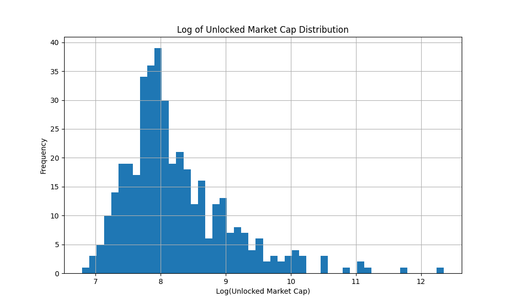
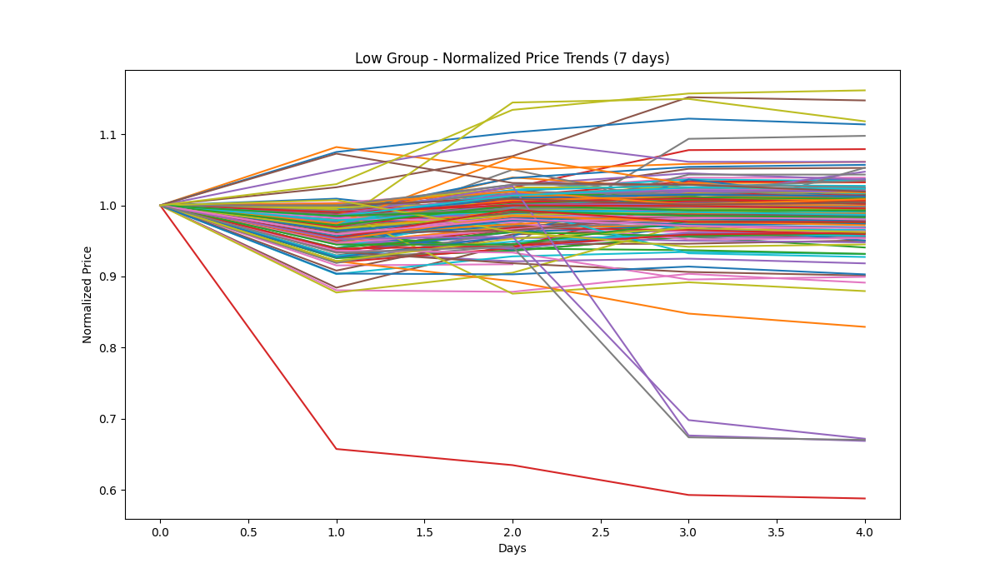
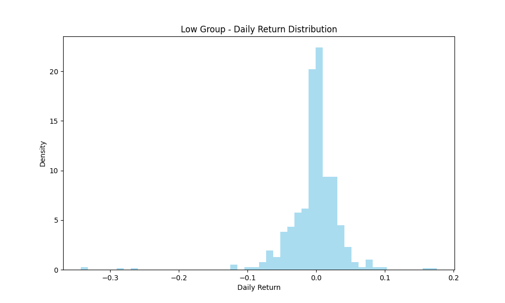
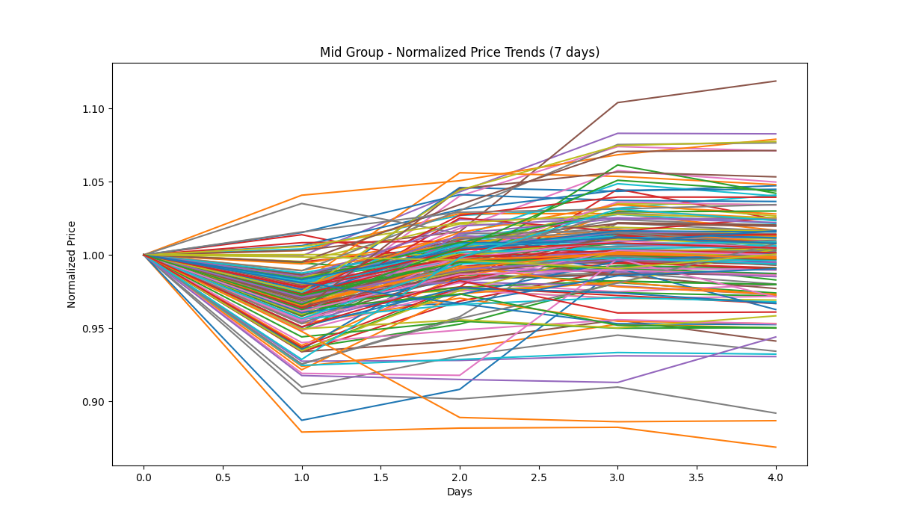
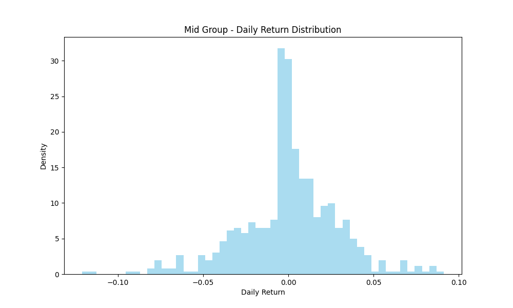
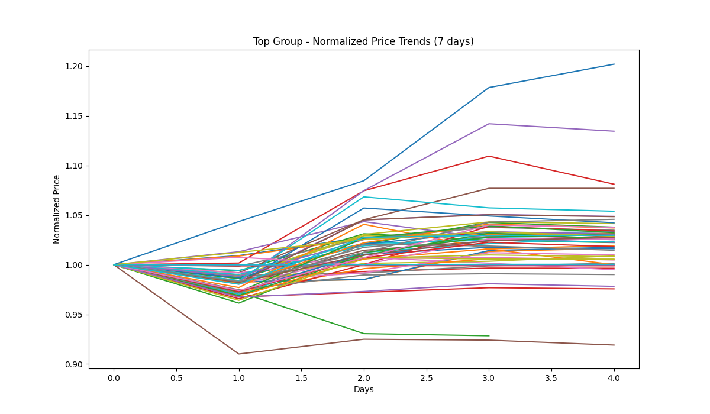
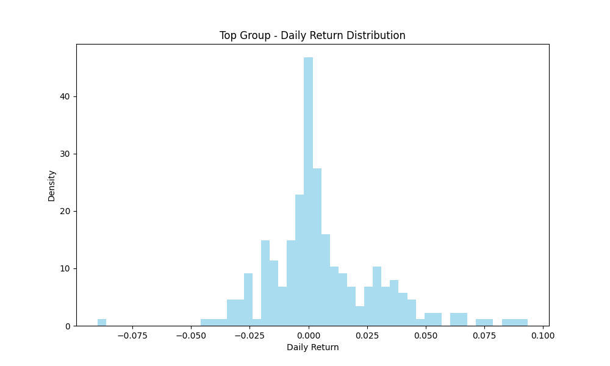

# Cryptocurrency Analysis Report

## Market Cap Distribution

### Comparative Descriptive Statistics

|                           | Low            | Mid             | Top                |
|:--------------------------|:---------------|:----------------|:-------------------|
| Number of Tokens          | 189            | 154             | 60                 |
| Mean Market Cap (USD)     | $50,005,868.04 | $315,175,948.64 | $59,304,084,261.28 |
| Median Market Cap (USD)   | $50,815,369.74 | $217,043,778.38 | $2,982,316,528.41  |
| Mean Circ. Supply Ratio   | 70.25%         | 76.89%          | 78.62%             |
| Median Circ. Supply Ratio | 79.71%         | 90.32%          | 90.18%             |
| Avg. Daily Return         | -0.4832%       | -0.3274%        | 0.2770%            |
| Volatility                | 4.2791%        | 2.9209%         | 2.7875%            |
| Sharpe Ratio (Annualized) | -2.16          | -2.14           | 1.90               |
| Avg. 24h Volume           | $13,385,062.30 | $26,802,778.92  | $2,324,780,286.80  |
| Avg. Turnover Rate        | 32.19%         | 10.63%          | 11.47%             |

*Note: Token age and category proportions are not available with the current data sources.*
## Low Group Analysis

### Price Trend Consistency

### Risk and Return Analysis

- **Average Historical Volatility:** 0.4978
- **Average Beta (vs. BTC):** 1.22
- **Average VaR (95%):** -0.0417
- **Average CVaR (95%):** -0.0417
- **Average Skewness:** -0.18
- **Average Kurtosis:** -1.08

### Statistical Summary (Latest Day)

|       |         open |         high |          low |        close |           volume |   unlocked_mkt_cap |      volume_24h |   volume_market_cap_24h |
|:------|-------------:|-------------:|-------------:|-------------:|-----------------:|-------------------:|----------------:|------------------------:|
| count |  189         |  189         |  189         |  189         |    189           |      189           |   189           |             189         |
| mean  |   11.4772    |   11.6277    |   11.4531    |   11.5155    |      9.97166e+06 |        5.00059e+07 |     1.33851e+07 |               0.321939  |
| std   |  130.495     |  132.337     |  130.241     |  130.983     |      7.23399e+07 |        2.56979e+07 |     2.57976e+07 |               0.674793  |
| min   |    5.371e-05 |    5.384e-05 |    5.347e-05 |    5.355e-05 |     63.534       |        0           | 11934           |               0         |
| 25%   |    0.0373    |    0.0375    |    0.0371    |    0.0372    | 120404           |        2.72094e+07 |     3.13519e+06 |               0.0720581 |
| 50%   |    0.1211    |    0.1216    |    0.1186    |    0.1188    | 497277           |        5.08154e+07 |     6.66101e+06 |               0.141911  |
| 75%   |    0.3764    |    0.4103    |    0.3744    |    0.375     |      1.83264e+06 |        7.10773e+07 |     1.2251e+07  |               0.273812  |
| max   | 1785.7       | 1811         | 1782.2       | 1792.4       |      9.58663e+08 |        9.80555e+07 |     2.19208e+08 |               5.14512   |

## Mid Group Analysis

### Price Trend Consistency

### Risk and Return Analysis

- **Average Historical Volatility:** 0.4480
- **Average Beta (vs. BTC):** 1.19
- **Average VaR (95%):** -0.0338
- **Average CVaR (95%):** -0.0338
- **Average Skewness:** -0.12
- **Average Kurtosis:** -1.11

### Statistical Summary (Latest Day)

|       |         open |         high |          low |        close |           volume |   unlocked_mkt_cap |       volume_24h |   volume_market_cap_24h |
|:------|-------------:|-------------:|-------------:|-------------:|-----------------:|-------------------:|-----------------:|------------------------:|
| count |  154         |  154         |  154         |  154         |    154           |      154           |    154           |            154          |
| mean  |   37.8393    |   37.9133    |   37.5794    |   37.5984    |      6.43492e+07 |        3.15176e+08 |      2.68028e+07 |              0.106274   |
| std   |  428.928     |  429.573     |  425.948     |  426.028     |      4.35323e+08 |        2.3935e+08  |      3.01525e+07 |              0.15217    |
| min   |    1.962e-05 |    1.97e-05  |    1.951e-05 |    1.954e-05 |     15.25        |        1.00224e+08 | 701715           |              0.00521233 |
| 25%   |    0.052045  |    0.0523425 |    0.0514875 |    0.0517275 |  86799.9         |        1.31457e+08 |      6.97284e+06 |              0.0337596  |
| 50%   |    0.28065   |    0.2817    |    0.27675   |    0.27815   | 438021           |        2.17044e+08 |      1.53964e+07 |              0.0595733  |
| 75%   |    1.25075   |    1.255     |    1.2415    |    1.244     |      2.87174e+06 |        4.0783e+08  |      3.71068e+07 |              0.128754   |
| max   | 5324         | 5332         | 5287         | 5288         |      4.85992e+09 |        9.37095e+08 |      1.54662e+08 |              1.492      |

## Top Group Analysis

### Price Trend Consistency

### Risk and Return Analysis

- **Average Historical Volatility:** 0.3649
- **Average Beta (vs. BTC):** 1.53
- **Average VaR (95%):** -0.0181
- **Average CVaR (95%):** -0.0181
- **Average Skewness:** 0.18
- **Average Kurtosis:** -1.10

### Statistical Summary (Latest Day)

|       |          open |          high |           low |         close |           volume |   unlocked_mkt_cap |   volume_24h |   volume_market_cap_24h |
|:------|--------------:|--------------:|--------------:|--------------:|-----------------:|-------------------:|-------------:|------------------------:|
| count |     60        |     60        |     60        |     60        |     60           |       60           | 60           |            60           |
| mean  |   3986.05     |   4002.95     |   3982.56     |   3989.15     |      7.69433e+09 |        5.93041e+10 |  2.32478e+09 |             0.114706    |
| std   |  20195        |  20279.6      |  20180.6      |  20212.3      |      4.62153e+10 |        2.943e+11   |  8.85646e+09 |             0.436648    |
| min   |      9.88e-06 |      9.97e-06 |      9.87e-06 |      9.93e-06 |      0.85963     |        1.00249e+09 |  3.97014e+06 |             0.000269273 |
| 25%   |      0.519775 |      0.522075 |      0.518775 |      0.5202   |  39256.8         |        1.65904e+09 |  8.31079e+07 |             0.0250502   |
| 50%   |      1.981    |      1.987    |      1.973    |      1.977    | 308078           |        2.98232e+09 |  1.73271e+08 |             0.0500179   |
| 75%   |     21.5525   |     21.67     |     21.4975   |     21.545    |      4.97003e+06 |        1.08389e+10 |  6.64272e+08 |             0.0823781   |
| max   | 111717        | 112180        | 111643        | 111815        |      3.51472e+11 |        2.22815e+12 |  5.81352e+10 |             3.42293     |

