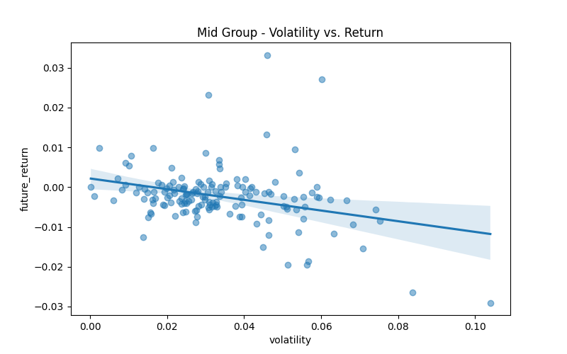
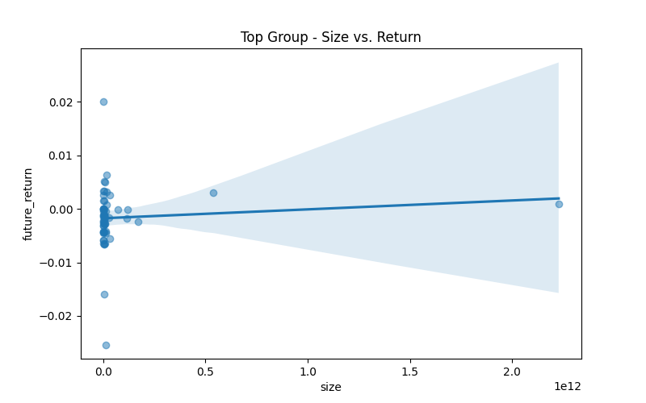

# Cryptocurrency Analysis Report

## Market Cap Distribution

### Comparative Descriptive Statistics

|                           | Low            | Mid             | Top                |
|:--------------------------|:---------------|:----------------|:-------------------|
| Number of Tokens          | 189            | 154             | 60                 |
| Mean Market Cap (USD)     | $50,005,868.04 | $315,175,948.64 | $59,304,084,261.28 |
| Median Market Cap (USD)   | $50,815,369.74 | $217,043,778.38 | $2,982,316,528.41  |
| Mean Circ. Supply Ratio   | 70.25%         | 76.89%          | 78.62%             |
| Median Circ. Supply Ratio | 79.71%         | 90.32%          | 90.18%             |
| Avg. Daily Return         | -0.4832%       | -0.3274%        | 0.2770%            |
| Volatility                | 4.2791%        | 2.9209%         | 2.7875%            |
| Sharpe Ratio (Annualized) | -2.16          | -2.14           | 1.90               |
| Avg. 24h Volume           | $13,385,062.30 | $26,802,778.92  | $2,324,780,286.80  |
| Avg. Turnover Rate        | 32.19%         | 10.63%          | 11.47%             |

*Note: Token age and category proportions are not available with the current data sources.*
## Low Group Analysis

### Price Trend Consistency

### Risk and Return Analysis

*   **Historical Volatility:** The standard deviation of daily returns, annualized. A measure of how much the price fluctuates.
*   **Beta (vs. BTC):** A measure of a coin's volatility in relation to Bitcoin.
*   **VaR (Value at Risk) (95%):** The maximum expected loss on a given day, with 95% confidence. For example, a VaR of -0.05 means there is a 5% chance of losing at least 5% in a day.
*   **CVaR (Conditional VaR) (95%):** The expected loss on a given day, *given* that the loss is greater than the VaR. It's a measure of "how bad can things get?".
*   **Skewness:** A measure of the asymmetry of the return distribution. Positive skew suggests a greater chance of large positive returns, while negative skew suggests a greater chance of large negative returns.
*   **Kurtosis:** A measure of the "tailedness" of the return distribution. High kurtosis ("fat tails") means there is a higher probability of extreme price movements (both positive and negative).

- **Average Historical Volatility:** 0.4978
- **Average Beta (vs. BTC):** 1.22 (More volatile than BTC)
- **Average VaR (95%):** -0.0417
- **Average CVaR (95%):** -0.0417
- **Average Skewness:** -0.18 (Relatively symmetrical)
- **Average Kurtosis:** -1.08 (Normal tails)

### Statistical Summary (Latest Day)

|       |         open |         high |          low |        close |           volume |   unlocked_mkt_cap |      volume_24h |   volume_market_cap_24h |
|:------|-------------:|-------------:|-------------:|-------------:|-----------------:|-------------------:|----------------:|------------------------:|
| count |  189         |  189         |  189         |  189         |    189           |      189           |   189           |             189         |
| mean  |   11.4772    |   11.6277    |   11.4531    |   11.5155    |      9.97166e+06 |        5.00059e+07 |     1.33851e+07 |               0.321939  |
| std   |  130.495     |  132.337     |  130.241     |  130.983     |      7.23399e+07 |        2.56979e+07 |     2.57976e+07 |               0.674793  |
| min   |    5.371e-05 |    5.384e-05 |    5.347e-05 |    5.355e-05 |     63.534       |        0           | 11934           |               0         |
| 25%   |    0.0373    |    0.0375    |    0.0371    |    0.0372    | 120404           |        2.72094e+07 |     3.13519e+06 |               0.0720581 |
| 50%   |    0.1211    |    0.1216    |    0.1186    |    0.1188    | 497277           |        5.08154e+07 |     6.66101e+06 |               0.141911  |
| 75%   |    0.3764    |    0.4103    |    0.3744    |    0.375     |      1.83264e+06 |        7.10773e+07 |     1.2251e+07  |               0.273812  |
| max   | 1785.7       | 1811         | 1782.2       | 1792.4       |      9.58663e+08 |        9.80555e+07 |     2.19208e+08 |               5.14512   |

## Mid Group Analysis

### Price Trend Consistency

### Risk and Return Analysis

*   **Historical Volatility:** The standard deviation of daily returns, annualized. A measure of how much the price fluctuates.
*   **Beta (vs. BTC):** A measure of a coin's volatility in relation to Bitcoin.
*   **VaR (Value at Risk) (95%):** The maximum expected loss on a given day, with 95% confidence. For example, a VaR of -0.05 means there is a 5% chance of losing at least 5% in a day.
*   **CVaR (Conditional VaR) (95%):** The expected loss on a given day, *given* that the loss is greater than the VaR. It's a measure of "how bad can things get?".
*   **Skewness:** A measure of the asymmetry of the return distribution. Positive skew suggests a greater chance of large positive returns, while negative skew suggests a greater chance of large negative returns.
*   **Kurtosis:** A measure of the "tailedness" of the return distribution. High kurtosis ("fat tails") means there is a higher probability of extreme price movements (both positive and negative).

- **Average Historical Volatility:** 0.4480
- **Average Beta (vs. BTC):** 1.19 (More volatile than BTC)
- **Average VaR (95%):** -0.0338
- **Average CVaR (95%):** -0.0338
- **Average Skewness:** -0.12 (Relatively symmetrical)
- **Average Kurtosis:** -1.11 (Normal tails)

### Statistical Summary (Latest Day)

|       |         open |         high |          low |        close |           volume |   unlocked_mkt_cap |       volume_24h |   volume_market_cap_24h |
|:------|-------------:|-------------:|-------------:|-------------:|-----------------:|-------------------:|-----------------:|------------------------:|
| count |  154         |  154         |  154         |  154         |    154           |      154           |    154           |            154          |
| mean  |   37.8393    |   37.9133    |   37.5794    |   37.5984    |      6.43492e+07 |        3.15176e+08 |      2.68028e+07 |              0.106274   |
| std   |  428.928     |  429.573     |  425.948     |  426.028     |      4.35323e+08 |        2.3935e+08  |      3.01525e+07 |              0.15217    |
| min   |    1.962e-05 |    1.97e-05  |    1.951e-05 |    1.954e-05 |     15.25        |        1.00224e+08 | 701715           |              0.00521233 |
| 25%   |    0.052045  |    0.0523425 |    0.0514875 |    0.0517275 |  86799.9         |        1.31457e+08 |      6.97284e+06 |              0.0337596  |
| 50%   |    0.28065   |    0.2817    |    0.27675   |    0.27815   | 438021           |        2.17044e+08 |      1.53964e+07 |              0.0595733  |
| 75%   |    1.25075   |    1.255     |    1.2415    |    1.244     |      2.87174e+06 |        4.0783e+08  |      3.71068e+07 |              0.128754   |
| max   | 5324         | 5332         | 5287         | 5288         |      4.85992e+09 |        9.37095e+08 |      1.54662e+08 |              1.492      |

## Top Group Analysis

### Price Trend Consistency

### Risk and Return Analysis

*   **Historical Volatility:** The standard deviation of daily returns, annualized. A measure of how much the price fluctuates.
*   **Beta (vs. BTC):** A measure of a coin's volatility in relation to Bitcoin.
*   **VaR (Value at Risk) (95%):** The maximum expected loss on a given day, with 95% confidence. For example, a VaR of -0.05 means there is a 5% chance of losing at least 5% in a day.
*   **CVaR (Conditional VaR) (95%):** The expected loss on a given day, *given* that the loss is greater than the VaR. It's a measure of "how bad can things get?".
*   **Skewness:** A measure of the asymmetry of the return distribution. Positive skew suggests a greater chance of large positive returns, while negative skew suggests a greater chance of large negative returns.
*   **Kurtosis:** A measure of the "tailedness" of the return distribution. High kurtosis ("fat tails") means there is a higher probability of extreme price movements (both positive and negative).

- **Average Historical Volatility:** 0.3649
- **Average Beta (vs. BTC):** 1.53 (More volatile than BTC)
- **Average VaR (95%):** -0.0181
- **Average CVaR (95%):** -0.0181
- **Average Skewness:** 0.18 (Relatively symmetrical)
- **Average Kurtosis:** -1.10 (Normal tails)

### Statistical Summary (Latest Day)

|       |          open |          high |           low |         close |           volume |   unlocked_mkt_cap |   volume_24h |   volume_market_cap_24h |
|:------|--------------:|--------------:|--------------:|--------------:|-----------------:|-------------------:|-------------:|------------------------:|
| count |     60        |     60        |     60        |     60        |     60           |       60           | 60           |            60           |
| mean  |   3986.05     |   4002.95     |   3982.56     |   3989.15     |      7.69433e+09 |        5.93041e+10 |  2.32478e+09 |             0.114706    |
| std   |  20195        |  20279.6      |  20180.6      |  20212.3      |      4.62153e+10 |        2.943e+11   |  8.85646e+09 |             0.436648    |
| min   |      9.88e-06 |      9.97e-06 |      9.87e-06 |      9.93e-06 |      0.85963     |        1.00249e+09 |  3.97014e+06 |             0.000269273 |
| 25%   |      0.519775 |      0.522075 |      0.518775 |      0.5202   |  39256.8         |        1.65904e+09 |  8.31079e+07 |             0.0250502   |
| 50%   |      1.981    |      1.987    |      1.973    |      1.977    | 308078           |        2.98232e+09 |  1.73271e+08 |             0.0500179   |
| 75%   |     21.5525   |     21.67     |     21.4975   |     21.545    |      4.97003e+06 |        1.08389e+10 |  6.64272e+08 |             0.0823781   |
| max   | 111717        | 112180        | 111643        | 111815        |      3.51472e+11 |        2.22815e+12 |  5.81352e+10 |             3.42293     |

## Factor Validation Report
### Low Group
### Factor Effectiveness Testing

#### Information Coefficient (IC) Analysis

*IC (Information Coefficient) measures the correlation between a factor and subsequent returns. A higher absolute IC value indicates a stronger predictive power.*
*   **> 0.05:** Strong signal
*   **0.02 - 0.05:** Normal signal
*   **0 - 0.02:** Weak signal

**P-value:** The P-value indicates the statistical significance of the IC. A low P-value (typically < 0.05) suggests that the observed correlation is unlikely to be due to random chance.

**Pearson vs. Spearman Correlation:**
*   **Pearson IC:** Measures the linear relationship between the factor and returns. It's sensitive to outliers.
*   **Spearman IC:** Measures the monotonic relationship (whether the factor and returns move in the same direction, but not necessarily at a constant rate). It is less sensitive to outliers.

| Factor     |   Pearson IC | Pearson Signal   |   Pearson P-value | Pearson Significant (p < 0.05)   |   Spearman IC | Spearman Signal   |   Spearman P-value | Spearman Significant (p < 0.05)   |
|:-----------|-------------:|:-----------------|------------------:|:---------------------------------|--------------:|:------------------|-------------------:|:----------------------------------|
| Size       |       0.1064 | Strong           |            0.1474 | No                               |        0.0728 | Strong            |             0.3221 | No                                |
| Momentum   |       0.1814 | Strong           |            0.013  | Yes                              |        0.1347 | Strong            |             0.0661 | No                                |
| Liquidity  |      -0.2119 | Strong           |            0.0036 | Yes                              |       -0.0899 | Strong            |             0.2212 | No                                |
| Value      |      -0.0427 | Normal           |            0.5617 | No                               |        0.0899 | Strong            |             0.2212 | No                                |
| Tokenomics |      -0.1226 | Strong           |            0.0947 | No                               |       -0.0526 | Strong            |             0.4747 | No                                |
| Volatility |      -0.2338 | Strong           |            0.0013 | Yes                              |       -0.2197 | Strong            |             0.0025 | Yes                               |

### Mid Group
### Factor Effectiveness Testing

#### Information Coefficient (IC) Analysis

*IC (Information Coefficient) measures the correlation between a factor and subsequent returns. A higher absolute IC value indicates a stronger predictive power.*
*   **> 0.05:** Strong signal
*   **0.02 - 0.05:** Normal signal
*   **0 - 0.02:** Weak signal

**P-value:** The P-value indicates the statistical significance of the IC. A low P-value (typically < 0.05) suggests that the observed correlation is unlikely to be due to random chance.

**Pearson vs. Spearman Correlation:**
*   **Pearson IC:** Measures the linear relationship between the factor and returns. It's sensitive to outliers.
*   **Spearman IC:** Measures the monotonic relationship (whether the factor and returns move in the same direction, but not necessarily at a constant rate). It is less sensitive to outliers.

| Factor     |   Pearson IC | Pearson Signal   |   Pearson P-value | Pearson Significant (p < 0.05)   |   Spearman IC | Spearman Signal   |   Spearman P-value | Spearman Significant (p < 0.05)   |
|:-----------|-------------:|:-----------------|------------------:|:---------------------------------|--------------:|:------------------|-------------------:|:----------------------------------|
| Size       |      -0.0314 | Normal           |            0.6994 | No                               |       -0.0406 | Normal            |             0.6172 | No                                |
| Momentum   |      -0.0041 | Weak             |            0.9594 | No                               |        0.0003 | Weak              |             0.9967 | No                                |
| Liquidity  |      -0.0835 | Strong           |            0.3031 | No                               |       -0.0976 | Strong            |             0.2284 | No                                |
| Value      |       0.029  | Normal           |            0.721  | No                               |        0.0976 | Strong            |             0.2284 | No                                |
| Tokenomics |       0.0856 | Strong           |            0.2913 | No                               |        0.0255 | Normal            |             0.7535 | No                                |
| Volatility |      -0.3193 | Strong           |            0.0001 | Yes                              |       -0.262  | Strong            |             0.001  | Yes                               |

### Top Group
### Factor Effectiveness Testing

#### Information Coefficient (IC) Analysis

*IC (Information Coefficient) measures the correlation between a factor and subsequent returns. A higher absolute IC value indicates a stronger predictive power.*
*   **> 0.05:** Strong signal
*   **0.02 - 0.05:** Normal signal
*   **0 - 0.02:** Weak signal

**P-value:** The P-value indicates the statistical significance of the IC. A low P-value (typically < 0.05) suggests that the observed correlation is unlikely to be due to random chance.

**Pearson vs. Spearman Correlation:**
*   **Pearson IC:** Measures the linear relationship between the factor and returns. It's sensitive to outliers.
*   **Spearman IC:** Measures the monotonic relationship (whether the factor and returns move in the same direction, but not necessarily at a constant rate). It is less sensitive to outliers.

| Factor     |   Pearson IC | Pearson Signal   |   Pearson P-value | Pearson Significant (p < 0.05)   |   Spearman IC | Spearman Signal   |   Spearman P-value | Spearman Significant (p < 0.05)   |
|:-----------|-------------:|:-----------------|------------------:|:---------------------------------|--------------:|:------------------|-------------------:|:----------------------------------|
| Size       |       0.0888 | Strong           |            0.5035 | No                               |        0.099  | Strong            |             0.4556 | No                                |
| Momentum   |       0.0474 | Normal           |            0.7213 | No                               |       -0.2461 | Strong            |             0.0602 | No                                |
| Liquidity  |       0.0256 | Normal           |            0.8475 | No                               |       -0.2184 | Strong            |             0.0965 | No                                |
| Value      |       0.1229 | Strong           |            0.3536 | No                               |        0.2184 | Strong            |             0.0965 | No                                |
| Tokenomics |      -0.0793 | Strong           |            0.5504 | No                               |        0.1585 | Strong            |             0.2304 | No                                |
| Volatility |      -0.2947 | Strong           |            0.0235 | Yes                              |       -0.3698 | Strong            |             0.0039 | Yes                               |

## Clustering and Network Analysis
This section provides a deeper look into the sub-structures within each market cap group, using clustering and network analysis to identify coins with similar behaviors.

### Low Group
#### K-Means Clustering
The scatter plot below visualizes the clusters of coins based on their momentum and volatility. Each point represents a coin, and the color represents its cluster.

Cluster Characteristics:
|   cluster |   ('momentum', 'mean') |   ('momentum', 'std') |   ('volatility', 'mean') |   ('volatility', 'std') |   ('cluster', 'count') |
|----------:|-----------------------:|----------------------:|-------------------------:|------------------------:|-----------------------:|
|         0 |            -0.0193342  |             0.0435927 |                0.0512808 |              0.018887   |                     72 |
|         1 |             0.00965769 |             0.0306343 |                0.0229844 |              0.00956291 |                    112 |
|         2 |            -0.339668   |             0.0462921 |                0.168615  |              0.0274241  |                      4 |

#### Correlation Network Analysis
The network graph visualizes the correlation between coins in the group. An edge between two coins means they have a strong price correlation (Pearson > 0.7). The more connections a node has, the more central it is to the group's price movements.

Top 5 Most Central Nodes (by Degree Centrality):
- ONGUSDT: 1.0106
- IOSTUSDT: 1.0106
- CELRUSDT: 1.0106
- DUSKUSDT: 1.0106
- WINUSDT: 1.0106

#### Key Observations
- Cluster 1 is the largest, suggesting a significant number of coins in this group share similar momentum and volatility characteristics.
- **ONGUSDT** is the most central coin in this group's correlation network, suggesting its price movements are highly correlated with other coins in the group.
### Mid Group
#### K-Means Clustering
The scatter plot below visualizes the clusters of coins based on their momentum and volatility. Each point represents a coin, and the color represents its cluster.

Cluster Characteristics:
|   cluster |   ('momentum', 'mean') |   ('momentum', 'std') |   ('volatility', 'mean') |   ('volatility', 'std') |   ('cluster', 'count') |
|----------:|-----------------------:|----------------------:|-------------------------:|------------------------:|-----------------------:|
|         0 |             0.00723441 |             0.0189568 |                0.024035  |              0.00910775 |                     99 |
|         1 |            -0.0474552  |             0.0287715 |                0.0452068 |              0.0132014  |                     26 |
|         2 |             0.0357041  |             0.0275619 |                0.0556206 |              0.0145046  |                     29 |

#### Correlation Network Analysis
The network graph visualizes the correlation between coins in the group. An edge between two coins means they have a strong price correlation (Pearson > 0.7). The more connections a node has, the more central it is to the group's price movements.

Top 5 Most Central Nodes (by Degree Centrality):
- STGUSDT: 0.9346
- ZENUSDT: 0.9281
- SANDUSDT: 0.9281
- TWTUSDT: 0.9281
- GMTUSDT: 0.9281

#### Key Observations
- Cluster 0 is the largest, suggesting a significant number of coins in this group share similar momentum and volatility characteristics.
- **STGUSDT** is the most central coin in this group's correlation network, suggesting its price movements are highly correlated with other coins in the group.
### Top Group
#### K-Means Clustering
The scatter plot below visualizes the clusters of coins based on their momentum and volatility. Each point represents a coin, and the color represents its cluster.

Cluster Characteristics:
|   cluster |   ('momentum', 'mean') |   ('momentum', 'std') |   ('volatility', 'mean') |   ('volatility', 'std') |   ('cluster', 'count') |
|----------:|-----------------------:|----------------------:|-------------------------:|------------------------:|-----------------------:|
|         0 |              0.0306145 |             0.0269748 |                0.0379507 |              0.00930883 |                     25 |
|         1 |              0.143207  |             0.034534  |                0.039646  |              0.0159486  |                      3 |
|         2 |              0.0133449 |             0.0165657 |                0.0163527 |              0.00875842 |                     31 |

#### Correlation Network Analysis
The network graph visualizes the correlation between coins in the group. An edge between two coins means they have a strong price correlation (Pearson > 0.7). The more connections a node has, the more central it is to the group's price movements.

Top 5 Most Central Nodes (by Degree Centrality):
- SEIUSDT: 0.8814
- LTCUSDT: 0.8644
- ETCUSDT: 0.8644
- VETUSDT: 0.8644
- STXUSDT: 0.8644

#### Key Observations
- Cluster 2 is the largest, suggesting a significant number of coins in this group share similar momentum and volatility characteristics.
- **SEIUSDT** is the most central coin in this group's correlation network, suggesting its price movements are highly correlated with other coins in the group.

## Factor Visualization and Comparative Analysis
### Low Group Factor Analysis
#### Factor Correlation Heatmap

#### Factor vs. Return Scatter Plots

### Mid Group Factor Analysis
#### Factor Correlation Heatmap

#### Factor vs. Return Scatter Plots

### Top Group Factor Analysis
#### Factor Correlation Heatmap

#### Factor vs. Return Scatter Plots

### Comparative Analysis Across Groups
#### Average Factor Values

