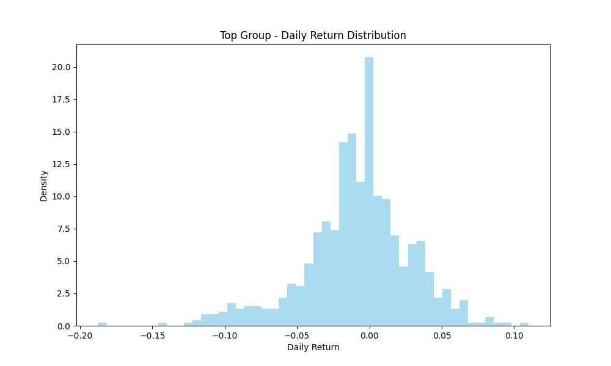
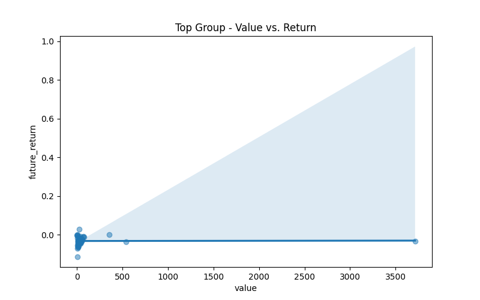

# Cryptocurrency Analysis Report

## Market Cap Distribution

### Comparative Descriptive Statistics

|                           | Low            | Mid             | Top                |
|:--------------------------|:---------------|:----------------|:-------------------|
| Number of Tokens          | 189            | 154             | 60                 |
| Mean Market Cap (USD)     | $50,005,868.04 | $315,175,948.64 | $59,304,084,261.28 |
| Median Market Cap (USD)   | $50,815,369.74 | $217,043,778.38 | $2,982,316,528.41  |
| Mean Circ. Supply Ratio   | 70.25%         | 76.89%          | 78.62%             |
| Median Circ. Supply Ratio | 79.71%         | 90.32%          | 90.18%             |
| Avg. Daily Return         | -0.4022%       | -0.1478%        | -0.1046%           |
| Volatility                | 5.2766%        | 6.2522%         | 4.5869%            |
| Sharpe Ratio (Annualized) | -1.46          | -0.45           | -0.44              |
| Avg. 24h Volume           | $13,385,062.30 | $26,802,778.92  | $2,324,780,286.80  |
| Avg. Turnover Rate        | 32.19%         | 10.63%          | 11.47%             |

*Note: Token age and category proportions are not available with the current data sources.*
## Low Group Analysis

### Price Trend Consistency

### Risk and Return Analysis

*   **Historical Volatility:** The standard deviation of daily returns, annualized. A measure of how much the price fluctuates.
*   **Beta (vs. BTC):** A measure of a coin's volatility in relation to Bitcoin.
*   **VaR (Value at Risk) (95%):** The maximum expected loss on a given day, with 95% confidence. For example, a VaR of -0.05 means there is a 5% chance of losing at least 5% in a day.
*   **CVaR (Conditional VaR) (95%):** The expected loss on a given day, *given* that the loss is greater than the VaR. It's a measure of "how bad can things get?".
*   **Skewness:** A measure of the asymmetry of the return distribution. Positive skew suggests a greater chance of large positive returns, while negative skew suggests a greater chance of large negative returns.
*   **Kurtosis:** A measure of the "tailedness" of the return distribution. High kurtosis ("fat tails") means there is a higher probability of extreme price movements (both positive and negative).

- **Average Historical Volatility:** 0.6986
- **Average Beta (vs. BTC):** 1.19 (More volatile than BTC)
- **Average VaR (95%):** -0.0898
- **Average CVaR (95%):** -0.0898
- **Average Skewness:** -0.10 (Relatively symmetrical)
- **Average Kurtosis:** -0.22 (Normal tails)

### Statistical Summary (Latest Day)

|       |         open |         high |          low |       close |         volume |   unlocked_mkt_cap |      volume_24h |   volume_market_cap_24h |
|:------|-------------:|-------------:|-------------:|------------:|---------------:|-------------------:|----------------:|------------------------:|
| count |  189         |  189         |  189         |  189        |  189           |      189           |   189           |             189         |
| mean  |   11.4772    |   11.6333    |   11.0685    |   11.2084   |    1.30856e+08 |        5.00059e+07 |     1.33851e+07 |               0.321939  |
| std   |  130.495     |  132.337     |  126.143     |  127.689    |    7.49076e+08 |        2.56979e+07 |     2.57976e+07 |               0.674793  |
| min   |    5.371e-05 |    5.384e-05 |    5.134e-05 |    5.17e-05 | 2057.36        |        0           | 11934           |               0         |
| 25%   |    0.0373    |    0.0375    |    0.03037   |    0.031    |    1.9745e+06  |        2.72094e+07 |     3.13519e+06 |               0.0720581 |
| 50%   |    0.1211    |    0.1216    |    0.1107    |    0.113    |    1.04367e+07 |        5.08154e+07 |     6.66101e+06 |               0.141911  |
| 75%   |    0.3764    |    0.4103    |    0.3589    |    0.3635   |    4.1516e+07  |        7.10773e+07 |     1.2251e+07  |               0.273812  |
| max   | 1785.7       | 1811         | 1726.4       | 1747.6      |    9.25093e+09 |        9.80555e+07 |     2.19208e+08 |               5.14512   |

## Mid Group Analysis

### Price Trend Consistency

### Risk and Return Analysis

*   **Historical Volatility:** The standard deviation of daily returns, annualized. A measure of how much the price fluctuates.
*   **Beta (vs. BTC):** A measure of a coin's volatility in relation to Bitcoin.
*   **VaR (Value at Risk) (95%):** The maximum expected loss on a given day, with 95% confidence. For example, a VaR of -0.05 means there is a 5% chance of losing at least 5% in a day.
*   **CVaR (Conditional VaR) (95%):** The expected loss on a given day, *given* that the loss is greater than the VaR. It's a measure of "how bad can things get?".
*   **Skewness:** A measure of the asymmetry of the return distribution. Positive skew suggests a greater chance of large positive returns, while negative skew suggests a greater chance of large negative returns.
*   **Kurtosis:** A measure of the "tailedness" of the return distribution. High kurtosis ("fat tails") means there is a higher probability of extreme price movements (both positive and negative).

- **Average Historical Volatility:** 0.7165
- **Average Beta (vs. BTC):** 1.70 (More volatile than BTC)
- **Average VaR (95%):** -0.0846
- **Average CVaR (95%):** -0.0846
- **Average Skewness:** -0.00 (Relatively symmetrical)
- **Average Kurtosis:** -0.17 (Normal tails)

### Statistical Summary (Latest Day)

|       |         open |         high |          low |        close |        volume |   unlocked_mkt_cap |       volume_24h |   volume_market_cap_24h |
|:------|-------------:|-------------:|-------------:|-------------:|--------------:|-------------------:|-----------------:|------------------------:|
| count |  154         |  154         |  154         |  154         | 154           |      154           |    154           |            154          |
| mean  |   37.8393    |   37.915     |   36.3285    |   36.7423    |   1.23534e+09 |        3.15176e+08 |      2.68028e+07 |              0.106274   |
| std   |  428.928     |  429.573     |  411.773     |  416.365     |   8.1853e+09  |        2.3935e+08  |      3.01525e+07 |              0.15217    |
| min   |    1.962e-05 |    1.97e-05  |    1.904e-05 |    1.926e-05 | 218.836       |        1.00224e+08 | 701715           |              0.00521233 |
| 25%   |    0.052045  |    0.0527775 |    0.0490525 |    0.0507625 |   1.81018e+06 |        1.31457e+08 |      6.97284e+06 |              0.0337596  |
| 50%   |    0.28065   |    0.2817    |    0.2647    |    0.2671    |   7.45659e+06 |        2.17044e+08 |      1.53964e+07 |              0.0595733  |
| 75%   |    1.25075   |    1.255     |    1.1905    |    1.20625   |   4.32789e+07 |        4.0783e+08  |      3.71068e+07 |              0.128754   |
| max   | 5324         | 5332         | 5111         | 5168         |   8.70637e+10 |        9.37095e+08 |      1.54662e+08 |              1.492      |

## Top Group Analysis

### Price Trend Consistency

### Risk and Return Analysis

*   **Historical Volatility:** The standard deviation of daily returns, annualized. A measure of how much the price fluctuates.
*   **Beta (vs. BTC):** A measure of a coin's volatility in relation to Bitcoin.
*   **VaR (Value at Risk) (95%):** The maximum expected loss on a given day, with 95% confidence. For example, a VaR of -0.05 means there is a 5% chance of losing at least 5% in a day.
*   **CVaR (Conditional VaR) (95%):** The expected loss on a given day, *given* that the loss is greater than the VaR. It's a measure of "how bad can things get?".
*   **Skewness:** A measure of the asymmetry of the return distribution. Positive skew suggests a greater chance of large positive returns, while negative skew suggests a greater chance of large negative returns.
*   **Kurtosis:** A measure of the "tailedness" of the return distribution. High kurtosis ("fat tails") means there is a higher probability of extreme price movements (both positive and negative).

- **Average Historical Volatility:** 0.5569
- **Average Beta (vs. BTC):** 1.67 (More volatile than BTC)
- **Average VaR (95%):** -0.0811
- **Average CVaR (95%):** -0.0811
- **Average Skewness:** -0.39 (Relatively symmetrical)
- **Average Kurtosis:** -0.06 (Normal tails)

### Statistical Summary (Latest Day)

|       |          open |          high |           low |         close |       volume |   unlocked_mkt_cap |   volume_24h |   volume_market_cap_24h |
|:------|--------------:|--------------:|--------------:|--------------:|-------------:|-------------------:|-------------:|------------------------:|
| count |     60        |     60        |     60        |     60        | 60           |       60           | 60           |            60           |
| mean  |   3986.05     |   4002.96     |   3897.84     |   3942.96     |  1.30015e+11 |        5.93041e+10 |  2.32478e+09 |             0.114706    |
| std   |  20195        |  20279.6      |  19765        |  19998.2      |  7.38883e+11 |        2.943e+11   |  8.85646e+09 |             0.436648    |
| min   |      9.88e-06 |      9.97e-06 |      9.37e-06 |      9.45e-06 | 36.0927      |        1.00249e+09 |  3.97014e+06 |             0.000269273 |
| 25%   |      0.519775 |      0.522075 |      0.4908   |      0.495625 |  1.48226e+06 |        1.65904e+09 |  8.31079e+07 |             0.0250502   |
| 50%   |      1.981    |      1.987    |      1.8855   |      1.911    |  5.76415e+06 |        2.98232e+09 |  1.73271e+08 |             0.0500179   |
| 75%   |     21.5525   |     21.69     |     20.545    |     20.7375   |  8.23726e+07 |        1.08389e+10 |  6.64272e+08 |             0.0823781   |
| max   | 111717        | 112180        | 109336        | 110625        |  5.53265e+12 |        2.22815e+12 |  5.81352e+10 |             3.42293     |

## Factor Validation Report
### Low Group
### Factor Effectiveness Testing

#### Information Coefficient (IC) Analysis

*IC (Information Coefficient) measures the correlation between a factor and subsequent returns. A higher absolute IC value indicates a stronger predictive power.*
*   **> 0.05:** Strong signal
*   **0.02 - 0.05:** Normal signal
*   **0 - 0.02:** Weak signal

**P-value:** The P-value indicates the statistical significance of the IC. A low P-value (typically < 0.05) suggests that the observed correlation is unlikely to be due to random chance.

**Pearson vs. Spearman Correlation:**
*   **Pearson IC:** Measures the linear relationship between the factor and returns. It's sensitive to outliers.
*   **Spearman IC:** Measures the monotonic relationship (whether the factor and returns move in the same direction, but not necessarily at a constant rate). It is less sensitive to outliers.

| Factor     |   Pearson IC | Pearson Signal   |   Pearson P-value | Pearson Significant (p < 0.05)   |   Spearman IC | Spearman Signal   |   Spearman P-value | Spearman Significant (p < 0.05)   |
|:-----------|-------------:|:-----------------|------------------:|:---------------------------------|--------------:|:------------------|-------------------:|:----------------------------------|
| Size       |       0.0337 | Normal           |            0.6492 | No                               |        0.0141 | Weak              |             0.8487 | No                                |
| Momentum   |       0.2113 | Strong           |            0.0039 | Yes                              |        0.205  | Strong            |             0.0051 | Yes                               |
| Liquidity  |      -0.407  | Strong           |            0      | Yes                              |       -0.1658 | Strong            |             0.0241 | Yes                               |
| Value      |       0.0679 | Strong           |            0.3587 | No                               |        0.1658 | Strong            |             0.0241 | Yes                               |
| Tokenomics |      -0.0366 | Normal           |            0.6212 | No                               |        0.0492 | Normal            |             0.5062 | No                                |
| Volatility |      -0.4321 | Strong           |            0      | Yes                              |       -0.4399 | Strong            |             0      | Yes                               |

### Mid Group
### Factor Effectiveness Testing

#### Information Coefficient (IC) Analysis

*IC (Information Coefficient) measures the correlation between a factor and subsequent returns. A higher absolute IC value indicates a stronger predictive power.*
*   **> 0.05:** Strong signal
*   **0.02 - 0.05:** Normal signal
*   **0 - 0.02:** Weak signal

**P-value:** The P-value indicates the statistical significance of the IC. A low P-value (typically < 0.05) suggests that the observed correlation is unlikely to be due to random chance.

**Pearson vs. Spearman Correlation:**
*   **Pearson IC:** Measures the linear relationship between the factor and returns. It's sensitive to outliers.
*   **Spearman IC:** Measures the monotonic relationship (whether the factor and returns move in the same direction, but not necessarily at a constant rate). It is less sensitive to outliers.

| Factor     |   Pearson IC | Pearson Signal   |   Pearson P-value | Pearson Significant (p < 0.05)   |   Spearman IC | Spearman Signal   |   Spearman P-value | Spearman Significant (p < 0.05)   |
|:-----------|-------------:|:-----------------|------------------:|:---------------------------------|--------------:|:------------------|-------------------:|:----------------------------------|
| Size       |      -0.0031 | Weak             |            0.9698 | No                               |        0.0554 | Strong            |             0.4953 | No                                |
| Momentum   |       0.038  | Normal           |            0.6397 | No                               |        0.1999 | Strong            |             0.0129 | Yes                               |
| Liquidity  |      -0.2071 | Strong           |            0.01   | Yes                              |       -0.3663 | Strong            |             0      | Yes                               |
| Value      |       0.2558 | Strong           |            0.0014 | Yes                              |        0.3663 | Strong            |             0      | Yes                               |
| Tokenomics |       0.2405 | Strong           |            0.0027 | Yes                              |        0.2123 | Strong            |             0.0082 | Yes                               |
| Volatility |      -0.2889 | Strong           |            0.0003 | Yes                              |       -0.6031 | Strong            |             0      | Yes                               |

### Top Group
### Factor Effectiveness Testing

#### Information Coefficient (IC) Analysis

*IC (Information Coefficient) measures the correlation between a factor and subsequent returns. A higher absolute IC value indicates a stronger predictive power.*
*   **> 0.05:** Strong signal
*   **0.02 - 0.05:** Normal signal
*   **0 - 0.02:** Weak signal

**P-value:** The P-value indicates the statistical significance of the IC. A low P-value (typically < 0.05) suggests that the observed correlation is unlikely to be due to random chance.

**Pearson vs. Spearman Correlation:**
*   **Pearson IC:** Measures the linear relationship between the factor and returns. It's sensitive to outliers.
*   **Spearman IC:** Measures the monotonic relationship (whether the factor and returns move in the same direction, but not necessarily at a constant rate). It is less sensitive to outliers.

| Factor     |   Pearson IC | Pearson Signal   |   Pearson P-value | Pearson Significant (p < 0.05)   |   Spearman IC | Spearman Signal   |   Spearman P-value | Spearman Significant (p < 0.05)   |
|:-----------|-------------:|:-----------------|------------------:|:---------------------------------|--------------:|:------------------|-------------------:|:----------------------------------|
| Size       |       0.1517 | Strong           |            0.2515 | No                               |        0.2353 | Strong            |             0.0728 | No                                |
| Momentum   |       0.4611 | Strong           |            0.0002 | Yes                              |        0.532  | Strong            |             0      | Yes                               |
| Liquidity  |       0.1723 | Strong           |            0.1918 | No                               |       -0.254  | Strong            |             0.0522 | No                                |
| Value      |       0.0122 | Weak             |            0.9271 | No                               |        0.254  | Strong            |             0.0522 | No                                |
| Tokenomics |       0.1978 | Strong           |            0.1332 | No                               |        0.2608 | Strong            |             0.046  | Yes                               |
| Volatility |      -0.5967 | Strong           |            0      | Yes                              |       -0.7004 | Strong            |             0      | Yes                               |

## Clustering and Network Analysis
This section provides a deeper look into the sub-structures within each market cap group, using clustering and network analysis to identify coins with similar behaviors.

### Low Group
#### K-Means Clustering
The scatter plot below visualizes the clusters of coins based on their momentum and volatility. Each point represents a coin, and the color represents its cluster.

Cluster Characteristics:
|   cluster |   ('momentum', 'mean') |   ('momentum', 'std') |   ('volatility', 'mean') |   ('volatility', 'std') |   ('cluster', 'count') |
|----------:|-----------------------:|----------------------:|-------------------------:|------------------------:|-----------------------:|
|         0 |             -0.0852976 |             0.0403504 |                0.0334397 |              0.00984386 |                    101 |
|         1 |             -0.176502  |             0.0612785 |                0.0496636 |              0.0133923  |                     65 |
|         2 |              0.0221199 |             0.114135  |                0.0709504 |              0.0171231  |                     20 |

#### Correlation Network Analysis
The network graph visualizes the correlation between coins in the group. An edge between two coins means they have a strong price correlation (Pearson > 0.7). The more connections a node has, the more central it is to the group's price movements.

Top 5 Most Central Nodes (by Degree Centrality):
- ONGUSDT: 1.0106
- CELRUSDT: 1.0106
- IOSTUSDT: 1.0106
- DUSKUSDT: 1.0106
- WINUSDT: 1.0106

#### Key Observations
- Cluster 0 is the largest, suggesting a significant number of coins in this group share similar momentum and volatility characteristics.
- **ONGUSDT** is the most central coin in this group's correlation network, suggesting its price movements are highly correlated with other coins in the group.
### Mid Group
#### K-Means Clustering
The scatter plot below visualizes the clusters of coins based on their momentum and volatility. Each point represents a coin, and the color represents its cluster.

Cluster Characteristics:
|   cluster |   ('momentum', 'mean') |   ('momentum', 'std') |   ('volatility', 'mean') |   ('volatility', 'std') |   ('cluster', 'count') |
|----------:|-----------------------:|----------------------:|-------------------------:|------------------------:|-----------------------:|
|         0 |             -0.15136   |             0.0546126 |                0.0432511 |               0.0100023 |                     72 |
|         1 |              0.323021  |             0.16244   |                0.274348  |               0.0656845 |                      3 |
|         2 |             -0.0423956 |             0.0510669 |                0.0400835 |               0.016663  |                     79 |

#### Correlation Network Analysis
The network graph visualizes the correlation between coins in the group. An edge between two coins means they have a strong price correlation (Pearson > 0.7). The more connections a node has, the more central it is to the group's price movements.

Top 5 Most Central Nodes (by Degree Centrality):
- NEIROUSDT: 0.8366
- ZILUSDT: 0.8301
- SUSHIUSDT: 0.8301
- ARUSDT: 0.8301
- GLMUSDT: 0.8301

#### Key Observations
- Cluster 2 is the largest, suggesting a significant number of coins in this group share similar momentum and volatility characteristics.
- **NEIROUSDT** is the most central coin in this group's correlation network, suggesting its price movements are highly correlated with other coins in the group.
### Top Group
#### K-Means Clustering
The scatter plot below visualizes the clusters of coins based on their momentum and volatility. Each point represents a coin, and the color represents its cluster.

Cluster Characteristics:
|   cluster |   ('momentum', 'mean') |   ('momentum', 'std') |   ('volatility', 'mean') |   ('volatility', 'std') |   ('cluster', 'count') |
|----------:|-----------------------:|----------------------:|-------------------------:|------------------------:|-----------------------:|
|         0 |             -0.0167325 |             0.0404337 |               0.00907737 |              0.00920258 |                      9 |
|         1 |             -0.105839  |             0.0343693 |               0.0384464  |              0.00756964 |                     43 |
|         2 |              0.0292487 |             0.0467581 |               0.0500929  |              0.0116489  |                      7 |

#### Correlation Network Analysis
The network graph visualizes the correlation between coins in the group. An edge between two coins means they have a strong price correlation (Pearson > 0.7). The more connections a node has, the more central it is to the group's price movements.

Top 5 Most Central Nodes (by Degree Centrality):
- XRPUSDT: 0.9661
- LINKUSDT: 0.9661
- FETUSDT: 0.9661
- DOGEUSDT: 0.9661
- BCHUSDT: 0.9661

#### Key Observations
- Cluster 1 is the largest, suggesting a significant number of coins in this group share similar momentum and volatility characteristics.
- **XRPUSDT** is the most central coin in this group's correlation network, suggesting its price movements are highly correlated with other coins in the group.

## Factor Visualization and Comparative Analysis
### Low Group Factor Analysis
#### Factor Correlation Heatmap

#### Factor vs. Return Scatter Plots

### Mid Group Factor Analysis
#### Factor Correlation Heatmap

#### Factor vs. Return Scatter Plots

### Top Group Factor Analysis
#### Factor Correlation Heatmap

#### Factor vs. Return Scatter Plots

### Comparative Analysis Across Groups
#### Average Factor Values

